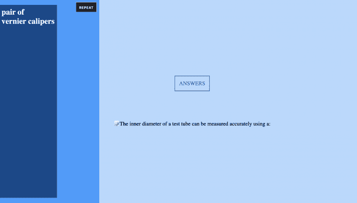
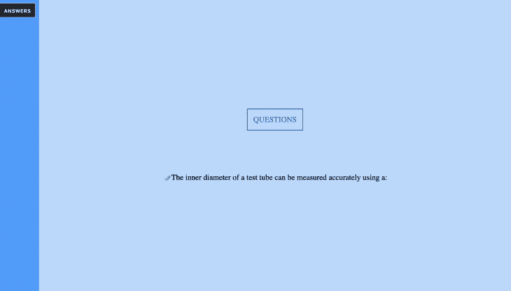

# 用前端框架部署状态机

> 原文：<https://blog.logrocket.com/deploying-state-machines-with-frontend-frameworks/>

在现代 web 应用程序中，有许多方式来表示状态。在 React 中，您可以在组件中本地封装您的状态，或者使用像 [Redux](https://redux.js.org/) 这样的状态管理库来全局管理您的状态。无论应用程序的状态以哪种方式表示，它通常由组件表示，这些组件可以被改变以确定应用程序如何被查看。

构建应用程序时，可能需要为应用程序的每种状态准备一个样式表。Web 应用程序已经变得越来越复杂，为应用程序中的每种状态形式创建一个样式表可能会导致复杂化。在这篇博文中，我们将学习如何使用有限状态机在我们的应用程序中创建交互式的复杂转换。

## 何时使用有限状态机

首先，有限状态机是解释系统行为的模型，该系统在某个时间点只能处于一种状态。状态机的工作是读取一系列输入，然后针对每个输入切换到不同的状态。比方说，你有一辆由状态机表示的汽车，它要么在移动，处于过渡状态(缓慢停止或缓慢启动)，要么静止不动。它不可能同时处于所有四种状态，也不可能既不运动，在停止和开始之间转换，在开始和停止之间转换，也不静止。

当构建一个前端应用程序时，你必须用事件监听器和`if`或`while`表达式为你的应用程序所处的每个不同状态创建事件和条件。你的应用程序的扩展可以看到你做的一些表达相互矛盾。 [XState](https://xstate.js.org/docs/) 让您为每个州实现一个模型，并处理不同州之间的转移。

## 使用 XState

为了展示 XState 如何与前端框架一起工作，我们将使用 XState 和 React 构建一个采访页面的概念。该页面将呈现一个问题和一个侧边栏，让用户有机会偷看问题的答案。在任何给定的时间点，用户是:

*   查看他们将要回答的问题
*   查看他们不理解的问题的答案
*   从查看问题过渡到查看答案
*   从查看答案过渡到查看问题

对于动画，以及在我们的组件中包含 CSS 样式，我们将使用以下内容:

*   [@emotion/core](https://www.npmjs.com/package/@emotion/core) —一个为用 JavaScript 编写 CSS 样式而设计的样式合成库
*   gsap —一个为 JavaScript 对象制作动画的库

假设我们已经创建了一个 React 应用程序(参见如何做这个[这里](https://create-react-app.dev/docs/getting-started/)，我们将安装`XState`和`xstate/react`，这是一组在 React 应用程序中使用 XState 的实用程序:

```
npm i xstate @xstate/react
```

## 创建我们的组件

我们将创建的第一个组件是一个用于过渡的按钮。在这个按钮组件中，我们将从主组件中传递道具。它将包含我们的状态机以及我们调用的函数:

```
// Button.jsx

/** @jsx jsx */
import { css, jsx } from "@emotion/core";
export const Button = props => (
  <button
    {...props}
  >
    {props.children}
  </button>
);
```

接下来，我们将创建一个`Test`组件，它将包含我们的应用程序主体以及在转换过程中可以被我们的状态机调用的函数。让我们定义两个函数——`openAnswer`和`closeAnswer`，用于在问题和答案之间切换:

```
// Test.jsx

const openAnswer = useCallback(
    (context, event) => {
      return new Promise(resolve => {
        TweenMax.to(element.current, 0.5, {
          x: 0,
          backdropFilter: "blur(2px)",
          ease: Elastic.easeOut.config(1, 1),
          onComplete: resolve
        });
      });
    },
    [element]
  );

  const closeAnswer = useCallback(
    (context, event) => {
      return new Promise(resolve => {
        TweenMax.to(element.current, 0.5, {
          x: -290,
          backdropFilter: "blur(0px)",
          ease: Elastic.easeOut.config(1, 1),
          onComplete: resolve
        });
      });
    },
    [element]
  );
```

在上面的代码示例中，我们使用了`[useCallback](https://reactjs.org/docs/hooks-reference.html#usecallback)`钩子来跟踪变化，并且只在值发生变化时更新，以防止不必要的重新渲染。下图描绘了当`openAnswer`中的钩子被触发时应用程序的状态:



类似的图像显示了`closeAnswer`中的钩子被触发的时间:



## 设置我们的状态机并配置视图

我们将指定我们的应用程序可以处于的所有四种状态，初始状态为面试问题的视图:

```
<!--Test.jsx -->

const testMachine = Machine({
  initial: 'QUESTIONS',
  states: {
    QUESTIONS: {},
    VIEWING: {},
    ANSWERS: {},
    RETURNING: {},
  },
})
```

接下来，我们将在状态机中配置我们希望应用程序采用的转换路径。我们将从`QUESTIONS`到`ANSWERS`，用`VIEWING`和`RETURNING`作为过渡:

```
<!--Test.jsx -->

const testMachine = Machine({
  initial: 'QUESTIONS',
  states: {
    QUESTIONS: {
      on: {
        ANSWERS: 'VIEWING',
      },
    },
    VIEWING: {
      on: {
        REPEAT: 'RETURNING',
      },
    },
    ANSWERS: {
      on: {
        REPEAT: 'RETURNING',
      },
    },
    RETURNING: {
      on: {
       ANSWERS: 'VIEWING',
      },
    },
  },
})
```

为了完成我们的状态机，我们需要正确处理发生在`VIEWING`和`RETURNING`状态之间的转换。通过其 [invoke](https://xstate.js.org/docs/guides/communication.html#the-invoke-property) 属性，XState 能够创建能够返回承诺的函数。让我们添加之前定义的在问题和答案之间切换的函数:

```
<!--Test.jsx -->

const testMachine = Machine({
  initial: "QUESTIONS",
  states: {
    QUESTIONS: {
      on: {
        ANSWERS: "VIEWING"
      }
    },
    VIEWING: {
      invoke: {
        src: "openAnswer",
        onDone: { target: "ANSWERS" }
      },
      on: {
        REPEAT: "RETURNING"
      }
    },
    ANSWERS: {
      on: {
        REPEAT: "RETURNING"
      }
    },
    RETURNING: {
      invoke: {
        src: "closeAnswer",
        onDone: { target: "QUESTIONS" }
      },
      on: {
        ANSWERS: "VIEWING"
      }
    }
  }
});
```

现在我们已经完成了状态的定义，我们将使用`useMachine`钩子来配置我们的状态机的服务。这暴露了我们的应用程序的当前状态以及它可以被设置为的可能状态:

```
<!--Test.jsx -->

  const [current, send] = useMachine(testMachine, {
    services: {
      openAnswer,
      closeAnswer
    }
  });
```

接下来，我们需要设置我们的用户界面，以便与我们到目前为止创建的状态和控件进行通信。在`Test.jsx`中，设置一个三元运算符来选择当`ANSWERS`按钮被点击时，主页面上的视图应该是什么:

```
<!--Test.jsx -->

 const testAnswers =
 current.matches("ANSWERS") || current.matches("VIEWING") ? "REPEAT" : "ANSWERS";

 let label = testAnswers === "ANSWERS" ? "ANSWERS" : "REPEAT";
```

接下来，我们将创建我们的按钮。单击时，它应该生成与我们刚刚定义的三元运算符对齐的转换:

```
<!-- Test.jsx -->

return (
    <div
      ref={element}
      css={css`
        color: #fff;
        z-index: 9999;
        position: absolute;
        top: 0;
        bottom: 0;
        left: 0;
        width: 380px;
        transform: translateX(-290px);
        display: grid;
        grid-template-rows: 40px auto;
        align-content: start;
        justify-content: end;
      `}
    >
      <Button
        onClick={() => {
          send(testAnswers);
        }}
      >
        {label}
      </Button>
    </div>
  );
```

在下面的剪辑中，当单击按钮时，显示该应用程序状态在两种状态之间转换的标题——按钮的状态也会根据我们在三元运算符中的设置而改变:

 [https://www.youtube.com/embed/_FhltGQhM4A?version=3&rel=1&showsearch=0&showinfo=1&iv_load_policy=1&fs=1&hl=en-US&autohide=2&wmode=transparent](https://www.youtube.com/embed/_FhltGQhM4A?version=3&rel=1&showsearch=0&showinfo=1&iv_load_policy=1&fs=1&hl=en-US&autohide=2&wmode=transparent)

视频

最后，我们将创建一个功能性的父组件，它处理我们的`Test`组件中的多个常量，并通过一个`useState`钩子返回我们的应用程序的启动状态:

```
<!-- index.js -->

import { css, jsx } from "@emotion/core";
import { useState } from "react";
import { Test } from "./Test";

function App() {
  const [testStatus, setTestStatus] = useState();
  return (
    <div>
      <Test setStatus={setTestStatus} />
      <div>
          <div>
            {testStatus}
          </div>
          <div>
            <span role="img" aria-label="paper">
           📝
            </span>
            The inner diameter of a test tube can be measured accurately using a:
            <br></br>
        </div>
      </div>
    </div>
  );
}
```

我们终于完成了！这是完成的应用程序，请注意所有相关部分的状态同时切换:

 [https://www.youtube.com/embed/s-UhMdm05RY?version=3&rel=1&showsearch=0&showinfo=1&iv_load_policy=1&fs=1&hl=en-US&autohide=2&wmode=transparent](https://www.youtube.com/embed/s-UhMdm05RY?version=3&rel=1&showsearch=0&showinfo=1&iv_load_policy=1&fs=1&hl=en-US&autohide=2&wmode=transparent)

视频

## 结论

在 web 应用程序中处理状态时，没有统一的解决方案。只要确保你的架构是正确的，并且你在每个组件中创建的条件并不矛盾。XState 有助于使这些条件具体化。围绕已经存在一段时间的有限状态机的概念构建，它非常稳定。如果你想更多地了解代码示例，你可以在 CodeSandbox 上查看完整的工作演示[。](https://codesandbox.io/s/interview-model-ykqks)