# 设计 101，来自一个非设计师博客

> 原文：<https://blog.logrocket.com/design-101-from-a-non-designer-a383e20dbfcb/>

对许多人来说，设计看起来像魔术——一种只有少数人能掌握的黑暗艺术。学习可能会令人生畏，尤其是因为许多人认为设计感是与生俱来的:要么你生来就有，要么你运气不好。(不是真的。)

声明:我不是设计师。我是一名工程师和产品经理，但我从同事那里学到了一些技巧，帮助我在设计评审和项目中坚持下来。

我的观点是，成为一名高级设计师需要多年的实践，但设计的基础就像学习吉他:你只需要学会四个简单的和弦，就可以演奏过去 50 年的许多音乐。我收集了一些对我很有用的等效设计基础知识。我在这里使用的大多数例子来自网页设计(我的专长)，但是我希望你会发现它们有广泛的适用性。

* * *

### 1.什么是设计，我如何学习它？

我知道这个问题听起来有点学术性，但请耐心听我说。在多年来我对这个领域的假设被纠正后，我发现每个人(包括大多数设计师)对设计的定义都略有不同。以下是对我来说最有意义的定义:

#### 设计是艺术、工程和人的交集。

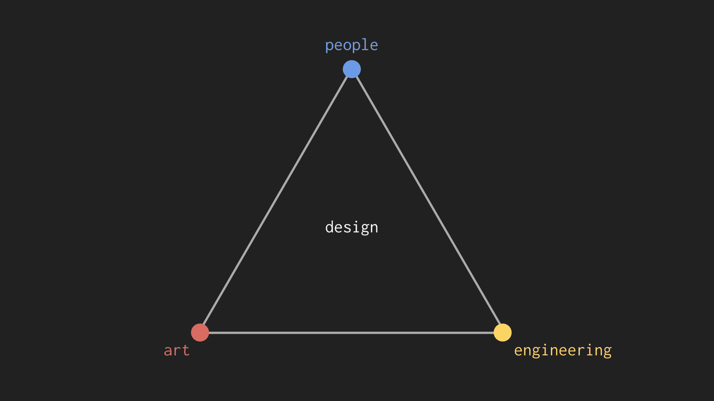

设计领域可以理解为用艺术和工程来影响人们生活的过程。

*   没有艺术的设计是乏味的。(想到一个闷热的办公楼。)
*   没有工程的设计是不切实际的。(想到飞行汽车。)
*   没有人的设计是没有目的的。(想想几年后的奥运村。)

不同的设计领域以不同的比例使用这些技能，但它们都利用了这三者的某种组合:

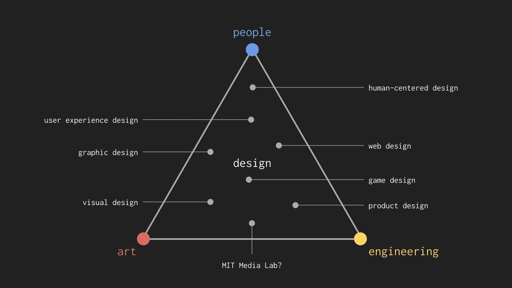

My entirely scientific, independently researched, peer reviewed explanation of various fields of design.

如果艺术-工程-人三角是设计的学术定义，这里有一个更实际的定义:

#### 设计是引导注意力、创造理解和激励行动的工具。

当我们想要实现一个目标时，我们需要首先了解我们周围的世界，并据此采取行动。当我们与世界互动时，我们依赖于关于对象和元素如何运行的核心假设。这些假设是由设计创造和强化的。

以一个非常简单的目标为例:走进一栋大楼。一个设计良好的门可以很容易地从建筑物的外部识别，一个适当形状的门把手只能向一个方向转动来打开它。

设计的工作是帮助人们理解他们世界中的物体，并使他们与这些物体的互动变得直观。这种流程——从关注到理解到行动——是设计的核心。我们可以通过检查设计如何有效地引导注意力，传达意义，并使人们在需要时采取行动来评估设计。

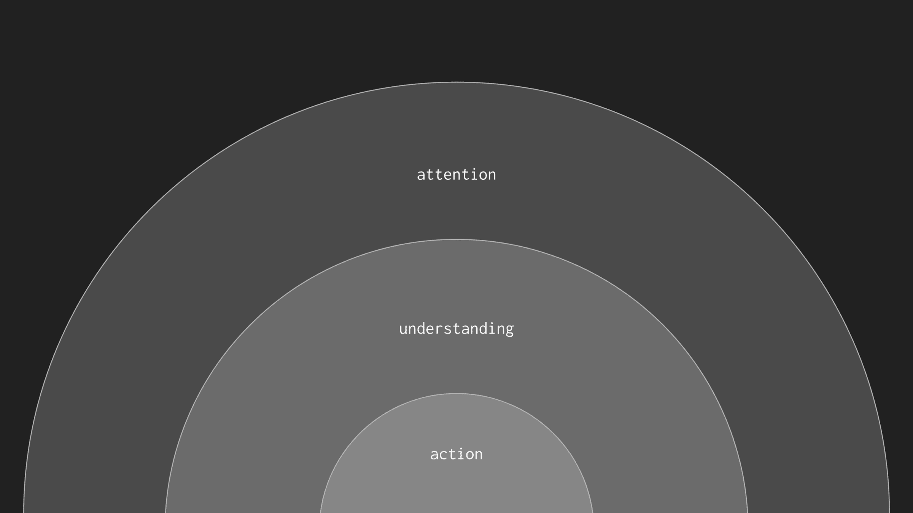

If you want to influence action, you have to first direct attention and create understanding.

#### 艺术家偷窃，工程师作弊，设计师两者兼而有之。

成为一名设计师需要付出很多努力:理解艺术、工程和人类心理学需要多年的学习。但是当你刚刚开始的时候？欺骗和偷窃也是完全可以接受的。(除了完全彻底的抄袭。)

成为一名艺术家很难，但任何老师都会告诉你，模仿建立了一个强大的基础。一个爵士音乐家可能会抄写米勒·戴维斯的独奏曲，学习演奏每个音符和乐句，以便更好地理解节奏、和声和措辞。同样，模仿你最喜欢的设计师可以是一个很好的起点，特别是当涉及到更主观的选择时，比如颜色和排版。

另一方面，当涉及到工程学时，抄袭他人的作品并没有太大的帮助。相反，一些关键的技巧和欺骗可以让你走得更远。在微积分中，洛必达法则、因式分解和完成平方都是将复杂问题分成可解块的有用技术。

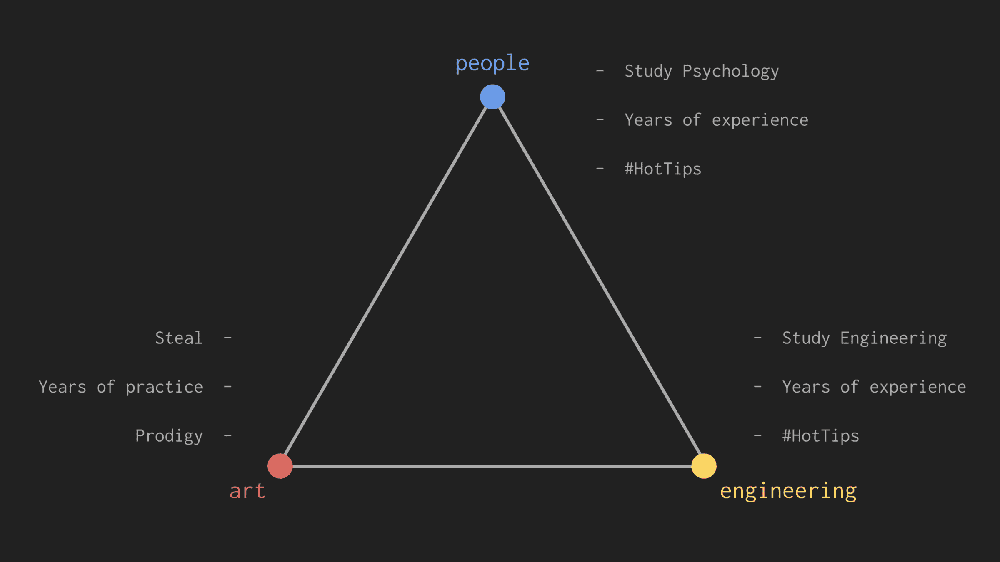

My goofy summary of how to learn art, engineering, and people

在设计中，这些技巧以布局、间距的最佳实践的形式出现。

* * *

### 2.我如何布局我的设计？

#### 空间有助于理解。

在设计中，空间是控制注意力和传达意义的非常强大的工具。

有些设计师很好地利用了空间:

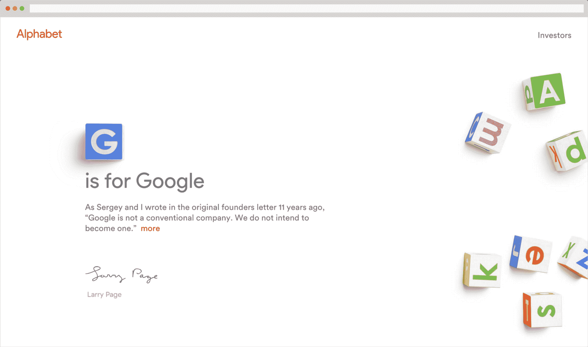

其他人没有:

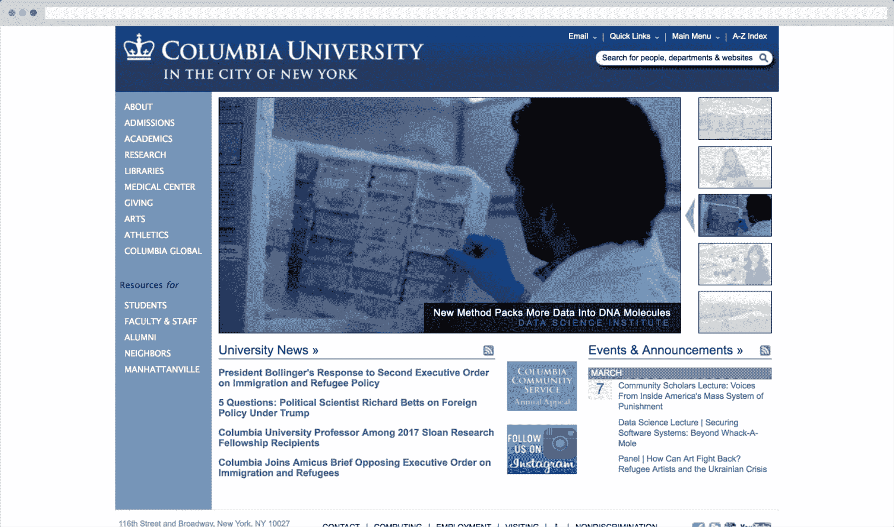

那么如何在设计中有效利用空间呢？为了探究这个问题，我们来做一个实验。我给你看几段文字和一张带标题的图片，你会发现标题是:

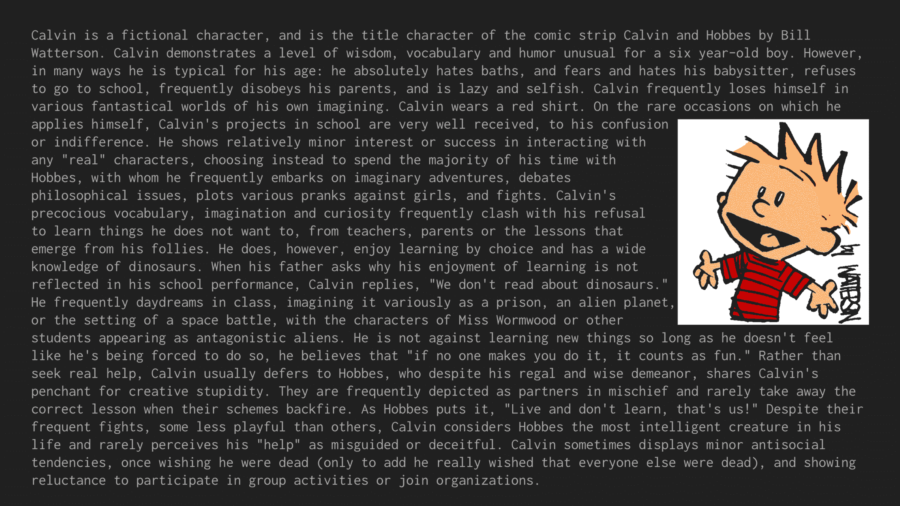

找不到？这里怎么样:

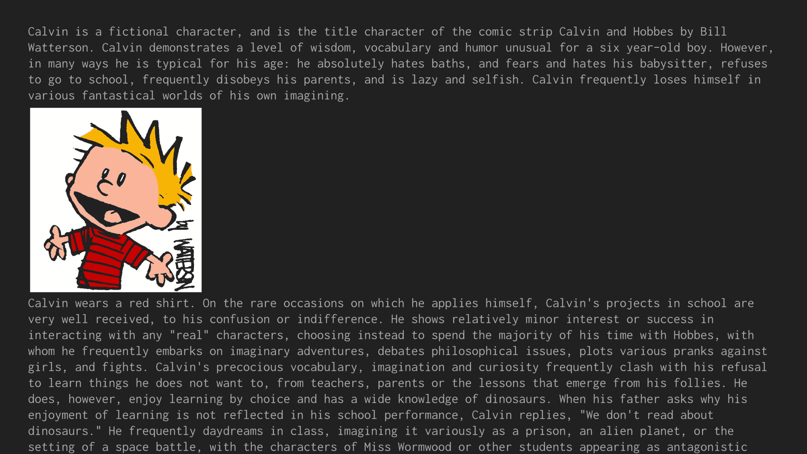

好吧，你可能已经想通了。但是花了一秒钟，我们也不一定能确定。这里怎么样:

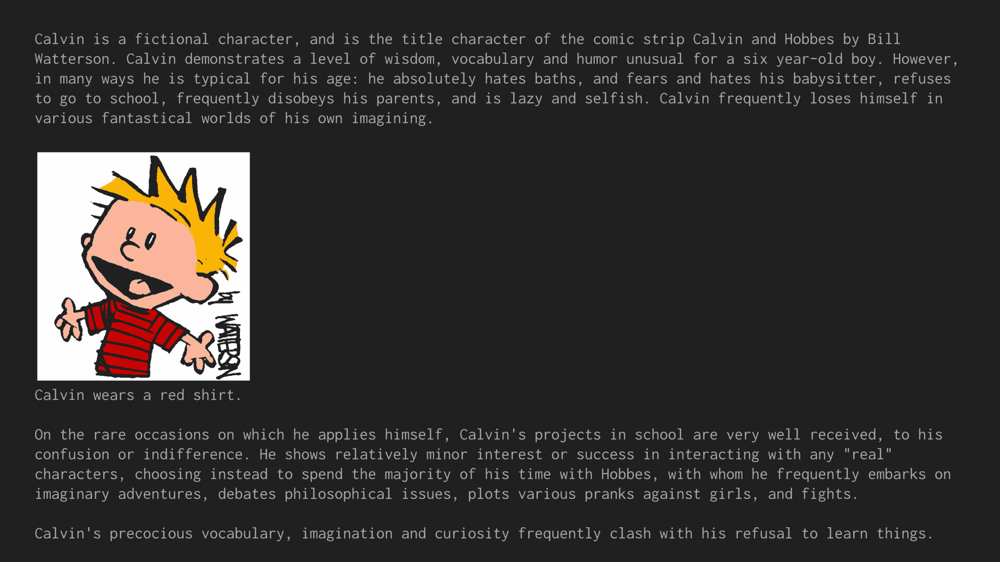

好吧，相当可行，但我认为我们可以做得更好:

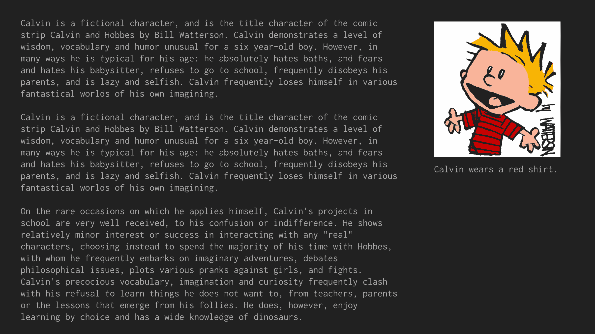

在最后一个例子中找到标题很容易，特别是与第一个版本相比。为什么？

#### 接近产生联想，分离产生区别。

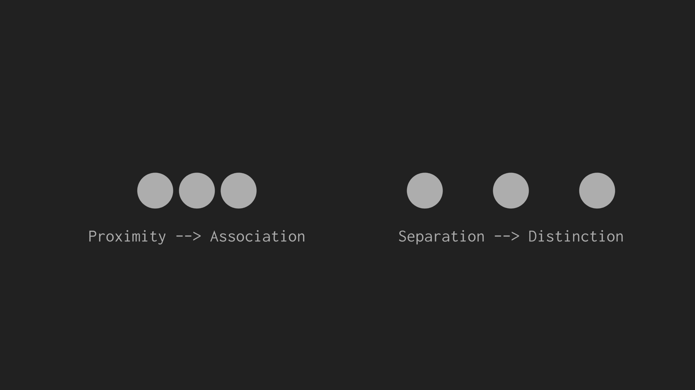

第一个卡尔文图像的问题是，不清楚许多句子中的哪一个与图像相关联。换句话说，不清楚哪一句话是为了*区别于其他段落。*

在修订中，不同元素(图像和文本、标题和段落)之间增加了空间。我们可以通过在可视分组元素周围画出方框来形象化这一过程:

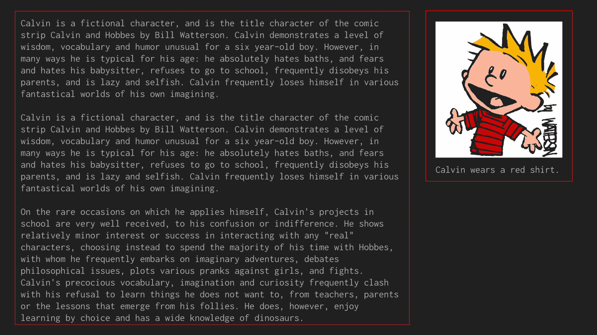

Proximate items are grouped in red boxes.

这个最终版本非常容易解析，因此很容易在预期的元素分组周围画出方框。如果我们将这种评估技术应用到前面的例子中，我们可以看到同样的原理也成立。

在 Alphabet 的网站上,“G 代表谷歌”的文字与“谢尔盖和我写的”便条的开头紧密相关。此外，签名和签名标签被分组，在它们上面有足够的空间，以清楚地表明签名是一个不同于票据的单元。

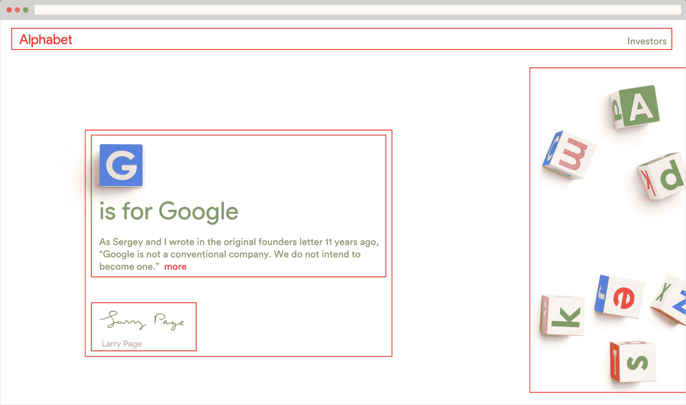

看看哥伦比亚大学的网站，我们发现完全相反。很难画出有意义的盒子，当我们画的时候，它们彼此之间非常紧密，经常重叠。

空间应该用来区分几个元素:“电子邮件”和“快速链接”的搜索框，浅蓝色侧边栏和内容的深蓝色栏，以及大学新闻和活动的图片库。请看下面我的简单模型作为例子:

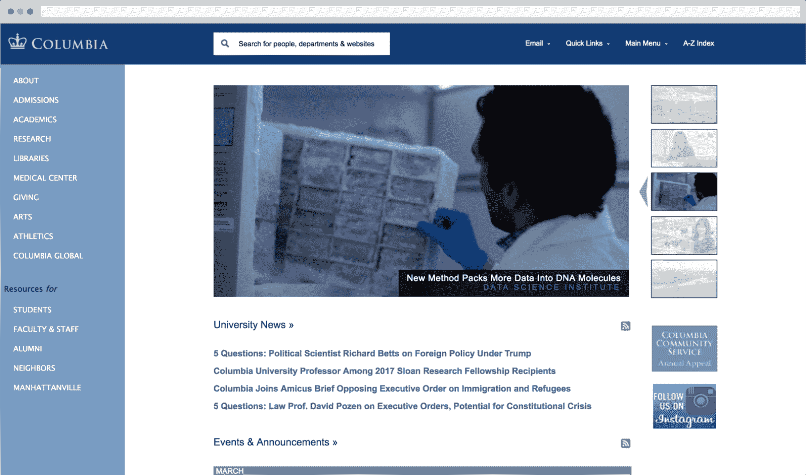

I added a bit of space to Columbia’s website. It looks… better?

这些空间的一般原则可以帮助勾画出一个基本的布局，但当涉及到精确定位的细节时，事情就变得棘手了。

#### 网格可以帮助您精确放置元素。

这里的单词 *grid* 可能有点误导。在网页设计的背景下，*网格*是一组可以覆盖在页面顶部的列。页面上的元素的大小通常可以占据一列或多列。在列之间，我们可以放置一个“装订线”，或空间，这样相邻的项目就不会重叠。

看看 Airbnb 的主页(大约几个月前),看看网格是如何帮助组织他们的设计的:

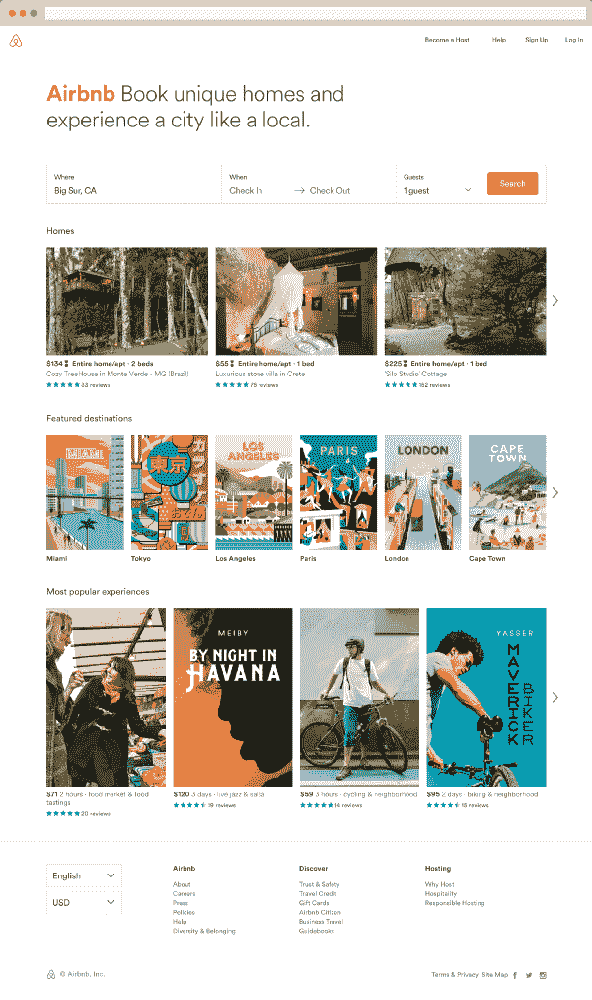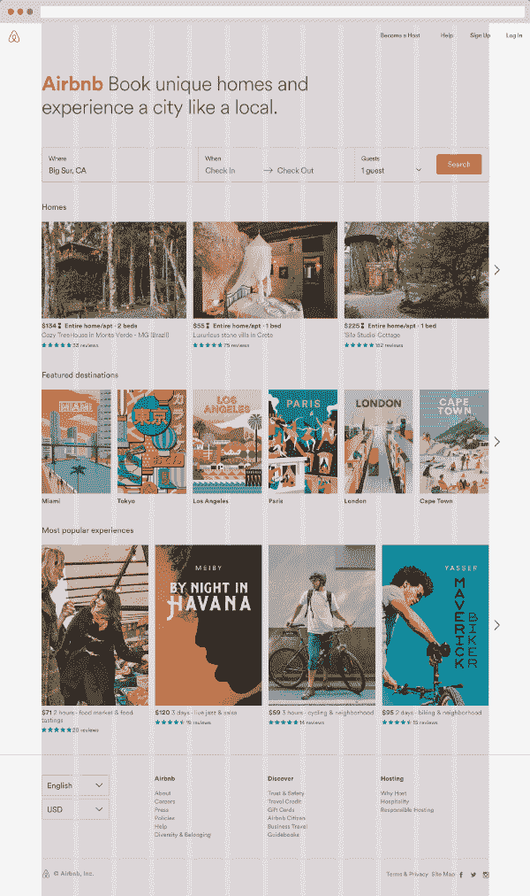

The Airbnb homepage uses a traditional 12-column grid.

这里的原则是一致性，一致性，一致性。我们的大脑天生会注意到意想不到的或不正常的事情(比如墙上一幅不太直的画)，所以作为设计师，我们不应该给他们任何东西去斜视。在网格中，页面上的元素具有逻辑意义。

请注意页面上的每个图像和文本是如何与其中一个网格对齐的。例如，虽然每行图像的高度不同，但它们在网格上对齐。在第一行中，每个图像有四列宽，然后是两列，然后是三列。

Airbnb 对网格的使用毫不留情。请注意，它们是如何将页脚的元素与最后一行图像的 3 列分组对齐的。甚至语言和货币选择器(在左下角)也有两列宽！

* * *

### 更多来自 LogRocket 的精彩文章:

* * *

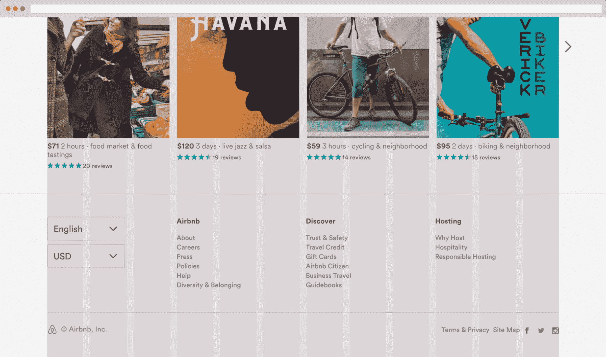

Grids help organize the Airbnb footer. Note the “English” and “USD” dropdowns.

通过在网格上对齐我们的大部分设计，打破一些元素的趋势，我们可以下意识地吸引用户的眼球。取页面顶部:**你能找出破坏网格系统的元素吗？**

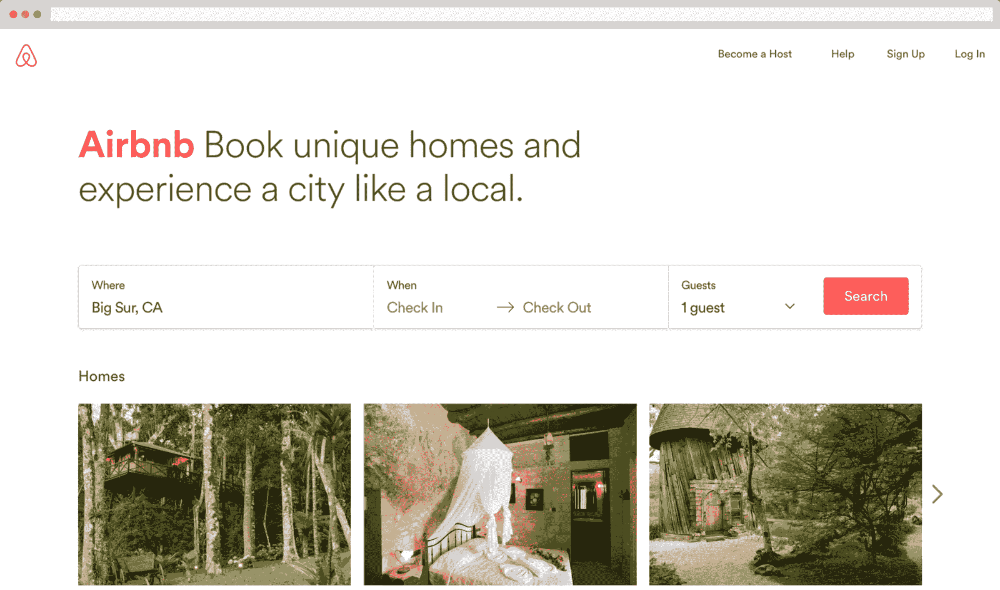

Where is Airbnb breaking their own grid system?

你可能已经注意到，Airbnb 的标志和四个链接(*成为主持人、帮助、注册、登录*)都是脱离网格的。这是因为导航应该在视觉上区别于页面的其他部分。

不过，注意到别的了吗？这可能有点夸张，但请稍等片刻。看一下带有网格覆盖的预订表格:

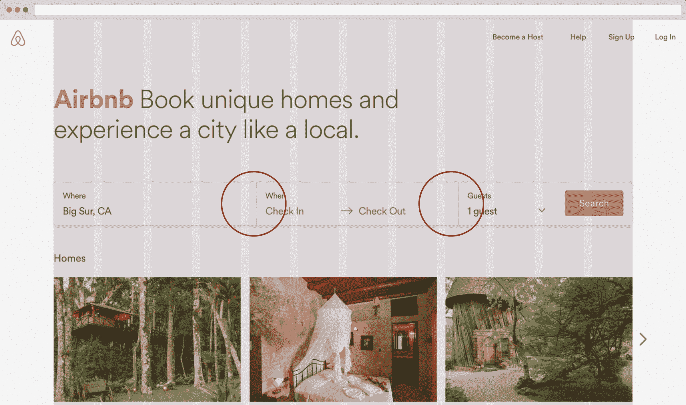

关了！是错误吗？懒惰的 web 开发人员？我表示怀疑。也许我在这里给了 Airbnb 太多的信任，但我敢打赌，在“哪里”、“何时”和“客人”输入之间的线的位置是故意脱离网格的，将你的眼睛转移到那个可爱的“搜索”按钮的右边。网站的其余部分被小心翼翼地放置在网格上，我无法想象设计者和开发者会忽略主页上的搜索框。

不管你买不买，我袖手旁观，不应该有一个严格的公式，当谈到网格。为了视觉平衡或强调而小心地改变规则是一个强有力的工具。

网格强调一个更普遍的设计原则:

#### 尽可能减少精神紧张。

许多设计师把好的设计定义为减少用户理解你的产品并采取下一步行动的工作量。这可能有几种形式:

**保持文案简洁(相对于晦涩难懂或文字过多):**

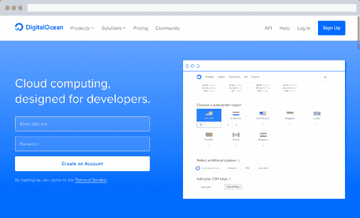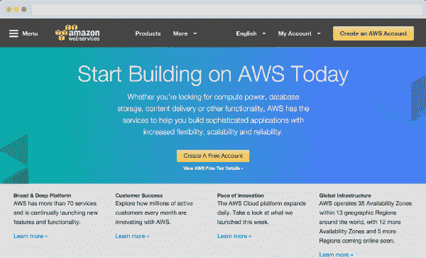

DigitalOcean uses a clear tagline and an animated GIF. Amazon uses lots of text on their homepage.

**固执己见的设计(相对于让用户做决定):**

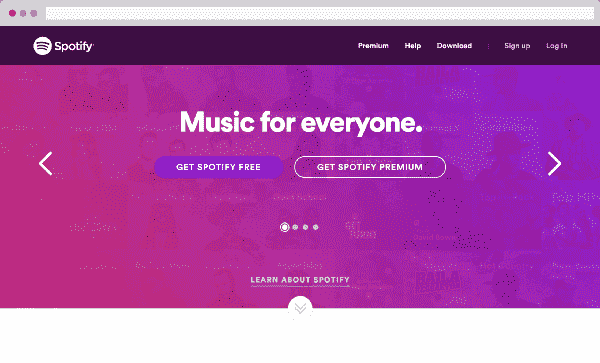

Google Play Music only focuses on signing in. Spotify forces users to distinguish between Spotify Free and Premium.

**或者，向前迈出一大步:**

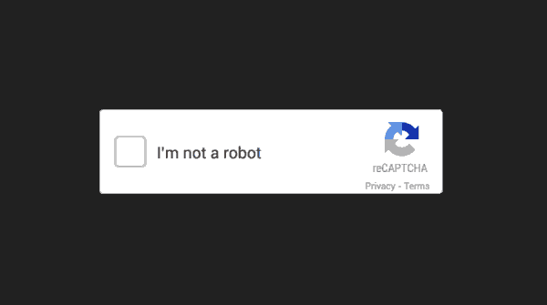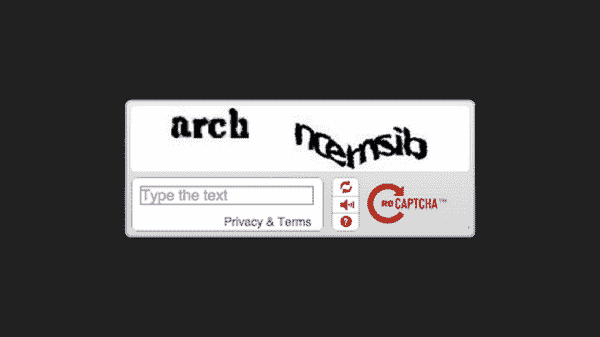

The new version of reCAPTCHA knows if you’re a robot automatically. The old version asked users to transcribe indecipherable text.

无论你的设计中出现何种形式的精神压力，尽可能地减少它。

* * *

### 3.颜色、排版和插图呢？

虽然布局和组织看起来更像一门科学，但设计的许多元素显然是艺术的。作为一名业余设计师，我觉得随着经验的积累，对这些视觉组件的看法也在不断发展。也就是说，有一些我曾经用过的技巧:

#### 当谈到颜色时，想想潜意识。

为你的设计选择合适的颜色可能很难。首先，想想颜色是如何潜移默化地影响用户对你设计的看法的。

**对比色可以用来强调重要的组成部分:**

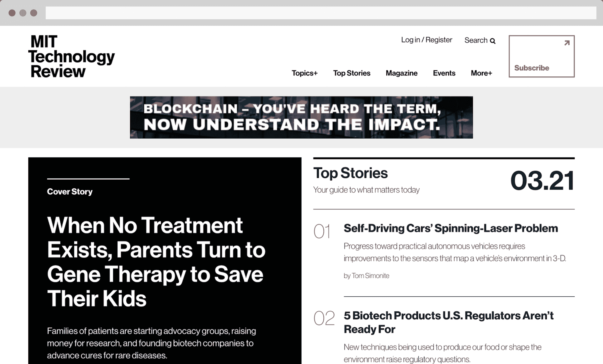

The MIT Technology Review uses red for their “subscribe” button.

**致力于单一颜色有助于建立品牌:**

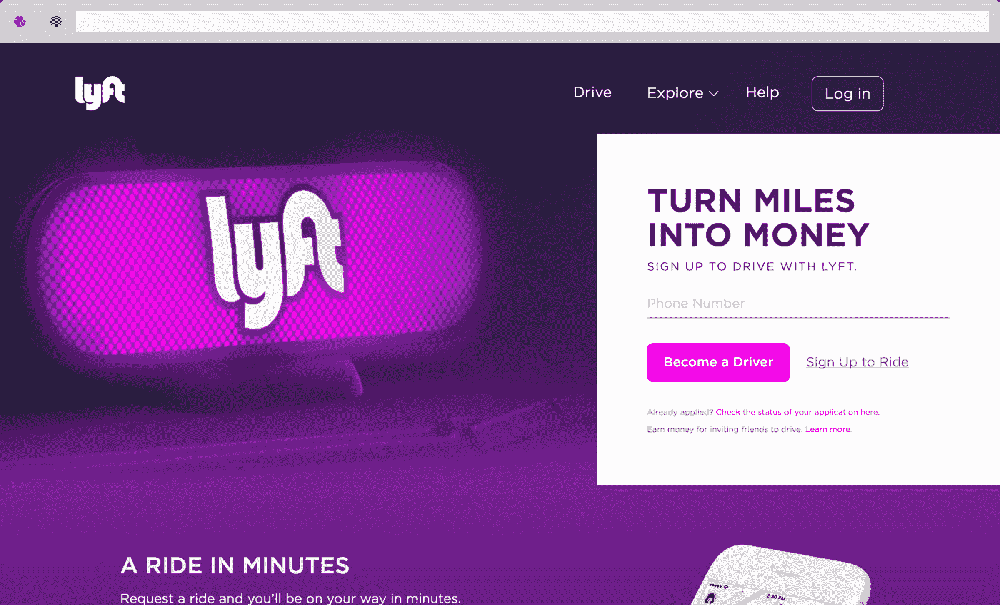

Lyft has put pink and purple everywhere in their app and branding.

**或者试着换一个:**

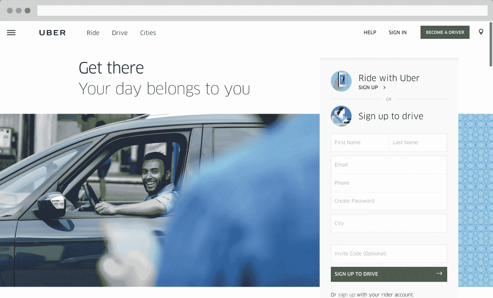

Green is a tame and placid color. Perhaps Uber is trying to modify their image?

最后，如果你想挑选真正的十六进制代码，我推荐[杰夫·希尔布兰德](https://medium.com/u/2fa5ff90fb)的文章[挑选颜色](https://medium.com/hh-design/picking-colors-part-1-techniques-4d67b314781d):

[Medium.com 的景色](https://medium.com/hh-design/picking-colors-part-1-techniques-4d67b314781d)

就我个人而言，我还不太相信自己会挑选颜色。很多时候，我只是从其他品牌或网站上窃取我喜欢的颜色。伟大的艺术家，亚达亚达。

#### 字体设计可能会令人困惑。不要不知所措。

选择合适的字体常常让人觉得是一件不可能的事:

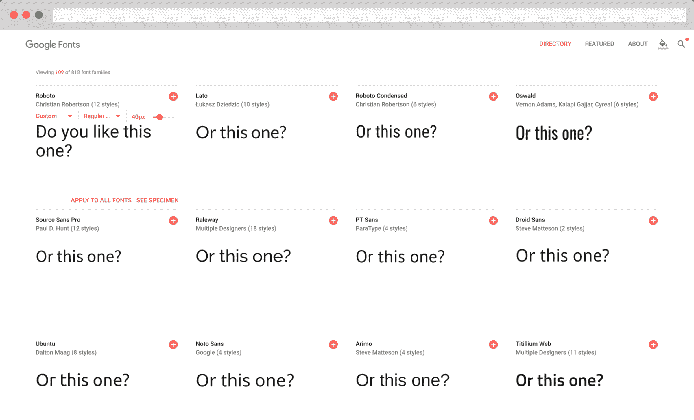

Is Google Fonts mocking me?

虽然我倾向于从其他设计中选择我喜欢的字体和字体对，但有几个属性要记住:

**对比是你的朋友:**

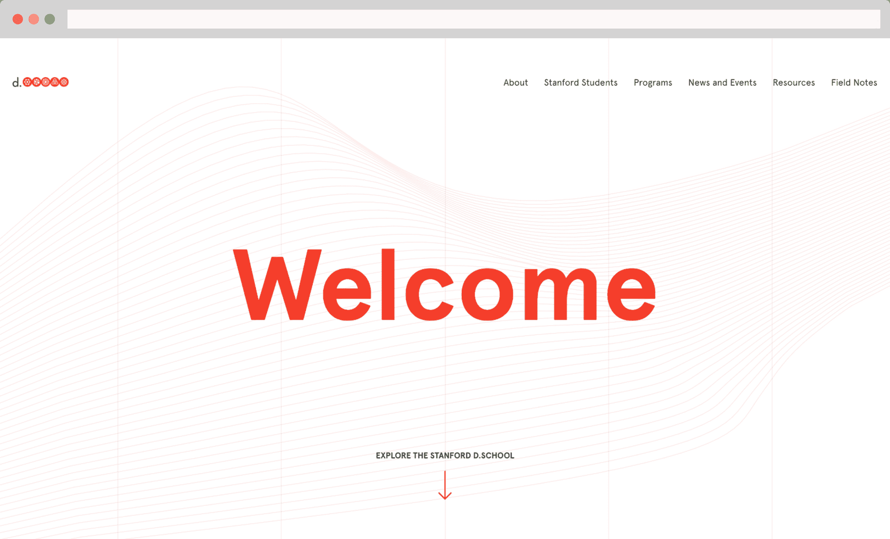

The Stanford D.School uses an awesome header font that contrasts the rest of the site copy.

语气也很重要。你的字体给人什么样的感觉？

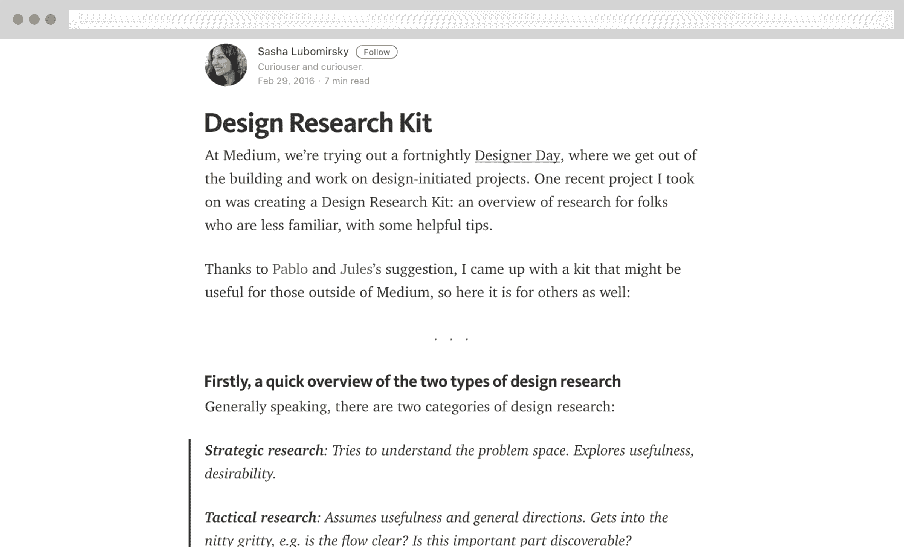

Medium’s typography gives its articles gravitas.

不要太幻想。清晰易读的字体表达你的观点:

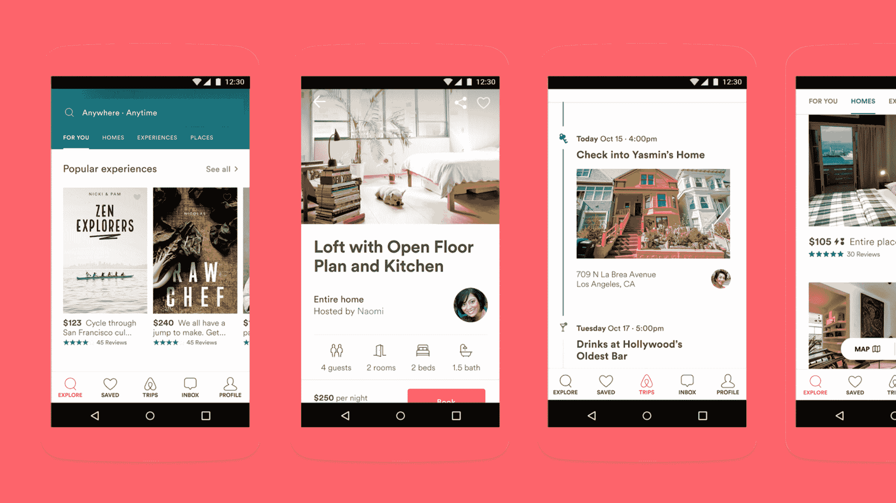

Airbnb used bold sans-serif fonts in it’s latest mobile redesign.

同样，对于排版，不要强调。从注意你喜欢什么开始，然后从那里开始。

#### 说到插图，没有任何捷径。

对我来说，所有对插图的解释都是这样的:

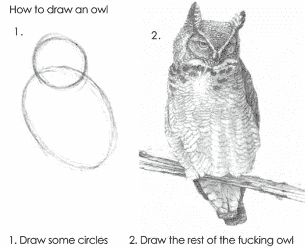

我知道有一些品牌利用插图来获得优势，但很难确切说明它是如何工作的。

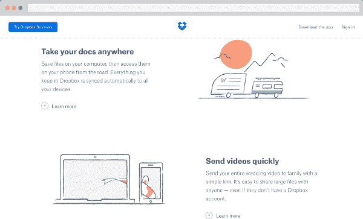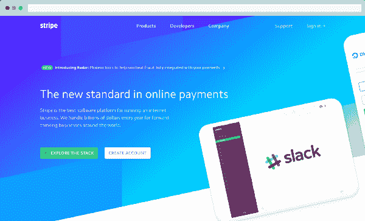

Dropbox and Stripe use very different illustration styles to add life to their design.

虽然我在这里没有很好的答案(不，窃取他人的插图不是一个选项)，但我会推荐阅读斯科特·麦克克劳德的书，[理解漫画](http://scottmccloud.com/2-print/1-uc/)，其中有很多关于漫画如何工作的有趣理论。

[Medium.com 的景色](https://medium.com/hh-design/picking-colors-part-1-techniques-4d67b314781d)

我特别喜欢他关于细节层次的讨论。麦克劳德解释了风格的选择是如何使一幅插图更具关联性、情感性或信息量更大的。

* * *

### 设计是复杂的。但这并不意味着一定很难。

我仍然是一个初学设计的孩子，但我设法用腰带里的一些工具来应付过去:

1.  将设计视为艺术、工程和人的交集是第一步。糟糕的设计放弃了其中的一个元素，而选择了另外两个元素。
2.  巧妙利用空间和网格系统可以帮助你设计布局元素。重要的部分应该区分开来。
3.  剩下的工作完成后，你就可以为你的设计选择合适的颜色、字体和图像了。向其他设计师学习，找到自己最喜欢的。

希望有了这些工具，无论你正在做什么样的设计，你都能够产生一个初稿。一旦你做了，分享它！没有比友好的批评更好的学习方法了；与他人合作会让你保持诚实，完善你的设计。

祝你好运！