# 如何设计 CTA 按钮:UX 最佳实践

> 原文：<https://blog.logrocket.com/ux-design/design-cta-buttons-ux-best-practices/>

## 什么是 CTA，当它们无效时会发生什么？

CTA(行动号召)是推动用户在应用程序或网站上做某事的链接或按钮。例如，在电子商务网站上，访问者被推着“购买”产品或至少“把它们添加到购物车中”，而在 SaaS 营销网站上，访问者被推着“订阅”产品或至少“免费注册”

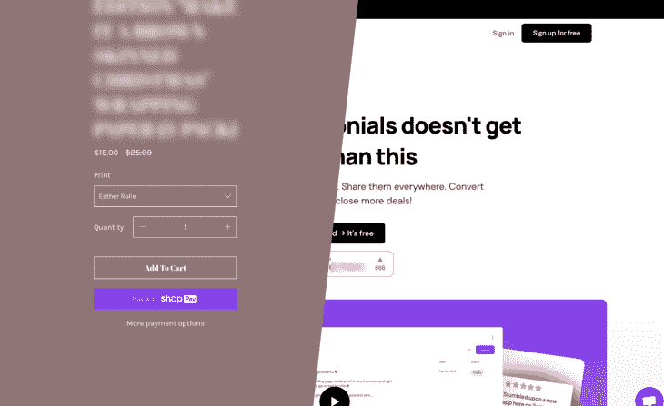

**Add to Cart** example (left); **Sign up for free** example (right).

当 CTA 无效时，正如 CTR(点击率)所表明的那样，访问者最终不会采取行动，应用程序或网站无法实现其目的。在这篇文章中，你将了解到作为一名 UX 设计师，你能做些什么来确保这种情况不会发生。

## 3 种不同类型的 CTA 及其作用

首先，有三种不同类型的 CTA:主要、次要和后备。

*   **主要 CTA**是那些号召访问者做一些与应用程序或网站核心目的相关的事情。例如，在 SaaS 的一个营销网站上，主要的 CTA 会打电话给访问者进行订阅
*   **二级 CTA**适用于不确定是否参与主要行动的访问者。例如，他们可能更喜欢开始免费试用，而不是订阅 SaaS 的产品。二级 CTA 是重要的 CTA，但可能没有一级 CTA 重要，这应该反映在视觉层次的设计中
*   **后备 CTA**是为那些对所提供的东西不感兴趣或目前不感兴趣的人准备的。并非一切都没了——例如，他们现在可能想关注社交媒体？如果现在不能转换，也许以后可以转换。小胜胜于败

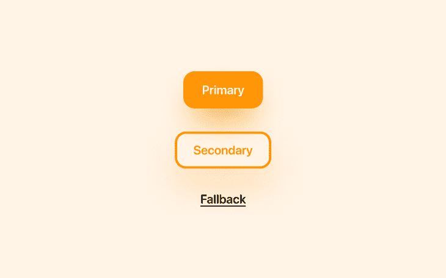

## 设计 CTA 时需要考虑的事项

### 启示

优秀的 CTA 是负担得起的，这意味着他们是什么和他们做什么是很清楚的。事实上，有些元素是天生具有启示性的，比如链接，默认情况下通常会加下划线，以帮助用户将它们与不可点击的文本区分开来。

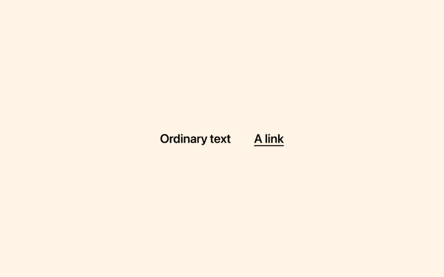

类似地，默认情况下，按钮通常有背景和圆角，因为这就是现实世界中按钮的样子。

然而，默认情况下按钮并不总是投射阴影，尽管现实世界中的 3D 对象会这样做，所以我们必须确保我们不会忘记它们。

Ruslan Galba 整理了一个奇妙的[按钮阴影](https://medium.com/hellotegra/3-rules-to-perfect-button-shadow-e7227a5ae87d)指南，其中包括使颜色与背景相同，使扩散小于模糊，并且不透明度不要高于 40%。除了增加启示，这种方法看起来令人难以置信，并确保按钮在每个背景下都很突出。

放弃圆角和阴影似乎是一种审美选择，但它实际上只是让按钮看起来像不可交互的矩形。

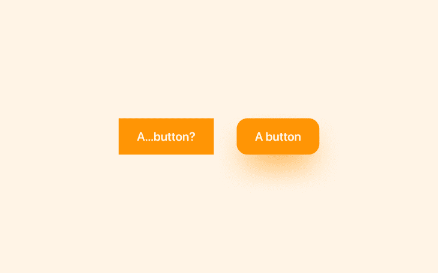

### 易接近

每个人都可以接触到优秀的 CTA。首先，这意味着确保它们在必要时是可识别的。如果两个按钮做同样的事情或者两个链接导航到同一个地方，它们应该有相同的 CTA 副本。

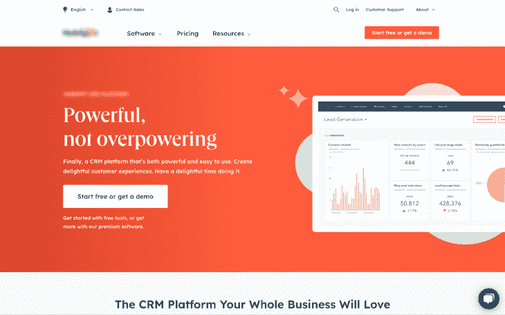

根据 WCAG 的说法，按钮应该至少有 44px 宽和 44px 高[，或者根据谷歌](https://www.w3.org/WAI/WCAG21/Understanding/target-size.html)的说法，按钮应该至少有 [48px 宽和 48px 高，这样人们才能在手持设备上舒适地与它们互动。](https://web.dev/accessible-tap-targets/)

同样，[WCAG 也规定](https://www.w3.org/TR/mobile-accessibility-mapping/#touch-target-size-and-spacing)如果有两个 CTA 相邻放置(或者一般是两个触摸目标)，那么它们之间至少要隔开 8px 的非活动空间，以确保用户不会意外地与错误的触摸目标交互。

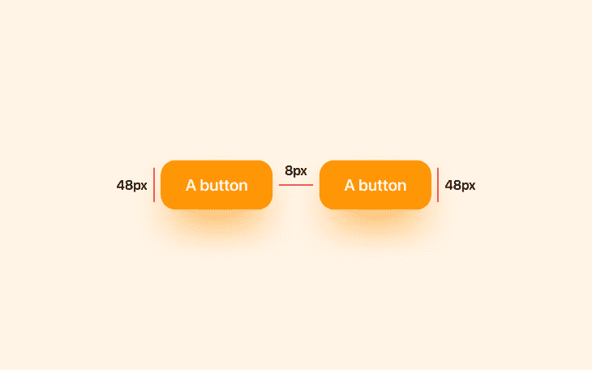

CTA 副本的颜色应与其背景颜色形成对比，以便人们能够清楚地阅读它。[WCAG 对此进行了详细介绍](https://www.w3.org/WAI/WCAG21/Understanding/contrast-minimum.html)，但是如果你对如何测量色彩对比度的技术细节不感兴趣(这有点让人挠头)，简而言之就是你会想要使用色彩对比度检查器来检查你的色彩组合。

我为此推荐 [Stark](https://www.getstark.co/) ，因为它涵盖了广泛的可访问性问题，而不仅仅是颜色对比。macOS 版本有最慷慨的免费计划。

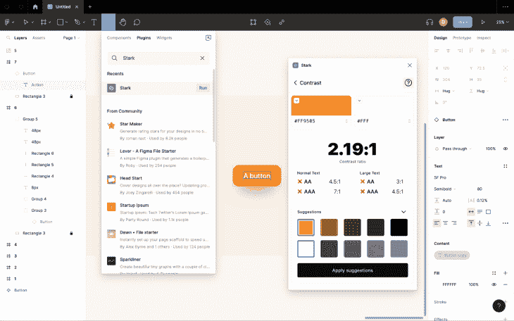

### 美学

丑陋的 CTA 让我们不想与他们互动。我们很肤浅(这是不可否认的)，所以 CTA 美观是很重要的。

对于链接，考虑缩进下划线以给文本更多的喘息空间，并确保它不会切断字体的下行线，从而提高可读性。

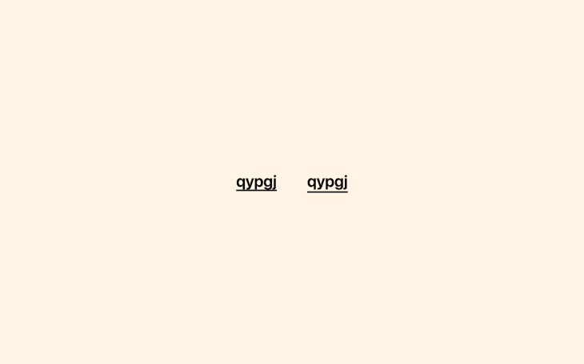

对于按钮，密切注意水平填充，确保它看起来令人愉快和相称。我发现将填充设置为按钮高度的 0.5 倍看起来最好。所以，如果你使用谷歌推荐的 48px 的最小高度，那么水平填充就是 24px。同样，我发现将边框半径设置为高度的 0.3 倍会产生最好看的圆角。

我们已经讨论了颜色的可及性，但它们也能激励人们采取行动。事实上，你可以考虑在你的主要 CTA 上使用你品牌的主色调(这应该是你风格指南中最有力的颜色)。

此外，由于你的品牌的主色代表你的品牌，在 CTA 上使用它会让你看起来像是在直接对你的观众说话，这就更有力量了。

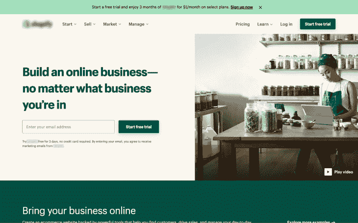

### 视觉层次

不言而喻，CTA 应该突出，但是如果页面有辅助 CTA 或后备 CTA，它们不应该比主 CTA 突出。如果我们试图让一切都突出，那么没有什么会突出，所以我们必须建立所谓的[视觉层次](https://www.interaction-design.org/literature/topics/visual-hierarchy)，其中一些元素比其他元素需要更多的关注。

相对于主 CTA 来说，设计辅助 CTA 和备用 CTA 很大程度上取决于页面的整体内容，但是使用不同的大小或颜色、边框而不是背景、或者链接而不是按钮都是很好的选择。

## CTA 链接的交互性

为 CTA 设计悬停状态会让它们更容易交互。最好的方法是稍微增加亮度，例如增加 10%。这是一种通用的方法，可以确保整个设计的视觉一致性。

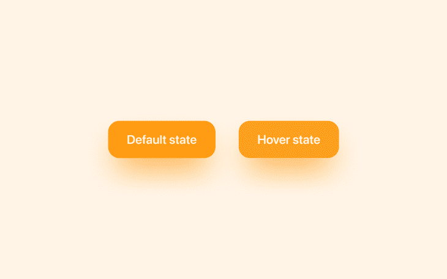

对于焦点状态，我建议不要使用 web 浏览器和操作系统本身提供的蓝色焦点环。如果你的设计是重蓝色的，你可以破例改变颜色，但是一般来说，最好保持易访问特性不变。

## 向 CTA 推荐价值主张

你不能告诉某人做某事，然后期望他们去做；他们必须明白自己在做什么，并看到这样做的价值。这意味着 CTA 之前的事情——那一刻的积累——和 CTA 本身一样重要。

确保 CTA 的建立是有目的的，讲述一个连贯的故事，并为访问者提供足够的信息，使他们感到可以放心地进行跳跃并点击它。

也就是说，在适当的时机将 CTA 放入构建本身是可以的，包括在总结要点后放在文件夹上方。这使得访问者几乎可以在任何时候触发 CTA。

## 如何提高你的 CTA 点击率

正如我们简要提到的，衡量单个 CTA 功效的关键指标是点击率(CTR)，它衡量的是点击它的人的百分比。这不要与[转化率](https://blog.logrocket.com/product-management/what-is-conversion-rate-how-to-calculate/)混淆，转化率是指点击后某个时间实际上最终转化的人数。

如果你已经有了提高 CTR 的想法，建立一个 A/B 测试并直接投入工作也没有坏处。A/B 测试包括用只有一个微小变化的版本(版本 B)来测试当前版本(版本 A)。如果版本 B 被证明有更高的 CTR，那么你知道要永久地实现那个版本。

如果你不确定要改变什么，你可以考虑建立一个退出意向调查(如果你还没有),询问访问者为什么不点击 CTA。如果有问题，你会得到这样的回答，“我不明白[x]，”“我找不到[x]信息”，“我不知道点击哪里”，甚至，“网站加载时间太长了。”这将为你指出 A/B 测试的正确方向。

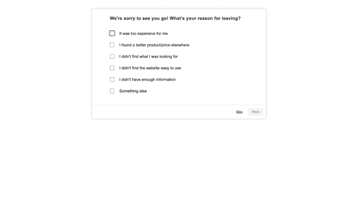

当你准备好开始 A/B 测试时，最有效的方法是使用专用的 A/B 测试工具，如 [VWO](https://vwo.com) ，这将使你能够测试一个相对于现有版本稍有修改的版本。您可能至少需要一名开发人员来进行初始设置。

值得注意的是，如果你的点击率有相当大的增长，但转化率却没有，那么很可能有其他问题在起作用，可能需要[进一步的产品或 UX 研究](https://logrocket.com/features/ux-analytics)。

## 结束语

使用本文中概述的 CTA 设计技巧，您将能够设计出令人难以置信的 CTA，进而提高点击率，这是整个转化率优化过程中非常关键的一部分。

转换率优化非常有趣(特别是如果你喜欢嗅出问题，设计解决方案，看着这些数字上升)，但这是设计团队和营销团队的共同责任。作为一名设计师，清晰地呈现内容是你的工作，但你不是文案/营销天才也是情有可原的。

也就是说，如果你的公司允许你写作或试验 CTA 文案或营销文案，KlientBoost 的 CTA 文案指南是一个相当不错的选择。如果您将他们的 CTA 复制技巧与本文中概述的设计建议结合起来，您将能够从 CTA 中获得更好的结果。

感谢阅读！

## [LogRocket](https://lp.logrocket.com/blg/signup) :无需采访即可获得 UX 洞察的分析

[LogRocket](https://lp.logrocket.com/blg/signup) 让您可以回放用户的产品体验，以可视化竞争，了解影响采用的问题，并结合定性和定量数据，以便您可以创建令人惊叹的数字体验。

查看设计选择、交互和问题如何影响您的用户— [立即尝试 LogRocket】。](hhttps://lp.logrocket.com/blg/signup)