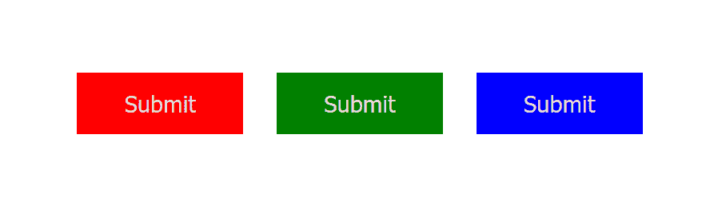
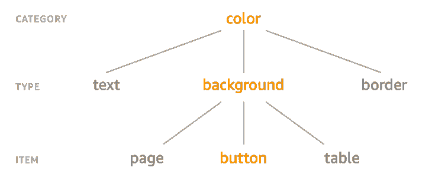

# 使用风格词典设计基础的、可重用的组件

> 原文：<https://blog.logrocket.com/design-foundational-reusable-components-style-dictionary/>

## 什么是设计系统？

一个设计系统不仅仅是一个 UI 工具包；它是设计符号、实践和可重用组件的集合，为您的设计和产品团队保持一致性。它实现了跨产品的一致的外观和感觉，可以提高创造力和生产力。

设计系统也是团队的共同语言，从项目开始就建立指导方针和收集设计资源。

在项目的早期阶段创建设计系统可以加速设计和编码过程，整合所有相关人员，并提高产品的一致性。一个设计系统必须是一个全面的、灵活的、可扩展的真实的单一来源。

[风格字典](https://amzn.github.io/style-dictionary/#/)是一个允许你一次定义风格的系统，以一种任何平台或语言都能消费的方式。它提供了一个创建和编辑您的样式的单一位置，并且一个单一的命令将这些规则导出到我们需要它们的所有位置——iOS、Android、CSS、JS、HTML、草图文件、样式文档等等。

Style Dictionary 旨在解决当设计师、开发人员、项目经理和其他人的多学科团队试图拥有一致和最新的样式文档时存在的错误、障碍和工作流效率低下的问题。

在这篇文章中，我们将学习团队使用设计系统的好处，设计系统如何工作，以及如何使用风格词典来使这个过程变得简单快捷。

### 内容

## 使用设计系统的好处

虽然开发设计系统需要大量的时间和资源，但从长远来看，这种投资是值得的。让我们看看在大型团队项目中使用一致的设计系统的一些好处。

首先，设计系统促进一致性，并确保我们所有产品的风格和行为一致。

设计系统的第二个好处是促进更短的上市时间。从长远来看，设计系统总是会提高速度、质量和一致性。提高开发速度意味着更少的人可以做更多的事，我们可以更快地推向市场。

第三是可维护性和持续改进。设计系统的集中特性使得维护产品变得毫不费力。此外，设计系统中的修复和改进会立即传播到所有产品。

第四是团队一致性和协作。设计系统是由组织中不同团队的共同努力构建的，包括开发人员、设计人员、产品负责人等。这使得团队协作更容易，并通过建立更有组织的工作流来帮助成员做出更好的决策。它还增加了自主性，加快了开发和测试，并使新团队成员的入职过程更快。

最后，设计系统创造一个明确的令人难忘的品牌身份。为视觉效果、品牌标志甚至色调定义的指导方针和规则可以传达产品品牌背后的特定感觉和身份。品牌产品中一致的行为和外观会让客户对品牌产生更强的信任感和联系。

## 什么是设计符号？

设计标记是 UI 元素的样式值，如版式、颜色、断点、间距、阴影、动画、边框半径等，以数据的形式表示。

令牌是设计系统的构建模块。它们代表了设计系统的所有独立属性。

标记用不言自明的名称替换静态值，如颜色的十六进制代码。
如果我们品牌的主色是`#276EE5`，我们可以创建以下设计符号来反映这一造型决策:`primary-color: #276EE5`。令牌的名字是`primary-color`，它的值是`#276EE5`。

设计令牌被直接集成到我们的组件库和 UI 工具包中。它们确保在设计文件和代码中使用相同的样式值。

有三种类型的设计标志:

首先是全局令牌，可以全局使用或由其他令牌使用。它们不依赖于特定的用例，例如`blue-100: #2680eb`。

其次是别名令牌。别名令牌与特定的上下文或目的相关。这些不是通用令牌；更确切地说，它们是一个用例的标记，可以用它们的名字来概括。当一个具有单一意图的值出现在多个位置时，例如`primary-cta-background-color: #133`，它们是有效的。

第三个是特定于组件的令牌，它表示与组件相关联的属性，例如`card-background-color: #132a3b`。

## 样式词典入门

现在我们有了设计系统的背景，让我们开始使用风格词典创建我们自己的设计系统。

我们可以使用 CLI 或作为 npm 依赖项来安装样式字典。

要使用 CLI，请运行以下命令:

```
npm install -g style-dictionary

```

运行以下命令，以依赖项的形式安装:

```
npm install -D style-dictionary

```

然后创建一个目录，并运行下面的命令:

```
style-dictionary init basic    

```

该命令将复制样式字典的 repo 的[示例](https://github.com/amzn/style-dictionary/blob/main/examples)文件夹中设置的示例文件。

CLI 为我们提供了一个`build`文件夹，其中包含我们希望在不同平台上使用的不同格式的设计令牌。在一个`config.json`文件旁边还有`tokens`、`color`和`size`规格。让我们分析一下 CLI 的输出。

* * *

### 更多来自 LogRocket 的精彩文章:

* * *

`build`文件夹包含不同格式和平台的令牌输出，我们希望在其中使用这些样式。在撰写本文时，有 15 个[预定义平台](https://amzn.github.io/style-dictionary/#/transform_groups)。

`color`文件夹包含两个文件，`base.json`和`font.json`。

`base.json`文件包含一些基色定义，你可以在这里看到:

```
{
  "color": {
    "base": {
      "gray": {
        "light" : { "value": "#CCCCCC" },
        "medium": { "value": "#999999" },
        "dark"  : { "value": "#111111" }
      },
      "red": { "value": "#FF0000" },
      "green": { "value": "#00FF00" }
    }
  }
}

```

`font.json`文件包含不同字体大小的颜色样式:

```
{
  "color": {
    "font": {
      "base"     : { "value": "{color.base.red.value}" },
      "secondary": { "value": "{color.base.green.value}" },
      "tertiary" : { "value": "{color.base.gray.light.value}" }
    }
  }
}

```

`sizes`文件夹包含一个`font.json`文件，其中保存了不同字体大小的样式定义:

```
{
  "size": {
    "font": {
      "small" : {
        "value": "0.75",
        "comment": "the small size of the font"
      },
      "medium": {
        "value": "1",
        "comment": "the medium size of the font"
      },
      "large" : {
        "value": "2",
        "comment": "the large size of the font"
      },
      "base"  : {
        "value": "{size.font.medium.value}",
        "comment": "the base size of the font"
      }
    }
  }
}

```

最后，我们有了`config.json`文件。样式字典是配置驱动的。该配置让 Style Dictionary 的构建系统知道在哪里可以找到设计标记，以及如何转换和格式化标记以生成输出文件。

## 实用文体词典

假设我们有三个不同背景颜色的按钮。让我们看看如何使用样式字典来定义设计标记和处理输出交付。



对于这个例子，我们想要一个 CSS 输出，所以这是我们在配置中定义的唯一格式。但是，我们可以定义[几种输出格式](https://amzn.github.io/style-dictionary/#/formats?id=pre-defined-formats):

```
{
  "source": ["tokens/**/*.json"],
  "platforms": {
    "css": {
      "transformGroup": "css",
      "buildPath": "build/css/",
      "files": [
        {
          "destination": "_variables.css",
          "format": "css/variables"
        }
      ]
    }
  }
}

```

我们创建了一个`button.json`文件，并为那里的按钮定义了标记。请注意，我们可以随意构造令牌:

```
{
  "color": {
    "button": {
      "background": {
        "primary": {
          "value": "red",
          "comment": "the primary buttons's background color"
        },
        "secondary": { "value": "green" },
        "tertiary": { "value": "blue" }
      }
    }
  }
}

```

有三个按钮——一级、二级和三级——所以我们为每个按钮创建三个令牌。

出于文档记录的目的，我们可以向标记添加注释。这里，我们向主按钮的标记添加了一个注释。

定义了标记之后，我们需要获取 CSS 输出。为此，我们需要在终端中运行 build 命令。这将转换令牌并生成 CSS 资产。

```
style-dictionary build

```

我们现在有了按钮令牌的 CSS 输出:

```
/**
 * Do not edit directly
 * Generated on Tue, 05 Apr 2022 05:52:57 GMT
 */

:root {
  --color-button-background-primary: #ff0000; /* the primary buttons's background color */
  --color-button-background-secondary: #008000;
  --color-button-background-tertiary: #0000ff;
}

```

在这里，我们可以看到注释包含在输出中。

这样，我们可以将变量导入到主样式表中，并开始在应用程序中使用它们。

## 用风格词典构造设计符号

Style Dictionary 建议对我们的标记使用 Category/Type/Item (CTI)结构。



然而，[我们可以随意构造令牌。例如，我们可以这样重构按钮令牌:](https://amzn.github.io/style-dictionary/#/tokens?id=category-type-item)

```
{
  "button": {
    "color": {
      "background": {
        "primary": { "value": "red" },
        "secondary": { "value": "green" },
        "tertiary": { "value": "blue" }
      }
    }
  }
}

```

资产变量名将改变以反映新的结构:

```
:root {
  --button-color-background-primary: red;
  --button-color-background-secondary: green;
  --button-color-background-tertiary: blue;
}

```

## 时尚词典游乐场

这里有一个[互动游乐场](https://www.style-dictionary-play.dev/)，我们可以在这里玩 JSON 令牌并进行编辑。操场是一个很好的方式来更熟悉风格词典及其工作原理。

## 结论

一个设计系统将帮助你和你的团队拥有一个一致的、健壮的、灵活的和可访问的产品。

Style Dictionary 最大的卖点之一是，它的设置不依赖于平台和技术，但允许我们针对几种平台和格式。

在本文中，我们已经了解了样式字典，以及它如何使我们能够管理设计标记，并将它们转换成特定于平台和格式的输出。

## 使用 [LogRocket](https://lp.logrocket.com/blg/signup) 消除传统错误报告的干扰

[](https://lp.logrocket.com/blg/signup)

[LogRocket](https://lp.logrocket.com/blg/signup) 是一个数字体验分析解决方案，它可以保护您免受数百个假阳性错误警报的影响，只针对几个真正重要的项目。LogRocket 会告诉您应用程序中实际影响用户的最具影响力的 bug 和 UX 问题。

然后，使用具有深层技术遥测的会话重放来确切地查看用户看到了什么以及是什么导致了问题，就像你在他们身后看一样。

LogRocket 自动聚合客户端错误、JS 异常、前端性能指标和用户交互。然后 LogRocket 使用机器学习来告诉你哪些问题正在影响大多数用户，并提供你需要修复它的上下文。

关注重要的 bug—[今天就试试 LogRocket】。](https://lp.logrocket.com/blg/signup-issue-free)