# 如何在 Unity 中使用 Probuilder 设计简单关卡

> 原文：<https://blog.logrocket.com/design-level-probuilder-unity/>

通常当你开始在 Unity 中开发游戏时，你会想要一个精简版的环境，在那里你可以移动你的角色。ProBuilder 允许您快速创建 3D 关卡和原型，以及创建基本的 3D 模型，而无需离开 Unity。

在本文中，您将学习如何使用 ProBuilder 在 Unity 中设计一个简单的关卡。

这是我们最终结果的预览。👇

## Unity 项目设置

如果您还没有这样做，请创建一个新的 Unity 3D 项目，并将其命名为“Hello ProBuilder”

你可以在电脑上启动 Unity Hub，点击**新建项目**来完成。

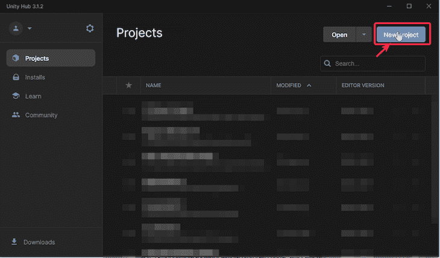

点击**新建项目**后，弹出如下窗口。要确保我们创建的是 3D 项目，请完成以下步骤:

1.  从模板中选择 **3D**
2.  将**项目名称**从“我的项目”更新为“Hello ProBuilder”
3.  点击**创建项目**按钮

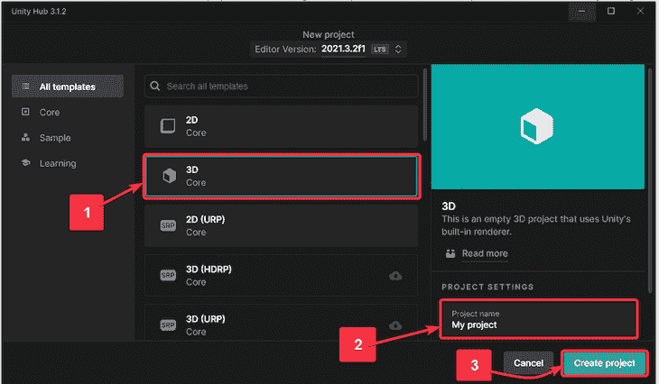

该项目将需要几分钟时间在 Unity 中打开。

保持项目开放，让我们致力于集成 ProBuilder。

## 使用 Unity 设置 ProBuilder

在这一步，您将把 ProBuilder 包添加到 Unity 中的 **Hello ProBuilder** 项目中。

首先，下载 ProBuilder 包。为此，进入**窗口** > **包管理器。**切换**包**到**统一注册表**。搜索 **ProBuilder** 并点击**安装**。

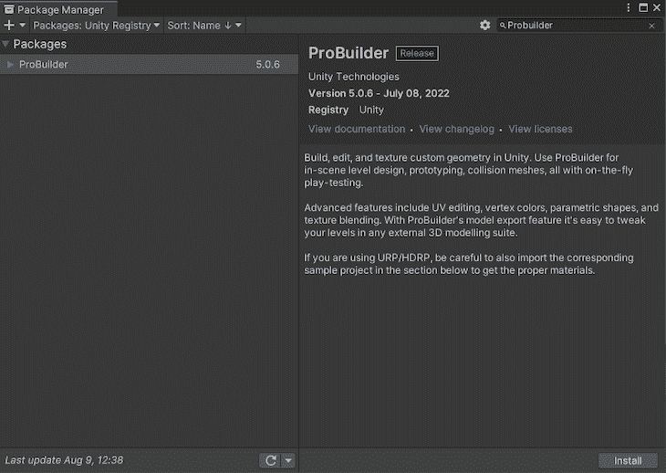

要验证 ProBuilder 是否安装成功，请转到 Unity 编辑器左下方的项目面板。展开**包。如果你在列表中看到 **ProBuilder** ，你就知道 ProBuilder 已经成功安装。**

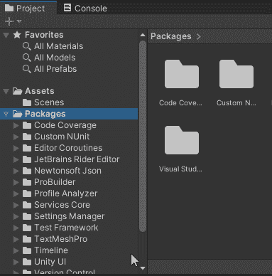

在顶部工具栏中，点击**工具**>**ProBuilder**>**ProBuilder 窗口。**将 ProBuilder 窗口停靠在您想要的任何位置。我喜欢把它停靠在层级面板旁边。

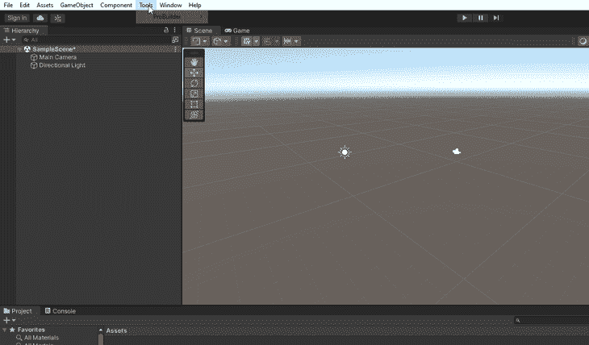

太好了。您已经准备好探索 ProBuilder 的不同特性。

## 在 ProBuilder 中使用形状

让我们从**新形状**开始。

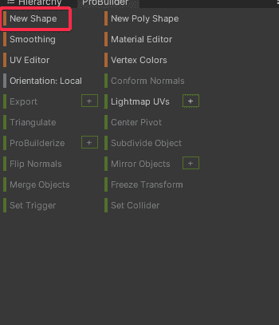

新的形状功能允许您创建 12 种不同的基本形状:

1.  拱门
2.  圆锥体
3.  立方
4.  圆筒
5.  门
6.  管
7.  飞机
8.  棱镜
9.  范围
10.  鬼怪；雪碧
11.  楼梯
12.  花托

让我们从将一个立方体带入场景开始。为此，单击**新建形状。**你会在场景面板的右上角看到一个创建形状面板。选择立方体图标。按住左键并像这样拖出形状:

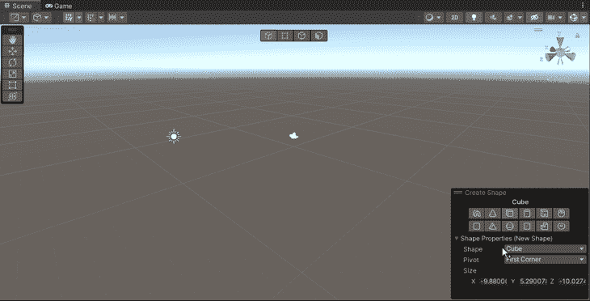

将 X、Y 和 z 轴上的立方体大小设置为 1 个单位。

注意:如果你回到层级面板，你会看到新的形状(即立方体)是一个游戏对象。

## Unity 中的选择模式

场景面板顶部的四个按钮用于在以下四种选择模式之间切换:

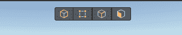

1.  对象选择
    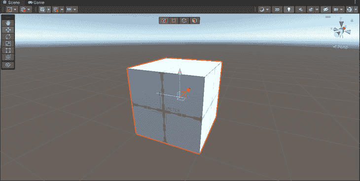
2.  顶点选择
    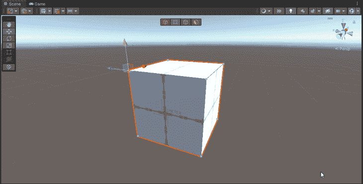
3.  边缘选择
    
4.  面部选择
    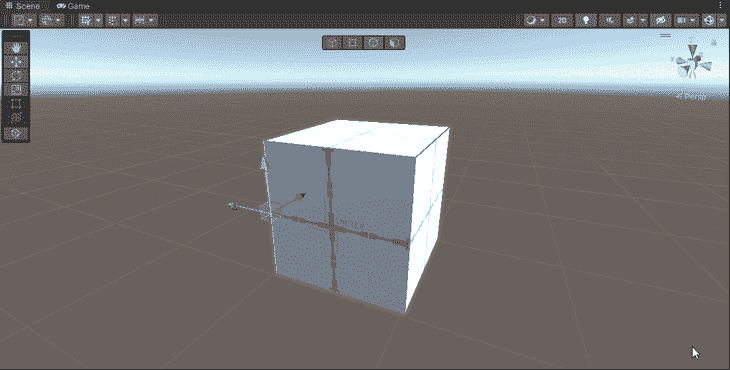

对于 Unity 中的标准 3D 对象，这种级别的操作是不可能的。换句话说，你可以创建一个立方体游戏对象(右击> **3D 对象** > **立方体**)，但是你不能在 Unity 内控制它的顶点、边或面。这就是为什么用 ProBuilder 创建立方体(或任何其他形状)是更好的选择。

您可以对 3D 对象执行某些操作，以帮助您创建想要实现的形状。您将在本文中执行的三个操作是:

1.  翻转法线
2.  推出
3.  斜角规

## 使用 ProBuilder 在 Unity 中创建一个房间

让我们从创建房间的边界开始。这比你想象的要容易。

1.  创建一个立方体(使用 ProBuilder，而不是 Unity 的标准 3D 对象)
2.  保持尺寸为 5 x 2 x 5。这就是你得到的👇
    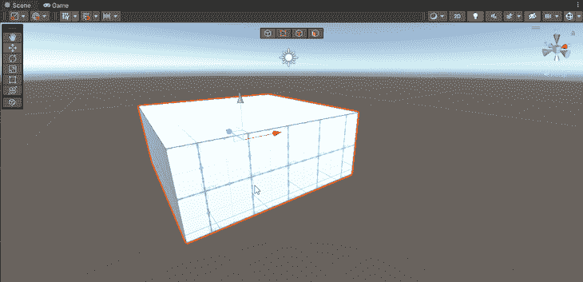
3.  确保您处于对象选择模式。选择多维数据集。从 ProBuilder 面板点击**翻转法线**，你会得到一个房间。简单吧？
    T3

现在让我们在这个房间里增加楼梯。

首先，进入层次面板>**选择立方体**，将房间放大 10 倍。在右侧的检查器面板中，确保为“缩放”属性启用了“受约束的比例”。然后把 10 作为 X，Y，z 的刻度。

接下来，切换到 ProBuilder 面板，单击**新形状**，然后在创建形状面板中单击**楼梯**图标。左键点击场景并按住。拖动以沿 X 和 Z 轴拉伸。松开左键。沿着+ve Y 轴移动光标以设置楼梯的高度。做一个左点击，就是这样。您已经创建了一个楼梯。

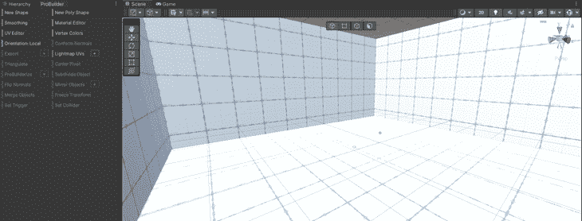

专业提示:确保在创建新形状后，不要立即选择任何其他对象。否则，您将无法从楼梯的配置窗口(或**创建形状**窗口)中更改楼梯。您必须删除现有的楼梯并创建另一个。在最初的几次尝试中，这可能很难，但是通过一些练习，你会掌握它的窍门。我的建议是开始的时候慢慢来。渐渐的，你会变得更快。

在这里尝试不同的**楼梯设置**，观察变化。

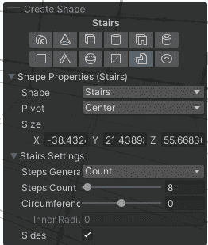

我为楼梯保留了这些设置:

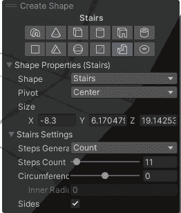

忽略形状属性**下的值。**根据你要去的‌look，你可能会有不同的价值观。

这是我房间的样子:

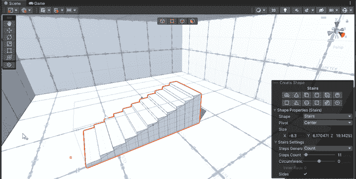

现在，让我们说，如果有一个角色走上楼梯，在楼梯的尽头应该有某种平台可以走动；否则，角色会倒下。让我们通过挤压来建造这个小平台。

1.  切换到面选择模式，选择楼梯的端面: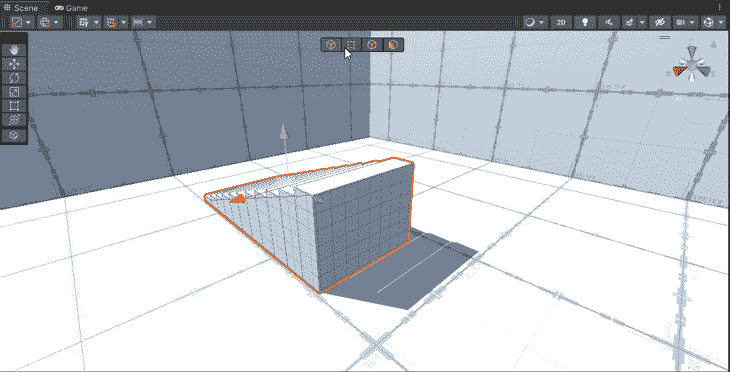
2.  按住 **Shift** 向前拖动选中的面。这一步叫做挤压。你只是挤压了楼梯的一面。
    T3
3.  现在，水平增加平台的长度，像这样:
    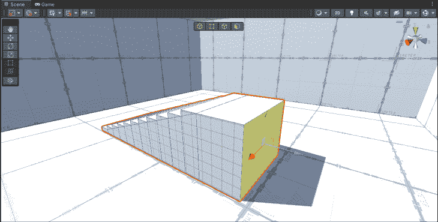

你可以随意增加平台的厚度。请随意尝试。把这当成“艺术自由”

现在让我们看看如何倒角。可以在边和面上进行倒角。从技术上来说，如果你斜切一个面，那么组成这个面的所有边都将被斜切，所以它仍然只应用于边。这就是倒角的样子-选定面的锐边变成圆形(倒角)。

要进行倒角，选择一个面或一条边，并点击 ProBuilder 面板上的**倒角**按钮。

如果点击**倒角**按钮右侧的 **+** 图标，也可以调整倒角量。

尝试其他操作，包括:

1.  细分
2.  合并
3.  删除

看你能想出什么环境。

## 将一个角色带入你的 Unity 环境

从 Unity 下载这个免费的[初学者资源包](https://assetstore.unity.com/packages/essentials/starter-assets-third-person-character-controller-196526)。如果您之前没有下载过，它会显示“添加到我的资产”点击那个然后在 Unity 中点击**打开。**

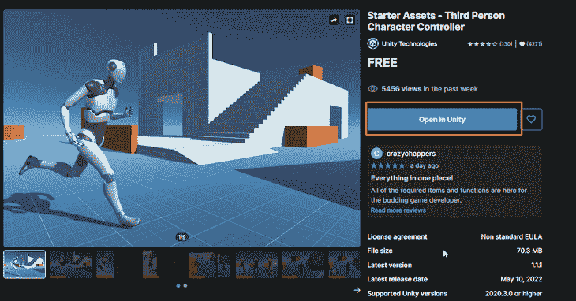

软件包管理器将在您的 Unity 项目中自动打开。然后，点击右下角的**下载**按钮。

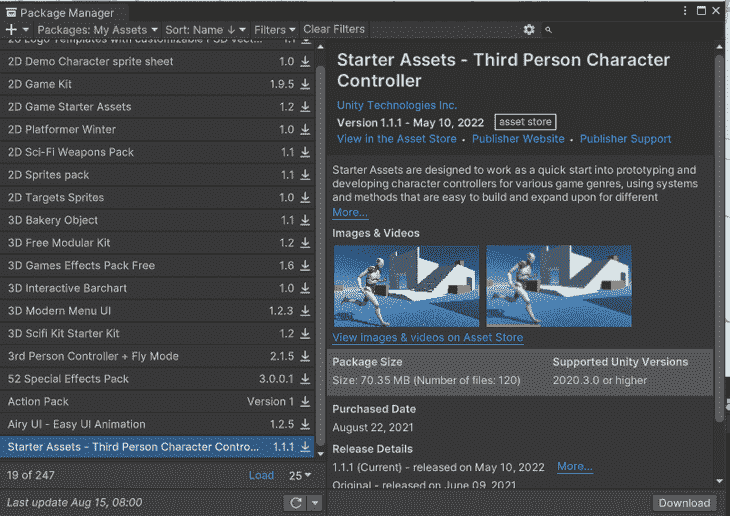

接下来，点击**导入。**

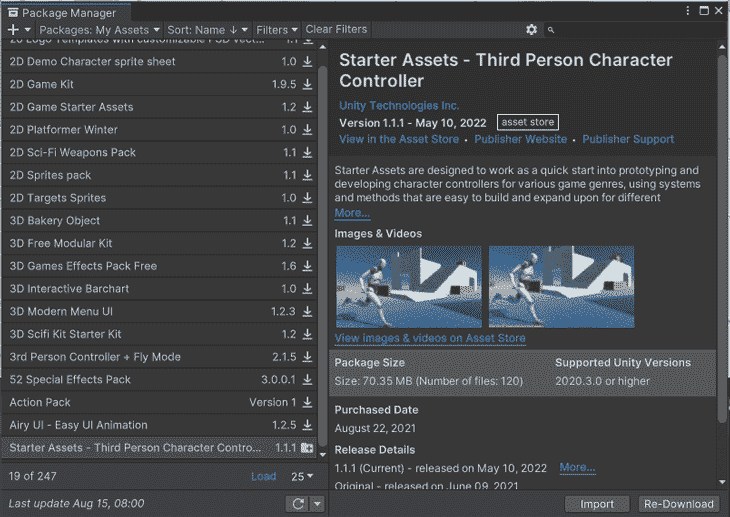

从场景中删除**主摄像机**。

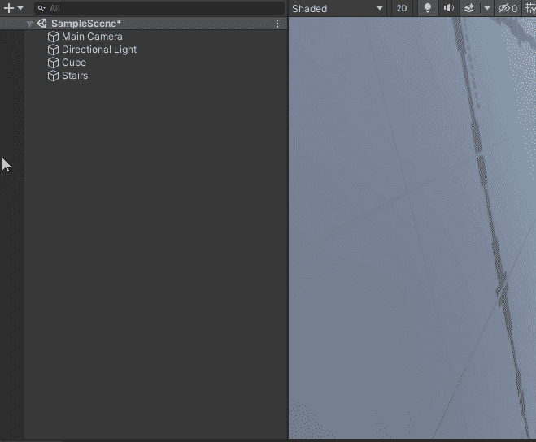

然后转到资产面板>**起始资产** > **第三个人控制器** > **预设**。

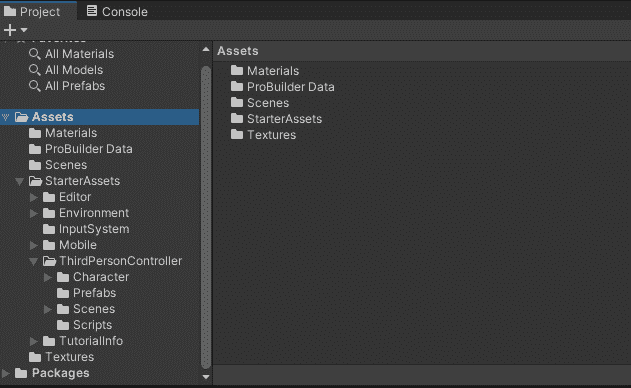

将**NestedParentArmature _ Unpack**预设拖到场景中，并将其放置在房间内您喜欢的任何位置。

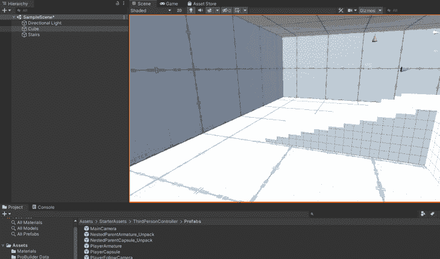

通过将比例改变 5 来增加预设的尺寸(或者任何你觉得好的尺寸)。

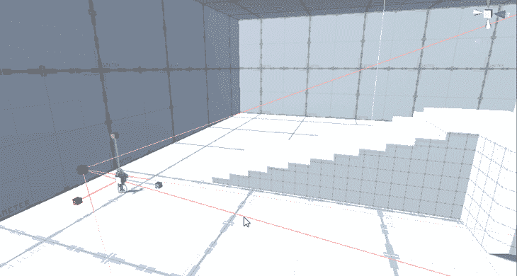

从层次面板>**NestedParentArmature _ Unpack**>中选择 **PlayerArmature** 。在“检查器”面板中，找到“第三人控制器”脚本，并更改以下值:

1.  移动速度= 15(根据你的喜好)
2.  冲刺速度= 25(根据你的喜好)

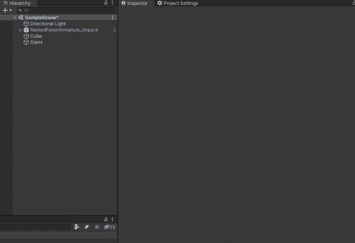

点击**播放**让你的角色在环境中走动。使用 W、A、S 和 D 键四处移动。按空格键跳跃，用鼠标四处张望。

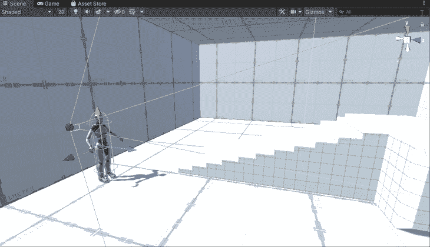

## 结论

厉害！你刚刚用 ProBuilder 在 Unity 中创造了一个关卡。

如果你面临任何问题或需要一些帮助，请在 [Twitter](https://twitter.com/knightcube) 或 [LinkedIn](https://linkedin.com/in/knightcube) 上 ping 我，如果你正在寻找更多 Unity 教程和资源，请查看我的 [Gumroad 页面](https://knightcube.gumroad.com)或 [YouTube 频道](https://www.youtube.com/knightcubexr)。

## 使用 [LogRocket](https://lp.logrocket.com/blg/signup) 消除传统错误报告的干扰

[LogRocket](https://lp.logrocket.com/blg/signup) 是一个数字体验分析解决方案，它可以保护您免受数百个假阳性错误警报的影响，只针对几个真正重要的项目。LogRocket 会告诉您应用程序中实际影响用户的最具影响力的 bug 和 UX 问题。

然后，使用具有深层技术遥测的会话重放来确切地查看用户看到了什么以及是什么导致了问题，就像你在他们身后看一样。

LogRocket 自动聚合客户端错误、JS 异常、前端性能指标和用户交互。然后 LogRocket 使用机器学习来告诉你哪些问题正在影响大多数用户，并提供你需要修复它的上下文。

关注重要的 bug—[今天就试试 LogRocket】。](https://lp.logrocket.com/blg/signup-issue-free)