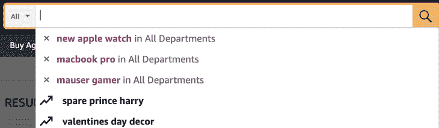
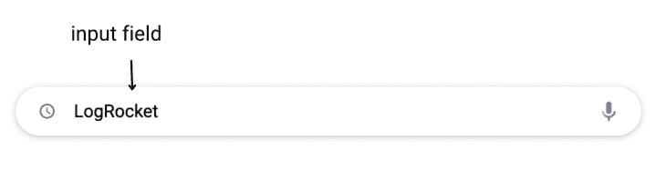
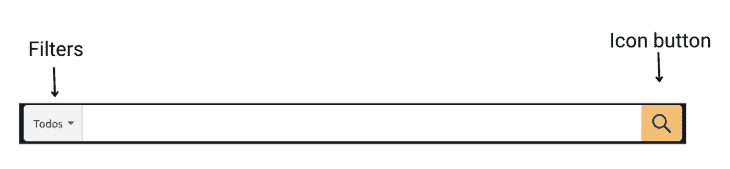
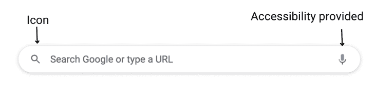
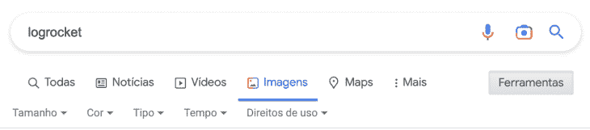
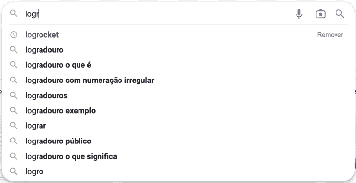
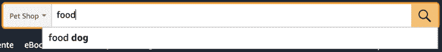

# 设计一个带有直观自动完成功能的搜索栏

> 原文：<https://blog.logrocket.com/ux-design/design-search-bar-intuitive-autocomplete/>

你的网站应该有搜索栏吗？在本文中，我们将探讨设计一个有效的带有自动完成功能的搜索栏的主要考虑因素。我们还将提供一系列工具和服务来帮助您创建搜索栏，从而改善您网站的用户界面。

## 网站何时应该有搜索栏

想象一下，你的网站实际上是一个物理空间，你的用户来到这个空间寻找一些东西。那个人需要帮助吗？

就像在超市里，标志帮助你找到你要找的东西，网站上设计良好的信息架构帮助用户找到他们要找的内容。

然而，你可能很着急或者需要一点额外的指导来找到一些东西，这就是搜索栏进入游戏的原因。

一个好的搜索栏就像超市里乐于助人的工作人员，他们可以指引你到正确的地方，甚至帮你找到你不确定如何描述的产品。

通过提供一个用户友好的搜索栏，你可以为你的用户创造一个愉快的体验，帮助他们快速找到他们想要的东西。

一般来说，搜索栏对于任何拥有大量信息或内容的网站来说都是一个很有价值的补充。这可能包括拥有大量产品目录的网站，例如在线商店或商品数据库。在这些情况下，搜索栏可以帮助用户轻松找到他们正在寻找的信息，并使他们在网站上的体验更有效。

然而，对于导航简单、内容不多的网站来说，也许值得测试和验证搜索栏是否真的有必要。

总的来说，在网站上包含搜索栏的决定应该基于网站的特定需求和目标，以及它包含的数量和复杂性。

## UX 设计中搜索栏背后的原则

在你开始为你的网站设计任何 UI 组件之前，后退一步，考虑一下 UX 设计的原则。

这些原则可以应用到你可能有的每一个单独的组件，当然，今天我们将讨论适用于搜索栏的主要原则。

### 使其易于被用户发现

雅各布定律指出，用户更喜欢与他们过去使用过的其他网站相似的网站，这意味着用户期望找到与他们在大多数其他网站上找到的搜索栏相同的位置。

它通常位于网站的顶部，清晰易辨。

### 让它变得简单明了

用户更喜欢易于理解的界面，不需要认知努力，所以在你的搜索栏中使用标签、图标、极简主义和直观的 UI 设计。

Figma 的搜索栏就是一个很好的例子:它没有压倒性的设计，提供一个图标，所以用户可以快速浏览页面并找到它。

此外，占位符文本提供了可以搜索的内容的线索。

### 相关性和准确性

搜索功能应该为用户提供相关和准确的结果。这意味着搜索算法应该能够理解用户的意图并返回最相关的结果，并且应该能够处理用户搜索查询中的拼写错误、同义词和其他变体。

为此，你将依靠你的开发团队；他们可能会结合使用自然语言处理(理解用户的意图)、模糊匹配和同义词扩展(处理拼写和含义错误)以及机器学习技术(提高搜索的准确性)。

是的，我们也有做得很好的 APIs 我们稍后会详细讨论它们。

### 速度和响应能力

搜索功能应该快速响应。这意味着它应该快速返回结果，而不需要用户等待，并且它应该能够处理大量的数据而不会降低页面的速度。

被认为是可接受的具体时间量将取决于上下文和用户的期望，但是用户不想等待。如果可以，保持在 2 秒以下。根据 [Portent](https://www.portent.com/blog/analytics/research-site-speed-hurting-everyones-revenue.htm#:~:text=The%20first%205%20seconds%20of,(between%20seconds%200%2D5)) 的研究，一个慢的网站会直接影响你的转化。

### 定制和灵活性

搜索功能应该允许用户定制和细化他们的搜索结果。这意味着它应该为用户提供过滤或排序结果的选项，并且应该允许用户保存和访问他们以前的搜索查询和结果。

谷歌就是一个很好的例子，但是当然，这将取决于你的网站的规模，以及它是否会成为特定产品和用户的补充。

亚马逊也是一个很好的例子。你可以按部门搜索产品，它会保存并显示你以前的搜索。

****

## 用户界面和 UX 设计中搜索栏应该包括什么

根据雅各布定律，你的搜索栏需要足够熟悉，以便新用户浏览。一个好的搜索栏包括:

*   输入字段—用于键入搜索内容

*   按钮或图标—用户可以单击以提交搜索，或者您可以自动完成用户正在搜索的内容，搜索将在用户选择它时提交

*注意，提供辅助工具也很重要，根据网站的类型，你甚至可以提供不同的方式来输入搜索请求。*

*   标签和/或占位符文本—用于指示用户应该搜索的内容以及需要时的说明。它可以在搜索栏内，没有聚焦的文本，也可以在搜索栏的顶部。在某些情况下，一旦用户键入要写的内容，占位符文本就会移动到顶部，因此用户仍然会感觉到他们应该在搜索中键入什么。输入字段内的占位符文本应遵循[表单字段的最佳实践](https://blog.logrocket.com/ux-design/better-form-design-ux-tips-tools-tutorial/)，占位符通常以浅灰色显示，以便用户识别

*   过滤器和控件(可选)——Google 使用过滤器和控件来允许他们的用户通过图片、新闻、时长等来细化搜索结果

*   自动完成—也称为“提前键入”或“自动建议”，自动完成是一种基于用户在搜索栏中键入的字符向用户提供建议的功能。我们有一些自动完成的最佳实践。正如您在下面看到的，由自动完成功能添加的内容应该总是与用户键入的内容相区别。在这里，谷歌用粗体来区分它:

## 如何用自动完成功能设计一个很棒的 UI 搜索栏

要设计具有自动完成功能的搜索栏，您应该按照下列步骤操作:

### 组织搜索信息

首先，确定用户将搜索的信息类型，并尝试以重要的方式组织这些信息。这将有助于为搜索选项创建清晰的描述性标签和占位符文本，也有助于搜索算法理解用户的意图并返回相关结果。

亚马逊按部门组织搜索，因此用户可以更具体地找到产品。

### 使用透明标签

使用清晰的描述性标签和占位符文本来指示搜索选项，并提供用户可以执行的搜索类型的示例。

例如，如果你的网站根据一个人的电话号码来寻找他，用一个占位符让用户知道他们应该输入一个电话号码，并且要明确格式。这将帮助用户了解他们可以搜索什么以及如何使用搜索功能。

### 对你的搜索栏进行用户测试

与真实用户一起测试你的搜索栏设计，收集反馈并改进你的设计。这可以帮助您识别搜索栏的任何问题，并根据用户反馈做出改进。

您可以添加用户在特定时间的小调查，这样每当用户从搜索中获得结果时，他们就可以提供关于它是否有帮助的反馈。

### 使用您的设计系统保持一致性

遵循你的设计系统，将搜索栏整合到网站的整体用户界面中。如前所述，这将确保搜索栏易于用户找到，并与网站的其他部分保持一致。

此外，在使用自动完成时，要注意好的实践(比如在搜索栏中加粗搜索结果)，这样用户可以快速浏览结果，知道哪一个最适合他们。

有很多工具和服务可以帮助你为你的网站 UI 建立一个搜索栏。

这些工具和服务的一些示例包括:

设计系统，它提供了一组可重用的组件和设计一致的用户友好界面的指导方针。我的建议是:

*   材料设计:这是一个由谷歌开发的综合设计系统，为各种平台和设备的视觉、交互和动作设计提供指导
*   [苹果人机界面指南(HIG)](https://developer.apple.com/design/) :为 iOS、iPadOS、macOS、watchOS 和 tvOS 平台的应用提供设计指南。HIG 涵盖了广泛的设计主题，包括界面元素，视觉设计，布局和交互设计

原型工具，可以用来创建搜索栏设计的交互式模型，并与用户一起测试。我建议:

*   [Sketch](https://www.sketch.com/?utm_source=google&utm_medium=cpc&adgroup=&device=c&matchtype=e&utm_campaign=ADDICTMOBILE_SKETCH_GAD_DG_IT_T3_ALWAYS-ON_S_TRF_PROS_BRAND&utm_term=sketch&utm_source=google&utm_medium=cpc&utm_content=TOF_BRND__generic&hsa_acc=8710913982&hsa_cam=16733312078&hsa_grp=134572339189&hsa_ad=591810250267&hsa_src=g&hsa_tgt=kwd-14921750&hsa_kw=sketch&hsa_mt=e&hsa_net=adwords&hsa_ver=3&gclid=Cj0KCQiAzeSdBhC4ARIsACj36uFEV3Q4btE0pi5MIyKVelahEZa1UJM9gIUoOgk07-auH1ztYimM6y0aAjsuEALw_wcB) :这款设计和原型制作工具被 UX 的设计师们广泛使用，尤其是在 Mac 上工作的设计师们
*   [Figma:](https://www.figma.com/) 这款在线设计和原型制作工具因其协作功能而深受 UX 设计师的欢迎

搜索栏生成器，允许您创建自定义的搜索栏，而无需编写任何代码:

*   谷歌定制搜索:这项由谷歌提供的服务允许你为自己的网站创建一个定制的搜索引擎
*   免费搜索:通过免费搜索，你可以用一段简单的代码为你的网站免费创建一个搜索栏

搜索栏插件，您可以将其集成到您的网站中，以添加具有自动完成功能的搜索栏:

搜索引擎 API，可以用来增强搜索栏的功能:

*   Google 定制搜索 API :这个 API 允许开发者构建定制搜索引擎，搜索特定的网站或页面，也可以搜索整个网络

## 结论

这里有一个要点是，考虑搜索栏对你的网站来说是否必要是很重要的。

如果您的网站有大量的内容或作为信息的数据库，带有自动完成功能的搜索栏可以极大地改善用户体验，使访问者更容易找到他们要找的东西。有一些工具和服务可以帮助你为你的网站创建一个有效的搜索栏。

通过花时间仔细设计和实现搜索栏，您可以增强网站的可用性，并为用户提供更好的体验，从而带来更多可发现的内容页面。

*精选图片来源:* [IconScout](https://iconscout.com/icon/search-bar-1911921)

## [LogRocket](https://lp.logrocket.com/blg/signup) :无需采访即可获得 UX 洞察的分析

[LogRocket](https://lp.logrocket.com/blg/signup) 让您可以回放用户的产品体验，以可视化竞争，了解影响采用的问题，并结合定性和定量数据，以便您可以创建令人惊叹的数字体验。

查看设计选择、交互和问题如何影响您的用户— [立即尝试 LogRocket】。](hhttps://lp.logrocket.com/blg/signup)