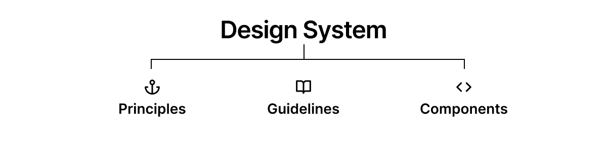
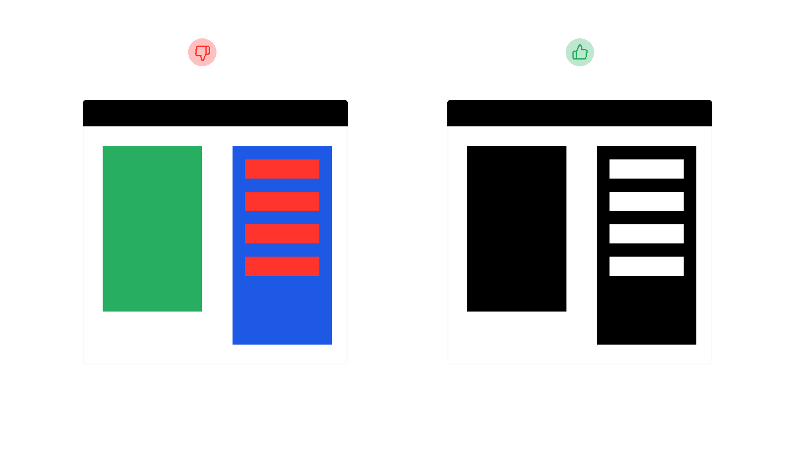
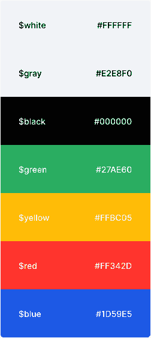

# 开发人员的设计系统技巧

> 原文：<https://blog.logrocket.com/design-system-tips-for-developers/>

设计系统无处不在(我们没有注意到)。它们有助于提高全球团队的生产力，帮助公司用更成熟的标准和原则打造更好的产品，并改善消费者的体验。

构建设计系统是现在的热门话题，尤其是在开发社区。

今天，构建一个设计系统比 10 年前更容易，那时我们还没有如此成熟的框架、库和工具。

要创建一个健壮且一致的设计系统，通过许多不同的平台交付给消费者，需要时间和大量的艰苦工作。

一个好的设计系统需要大量的艰苦工作，以及大量的研究、分析、原型设计、开发和测试时间，以便为用户提供最佳体验。

## 为什么要建立设计系统？

要建立一个成功的公司，沟通是必不可少的。

一个没有非常善于沟通的团队的公司很可能不会成功，也肯定不会为用户提供好的产品或体验。

一个想要变得可伸缩、可维护、一致和健壮的公司需要创建并遵循一套原则、标准和指南，以获得更好的开发和体验。

这一套原则、标准和指导方针可以通过创造一种更好的交流方式来帮助团队成功并创造出令人敬畏的产品。沟通改善了整个团队的体验，为消费者带来了更好的最终产品。

这就是设计系统的理念。设计系统是用于创造更好产品的原则、标准、指南和组件的系统。

设计系统有助于制造更好更快的产品。它们促进一致性，消除组件、行为、标准之间的摩擦和不一致，并提高公司现有产品的生产率和可维护性。

一个成功的设计系统会照顾到一切。该系统建立在以实现一致性、可重用性、可维护性、可伸缩性和客户价值为中心的原则、指南和标准之上。

如果你想知道设计系统如何帮助一家公司和它自己的团队交付更好、更一致的产品，这里有一些设计系统可以为你做的事情:

### 消除摩擦和矛盾

想象一下，一家公司在不同的国家有许多专业人员，这些专业人员中的大多数都在从事同一种产品。

如果他们没有创建一个遵循原则、标准和指导方针的过程，他们很容易在产品中产生摩擦和不一致。

在这种情况下，设计系统可以提供过程，告诉他们做什么，如何做，何时做。

### 提高一致性、速度和体验

知道做什么，什么时候做，是一个过程。在这种情况下，设计系统可以帮助实现一个更加一致和沟通的团队。

当团队确切地知道完成某项任务需要做什么时，工作的速度和质量将会显著提高。

* * *

### 更多来自 LogRocket 的精彩文章:

* * *

### 品牌知名度

品牌认知度反映了消费者对某个品牌的熟悉程度，以及他们是否认可这个品牌。

一个成功的设计系统可以帮助传播品牌意识，让消费者更熟悉这个品牌，更有可能快速识别它。

## 一个成功的设计系统

一个成功的设计系统不仅仅是漂亮的颜色、间距和一些不同的 UI 组件。

创建一个设计系统不是一件容易的事情，需要从过程的开始就小心翼翼地完成，这样最终的结果才能一致和健壮。

了解如何在开发过程中避免某些错误以确保设计系统正常运行是很重要的。

我们将讨论一些我们作为开发人员在开发我们自己的设计系统或在现有系统中工作时必须注意的要点。

### 了解你公司的文化

一个公司的文化是将在一个组织中工作的人联系在一起的道德、价值观和目标的结合的结果。

公司文化影响着在一个组织工作的人对他们的工作的感觉，他们相信的价值观，组织的预期未来，他们的偏好，以及他们感觉他们的工作如何影响人们的生活。

在创建设计系统的过程中，了解贵公司的文化非常重要。

一个有明确文化的公司最终会有一个有明确原则和标准的设计系统。

设计系统还将通过创建标准和原则来帮助改善公司的文化，在那里工作的人将遵循这些标准和原则，以便他们可以更快、更一致、更有效地交付产品。人们会觉得更有能力为组织做出贡献。

### 易接近

每个公司都希望他们的产品被每个人消费，但是当我们谈论网络的可访问性时，许多人并没有把可访问性作为优先考虑的事情。

包容性应该是当今每个公司的核心价值观。患有不同形式残疾的人也可以访问互联网，他们需要能够在使用任何产品时都有愉快的体验。

开发者应该注意这个话题，一致的设计系统应该考虑可访问性。易访问性应该是设计系统中的一个原则，而不是一个额外的特性。

有一件事很有帮助，那就是创建一个专门的页面，展示它在设计系统中是如何工作的。

例如，Salesforce 的 Lightning 设计系统有一个页面，他们在那里分享他们的可访问性指南和模式。创造一些设计系统一致的，健壮的，独特的，但是可以被每个人使用的东西。成功的设计系统听起来就是这样。遵循[WCAG [网站内容可访问性指南](https://www.w3.org/WAI/standards-guidelines/wcag)。

### 一致性是关键

随着公司的成长，产品越来越大，新的功能不断增加，在这些变化中有一个原则必须是最重要的:一致性。

开发者要有意识，注意细节。一致性是每个设计系统成功的关键。

灵活性可能会损害设计系统的一致性。

例如，如果您的设计系统将用于许多不同的平台，如 iOS、Android 或 Apple Watch，则该设计系统将不得不强制执行并支持不同的平台。

设计系统需要在所有平台上具有相同的效率和一致性。

一个成功的设计系统是一个确保所有原则、标准和组成部分的一致性的系统。

### 使用设计符号

每个设计系统最终都会有很多不同的值用于不同的组件，比如间距值、动画值、颜色值等等。

如何存储这些值并确保它们被正确使用是一个问题。

设计标记是视觉原子，可以存储设计属性，如十六进制、像素、颜色、间距、版式和许多其他值。

设计系统中使用的每一个值都可以并且应该存储在设计令牌中，以提高设计系统的一致性和可维护性。

类似于编程语言中的变量，设计符号代表设计系统内部的内聚和一致的决策。他们确保每个部分都是系统统一的，并使用正确的价值观。

### 文档非常重要

如今文档非常重要，尤其是对开发人员而言。它不仅帮助开发人员跟踪变化，确保一致性，并理解不同功能的目的，而且还描述了工具或产品如何工作以及如何开始使用它。

一个设计系统可以是非常漂亮的，有着现代的排版、漂亮的颜色和令人敬畏的 UI 组件。

但是，如果没有适当的文档，或者文档写得不好，它将毫无用处。

文件是如此重要，因为设计系统的其他部分，如原则，组件等。请记住，你可能不是唯一一个阅读、使用和编辑设计系统的人。

一个全面的设计系统文档可以帮助人们更快更容易地开始。它会直接把他们带到他们想要的地方，而不需要阅读和搜索很多。

## 结论

在本文中，我们了解了如何创建更好的设计系统，通过使用一组原则、标准和组件，帮助公司和开发人员在创建新产品时获得更好的体验。

## 通过理解上下文，更容易地调试 JavaScript 错误

调试代码总是一项单调乏味的任务。但是你越了解自己的错误，就越容易改正。

LogRocket 让你以新的独特的方式理解这些错误。我们的前端监控解决方案跟踪用户与您的 JavaScript 前端的互动，让您能够准确找出导致错误的用户行为。

LogRocket 记录控制台日志、页面加载时间、堆栈跟踪、慢速网络请求/响应(带有标题+正文)、浏览器元数据和自定义日志。理解您的 JavaScript 代码的影响从来没有这么简单过！

[Try it for free](https://lp.logrocket.com/blg/javascript-signup)

.