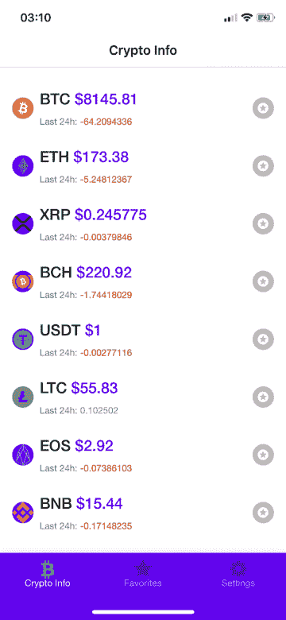
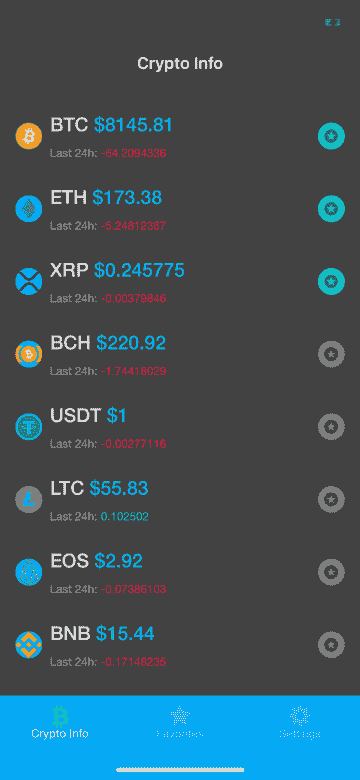
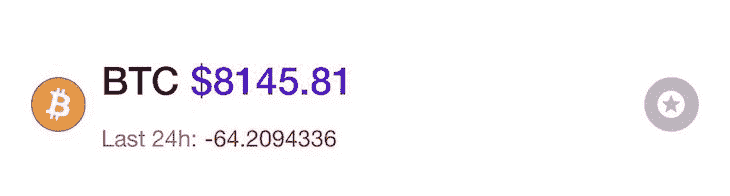
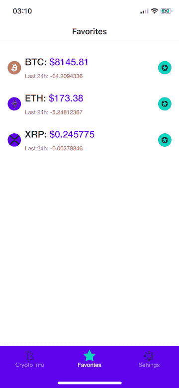
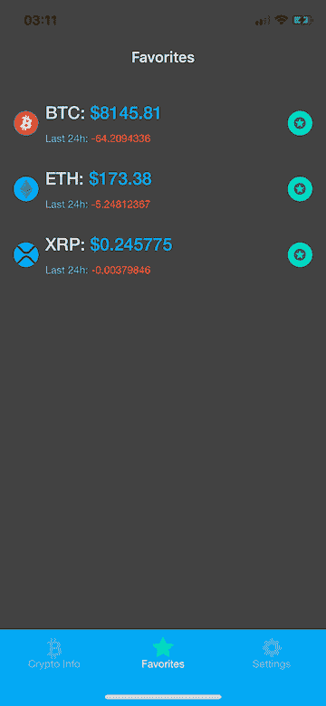
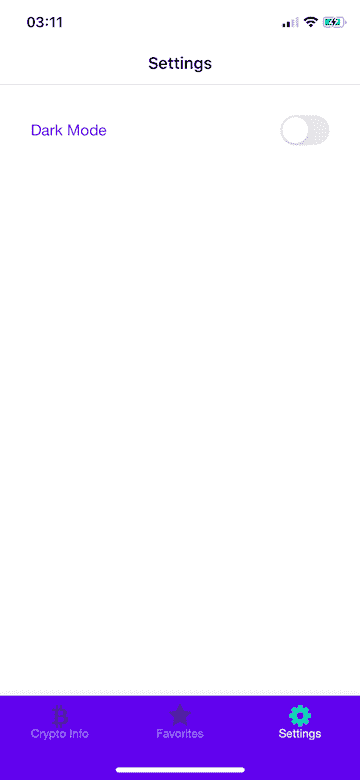
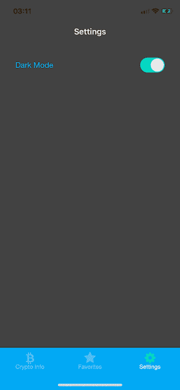
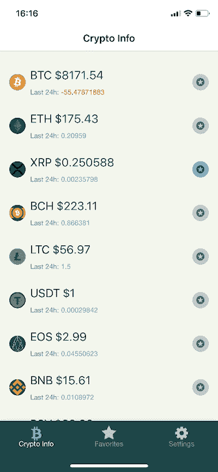

# 使用 react-native-paper-log rocket Blog 设计带有自定义主题的 UI

> 原文：<https://blog.logrocket.com/designing-a-ui-with-custom-theming-using-react-native-paper/>

## 介绍

*“我有一个想做的应用的想法”* —这是程序员常用的一句话。我自己也说过不下 10 次了。如何将那个想法变成现实？有很多事情要做，但是在开发的开始，从[最小可行产品(MVP)](https://blog.logrocket.com/product-management/what-is-minimum-viable-product-mvp-how-to-define/) 开始是一个好主意。

作为 React 原生开发者，没有比使用技术本身更好的选择来创建一个应用程序。我没有什么设计技能，所以我宁愿一开始就把时间投入到这个想法的编程中，以测试它是否有意义。

所以，我是一个没有设计技能的程序员，我想尽快构建一个看起来不错的 MVP。实现这一点的最佳方式是使用某种组件库。有几个组件库可供选择，但在本文中，我将描述如何用 react-native-paper 库构建一个简单的应用程序。

本文其余部分所需的定义:

[**react-native-paper**](https://callstack.github.io/react-native-paper/index.html):

> Paper 是 React Native 的可定制和生产就绪组件的集合，遵循 [Google 的材料设计](https://en.wikipedia.org/wiki/Material_Design)指南。

[**材料设计**](https://material.io/design/) :

> 材料设计是谷歌在 2014 年开发的一种设计语言。在 Google Now 中首次亮相的“卡片”主题的基础上，材料设计使用了更多基于网格的布局、响应动画和过渡、填充以及灯光和阴影等深度效果。

react-native-paper 通过实现谷歌开发的广泛使用的设计原则，对构建一个非常好的用户界面有很大帮助。通过提供一组具有良好主题支持的可定制组件，我们可以在很短的时间内构建一个 MVP。

为了展示它的一些功能，我创建了一个名为“Crypto Info”的简单应用程序注意，我在本教程中使用的是 [Expo](https://expo.io/learn) ，完整的应用程序代码可以在 GitHub 上的[这里获得。](https://github.com/Karniej/Crypto-Info)

## 安装和设置

和往常一样，我们从由我们选择的包管理器安装库开始(这里我使用 Yarn):`yarn add react-native-paper`。

如果您的应用程序是由 react-native CLI 制作的，您还需要向项目添加 SVG 图标:

```
yarn add react-native-vector-icons
react-native link react-native-vector-icons
```

> 如果你正在用 [Expo](https://expo.io/learn) 构建你的 MVP(就像我在这个例子中所做的)，你可以省略这个步骤。

现在，将 Babel 插件添加到生产环境的`babel.config.js`文件中，因此它应该看起来像这样:

```
module.exports = {
  presets: ['module:metro-react-native-babel-preset'],
  env: {
    production: {
      plugins: ['react-native-paper/babel'],
    },
  },
};
```

大多数时候，我们不会使用我们正在导入的库中的每个组件。添加这个插件有助于我们减少捆绑生产应用中的 react-native-paper 包的大小，因为它只捆绑了我们实际使用的组件。

## 使用

为了开始使用这个包，我们必须先做一些简单的设置。

在`App.js`文件中:

```
import { AppLoading } from 'expo'
import { Platform, StatusBar, StyleSheet, View } from 'react-native'
import { Ionicons } from '@expo/vector-icons'
import { DefaultTheme, DarkTheme, Provider as PaperProvider } from 'react-native-paper'
import { StoreProvider, Store } from './Store'

const styles = StyleSheet.create({
  container: {
    flex: 1,
  },
})

function App() {
  return (
    <View style={styles.container}>
      {Platform.OS === 'ios' && <StatusBar barStyle="default" />}
      <StoreProvider>
        <Store.Consumer>
          { (value) => {
            const { isDarkModeOn } = value[0]
            return (
              <PaperProvider theme={isDarkModeOn ? DarkTheme : DefaultTheme}>
                <AppNavigator theme={isDarkModeOn ? 'dark' : 'light'} />
              </PaperProvider>
            )
          }}
        </Store.Consumer>
      </StoreProvider>
    </View>
  )
}
```

为了更容易设置，我在这个应用程序中使用`context`而不是`redux`进行状态管理。在一个`Store.Consumer`组件中，我基于`[context](https://pl.reactjs.org/docs/context.html) `value`渲染应用程序。`

`isDarkModeOn`的值是确定正在使用的`theme`的当前状态的布尔值。如果您想在以后动态地改变颜色主题，这个设置是必要的。您也可以将它与 Redux 一起使用—设置非常相似。

然后，在`[renderProps](https://reactjs.org/docs/render-props.html)`中，我为整个应用程序返回一个`PaperProvider`包装器，它的子组件是`AppNavigator`组件。

`AppNavigator`组件主题也是由相同的上下文值动态改变的，但是像`react-navigation`这样的导航库中使用的默认主题是它自己的主题，而不是纸张主题。这就是为什么，稍后，我们将不得不做更多的设置，以便在我们的导航组件中使用 DefaultTheme 和 DarkTheme 颜色。

`PaperProvider`包装器基于上下文值接收一个单独的`theme`属性——它或者是`DefaultTheme`或者是`DarkTheme`。为了更快地设置，我在本教程中使用了内置的`DefaultTheme`和`DarkTheme`。主题可以定制或完全覆盖。

完成这个设置后，我们可以开始构建我们的应用程序，并利用所有的 react-native-paper 功能。

## 构建加密信息应用程序

出于本文的目的，我构建了一个简单的应用程序，我称之为 Crypto Info，它由三个屏幕组成。它连接到 [CoinGecko API](https://www.coingecko.com/en/api) ,以获取列表和所有关于加密货币数据的必要信息。

`HomeScreen`显示加密货币列表以及每种货币的基本信息。`FavoritesScreen`显示我们最喜欢的加密货币列表，以便更容易地导航到我们最感兴趣的加密货币。`SettingsScreen`是一个具有单一设置的屏幕:一个主题切换组件。

在本文的这一部分，我将重点介绍 react-native-paper 在每个屏幕中的用法。

### `HomeScreen`

这是一个函数组件，返回 CoinGecko API 上可用的加密货币列表。它接收一个`theme` prop，可以通过来自 react-native-paper 的`withTheme`包装器获得。这允许我们使用`PaperProvider`中的主题。



Our app in light mode.



Our app in dark mode.

```
import React from 'react'
import { View, FlatList } from 'react-native'
import { get } from 'lodash';
import { withTheme,   
  Title,
  Caption,
  Divider,
  Avatar,
  Surface,
  Button,
  DarkTheme,
  DefaultTheme, 
} from 'react-native-paper'

function HomeScreen({ theme }) {
 // There's more code inside this component which will be explained later.
 return (
    <View style={[styles.container, { backgroundColor: theme.colors.surface }]}>
      <Portal>
        <Modal
          visible={isModalVisible}
          contentContainerStyle={styles.modalContent}
          dissmisable
          onDismiss={() => setModalVisibility(false)}
        >
          {renderModalContent()}
        </Modal>
      </Portal>
      <FlatList
        style={styles.flatListContainer}
        data={coins}
        extraData={coins}
        ItemSeparatorComponent={renderItemSeparator}
        ListFooterComponent={renderFooter}
        renderItem={renderItem}
        initialNumToRender={20}
        keyExtractor={keyExtractor}
        onEndReached={fetchMoreCoins}
        onEndReachedThreshold={0.2}
        contentContainerStyle={styles.contentContainer}
      />
    </View>
  )
}
```

`HomeScreen.js`包含容器`View`的内容，该容器从`theme`道具接收颜色，然后我将它传递给该容器元素的`backgroundColor`。在`View`容器中，有一个`FlatList`组件，它接收从 API 获取的数据`coins`。

如何正确地获取数据并将其传递给全局上下文存储是另一篇文章的主题。在这一篇中，我将关注这个`FlatList`组件的`render`函数。

#### `renderItemSeparator`

```
const renderItemSeparator = () => <Divider style={styles.divider} />
```

这个函数从 react-native-paper 中呈现一个`Divider`组件，它是一个“瘦的、轻量级的分隔符，将内容分组到列表和页面布局中。”

#### `renderFooter`

```
const renderFooter = () => isLoading && <Button style={styles.footer} loading={isLoading} />
```

该函数呈现一个`Button`组件，该组件接收一个状态`isLoading` bool，并在添加列表中的新内容时显示一个加载微调器。

#### `renderItem`

```
const renderItem = (item) => {
    const image = get(item, 'item.image')
    const priceChange24h = get(item, 'item.price_change_24h')
    const currentPrice = get(item, 'item.current_price')
    const symbol = get(item, 'item.symbol')
    return (
      <TouchableOpacity
        onPress={() => getCurrentItemInfo(item)}
        style={styles.surfaceContainer}
      >
        <Surface style={styles.surface}>
          <Avatar.Image style={styles.avatar} size={28} source={{ uri: image && image }} />
          <View style={styles.infoContainer}>
            <View style={styles.sectionContainer}>
              <Title
                numberOfLines={1}
                style={styles.coinName}
              >
                {symbol }
              </Title>
              <Title style={{ color: colors.primary }}>
                {' $'}
                {currentPrice}
              </Title>
            </View>
            <View style={styles.sectionContainer}>
              <Caption>Last 24h: </Caption>
              <Caption
                style={{ color: priceChange24h < 0 ? colors.error : colors.accent }}
              >
                {priceChange24h}
              </Caption>
            </View>
          </View>
          <TouchableOpacity hitSlop={{ x: 10, y: 10 }} onPress={() => handleFavorites(item)}>
            <Avatar.Icon
              size={28}
              icon="stars"
              style={[
                styles.avatar,
                { backgroundColor: isFavorited(item) ? colors.accent : colors.disabled },
              ]}
            />
          </TouchableOpacity>
        </Surface>
      </TouchableOpacity>
    )
  }
```

该函数接收一个`item`参数，它保存 API 数据中单个项目的数据。在这个函数中，我们构建了单个项目，如下所示:




这个单个项目包含来自 react-native-paper 的元素，如用于徽标的`Avatar.Image`、`symbol`和`current_price`的`Title`文本元素、`Caption`价格下的较小文本元素，以及用于将项目添加到`favorites`的星形图标按钮的`Avatar.Icon`。

当我们点击项目时，我们打开一个包含更多关于某种货币的数据的`Modal`组件。

感谢来自 react-native-paper 的`Portal`组件，我们现在可以轻松地向我们的应用程序添加一个模态组件，因为`Portal`呈现了一个应该出现在其他元素之上的组件。

### `FavoritesScreen`

这个屏幕包含了我们在上一个屏幕中`starred`的所有元素。它包含所有与`HomeScreen`相同的元素。



FavoritesScreen in light mode.



FavoritesScreen in dark mode.

### `SettingsScreen`

此时该屏幕只包含一个设置，即一个`Switch`组件。



SettingsScreen in light mode.



SettingsScreen in dark mode

```
import React from 'react'
import { View, StyleSheet } from 'react-native'
import { Switch, Subheading, withTheme, DarkTheme, DefaultTheme } from 'react-native-paper'
import { themePropTypes } from '../constants/propTypes'
import { useStateValue } from '../Store'
const styles = StyleSheet.create({
  container: {
    flex: 1,
    elevation: 2,
    padding: 16,
  },
  row: {
    flexDirection: 'row',
    alignItems: 'center',
    justifyContent: 'space-between',
    paddingTop: 16,
    paddingHorizontal: 16,
    width: '100%',
  },
})
function SettingsScreen({ theme }) {
  const { colors } = theme
  const [state, dispatch] = useStateValue()
  const { isDarkModeOn } = state
  const handleThemeChange = () => dispatch({
    type: 'TOGGLE_THEME',
    payload: !isDarkModeOn,
  })
  return (
    <View style={[styles.container, { backgroundColor: colors.surface }]}>
      <View style={styles.row}>
        <Subheading style={{ color: colors.primary }}>Dark Mode</Subheading>
        <Switch value={isDarkModeOn} onValueChange={handleThemeChange} />
      </View>
    </View>
  )
}
export default withTheme(SettingsScreen)
```

当用户按下`Switch`组件时，它会向`context`商店发送一个动作来切换整个应用程序中当前使用的`theme`。

## 主题

`react-native-paper`通过`PaperProvider`组件支持主题化，默认情况下，该组件会将`DefaultTheme`应用到应用程序中(加密信息中的`light-mode`)。由于这个组件，库中的每个组件都将自动接收传递给提供者的实际主题的样式。

自定义组件可以从库中将`theme`道具包装在`withTheme` [高阶组件](https://pl.reactjs.org/docs/higher-order-components.html)函数中后领取。在这个示例应用程序中，我使用了库中的`DefaultTheme`和`DarkTheme`，但是我们可以提供自己的自定义主题；这些是存在于`theme`对象中的元素。

```
- dark (boolean): whether this is a dark theme or light theme.
- roundness (number): roundness of common elements, such as buttons.
- colors (object): various colors used throughout different elements.
    - primary - primary color for your app, usually your brand color.
    - accent - secondary color for your app which complements the primary color.
    - background - background color for pages, such as lists.
    - surface - background color for elements containing content, such as cards.
    - text - text color for content.
    - disabled - color for disabled elements.
    - placeholder - color for placeholder text, such as input placeholder.
    - backdrop - color for backdrops of various components such as modals.
- fonts (object): various fonts used throughout different elements.
    - regular
    - medium
    - light
    - thin
```

如果你想在定制应用程序主题时获得乐趣，有一个名为[https://coolors.co](https://coolors.co/)的网站可以帮助你选择颜色。这是我在几分钟内想到的一个简单的自定义主题:

### `customTheme`

```
 const customTheme = {
    dark: false,
    roundness: 4,
    colors: {
      primary: '#034748',
      accent: '#11B5E4',
      background: '#F1F7ED',
      surface: '#F1F7ED',
      text: '#001021',
      error: '#B71F0E',
      disabled: '#BEC6C6',
      placeholder: '#1481BA',
      backdrop: '#001021',
    },
    fonts: {
      regular: 'Helvetica Neue',
      medium: 'Helvetica Neue Light',
    },
  }
```

这个应用现在看起来是这样的:



HomeScreen with our custom theme.

## 摘要

react-native-paper 是一个很棒的库，当你想立即开始你的应用想法时，它真的很有用，即使没有设计技能。我们组件的用户界面干净、简单、易于定制。真的推荐试试看！

## [LogRocket](https://lp.logrocket.com/blg/react-native-signup) :即时重现 React 原生应用中的问题。

[](https://lp.logrocket.com/blg/react-native-signup)

[LogRocket](https://lp.logrocket.com/blg/react-native-signup) 是一款 React 原生监控解决方案，可帮助您即时重现问题、确定 bug 的优先级并了解 React 原生应用的性能。

LogRocket 还可以向你展示用户是如何与你的应用程序互动的，从而帮助你提高转化率和产品使用率。LogRocket 的产品分析功能揭示了用户不完成特定流程或不采用新功能的原因。

开始主动监控您的 React 原生应用— [免费试用 LogRocket】。](https://lp.logrocket.com/blg/react-native-signup)