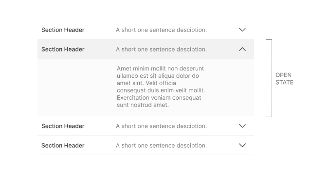
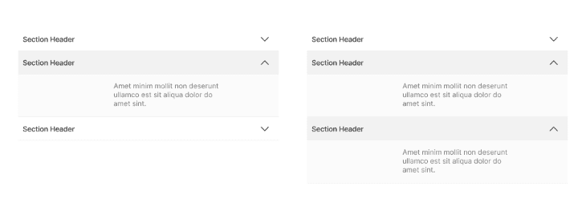
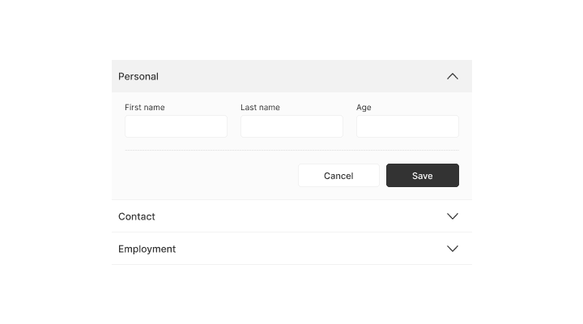
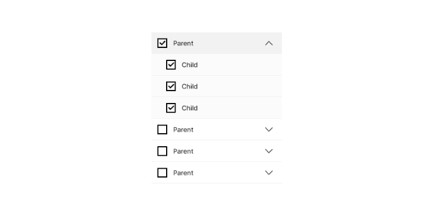
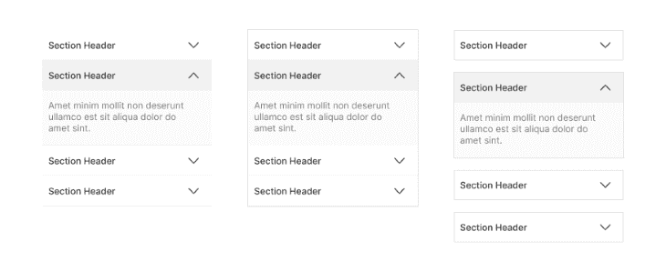
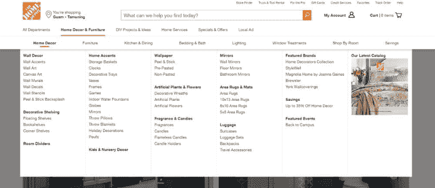
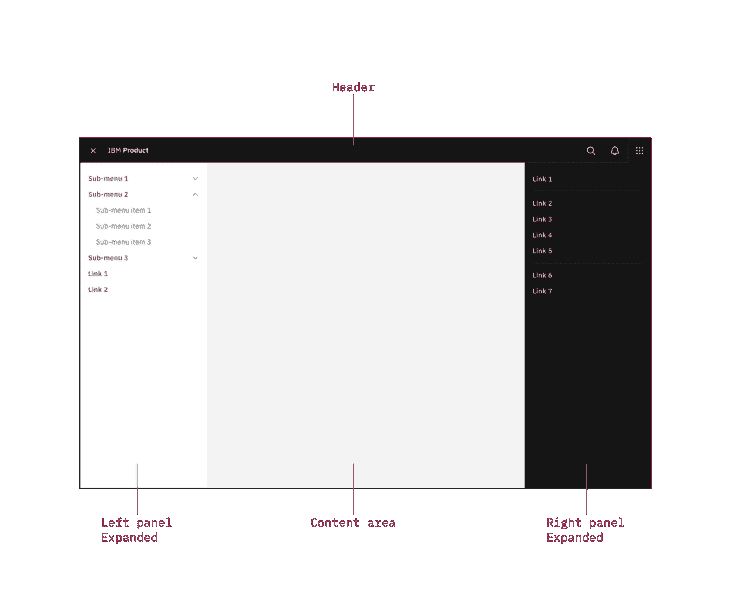

# 为复杂内容设计折叠菜单

> 原文：<https://blog.logrocket.com/ux-design/designing-accordion-menus-complex-content/>

折叠菜单是一系列相邻的部分，可以通过单击部分标题来展开或折叠以显示或隐藏内容。用户最有可能在有子项的侧边栏菜单或常见问题页面中遇到手风琴。在这些场景中，折叠的主要目的是更好地组织信息，以便可以轻松地导航大量内容。

用户必须点击章节标题才能显示内容；因此，手风琴的主要折叠状态不太突出，并为用户带来更好的用户体验。它还使用户能够区分他们想要访问的内容的优先级，从而使他们能够更快地找到他们想要的相关信息。

由于手风琴的主要好处是减少认知负荷和简化导航，我们可以将手风琴的使用概括为两种情况:

*   当我们有大量需要简化的内容时，我们会使用手风琴
*   我们使用手风琴来简化菜单，并将相关页面组合在一起

也就是说，它们会给你的用户带来一些挑战。让我们来看看什么是手风琴菜单，为什么它们会成为 UX 设计师的一个问题:

## 手风琴设计的最佳实践

尽管手风琴很常见，我们经常会遇到，但用户仍然很难识别它们，因为它们的样式会因应用程序的不同而有很大差异。因此，为了使手风琴对使用者来说更直观，我们必须确保一些基本的解剖学特征，如下所示:

*   手风琴的每个部分都必须有一个清晰简洁的标题。这个标题是用户被告知详细章节内容可能包含的主要方式
*   章节标题必须是可点击的，并且必须有视觉指示表明章节标题是可点击的。这通常是通过在标题部分包含插入符号、加号或箭头符号等图标，并在悬停时将光标更改为手形图标来实现的
*   点击标题时显示的内容在视觉上应该是明显的，这样用户就知道这是显示的内容。根据用户界面设计的邻近原则，内容应该与标题直接相关，并且应该在视觉上靠近标题
*   整个 accordion 组件的各个部分应该遵循相同的一致样式。字体，颜色，背景，图标都应该是一致的。因此，所有的部分标题将遵循一个单一的样式，所有显示的内容将有一个单一的样式
*   我们必须确保有足够的视觉反馈来告诉用户哪个部分是打开的，哪个部分是关闭的。这可以通过视觉提示来实现，如背景颜色或符号的变化
*   良好的手风琴设计也确保了残疾用户的无障碍性。我们通过启用键盘导航或 ARIA 属性来确保这一点

尽管上图展示了包含标题和描述的部分标题，但它完全是可选的。章节标题可以只是一个单一的正文，通常是一个简短的描述性句子或短语。

上图展示了各种不同的图标，这些图标可以用来表示这是一个可点击的部分标题。尼尔森诺曼集团进行了一项精心的研究来确定哪个图标是最好的，他们的发现表明插入符号图标在匹配用户期望方面是最有效的。

然而，他们也提到，其他符号也在许多地方使用，不可能匹配所有用户的心理模型。他们的发现表明，没有符号的标题接收了大部分点击，而在其他有图标的标题上，大部分用户倾向于点击图标。这是因为用户在其他地方有过不好的经历，当他们点击一个文本时，手风琴没有展开。

研究还发现，插入符号图标对点击时被导向新页面的期望最低，没有图标对被导向新页面的期望最高。在这些常用图标之外使用新图标可能会产生与不使用图标相同的效果——也就是说，用户最有可能期望被带到一个新页面。

根据这项研究，使用插入符号比不使用任何符号要好。使用加号或箭头符号并不比没有图标好。这项研究推翻了一个假设，即用户不会自动期望通过箭头符号进入新页面，因为这种期望与加号图标和无图标相当。

这项研究建议不要在手风琴上使用分离按钮，因为如果文本执行一个动作，而图标执行另一个动作，会让用户感到困惑。这一建议是因为该研究发现，用户在两个地方同等地点击，期望执行相同的任务。

如果手风琴用于菜单项，它们应该打开一个子菜单或者直接进入一个概览页面。在它转到新页面的情况下，不要使用右对齐的图标。

## 手风琴的 UX 问题

手风琴的使用可以特别丰富，因为诸如滚动需求的最小化；事实上，章节标题是一种易于理解的信息架构形式；并且它们是充当页面上扩展交互的超链接的很好的替代物(这可能会使用户感到困惑，因为超链接与转到新页面相关联)。然而，尽管有这些优势，手风琴有几个可用性问题:

*   如果有很多部分需要扩展，那么最好不要使用手风琴。米勒定律指出，一个普通人在工作记忆中可以容纳的对象数量大约是 7 个。如果可点击选项的数量远远超过 7 个，用户可能会很难决定哪些是相关的，需要探索。在这种情况下，最好一次展示所有内容，让用户逐渐滚动。滚动对用户来说并不难，用户的注意力需要更少的切换
*   用户点击的次数越多，而没有得到他们想要的内容，他们继续点击继续搜索的可能性就越小。毫无结果的点击会导致挫败感，等待内容出现的需要也会被认为是浪费时间
*   将内容隐藏在折叠的可折叠部分后面会使其不容易被用户发现。用户不太可能发现隐藏的内容，尤其是当点击交互对用户来说不够吸引人的时候
*   对于可访问性，手风琴必须通过关键字或 ARIA 属性进行编程。然而，纯文本是可访问的，不需要额外的努力
*   在某些情况下，手风琴内容可能是理想的印刷材料，但手风琴不容易优化印刷。在这种情况下，打印机友好的版本也必须可用

尼尔森诺曼集团发现，用户确实会滚动很长的页面，只要它们有相关的内容，并且组织和格式正确，便于扫描。鼠标和触控板上的滚动交互比点击目标要容易得多。内容只是需要更好地组织和呈现。

由此，我们可以总结出确保流畅用户体验的手风琴的正确用法如下:

*   当用户一次需要大部分内容时，应该避免折叠
*   当用户只需要几个关键的内容时，手风琴是最合适的
    *   在移动屏幕上，长时间的滚动可能是一种负面的体验，手风琴式的交互更合适

到目前为止，在我们的文章中，我们已经在菜单和可折叠页面内容的上下文中讨论了折叠。手风琴还有更多不同的用途，比如在表格和过滤器中。因此，在为各种用例进行设计时，一个重要的考虑因素是启用单活动还是多活动手风琴。下图展示了两种不同的折叠状态。

例如，当在多步表单设计中使用折叠时，可能希望使用单活动折叠，以便用户将焦点和注意力保持在手头的任务上(即，用户正在填写的表单部分)。这减少了错误和信息过载。最后的确认屏幕可以在提交前一目了然地汇总所有数据。

然而，当设计用于过滤器的手风琴时，可能希望具有多个活动部分，以便用户可以混合和匹配选择。将子项放在父过滤器选项中确实减少了用户第一眼看到的选项数量，而不是拥有一个很长的过滤器项目列表。

下图总结了手风琴风格的变化。手风琴设计可以是简单的，更明显的，包含在一个盒子里，或者用一些分离来进一步传达一个可点击的按钮风格的交互。我们看到分离的交互，特别是在单活动手风琴中，以传达一个打开将折叠另一个，因为它们不直接相关。

一些设计师争论是否默认打开或关闭手风琴。默认打开的参数是为了向用户传达这是一个手风琴，并显示重要的信息。然而，还应该注意的是，应该在表面上的重要信息从一开始就不属于手风琴内部。正如我们之前讨论的，用户倾向于错过隐藏在手风琴里面的内容；因此，我们应该只在内容不易被发现的地方使用手风琴。

手风琴最受欢迎的用途之一是在菜单中，但它们不适合有大量子类别的网站。在这种情况下，有比手风琴更好的选择:

*   巨型菜单:在这种类型的[菜单系统](https://blog.logrocket.com/ux-design/making-clear-navigation-menus-better-ux/)中，所有的子类别都一次性呈现给用户，不需要额外的点击交互。用户可以轻松浏览所有选项并做出适当的决定，而不必在选项之间来回切换
*   标签:如果有太多的标签，标签分割菜单可能不会比折叠菜单更好。然而，如果几个标签可以用来简化菜单，而没有任何其他的展开或折叠交互，那么这是一个比使用几个手风琴更好的解决方案。目标是在减少认知负荷的同时最大限度地减少点击

牢记点击最小化和减少认知负荷的目标，我们可以在其他场景中应用类似的交互，如选项卡式视图，作为手风琴的替代方案。

最常见的地方看到一个大菜单是在一个电子商务网站上有几个子类别。排名靠前的家长类别很少，大概七八个；子类别很多，但它们都在众目睽睽之下，不需要额外的点击。

用户可以一目了然地查看所有选项，并比较决定哪一个最适合他们。这是最小化和组织之间的完美平衡。子类别与标题整齐地排列在一起，便于浏览，即使它们是同时出现的。

对于菜单设计之外的情况，我们可以用阻塞或非阻塞模态替换手风琴。非阻塞模式的一个很好的例子是展开的右面板。阻塞模式是我们传统上认为的用黑色覆盖将主体内容隐藏在背景中的模式。

好的模态设计是一门独立的学科，但是我们应该记住我们的目标:内容组织和减少认知负荷。对于将内容放在一个模型中是否是一个更好的解决方案，我们应该持务实态度。

在许多情况下，仅仅拥有表面上的所有内容就足够了；所有需要的是适当的结构、格式和可扫描性。

*精选图片来源:* [IconScout](https://iconscout.com/icon/search-bar-1911921)

## [LogRocket](https://lp.logrocket.com/blg/signup) :无需采访即可获得 UX 洞察的分析

[LogRocket](https://lp.logrocket.com/blg/signup) 让您可以回放用户的产品体验，以可视化竞争，了解影响采用的问题，并结合定性和定量数据，以便您可以创建令人惊叹的数字体验。

查看设计选择、交互和问题如何影响您的用户— [立即尝试 LogRocket】。](hhttps://lp.logrocket.com/blg/signup)