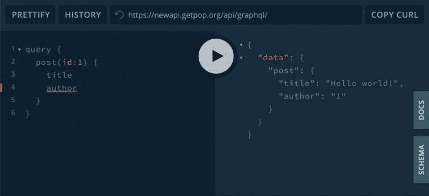
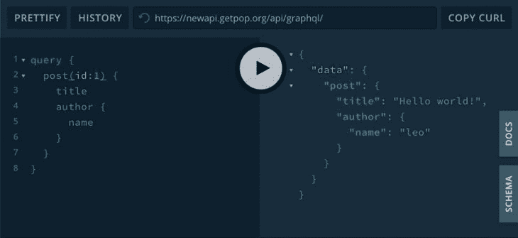

# 设计 GraphQL 服务器以获得最佳性能

> 原文：<https://blog.logrocket.com/designing-graphql-server-optimal-performance/>

如果您曾经使用一些可用的框架实现过一个 [GraphQL](https://graphql.org) 服务器，比如 [Apollo Server](https://github.com/apollographql/apollo-server) 、 [graphql-yoga](https://github.com/prisma-labs/graphql-yoga) 、 [graphql-php](https://webonyx.github.io/graphql-php/) 、 [Sangria](https://github.com/sangria-graphql/sangria) 或任何语言的任何其他[中的任何一个](https://github.com/chentsulin/awesome-graphql)，您可能会发现许多您喜欢的特性，它们满足了您的应用程序需求。

然而，很有可能，你也遇到了一些障碍。您可能无法实现某些功能来改进您的应用程序，这与以下问题有关:

*   GraphQL 服务器支持服务器端缓存吗？
*   它的模式优先或代码优先的方法会阻碍开发吗？
*   它支持订阅吗？
*   易于实现和扩展吗？
*   它支持异步操作吗？
*   它支持联盟吗？
*   它是否允许您创建自定义指令？
*   和其他几个人

和自己的经历相似？如果是这样，您是否检查过您正在使用的开源框架的文档和代码，以了解它为什么会遇到这些障碍？是因为它的语言(即 Node.js/Ruby/PHP/etc.固有的局限性)?还是由于其底层架构？还能改进吗？

更进一步，您是否尝试过通过贡献一个拉请求来提供您的应用程序所需的缺失特性，或者，如果您够大胆的话，通过派生一个现有的服务器来构建您自己的服务器？或者甚至从零开始？如果你有，情况如何？你学到了什么教训？你成功了吗？(请在评论里告诉我们！)

我曾经走过最疯狂的路:我构建了自己的 GraphQL 服务器，用 PHP 实现。我最近完成了它的实现(比如“它正在工作”，而不是“它已经 100%完成了，我不会再做它了”)，开源了它，并给它起了个名字: [GraphQL by PoP](https://graphql.getpop.org/) 。在做这件事的过程中，我获得了大量的知识，我想与大家分享。

这是一系列文章，其中我根据自己的经验描述了如何设计一个 GraphQL 服务器。每篇文章都将关注一些特定的特性(关于性能、生产率、可扩展性、可用性等等)，描述实现它的策略，最后展示一些实现代码。

我将尽可能抽象地描述概念和解决方案，这样即使实现代码是 PHP，策略也可以跨其他语言复制。不仅在服务器端，在客户端也会有经验和应用(例如，我们如何减少要执行的 JavaScript 代码的数量)。

开始吧！在本文中，我们将讨论性能，并了解 GraphQL 服务器如何通过架构设计避免 N+1 问题。

## N+1 问题

[N+1 问题](https://itnext.io/what-is-the-n-1-problem-in-graphql-dd4921cb3c1a)基本上意味着对数据库执行的查询量可以和图中节点的数量一样大。

让我们用一个例子来验证一下。假设我们想要使用以下查询检索导演列表以及他们每个人的电影:

```
{
  query {
    directors(first: 10) {
      name
      films(first: 10) {
        title
      }
    }
  }
}
```

为了提高效率，我们希望只执行两个查询来从数据库中检索数据:一个获取导演的数据，另一个检索所有导演的所有电影的数据。

然而，为了满足这个查询，GraphQL 需要对数据库执行 N+1 个查询:首先检索 N 个导演的列表(在这个例子中是 10 个)，然后，对于 N 个导演中的每一个，一个查询检索他们的电影列表。在我们的例子中，我们必须执行 1+10=11 个查询。

出现这个问题是因为 GraphQL 解析器一次只处理一个对象，而不是同时处理所有同类的对象。在我们的例子中，处理`Query`类型(它是根类型)对象的解析器第一次将被调用一次，以获取所有`Director`对象的列表，然后处理`Director`类型的解析器将被调用一次，以获取每个`Director`对象的电影列表。

换句话说，GraphQL 解析器看到的是树，而不是森林。

这个问题实际上比它最初出现时更糟糕，因为图中节点的数量随着图的层数呈指数增长。所以 N+1 这个名字只对两层深的图有效。对于三层深度的图，应该叫“N ² +N+1”问题！诸如此类…

> 数学家们可能想称之为“`∑N` ^(`i`) ”问题，其中`i`在 0 和图中的层数减 1 之间迭代，而`N`是图中每一层的查询结果数……但幸运的是，对我们所有开发人员来说，我们称之为 N+1 问题😂。

例如，按照上面的例子，我们也将每部电影的男演员/女演员列表添加到查询中，如下所示:

```
{
  query {
    directors(first: 10) {
      name
      films(first: 10) {
        title
        actors(first: 10) {
          name
        }
      }
    }
  }
}
```

对数据库执行的查询是:首先检索 10 个控制器的列表；然后一个查询检索 10 个导演中的每个导演的电影列表；最后，一个查询检索 10 位导演的 10 部电影的男/女演员列表。这总共给出了 1+10+100=111 个查询。

注意到这种行为后，N+1 问题很容易被认为是 GraphQL 最大的性能障碍。如果不加检查，查询几个层次的图可能会变得非常慢，以至于实际上使 GraphQL 变得非常无用。

## 处理 N+1 问题

N+1 问题的解决方案首先是由脸书通过其名为 [DataLoader](https://github.com/graphql/dataloader) 的实用程序提供的，该实用程序是为 Node.js 实现的。它的策略非常简单:通过 [promises](https://blog.logrocket.com/improve-async-programming-with-javascript-promises-1652ac8d036d/) ，它将查询片段的解析推迟到稍后阶段，其中所有同类对象都可以在单个查询中一起解析。这种策略称为批处理，有效地解决了 N+1 问题。

此外，DataLoader 在检索对象后缓存它们，以便如果后续查询需要加载已经加载的对象，它可以跳过执行并从缓存中检索对象。这种策略(不足为奇)被称为缓存，主要是批处理之上的优化。

批处理策略(有时被重命名为“deferred”，或类似的)已经成为 N+1 问题的标准解决方案，被不同的 GraphQL 服务器用几种语言复制，比如:[graph QL::Batch](https://github.com/Shopify/graphql-batch)for[graph QL-Ruby](https://graphql-ruby.org/)(Ruby)[graph QL-PHP by Webonyx](https://webonyx.github.io/graphql-php/data-fetching/#solving-n1-problem)(PHP)，以及 [Sangria](https://sangria-graphql.org/learn/#deferred-value-resolution) (Scala)。

## 批处理/延迟解决方案的问题

从技术上讲，批处理/延迟策略没有任何问题；它只是工作。(为了简单起见，从现在开始，我将把这个策略称为“延迟的”)

然而，问题是这个策略是事后才想到的；开发人员可能首先实现服务器，然后注意到解析查询有多慢，将决定引入延迟机制。

因此，实现解析器可能涉及一些人为的步骤，增加了开发过程中的摩擦。此外，由于开发人员必须了解延迟机制是如何工作的，这使得它的实现比其他情况更加复杂。

这个问题不在于策略本身，而在于让 GraphQL 服务器作为一个附加组件提供这个功能——即使没有它，查询可能会非常慢，以至于让 GraphQL 变得几乎没有用(正如我前面提到的)。

因此，这个问题的解决方案很简单:延迟策略不应该是一个附加组件，而是嵌入到 GraphQL 服务器本身。不应该有两种查询执行策略——正常和延迟——而应该只有一种:延迟。并且 GraphQL 服务器必须执行延迟机制，即使开发人员以正常方式实现解析器(换句话说，GraphQL 服务器处理额外的复杂性，而不是开发人员)。

如何实现这一点？

## 使得 deferred 成为 GraphQL 服务器执行的唯一策略

问题是将对象类型(`object`、`union`和`interface`)解析为对象是由解析器在处理父节点(例如`films` = > `directors`)时自己完成的。

解决方案是将此职责从解析器转移到服务器的数据加载引擎，如下所示:

1.  在解析父节点和子节点之间的关系时，让解析程序返回 id，而不是对象
2.  有一个`DataLoader`实体，给定一个特定类型的 id 列表，从该类型获得相应的对象
3.  让 GraphQL 服务器的数据加载引擎成为这两个部分之间的粘合剂:它首先从解析器获得对象 id，然后在执行关系的嵌套查询之前(此时它已经累积了要为特定类型解析的所有 id)，它通过`DataLoader`(可以有效地将所有 id 包含在一个查询中)检索这些 id 的对象

这种方法可以概括为:“处理 id，而不是对象。”

让我们使用前面的同一个例子来形象化这个新方法。以下查询检索导演及其电影的列表:

```
{
  query {
    directors(first: 10) {
      name
      films(first: 10) {
        title
      }
    }
  }
}
```

请注意要从每个控制器中检索的两个字段— `name`和`films` —以及它们目前有何不同。

`name`字段属于[标量类型](https://graphql.org/learn/schema/#scalar-types)。它是立即可解析的，因为我们可以预期类型为`Director`的对象包含类型为`string`的属性，名为`name`，包含导演的名字。因此，一旦我们有了`Director`对象，就不需要执行额外的查询来解析这个属性。

然而，`films`字段是[对象类型](https://graphql.org/learn/schema/#object-types-and-fields)的[列表](https://graphql.org/learn/schema/#lists-and-non-null)。它通常不可立即解析，因为它引用了一个类型为`Film`的对象列表，该列表仍然必须通过一个或多个额外的查询从数据库中检索。因此，开发人员需要为它实现延迟机制。

现在让我们考虑不同的行为，将字段`films`解析为 id 列表(而不是对象列表)。因为我们可以预期`Director`对象包含一个名为`filmIDs`的属性，该属性包含其所有类型为`array of string`的电影的 ID(假设 ID 表示为字符串)，那么这个字段也可以立即被解析，而不需要实现延迟机制。

最后，除了 ID 之外，解析器还必须给出一条额外的信息:预期对象的类型。在我们的例子中，它可能是`[(Film, 2), (Film, 5), (Film, 9)]`。不过，这些信息是内部的，会传递给引擎，不需要在对查询的响应中输出。

## 类型安全受损？

这种新方法的含义是，对象类型的字段将以两种不同的方式解析:如果它包含嵌套查询，它将被表示为一个对象(或对象列表)，如果不包含，则被表示为一个 ID(或 ID 列表)。

例如，检查来自以下查询的响应的差异(要亲自查看它的运行情况，请针对 [this endpoint](https://newapi.getpop.org/api/graphql/) 执行查询):

> `author`带嵌套查询的字段:

```
{
  query {
    post(id: 1) {
      title
      author {
        name
      }
    }
  }
}
```



> `author`无嵌套查询的字段:

```
{
  query {
    post(id: 1) {
      title
      author
    }
  }
}
```



如您所见，在第一种情况下，对字段`author`的响应是对象`{"name": "leo"}`，在第二种情况下，它是字符串`"1"`。

实际上，这种不一致可能永远不会出现，因为对象类型的字段总是被期望提供嵌套查询(或者它将产生空对象，这是没有意义的)。事实上，GraphiQL 不允许我们查询没有嵌套查询的对象；它总是添加一些预定义的默认字段(为此，我不得不使用 GraphQL Playground 来演示上面的例子)。

但是，如果必须消除这种行为——例如，使返回的类型总是与模式一致——那么我们可以添加一个非常简单的解决方案。

我们没有将字段解析为 ID，而是将它解析为 ID 存储在属性`"id"`下的数组(或者相应类型上该属性的名称)，并让数据加载引擎从数组中检索 ID。然后，查询没有嵌套查询的对象将返回`{id: ...}`，这将与该类型的模式中的定义兼容。

## 在代码中实现调整后的方法

让我们看看这个调整后的策略在(PHP)代码中是怎样的，正如 PoP 在 [GraphQL 中实现的那样。下面的代码演示了不同的解析器；数据加载引擎的代码不会被演示，因为它并不简单，并且超出了本文的范围。](https://graphql.getpop.org/)

如前所述，我们需要将解析器分成两个不同的实体，`FieldResolvers`和`TypeDataLoaders`。此外，我们将与`TypeResolvers`打交道。让我们一个一个来看这些实体。

> 为了清楚起见，下面的所有代码都经过了编辑。回购中会有指向原始代码的链接，在那里可以找到未经编辑的源代码。

### `FieldResolvers`

接收一个特定类型的对象并解析它的字段。对于关系，它还必须指示它解析到的对象的类型。他们的合同是通过[这个接口](https://github.com/getpop/component-model/blob/8e3b56f2f5fd9e88002b932a552a72826e70e8b5/src/FieldResolvers/FieldResolverInterface.php)定义的:

```
interface FieldResolverInterface
{
  public function resolveValue($object, string $field, array $args = []);
  public function resolveFieldTypeResolverClass(string $field, array $args = []): ?string;
}
```

它的实现看起来像这样:

```
class PostFieldResolver implements FieldResolverInterface
{
  public function resolveValue($object, string $field, array $args = [])
  {
    $post = $object;
    switch ($field) {
      case 'title':
        return $post->title;
      case 'author':
        return $post->authorID; // This is an ID, not an object!
    }

    return null;
  }

  public function resolveFieldTypeResolverClass(string $field, array $args = []): ?string
  {
    switch ($field) {
      case 'author':
        return UserTypeResolver::class;
    }

    return null;
  }
}
```

请注意，通过删除处理承诺/延迟对象的逻辑，代码解析字段`author`变得非常简单和简洁。

### `TypeResolvers`

`TypeResolvers`是处理特定类型的对象。他们知道该类型的名称，以及哪个`TypeDataLoader`加载了该类型的对象，等等。

GraphQL 服务器的数据加载引擎在解析字段时，将从某个`TypeResolver`类获得 id。然后，当检索这些 id 的对象时，数据加载引擎将询问`TypeResolver`使用哪个`TypeDataLoader`对象来加载这些对象。

他们的合同是这样定义的:

```
interface TypeResolverInterface
{
  public function getTypeName(): string;
  public function getTypeDataLoaderClass(): string;
}

```

在我们的例子中，类`UserTypeResolver`定义了类型`User`必须通过类`UserTypeDataLoader`加载它的数据:

```
class UserTypeResolver implements TypeResolverInterface
{
  public function getTypeName(): string
  {
    return 'User';
  }

  public function getTypeDataLoaderClass(): string
  {
    return UserTypeDataLoader::class;
  }
}
```

### `TypeDataLoaders`

接收特定类型的 id 列表，并返回该类型的相应对象。该行为是通过[本合同](https://github.com/getpop/component-model/blob/7e1588286ce2eb67bffebe9fd6ab2e5274238777/src/TypeDataLoaders/TypeDataLoaderInterface.php)定义的:

```
interface TypeDataLoaderInterface
{
  public function getObjects(array $ids): array;
}

```

检索用户是这样完成的(在本例中，在 WordPress 上运行 GraphQL 服务器):

```
class UserTypeDataLoader implements TypeDataLoaderInterface
{
  public function getObjects(array $ids): array
  {
    return get_users([
      'include' => $ids,
    ]);
  }
}
```

差不多就是这样了。

## 测试新方法是否有效

我不会分析解决方案的[大 O 符号](https://en.wikipedia.org/wiki/Big_O_notation)来理解查询的数量是如何随着图中节点数量的增加而增加的，因为这很难做到，并且需要分析数据加载引擎是如何工作的(我还没有这样做，并计划在下一篇文章中进行)。

相反，我将简单地提供一个非常复杂的查询，涉及一个 10 层深的图(`posts`=>`author`=>=>`tags`=>`posts`=>=`comments`=>`author`=>`posts`=>`comments`=>`author`)，如果发生 N+1 个问题，就无法解决这个问题。问题是这样的:

```
query {
  posts(limit:10) {
    excerpt
    title
    url
    author {
      name
      url
      posts(limit:10) {
        title
        tags(limit:10) {
          slug
          url
          posts(limit:10) {
            title
            comments(limit:10) {
              content
              date
              author {
                name
                posts(limit:10) {
                  title
                  url
                  comments(limit:10) {
                    content
                    date
                    author {
                      name
                      username
                      url
                    }
                  }
                }
              }
            }
          }
        }
      }
    }
  }
}
```

要执行这个查询并使用它，请转到[这个 GraphiQL 客户端](https://newapi.getpop.org/graphiql/?query=query%20%7B%0A%20%20posts(limit%3A10)%20%7B%0A%20%20%20%20excerpt%0A%20%20%20%20title%0A%20%20%20%20url%0A%20%20%20%20author%20%7B%0A%20%20%20%20%20%20name%0A%20%20%20%20%20%20url%0A%20%20%20%20%20%20posts(limit%3A10)%20%7B%0A%20%20%20%20%20%20%20%20title%0A%20%20%20%20%20%20%20%20tags(limit%3A10)%20%7B%0A%20%20%20%20%20%20%20%20%20%20slug%0A%20%20%20%20%20%20%20%20%20%20url%0A%20%20%20%20%20%20%20%20%20%20posts(limit%3A10)%20%7B%0A%20%20%20%20%20%20%20%20%20%20%20%20title%0A%20%20%20%20%20%20%20%20%20%20%20%20comments(limit%3A10)%20%7B%0A%20%20%20%20%20%20%20%20%20%20%20%20%20%20content%0A%20%20%20%20%20%20%20%20%20%20%20%20%20%20date%0A%20%20%20%20%20%20%20%20%20%20%20%20%20%20author%20%7B%0A%20%20%20%20%20%20%20%20%20%20%20%20%20%20%20%20name%0A%20%20%20%20%20%20%20%20%20%20%20%20%20%20%20%20posts(limit%3A10)%20%7B%0A%20%20%20%20%20%20%20%20%20%20%20%20%20%20%20%20%20%20title%0A%20%20%20%20%20%20%20%20%20%20%20%20%20%20%20%20%20%20url%0A%20%20%20%20%20%20%20%20%20%20%20%20%20%20%20%20%20%20comments(limit%3A10)%20%7B%0A%20%20%20%20%20%20%20%20%20%20%20%20%20%20%20%20%20%20%20%20content%0A%20%20%20%20%20%20%20%20%20%20%20%20%20%20%20%20%20%20%20%20date%0A%20%20%20%20%20%20%20%20%20%20%20%20%20%20%20%20%20%20%20%20author%20%7B%0A%20%20%20%20%20%20%20%20%20%20%20%20%20%20%20%20%20%20%20%20%20%20name%0A%20%20%20%20%20%20%20%20%20%20%20%20%20%20%20%20%20%20%20%20%20%20username%0A%20%20%20%20%20%20%20%20%20%20%20%20%20%20%20%20%20%20%20%20%20%20url%0A%20%20%20%20%20%20%20%20%20%20%20%20%20%20%20%20%20%20%20%20%7D%0A%20%20%20%20%20%20%20%20%20%20%20%20%20%20%20%20%20%20%7D%0A%20%20%20%20%20%20%20%20%20%20%20%20%20%20%20%20%7D%0A%20%20%20%20%20%20%20%20%20%20%20%20%20%20%7D%0A%20%20%20%20%20%20%20%20%20%20%20%20%7D%0A%20%20%20%20%20%20%20%20%20%20%7D%0A%20%20%20%20%20%20%20%20%7D%0A%20%20%20%20%20%20%7D%0A%20%20%20%20%7D%0A%20%20%7D%0A%7D%0A)并点击“运行”按钮。然后，您可以向下滚动结果，查看响应有多大，它涉及多少个实体，以及它检索了多少个级别。

## 快速回顾和总结

N+1 问题是 GraphQL 的大敌，是需要不惜一切代价避免的。当查询可以合并成一个单独的查询时，这使得 GraphQL 的效率很低，随着图表深度的增加，速度会越来越慢。

这个问题有一个解决方案，由 [DataLoader](https://github.com/graphql/dataloader) 和它影响的不同语言的各种 GraphQL 服务器的库提供。然而，所有这些库都有一个缺点:它们存在。这就要求开发者有两种选择:

1.  不使用它们，这可能导致非常低效的 GraphQL 变得几乎无用
2.  为了使用它们，必须学习/理解/实现它们的技术细节

如果解决 N+1 问题的延迟机制已经嵌入到 GraphQL 服务器的核心中，默认执行(事实上，除了使用它别无选择)，并且开发人员甚至不需要知道它的存在，那就好得多了。

这种改进可以通过简单地重组 GraphQL 服务器的架构来实现:让一个`FieldResolver`将关系解析为 id，而不是对象，然后让数据加载引擎在执行关系的嵌套查询之前通过调用一个`TypeDataLoader`对象来检索这些 id 的相应对象。

作为一个受欢迎的副作用，实现新方法的代码更加简洁:将解析器分成两个不同的实体`FieldResolvers`和`TypeDataLoaders`增加了关注点的分离，使每段代码更加原子化和易读，解析器中的逻辑变得更加简单。

## 监控生产中失败和缓慢的 GraphQL 请求

虽然 GraphQL 有一些调试请求和响应的特性，但确保 GraphQL 可靠地为您的生产应用程序提供资源是一件比较困难的事情。如果您对确保对后端或第三方服务的网络请求成功感兴趣，

[try LogRocket](https://lp.logrocket.com/blg/graphql-signup)

.

[](https://lp.logrocket.com/blg/graphql-signup)[https://logrocket.com/signup/](https://lp.logrocket.com/blg/graphql-signup)

LogRocket 就像是网络和移动应用的 DVR，记录下你网站上发生的每一件事。您可以汇总并报告有问题的 GraphQL 请求，以快速了解根本原因，而不是猜测问题发生的原因。此外，您可以跟踪 Apollo 客户机状态并检查 GraphQL 查询的键值对。

LogRocket 检测您的应用程序以记录基线性能计时，如页面加载时间、到达第一个字节的时间、慢速网络请求，还记录 Redux、NgRx 和 Vuex 操作/状态。

[Start monitoring for free](https://lp.logrocket.com/blg/graphql-signup)

.