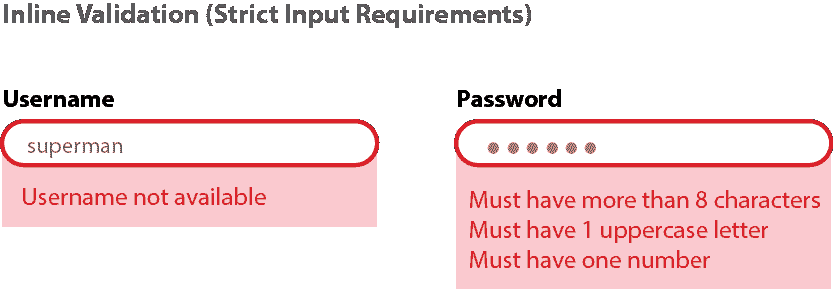
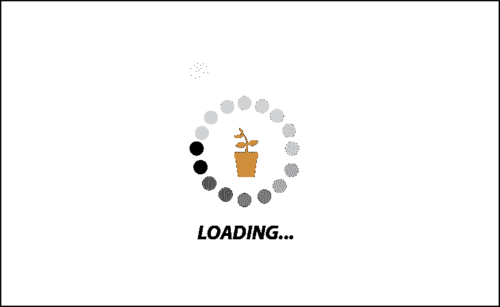
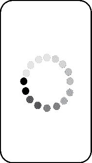
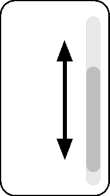
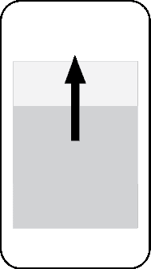

# 为更好的应用程序 UX 设计微交互

> 原文：<https://blog.logrocket.com/ux-design/designing-microinteractions-better-app-ux/>

微交互是我们日常跨设备和应用交互的一部分。它们是为用户产生即时反馈的时刻，创造一种直接参与的感觉。

如果用户体验是平滑的，这些小的交互可能不会被注意到，因为它们是如此嵌入到与产品的交互中。虽然很小，但这些细节会对产品的整体体验产生巨大的影响。

如果你想让你的用户在与你的应用交互时感觉到他们有影响力，微交互是关键。这就是为什么我们将讨论这些主题来帮助您快速了解:

## 什么是微交互？

微交互是围绕一个主要任务的事件。例如，像按下按钮这样的特定动作会触发一个小的变化，根据上下文给用户反馈。因为用户期待反馈，正确的反馈可以帮助用户清楚地看到他们行动的结果。

微交互也可以给用户即时的状态更新，让他们了解并与体验保持联系(例如，加载页面)。微互动可以让体验更吸引人、更令人满意、更直观，甚至可以帮助传达品牌的身份。

## 细节和小范围互动的重要性

虽然微交互是我们通常很少注意的小瞬间，但这些小瞬间累积起来会创造我们对产品的整体体验。它们可以让我们的体验更加直观和个性化，让浏览应用程序变得更加简单和有趣。

但是，如果考虑不周，这些行为会让用户感到沮丧或烦恼，因为他们的体验变成了容忍而不是享受。换句话说，微互动可以是普通或不愉快的经历和令人惊奇的经历之间的区别。

思考微交互应该完成什么将决定它们将是什么类型的交互。微交互有助于实现以下目标:

*   通过指导用户如何使用系统来改进导航
*   通过视觉反馈创造有益的体验来娱乐用户
*   让用户的体验变得流畅有趣，而不是令人厌烦和分心，从而让用户保持参与
*   通过控制感(例如，改变音量、放大和缩小)给用户信心
*   给出提示，让用户知道哪些元素是交互的
*   鼓励积极参与(分享、喜欢、评论)
*   传达品牌身份

在 UX 设计中考虑微交互对于显示对用户的关心是至关重要的。关注小瞬间很重要，因为它会影响一个人潜意识里对一个应用程序的感觉。例如，通过应用程序导航的流畅和积极的体验可以改善某人与它的情感关系。

当一个人喜欢一个产品时，这种个人联系可能会影响他们继续回来，而如果这种体验分散了用户的注意力并不考虑用户，这可能会对品牌体验产生负面影响。产品的一个小方面可以影响一个人对该产品的倾向是积极的还是消极的，并且可以成为与它建立关系的关键部分。

## 微交互的组成和类型

在他 2013 年的书《微交互:细节设计 中，丹·萨弗将微交互描述为一系列小交互，在与任何产品交互时都可以找到。

萨弗概述了一个设计微交互的模型，该模型首先将微交互分解为四个部分——在设计用户体验的细节时要考虑每一个部分。这四个组件包括触发器、规则、反馈以及循环和模式。

### 微交互的四个组成部分

#### 1.引发

触发器是开始微交互的动作。触发器可以分为两种类型:用户启动的触发器和系统启动的触发器。

用户发起的触发是指一个人有意与产品进行交互。例如，这可以包括按下按钮、语音激活、拍手或挥手。

当满足某些条件时，会发生系统启动的触发。这些自动发生；例如，收到电子邮件时发出通知，或者电池电量低时发出警告。

#### 2.规则

规则定义了对触发器的响应。触发之后的一系列交互将遵循某些参数——这些参数控制接下来发生什么以及以什么顺序发生。

#### **3。反馈**

用户将会看到一个响应他们的动作的小变化，表明它已经被确认。它将与用户通信；例如，它可以通知他们一个错误或验证一个成功的操作。

反馈可以是音频、视觉或触觉(例如，文本的通知声音，喜欢照片时听到的弹出消息，或切换到静音模式时手机振动)。

#### 4.循环和模式

一个循环决定一个交互是否重复或随时间改变(即，微交互将持续多长时间)。例如，这可能是提醒您每天屏幕时间的通知。当模式改变时，这意味着在这些条件下操作可能不同。例如，当手机处于“勿扰模式”时，通知会以不同的方式发送。

### 微交互的类型

当考虑整个用户旅程时，在某些方面提供即时反馈可能会让你受益。让用户了解信息可以使体验更加直观和吸引人，而不是令人沮丧和讨厌。

#### 行动呼吁

通过深思熟虑的轻推来引起某人的兴趣可以鼓励他们点击发送或购买一件商品。它也可能是一种成就感的信号，让用户不断回来。

An example CTA.

#### 数据输入和错误预防

当输入一个网站的密码时，微交互可以通知用户他们的密码是弱密码还是强密码，以及满足了哪些要求。当在一个在线表格中输入数据而遗漏了某些部分时，一个设计良好的微交互应该清楚地告诉用户他们遗漏了哪些部分，这样他们就不会浪费时间去寻找他们的错误。

因为每个人都会犯错，所以微交互可以让用户有机会轻松撤销之前的操作(例如，可以轻松地再次按下 like 按钮来撤销操作)。

#### 告知和娱乐

视觉上引人入胜的加载屏幕有助于消除等待的无聊感。显示加载进度的动画对用户来说可能是有趣的和令人放心的。它还将向用户通报进展情况；意识到正在发生的事情将有助于用户继续使用应用程序，而不是沮丧地关闭它。

### 久经考验的微交互示例

有几种方法可以与用户沟通，让他们了解产品/应用的进展。下面是几个微交互的具体例子，以及它们的功能和它们如何影响用户体验。

#### 味道平淡的低级啤酒

滑动可以用来获取新信息或移动到新页面，并且通过使用手势而不是按钮，它们还可以节省移动设备上的空间。这可以让互动变得流畅、有趣，甚至上瘾。

#### 动画片

动画让最简单的过程也变得有趣——例如，在加载屏幕上通知用户进度。颜色、形状、大小、纹理、位置和纹理都可以根据反馈的目标而变化。

#### 滚动条

拉至刷新

Scrollbars show a user where they are on a page and how much they have left to see.

#### 

当拖动以刷新页面时，拖动刷新可以增加期待和兴奋的时刻。

通知

#### 

通知让人们知道他们的帖子何时被喜欢，何时下载完成，或者何时执行任务。

如今，在 UX 设计不断变化的环境中，有许多工具可供使用。要选择正确的方法来设计微交互，需要记住几件事。这些包括项目的背景和需求，不同的工作风格，以及先前的专业知识。

要设计微交互，手机和网络上都有可用的工具。对于特定的微交互任务，两者各有所长。

编码工具

### 移动: *Xcode，Android studio，成帧器*

*   Web: *成帧器*， *CSS 动画*
*   像 Framer 和 CSS animation 这样的工具提供了对基于物理的属性(如摩擦和弹性)的额外控制。它们允许定制小部件的大小、透明度和颜色。

虽然使用这些编码工具有助于创建定制的解决方案，但是学习如何使用它们可能需要更长的时间，并且这对于某些微交互来说可能是不必要的。

可视化工具

### *Principle，Adobe XD，Origami Studio，Invision，漫威，Protopie，After Effects(交互+动画)，Flinto*

*   可视化工具允许您快速创建高保真交互。尽管这些工具允许技术上不太定制的解决方案，但是对于具有很强的视觉交流技能但缺乏编码知识的人来说，它们工作得很好。

像漫威和 Invision 这样的工具也有利于协作构思，因为它们可以捕捉外部反馈，改进迭代过程。

设计流程和实施

## 微交互不应该被看作是附加的，而是伟大设计的基本部分，因此应该在任何设计过程的开始就考虑到。

这些互动首先应该是功能性的，但也应该是娱乐性的——而不是恼人的或分散注意力的。即使是设计的小细节，重复和重新思考经验对于找到有效的方法也是必不可少的。

在设计微交互的时候，重要的是要站在用户的角度去寻找适合特定环境的东西。在设计过程的开始和整个过程中，研究对于清楚地了解用户的具体需求是至关重要的。

正确的用户测试工具将通过识别痛点和需要改进的地方来为设计决策提供信息。设计师应该质疑人们使用某些设计元素的方式，以及他们对设计的情感体验，以及它如何适应他们的生活方式和身份。

短暂的互动会影响用户对整个产品的看法。因此，它们可以成为传达品牌身份和价值的一部分。一致的风格可以让用户在产品的各个方面都有顺畅的体验，创造这种一致的风格应该通过考虑你将融入体验中的情感和价值观来反映品牌形象。

在设计产品时，即使是很小的改进也能让整个交互过程变得更加愉快，并成为创造个人体验的机会，让用户感觉与产品有联系。

像设计的其他方面一样，微交互应该是有目的和有意义的。为了确保微交互增加产品的价值，保持它们的简单，只包括必要的东西，没有额外的干扰。

做得好的话，用户不用考虑这些交互；它们变得直观。这就形成了一个习惯循环，对一个提示和来自那个动作的回报作出常规反应。

考虑这些小行动和大行动之间的关系，以创造一个整体的体验。这包括牢记大局，以确保不同的部分能够很好地协同工作，而不是一个支离破碎的体验。

摘要

## 微交互是我们日常跨设备和应用交互的一部分。它们是通过产生即时反馈为用户创造直接参与感的时刻。微交互可用于行动号召、数据输入和错误预防，以及通知或娱乐。每一个小的交互都会创造我们对产品的整体体验，考虑交互的目标和它将带来的价值对于创造一个关心用户的设计是必不可少的。

在设计微交互时要记住的四个要素是:

触发—启动反馈的操作

1.  规则—控制对触发器的响应
2.  反馈——由动作触发的信号
3.  循环/模式—定义反馈是否以相同方式发生的特殊情况
4.  记住:微交互应该是有目的和有意义的。牢记大局可以确保各个部分传达一致的价值观，从而创造整体体验。这些微小的时刻可以让一次经历变得个人化和愉快，也可以让一次经历从平凡变得精彩。

[LogRocket](https://lp.logrocket.com/blg/signup) :无需采访即可获得 UX 洞察的分析

## [LogRocket](https://lp.logrocket.com/blg/signup) 让您可以回放用户的产品体验，以可视化竞争，了解影响采用的问题，并结合定性和定量数据，以便您可以创建令人惊叹的数字体验。

查看设计选择、交互和问题如何影响您的用户— [立即尝试 LogRocket】。](hhttps://lp.logrocket.com/blg/signup)

See how design choices, interactions, and issues affect your users — [try LogRocket today](hhttps://lp.logrocket.com/blg/signup).