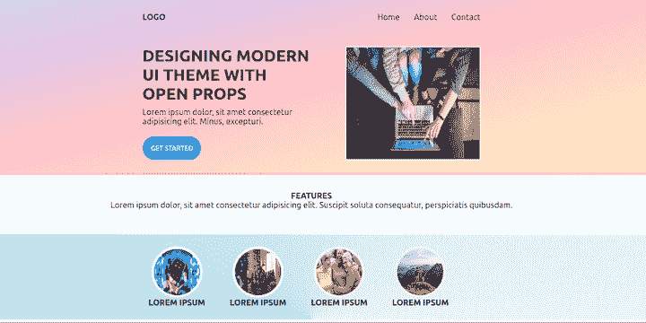
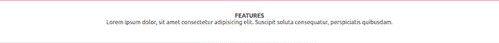

# 用开放道具设计现代 UI 主题

> 原文：<https://blog.logrocket.com/designing-modern-theme-open-props/>

第一印象很重要。UI 样式可以极大地影响应用程序产生的流量，因为用户会在几秒钟内对应用程序形成印象。这就是为什么用户界面是每个现代 web 应用程序如此重要的组成部分。

CSS 库，比如新发布的 [Open Props](https://open-props.style) ，让开发者不用过多编码就能实现专业的设计。然而，有更多的风格选择并不总是更好。一些 CSS 库和框架可能过于复杂或僵化，导致学习曲线过长或限制了定制。

然而，开放道具是为灵活性而设计的，并被描述为非规定性的。它是一个开源的、颜色方案优化的 CSS 库，提供快速、一致、定制的设计选项。Open Props 使应用程序的 CSS 保持干净和简单，样板代码更少。

与大多数其他 CSS 库或框架(包括 Tailwind CSS)不同，Open Props 允许开发人员为选择器创建自己的自定义类名。一些开发人员喜欢灵活地使用他们自己的命名约定，而不是依赖预定义的类名。

花粉也允许用户生成类，但是缺少一些开放道具提供的动画效果。借助开放道具，开发人员可以使用预先制作的关键帧效果来编排他们自己的动画。

在本教程中，我们将回顾如何利用 Open Props 为一个示例项目设计用户界面。

## 入门指南

Open Props CDN 可以通过多种方式添加到 web 应用程序中，例如使用 CSS、PostCSS 或设计令牌。在本文中，我们将把 Open Props CDN 直接导入到 CSS 文件中。

这是我们将在本教程中构建的示例用户界面:



我们将从创建 UI 设计的文件夹结构开始。

首先，使用以下命令创建 app 文件夹:

```
mkdir Openpropsdemo && cd Openpropsdemo

```

接下来，创建以下文件夹和文件:

*   图像的资产文件夹:`mkdir` `assets/img`
*   CSS 的资产文件夹:`mkdir assets/css`
*   HTML 文件:`touch index.html`
*   `assets/css`文件夹中的 CSS 样式文件:`styles.css`

现在，将 UI 设计中使用的任何图像添加到`assets/img`文件夹中。然后，在您喜欢的代码编辑器中打开 app 文件夹(VS 代码用户可以使用`code .`命令来完成这个操作)。

文件夹结构应该是这样的:

```
openpropsdemo
│ assets
│ ├── css
│ │ ├── style.css
│ ├── img
│ index.html

```

## 创建用户界面标记

接下来，让我们从 UI 标记开始。

打开`index.html`文件，键入 **doc** ，点击**选项卡**，创建以下标记片段:

```
<html lang="en">
<head>
  <meta charset="UTF-8">
  <meta http-equiv="X-UA-Compatible" content="IE=edge">
  <meta name="viewport" content="width=device-width, initial-scale=1.0">
  <title>Document</title>
</head>
<body>

</body>
</html>

```

接下来，在`<head>`标签内将`style.css`文件链接到`index.html`文件:

```
...
<link rel="stylesheet" href="./assets/css/style.css" />
...

```

现在，我们将使用`<header>`和`<section>`标签将标记分成两部分。从`<header>`开始，然后将下面的代码片段放到`<body>`标签中。

```
...
<header>
      <div class="content">
      <div class="nav-bar">
        <h4>LOGO</h4>
        <ul>
          <li>Home</li>
          <li>About</li>
          <li>Contact</li>
        </ul>       
      </div>
      <div class="container">
        <div class="info">
            <h4>DESIGNING MODERN UI THEME WITH OPEN PROPS</h4>
            <p>Lorem ipsum dolor, sit amet consectetur adipisicing elit. Minus, excepturi.</p>
            <button>GET STARTED</button>
          </div>
        <div class="thumbnail">
          
        </div>
      </div>
    </header>
...

```

为`<section>`标签添加标记。然后，在结束的`<header>`标记之后，在`<body>`标记内添加以下代码片段:

```

...   
    <section>
       <div class="info">
         <h4>FEATURES</h4>
        <p>Lorem ipsum dolor, sit amet consectetur adipisicing elit. Suscipit soluta consequatur, perspiciatis quibusdam.</p>
      </div>
       <div class="content">
          <div class="features">
              <ul>
                <li>
                  
                  <h4>LOREM IPSUM</h4>
                </li>
                <li>
                  
                  <h4>LOREM IPSUM</h4>
                </li>
                <li>
                  
                  <h4>LOREM IPSUM</h4>
                </li>
                <li>
                  
                  <h4>LOREM IPSUM</h4>
                </li>
              </ul>
          </div>
       </div>
     </section>
...

```

## 设计用户界面

现在我们已经准备好用 Open Props 来设计 UI 标记的样式了。我们将向以下 UI 组件添加自定义样式:

要设计用户界面标题，首先打开`style.css`文件。然后，将打开的 Props CDN 导入 CSS 文件:

```
@import "https://unpkg.com/open-props";

```

我们将为标记中的所有元素添加全局样式。

首先，我们将删除自定义的`padding`和`margin`，用`box-sizing`属性设置标题的大小，并指定`font-family`。

```
* {
  padding: var(--size-fluid-0);
  margin: var(--size-fluid-0);
  box-sizing: border-box;
  font-family: var(--font-sans);
}

```

接下来，我们将样式化`header`元素中的所有内容。我们将`center`并为文本指定一个`color`，为`background-image`设置一个开放道具`gradient`。我们还将指定`padding`，在`header`元素的底部添加一个边框(`border-bottom`)，并在元素下方添加一些额外的空间(`margin-border`)。

```
header {
  text-align: center;
  color: var(--gray-9);
  --op-gradient-direction: to top left;
  background-image: var(--gradient-15);
  padding: var(--size-fluid-2);
  border-bottom: 4px solid var(--pink-3);
  margin-bottom: var(--size-fluid-3);
}

```

现在，我们将移动到`header`元素中的`.content`选择器。我们将通过将`width`设置为 50%并将`margin`设置为 0px 来集中所有的`.content`:

```
header .content {
  margin: 0px auto;
  width: 50%;
} 

```

### 设计导航栏的样式

为了设计 UI 导航的样式，我们将首先移动到`header`元素中的`.nav-bar`选择器。

我们将把`display`属性设置为`flex`，以便并排对齐徽标和`ul`元素。默认情况下，`flex`属性显示列中的内容，所以我们将通过将`flex-direction`属性设置为`row`来重置它。

我们将使用`justify-content`属性在徽标和`ul`元素之间添加空间。然后，我们将使用`align-items`属性来`center`对齐所有的导航项目。最后，我们将使用`display`属性在`inline-block`中显示导航项目，并使用`margin-left`属性增加项目之间的间距。

```
header .nav-bar {
  display: flex;
  flex-direction: row;
  justify-content: space-between;
  align-items: center;
}
header .nav-bar ul li {
  display: inline-block;
  margin-left: var(--size-5);
}

```

这是风格化的导航栏:


现在，我们将移动到`header`元素中的`.container`选择器。我们将使用`margin-top`、`display`和`justify-content`属性来分隔内容项并并排显示它们。

我们将使用`.info`选择器来指定`width`，并使用`text-align`来对齐文本。我们将使用`font-size`来增加`h4`元素的大小。最后，我们将使用`width`和`border`在`.info`选择器中的图像元素周围添加一个缩略图。

```
header .container {
  margin-top: var(--size-fluid-4);
  display: flex;
  justify-content: space-between;
}
header .container .info {
  width: 50%;
  text-align: left;
}
header .container .info h4 {
  font-size: var(--font-size-5);
  margin-bottom: var(--size-2);
}
header .container .info p {
  margin-bottom: var(--size-4);
}
header .container .thumbnail {
  width: 40%;
  border: var(--border-size-2) solid var(--gray-1);
}

```

下面是样式化的标题容器:


### 设置功能部分的样式

现在，我们将移动到`section`元素中的`.features`选择器。我们将使用`margin-top`、`width`、`margin`和`text-align`属性来格式化这个部分中的文本。

```
section .features {
  margin-top: var(--size-fluid-3);;
  width: 50%;
  margin: 0px auto;
  text-align: center;
}
section .features ul {
  display: flex;
  align-items: center;
}
section .features ul li {
  margin: var(--size-fluid-2);
  list-style: none;
}
section .features ul li h4 {
  font-size: var(--font-size-1);
}
section .info{
  text-align: center;
  margin-bottom:var(--size-fluid-4);
}

```

这是风格特征部分:



接下来，我们将使用`inline-size`、`aspect-ratio`、`border-radius`、`width`、`height`和`border`属性对特征部分的圆形图像帧进行样式化:

```
.circle {
  inline-size: var(--size-5);
  aspect-ratio: var(--ratio-box);
  border-radius: var(--radius-round);
  width: 100px;
  height: 100px;
  border: var(--border-size-3) solid var(--gray-1);
}

```

### 设计图像和按钮的样式

现在，我们将设计图像和按钮的样式。我们将指定所有图像的`width`和`height`都等于父元素的 100%。我们还将指定按钮的`background`、`border`、`padding`、`color`和`border-radius`。

```
img {
  width: 100%;
  height: 100%;
}
button {
  background: var(--blue-4);
  border: 0px;
  padding: var(--size-3);
  color: var(--gray-1);
  border-radius: var(--radius-round);
} 

```

以下是样式化的图像:


## 结论

在本教程中，我们演示了如何使用 Open Props 设计 UI 主题。本教程中使用的简单 UI 主题可以在 [GitHub](https://github.com/Claradev32/openpropsdemo/) 上获得。Open Props 的 CSS 自定义属性的设计可能性是无穷无尽的。查看公开的道具[文档](https://open-props.style/)，为你的下一个 UI 设计项目获得一些灵感。

## 你的前端是否占用了用户的 CPU？

随着 web 前端变得越来越复杂，资源贪婪的特性对浏览器的要求越来越高。如果您对监控和跟踪生产环境中所有用户的客户端 CPU 使用情况、内存使用情况等感兴趣，

[try LogRocket](https://lp.logrocket.com/blg/css-signup)

.

[](https://lp.logrocket.com/blg/css-signup)[https://logrocket.com/signup/](https://lp.logrocket.com/blg/css-signup)

LogRocket 就像是网络和移动应用的 DVR，记录你的网络应用或网站上发生的一切。您可以汇总和报告关键的前端性能指标，重放用户会话和应用程序状态，记录网络请求，并自动显示所有错误，而不是猜测问题发生的原因。

现代化您调试 web 和移动应用的方式— [开始免费监控](https://lp.logrocket.com/blg/css-signup)。