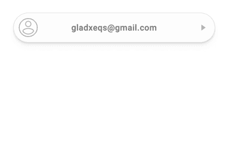
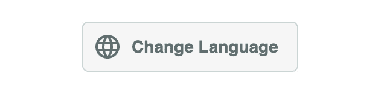
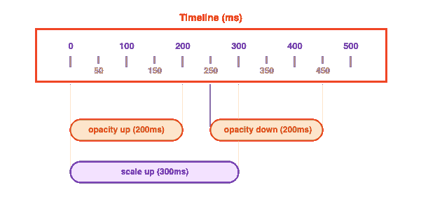

# 为用户界面反馈设计连锁反应

> 原文：<https://blog.logrocket.com/designing-ripple-effect-ui-feedback/>

当设计系统或用户界面的元素时，为用户提供有用的反馈是一个非常重要的考虑因素。反馈可以给用户一种专注感、方向感、响应度、进度或动作的完成感，以及其他许多东西。这通常是通过微交互来实现的。

## 背景

现在，让我们考虑一下可以为按钮元素提供的反馈。首先，当用户悬停或聚焦在按钮上时，可以进行样式调整:您可以更改按钮的颜色或背景，或者添加或删除边框、轮廓和/或框阴影等。

虽然按钮元素外观上的这些可见变化有助于提供关于按钮状态的反馈，但大多数时候，这些变化还不够。此外，当在移动视口中与这些元素交互时，捕捉处于悬停状态的元素是非常不切实际的。这就是微交互发挥作用的地方。

在本教程中，我们将学习如何为流行的涟漪效应创建一个简单的微交互，为用户提供触摸反馈。这种效果因谷歌的材料设计而变得流行，几乎可以用在用户可以互动的任何表面上。



## 入门指南

首先，让我们为我们打算创造的连锁反应设定一些期望。以下是一些指导原则，说明如何将波纹包含在其容器(即目标元素)中，波纹的大小和位置，以及波纹在其容器中的扩散行为和扩散边界。

1.  纹波应严格受限于目标元素的`border-box`。因此，它不应该超出其容器的边界。
2.  涟漪应该呈现在其容器的背景层之上，但在其容器内的所有其他内容之下。这个规则也适用于它的容器的伪元素，如果有的话。
3.  波纹应该总是从其容器内的接触点开始传播，并继续传播，直到它填满可用空间。

记住上面的指导方针，我们可以一步一步地向一个非常典型的`button`元素添加涟漪效应。

下面是我们将在本文中创建的内容的演示:



## 基本标记

让我们从一个非常简单的目标元素标记开始，比如说一个`button`元素:

```
<button type="button" class="btn">
  <i class="btn__icon">
    <!-- svg icon here -->
  </i>
  <span class="btn__label">Change Language</span>
</button>
```

为了给上面的`button`元素添加涟漪效应，我们必须首先对它的初始标记(布局)进行如下修改:

*   向目标元素或容器添加一个`.ripple`类，以有效地将目标元素标记为波纹容器。这允许我们控制它的外观和行为。
*   将一个空元素添加到目标元素或容器中，作为涟漪效果的图层，并为这个新元素添加一个`.ripple__inner`类。

下面是应用了这些更改的新标记结构:

```
<button type="button" class="ripple btn">
  <i class="btn__icon">
    <!-- svg icon here -->
  </i>
  <span class="btn__label">Change Language</span>
  <div class="ripple__inner"></div>
</button>
```

我们选择使用的标记结构不必严格遵循。您的设计可能需要稍微不同或更复杂的标记结构。

也就是说，我们的标记结构有以下好处:

*   需要最少的额外标记——添加几个类并向容器元素追加一个空元素。
*   容器元素可用于有效地设置涟漪效果层的边界和堆叠上下文，以及容器元素的其他内容。
*   ripple 层的专用元素防止篡改容器元素的`::before`和`::after`伪元素，使它们在需要时可用。此外，专用波纹层元件可用于进一步扩大和增强波纹效应。

## 设计元素的样式

准备好标记后，我们可以开始为 ripple 容器和内层元素编写所需的样式。

```
.ripple {
  z-index: 0;
  position: relative;

  & > &__inner:empty {
    top: 0;
    left: 0;
    width: 100%;
    height: 100%;
    z-index: -9999;
    overflow: hidden;
    position: absolute;

    &::after {
      content: '';
      position: absolute;
      border-radius: 50%;
      background: lighten(#000, 92.5%);

      top: var(--ripple-center-y, 0);
      left: var(--ripple-center-x, 0);
      width: var(--ripple-diameter, 0);
      height: var(--ripple-diameter, 0);
      opacity: var(--ripple-opacity, 0);
      transform: scale(var(--ripple-scale, 0));
    }
  }
}
```

虽然上面的代码片段看起来不怎么样，但关于它可以说很多。

`.ripple`容器元素有两个主要需求。首先，它必须被定位，以便它可以作为其内容框和波纹层的包含块。其次，它必须为其内容框创建一个原子堆栈上下文。

这里，我们使用`z-index`来创建堆栈上下文，但是您可以通过其他几种方法来创建堆栈上下文。

```
/*
 * ============================================================
 * CREATING STACKING CONTEXT
 * ============================================================
 *
 * Here are a few style declarations that can create an atomic
 * stacking context for an element with little alterations to
 * the appearance of the element.
 *
 * For opacity, a stacking context is only created when value
 * is any valid value from 0 to 1 (not-inclusive). So you can
 * use 0.9999999 to be as close to 1 as possible.
 *
 * ============================================================
 */

element { z-index: 0 }
element { opacity: 0.9999999 }
element { perspective: 300px }
element { transform: scale(1) }
element { filter: grayscale(0) }
element { will-change: opacity }
```

`.ripple__inner`层元素绝对位于正常流之外，并跨越波纹容器的整个范围。图层元素隐藏所有溢出，以有效地为涟漪效果提供清晰的边界。

此外，layer 元素为其内容创建一个原子堆叠上下文，而它就堆叠在由其包含块创建的堆叠上下文中的背景之上(相当低)。

图层元素的`::after`伪元素创建实际的涟漪效果。它是绝对定位的，使用`border-radius`完全圆角化，并且具有使用萨斯`lighten()`颜色功能创建的非常浅的灰色背景。

请注意，涟漪效果的位置、尺寸、不透明度和比例将在指定的 CSS 自定义属性上以编程方式设置，这一点很重要。

最后，只有当元素为空时，为 layer 元素定义的样式才适用。layer 元素上的`:empty`伪类有效地确保了这一点。

## 产生连锁反应

目前，看起来好像我们还没有能够实现任何东西，但事实上，我们已经能够成功地为连锁反应打下基础。现在剩下的就是通过编程创造连锁反应。

### 初始化波纹元素

让我们从一个 helper 函数开始，它允许我们初始化一个 ripple 元素并获取它的几何和位置属性。为了实现这一点，我们将使用`WeakMap`为所有 ripple 元素创建某种注册表。

```
function getRippleElementProps (elem) {
  // Initialize the ripple elements registry (first call only)
  const rippleElems = new WeakMap();

  getRippleElementProps = function (elem) {
    if (elem instanceof HTMLElement) {
      if (!rippleElems.has(elem)) {
        // Get the dimensions and position of the element on the page
        const { width, height, y: top, x: left } = elem.getBoundingClientRect();
        const diameter = Math.min(width, height);
        const radius = Math.ceil(diameter / 2);

        // Configure functions to set and remove style properties
        const style = elem.style;
        const setProperty = style.setProperty.bind(style);
        const removeProperty = style.removeProperty.bind(style);

        // Function to remove multiple style properties at once
        function removeProperties (...properties) {
          properties.forEach(removeProperty);
        }

        // Set the diameter of the ripple in a custom CSS property
        setProperty('--ripple-diameter', `${diameter}px`);

        // Add the element and its geometric properties
        // to the ripple elements registry (WeakMap)
        rippleElems.set(elem, {
          animations: [],
          width, height, radius, top, left, setProperty, removeProperties
        });
      }

      // Return the geometric properties of the element
      return rippleElems.get(elem);
    }
  }

  return getRippleElementProps(elem);
}
```

`getRippleElementProps()`函数的意图非常简单，通过在函数体中添加注释来突出重要的行。

代码片段描述了尚未添加到`rippleElems`注册表中的 ripple 元素的初始化序列。操作顺序如下:

1.  首先，调用`elem.getBoundingClientRect()`获取视口中波纹元素的位置和尺寸。根据这些尺寸，计算波纹的直径，当然还有半径。
2.  接下来，创建两个绑定到`elem.style`对象的函数，用于设置和移除 ripple 元素的样式属性。创建一个额外的`removeProperties()`函数，用于一次删除 ripple 元素的多个样式属性。
3.  最后，将派生的维度、函数和一个空的`animations`数组(堆栈)映射到前面创建的`rippleElems`注册表(`WeakMap`)上的 ripple 元素。稍后将使用`animations`数组作为 ripple 元素的简单动画堆栈。

请注意，到目前为止，我们的逻辑并没有考虑到波纹元件在以后的尺寸或位置的变化。实际上，您应该考虑监视这些变化，并更新注册表中 ripple 元素的属性。

* * *

### 更多来自 LogRocket 的精彩文章:

* * *

### 添加事件监听器

我们将利用事件委托的概念将一个点击事件监听器附加到`document`对象上。文档中发生的每一次点击都会调用这个侦听器，即使我们只对 ripple 元素中发生的点击感兴趣。

对于 ripple 元素中发生的每一次点击，我们将在事件监听器中做一些事情:

*   获取波纹元素内点击点的坐标，并使用该坐标设置波纹中心坐标(即波纹的起始点)。这些坐标将使用`evt.clientX`和`evt.clientY`以及文档中波纹元素的左侧和顶部位置来计算。
*   计算波纹的比例因子。
*   运行动画序列，将涟漪扩散到整个涟漪容器元素。

下面是事件监听器注册:

```
document.addEventListener('click', function _rippleClickHandler (evt) {
  // Capture clicks happening inside a ripple element
  const target = evt.target.closest('.ripple');

  if (target) {
    // Get ripple element geometric properties from registry
    const {
      width, height, radius, top, left, setProperty
    } = getRippleElementProps(target);

    // Get the half width and height of the ripple element
    const width_2 = width / 2;
    const height_2 = height / 2;

    // Get the x and y offsets of the click within the ripple element
    const x = evt.clientX - left;
    const y = evt.clientY - top;

    // Compute the scale factor using Pythagoras' theorem
    // and dividing by the ripple radius
    const scaleFactor = Math.ceil(
      Math.sqrt(
        Math.pow(width_2 + Math.abs(x - width_2), 2) +
        Math.pow(height_2 + Math.abs(y - height_2), 2)
      ) / radius
    );

    // Set the ripple center coordinates on the custom CSS properties
    // Notice the ripple radius being used for offsets
    setProperty('--ripple-center-x', `${x - radius}px`);
    setProperty('--ripple-center-y', `${y - radius}px`);

    // Run the ripple spreading animation
    runRippleAnimation(target, scaleFactor);
  }
}, false);
```

我们已经成功注册了单击事件侦听器。然而，仍然缺少一个重要的部分:应该激活波纹的`runRippleAnimation()`函数还没有被定义。让我们继续下去，看看我们如何能把涟漪带到生活中来。

## 制作涟漪动画

我们将在`runRippleAnimation()`函数中为涟漪效应定义一系列动画。序列中的每个动画都应该具有以下属性:

*   **时长**:动画持续多长时间(从开始到结束)
*   **更新**:随着动画的进展会发生什么
*   **完成**:动画完成后应该发生什么
*   **中止**:动画可以在进行中终止

对于我们打算创建的每一个动画片段来说，这些似乎需要设置很多，因此，我们将编写一个`createAnimation()` helper 函数来为我们处理这个方面。

### 创建动画

根据我们之前看到的动画属性，这里有一个简单的`createAnimation()`函数来帮助创建动画。

基本原理是，它根据为动画定义的`duration`创建一个从`0`到`1`的进展序列。这个进展序列可以通过一个`update()`回调函数来改变或控制其他东西的行为。

下面是`createAnimation()`函数的一个实现:

```
function createAnimation ({ duration = 300, update, done }) {
  let start =  0;
  let elapsed = 0;
  let progress = 0;
  let aborted = false;
  let animationFrameId = 0;

  // Ensure the `update` and `done` callbacks are callable functions
  done = (typeof done === 'function') ? done : function () {};
  update = (typeof update === 'function') ? update : function () {};

  // Function to effectively cancel the current animation frame
  function stopAnimation () {
    cancelAnimationFrame(animationFrameId);
    animationFrameId = 0;
  }

  // Start a new animation by requesting for an animation frame
  animationFrameId = requestAnimationFrame(
    function _animation (timestamp) {
      // Set the animation start timestamp if not set
      if (!start) start = timestamp;

      // Compute the time elapsed and the progress (0 - 1)
      elapsed = timestamp - start;
      progress = Math.min(elapsed / duration, 1);

      // Call the `update()` callback with the current progress
      update(progress);

      // Stop the animation if `.abort()` has been called
      if (aborted === true) return stopAnimation();

      // Request another animation frame until duration elapses
      if (timestamp < start + duration) {
        animationFrameId = requestAnimationFrame(_animation);
        return;
      }

      // If duration has elapsed, cancel the current animation frame
      // and call the `done()` callback
      stopAnimation();
      done();
    }
  );

  // Return an object with an `.abort()` method to stop the animation
  // Returns: Object({ abort: fn() })
  return Object.defineProperty(Object.create(null), 'abort', {
    value: function _abortAnimation () { aborted = true }
  });
}
```

对于一个助手函数来说，这有很多代码。通常在你的项目中，你应该考虑使用任何流行的动画库来减少大量的样板代码。

也就是说，我正在开发一个用于编排动画序列的动画库，其基本原理与我们刚刚看到的`createAnimation()`函数相同。我会[发很多关于它的微博](https://twitter.com/gladchinda)——你应该留意它。

> 目前正在开发一个新的#javascript 库，用于构建流畅简单的微交互和动画。小心点。这是我能用它做的一些事情:-触摸波纹- svg 图标动画-元素大小动画 pic.twitter.com/SIZMfyTZJy

涟漪动画序列

### 最后，我们有了创建涟漪动画序列所需的所有部分。这是我们的动画序列看起来的样子:



从序列中可以观察到，**放大**和**不透明度放大**动画同时开始。然而，**不透明度上升**动画在**放大**动画之前 100 毫秒结束。另外，**不透明度降低**动画在**不透明度升高**完成后至少等待 50 毫秒才开始。

在我们实现`runRippleAnimation()`函数之前，让我们回答两个重要的问题:

**如果在当前动画序列还没有完成的时候发生了另一次点击会怎么样？**
在开始一个新的动画序列之前，当前序列中的所有动画都必须被中止。这就是从`createAnimation()`返回的对象的`.abort()`方法的用途。

1.  **如果我需要给动画进程添加一些缓动，该怎么办？**
    线性动画的进展并不总是好看，而且感觉也不太自然。我们总是可以用动画`progress`值调用一个缓动函数来给最终的动画添加一些缓动。对于`runRippleAnimation()`函数，我们将使用二次`easeOut()`缓和函数。
2.  下面是`runRippleAnimation()`函数:

```
function easeOut (x) {
return 1 - (1 - x) * (1 - x);
}
```

实现了`runRippleAnimation()`函数后，我们已经能够从头开始成功地创建涟漪效应。你不一定要按照我们在这里使用的动画序列。你可以在动画序列和季节上做一些调整。

```
function runRippleAnimation (elem, scaleFactor) {
  const { animations, setProperty, removeProperties } = getRippleElementProps(elem);

  // Abort all animations in the current sequence
  while (animations.length) {
    animations.pop().abort();
  }

  // Start the "scale up" animation and add it to the animation sequence
  animations.push(createAnimation({
    duration: 300,
    update: progress => {
      setProperty('--ripple-scale', progress * scaleFactor);
    }
  }));

  // Start the "opacity up" animation and add it to the animation sequence
  animations.push(createAnimation({
    duration: 200,
    update: progress => {
      setProperty('--ripple-opacity', Math.min(1, easeOut(progress) + 0.5));
    },

    done: () => {
      // Wait for at least 50ms
      // Start the "opacity down" animation and add it to the animation sequence
      setTimeout(() => {
        animations.push(createAnimation({
          duration: 200,
          update: progress => {
            setProperty('--ripple-opacity', easeOut(1 - progress));
          },

          done: () => {
            // Remove all the properties at the end of the sequence
            removeProperties(
              '--ripple-center-x',
              '--ripple-center-y',
              '--ripple-opacity',
              '--ripple-scale'
            );
          }
        }));
      }, 50);
    }
  }));
}
```

您可以在 Codepen 上查看我为本文创建的示例项目。

见笔 [涟漪效应](https://codepen.io/gladchinda/pen/gObQzOR)by Glad Chinda([@ Glad Chinda](https://codepen.io/gladchinda))
上 [CodePen](https://codepen.io) 。

结论

对于用户可以通过点击或触摸进行交互的按钮或链接等 UI 组件，涟漪效应是一种可以用来提供反馈的微交互，帮助用户了解他们只是与组件进行了交互。

## 在这篇文章中，我们在创建涟漪效果时所做的样式和动画决定很酷，但是并不一定要严格遵守。

本文中用于制作波纹动画的基本概念可用于创建不同种类的动画，从简单的到更复杂的。为了减少创建这样的动画所需的样板代码的数量，正如我之前提到的，我目前正在构建一个基于相同概念的动画库——请小心。

我很高兴你看到了这篇文章的结尾。这是一个漫长的过程，我真的希望它是值得的。一如既往，请记住:

**评论**您的反馈

与某人分享

*   [**在 Twitter 上关注**](https://twitter.com/gladchinda) 我
*   ***快乐编码！！！***
*   使用 [LogRocket](https://lp.logrocket.com/blg/signup) 消除传统错误报告的干扰

[LogRocket](https://lp.logrocket.com/blg/signup) 是一个数字体验分析解决方案，它可以保护您免受数百个假阳性错误警报的影响，只针对几个真正重要的项目。LogRocket 会告诉您应用程序中实际影响用户的最具影响力的 bug 和 UX 问题。

## 然后，使用具有深层技术遥测的会话重放来确切地查看用户看到了什么以及是什么导致了问题，就像你在他们身后看一样。

[](https://lp.logrocket.com/blg/signup)

LogRocket 自动聚合客户端错误、JS 异常、前端性能指标和用户交互。然后 LogRocket 使用机器学习来告诉你哪些问题正在影响大多数用户，并提供你需要修复它的上下文。

关注重要的 bug—[今天就试试 LogRocket】。](https://lp.logrocket.com/blg/signup-issue-free)

LogRocket automatically aggregates client side errors, JS exceptions, frontend performance metrics, and user interactions. Then LogRocket uses machine learning to tell you which problems are affecting the most users and provides the context you need to fix it.

Focus on the bugs that matter — [try LogRocket today](https://lp.logrocket.com/blg/signup-issue-free).