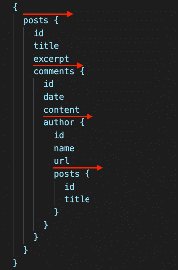
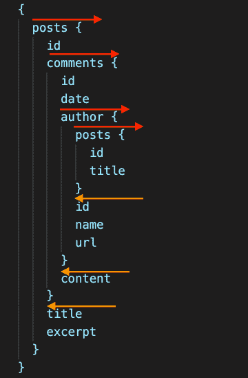
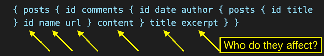
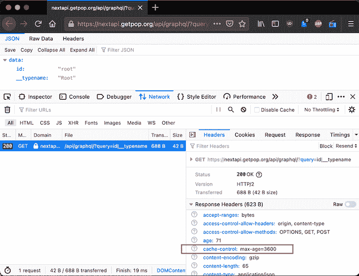
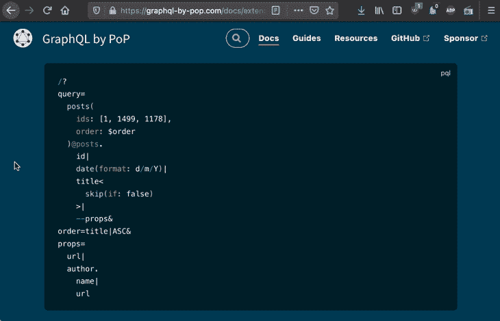
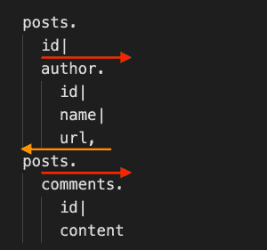

# 为 GraphQL 设计基于 URL 的查询语法

> 原文：<https://blog.logrocket.com/designing-url-based-query-syntax-graphql/>

目前，如果我们想在 GraphQL 中使用 HTTP 缓存，我们必须使用支持持久化查询的 GraphQL 服务器。这是因为持久化查询已经在服务器中存储了 GraphQL 查询；因此，我们不需要在请求中提供这些信息。

为了让 GraphQL 服务器也通过单个端点支持 HTTP 缓存，GraphQL 查询必须作为 URL 参数提供。HTTP 上的[GraphQL](https://github.com/graphql/graphql-over-http)规范有望实现这一目标，为所有 graph QL 客户端、服务器和库之间的交互提供一种标准化的语言。

不过，我怀疑所有通过 URL 参数传递 GraphQL 查询的尝试都不太理想。这是因为 URL 参数必须以单行值的形式提供，所以查询要么需要编码，要么需要重新格式化，这使得它很难理解(对于我们人类，而不是机器)。

例如，当用空格替换所有换行符以使其适合单行时，GraphQL 查询看起来是这样的:

```
{ posts(limit:5) { id title @titleCase excerpt @default(value:"No title", condition:IS_EMPTY) author { name } tags { id name } comments(limit:3, order:"date|DESC") { id date(format:"d/m/Y") author { name } content } } }

```

你能理解它吗？我也没有。

这就是 GraphiQL 客户端将简单查询`{ posts { id title } }`编码为 URL 参数的方式:

```
%7B%0A%20%20posts%20%7B%0A%20%20%20%20id%0A%20%20%20%20title%0A%20%20%7D%0A%7D

```

再说一次，我们不知道这里发生了什么。

这两个例子都表明了这个问题:单行 GraphQL 查询从技术角度来看可以工作，将信息传输到服务器，但是人们不容易读取和编写这些查询。

能够使用单行查询有很多好处。例如，我们可以直接在浏览器的地址栏中编写查询，而不需要一些 GraphQL 客户端。

这并不是说我不喜欢 GraphQL 客户端——事实上，我喜欢 graph QL。但是我不喜欢依赖他们的想法。

换句话说，我们可以受益于一种查询语法，它允许人们:

*   直接在一行中编写查询
*   一目了然地理解单行查询

这是一个艰巨的挑战。但这并不是不可克服的。

在本文中，我将介绍一种替代语法，它支持我们人类“在一行中轻松地读写”。

我并不是真的建议在 GraphQL 中引入这种语法——我知道这永远不会发生。但是这种语法的设计过程仍然可以作为我们在设计 GraphQL over HTTP 规范时必须注意的例子。

## 为什么 GraphQL 语法在一行中如此难以理解？

让我们首先探索 GraphQL 语法的问题，然后将其推广到其他语法。

### 识别问题

在我看来，困难在于 GraphQL 查询中的字段是嵌套的，其中嵌套可以在整个查询中前进和后退。正是这种来来去去的行为使得用单行书写时很难理解。

如果查询中的嵌套只是向前推进，那么理解它并不困难。以这个查询为例:

```
{
  posts {
    id
    title
    excerpt
    comments {
      id
      date
      content
      author {
        id
        name
        url
        posts {
          id
          title
        }
      }
    }
  }
}

```

在这里，嵌套只能向前进行:



GraphQL query, advancing only.

当查看总是向前的查询并从左向右扫描时，我们仍然可以理解每个字段属于哪个实体:

```
{ posts { id title excerpt comments { id date content author { id name url posts { id title } } } } }

```

现在，考虑同一个 GraphQL 查询，但是重新排列了字段，使得叶子出现在连接之后:

```
{
  posts {
    id
    comments {
      id
      date
      author {
        posts {
          id
          title
        }
        id
        name
        url
      }
      content
    }
    title
    excerpt
  }
}

```

在这种情况下，我们可以说，场前进，也后退:



GraphQL query, advancing and retreating.

该查询可以写成一行，如下所示:

```
{ posts { id comments { id date author { posts { id title } id name url } content } title excerpt } }

```

现在，理解查询不再那么容易了。在后退一级后(即，紧接在一个连接之后)，我们可能不记得哪个实体在它之前，所以我们不会掌握字段属于哪里:



To what entity do these fields belong to?

(我猜这与人类大脑的短期记忆有限有关，一次只能保存不超过几个项目。)

而当前进和后退有很多层次时，那么完全掌握就变得相当不可能了。这个疑问是可以理解的:

```
{
  posts {
    id
    comments {
      id
      date
      children {
        id
        author {
          name
          url
        }
        content
      }
      author {
        posts {
          id
          title
          tags {
            name
          }
        }
        id
        name
        friends {
          id
          name
        }
        url
      }
      content
    }
    title
    excerpt
  }
  author {
    name
  }
}

```

但是我们无法理解它的单行等价物:

```
{ posts { id comments { id date children { id author { name url } content } author { posts { id title tags { name } } id name friends { id name } url } content } title excerpt } author { name } }

```

总之，由于它的嵌套行为，GraphQL 查询不能简单地用一行代码来表示，以至于我们人类不能理解它。

### 概括问题

该问题并不是 GraphQL 特有的。事实上，对于一种语法——任何语法——元素进退都会发生这种情况。

以 JSON 为例:

```
{
  "name": "leoloso/PoP",
  "description": "PoP monorepo",
  "repositories": [
    {
      "type": "package",
      "package": {
        "name": "leoloso-pop-api-wp/newsletter-subscriptions-rest-endpoints",
        "version": "master",
        "type": "wordpress-plugin",
        "source": {
          "url": "https://gist.github.com/leoloso/6588f6c1bdcce82fc317052616d3dfb4",
          "type": "git",
          "reference": "master"
        }
      }
    },
    {
      "type": "package",
      "package": {
        "name": "leoloso-pop-api-wp/disable-user-edit-profile",
        "version": "0.1.1",
        "type": "wordpress-plugin",
        "source": {
          "url": "https://gist.github.com/leoloso/4e367eb8d8014a7aa7580567608bd5b4",
          "type": "git",
          "reference": "master"
        }
      }
    },
    {
      "type": "vcs",
      "url": "https://github.com/leoloso/wp-muplugin-loader.git"
    }
  ],
  "minimum-stability": "dev",
  "prefer-stable": true,
  "require": {
    "php": "~8.0",
    "getpop/api-rest": "dev-master",
    "getpop/engine-wp-bootloader": "dev-master"
  },
  "extra": {
    "branch-alias": {
      "dev-master": "1.0-dev"
    },
    "installer-types": [
      "graphiql-client",
      "graphql-voyager"
    ],
    "installer-paths": {
      "wordpress/wp-content/mu-plugins/{$name}/": [
        "type:wordpress-muplugin"
      ],
      "wordpress/wp-content/plugins/{$name}/": [
        "type:wordpress-plugin",
        "getpop/engine-wp-bootloader"
      ]
    }
  },
  "config": {
    "sort-packages": true
  }
}

```

把它转换成一句话，真的很难理解:

```
{ "name": "leoloso/PoP", "description": "PoP monorepo", "repositories": [ { "type": "package", "package": { "name": "leoloso-pop-api-wp/newsletter-subscriptions-rest-endpoints", "version": "master", "type": "wordpress-plugin", "source": { "url": "https://gist.github.com/leoloso/6588f6c1bdcce82fc317052616d3dfb4", "type": "git", "reference": "master" } } }, { "type": "package", "package": { "name": "leoloso-pop-api-wp/disable-user-edit-profile", "version": "0.1.1", "type": "wordpress-plugin", "source": { "url": "https://gist.github.com/leoloso/4e367eb8d8014a7aa7580567608bd5b4", "type": "git", "reference": "master" } } }, { "type": "vcs", "url": "https://github.com/leoloso/wp-muplugin-loader.git" } ], "minimum-stability": "dev", "prefer-stable": true, "require": { "php": "~8.0", "getpop/api-rest": "dev-master", "getpop/engine-wp-bootloader": "dev-master" }, "extra": { "branch-alias": { "dev-master": "1.0-dev" }, "installer-types": [ "graphiql-client", "graphql-voyager" ], "installer-paths": { "wordpress/wp-content/mu-plugins/{$name}/": [ "type:wordpress-muplugin" ], "wordpress/wp-content/plugins/{$name}/": [ "type:wordpress-plugin", "getpop/engine-wp-bootloader" ] } }, "config": { "sort-packages": true } } 

```

更重要的是，当语法使用空格来嵌套其元素时，甚至不可能将它写在一行中。

例如，YAML 就是这种情况:

```
services:
  _defaults:
    public: true
    autowire: true
    autoconfigure: true

  PoP\API\PersistedQueries\PersistedQueryManagerInterface:
    class: \PoP\API\PersistedQueries\PersistedQueryManager

  # Override the service
  PoP\ComponentModel\Schema\FieldQueryInterpreterInterface:
    class: \PoP\API\Schema\FieldQueryInterpreter

  PoP\API\Hooks\:
    resource: '../src/Hooks/*' 

```

## 设计不同的查询语法

我将描述 GraphQL 语法的替代设计:GraphQL by PoP(我编写的 PHP 中的 GraphQL 服务器)使用的 [PQL 语法](https://graphql-by-pop.com/docs/extended/pql.html)，接受通过`GET`传递的基于 URL 的查询。

由于 GraphQL 语法的问题是由退回嵌套字段引起的，所以解决方案似乎很明显:查询流必须总是向前的。

PQL 是如何做到这一点的？为了演示，让我们来探索 PQL 语法。

### 字段语法

在 GraphQL 中，一个字段是这样写的:

```
{
  alias:fieldName(fieldArgs)@fieldDirective(directiveArgs)
}

```

在 PQL，一个字段是这样写的:

```
fieldName(fieldArgs)[@alias]<fieldDirective(directiveArgs)>

```

两者非常相似，但也有一些不同之处:

1.  别名不是放在字段之前，而是放在字段之后
2.  别名不是用`:`来标识的，而是用`@`来标识的(可选地，用`[...]`来表示“书签”，稍后解释)
3.  该指令不是用`@`标识，而是用`<...>`包围

这些差异与查询所需的总是向前的流直接相关。

在我自己的经验中，当直接在浏览器的地址栏中编写查询时，我总是在编写完字段名之后才想到需要别名，而不是在此之前。因此，使用 GraphQL 中的顺序，我必须返回到那个位置(按左箭头键)，添加别名，然后返回到最终位置(按右箭头键)。

那是相当麻烦的。将别名放在字段名之后更有意义，这是一种自然的流程。

当在字段名后定义别名时，使用`:`不再有意义。GraphQL 使用这个符号让 JSON 响应考虑查询的形状。一旦字段和别名之间的顺序颠倒，使用`@`似乎是一个自然的选择。

这反过来意味着我们不能再使用`@`来识别指令。相反，我选择了一个环绕语法`<...>`(例如`<directiveName>`)，这样指令也可以嵌套(例如`<directive1<directive2>>`)，使得 GraphQL by PoP 能够支持[可组合指令](https://graphql-by-pop.com/docs/extended/pql-language-features.html#composable-directives)特性。

### 菲尔茨

在 GraphQL 中，我们可以通过在字段之间添加空格或换行符来添加两个或更多字段:

```
{
  foo
  bar
}

```

在 PQL，我们使用字符`|`来分隔字段:

```
foo|bar

```

我们已经可以看到查询是如何组成一行的:

*   没有`{}`字符
*   没有空格或换行符

我们还可以理解，查询可以直接在浏览器中编写，通过 URL param `query`传递。

例如，执行查询`id|__typename`的 URL 是: [${endpoint}？query=id|__typename](https://nextapi.getpop.org/api/graphql/?query=id%7C__typename)

使用 DevTools，我们可以看到 GraphQL 单端点是如何支持 HTTP 缓存的:



HTTP caching for the GraphQL single endpoint.

对于下面演示的所有查询，将有一个链接*在浏览器*中执行查询。点击它们可以看到 PQL 是如何在实际生产现场工作的。

### 使查询具有视觉吸引力

与 GraphQL 类似，换行符(以及空格)不增加语义。因此，我们可以方便地添加换行符来帮助可视化查询:

```
foo|
bar

```

当使用 Firefox 时，这个查询可以被复制(从文本编辑器、网页等)。)并粘贴到浏览器的地址栏中，所有换行符将被自动删除，从而创建等效的单行查询。



### 连接

GraphQL 使用字符`{}`来定义连接数据:

```
{
  posts {
    author {
      id
    }
  }
}

```

在 PQL，质疑只有前进，没有后退。所以对于`{`有一个等价的，也就是`.`，但是对于`}`没有等价的，因为它不需要。

```
posts.
  author.
    id

```

[*在*](https://nextapi.getpop.org/api/graphql/?query=posts.author.id) 浏览器中执行查询。

我们可以组合`|`和`.`来为任何实体获取多个字段。考虑这个 GraphQL 查询:

```
{
  posts {
    id
    title
    author {
      id
      name
      url
    }
  }
}

```

它在 PQL 的对等词是:

```
posts.
  id|
  title|
  author.
    id|
    name|
    url

```

[*在*](https://nextapi.getpop.org/api/graphql/?query=posts.id%7Ctitle%7Cauthor.id%7Cname%7Curl) 浏览器中执行查询。

在这一点上，我们可以面对挑战:PQL 如何只接受前进领域？

### 仅前进流的语法

上面看到的查询总是在前进。现在让我们来处理同样需要退回的查询，比如这个 GraphQL 查询:

```
{
  posts {
    id
    author {
      id
      name
      url
    }
    comments {
      id
      content
    }
  }
}

```

PQL 使用字符`,`来连接元素。它类似于连接字段的`|`,但是有一个基本的区别:`,`右边的字段从根开始再次遍历图。

然后，上面的查询在 PQL 有这样的等价物:

```
posts.
  id|
  author.
    id|
    name|
    url,
posts.
  comments.
    id|
    content

```

[*在*](https://nextapi.getpop.org/api/graphql/?query=posts.id%7Cauthor.id%7Cname%7Curl,posts.comments.id%7Ccontent) 浏览器中执行查询。

注意，为了在视觉上吸引人，`name|`和`url`的左边有相同的填充，因为`|`保持它们相同的路径`posts.author.`。但是在`,`之后没有左填充，因为查询是从根开始的。

我们可能会认为这个查询也确实后退了:



Advancing and retreating query in PQL.

然而，这与其说是撤退，不如说是“重置”。在 GraphQL 中，我们可以返回到查询中的前一个位置——即图中的父节点——与我们遍历的级别一样多。然而在 PQL，我们不能:我们总是一路回溯到图的根。

再次从根开始，我们必须再次指定节点的完整路径，以继续添加字段。这使得查询更加冗长。例如，上面查询中的`posts`路径在 GraphQL 中出现了一次，但在 PQL 中出现了两次。

这种冗余迫使我们人类在为图中的每一层读写查询时重新创建路径。这样做可以让我们理解用单行表达的查询:

```
posts.id|author.id|name|url,posts.comments.id|content

```

因为我们在头脑中重新创建了路径，所以我们不会遭受短期内存问题，这种问题会导致我们在查看 GraphQL 查询时迷失方向。

### 移除冗长的书签

不得不重新创建到节点的整个路径可能会变得很麻烦。

考虑这个 GraphQL 查询:

```
{
  users {
    posts {
      author {
        id
        name
      }
      comments {
        id
        content
      }
    }
  }
}

```

和 PQL 的同类组织:

```
users.
  posts.
    author.
      id|
      name,
users.
  posts.
    comments.
      id|
      content

```

[*在*](https://nextapi.getpop.org/api/graphql/?query=users.posts.author.id%7Cname,users.posts.comments.id%7Ccontent) 浏览器中执行查询。

为了检索`comments`字段，我们再次需要添加`users.posts.`。图表越往下，复制的路径就越长。

为了解决这个问题，PQL 引入了一个新概念:“书签”，它提供了一个已经遍历过的路径的快捷方式，这样我们就可以方便地从那个点继续加载数据。

我们定义了一个书签，当遍历某个路径时，用`[...]`将它的名字括起来，然后当引用它的书签时，这个路径被自动检索，再次用`[...]`将它的名字括起来，从查询的根开始。

在上面的查询中，我们可以将`users.posts`标记为`[userposts]`:

```
users.
  posts[userposts].
    author.
      id|
      name,
[userposts].
  comments.
    id|
    content

```

[*在*](https://nextapi.getpop.org/api/graphql/?query=users.posts%5Buserposts%5D.author.id%7Cname,%5Buserposts%5D.comments.id%7Ccontent) 浏览器中执行查询。

为了更容易可视化，我们还可以在应用的书签的左侧添加等效的填充，匹配其路径的相同填充(以便`comments`出现在`posts`下面):

```
users.
  posts[userposts].
    author.
      id|
      name,
  [userposts].
    comments.
      id|
      content

```

有了书签，我们仍然可以理解用单行表达的查询:

```
users.posts[userposts].author.id|name,[userposts].comments.id|content

```

如果我们需要定义书签和别名，我们可以在`[...]`中嵌入`@`符号:

```
users.
  posts[@userposts].
    author.
      id|
      name,
  [userposts].
    comments.id|
    content

```

[*在*](https://nextapi.getpop.org/api/graphql/?query=users.posts%5B@userposts%5D.author.id%7Cname,%5Buserposts%5D.comments.id%7Ccontent) 浏览器中执行查询。

### 简化字段参数

在 GraphQL 中，字段参数中的`String`值必须用引号`"..."`括起来:

```
{
  posts {
    id
    title
    date(format: "d/m/Y")
  }
}

```

事实证明，在浏览器中编写查询时必须键入这些引号非常烦人；我经常会忘记它们，然后不得不用箭头键左右导航来添加它们。

因此，在 PQL，字符串引号可以省略:

```
posts.
  id|
  title|
  date(format:d/m/Y)

```

[*在*](https://nextapi.getpop.org/api/graphql/?query=posts.id%7Ctitle%7Cdate(format:d/m/Y)) 浏览器中执行查询。

当查询会被中断时，字符串引号是必需的:

```
posts.
  id|
  title|
  date(format:"d M, Y")

```

[*在*](https://nextapi.getpop.org/api/graphql/?query=posts.id%7Ctitle%7Cdate(format:%22d%20M,%20Y%22)) 浏览器中执行查询。

此外，字段参数有时可能是隐式的；例如，当字段只有一个字段参数时。在这种情况下，PQL 允许省略它:

```
posts.
  id|
  title|
  date(d/m/Y)

```

[*在*](https://nextapi.getpop.org/api/graphql/?query=posts.id%7Ctitle%7Cdate(d/m/Y)) 浏览器中执行查询。

### 变量

在 GraphQL 中，[变量在请求](https://graphql.org/learn/queries/#variables)的主体中被定义为编码的 JSON:

```
{
  "query":"query ($format: String) {
    posts {
      id
      title
      date(format: $format)
    }
  }",
  "variables":"{
    \"format\":\"d/m/Y\"
  }"
}

```

相反，PQL 使用 HTTP 标准输入，通过`$_GET`或`$_POST`传递变量:

```
?query=
  posts.
    id|
    title|
    date($format)
&format=d/m/Y

```

[*在*](https://nextapi.getpop.org/api/graphql/?query=posts.id%7Ctitle%7Cdate(%24format)&format=d/m/Y) 浏览器中执行查询。

我们也可以在输入`variables`下传递变量:

```
?query=
  posts.
    id|
    title|
    date($format)
&variables[format]=d/m/Y

```

[*在*](https://nextapi.getpop.org/api/graphql/?query=posts.id%7Ctitle%7Cdate(%24format)&variables%5Bformat%5D=d/m/Y) 浏览器中执行查询。

### 碎片

GraphQL 使用片段来重用查询部分:

```
{
  users {
    ...userData
    posts {
      comments {
        author {
          ...userData
        }
      }
    }
  }
}

fragment userData on User {
  id
  name
  url
}

```

在 PQL，片段遵循与定义变量相同的方法:作为`$_GET`或`$_POST`的输入。它们被引用为`--`:

```
?query=
  users.
    --userData|
    posts.
      comments.
        author.
          --userData
&userData=
  id|
  name|
  url

```

[*在*](https://nextapi.getpop.org/api/graphql/?query=users.--userData%7Cposts.comments.author.--userData&userData=id%7Cname%7Curl) 浏览器中执行查询。

该片段也可以在输入`fragments`下定义:

```
?query=
  users.
    --userData|
    posts.
      comments.
        author.
          --userData
&fragments[userData]=
  id|
  name|
  url

```

[*在*](https://nextapi.getpop.org/api/graphql/?query=users.--userData%7Cposts.comments.author.--userData&fragments%5BuserData%5D=id%7Cname%7Curl) 浏览器中执行查询。

## 在 GraphQL 和 PQL 语法之间转换查询

PQL 是 GraphQL 查询语法的超集。因此，使用标准 GraphQL 语法编写的任何查询也可以用 PQL 语言编写。

相反，并不是用 PQL 编写的每个查询都可以用 GraphQL 语法编写，因为 PQL 支持 GraphQL 不支持的特性，如[可组合字段](https://graphql-by-pop.com/docs/extended/pql-language-features.html#composable-fields)和[可组合指令](https://graphql-by-pop.com/docs/extended/pql-language-features.html#composable-directives)。

PQL 包含了大部分相同的元素:

*   字段和字段参数
*   指令和指令参数
*   别名
*   碎片
*   变量

它不支持的元素有:

*   操作
*   操作名称、变量定义和默认变量
*   `on`元素，指示一个片段必须应用在什么类型/接口上

尽管这些元素不受支持，但它们的底层功能通过不同的方法得到支持。

因为不再需要它，所以该操作被遗漏了:我们现在可以选择使用`GET`(对于查询)或`POST`(对于突变)来请求查询。

只有当文档包含许多操作时，GraphQL 中才需要操作名，我们需要指定执行哪个操作，或者可能一起执行几个操作，通过`@export`将它们联系起来。

在前一个例子中，PQL 不需要它——我们只传递必须执行的查询，而不是所有的查询。

在后一种情况下，多个操作可以在一个请求中一起执行，同时保证它们的执行顺序，[通过用`;`](https://github.com/leoloso/PoP/blob/master/layers/Engine/packages/field-query/README.md#appending-fields-with-strict-execution-order) 连接它们，如下所示:

```
posts.
  author.
    id|
    name|
    url;

posts.
  comments.
    id|
    content

```

[*在*](https://nextapi.getpop.org/api/graphql/?query=posts.author.id%7Cname%7Curl;posts.comments.id%7Ccontent) 浏览器中执行查询。

在 GraphQL 中，变量定义用于定义变量的类型，使 graph QL 这样的客户端能够在类型不同时显示错误。这是一个不错的选择，但是对于执行查询本身来说并不是真正需要的。

默认变量值可以像任何变量一样定义:通过 URL 参数。

不需要`on`元素，因为我们可以使用指令`@include`，传递一个可组合字段`isType`作为参数，找出对象的类型，并基于这个值，应用或不应用想要的片段。

例如，以这个 GraphQL 查询为例:

```
{
  customPosts {
    __typename
    ... on Post {
      title
    }
  }
}

```

这相当于 PQL:

```
customPosts.
  __typename|
  title<include(if:isType(Post))>

```

[*在*](https://nextapi.getpop.org/api/graphql/?query=customPosts.__typename%7Ctitle%3Cinclude(if:isType(Post))%3E) 浏览器中执行查询。

## 转换自检查询

让我们将 GraphQL(和其他客户机)用来获取模式元数据的自省查询从 graph QL 语法转换为 PQL 语法。

自检查询是[这个](https://gist.github.com/leoloso/4adf5c565789d43e2879bb3787af9329):

```
query IntrospectionQuery {
  __schema {
    queryType {
      name
    }
    mutationType {
      name
    }
    subscriptionType {
      name
    }
    types {
      ...FullType
    }
    directives {
      name
      description
      locations
      args {
        ...InputValue
      }
    }
  }
}

fragment FullType on __Type {
  kind
  name
  description
  fields(includeDeprecated: true) {
    name
    description
    args {
      ...InputValue
    }
    type {
      ...TypeRef
    }
    isDeprecated
    deprecationReason
  }
  inputFields {
    ...InputValue
  }
  interfaces {
    ...TypeRef
  }
  enumValues(includeDeprecated: true) {
    name
    description
    isDeprecated
    deprecationReason
  }
  possibleTypes {
    ...TypeRef
  }
}

fragment InputValue on __InputValue {
  name
  description
  type {
    ...TypeRef
  }
  defaultValue
}

fragment TypeRef on __Type {
  kind
  name
  ofType {
    kind
    name
    ofType {
      kind
      name
      ofType {
        kind
        name
        ofType {
          kind
          name
          ofType {
            kind
            name
            ofType {
              kind
              name
              ofType {
                kind
                name
              }
            }
          }
        }
      }
    }
  }
}

```

它的等价 PQL 查询是这样的:

```
?query=
    __schema[schema].
        queryType.
            name,
    [schema].
        mutationType.
            name,
    [schema].
        subscriptionType.
            name,
    [schema].
        types.
            --FullType,
    [schema].
        directives.
            name|
            description|
            locations|
            args.
                --InputValue
&fragments[FullType]=
    kind|
    name|
    description|
    fields(includeDeprecated: true)[@fields].
        name|
        description|
        args.
            --InputValue,
    [fields].
        type.
            --TypeRef,
    [fields].
        isDeprecated|
        deprecationReason,
    [fields].
        inputFields.
            --InputValue,
    [fields].
        interfaces.
            --TypeRef,
    [fields].
        enumValues(includeDeprecated: true)@enumValues.
            name|
            description|
            isDeprecated|
            deprecationReason,
    [fields].
        possibleTypes.
            --TypeRef
&fragments[InputValue]=
    name|
    description|
    defaultValue|
    type.
        --TypeRef
&fragments[TypeRef]=
    kind|
    name|
    ofType.
        kind|
        name|
        ofType.
            kind|
            name|
            ofType.
                kind|
                name|
                ofType.
                    kind|
                    name|
                    ofType.
                        kind|
                        name|
                        ofType.
                            kind|
                            name|
                            ofType.
                                kind|
                                name

```

*[在浏览器中执行查询](https://nextapi.getpop.org/api/graphql/?query=__schema%5Bschema%5D.queryType.name,%5Bschema%5D.mutationType.name,%5Bschema%5D.subscriptionType.name,%5Bschema%5D.types%5B@schemaTypes%5D.--FullType,--FullType_fields1,--FullType_fields2,--FullType_schemaTypes1,--FullType_schemaTypes2,--FullType_schemaTypes3,--FullType_schemaTypes4,%5Bschema%5D.directives.name%7Cdescription%7Clocations%7Cargs.--InputValue&fragments%5BFullType%5D=kind%7Cname%7Cdescription%7Cfields(includeDeprecated:%20true)%5B@fields%5D.name%7Cdescription%7Cargs.--InputValue&fragments%5BFullType_fields1%5D=%5Bfields%5D.type.--TypeRef&fragments%5BFullType_fields2%5D=%5Bfields%5D.isDeprecated%7CdeprecationReason&fragments%5BFullType_schemaTypes1%5D=%5BschemaTypes%5D.inputFields.--InputValue&fragments%5BFullType_schemaTypes2%5D=%5BschemaTypes%5D.interfaces.--TypeRef&fragments%5BFullType_schemaTypes3%5D=%5BschemaTypes%5D.enumValues(includeDeprecated:%20true)@enumValues.name%7Cdescription%7CisDeprecated%7CdeprecationReason&fragments%5BFullType_schemaTypes4%5D=%5BschemaTypes%5D.possibleTypes.--TypeRef&fragments%5BInputValue%5D=name%7Cdescription%7CdefaultValue%7Ctype.--TypeRef&fragments%5BTypeRef%5D=kind%7Cname%7CofType.kind%7Cname%7CofType.kind%7Cname%7CofType.kind%7Cname%7CofType.kind%7Cname%7CofType.kind%7Cname%7CofType.kind%7Cname%7CofType.kind%7Cname)。(注意，这个链接中的查询与上面的略有不同，因为我仍然需要[在片段](https://github.com/leoloso/PoP/issues/655)中添加对`,`标记的支持。)*

这是用一行代码编写的查询:

```
?query=__schema[schema].queryType.name,[schema].mutationType.name,[schema].subscriptionType.name,[schema].types.--FullType,[schema].directives.name|description|locations|args.--InputValue&fragments[FullType]=kind|name|description|fields(includeDeprecated: true)[@fields].name|description|args.--InputValue,[fields].type.--TypeRef,[fields].isDeprecated|deprecationReason,[fields].inputFields.--InputValue,[fields].interfaces.--TypeRef,[fields].enumValues(includeDeprecated: true)@enumValues.name|description|isDeprecated|deprecationReason,[fields].possibleTypes.--TypeRef&fragments[InputValue]=name|description|defaultValue|type.--TypeRef&fragments[TypeRef]=kind|name|ofType.kind|name|ofType.kind|name|ofType.kind|name|ofType.kind|name|ofType.kind|name|ofType.kind|name|ofType.kind|name

```

## 更多的例子

该查询有一个包含嵌套路径、变量、指令和其他片段的片段:

```
?query=
  posts(limit:$limit, order:$order).
    --postData|
    author.
      posts(limit:$limit).
        --postData
&postData=
  id|
  title|
  --nestedPostData|
  date(format:$format)
&nestedPostData=
  comments<include(if:$include)>.
    id|
    content
&format=d/m/Y
&include=true
&limit=3
&order=title

```

[*在*](https://nextapi.getpop.org/api/graphql/?query=posts(limit:%24limit).--postData%7Cauthor.posts(limit:%24limit).--postData&postData=id%7Ctitle%7C--nestedPostData%7Cdate(format:%24format)&nestedPostData=comments%3Cinclude(if:%24include)%3E.id%7Ccontent&format=d/m/Y&include=true&limit=3) 浏览器中执行查询。

该查询将一个指令应用于一个片段，该指令随后应用于该片段中的所有字段:

```
?query=
  posts.
    id|
    --props<include(if:hasComments())>
&fragments[props]=
  title|
  date

```

[*在*](https://nextapi.getpop.org/api/graphql/?query=posts.id%7C--props%3Cinclude(if:hasComments())%3E&fragments%5Bprops%5D=title%7Cdate) 浏览器中执行查询。

最后，在这篇博文的[中，有许多单行查询的例子，它们直接作为 URL 参数嵌入，并包含来自 PQL 语法的附加属性(本文中没有描述)。](https://leoloso.com/posts/graphql-query-in-a-single-line/)

## 结论

为了支持 HTTP 缓存，我们目前必须使用支持持久查询的 GraphQL 服务器。

但是 GraphQL 单端点呢？它也能支持 HTTP 缓存吗？如果是这样的话，是否可以让人们编写查询，而不是依赖于客户端或库？

对这些问题的回答是:是的，可以做到。然而，由于其嵌套行为，GraphQL 语法目前处于阻碍地位。

在本文中，我演示了一种替代语法，称为 PQL，它使 GraphQL 服务器能够通过 URL 参数接受查询，同时使人们能够在一行中读写查询，甚至直接在浏览器的地址栏中。

## 监控生产中失败和缓慢的 GraphQL 请求

虽然 GraphQL 有一些调试请求和响应的特性，但确保 GraphQL 可靠地为您的生产应用程序提供资源是一件比较困难的事情。如果您对确保对后端或第三方服务的网络请求成功感兴趣，

[try LogRocket](https://lp.logrocket.com/blg/graphql-signup)

.

[](https://lp.logrocket.com/blg/graphql-signup)[https://logrocket.com/signup/](https://lp.logrocket.com/blg/graphql-signup)

LogRocket 就像是网络和移动应用的 DVR，记录下你网站上发生的每一件事。您可以汇总并报告有问题的 GraphQL 请求，以快速了解根本原因，而不是猜测问题发生的原因。此外，您可以跟踪 Apollo 客户机状态并检查 GraphQL 查询的键值对。

LogRocket 检测您的应用程序以记录基线性能计时，如页面加载时间、到达第一个字节的时间、慢速网络请求，还记录 Redux、NgRx 和 Vuex 操作/状态。

[Start monitoring for free](https://lp.logrocket.com/blg/graphql-signup)

.