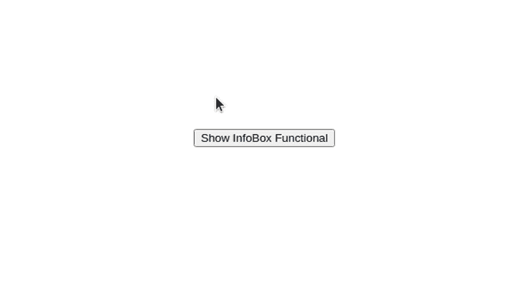
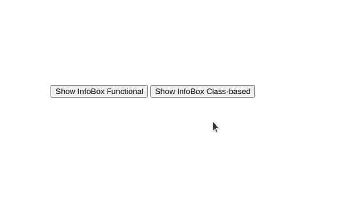

# 如何检测 React 组件外部的点击

> 原文：<https://blog.logrocket.com/detect-click-outside-react-component-how-to/>

Web 开发人员倾向于使用多个组件来使他们基于 React 的 web 应用程序更加动态，以增强可用性和灵活性。

React 组件是一个独立的、可重用的、隔离的 UI 构建块，用 JSX(或 TSX)编写。Web 应用程序通常允许用户一次与一个组件进行交互，例如，用户可以打开一个 HTML 弹出窗口并与弹出窗口的内容进行交互。如果用户在弹出窗口区域之外单击，web 应用程序要么关闭弹出窗口，要么阻止用户关闭弹出窗口。

Web 开发人员还使用自定义下拉菜单让用户从几个选项列表中进行选择。如果用户在自定义下拉列表打开时单击其外部，下拉列表将被关闭。

在这类场景中，如果用户在特定组件之外单击，我们必须触发一些操作。

在本教程中，我将解释如何扩展您的函数式和基于类的 React 组件来检测外部点击，并且我将解释使用流行的 npm 库完成相同任务的另一种方法。

## 检测功能组件的外部点击

让我们通过创建一个名为`InfoBox`的 React 功能组件来构建一个 HTML 工具提示。当用户单击按钮时，工具提示将会出现，如果用户在工具提示组件之外单击，工具提示将会关闭。我们需要检测 React 组件外部的点击，以实现该场景的解决方案。

首先，我们将创建一个新的 React 应用程序来开始。您也可以将以下外部点击检测代码添加到您现有的 React 应用程序中。

输入以下命令并创建一个新的应用程序。

```
npx create-react-app react-outside-click   
cd react-outside-click
yarn start

```

现在，我们需要创建一个新的功能组件来实现工具提示组件。将以下代码添加到`./src/components/InfoBoxFunctional.js`中。

```
import { useEffect, useRef } from 'react';

export function InfoBox(props) {
  const ref = useRef(null);
  const { onClickOutside } = props;

  useEffect(() => {
    const handleClickOutside = (event) => {
      if (ref.current && !ref.current.contains(event.target)) {
        onClickOutside && onClickOutside();
      }
    };
    document.addEventListener('click', handleClickOutside, true);
    return () => {
      document.removeEventListener('click', handleClickOutside, true);
    };
  }, [ onClickOutside ]);

  if(!props.show)
    return null;

  return (
    <div ref={ref} className='info-box'>
        {props.message}
    </div> );
}

```

上面的代码片段在`useRef`钩子的帮助下将当前组件实例的 DOM 引用分配给`ref`变量。之后，它在整个[文档](https://developer.mozilla.org/en-US/docs/Web/API/Document)的`useEffect`钩子中注册一个点击处理程序来检测全局点击事件。

我们还可以从`useEffect`钩子返回一个带有清理代码的函数，这意味着当组件被卸载时，我们可以注销我们的全局 click 事件监听器。可以看到，上面的代码用`removeEventListener` DOM API 函数实现了清理代码。

### 准备`InfoBox`工具提示组件

`InfoBox`组件支持三个道具:

*   `message`:指定工具提示信息
*   `onClickOutside`:设置有外部点击事件时需要触发的回调
*   `show`:可见性状态，表示组件是隐藏还是可见。如果为真，工具提示可见；如果没有，组件函数将返回`null`并且不会呈现任何内容

每当用户点击文档时，就会触发`handleClickOutside`功能。因此，如果我们直接调用`onClickOutside`，[，即使用户点击工具提示本身，工具提示也会消失](https://blog.logrocket.com/controlling-tooltips-pop-up-menus-using-compound-components-in-react-ccedc15c7526/)。

上面的代码通过`contains` DOM API 函数检查用户是否点击了工具提示(或其子项)。因此，如果在工具提示组件实例之外发生单击事件，就会执行`onClickOutside`回调。

`InfoBox`组件现在准备好了。将下面的 CSS 代码添加到`./src/index.css`文件中，为`InfoBox`组件应用一些样式。如果你愿意，你也可以将你的信息框相关的 CSS 移动到一个单独的文件中。出于演示目的，我们将使用`index.css`文件。

```
body {
  margin: 0;
  font-family: -apple-system, BlinkMacSystemFont, 'Segoe UI', 'Roboto', 'Oxygen',
    'Ubuntu', 'Cantarell', 'Fira Sans', 'Droid Sans', 'Helvetica Neue',
    sans-serif;
  -webkit-font-smoothing: antialiased;
  -moz-osx-font-smoothing: grayscale;
}
.container {
  display: flex;
  justify-content: center;
  padding-top: 40vh;
}
.container .info-box-wrapper {
  position: relative;
}
.container .info-box {
  user-select: none;
  width: 300px;
  background: #ffc00d;
  font-size: 14px;
  padding: 12px;
  box-shadow: 2px 2px 12px rgba(0, 0, 0, 0.2);
  border-radius: 4px;
  top: 20px;
  position: absolute;
}

```

最后，用下面的代码更新您的`./src/App.js`文件，让我们的主应用程序开始工作。

```
import { useState } from 'react';
import { InfoBox } from './components/InfoBoxFunctional.js';
function App() {
  let [showInfo1, setShowInfo1] = useState(false);
  return (
    <div className="container">
      <div className="info-box-wrapper">
        <button onClick={() => {setShowInfo1(true)}} style={{marginRight: '4px'}}>Show InfoBox Functional</button>
        <InfoBox show={showInfo1} onClickOutside={() => {setShowInfo1(false)}} message="Click outside to close this"/>
      </div>
    </div>
  );
}
export default App;

```

上面的代码呈现了一个带有打开信息框的单击操作的按钮。组件是可重用的(您可以创建许多信息框)，我们像往常一样将所需的道具传递给它。

看看下面正在运行的应用程序。我们可以通过单击 InfoBox 实例的外部来关闭它。此外，当你点击按钮或组件时，它不会消失。



## 检测基于类的组件的外部点击

基于类的组件方法看起来非常类似于功能组件。我们使用相同的道具、DOM APIs 和实现逻辑，但是我们必须以基于类的风格编写代码。将以下代码添加到`./src/components/InfoBoxClassBased.js`。

```
import React from 'react';

export class InfoBox extends React.Component {
  constructor(props) {
    super(props);
    this.ref = React.createRef();
    this.handleClickOutside = this.handleClickOutside.bind(this);
  }

  handleClickOutside(event) {
    if (this.ref.current && !this.ref.current.contains(event.target)) {
      this.props.onClickOutside && this.props.onClickOutside();
    }
  };

  componentDidMount() {
    document.addEventListener('click', this.handleClickOutside, true);
  }

  componentWillUnmount() {
    document.removeEventListener('click', this.handleClickOutside, true);
  };

  render() {
    if(!this.props.show)
      return null;
    return (
      <div ref={this.ref} className='info-box'>
        {this.props.message}
      </div> );
  }
}

```

上面的代码片段类似于功能组件代码，但是有一些不同。例如，我们使用`React.createRef`而不是`useRef`钩子，因为我们[不能对基于类的组件](https://blog.logrocket.com/react-hooks-frustrations/)使用 React 钩子。

现在，通过添加新的组件引用来更新您的`App.js`，如下所示。请注意，我们在演示应用程序中同时使用了功能组件和基于类的组件，但是您可以根据需要仅使用基于类的实现。

让我们再看一下正在运行的应用程序。现在，有两个 InfoBox 实例:基于类的实现和函数实现。



这里我们使用了`click`事件来绑定点击事件监听器。也可以根据自己的需求使用`mousedown`事件。你可以在我的 GitHub 上找到[的完整源代码。](https://github.com/codezri/react-outside-click)

## 反应外部点击处理程序:一种替代方法

正如我之前提到的，您可以轻松地将这个外部点击检测代码添加到任何 React 组件中。该实现由一些 DOM API 函数调用和 React API 用法组成。但是，现在，我们已经有了 npm 库来处理我们能想到的任何与 React 相关的事情——包括几个用于这个场景的库。如果您需要将这种外部点击检测逻辑添加到许多组件中，并且您不想自己实现它，那么您可以使用一个库。[react-outside-click-handler](https://www.npmjs.com/package/react-outside-click-handler)是一个相当流行的处理外部点击事件的库。像任何其他 npm 库一样，这也会对您的产品包大小产生一些影响。反应外部点击处理程序增加了您的生产包大小约 20 kB。让我们用这个 npm 库更新我们的项目。我们将通过添加对这个 npm 库的引用来修改功能性和基于类的组件。将当前项目复制到另一个目录，并将其重命名为`react-outside-click-lib`。使用以下命令安装 npm 库。

```
yarn add react-outside-click-handler

```

更新两个组件。首先，将下面的代码添加到`./src/components/InfoBoxFunctional.js`中。

```
export function InfoBox(props) {  
   if(!props.show)
    return null; 

  return (
  <div className='info-box'>
      {props.message}
  </div> );
}

```

之后，你可以添加下面的代码到`./src/components/InfoBoxClassBased.js`。

```
import React from 'react';
export class InfoBox extends React.Component {
  render() {
    if(!this.props.show)
      return null; 
    return (
      <div className='info-box'>
        {this.props.message}
      </div> );
  }
}

```

正如您现在所看到的，我们在两个组件中都没有自己的外部点击检测实现。让我们使用 npm 库再次激活外部点击检测功能。

用以下代码更新您的`App.js`。

```
import { useState } from 'react';
import { InfoBox as InfoBox1 } from './components/InfoBoxFunctional.js';
import { InfoBox as InfoBox2 } from './components/InfoBoxClassBased.js';
import OutsideClickHandler from 'react-outside-click-handler';
function App() {
  let [showInfo1, setShowInfo1] = useState(false);
  let [showInfo2, setShowInfo2] = useState(false);
return (
    <div className="container">
      <div className="info-box-wrapper">
        <button onClick={() => {setShowInfo1(true)}} style={{marginRight: '4px'}}>Show InfoBox Functional</button>
        <OutsideClickHandler onOutsideClick={() => {setShowInfo1(false)}}>
          <InfoBox1 show={showInfo1} message="Click outside to close this"/>
        </OutsideClickHandler>
      </div>
      <div className="info-box-wrapper">
        <button onClick={() => {setShowInfo2(true)}}>Show InfoBox Class-based</button>
        <OutsideClickHandler onOutsideClick={() => {setShowInfo2(false)}}>
          <InfoBox2 show={showInfo2} message="Click outside to close this"/>
        </OutsideClickHandler>
      </div>
    </div>
  );
}
export default App;

```

这里我们用库中定义的`OutSideClickHandler`组件包装我们的 InfoBox 组件。我们可以使用`onOutsideClick` prop 来传递回调以执行一些代码——只要用户在特定组件之外单击。

请参见下面的运行应用程序。您将看到我们之前使用的相同应用程序，但这一次，我们使用的是第三方库。


你可以在我的 GitHub 上找到[的完整源代码。](https://github.com/codezri/react-outside-click-lib)

## 结论

外部点击检测在各种 UI 元素中非常有用，比如弹出窗口、下拉菜单和菜单。Web 开发人员往往倾向于为他们自己可以实现的简单事情集成库。添加过多的依赖项会降低 web 应用程序的速度，增加包的大小，降低代码库的可维护性。

因此，如果您能够自己实现这种外部点击检测就更好了，但如果您不能——毕竟，我们现在需要 web 应用程序的快速功能实现——如果您集成 [React 外部点击处理程序库](https://www.npmjs.com/package/react-outside-click-handler)就不会有任何问题，因为它只会稍微增加您的产品包大小，只有 20 千字节。

## 使用 LogRocket 消除传统反应错误报告的噪音

[LogRocket](https://lp.logrocket.com/blg/react-signup-issue-free)

是一款 React analytics 解决方案，可保护您免受数百个误报错误警报的影响，只针对少数真正重要的项目。LogRocket 告诉您 React 应用程序中实际影响用户的最具影响力的 bug 和 UX 问题。

[ ](https://lp.logrocket.com/blg/react-signup-general) [  ](https://lp.logrocket.com/blg/react-signup-general) [LogRocket](https://lp.logrocket.com/blg/react-signup-issue-free)

自动聚合客户端错误、反应错误边界、还原状态、缓慢的组件加载时间、JS 异常、前端性能指标和用户交互。然后，LogRocket 使用机器学习来通知您影响大多数用户的最具影响力的问题，并提供您修复它所需的上下文。

关注重要的 React bug—[今天就试试 LogRocket】。](https://lp.logrocket.com/blg/react-signup-issue-free)