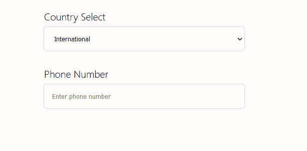

# 反应-电话号码-输入:检测国际位置-日志火箭博客

> 原文：<https://blog.logrocket.com/detecting-location-react-phone-number-input/>

众所周知，处理电话号码的表单输入很麻烦。如果您的受众是国际人士，您的电话号码输入字段必须能够处理不同国家的呼叫代码。为了准确起见，最佳实践还要求添加屏蔽，它会自动将电话号码格式化为特定于其呼叫所在国家的布局。

在本文中，我们将学习如何在 React 中使用一个名为 [react-phone-number-input](https://www.npmjs.com/package/react-phone-number-input) 的包来实现上述所有功能。我们还将在浏览器中使用[导航 API](https://developer.mozilla.org/en-US/docs/Web/API/Navigator) 和[谷歌地图 API](https://developers.google.com/maps) 。

为了跟随本教程，您可以在我的 [GitHub 库](https://github.com/conermurphy/react-form-phone-input-tutorial)上访问该项目的源代码。我们开始吧！



react-phone-number-input field example

入门指南

## 首先，我们将建立一个新的 React 项目:

接下来，我们将安装项目所需的包，包括 react-phone-number-input。我们还将安装样式组件来添加样式，但是这是可选的:

```
npx create-react-app

```

安装了 React 和我们需要的包之后，接下来，我们将从 Google 获得一个免费的 API 密匙，允许我们在项目的后期使用 Google Maps API。前往[入门](https://developers.google.com/maps)页面；谷歌为谷歌地图 API 提供了每月 200 美元[的信用额度](https://developers.google.com/maps/billing-credits#monthly)，所以你将能够跟随这个教程而无需花费任何东西。

```
npm install --save styled-components
npm i react-phone-number-input

```

创建和设计我们的表单

## 现在，让我们定义我们的形式。我们将创建一个带有输入字段、选择按钮和一些标签的基本表单。下面是添加样式之前的基本表单代码:

让我们使用[样式化组件](https://styled-components.com/)来创建两个组件，`StyledPage`用于容器，`StyledForm`用于表单:

```
<div>
  <form>
    <div>
      <label htmlFor="countrySelect">Country Select</label>
      <select name="countrySelect"/>
    </div>
    <div>
      <label htmlFor="phoneNumber">Phone Number</label>
      <input placeholder="Enter phone number" name="phoneNumber" />
    </div>
  </form>
</div>

```

现在，我们将分别为这两个组件添加样式:

```
&lt;StyledPage>
  <StyledForm>
    <div>
      <label htmlFor="countrySelect">Country Select</label>
      <select name="countrySelect"/>
    </div>
    <div>
      <label htmlFor="phoneNumber">Phone Number</label>
      <input placeholder="Enter phone number" name="phoneNumber" />
    </div>
  <StyledForm>
<StyledPage>

```

在上面的代码块中，我们添加了几个 Flexbox 容器来使表单在页面上居中，并且我们包含了一些视觉样式元素。现在，让我们添加自定义输入。

```
const StyledPage = styled.div`
  display: flex;
  flex-direction: column;
  align-items: center;
  justify-content: center;
  gap: 2rem;
  height: 100vh;
  background-color: hsl(15, 67%, 99%);
  & label,
  p {
    font-size: 20px;
    font-weight: 300;
    margin: 0;
    & > span {
      font-weight: 400;
    }
  }
`;

const StyledForm = styled.form`
  display: flex;
  flex-direction: column;
  gap: 2rem;
  & > div {
    display: flex;
    flex-direction: column;
    gap: 0.5rem;
    width: 400px;
    & > input,
    select {
      padding: 1rem;
      border-radius: 5px;
      border: none;
      box-shadow: 0px 0px 1px hsla(0, 0%, 12%, 0.5);
    }
  }
`;

```

添加自定义表单输入

## 我们将使用 react-phone-number-input 包中的两个自定义输入:`Input`表示电话号码，而`CountrySelect`是一个自定义选择元素，我们将使用包中的两个函数`getCountries`和`getCountryCallingCode`来定义它。

虽然`CountrySelect`组件在包的文档中被[记录，但是它没有被导出，这意味着我们需要自己定义它。首先，让我们导入上面提到的元素和函数:](https://catamphetamine.gitlab.io/react-phone-number-input/#without-country-select)

在上面的代码块中，我们还导入了一个 locale 文件，该文件将`callingCodes`转换成英文的国家名称。此外，我们根据包的要求导入了一些 CSS 样式。现在，我们可以如下定义我们的`CountrySelect`组件:

```
import Input, { getCountries, getCountryCallingCode } from 'react-phone-number-input/input';
import en from 'react-phone-number-input/locale/en.json';
import 'react-phone-number-input/style.css';

```

接下来，我们可以用包中的新定制输入来切换出我们之前作为占位符创建的表单元素:

```
const CountrySelect = ({ value, onChange, labels, ...rest }) => (
  <select {...rest} value={value} onChange={(event) => onChange(event.target.value || undefined)}>
    <option value="">{labels.ZZ}</option>
    {getCountries().map((country) => (
      <option key={country} value={country}>
        {labels[country]} +{getCountryCallingCode(country)}
      </option>
    ))}
  </select>
);

```

您可能会注意到,`labels`属性控制着其中显示的标签，它被传递给了`CountrySelect`组件。为了生成下拉列表的值，我们将之前从本地文件导入的国家代码传递给`labels`属性。

```
<StyledPage>
  <StyledForm>
    <div>
      <label htmlFor="countrySelect">Country Select</label>
      <CountrySelect labels={en} name="countrySelect" />
    </div>
    <div>
      <label htmlFor="phoneNumber">Phone Number</label>
      <Input placeholder="Enter phone number" name="phoneNumber" />
    </div>
  </StyledForm>
</StyledPage>

```

现在，我们几乎已经为手工使用设置好了表单。最后，我们需要向组件添加状态，以便我们可以操作显示在`select`和`input`元素中的值。

让我们从将`useState`钩子导入我们的组件开始:

接下来，我们将在组件中创建两个状态，一个用于`input`元素，另一个用于`select`元素:

```
import React, { useState } from 'react';

```

最后，我们将通过将值作为道具传递给元素来将状态连接到元素:

```
const [phoneNumber, setPhoneNumber] = useState();
const [country, setCountry] = useState();

```

我们传递给`Input`组件的`country`属性控制通过国家呼叫代码提供的电话号码的格式和屏蔽。我们将在稍后应用用户位置时使用它。

```
<StyledPage>
  <StyledForm>
    <div>
      <label htmlFor="countrySelect">Country Select</label>
      <CountrySelect labels={en} value={country} onChange={setCountry} name="countrySelect" />
    </div>
    <div>
      <label htmlFor="phoneNumber">Phone Number</label>
      <Input country={country} value={phoneNumber} onChange={setPhoneNumber} placeholder="Enter phone number" name="phoneNumber" />
    </div>
  </StyledForm>
</StyledPage>

```

现在，我们有了一个全功能的手动表单。让我们看看如何自动检测用户的纬度和经度，然后使用 [Google Maps 地理编码 API](https://developers.google.com/maps/documentation/geocoding/overview) 将坐标转换为国家。

获取用户的经度和纬度

## 为了获得用户的经度和纬度，我们将使用浏览器的[导航 API](https://developer.mozilla.org/en-US/docs/Web/API/Navigator) 。更具体地说，我们将使用`navigator.geolocation.getCurrentPosition`方法，该方法将返回关于用户当前位置的数据，我们可以从中提取经度和纬度数据。

我将在应用程序的初始负载上运行检测。或者，您可以将检测运行与按钮按下挂钩，这样用户就不会在页面加载时立即得到提示。

为了确保每次页面加载只运行一次请求，我们将使用`useEffect`钩子。让我们将它导入到我们的项目中:

在我们的函数组件内部，我们可以添加我们的`useEffect`钩子并传递一个空数组作为依赖数组。在应用程序的初始渲染中,`useEffect`钩子只运行一次:

```
import React, { useEffect, useState } from 'react';

```

现在，让我们添加导航器 API 来检测用户的位置:

```
useEffect(() => {
    // Insert our code here 
}, []);

```

当导航器在页面的初始呈现上运行时，将提示用户允许访问他们的位置。根据他们的决定，将调用两个回调函数中的一个，或者批准，或者拒绝。

```
useEffect(() => {
    navigator.geolocation.getCurrentPosition(success, rejected);
}, []);

```

在本教程中，我们不会关注错误处理。相反，如果权限被拒绝，我们将把它记录到控制台。对于成功回调，让我们定义一个单独的函数来调用:

当定位请求被批准后，我们将调用`handleNavigator`函数，该函数提供对用户位置数据的访问，允许我们重构他们当前位置的经度和纬度数据。然后，我们将使用[地理编码 API 请求和响应](https://developers.google.com/maps/documentation/geocoding/overview)来查找国家。

```
async function handleNavigator(pos) {
  const { latitude, longitude } = pos.coords;
}

useEffect(() => {
  navigator.geolocation.getCurrentPosition(handleNavigator, () => console.warn('permission was rejected'));
}, []);

```

对国家的纬度和经度进行地理编码

## 为了从 API 获取数据，让我们在`src`目录下的`utils`目录中创建一个名为`lookupCountry.js`的新函数。`lookupCountry.js`将处理所有的数据获取和处理，返回一个国家代码给`handleNavigator`，我们最初的回调函数。

在新的`lookupCountry.js`文件中，让我们定义一个同名的新异步函数，然后将其导出:

我们还将定义我们的参数，这将包括一个包含纬度和经度的对象，我们将在调用该函数时传递该对象。

```
async function lookupCountry({ latitude, longitude }) {
}
export default lookupCountry;

```

接下来，我们需要定义将执行获取请求的 URL。在定义 URL 时，我们还需要添加经度和纬度数据以及之前获得的 API 键。

最简单的方法是使用 JavaScript 的模板文字将变量插入字符串:

注意:我已经通过一个环境变量添加了我的 API 键，这是推荐的。但是，如果您正在本地使用该项目，并且不打算发布它，您可以在中硬编码您的 API 键。

```
async function lookupCountry({ latitude, longitude }) {
  const URL = `https://maps.googleapis.com/maps/api/geocode/json?latlng=${latitude},${longitude}&key=${process.env.REACT_APP_GOOGLE_MAPS_API_KEY}`;

}
export default lookupCountry;
```

> 现在，我们将使用浏览器的内置获取 API 从 API 获取数据:

我们等待数据从 API 返回，然后将响应转换成 JSON，再存储到变量中。

```
async function lookupCountry({ latitude, longitude }) {
  const URL = `https://maps.googleapis.com/maps/api/geocode/json?latlng=${latitude},${longitude}&key=${process.env.REACT_APP_GOOGLE_MAPS_API_KEY}`;

  const locationData = await fetch(URL).then((res) => res.json());

}
export default lookupCountry;

```

API 将从我们提供的经度和纬度数据中返回不同层次的细节，包括从街道地址到用户所在国家的所有信息，这是我们感兴趣的。

幸运的是，Google 已经为我们格式化并分类了返回的数组。数组中的第一项是最精确的(街道地址)，最后一项是最通用的(国家)。

每个项目还包括数据类型，如街道地址、城镇、国家等。，通过筛选到类型`country`，我们可以轻松找到感兴趣的商品:

过滤完数组后，我们将执行数组析构，因为`.filter`方法返回一个数组给我们。接下来，我们将做一个对象析构，这样我们就可以访问我们感兴趣的属性，`address_components`。下面是`address_components`内部的数据示例:

```
async function lookupCountry({ latitude, longitude }) {
  const URL = `https://maps.googleapis.com/maps/api/geocode/json?latlng=${latitude},${longitude}&key=${process.env.REACT_APP_GOOGLE_MAPS_API_KEY}`;

  const locationData = await fetch(URL).then((res) => res.json());

  const [{ address_components }] = locationData.results.filter(({ types }) => types.includes('country'));
}
export default lookupCountry;

```

我们对获取用户的国家代码感兴趣，所以我们需要从对象中析构出`short_name`变量:

```
[
  {
    "long_name": "United Kingdom",
    "short_name": "GB",
    "types": [
      "country",
      "political"
    ]
  }
]

```

一旦我们从对象中析构出国家代码，我们就可以将它从我们的函数返回到前面的原始回调函数`handleNavigator`:

```
async function lookupCountry({ latitude, longitude }) {
  const URL = `https://maps.googleapis.com/maps/api/geocode/json?latlng=${latitude},${longitude}&key=${process.env.REACT_APP_GOOGLE_MAPS_API_KEY}`;

  const locationData = await fetch(URL).then((res) => res.json());

  const [{ address_components }] = locationData.results.filter(({ types }) => types.includes('country'));

  const [{ short_name}] = address_components;
}
export default lookupCountry;

```

把所有东西放在一起

```
async function lookupCountry({ latitude, longitude }) {
  const URL = `https://maps.googleapis.com/maps/api/geocode/json?latlng=${latitude},${longitude}&key=${process.env.REACT_APP_GOOGLE_MAPS_API_KEY}`;

  const locationData = await fetch(URL).then((res) => res.json());

  const [{ address_components }] = locationData.results.filter(({ types }) => types.includes('country'));

  const [{ short_name}] = address_components;

  return short_name;
}
export default lookupCountry;

```

## 让我们将`lookupCountry`函数添加到前面的`handleNavigator`回调函数中，并将其连接到表单的其余部分:

现在，如果用户授予应用程序初始页面加载的权限，我们就可以从 Navigator API 获得纬度和经度数据。然后，数据被传递到我们的`lookupCountry`函数，该函数又使用 Google 的地理编码 API 将纬度和经度转换为国家代码，然后返回给我们。

```
async function handleNavigator(pos) {
  const { latitude, longitude } = pos.coords;

  const userCountryCode = await lookupCountry({ latitude, longitude });
}

```

最后，我们只需要覆盖`country`的状态，它控制在`select`元素中显示的值和输入组件的格式，用户将在其中键入他们的电话号码:

现在，一切都联系在一起了。当用户加载页面时，系统会提示他们允许应用程序访问他们的位置。如果他们给予许可，应用程序将检测他们的位置，查找正确的国家代码，然后将其应用于显示器上的表单输入。

```
async function handleNavigator(pos) {
  const { latitude, longitude } = pos.coords;

  const userCountryCode = await lookupCountry({ latitude, longitude });
  setCountry(userCountryCode);
}

```

结论

## 当我试图在一个全球通用的表单上输入电话号码时，我有了这个主题的想法。我很快意识到处理全球电话号码的所有需求是多么困难，尤其是当仍然试图提供一个好的 UX 时。

react-phone-number-input 大大简化了在您的表单中收集全球电话号码的过程。我希望这篇教程对你有所帮助；如果你有，请查看我的推特。

[LogRocket](https://lp.logrocket.com/blg/react-signup-general) :全面了解您的生产 React 应用

## 调试 React 应用程序可能很困难，尤其是当用户遇到难以重现的问题时。如果您对监视和跟踪 Redux 状态、自动显示 JavaScript 错误以及跟踪缓慢的网络请求和组件加载时间感兴趣，

.

[try LogRocket](https://lp.logrocket.com/blg/react-signup-general)

LogRocket 结合了会话回放、产品分析和错误跟踪，使软件团队能够创建理想的 web 和移动产品体验。这对你来说意味着什么？

[ ](https://lp.logrocket.com/blg/react-signup-general) [](https://lp.logrocket.com/blg/react-signup-general) 

LogRocket 不是猜测错误发生的原因，也不是要求用户提供截图和日志转储，而是让您回放问题，就像它们发生在您自己的浏览器中一样，以快速了解哪里出错了。

不再有嘈杂的警报。智能错误跟踪允许您对问题进行分类，然后从中学习。获得有影响的用户问题的通知，而不是误报。警报越少，有用的信号越多。

LogRocket Redux 中间件包为您的用户会话增加了一层额外的可见性。LogRocket 记录 Redux 存储中的所有操作和状态。

现代化您调试 React 应用的方式— [开始免费监控](https://lp.logrocket.com/blg/react-signup-general)。

Modernize how you debug your React apps — [start monitoring for free](https://lp.logrocket.com/blg/react-signup-general).