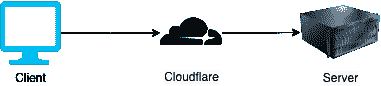
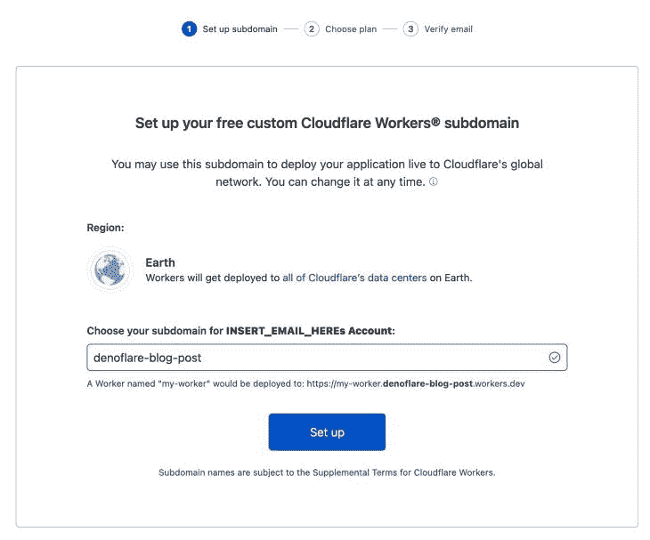
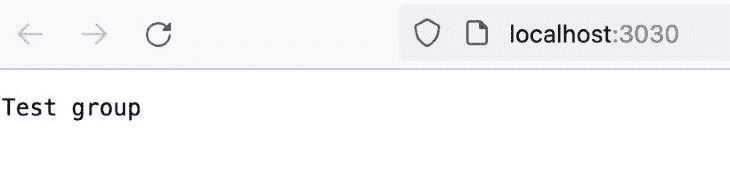
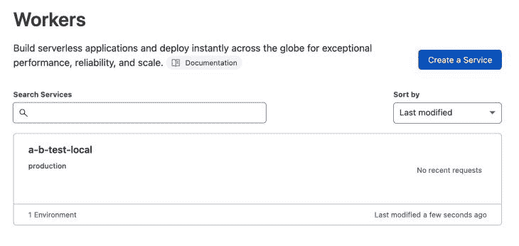
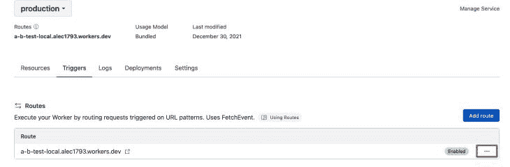
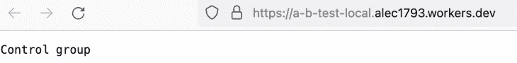

# 使用 Denoflare 开发、测试和部署 Cloudflare 工作人员

> 原文：<https://blog.logrocket.com/develop-test-deploy-cloudflare-workers-denoflare/>

在我职业生涯的大部分时间都在使用 Node.js 之后，我很感兴趣地听到了它的对等物 Deno。 [Deno](https://deno.land/) 是服务器端 JavaScript 的一个不同版本。Deno 的设计[是为了纠正 Node.js](https://www.youtube.com/watch?v=M3BM9TB-8yA) 的错误，并创建一个默认安全的运行时。

## 什么是德诺？

Deno 结合了一些其他方面，比如内置的 TypeScript 编译器、linter、格式化程序和包管理器。它还支持 [ESM 模块](https://blog.logrocket.com/how-to-use-ecmascript-modules-with-node-js/)，使用网络平台作为其标准库的基础，并围绕 IO 进行默认安全设计。

与 Node.js 相比，这极大地简化了开发体验。我开始使用 Deno 作为我需要编写的 CLI 工具(使用 [deno-cliffy](https://github.com/c4spar/deno-cliffy) ),并对这种体验感到满意。当我第一次听说 [Denoflare](https://denoflare.dev/) 的时候，我认为这将是一个理想的机会来试验 [Cloudflare 工人](https://workers.cloudflare.com/)，同时获得更多关于 Deno 的经验。

## 对 Cloudflare Workers 使用 Deno

与 AWS Lambda 等服务相比，Cloudflare Workers 是无服务器基础架构的替代方案。在其核心，它像一个无服务器的功能，接受请求信息，应用逻辑，并发送响应。

预期的用例是不同的，因为它意味着充当中间件，拦截发送到原始服务器的请求，并应用逻辑。Cloudflare 的行为类似于[浏览器服务工作者](https://developers.google.com/web/fundamentals/primers/service-workers/)。



Cloudflare Workers 没有充满正在旋转的隔离容器，提供了零冷启动的好处。Cloudflare Workers 的其他一些不错的功能是全球 CDN 部署和按请求付费。

## 什么是 Denoflare？

Denoflare 是一个小框架，允许您发布用 Deno 编写的 Cloudflare Workers。这是一个天然的组合，因为 Deno 和 Cloudflare 工作人员都遵循标准化的 web 平台运行时 API。

Denoflare 允许您在本地为您的工作人员提供服务，以在隔离的环境中测试您的更改，这与 Cloudflare 运行它们的方式类似。它支持出色的热重装开发人员体验，能够将工作人员权限发布到 Cloudflare 平台，跟踪生产中的日志，等等。

这与使用另一个 worker 框架(如 [Miniflare](https://github.com/cloudflare/miniflare) )有相似的体验，除了它更简单，因为 Deno 正在做大部分工作。例如，不像 Miniflare 那样依赖 Jest，您可以编写测试来运行本机 Deno 测试运行程序。

## 使用 Cloudflare 和 Denoflare

体验 Cloudflare 和 Denoflare 的最佳方式是通过一个真实的示例用例。使用最少的代码，我们将为一个博客设置 [A/B 测试](https://en.wikipedia.org/wiki/A/B_testing)。一半的时间，用户将被放入测试组，并将看到一个新的标题。其他人将被放入控制组，看不到新标题。

使用 Cloudflare Workers，这就像拦截对博客源服务器的请求一样简单，根据我们的划分将用户放入一个组，并用组名设置响应头`Set-Cookie`。完成后，我们的博客可以读取 cookie 来决定显示哪个标题。

> 我们省略了更改博客标题所需的代码，因为有几种不同的方法可以做到这一点。

## 设置您的 Cloudflare Workers 帐户

我们必须做的第一件事[是注册一个 Cloudflare 帐户，由 Cloudflare 工作人员设置](https://dash.cloudflare.com/sign-up/workers)。

完成后，创建一个免费的。开发子域测试我们的工人。我们会选择免费计划。



创造一个自由的。开发测试子域。

> 注意:您可以稍后将其更改为您将在生产中使用的域。

Denoflare 需要一个 API 令牌来允许我们将编译后的 worker 推送到 Cloudflare。转到 Cloudflare 控制面板中的[令牌页面](https://dash.cloudflare.com/profile/api-tokens)，并选择**创建令牌**。一旦出现，你应该选择**编辑 Cloudflare 工人**作为模板。请注意这个标记，以便以后使用。

从概览屏幕中，复制帐户 ID 以备后用。

## 使用 Denoflare 开发

Deno 提供了很棒的开发体验，在使用 Denoflare 的时候我们会原封不动的保留下来。

> [注:你可以在这个 GitHub repo](https://github.com/aleccool213/denoflare-blog-posthttps://github.com/aleccool213/denoflare-blog-post) 里找到所有代码。

首先，设置 Deno 版本，并使用 [asdf](https://asdf-vm.com/) 将其安装在您的本地机器上:

```
echo "deno 1.16.0" > .tool-versions && brew install asdf && asdf plugin add deno && deno install

```

让我们配置我们的 IDE。如果你使用的是 Visual Studio 代码，你会对 Deno 有很好的体验。安装 Deno 扩展，[，可以在这里找到](https://marketplace.visualstudio.com/items?itemName=denoland.vscode-deno)。它支持类型检查、林挺等等。

要启用它，您必须在`.vscode/settings.json`的工作区设置文件中打开它:

```
{
  "deno.enable": true
}

```

接下来，我们将安装 [Velociraptor](https://github.com/jurassiscripts/velociraptor) ，Deno 的脚本管理器。Velociraptor 使所有开发人员在执行常见任务时使用相同的脚本变得很容易(想想 npm 脚本)。

在控制台中运行以下命令:

```
deno install -qAn vr https://deno.land/x/[email protected]/cli.ts

```

我们将定义一个 Velociraptor 脚本来调用 Denoflare CLI，允许我们运行 Denoflare 命令，如`serve`和`push`。

```
{
  "scripts": {
    "denoflare": "deno run --unstable --allow-read --allow-net --allow-env https://raw.githubusercontent.com/skymethod/denoflare/v0.3.3/cli/cli.ts"
  }
}

```

现在我们已经有了 IDE 和环境运行时设置，我们可以继续看代码了。使用 Deno，通常在一个名为`deps.ts`的文件中声明所有的依赖项。这是因为模块是由 URL 定义的，如果分散在一个项目中的任何地方，就会变得难以管理。

我们需要一种类型的 Cloudflare 工作程序，Denoflare 将其定义为:

```
export type { IncomingRequestCf } from "https://raw.githubusercontent.com/skymethod/denoflare/v0.3.0/common/cloudflare_workers_types.d.ts";

```

一旦我们有了这个类型，我们就可以在`index.ts`中编写我们的 A/B 测试器逻辑:

```
import { IncomingRequestCf } from "./deps.ts";

/**
 * Based on the A/B Testing Cloudflare Worker example.
 * Ref: https://developers.cloudflare.com/workers/examples/ab-testing
 */
function fetch(request: IncomingRequestCf): Response {
  const NAME = "experiment-0";

  const TEST_RESPONSE = new Response("Test group");
  const CONTROL_RESPONSE = new Response("Control group");

  // Determine which group this requester is in.
  const cookie = request.headers.get("cookie");
  if (cookie && cookie.includes(`${NAME}=control`)) {
    return CONTROL_RESPONSE;
  } else if (cookie && cookie.includes(`${NAME}=test`)) {
    return TEST_RESPONSE;
  } else {
    // If there is no cookie, this is a new client. Choose a group and set the cookie.
    const group = Math.random() < 0.5 ? "test" : "control"; // 50/50 split
    const response = group === "control" ? CONTROL_RESPONSE : TEST_RESPONSE;
    response.headers.append("Set-Cookie", `${NAME}=${group}; path=/`);

    return response;
  }
}

export default {
  fetch,
};

```

最后一步是声明一个`.denoflare`文件，Denoflare 使用它来运行和发布您的 Cloudflare Worker:

```
{
  "$schema": "https://raw.githubusercontent.com/skymethod/denoflare/v0.3.3/common/config.schema.json",
  "scripts": {
    "a-b-test-local": {
      "path": "index.ts",
      "localPort": 3030
    }
  },
  "profiles": {
    "account1": {
      "accountId": "INSERT_ACCOUNT_ID_FROM_PREVIOUS_STEP",
      "apiToken": "INSERT_API_TOKEN_FROM_PREVIOUS_STEP"
    }
  }
}

```

就是这样！让我们在本地为 Cloudflare 工作人员提供服务，以确保一切正常运行:

```
vr denoflare serve a-b-test-local

```

输出应该是这样的:

```
Compiling https://raw.githubusercontent.com/skymethod/denoflare/v0.3.3/cli-webworker/worker.ts into worker contents...
Compiled https://raw.githubusercontent.com/skymethod/denoflare/v0.3.3/cli-webworker/worker.ts into worker contents in 277ms
runScript: index.ts
Compiled index.ts into module contents in 142ms
worker: start
Started in 456ms (isolation=isolate)
Local server running on http://localhost:3030

```

现在，打开浏览器，进入`localhost:3030`。您将看到该响应是用户所在的组:



## 测试应用程序

因为 Cloudflare Workers 是一个 Deno 应用程序，所以我们可以使用它的工具来验证和测试我们的代码。由于您安装了扩展，所有这些都会在您使用 Visual Studio 代码进行开发时自动运行。

用以下代码运行 Deno linter:

```
deno lint

```

确保 Deno 应用程序通过以下方式编译:

```
deno compile index.ts

```

编写一些测试，并使用以下代码运行它们:

```
deno test index.test.ts

```

## 部署 Cloudflare 工作人员

一旦您在 Denoflare 配置(`.denoflare`)中有了正确的帐户 ID 和令牌，部署 Cloudflare Workers 应该没有问题。

默认情况下，Denoflare 会将您的工作线程推送到。开发子域你已经为你的帐户设置。

通过运行以下命令将其部署到 Cloudflare 实例:

```
vr denoflare push a-b-test-local

```

您应该会看到该员工立即出现在您的员工仪表板上。



默认情况下，其公共访问是禁用的。进入**服务详情**页面并启用路线。



当您执行这条路线时，您应该会看到一个响应，显示这个请求被放入了哪个组。



## 结论

Denoflare 是一个围绕 Deno 构建的简单迷你框架，允许我们轻松发布 Cloudflare Workers。

由于它实现 web 标准 API 的方式以及在安全模型中与 Cloudflare Workers 的相似性，Deno 是一个自然的选择。Cloudflare Workers 是一种强大的方式，可以将中间件逻辑部署到云上，靠近用户使用您的应用程序的地方，因为他们的 edge CDN 策略在全球范围内部署工作人员。

[看看 Cloudflare 团队收集的其他示例](https://developers.cloudflare.com/workers/examples),这样你就能更好地了解它的其他用途。