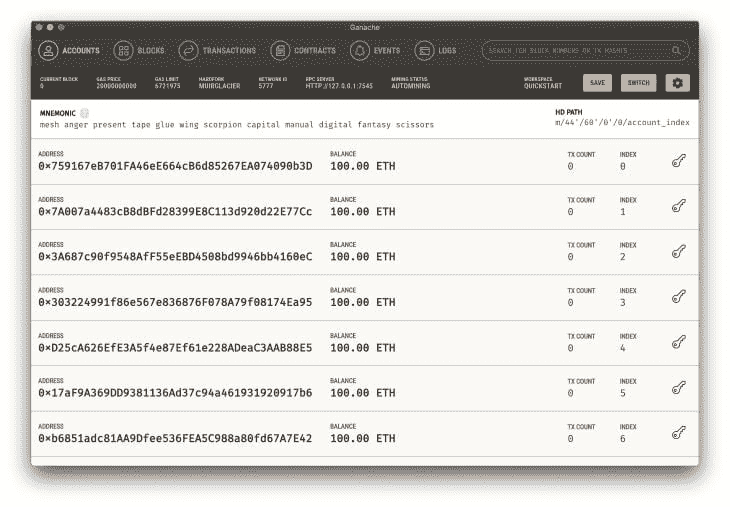

# 如何使用 Ganache 开发、测试和部署智能合约

> 原文：<https://blog.logrocket.com/develop-test-deploy-smart-contracts-ganache/>

开发、测试和部署智能合约是区块链开发人员的一项重要工作，本教程将向您展示如何开始使用智能合约。

在我们开始之前，理解加密和区块链的基本概念是很重要的。如果你不熟悉 crypto，我推荐你看这个简短的视频。

## 什么是智能合同？

智能合约是存储在区块链上的不可变程序。它们根据满足的预定条件自动执行交易，并广泛用于以分散的方式执行协议，无需中间人。

智能契约具有特定的结果，这些结果由不可变的代码控制，因此契约的参与者可以对契约的执行充满信心。没有第三方的参与，没有时间损失—当条件满足时，立即执行协议。

智能合约可以部署在区块链上使用。以太坊支持用 [Solidity 编程语言](https://docs.soliditylang.org/en/v0.8.9/)编写的智能合约。

## 先决条件

本教程使用 JavaScript 和 Solidity 在以太坊区块链上开发、测试和部署智能合约。

所以，你需要 JavaScript、Node.js 和 Solidity 的基础知识。

可靠性类似于 JavaScript，所以概念相当容易理解。

## 设置项目

本教程将会非常简单。[查看这个 GitHub repo](https://github.com/KumarAbhirup/truffle-tutorial) 来看看本教程中的代码。

我们将使用这些工具来开发和测试智能合同:

### 初始化松露

Truffle 为您提供了开发和测试智能合约的所有必要工具。你可以用`truffle init`初始化一个 Truffle 项目。

```
$ truffle init

✔ Preparing to download
✔ Downloading
✔ Cleaning up temporary files
✔ Setting up box

Unbox successful. Sweet!

Commands:

  Compile:        truffle compile
  Migrate:        truffle migrate
  Test contracts: truffle test

$ ~

```

这将创建一个新的项目，包含三个文件夹(`/contracts`、`/migrations`和`/tests`)和一个配置文件`truffle-config.js`。

### 创建 Ganache 以太坊区块链实例

下载完 Ganache 之后，快速启动一个区块链实例。您应该会看到这样的屏幕:



检查 **RPC 服务器**配置中的端口。，一般是`7545`。现在，在`truffle-config.js`中进行以下更改，并填写正确的端口号:

```
module.exports = {
  networks: {
    development: {
     host: "127.0.0.1",     // Localhost (default: none)
     port: 7545,            // Standard Ethereum port (default: none)
     network_id: "*"        // Any network (default: none)
    }
  }
}

```

现在，运行`truffle migrate`。如果它没有抛出任何错误，您就可以开始了。

### 撰写智能合同

合同将存储在`/contracts`文件夹下。你会发现这里已经有`migrations.sol`了。

在目录中创建一个名为`TruffleTutorial.sol`的新文件:

```
pragma solidity >=0.4.22 <0.9.0;

contract TruffleTutorial {
  address public owner = msg.sender;
  string public message;

  // this function runs when the contract is deployed
  constructor() public {
    // set initial message
    message = "Hello World!";
  }

  modifier ownerOnly() {
    require(
      msg.sender == owner,
      "This function is restricted to the contract's owner"
    );
    _;
  }

  // function that only contract owner can run, to set a new message
  function setMessage(string memory _message) 
    public 
    ownerOnly 
    returns(string memory) 
  {
    // message must not be empty
    require(bytes(_message).length > 0);

    // set new message
    message = _message;
    return message;
  }
}

```

请注意，这是名为`TruffleTutorial`的智能契约。您可以检查代码中的注释，以了解每个函数和代码行的作用，但我将在这里解释要点。

此智能合约存储一条消息，并且只允许智能合约的所有者更改此消息。该合同还允许区块链上的每个人都能阅读这条消息。当第一次部署协定时，智能协定中存储在区块链上的消息将是“Hello World！”。

> 你也可以在 remix.ethereum.org 上快速测试智能合约。

### 将智能合约部署到 Ganache 以太坊本地测试网络

现在，让我们将这个智能契约部署到由 Ganache 本地测试网络启动的区块链实例。

如果您以前使用过 MySQL 或 Postgres 之类的数据库，我假设您熟悉迁移。

在`/migrations`文件夹中，您将看到初始迁移。您必须为这个新的智能合约创建一个新的迁移文件。

创建`2_TruffleTutorial_migration.js`。

```
// Help Truffle find `TruffleTutorial.sol` in the `/contracts` directory
const TruffleTutorial = artifacts.require("TruffleTutorial");

module.exports = function(deployer) {
  // Command Truffle to deploy the Smart Contract
  deployer.deploy(TruffleTutorial);
};

```

您可能想知道`artifacts`和`deployer`函数是什么。它们由松露照顾。当您运行`truffle migrate`时，它会查看`/migrations`目录，并将所有链接的智能合同部署到区块链，就像迁移文件告诉它们的那样。

* * *

### 更多来自 LogRocket 的精彩文章:

* * *

当您用这段代码创建文件时，只需运行`truffle migrate` `--reset`，这将把智能合同部署到本地测试网络。它还将构建以太坊虚拟机能够理解的 ABI 和字节码文件。

### 与部署的智能合约交互

现在你的智能合约在区块链上，你如何与之互动？如何检索消息，如何设置消息？松露控制台让我们做到了这一点。

> 更容易与智能合同交互的 GUI 方法是通过[https://remix.ethereum.org/](https://remix.ethereum.org/)。

在终端中，代码`truffle console`，它启动一个控制台，使您能够与智能合约进行交互。

```
$ truffle console
truffle(development)> const truffleTutorial = await TruffleTutorial.deployed()
truffle(development)> const address = await truffleTutorial.address
truffle(development)> address
'0x46C00D73bF785000B3c3F93569E84415AB2381f2'

```

尝试所有这些线路，看看你是否得到地址。如果您这样做了，智能协定就成功部署了，并且您的项目可以与它对话。

现在尝试将消息存储在智能合约中:

```
truffle(development)> const message = await truffleTutorial.message()
truffle(development)> message
'Hello World!'

```

您现在可以读取存储在智能合约上的值了！

让我们尝试设置一条新消息。

```
truffle(development)> await truffleTutorial.setMessage('Hi there!')
truffle(development)> await truffleTutorial.message()
'Hi there!'

```

就这样，你做到了！智能合同有效！

不过，我们手动测试了这个。理想情况下，您会希望设置自动测试来检查所有这些是否都完美地工作。

### 测试智能合约

您将在`/test`文件夹中编写测试。在那里创建一个名为`TruffleTutorial.js`的新文件。

```
const { assert } = require("chai")

const TruffleTutorial = artifacts.require("./TruffleTutorial.sol")

require("chai")
  .use(require("chai-as-promised"))
  .should()

contract('TruffleTutorial', ([contractOwner, secondAddress, thirdAddress]) => {
  let truffleTutorial

  // this would attach the deployed smart contract and its methods 
  // to the `truffleTutorial` variable before all other tests are run
  before(async () => {
    truffleTutorial = await TruffleTutorial.deployed()
  })

  // check if deployment goes smooth
  describe('deployment', () => {
    // check if the smart contract is deployed 
    // by checking the address of the smart contract
    it('deploys successfully', async () => {
      const address = await truffleTutorial.address

      assert.notEqual(address, '')
      assert.notEqual(address, undefined)
      assert.notEqual(address, null)
      assert.notEqual(address, 0x0)
    })

    // check if the message is stored on deployment as expected
    it('has a message', async () => {
      const message = await truffleTutorial.message()
      assert.equal(message, 'Hello World!')
    })
  })

  describe('message', () => {
    // check if owner can set new message, check if setMessage works
    it('contract owner sets a message', async () => {
      // set new message
      await truffleTutorial.setMessage('Hi there!', { from: contractOwner }) 
      // `from` helps us identify by any address in the test

      // check new message
      const message = await truffleTutorial.message()
      assert.equal(message, 'Hi there!')
    })

    // make sure only owner can setMessage and no one else
    it('address that is not the owner fails to set a message', async () => {
      await truffleTutorial.setMessage('Hi there!', { from: secondAddress })
        .should.be.rejected
      // this tells Chai that the test should pass if the setMessage function fails.

      await truffleTutorial.setMessage('Hi there!', { from: thirdAddress })
        .should.be.rejected
    })
  })
})

```

这里，我们使用 [Chai](https://www.chaijs.com/) 测试框架来断言值，并查看它们是否成立。如果您看到代码，您将意识到它与您在 Truffle 控制台中尝试的类似，只是这次您将这些代码行与 Chai 测试框架配对。

> 接受两个参数，如果匹配，测试通过，否则测试失败。

现在，运行`truffle test`。您应该看到所有测试都通过了:

```
$ truffle test
Using network 'development'.

  Contract: TruffleTutorial
    deployment
      ✓ deploys successfully
      ✓ has a message (236ms)
    message
      ✓ contract owner sets a message (165ms)
      ✓ address that is not the owner fails to set a message (250ms)

  4 passing (735ms)

```

现在，您已经使用 Truffle 和 Ganache 开发、测试和部署了智能契约。

### 额外收获:将智能合同部署到以太坊主网

> 注意，在以太坊主网上部署将需要你支付一些油费。此外，每次你在区块链上写东西(例如，当执行`setMessage`函数时)，它会花费你汽油费，但是阅读智能合同仍然是免费的。

首先，安装[元掩码](https://metamask.io/)浏览器扩展。现在，参观 https://remix.ethereum.org 的。

在这里，创建或编辑现有项目——在`/contracts`文件夹中创建`TruffleTutorial.sol`,并将所有智能合同代码粘贴到那里。

在侧边栏中，您应该看到一个选项来切换侧边栏中的 **SOLIDITY 编译器**窗格。单击它并编译 solidity 智能合同代码。它应该创建 ABI 和字节码文件。

编译完成后，从侧边栏打开**部署&运行事务**窗格。您可以尝试在 Remix 以太坊测试 JavaScript VM 网络上部署智能合约。您也可以在同一个面板中使用混音工具本身进行手动测试。

现在是时候部署到 Mainnet 了。首先，确保你的 Metamask 钱包里有一些以太币余额，这样你就可以支付汽油费了。我通常在我的 coinbase 钱包里放大约 50 美元的$ETH，然后将$ETH 转移到 Metamask 钱包。

在**部署&运行事务**窗格中，设置`JavaScript VM`到`Injected Web3`的“环境”。当你这样做时，你将把你的元掩码钱包连接到主网。最后点击**部署**。你必须与 Metamask 签署一项交易，但一旦完成，你的`TruffleTutorial`智能合同将被部署！

> 确保在部署智能合约后检查智能合约地址，以便其他客户端可以使用该地址与您的智能合约进行对话。

## 结论

Web3 正在蓬勃发展，这个空间是新的和令人兴奋的。智能合约是大多数 Dapps(去中心化应用程序)的后端，如果你想成为一名区块链开发者，学习如何开发、测试和部署它们将是有用的。

## 加入像 Bitso 和 Coinsquare 这样的组织，他们使用 LogRocket 主动监控他们的 Web3 应用

影响用户在您的应用中激活和交易的能力的客户端问题会极大地影响您的底线。如果您对监控 UX 问题、自动显示 JavaScript 错误、跟踪缓慢的网络请求和组件加载时间感兴趣，

[try LogRocket](https://lp.logrocket.com/blg/web3-signup)

.

[](https://lp.logrocket.com/blg/web3-signup)[https://logrocket.com/signup/](https://lp.logrocket.com/blg/web3-signup)

LogRocket 就像是网络和移动应用的 DVR，记录你的网络应用或网站上发生的一切。您可以汇总和报告关键的前端性能指标，重放用户会话和应用程序状态，记录网络请求，并自动显示所有错误，而不是猜测问题发生的原因。

现代化您调试 web 和移动应用的方式— [开始免费监控](https://lp.logrocket.com/blg/web3-signup)。