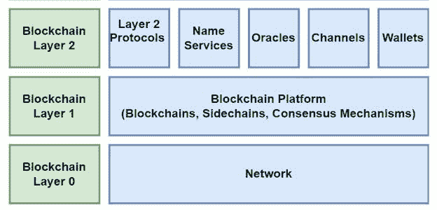

# 开发人员介绍 OptionRoom 

> 原文：<https://blog.logrocket.com/developers-intro-optionroom/>

OptionRoom 是一个由用户管理的 oracle 和 forecast 协议，使用户能够进行交易、预测事件的结果以及在区块链上行使投票权。该协议的各种功能使其适用于多种用例，如预测市场、分散式投票、争议解决、分散式调查和管理列表。

本文将探讨 OptionRoom 的架构及其最独特的特性:oracle 即服务(OaaS)和预测协议。我们还将讨论一个潜在的未来功能，并回顾如何获得 OptionRoom 令牌。

## 可选房间协议架构

假设区块链分为三层协议，如下图所示。第 0 层是网络(比如 Polkadot)；第一层由平台组成(区块链、侧链和共识机制，如 OptionRoom、以太坊、Solana 和 algrand)；第二层由第二层协议、名称服务、oracles、通道和钱包组成。

使用此模型，OptionRoom 是一个构建在 Polkadot(第 0 层)上的第 1 层协议，具有双令牌(第 2 层)。

## 独特的功能

OptionRoom 提供了一个分散的区块链协议，oracle 请求由用户解决。OptionRoom 协议创建了一个系统，用于增加区块链上的对等互动，同时提供投票权和奖励用户参与。

它提供了一个预测协议，可以帮助用户实时预测实际事件的结果，如游戏、足球比赛和政治事件。例如，在 2020 年美国总统选举中，为每个候选人提供了二元选择。那些准确预测选举获胜者的人得到了回报，而那些没有预测到的人损失了他们的投资。

以下是 OptionRoom 的一些功能:

*   **用户管理的 OaaS** :用户可以在区块链上创建 oracle 请求，其他用户将因解决这些请求而获得奖励
*   **用户管理的预测市场协议**:用户可以创建并参与与现实世界事件相关联的事件衍生产品
*   **双代币模式**:用户有机会购买、下注并获得房间公用代币，以及下注并获得法院治理代币
*   **治理赌注和真实性分数**:用户可以用法庭代币来换取更高的真实性分数。真实性分数有助于验证区块链交易；诚实的用户被奖励房间代币，而不诚实的用户得到降低的真实性分数
*   **LP 挖矿**:朝廷治理令牌买不到；它只能通过下注房间公用设施代币来获得，从而提供流动性
*   **自我可持续和基于社区的** : OptionRoom 的费用导致回购机制，但协议的所有者不收取协议费用的百分比。投票是验证市场和交易的集体努力
*   **用户奖励**:用户有机会通过解决 Oracle 请求和创建池来赢取房间代币
*   **奖励缓冲池**:为了防止通货膨胀，协议产生的任何超额费用都被发送到缓冲池，在那里它们被用作协议奖励

到目前为止，该协议最独特的功能是它能够为区块链用户提供类似人类的见解。这一特性源自 OaaS 和预测协议。让我们仔细看看这两者。

### Oracle 即服务

Oracle 是一个值得信赖的第三方数据源，它将链外数据转化为链内数据。Oracle 服务为每个请求提供定性和定量的解决方案，并帮助平衡现实世界市场和加密货币市场之间的不平等。Oracle 服务使用户能够对无限数量的市场进行投机，引入了一种更加人性化的市场活动方法。

OaaS 还向区块链智能合同系统提供外部数据。OptionRoom 允许用户通过使用房间代币付款在 oracle 上提出请求。这些代币将作为奖励给予那些解决请求的人。

oracle 请求创建者以投票参与者的最小数量、投票的最小数量和百分比投票阈值的形式设置置信度阈值。拥有最高法院和投票权的治理参与者参与尝试解决这些请求。赢得选票的人将根据他们的投票权重获得奖励。那些失去选票的人被征收一定比例的赌注，他们的真实性得分被重置。

Oracle 为区块链智能合同提供可靠的外部数据。OptionRoom 使用户能够通过使用房间令牌支付请求费用来发出 oracle 请求。

### 预测协议

forecast 协议使 OptionRoom 用户能够通过支付合同部署费在 Polkadot 上创建智能合同。付费后，用户可以通过拥有预测现实世界事件的智能合约的份额来参与该协议。

预测协议要求用户为每个答案输入一个字符串选项(“是”或“否”)。用户还输入市场到期日(市场竞价将到期且竞价将停止的时间段)和锁定定时器(以固定市场或竞价持续的时间段)。

预测协议是这样工作的:

1.  **市场有效性投票**:用户创建市场后，市场有效性投票在当前纪元(如果当前纪元超过 50%)或创建后 12 小时开始。至少 51%的用户必须投票接受市场，否则将被视为无效，池将被丢弃。创建市场的用户不能投票。当市场通过验证投票时，投票参与者将获得房间代币
2.  **市场参与**:市场验证成功后，市场被添加到分散应用的池列表中。给用户一个“是”或“否”的令牌来选择结果。当市场被锁定时，代币可以被转移和交易。获胜的代币可以在以后用于根据给定的计算要求获胜
3.  **市场锁定**:当锁定定时器到期时，活动池被锁定。一旦锁定，用户将不再有机会存入或提取令牌。这个设置是永久的，直到市场稳定下来。如果对市场的贡献不足，市场将被取消。否则，市场进入结算阶段
4.  **市场结算**:在这个阶段，有一个结算投票来决定市场的结果。用户投票决定市场是赢还是输，共识阈值设定为 66%。如果用户认为市场条件在到期前得到满足，他们可以创建市场索赔提案。如果他们认为市场结算投票结果无效，他们还可以创建一个具有纪元窗口的争议提案

### 潜在的未来优势:Oracle 即服务 API

API 简化了网站或应用程序复杂功能的开发。它们还使开发人员能够轻松引入或共享数据，例如使用加密 API 查看实时加密数据。

这样，他们可以帮助网站或应用程序更吸引用户。OptionRoom 目前不在 oracle 服务上提供 APIs 然而，一个可选的 OaaS API 的计划正在进行中。

[OptionRoom 最近与 API3](https://www.google.com/amp/s/www.namecoinnews.com/api3-and-optionroom-announce-partnership/amp/) 合作。该协作旨在通过支持 Airnode 的 API 端点提供对 oracle 服务的访问，并允许轻松跨区块链使用。

API3 和 OptionRoom 还将使用 OptionRoom 作为任何未来基于 Polkadot 的 API3 子 DAO 的争议解决和仲裁平台。这将允许开发人员在 OptionRoom 上跨多个链访问主观数据，并帮助创建新的用例。此外，API3 提供了可信的分散式 API，帮助开发人员执行安全的区块链事务。

OaaS 为开发者提供了几乎无限的可能性。例如，oracle 服务可以为创建分散的混合协议提供基础，从而最大限度地减少加密货币领域的波动性。OaaS 还可以插入外部平台，为协议提供分散的数据源和验证解决方案。

智能合同将提供透明、安全存储的数据，可用于验证和确认市场信息。开发人员将能够使用 OaaS APIs 在应用程序之间安全地传输敏感数据，并监控区块链交易，同时确保市场安全。

* * *

### 更多来自 LogRocket 的精彩文章:

* * *

OaaS 在 OptionRoom 协议上的另一个重要功能是它提供的用户治理:基于是或否字符串和真实性分数的投票。开发者将能够使用 OaaS APIs 来解决基于投票和真实性的争议，以及用于真实性评分监控。

## 如何获得期权室代币

OptionRoom 提供两种类型的代币:房间和法庭。在 Gate.io、Pancake Swap(第二版)、Hotbit、AscendEK (Bitmax)或 Dodo(以太坊)这样的交换平台上购买房间代币，你需要的只是账户注册和一个钱包地址。

法院代币用于行使投票权。新用户需要下注房间代币来获得法庭代币，而老用户可以下注法庭代币来获得甚至更高的投票权。根据代币被下注的天数，法院代币为持有者提供从 0 到 100 的真实性分数。

100 天后分数达到 100，100 分相当于估计的 650，000 个块。法院令牌让持有者可以选择对多个提案进行投票。那些准确预测获胜者的人会得到代币形式的奖励。那些没有准确预测获胜者的人，放弃他们的一半代币，并且将他们的真实性分数重置为零。

可选房间令牌也可以通过协议的奖励系统获得。OptionRoom 将物理时间划分为每个协议运行的时期。纪元通常是一天 6500 个街区，以每个纪元 54794 个房间代币的比率奖励。

当用户创建 oracle 请求时，解决该请求的用户将根据他们的投票权和请求的总投票权重获得象征性奖励。用户可以通过花时间使用预测协议以及针对其他 oracle 请求提供解决方案来获得房间令牌。

## 结论

OptionRoom 营造一种协作氛围，鼓励和奖励那些创造市场、投票或以其他方式参与的用户。还有空投和房间代币的可用奖金，增加开发人员和非开发人员对 OptionRoom 的认识和兴趣。OptionRoom 在不同领域有多种应用:技术、消息、加密货币和金融。

到目前为止，该协议最独特的功能是它能够为区块链用户提供类似人类的见解。OptionRoom 的 oracle 即服务和预测协议功能将链外数据带入链内，对预测和预测分析具有重要意义。

要了解有关 OptionRoom 协议的更多信息，请阅读[公司的最新更新](https://optionroom.medium.com)。

## 加入像 Bitso 和 Coinsquare 这样的组织，他们使用 LogRocket 主动监控他们的 Web3 应用

影响用户在您的应用中激活和交易的能力的客户端问题会极大地影响您的底线。如果您对监控 UX 问题、自动显示 JavaScript 错误、跟踪缓慢的网络请求和组件加载时间感兴趣，

[try LogRocket](https://lp.logrocket.com/blg/web3-signup)

.

[https://logrocket.com/signup/](https://lp.logrocket.com/blg/web3-signup)

LogRocket 就像是网络和移动应用的 DVR，记录你的网络应用或网站上发生的一切。您可以汇总和报告关键的前端性能指标，重放用户会话和应用程序状态，记录网络请求，并自动显示所有错误，而不是猜测问题发生的原因。

现代化您调试 web 和移动应用的方式— [开始免费监控](https://lp.logrocket.com/blg/web3-signup)。