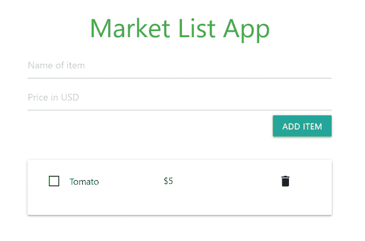
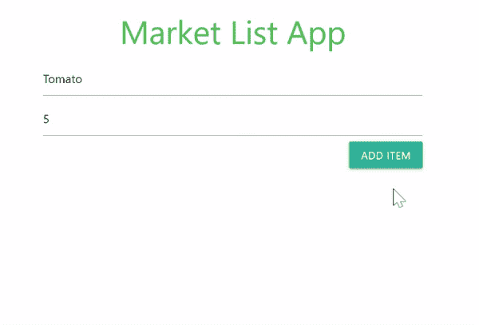

# 在 React 应用中使用 Dexie.js 进行离线数据存储

> 原文：<https://blog.logrocket.com/dexie-js-indexeddb-react-apps-offline-data-storage/>

在现代 web 开发中，离线存储应用程序数据已经成为一种必需。内置浏览器`[localStorage](%22https://blog.logrocket.com/localstorage-javascript-complete-guide/)`可以作为简单和轻量级数据的数据存储，但当涉及到结构化数据或存储大量数据时，它就有所欠缺。

最重要的是，我们只能在`localStorage`中存储字符串数据，这很容易受到 [XSS 攻击](https://owasp.org/www-community/attacks/xss/)，并且它没有提供太多查询数据的功能。

这就是 IndexedDB 大放异彩的地方。使用 IndexedDB，我们可以在浏览器中创建结构化数据库，在这些数据库中存储几乎任何东西，并对我们的数据执行各种类型的查询。

在本文中，我们将了解 IndexedDB 是什么，以及如何使用 dexie . js(indexed db 的极简包装器)来处理 web 应用程序中的离线数据存储。

## IndexedDB 如何工作

IndexedDB 是一个内置的浏览器非关系数据库。它使开发人员能够在浏览器中持久存储数据，即使在离线时也能无缝使用 web 应用程序。使用 IndexedDB 时，您会看到两个常用术语:数据库和对象存储。下面就让我们来探究一下。

### 使用 IndexedDB 创建数据库

IndexedDB 数据库对于每个 web 应用程序都是唯一的。这意味着应用程序只能访问运行在与自己相同的域或子域上的 IndexedDB 数据库中的数据。数据库是存放对象存储的地方，而对象存储又包含存储的数据。要使用 IndexedDB 数据库，我们需要打开(或连接到)它们:

```
const initializeDb = indexedDB.open('name_of_database', version)
```

`indexedDb.open()`方法中的`name_of_database`参数将作为正在创建的数据库的名称，`version`参数是一个代表数据库版本的数字。

在 IndexedDB 中，我们使用对象存储来构建数据库，每当我们想要更新数据库结构时，我们都需要将版本升级到更高的值。这意味着如果我们从版本 1 开始，下一次我们想要更新数据库的结构时，我们需要将`indexedDb.open()`方法中的版本改为 2 或更高版本。

### 使用 IndexedDB 创建对象存储

对象存储类似于 PostgreSQL 等关系数据库中的表和 MongoDB 等文档数据库中的集合。为了在 IndexedDB 中创建对象存储，我们需要从前面声明的`initializeDb`变量中调用一个`onupgradeneeded()`方法:

```
initializeDb.onupgradeneeded = () => {
  const database = initializeDb.result
  database.createObjectStore('name_of_object_store', {autoIncrement: true})
}
```

在上面的块中，我们从`initializeDb.result`属性中获取数据库，然后使用它的`createObjectstore()`方法创建我们的对象存储。第二个参数`{ autoIncrement: true }`告诉 IndexedDB 自动提供/增加对象存储中项目的 ID。

我省略了其他术语，如[事务](https://developer.mozilla.org/en-US/docs/Web/API/IDBTransaction)和[光标](https://developer.mozilla.org/en-US/docs/Web/API/IDBCursor)，因为使用低级的 IndexedDB API 工作量很大。这就是为什么我们需要 Dexie.js，一个 IndexedDB 的极简包装器。 *让我们看看 Dexie 如何简化创建数据库、对象存储、存储数据以及从我们的数据库中查询数据的整个过程。*

 *## 使用 Dexie 离线存储数据

有了 Dexie，创建 IndexedDB 数据库和对象存储就容易多了:

```
const db = new Dexie('exampleDatabase')
db.version(1).stores({
  name_of_object_store: '++id, name, price',
  name_of_another_object_store: '++id, title'
})
```

在上面的块中，我们创建了一个名为`exampleDatabase`的新数据库，并将它作为一个值赋给了变量`db`。我们使用`db.version(version_number).stores()`方法为数据库创建对象存储。

每个对象存储的值代表其结构。例如，当在第一个对象存储中存储数据时，我们需要提供一个具有属性`name`和`price`的对象。`++id`选项的工作方式就像我们之前在创建对象存储时使用的`{autoIncrement: true}`参数一样。

注意，在我们的应用程序中使用之前，我们需要安装并导入`dexie`包。当我们开始构建我们的演示项目时，我们将看到如何做到这一点。

## 我们将会建造什么

对于我们的演示项目，我们将使用 Dexie.js 和 React 构建一个市场列表应用程序。我们的用户将能够在他们的市场列表中添加他们想要购买的项目，删除这些项目，或者将它们标记为已购买。

我们将看到如何使用 Dexie `useLiveQuery`钩子来观察 IndexedDB 数据库中的变化，并在数据库更新时重新呈现 React 组件。这是我们的应用程序的外观:


### 设置我们的应用程序

首先，我们将使用我为我们的应用程序的结构和设计创建的 GitHub 模板。这里有一个到模板的[链接。点击**使用这个模板**按钮将为您创建一个新的带有现有模板的存储库，然后您可以克隆并使用它。](https://github.com/ebenezerdon/market-list-template)

或者，在您的机器上安装了 [GitHub CLI](https://github.com/cli/cli) ，您可以运行以下命令，从市场列表 GitHub 模板创建一个名为`market-list-app`的 repo:

```
gh repo create market-list-app --template ebenezerdon/market-list-template
```

完成后，您可以继续克隆并在代码编辑器中打开您的新应用程序。使用您的终端在您的应用程序目录中运行以下命令应该会安装 npm 依赖项并启动您的新应用程序:

```
npm install && npm start
```

当您导航到成功消息中的本地 URL 时，您应该能够看到您的新 React 应用程序，通常是`[http://localhost:3000](http://localhost:3000)`。您的新应用程序应该如下所示:



当您打开`./src/App.js`文件时，您会注意到我们的`App`组件只包含市场列表应用程序的 JSX 代码。我们正在使用来自[物化框架](https://blog.logrocket.com/bootstrap-materialize-tailwind-css-which-is-best/)的类来进行造型，并且我们已经在`./public/index.html`文件中包含了它的 CDN 链接。接下来，我们将看到如何使用 Dexie 来创建和管理我们的数据。

## 用 Dexie 创建我们的数据库

为了在 React 应用程序中使用 Dexie.js 进行离线存储，我们将首先在终端中运行以下命令来安装`dexie`和`dexie-react-hooks`包:

```
npm i -s [email protected] dexie-react-hooks
```

我们将使用`dexie-react-hooks`包中的`useLiveQuery`钩子来观察变化，并在 IndexedDB 数据库更新时重新呈现 React 组件。

让我们将下面的导入语句添加到我们的`./src/App.js`文件中。这将导入`Dexie`和`useLiveQuery`钩子:

```
import Dexie from 'dexie'
import { useLiveQuery } from "dexie-react-hooks";
```

接下来，我们将创建一个名为`MarketList`的新数据库，然后声明我们的对象存储库`items`:

```
const db = new Dexie('MarketList');
db.version(1).stores(
  { items: "++id,name,price,itemHasBeenPurchased" }
)
```

我们的`items`对象存储将期待一个具有属性`name`、`price`和`itemHasBeenPurchased`的对象，而`id`将由 Dexie 提供。当向我们的对象存储添加新数据时，我们将使用默认的布尔值`false`作为`itemHasBeenPurchased`属性，然后每当我们在市场列表中购买一个商品时，就将其更新为`true`。

### 德克西反应钩

让我们创建一个变量来存储我们所有的项目。我们将使用`useLiveQuery`钩子从`items`对象存储中获取数据，并观察其中的变化，这样当`items`对象存储有更新时，我们的`allItems`变量将被更新，我们的组件将使用新数据重新呈现。我们将在`App`组件中这样做:

```
const App = () => {
  const allItems = useLiveQuery(() => db.items.toArray(), []);
  if (!allItems) return null
  ...
}
```

在上面的块中，我们创建了一个名为`allItems`的变量，并将`useLiveQuery`钩子作为它的值。我们的`useLiveQuery`钩子的语法类似于 [React 的`useEffect`钩子](https://blog.logrocket.com/guide-to-react-useeffect-hook/)。它需要一个函数和它的依赖数组作为参数。我们的函数参数返回数据库查询。

在这里，我们以数组格式获取`items`对象存储中的所有数据。在下一行中，我们使用一个条件告诉我们的组件，如果`allItems`变量未定义，这意味着查询仍在加载。

### 向我们的数据库添加项目

仍然在`App`组件中，让我们创建一个名为`addItemToDb`的函数，我们将使用它向我们的数据库添加条目。每当我们点击**添加项目**按钮时，我们都会调用这个函数。请记住，我们的组件将在每次数据库更新时重新呈现。

```
...
const addItemToDb = async event => {
    event.preventDefault()
    const name = document.querySelector('.item-name').value
    const price = document.querySelector('.item-price').value
    await db.items.add({
      name,
      price: Number(price),
      itemHasBeenPurchased: false
    })
  }
...
```

在我们的`addItemToDb`函数中，我们从表单输入字段中获取商品名称和价格值，然后使用`db.[name_of_object_store].add`方法将新的商品数据添加到`items`对象存储中。我们还为`itemHasBeenPurchased`属性使用了默认值`false`。

### 从我们的数据库中删除项目

现在我们有了`addItemToDb`函数，让我们创建一个名为`removeItemFromDb`的函数，用于从我们的`items`对象存储中删除数据:

```
...
const removeItemFromDb = async id => {
  await db.items.delete(id)
}
...
```

### 更新我们数据库中的项目

接下来，我们将创建一个名为`markAsPurchased`的函数，用于将商品标记为已购买。我们的函数在被调用时将期望项目的主键作为它的第一个参数——在本例中是`id`。它将使用这个主键来查询我们的数据库，查找我们想要标记为已购买的商品。得到物品后，它会将其`markAsPurchased`属性更新为`true`:

```
...
const markAsPurchased = async (id, event) => {
  if (event.target.checked) {
    await db.items.update(id, {itemHasBeenPurchased: true})
  }
  else {
    await db.items.update(id, {itemHasBeenPurchased: false})
  }
}
...
```

在我们的`markAsPurchased`函数中，我们使用`event`参数来获取用户点击的特定输入元素。如果它的值是`checked`，我们将把`itemHasBeenPurchased`属性更新为`true`，如果不是，`false`。`db.[name_of_object_store].update()`方法期望项目的主键作为它的第一个参数，新的对象数据作为它的第二个参数。

下面是我们的`App`组件在这个阶段应该是什么样子:

```
...
const App = () => {
  const allItems = useLiveQuery(() => db.items.toArray(), []);
  if (!allItems) return null

  const addItemToDb = async event => {
    event.preventDefault()
    const name = document.querySelector('.item-name').value
    const price = document.querySelector('.item-price').value
    await db.items.add({ name, price, itemHasBeenPurchased: false })
  }

  const removeItemFromDb = async id => {
    await db.items.delete(id)
  }

  const markAsPurchased = async (id, event) => {
    if (event.target.checked) {
      await db.items.update(id, {itemHasBeenPurchased: true})
    }
    else {
      await db.items.update(id, {itemHasBeenPurchased: false})
    }
  }
  ...
}
```

现在让我们创建一个名为`itemData`的变量来存放我们所有项目数据的 JSX 代码:

```
...
const itemData = allItems.map(({ id, name, price, itemHasBeenPurchased }) => (
  <div className="row" key={id}>
    <p className="col s5">
      <label>
        <input
          type="checkbox"
          checked={itemHasBeenPurchased}
          onChange={event => markAsPurchased(id, event)}
        />
        <span className="black-text">{name}</span>
      </label>
    </p>
    <p className="col s5">${price}</p>
    <i onClick={() => removeItemFromDb(id)} className="col s2 material-icons delete-button">
      delete
    </i>
  </div>
))
...
```

在我们的`itemData`变量中，我们映射数据的`allItems`数组中的所有条目，然后从每个条目对象中获取属性`id`、`name`、`price`和`itemHasBeenPurchased`。然后，我们继续用数据库中新的动态值替换以前的静态数据。

注意，我们还使用了我们的`markAsPurchased`和`removeItemFromDb`方法作为它们各自按钮的点击事件监听器。在下一个块中，我们将把`addItemToDb`方法添加到表单的`onSubmit`事件中。

准备好`itemData`之后，让我们将`App`组件的返回语句更新为下面的 JSX 代码:

```
...
return (
  <div className="container">
    <h3 className="green-text center-align">Market List App</h3>
    <form className="add-item-form" onSubmit={event => addItemToDb(event)} >
      <input type="text" className="item-name" placeholder="Name of item" required/>
      <input type="number" step=".01" className="item-price" placeholder="Price in USD" required/>
      <button type="submit" className="waves-effect waves-light btn right">Add item</button>
    </form>
    {allItems.length > 0 &&
      <div className="card white darken-1">
        <div className="card-content">
          <form action="#">
            { itemData }
          </form>
        </div>
      </div>
    }
  </div>
)
...
```

在我们的 return 语句中，我们已经将`itemData`变量包含到我们的 items 列表中。我们还使用了`addItemToDb`方法作为`add-item-form`的`onsubmit`值。

为了测试我们的应用程序，我们可以回到之前打开的 React 网页。请记住，您的 React 应用程序必须正在运行。如果不是，在您的终端上运行命令`npm start`。您的应用程序应该能够像下面的演示一样工作:



我们还可以使用 Dexie 使用条件来查询我们的 IndexedDB 数据库。例如，如果我们想获得价格高于 10 美元的所有商品，我们可以这样做:

```
const items = await db.friends
  .where('price').above(10)
  .toArray();
```

在[德协文档](https://dexie.org/docs/Table/Table.where())中可以看到其他的查询方法。

## 包扎

在本文中，我们学习了如何使用 IndexedDB 进行离线存储，以及 Dexie.js 如何简化这个过程。我们还看到了如何使用 Dexie `useLiveQuery`钩子来观察变化，并在数据库更新时重新呈现 React 组件。

由于 IndexedDB 是浏览器本地的，从我们的数据库中查询和检索数据比每次我们需要在应用程序中处理数据时都必须发送服务器端 API 请求要快得多，而且我们可以在 IndexedDB 数据库中存储几乎任何东西。

在过去使用 IndexedDB 时，浏览器支持是一个大问题，但现在所有主流浏览器都支持它。在 web 应用程序中使用 IndexedDB 进行脱机存储的优点超过了缺点，将 Dexie.js 与 IndexedDB 一起使用使 web 开发比以往任何时候都更有趣。

这里有一个到我们的演示应用程序的 GitHub repo 的链接。如果你喜欢，请给它一颗星，在 GitHub 上关注我。如果你需要在 React 应用程序中集成 IndexedDB 和 Dexie.js 的进一步帮助，你也可以在 [LinkedIn](https://www.linkedin.com/in/ebenezerdon/) 上联系我。

## 使用 LogRocket 消除传统反应错误报告的噪音

[LogRocket](https://lp.logrocket.com/blg/react-signup-issue-free)

是一款 React analytics 解决方案，可保护您免受数百个误报错误警报的影响，只针对少数真正重要的项目。LogRocket 告诉您 React 应用程序中实际影响用户的最具影响力的 bug 和 UX 问题。

[ ](https://lp.logrocket.com/blg/react-signup-general) [  ](https://lp.logrocket.com/blg/react-signup-general) [LogRocket](https://lp.logrocket.com/blg/react-signup-issue-free)

自动聚合客户端错误、反应错误边界、还原状态、缓慢的组件加载时间、JS 异常、前端性能指标和用户交互。然后，LogRocket 使用机器学习来通知您影响大多数用户的最具影响力的问题，并提供您修复它所需的上下文。

关注重要的 React bug—[今天就试试 LogRocket】。](https://lp.logrocket.com/blg/react-signup-issue-free)*