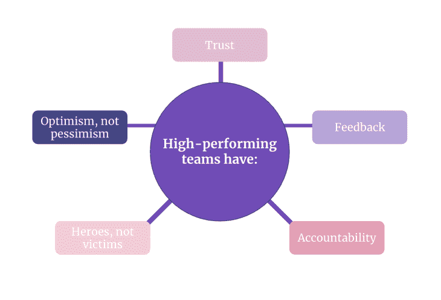

# 高绩效团队和普通团队的区别

> 原文：<https://blog.logrocket.com/product-management/difference-between-high-performing-and-ordinary-teams/>

带领团队走向高绩效的五个特质

每个团队都是独一无二的。没有一个团队是相同的。

在与几十个团队合作后，我了解到为什么一些团队脱颖而出，而另一些团队却停滞不前。高绩效团队有共同的特征；每当他们缺少它们，他们就困住自己。

不幸的是，我不能给你一个高绩效的秘诀，但是我可以分享一些关键的方面。

在我阐述高性能之前，我必须向您设定期望。我还没有找到让一个团队达到这个水平的捷径，我也不相信它的存在。

释放团队的真正潜力需要几年时间。然而，我发现了五个能增加成功几率的特质，稍后我会与你分享。

* * *

## 目录

1.  [信任](#trust)
2.  [反馈](#feedback)
3.  [问责](#accountability)
4.  [英雄，不是受害者](#heroes-not-victims)
5.  [乐观，而不是悲观](#optimism-not-pessimism)

* * *

## 前提

关于高绩效团队已经说了很多，但是如果环境没有准备好，那就永远不会发生。有了功能失调的文化，团队就无法发挥他们的最大潜力。

很难说，因为这让团队处于被动模式，等待完美的场景。这不是我想要你做的。

如果你发现了我将要分享的任何一点，你可以用正确的行动来促成改变。

在以下情况下，高性能是可能的:

*   领导者放弃命令和控制行为
*   团队从追求中获得目标，而不是实现计划
*   领导赋予团队力量，并在必要时支持他们
*   团队受益于心理安全的环境
*   领导者将失败视为走向成功的自然步骤，并鼓励团队分享他们的经验，而不是责备他们

只要这些因素都存在，你就会茁壮成长。[如果你缺少以上](https://blog.logrocket.com/product-management/5-mistakes-product-teams-make-how-to-avoid/)的任何一点，反馈是促进改变的工具。

我将要分享的一些特征可以帮助你改变不正常的场景。

现在，我们来了解一下高绩效团队和普通团队的区别。

## 1.信任

任何团队的基础都是信任。没有这一点，团队就无法发展。然而，信任不是你可以要求的。你必须赢得它。

> “信任是知道当团队成员推你时，他们这样做是因为他们关心团队。”――帕特里克·兰西奥尼，《团队的五大功能障碍:一个领导寓言》

信任对于不同的团队意味着什么？

### 在高绩效团队中

你会对他们的互动方式感到震惊。

他们不惧怕冲突，他们无时无刻不在挑战对方。从外面看，你可能认为他们在打架，不能一起工作。这正是不同之处。

他们识别冲突，并作为一个团队尽快解决它们。

### 在普通团队中

乍一看，你会感受到一种平静的气氛。

没有人互相挑战。他们害怕伤害别人，小心翼翼地选择用词。结果很难看。未得到解决的冲突仍然公开存在，谈论的时间太长了。

* * *

订阅我们的产品管理简讯
将此类文章发送到您的收件箱

* * *

团队行动缓慢，因为他们彼此过于谨慎。

## 2.反馈

信任能让团队成长，但仅此还不够。我所知道的最好的成长工具是反馈。那是强大的。

让我难过的是，很多人因为缺乏给予反馈的技巧而错失了帮助他人成长的机会。领导倾向于拿着它进行绩效评估。团队成员因为不同的原因倾向于避免反馈。以下是我对此的看法:

> 没有可操作的反馈就没有增长。

反馈对不同的团队意味着什么？

### 在高绩效团队中

团队成员几乎不会错过提供反馈的机会。

无论何时有事发生，他们都会及时给出可操作的反馈。他们确保反馈显示出赞赏。这是基于观察。而且是可操作的。

除了给出反馈，高绩效团队知道如何接收和要求反馈。他们培养反馈文化，因为他们想要成长。

### 在普通团队中

缺乏提供和接受反馈的技能。

给出反馈时，团队成员倾向于混合观察和解释。这个问题会导致收到反馈时产生抵触情绪。

还有一点就是什么时候反馈。与高绩效团队不同，普通团队不会在情况发生后立即提供反馈，而是等待几周或几个月来分享反馈。这削弱了反馈的效果。

## 3.有责任

团队只有对自己的行为完全负责，才能取得成功。

认识到你行为的影响并对其负责是很强大的。没有这一点，团队就会找到借口来证明错误的选择。

信任和反馈的结合使团队能够让彼此对结果负责。

问责团队有哪些不同的级别？

### 在高绩效团队中

在高绩效的团队中，每个人都会让对方对自己的结果负责。从外面看，气氛会很紧张，但在团队内部，他们都希望他们的集体影响力最好。

让我给你举个例子，一个团队成员承诺在两天内交付某样东西。两天后，什么都没发生。这个人要么主动来到团队并为其找出解决方案，要么团队中的某个人将提供反馈并致力于解决方案。他们积极地让彼此承担责任。

### 普通的

普通团队通常缺乏责任感。他们往往对错误漠不关心，也不会遵守协议。

举一个与之前相同的例子，负责交付的团队成员在错过协议时不会主动寻找解决方案。其他团队成员也不会让他们为此负责。

不幸的是，许多团队并不关心问责制。每个团队成员都努力做好自己的工作，但却忽略了集体的结果。

## 4.英雄，而不是受害者

在过去的 15 年里，我看到了很多。从巴西到德国，从初创企业到大型企业。我在不同的市场领域工作过——公共、汽车、时尚、咨询等等。如果我学到了什么，那就是:

> 事情总是会阻碍你实现目标。

你在哪里不重要。这种情况永远不会完全对你有利。这很正常。但是你如何处理它是一个至关重要的方面。

### 在高绩效团队中

进步是高性能工具的终极目标。他们认识到自己的情况，并问，“最好的行动方案是什么？”他们在那一刻做他们能做的。他们不会抱怨失去了什么。

简而言之，他们是故事中的英雄，而不是环境的受害者。

高绩效团队不会坐在乘客座位上。他们根据情况进行调整，并使用手中的牌。无论发生什么，他们总是掌握主动权，不断朝着自己的目标前进。

### 在普通团队中

不利的形势严重打击了他们。

每当出了问题，他们就会变得被动。他们不是调整自己的行动，而是抱怨现状，不采取任何行动。

普通团队让环境来定义他们，因为他们成为环境的受害者。

## 5.乐观，而不是悲观

无论你的生意如何，要想兴旺发达，都需要信念的飞跃。没有希望，你就没有不断进步的动力。

当你用 150ml 看一个 300ml 的玻璃杯时，你看到了什么？半满的杯子还是半空的杯子？

### 在高绩效团队中

乐观是实现高绩效的一个重要方面。积极的心态必然会带来积极的结果。

高绩效团队总是看到半满的杯子。

他们很乐观。最终，事情会出错，但他们会从中吸取教训，并调整他们的行动过程，以保持进步并达到他们的目标。

### 在普通团队中

悲观和国际化是普通团队的一部分。他们把糟糕的结果归咎于外部因素。

每当一个机会出现在他们面前，他们就开始指出它的消极方面。他们悲观，对更光明的未来缺乏希望。当他们在做出错的事情时，他们的第一反应是，“我以前说过。这是行不通的。”

他们总是看到杯子半空。他们抱怨，外化，最终卡住。

悲观的人会变得有害，阻碍他人发挥自己的最佳水平。悲观主义不可避免地成为一种自我实现的预言。

* * *

## 最后的想法

无论你现在在哪里，你都可以帮助你的团队一步步成长为高绩效。你只需要开始。

我有个任务给你。查看您的场景，评估每个方面，并了解您的团队目前所处的位置。与他们分享，并进行对话。你们可以一起改变它。

如果你缺乏高绩效的先决条件，与你的团队领导分享。说说吧。所有公司都想变得更加成功。如果你愿意帮忙，他们会愿意听你的。

*精选图片来源:[icon scout](https://iconscout.com/icon/partnership-1543484)*

## [LogRocket](https://lp.logrocket.com/blg/pm-signup) 产生产品见解，从而导致有意义的行动

[LogRocket](https://lp.logrocket.com/blg/pm-signup) 确定用户体验中的摩擦点，以便您能够做出明智的产品和设计变更决策，从而实现您的目标。

使用 LogRocket，您可以[了解影响您产品的问题的范围](https://logrocket.com/for/analytics-for-web-applications)，并优先考虑需要做出的更改。LogRocket 简化了工作流程，允许工程和设计团队使用与您相同的[数据进行工作](https://logrocket.com/for/web-analytics-solutions)，消除了对需要做什么的困惑。

让你的团队步调一致——今天就试试 [LogRocket](https://lp.logrocket.com/blg/pm-signup) 。

[David Pereira Follow](https://blog.logrocket.com/author/davidpereira/) Product Leader with 15+ years of experience. Partner at Value Rebels and interim CPO at omoqo. Almost every product team is trapped somehow; untrapping them is what drives me.