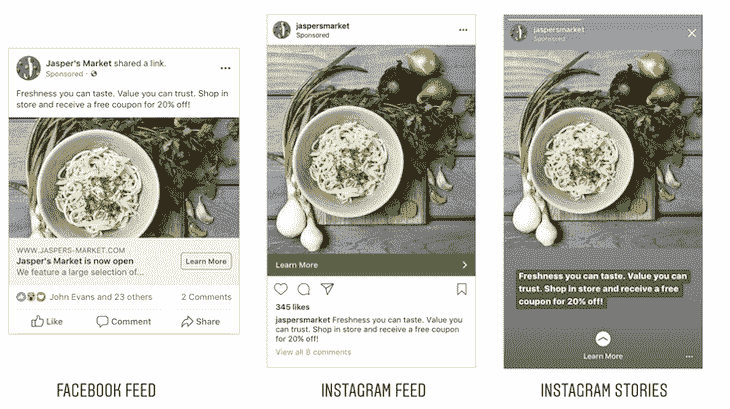
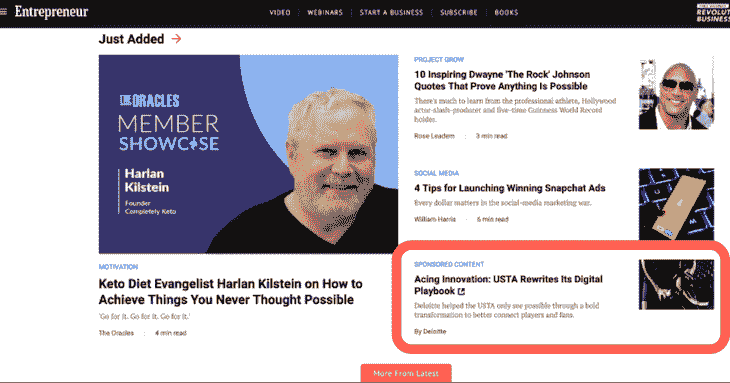
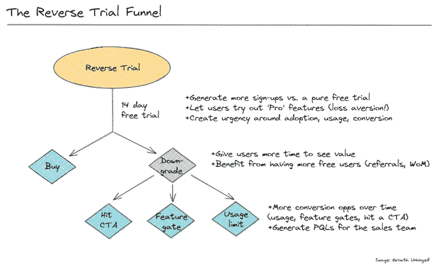

# 2023 年值得关注的数字货币化趋势

> 原文：<https://blog.logrocket.com/product-management/digital-monetization-trends/>

货币化从来都不性感。但马上就要了。

2023 年，想要赢得市场，光有强大的价值主张是不够的。一家公司还需要一种可扩展的方式来实现其价值的货币化。

这意味着数字货币化将再次成为一个很酷的话题，这对每个人都有好处。

以下是我对未来几年数字货币化将如何发展的一些预测。

* * *

对 2023 年数字货币化的四个预测:

1.  [数据货币化将不再流行](#data-monetization-will-become-less-popular)
2.  [原生广告将变得更加流行](#native-advertising-will-become-more-popular)
3.  [混合货币化模式正在兴起](#hybrid-monetization-models-on-the-rise)
4.  [反向试验将成为新标准](#reverse-trials-will-become-a-new-standard)

* * *

## 1.数据货币化将变得不那么流行

数据货币化的工作方式如下:

*   产品向顾客提供服务(通常是免费的)
*   客户使用它
*   产品背后的公司收集他们用户的数据
*   他们进一步将这些数据转售给其他公司和广告商，以获取收入

它曾经是一种非常流行的货币化模式，无论是作为主要收入来源还是次要收入来源。但是变化很快。

对于消费者、立法者和大公司来说，用户隐私正成为一个越来越重要的话题，这导致了更多以隐私为导向的决策。

然而，这不仅仅是关于法律和限制。用户似乎变得对隐私更加敏感。越来越多的人在浏览互联网时拒绝 cookies 或使用 VPN。

尽管对某些类型的公司来说，利用数据赚钱可能仍然是一种可行的商业模式，但这将变得越来越困难。许多依赖货币化数据的公司将不得不寻找新的货币化模式。

## 2.原生广告将变得更受欢迎

原生广告是看起来不像的广告。

这些广告被整合到应用程序的自然流程中，因此很难将它们与非付费内容区分开来。

原生广告的例子包括:

*   Instagram feed 中的付费广告
*   在 Instagram Stories 上推广故事
*   脸书订阅源中的广告
*   出版物和杂志中的赞助内容

以下是社交媒体中付费广告的一些例子:

Source: [Single Grain](https://www.singlegrain.com/digital-marketing/ultimate-guide-instagram-stories-ads/)

这里有一个赞助内容的例子:

Source: [IntrixMedia](https://www.intrixmedia.com/guide-to-native-advertising/)

如果你是用广告货币化，原生广告很可能会成为你未来最好的朋友。

尽管有些人可能认为这是不公平的欺骗，但原生广告给你带来了竞争优势，因为原生广告:

### 不受横幅失明的影响

当人们无意识地忽略看起来像广告横幅的信息时，就会发生横幅失明。

换句话说，久而久之，我们就不自觉地训练自己的大脑去直观地分辨和忽略广告。

但原生广告就不是这样了。由于这些广告看起来像标准内容，我们的大脑对它们的关注与对非付费内容的关注是一样的。

这是原生广告比老派、独特、横幅式广告更有效的主要原因。

* * *

订阅我们的产品管理简讯
将此类文章发送到您的收件箱

* * *

### 通过广告拦截器

广告拦截器的发明标志着任何广告驱动型公司的黑暗一天。

现在，在努力更有效地阻止广告的广告拦截器提供商和试图优化广告代码以逃避检测的广告提供商之间存在持续的竞争。

原生广告让你逃离竞赛。由于它们嵌入在产品中，很难将它们与非广告内容区分开来，因此广告拦截器在这方面完全无效。

### 提供一个更好的 UX

在一天结束的时候，如果你无论如何都要向你的客户展示一个广告，为什么不以最用户友好的方式展示呢？

原生广告不那么令人分心，也不会影响用户的自然流动。最终，它们提供了比非原生广告更无缝、更友好的体验。

## 3.混合货币化模式正在兴起

在过去，我们通常以一次性的固定价格购买产品，通常以光盘形式发货。随着互联网的发展，广告成为许多互联网公司的主要收入来源。

随着时间的推移，随着广告产生的收入越来越少，订阅模式成为了主要的盈利策略。现在，随着人们拥有越来越多的订阅，他们往往会更有选择性地支付经常性的费用。

接下来我们去哪里？

似乎每个主要的盈利模式都已经有了众所周知的 15 分钟。没有一个被证明是银弹。事实上，如果说我们在过去几年中学到了什么，那就是没有放之四海而皆准的方法。

有些人只考虑免费的特定类型的产品。有些人愿意支付定期订阅费，但不是为了特定类型的服务，而其他人可能愿意支付高额的前期费用，只是为了安心。更不用说现收现付的趋势了。

许多产品将采用混合货币化模式，以最大限度地提高收入潜力，同时吸引最广泛的客户。

一些例子包括:

*   **订购加现收现付** —订购让重度用户获得最大价值，同时让临时用户在需要服务时一次性付款
*   **订阅加广告** —向非付费用户显示广告，并提议通过高级订阅移除广告
*   **一次性付款与广告** —允许用户一次性付款删除广告
*   **一次性付费加订阅** —让用户可以选择支付终身访问费用，而不是较小的经常性费用

更复杂的收入模式甚至可以结合三到四种不同的盈利模式。

## 4.反向试验将成为新的标准

随着每天发布越来越多的订阅服务，消费者开始犹豫是否要注册免费试用。

不得不为另一份订阅付费的设想已经令人望而却步。但是如果他们连免费试用的机会都不给你，你怎么能把他们和你的优惠挂钩呢？

满足反向试验:

反向试用背后的想法是为新来者提供完全的高级访问权限——不管他们是否要求——并在免费试用期后将其降级。

它允许你的用户体验你的产品的全部好处，而不必经历开始试用、提供借记卡细节、设置取消提醒等摩擦。

此外，放弃好东西的痛苦通常比开始新东西的潜在好处更有动力。

鉴于许多新的订阅产品争夺用户的注意力、信任和努力，反向试用将成为你的服务与众不同的方式之一。

## [LogRocket](https://lp.logrocket.com/blg/pm-signup) 产生产品见解，从而导致有意义的行动

[LogRocket](https://lp.logrocket.com/blg/pm-signup) 确定用户体验中的摩擦点，以便您能够做出明智的产品和设计变更决策，从而实现您的目标。

使用 LogRocket，您可以[了解影响您产品的问题的范围](https://logrocket.com/for/analytics-for-web-applications)，并优先考虑需要做出的更改。LogRocket 简化了工作流程，允许工程和设计团队使用与您相同的[数据进行工作](https://logrocket.com/for/web-analytics-solutions)，消除了对需要做什么的困惑。

让你的团队步调一致——今天就试试 [LogRocket](https://lp.logrocket.com/blg/pm-signup) 。

[Bart Krawczyk Follow](https://blog.logrocket.com/author/bartkrawczyk/) Learning how to build beautiful products without burning myself out (again). Writing about what I discovered along the way.