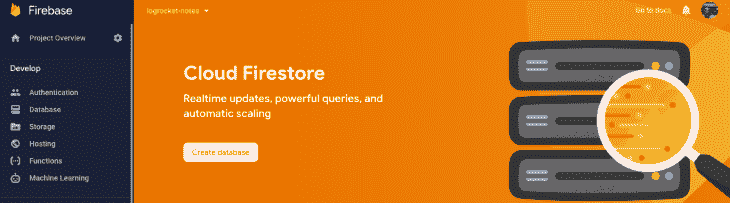
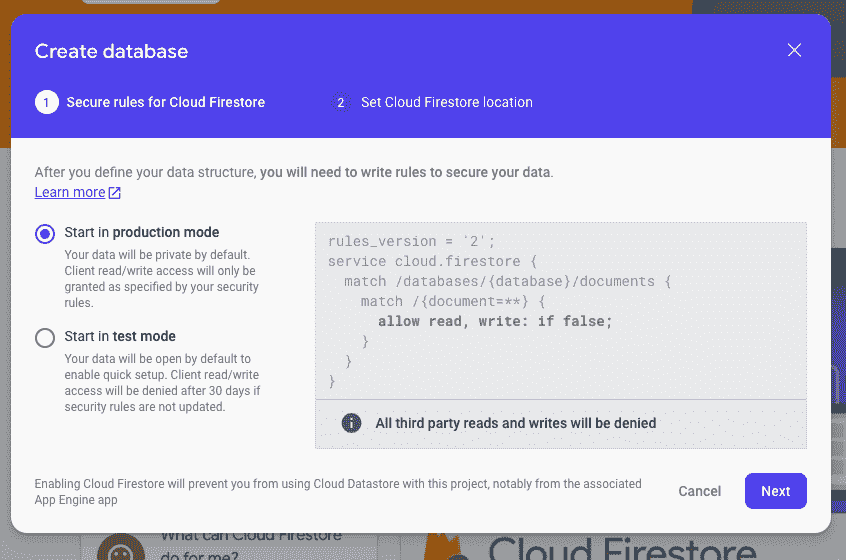
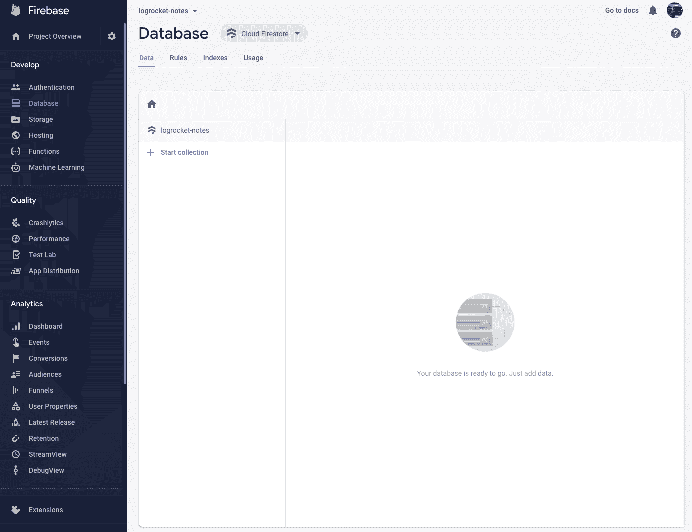
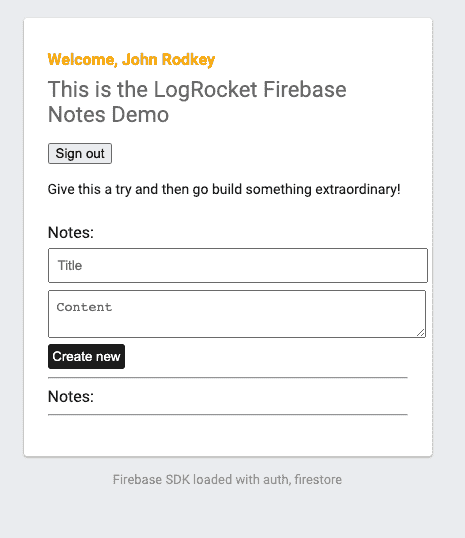
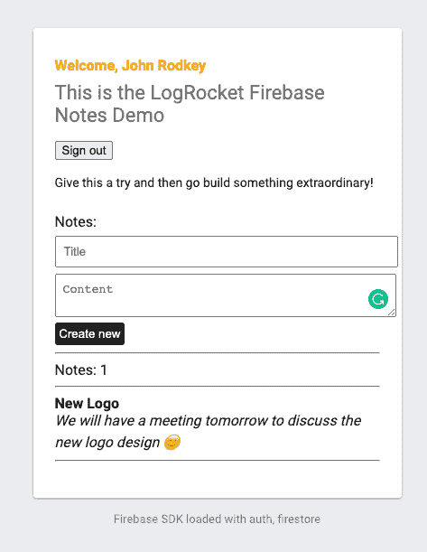
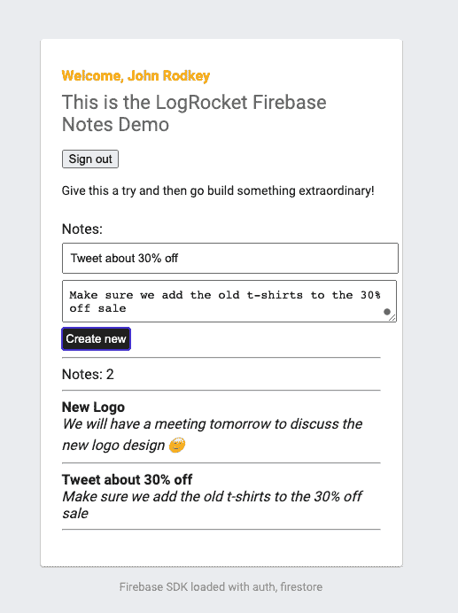
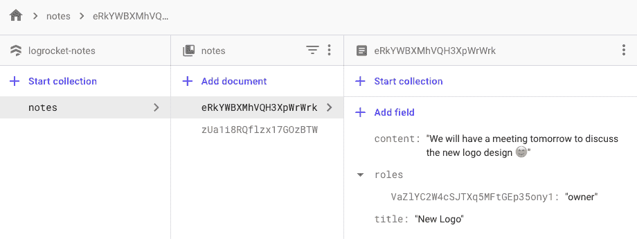

# 使用 Firebase - LogRocket 博客直接连接您的前端和后端

> 原文：<https://blog.logrocket.com/directly-connect-your-frontend-and-backend-using-firebase/>

## 介绍

您是否正在开始一个新项目，捕获需求，选择要使用的技术，建模数据，并让您的团队准备好开始编写一些代码？无论你是一个单独的开发人员还是一个团队，你在项目开始时所做的每个决定都有利有弊。

你是从一个整体开始——像 Ruby on Rails 或 Django 这样的东西，还是通过创建一个由单页面应用程序(SPA)使用的 API 来完全分离前端和后端？

随着 SPA 和无服务器最近风靡一时，我们将假设您已经决定创建一个 API 和 SPA。现在您需要决定如何构建和托管您的 API。但是你真的需要 API 吗？

您和/或您团队的时间花在用户体验和 SPA 上会更好吗？

如果我告诉您，有一些工具可以让您从 SPA 安全地直接连接到数据存储区，那会怎么样！我们将为一家公司构建一个笔记应用程序，它将包含笔记的权限。

今天，我们将重点关注一种特殊的技术和产品套件— [谷歌云的 Firebase](https://firebase.google.com/) 。

Firebase 提供了让您的项目起步所需的所有工具，包括[托管免费 SSL 证书和全球 CDN](https://firebase.google.com/products/hosting) 、[认证](https://firebase.google.com/products/auth)、[数据存储](https://firebase.google.com/products/firestore)、 [blob 存储](https://firebase.google.com/products/storage)等等。

好了，说得够多了——是时候写代码了。

我不会进入你的前端选择，但我强烈推荐 [Ember](https://emberjs.com/) 现在辛烷已经到来，或者 [Nextjs](https://nextjs.org) 如果你更喜欢 React。也就是说，我将只展示让您的项目正常工作所需的 JavaScript。

不过，在我们开始之前，请访问[https://firebase.google.com](https://firebase.google.com)并创建您的免费帐户。

首先，我们将安装 Firebase CLI 并登录我们的 Firebase 帐户。

```
$: npm i -g firebase-tools
$: firebase login
```

假设您已经为您选择的 SPA 设置了一个项目，让我们激活我们将使用的 Firebase 特性:托管、身份验证和 Firestore:

```
$: firebase init
? Which Firebase CLI features do you want to set up for this folder? Press Space
 to select features, then Enter to confirm your choices. 
 ◯ Database: Deploy Firebase Realtime Database Rules
 ◉ Firestore: Deploy rules and create indexes for Firestore
 ◯ Functions: Configure and deploy Cloud Functions
❯◉ Hosting: Configure and deploy Firebase Hosting sites
 ◯ Storage: Deploy Cloud Storage security rules
 ◯ Emulators: Set up local emulators for Firebase features
=== Project Setup
```

首先，让我们将这个项目目录与一个 Firebase 项目关联起来。

您可以通过使用`--add`运行 Firebase 来创建多个项目别名，但是现在我们将只设置一个默认项目。

```
? Please select an option: (Use arrow keys)
  Use an existing project 
❯ Create a new project 
  Add Firebase to an existing Google Cloud Platform project 
  Don't set up a default project 

i  If you want to create a project in a Google Cloud organization or folder, please use "firebase projects:create" instead, and return to this command when you've created the project.
? Please specify a unique project id (warning: cannot be modified afterward) [6-30 characters]: logrocket-notes

? What would you like to call your project? (defaults to your project ID) 
✔ Creating Google Cloud Platform project
✔ Adding Firebase resources to Google Cloud Platform project

🎉🎉🎉 Your Firebase project is ready! 🎉🎉🎉

Project information:
   - Project ID: logrocket-notes
   - Project Name: logrocket-notes

Firebase console is available at

没有描述

i  Using project logrocket-notes (logrocket-notes)

=== Firestore Setup

Error: It looks like you haven't used Cloud Firestore in this project before. Go to https://console.firebase.google.com/project/logrocket-notes/database to create your Cloud Firestore database.
```

现在你可能已经注意到我们遇到了一个错误，这是我喜欢 Firebase 的原因之一。它告诉你什么时候你需要做什么，并给你链接去做它！

现在复制提供的链接，并通过选择**创建数据库**来设置您的项目以使用 Firestore。



您将看到一个模式，询问您希望默认使用什么规则来启动数据库。正如我在开始时所说的，这些规则将用于控制 SPA / FE 客户端对数据库的访问。也就是说，在**生产模式**中选择开始。从一开始就学会使用规则是有好处的。



接下来将要求您选择您的位置—选择离您和/或您的客户最近的位置，并给它几秒钟时间来创建数据库。



现在我们已经建立了数据库，我们再次运行我们的`firebase init`命令。同样，您将选择 Firestore 和 Hosting，但是您会注意到它不会再次询问您如何选择项目。

如果是这样，只需选择`Use an existing project`并选择您之前创建的项目名，然后完成剩下的配置。

```
=== Firestore Setup

Firestore Security Rules allow you to define how and when to allow
requests. You can keep these rules in your project directory
and publish them with firebase deploy.

? What file should be used for Firestore Rules? (firestore.rules)
Firestore indexes allow you to perform complex queries while
maintaining performance that scales with the size of the result
set. You can keep index definitions in your project directory
and publish them with firebase deploy.

? What file should be used for Firestore indexes? (firestore.indexes.json)
=== Hosting Setup

Your public directory is the folder (relative to your project directory) that
will contain Hosting assets to be uploaded with firebase deploy. If you
have a build process for your assets, use your build's output directory.

? What do you want to use as your public directory? public
? Configure as a single-page app (rewrite all urls to /index.html)? Yes
✔  Wrote public/index.html

i  Writing configuration info to firebase.json...
i  Writing project information to .firebaserc...
i  Writing gitignore file to .gitignore...

✔  Firebase initialization complete!
```

现在我们准备好出发了！让我们回顾一下我们所做的事情:

*   创建了我们的 Firebase 帐户
*   已登录到帐户
*   创建一个项目
*   为我们的 SPA 托管设置我们的 Firebase 项目
*   配置我们的项目使用 firestorm 作为我们的数据库

您可能会问，“但是我记得您说过我们也会使用身份验证！”，你是对的。

我们将使用 Firebase 身份认证，但我们不会通过 Firebase CLI 进行配置，稍后我们将介绍这一点。

* * *

### 更多来自 LogRocket 的精彩文章:

* * *

现在，您可能已经注意到项目中有几个新文件:

管理您的项目别名并部署目标。

`firebase.json //`是必需的，它指定将项目目录中的哪些文件和设置部署到 Firebase 项目中。

`firestore.rules //`是一个用于定义 Firestore 数据库安全规则的文件。

`firestore.indexes.json //`是一个用于为 Firestore 查询定义索引的文件。

现在是我们开始对一些数据建模的时候了，但是如果你还没有意识到 Firestore 是一个 NoSQL 文档数据库，被一些非常大的组织和初创公司使用，包括纽约时报、Khan Academy 和现在的 IMS，并且将会有一个与你可能熟悉的使用 MySQL 或 Postgres 不同的模型。

我将使用一个普通的旧 JavaScript 对象来显示模型的结构。

**</用户/{userId}**

```
User {
  firstName: string;
  lastName: string;
  avatar: string;
  email: string;
}
```

**/notes/{noteId}**

```
Note {
  title: string;
  content: string;
  roles: {
    userId: string; // e.g., ['owner', 'reader', 'editor', 'commenter']
  }  
}
```

**/notes/{ note id }/comments/{ comment id }**

```
Comment {
  user: {
    name: string;
    id: string;
  };
  content: string;
}
```

让我们快速浏览一下模型:

如您所见，`User`模型存储了与用户相关的一般信息。我们可以在用户模型上放置一个角色，但是对于这个简单的帖子，我们将把我们的用户角色放在`note`上。

这种安全模式有一个权衡——假设您已经在`User`上保存了`User`角色，但是您希望有一个关于与`User`的潜在问题的内部注释。

如果他们在自己的用户记录上有适当的角色`e.g., Admin`，他们可以看到与他们相关的`Note`。通过在`Note`上定义`roles`，我们明确地为每个笔记设置了权限，让我们能够邀请用户到`Note`并阻止其他人进入。

`Notes`模型包含标题和注释的内容。你可能会觉得有趣的是`Note`上的`roles`物体。它可以被命名为任何东西——甚至是用户，因为它将被用来限制对`Note`的访问。

正如您可能已经注意到的，`Comment`模型没有用于`noteId`的字段，我们不需要添加它。我们当然可以，但是一个`Comment`属于一个`Note`的子集合——把它想象成一个类似于 REST API 的访问模式。

您不需要使用一个`where`查询来检索一个`Note`的所有`comments`。当我们开始检索数据时，我们将更多地讨论这一点。

你可能已经注意到的另一个观察是`Comment` `user`对象包含`name`和`id`。

使用 NoSQL 对数据进行建模时，根据您的访问模式或数据在视图中的使用方式对数据进行建模非常重要。一般来说，当你有一个评论时，你想知道是谁做的评论。

使用 SQL 数据库，您可以连接数据并将其发送到视图层。但是，使用 NoSQL，您可以添加该数据并将其复制到您的记录中，为您提供一种简单快速的访问模式，这称为非规范化数据。现在，当我们查询一个`Comment`时，我们会得到它的作者和他们的名字。

基本模型完成后，让我们开始编写一些数据访问规则。与 SQL 不同，NoSQL 数据库通常是无模式的。这意味着我们可以轻松地扩展我们的数据模型，但也意味着我们需要在应用程序代码中加强数据结构。

Firestore 的好处在于，您可以在安全规则内处理模式规则和访问模式，但是这些访问模式和模式规则不适用于您通过`Google Cloud Functions`之类的东西进行的`Admin` API 访问。

打开您的`firestore.rules`文件，让我们开始为我们的`client-side`访问添加规则。

**firestore.rules**

```
rules_version = '2';
service cloud.firestore {
  match /databases/{database}/documents {
    match /{document=**} {
      allow read, write: if false;
    }
  }
}
```

Firestore 规则非常灵活，可以根据请求运行。我们有能力编写函数来实现可重用性，我们将在这个例子中这样做。

**firestore.rules**

```
rules_version = '2';
service cloud.firestore {
  match /databases/{database}/documents {
    function isAuthenticated() {
      return request.auth != null;
    }
    function getRole(resource) {
      // Read from the "roles" map in the resource
      return resource.data.roles[request.auth.uid]
    }
    function isOneOfRoles(resource, array) {
      // Determine if the user is one of any array of roles
      return isAuthenticated() && (getRole(resource) in array);
    }
    function onlyNoteContentChanged() {
      // Ensure only the Note's content has changed
      return request.resource.data.title == resource.data.title
      && request.resource.data.roles == resource.data.roles
      && request.resource.data.keys() == resource.data.keys();
    }
    match /users/{user} {
      // Any user can see other user profiles
      allow read: if isAuthenticated();
      // only the current user can write to their own profile
      allow write: if  request.auth.uid == user;
    }
    match /notes/{note} {
      // Any authenticated user can create a note
      allow create: if isAuthenticated();
      // Only the note owner is permitted to delete it
      allow delete: if isOneOfRoles(resource, ['owner']);
      // The owner is permitted to update the note including the title, content and add users
      // Editors are only permitted to update the content of the note.
      allow update: if isOneOfRoles(resource, ['owner']) 
        || (isOneOfRoles(resource, ['editor']) && onlyNoteContentChanged());
      allow read: if isOneOfRoles(resource, ['owner', 'editor', 'commenter', 'reader'])

      // the rules below apply to comments of the note
      // /notes/{note}/comments/{comment}
      match /comments/{comment} {
        // we are using a rules get query to retrieve the note and check the 
        // roles to ensure the user can infact 
        allow read: if isOneOfRoles(
          get(/databases/$(database)/document/notes/$(note)), 
          ['owner', 'editor', 'commenter', 'reader']
        );
        allow create: if isOneOfRoles(
          get(/databases/$(database)/document/notes/$(note)), 
          ['owner', 'editor', 'commenter']
        ) && request.resource.data.user.id == request.auth.uid;
      }
    }
  }
}
```

规则引擎提供了`request`和`resource`变量供我们使用——关于所提供的信息可以在[这里](https://firebase.google.com/docs/rules/rules-language#building_conditions)找到。让我们浏览一下规则，看看我们添加了什么

是一个可重用的助手，我们将在许多规则中使用它。

`getRole`是另一个可重用的助手。它将用于使用用户认证`id`来捕获`note`文档上的`role`。

`isOneOfRoles`是一个助手函数，它检查用户是否经过身份验证，并验证用户的身份验证`id`是否具有执行某个操作的适当角色。

`onlyNoteContentChanged`是验证文档数据结构的助手。如前所述，Firestore 是无模式的，需要您在应用程序或 Firestore 规则中执行数据验证。

我对上面的每条规则都做了内联注释，这应该使它变得不言自明了。Firestore 规则文档非常棒，我建议你在这里阅读一下。

一旦您更新了安全规则，让我们来部署它们:

```
$ firebase deploy --only firestore:rules
=== Deploying to 'logrocket-notes'...

i  deploying firestore
i  cloud.firestore: checking firestore.rules for compilation errors...
✔  cloud.firestore: rules file firestore.rules compiled successfully
i  firestore: uploading rules firestore.rules...
✔  firestore: released rules firestore.rules to cloud.firestore

✔  Deploy complete!
```

是时候让认证工作了。我将只提供完成这项工作所需的 JavaScript。Firebase 提供了关于使用认证的很棒的文档，我强烈推荐你在这里查看他们的文档。

为了简单起见，我将使用 Firebase UI 组件:

```
let ui = new firebaseui.auth.AuthUI(firebase.auth());
let uiConfig = {
  callbacks: {
    signInSuccessWithAuthResult: function (authResult, redirectUrl) {
      // User successfully signed in.
      // Return type determines whether we continue the redirect automatically
      // or whether we leave that to developer to handle.
      return false;
    },
    uiShown: function () {
      // The widget is rendered.
      // Hide the loader.
      document.getElementById('loader').style.display = 'none';
    },
  },
  // Will use popup for IDP Providers sign-in flow instead of the default, redirect.
  signInFlow: 'popup',
  signInOptions: [
    // Leave the lines as is for the providers you want to offer your users.
    firebase.auth.GoogleAuthProvider.PROVIDER_ID,
  ],
};
ui.start('#auth', uiConfig);

// Create an auth listener to get the real-time auth status
let myUser = null;
firebase.auth().onAuthStateChanged(user => {
  if (!user) {
    // user is not authenticated and need to transition view
    // do something here with your framework
    myUser = user; // this will be null.
  }
  // user is authenticated - framework of choice code here.
  // in react you could use an AuthContext as an example
  myUser = user.uid // get user id to use for queries, etc.
})
```

下面是我的相当简单的 UI 使用 Firebase 提供的组件后的样子:


现在我们已经完成了身份验证，让我们创建一个注释。

使用您喜欢的框架构建一个简单的表单，并获取表单值。我将提供一个带有 Firestore 代码的示例函数，用于将数据保存到数据库中。

```
// 
function formSubmit() {
  const title = input.value;
  const content = input.value;
  const roles = {
    '124j243lk': 'owner',
    'fake_id_3': 'editor'
  }

  // save to firestore and have firestore assign a unique id
  firebase.firestore().collection('notes').add({
    title,
    content,
    roles
  });

  // if you would prefer to restrict documents by title uniqueness 
  firebase.firestore().collection('notes').doc(title).set({
    title,
    content,
    roles
  });
}
```



这是我添加注释的示例表单。丑陋，我知道——但这与造型等无关。我推荐顺风。

Firestore 为您的客户提供实时数据同步。让我们现在设置一个快照监听器，这里是文档供进一步阅读。

```
db.collection('notes')
  .where(`roles.fake_id`, '==', 'owner')
  .onSnapshot(querySnapshot => {
    // if the query is empty just return
    if (querySnapshot.empty) return;
    // we have some docs --
    // do something depending on your framework of choice.
    // I will create an array of documents with their data and id
    const notes = querySnapshot.docs.map(doc => ({...doc.data(), id: doc.id}))
    // as you can see, I need to call doc.data() to get the data of the document.
    // for this quick and dirty exmaple i will simply loop through the docs and add to an html element
    notesDiv.innerHTML = `<span>Notes: ${notes.length}</span><br><hr />`;
    for (const note of notes) {
      notesDiv.innerHTML += `
        <strong>${note.title}</strong><br>
        <em>${note.content}</em><br/><hr />
      `; 
    }
  });
```

现在我们已经创建了快照监听器，让我们看看它在我们的 UI 中是如何工作的。





太好了！我们可以看到在我们的查询中返回了多少条注释，标题是粗体的，内容是斜体的。

如果我们在 Firestore 中查看，我们可以看到我们的文档以及它们在管理控制台中的外观:



## 结论

让我们来分析一下我们所做的事情，以及这些事情对您的意义。

我们通过谷歌的 Firestore 建立了一个可扩展的实时 NoSQL 数据库，我们通过 Firebase 身份验证配置并启用了身份验证，通过 Firestore 规则添加了授权，并且我们通过 Firebase 的全球 CDN 建立了一个静态网站托管。

Firebase 提供的一切都是为了让您快速进入市场而构建的，提供可伸缩的构建块并鼓励您使用最佳实践来构建您的应用程序。

但是，我们没有触及许多其他 Firebase 产品，包括 Firebase Functions，它由 Google Cloud Functions 提供支持，或者 Google Cloud Run，它提供了非常棒的免费层，可以帮助您在需要时开始构建可扩展的 API 和后端系统。再说一遍，都是无服务器的。

我们不需要配置服务器，不需要担心服务器更新或补丁，我们有一个全球可扩展的数据库，不需要担心添加节点或分片，我们有一个快速的全球 CDN 和慷慨的免费托管，我们有身份验证提供的最佳实践。

有了 Firebase 和 Google Cloud，你可以做更多的事情。我将创建更多与 Firebase 相关的帖子，并更详细地深入每个主题领域，敬请关注！

## 使用 [LogRocket](https://lp.logrocket.com/blg/signup) 消除传统错误报告的干扰

[](https://lp.logrocket.com/blg/signup)

[LogRocket](https://lp.logrocket.com/blg/signup) 是一个数字体验分析解决方案，它可以保护您免受数百个假阳性错误警报的影响，只针对几个真正重要的项目。LogRocket 会告诉您应用程序中实际影响用户的最具影响力的 bug 和 UX 问题。

然后，使用具有深层技术遥测的会话重放来确切地查看用户看到了什么以及是什么导致了问题，就像你在他们身后看一样。

LogRocket 自动聚合客户端错误、JS 异常、前端性能指标和用户交互。然后 LogRocket 使用机器学习来告诉你哪些问题正在影响大多数用户，并提供你需要修复它的上下文。

关注重要的 bug—[今天就试试 LogRocket】。](https://lp.logrocket.com/blg/signup-issue-free)