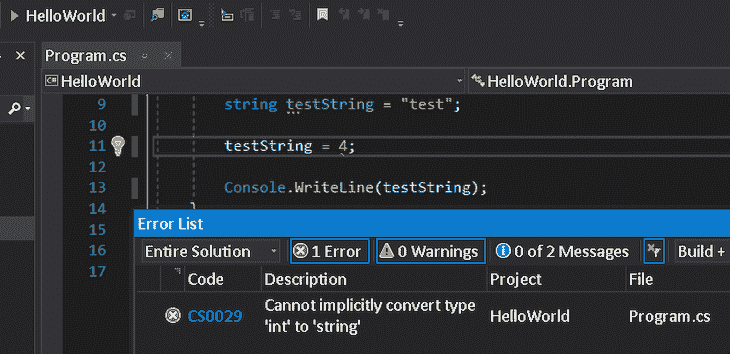
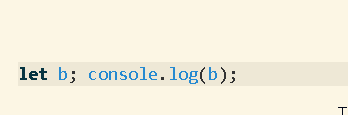
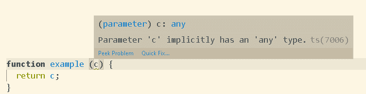

# 讨论 TypeScript - LogRocket 博客中的过度工程化陷阱

> 原文：<https://blog.logrocket.com/discussing-the-over-engineering-trap-in-typescript/>

## 介绍

在开始讨论 TypeScript 中的过度工程之前，我想对 JavaScript 和更强类型的语言目前如何处理类型做一个基本概述。JavaScript 中的所有类型(除了`object`类型)都被称为`primitive values`。JavaScript 中经常使用的原始值包括类型为`string`、`number`和`boolean`的值。所有原始值都是不可变的。例如，对于字符串来说，这意味着一旦你完成了赋值`let testString = ‘test’`，你就不能通过做类似`testString[0] = ‘r’`的事情来改变它以得到`rest`。你得重新分配，`testString = ‘rest’`。

JavaScript 是一种松散类型的语言。JavaScript 中的变量可以被重新赋值为任何类型的值，如`number`、`string`或`object`。比如可以做`testString = 4`。注意字符串现在是一个数字，而变量的名字仍然是`testString`。

相比之下，C#可能是更强类型语言的一个例子。为了解释这一点，我举个例子。这就是在 C# `string testString = “test”;`中给变量赋值字符串的方法。我们没有使用`var`或`let`关键字，而是声明了变量的类型，(`string`，就在我们给它赋值的时候。然后，如果我们试图把它重新赋值给一个不同类型的值，比如像这样做`testString = 4;`，你会得到错误`error CS0029: Cannot implicitly convert type ‘int’ to ‘string’`:



C# type error in Visual Studio 2019

`testString`永远是一个字符串。我想在这里指出，您应该尽量避免在变量的名称中添加类型，因为，正如您在松散类型的语言中看到的那样，它给出了错误的类型(`testString`变成了数字)，而在更强类型的语言中，有时类型已经显示得非常清楚了。

TypeScript 是一种允许 JavaScript 应用程序具有更强类型语言通常具有的特性的语言。您还可以选择您希望类型检查有多严格，以及您希望将多少现有 JavaScript 代码迁移到 TypeScript。您可以使类型检查变得非常严格，并完全迁移到 TypeScript，或者您甚至可以将 TypeScript 添加到您的 JavaScript 项目中，以便为将来做准备，而不使用它。在本文中，我将介绍使用 TypeScript 的优点和缺点。这将使我们更好地了解何时避免在 TypeScript 中过度设计。

## 用更多 JavaScript 构建的应用程序

在开始解释使用 TypeScript 的优点和缺点之前，我觉得应该先解释一下不使用它的优点。为了保持这篇文章的篇幅不太长，我将只介绍一般情况下 web 上客户端脚本编写的主要方式——即使用 JavaScript。本文将不讨论 CoffeeScript 或 Elm 等相关语言。我还将解释在服务器端代码中使用比 TypeScript 更多的 JavaScript。

使用更多 JavaScript 的一个好处是它带来的速度。JavaScript 不需要编译，您可以立即看到结果。它不需要被配置——你不需要创建一个配置文件(`tsconfig.json`)然后添加和改变它的配置。没有额外的配置和编译时间，意味着您可以轻松地构建应用程序原型，以查看您的设计、数据获取和其他功能的结果。

使用更多 JavaScript 的另一个好处是它的成熟。至少在过去几年里，它一直是在客户端/前端编写脚本的主要方式。有时，它甚至被用在后端(Node.js)。因为它已经非常成熟，所以它已经包含了根据所使用的库来处理类型的方法。例如，在 Mongoose 中，您可以使用如下代码定义模式:`const userSchema = new Schema({ firstName: String })`。`firstName`在这里被定义为拥有一个`String`类型。也因为它的成熟，JavaScript 已经包含了处理文档类型的方法——JSDoc 是第一个想到的。如果您已经使用了 JSDoc，那么添加 TypeScript 可能会显得过多。

TypeScript 通常很有用，即使对于最小的应用程序或微服务架构中的应用程序也是如此。然而，如果你有更小的应用程序，这意味着有更高的机会，你可以很容易地推断出是什么类型。此外，当您为 TypeScript 做额外的配置并每次编译以做一些类型检查时，您就失败了。如果您的代码库很小，类型检查可以在单元测试中更容易地完成，使用 Chai 之类的库，而不需要 TypeScript。这让我想到了另一点——您已经可以通过使用测试库来检查类型，而不使用 TypeScript，但是 TypeScript 更快地提供反馈。在您运行测试之前，它有时会在您编码时自动提供反馈(Visual Studio 代码)。如果你有一个新的应用程序要处理，看看现有的测试做了什么。

## 用更多 TypeScript 构建的应用程序

我不打算在这里讨论使用 TypeScript 的所有优点或缺点，因为它们太多了。当我在本节开始讨论使用 TypeScript 时，请记住这一点。

我想描述的使用 TypeScript 的第一个优点是它的工具性。如果你已经使用了像 Visual Studio Code(1 . 43 . 2 版)或 Visual Studio 2019 这样的工具，那么现在这些工具中有很多对这种语言的支持。在本文的其余部分，我将把 Visual Studio 代码称为 VS 代码。

一个在其他工具中不常见的特性是，VS 代码中的悬停信息。当您将鼠标悬停在代码上时，这允许您快速查看关于类型的信息以及方法、参数、变量或 JavaScript 的其他特性的其他信息。当您将鼠标悬停在函数调用的函数名上时，也可以按住 alt 键来查看您正在调用的函数:


当您正在调用的函数在您的视图之外或在许多行之外时，这很有帮助。

签名帮助(当你在函数名后输入`(`来调用该函数时显示的工具提示)是另一个有用的特性，你有时在其他可用的好工具中找不到它。下面的例子显示了当你输入`errorMessage(`来调用`errorMessage`函数时发生的情况:


Signature help in VS Code

快速自动删除未使用的导入是另一个特别有用的特性，这是其他工具所没有的。当您将鼠标悬停在灰显的导入上时，会显示一个允许您执行此操作的蓝色指示器:


Quickly remove unused imports in VS Code

使用 TypeScript 的一个缺点是对项目文件结构和构建工具的更改，我还没有讨论过这个缺点。您必须重命名所有的 JavaScript 文件才能使用文件扩展名`.ts`。如果使用 JSX，需要将扩展名重命名为`.tsx`。迁移所需的工作量取决于项目中包含的文件数量，但您总是可以随着时间的推移逐步迁移文件。

此外，处理声明和源映射文件可能是一个障碍。比如安装 React 和 react-dom 的声明文件时，需要在项目中添加更多的包，`npm install --save-dev @types/react @types/react-dom`。与框架集成也是一件麻烦的事情，你还需要调整你的构建工具(Babel 和 webpack 就是其中的一些例子)来支持 TypeScript。然而，根据您使用的框架和构建工具，可能已经有好的官方资源和文档来支持这一点。

反对将 TypeScript 用于服务器端代码的一个理由是，您可以在后端切换到其他类型安全的语言。然而，这将取决于其他贡献者拥有什么样的技能。例如，如果您的其他团队成员都已经知道如何用另一种类型安全的语言编写，那么这个选项是对每个人技能的一个很好的利用。尝试根据所需的任务选择最佳语言，如果您想要处理数据、并发性甚至类型，TypeScript 可能不是这些主题的最佳选择。与其他语言相比，使用 TypeScript 的优势在于，嗯…它基本上只是 JavaScript…但是有类型！

## 顺序添加的属性和检查的严格性

当从 JavaScript 迁移时，另一个可能导致问题的问题是官方 TypeScript 文档中提到的“顺序添加的属性”。这是当你创建一个空的对象:`let person = {}`，然后给它分配新的键和值`person.name = ‘John’`。这是 JavaScript 中经常使用和记录的模式。但是，默认情况下，TypeScript 不允许这样做。解决这个问题的最快方法是给`person`一个`any`类型，但是这是以较弱的类型检查为代价的。您也可以将属性移入对象文字或使用类型脚本`interface`。

我将讨论的 TypeScript 的最后一个特性是控制代码检查严格性的能力。`strictNullChecks`选项非常适合防止错误，因为`null`保留关键字和`undefined`值是 JavaScript 中常见的错误来源。我能举的例子就是`let a:number = null`。在这种情况下，`a`的值可以是`null`、`undefined`或`NaN`(将`a`设置为`0/0`时可以得到`NaN`)。当`strictNullChecks`选项设置为`false`时，您可能会想知道三个值`a`中的哪一个被设置为允许值。关于这个选项需要额外注意的一点是，我发现当你不使用配置文件中的`strictNullChecks`选项时，默认情况下 `strictNullChecks`似乎已经被设置为 true。

我测试的另一个选项`noImplicitAny`没有按照预期的方式工作。当有一个隐含的`any`类型时，我们期望它会引发错误，但事实并非如此。您可以在 Visual Studio 代码中尝试这样做，当您将鼠标悬停在`b`、`let b; console.log(b);`上方时，会看到`let b: any`出现:



noImplicitAny allows implicit any sometimes

但是，在本例中:

```
function example (c) {
  return c;
}
console.log(example(5));

```

`noImplicitAny`选项工作并抛出错误:`Parameter ‘c’ implicitly has an ‘any’ type. TS7006`:



这仍然是一个很好的选择，并按预期工作，但它没有涵盖我们期望的所有情况。

## 结论

从长远来看，或者对于大型项目来说，向代码中添加类型的成本或开销远远大于它的好处。请记住始终正确使用 TypeScript。在考虑使用它之前，先了解更多关于它的特性和您自己的项目的信息。这将帮助您决定是否应该迁移到 TypeScript，在您的项目中需要多少它的功能，以及您的项目是否已经有类似的功能。

## [LogRocket](https://lp.logrocket.com/blg/typescript-signup) :全面了解您的网络和移动应用

[](https://lp.logrocket.com/blg/typescript-signup)

LogRocket 是一个前端应用程序监控解决方案，可以让您回放问题，就像问题发生在您自己的浏览器中一样。LogRocket 不需要猜测错误发生的原因，也不需要向用户询问截图和日志转储，而是让您重放会话以快速了解哪里出错了。它可以与任何应用程序完美配合，不管是什么框架，并且有插件可以记录来自 Redux、Vuex 和@ngrx/store 的额外上下文。

除了记录 Redux 操作和状态，LogRocket 还记录控制台日志、JavaScript 错误、堆栈跟踪、带有头+正文的网络请求/响应、浏览器元数据和自定义日志。它还使用 DOM 来记录页面上的 HTML 和 CSS，甚至为最复杂的单页面和移动应用程序重新创建像素级完美视频。

[Try it for free](https://lp.logrocket.com/blg/typescript-signup)

.