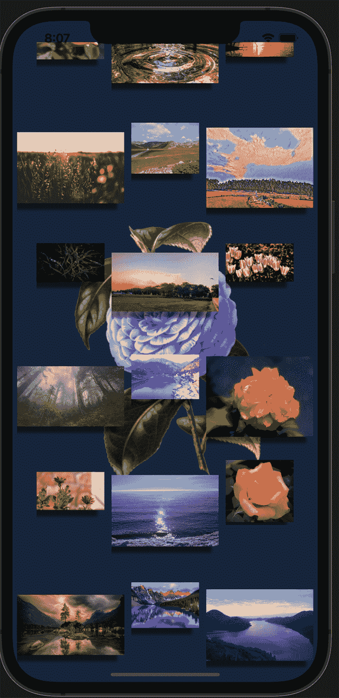

# 使用 React 本地图像组件显示图像

> 原文：<https://blog.logrocket.com/displaying-images-with-the-react-native-image-component/>

在一个由产品的美学价值决定的时代，图像对于传达产品的独特性至关重要。图像有助于传达我们所制造的产品的理念、解决方案和特性。

作为开发人员，我们必须拥有最好的工具来实现这些品质——这就是 React Native `Image`组件赋予我们的能力。在本文中，我们将深入 React Native `Image`组件的基础知识，讨论可用的类型和属性，并讨论它的局限性和替代方案。

## 图像类型

在我们深入研究 image 组件的细节之前，让我们回顾一下我们为移动应用程序准备的各种类型的图像，特别是 React Native `Image`组件期望的图像类型。

*   本地图像:用户设备上可用的图像，可以临时使用，也可以在相机胶卷中找到
*   网络图像:通过网络传送的图像，例如从 Google 找到并加载的图像
*   静态资源:设备中始终相同的可用资源——它们既不是动态加载的，也不会改变

## 性能

React Native `Image`组件提供了一些属性，您可以根据团队的业务或技术需求来配置组件和显示图像。它们有很多，但是我们现在只关注基本的。

### `source`

这是告诉组件关于您想要加载的图像的主要属性。您可以在这里使用本地或远程文件，基本上，只需传递图像的 URI 来加载它。如果您需要指定图像的宽度和高度尺寸，您也可以通过它传递多个 URIs，并让设备选择最好的一个来使用。

`source`也将接受一个 cache 属性，告诉组件如何缓存网络图像，但这只适用于 iOS。

### `defaultSource`

当您的组件希望加载网络映像时，此属性非常有用。可以指定默认映像，该映像将一直加载，直到网络映像可用。

### `resizeMode`

此道具控制当图像尺寸不适合框架大小时如何调整图像。可用的值有:

*   `cover`:将图像的宽度和高度缩放至等于或大于视图的尺寸
*   `contain`:与 cover 属性相反，`contain`缩放图像的宽度和高度，使其等于或小于视图的大小
*   `stretch`:独立缩放宽度和高度
*   `repeat`:重复图像以覆盖视图，直到它被填满
*   `center`:在视图中沿两个维度居中显示图像
*   `style`:用于对图像组件进行样式化

如果你感兴趣，可以[浏览 React 原生文档中的其他道具](https://reactnative.dev/docs/image#resizemode)。

### React Native 中的背景图像

CSS 通常是用于添加背景图像的语言，但 React Native 提供了一个`ImageBackground`组件，使类似的功能在 web 应用程序中可用。`ImageBackground`组件也接受与`Image`组件相同的属性。

## 使用反应本机映像组件

现在我们已经讨论了理论，让我们用一个演示来实践一下。首先，您需要使用[这个 React 本地环境设置](https://reactnative.dev/docs/environment-setup)。对于本教程，我遵循 Expo 安装和设置说明。

如果您愿意跟随，您可以[克隆这个库](https://github.com/themmyloluwaa/rn-images)并签出到`startup`分支。最终代码在`main`分支中。

首先，让我们给应用程序添加一个背景图片。对于这个演示，我在`src/assets`目录中添加了一个名为“static-image”的图像。我们将使用它来演示 React 本机如何加载静态图像。

打开`App.js` 并添加以下代码:

```
import { StatusBar } from "expo-status-bar";
import React from "react";
import { StyleSheet, Text, View, ImageBackground } from "react-native";

const staticImage = require("./src/assets/static-image.png");
export default function App() {
 return (
   <View style={styles.container}>
     <ImageBackground source={staticImage} style={styles.ImageBackground}>
       <StatusBar style="auto" />
       {/* TODO: something goes here  */}
     </ImageBackground>
   </View>
 );
}

const styles = StyleSheet.create({
 container: {
   flex: 1,
   backgroundColor: "#fff",
   alignItems: "center",
   justifyContent: "center",
 },
 ImageBackground: {
   flex: 1,
   resizeMode: "cover",
   width: "100%",
   alignItems: "center",
 },

});

```

如您所见，我们导入了`ImageComponent`，然后将静态图像的位置存储在一个名为`staticImage**.**`的变量中。CommonJS 语法用于告诉`metro`服务器何时在应用程序包中加载图像。`require`语句告诉`metro`服务器将图像包含在包中。

然后，我们将所有子组件包装在`ImageBackground`组件中，并指定样式。为了确保我们的风格翻译，图像应该覆盖整个视图-指定我们写“100%宽度”-所有的孩子应该对齐和中心对齐。

接下来，将包含在`images`文件中的`image`数组导入到`src`中。还要从 React Native 导入`ScrollView`、Image 和`ActivityIndicator`组件。

将此语句添加到您的`App.js`函数中的`return`语句之前，如下所示:

```
const [loading, setLoading] = React.useState(false);

```

这用于存储每个图像的加载状态。稍后我们将使用它来显示一个加载组件。

然后，用以下代码替换待办事项部分:

```
<ScrollView
         style={styles.ImageContainer}
         contentContainerStyle={{
           flexDirection: "row",
           flexWrap: "wrap",
           justifyContent: "center",
         }}
         horizontal={false}
       >
         {IMAGES.map((image, i) => {
           return (
             <View
               style={{
                 padding: 5,
               }}
               key={i}
             >
               <Image
                 source={{ uri: image }}
                 style={[
                   styles.Image,
                   {
                     width: i % 2 === 1 ? 150 : 95,
                     height: i % 2 === 1 ? 150 : 95,
                   },
                 ]}
                 resizeMode="center"
                 onLoadStart={() => setLoading(true)}
                 onLoadEnd={() => setLoading(false)}
               />
               {loading && <ActivityIndicator color="green" size="large" />}
             </View>
           );
         })}
       </ScrollView>

```

`image`数组包含大量超出屏幕当前视窗的图像，所以我们将使用`ScrollView`组件而不是普通的`View`来确保用户可以在视窗内滚动到应用程序的其他部分。样式告诉`ScrollView`组件包装所有图像，使它们很好地堆叠在一起，并在一行而不是默认列中显示图像。

`image`数组是循环的，我将数组中包含的图像传递给`source`道具中的`uri`键。我还应用了不同的宽度和高度，这取决于图像的索引是奇数还是偶数。`resizeMode`集合告诉图像组件将图像沿视图的两个维度居中。

最后，我应用样式并使用图像组件的`onLoadStart` 和`onLoadEnd` 道具获得图像加载状态。

最后，我使用图像的加载状态来呈现一个`ActivityIndicator`组件，它将在图像加载时显示。

将这些样式添加到`style`对象:

```
ImageContainer: {
   marginHorizontal: 16,
   marginTop: 30,
   width: "100%",
 },
 Image: {
   shadowColor: "black",
   shadowOffset: {
     width: -10,
     height: 9,
   },
   shadowOpacity: 0.5,
   shadowRadius: 2,
   elevation:5
 },

```

然后，应用`elevation`和`shadow`样式给图像一个阴影效果。Android 将使用仰角样式，而 iOS 将使用阴影属性。这是我们的最终产品:



## 限制

虽然 React Native `Image`组件配备了一些令人惊叹的功能，但是在使用它时，仍然会遇到一些限制。

### 渐进图像加载

截至本文发布时，React Native `Image`还不支持渐进式图像加载特性。要做到这一点，你需要一个外部映像包或者[自己建立一个](https://medium.com/react-native-training/progressive-image-loading-in-react-native-e7a01827feb7)。

### 图像格式

`Image`组件仅支持以下图像格式:

*   PNG
*   JPG/JPEG
*   位图文件的扩展名(Bitmap)
*   GIF 格式
*   WEBP
*   私营部门司(仅监督办)

如果您的项目需要扩展到这些支持的格式之外，这将不是适合您的组件。

## 结论

我们已经了解了 React Native `Image`组件的惊人功能，尤其是它如何使我们能够与用户进行可视化交流。使用这个组件我们可以实现很多事情——您甚至可以构建另一个高级图像组件来解决我们讨论过的一些限制！所以，年轻的学徒们，我给你们提供了塑造银河系所需要的一切。

如果你卡住了，有任何问题或更正，或者你只是想保持联系，不要犹豫，在 Twitter 上联系我。愿原力与你同在！

## [LogRocket](https://lp.logrocket.com/blg/react-native-signup) :即时重现 React 原生应用中的问题。

[](https://lp.logrocket.com/blg/react-native-signup)

[LogRocket](https://lp.logrocket.com/blg/react-native-signup) 是一款 React 原生监控解决方案，可帮助您即时重现问题、确定 bug 的优先级并了解 React 原生应用的性能。

LogRocket 还可以向你展示用户是如何与你的应用程序互动的，从而帮助你提高转化率和产品使用率。LogRocket 的产品分析功能揭示了用户不完成特定流程或不采用新功能的原因。

开始主动监控您的 React 原生应用— [免费试用 LogRocket】。](https://lp.logrocket.com/blg/react-native-signup)

## 进一步阅读