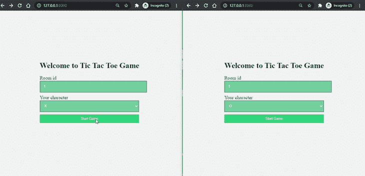
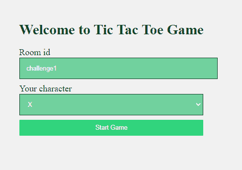
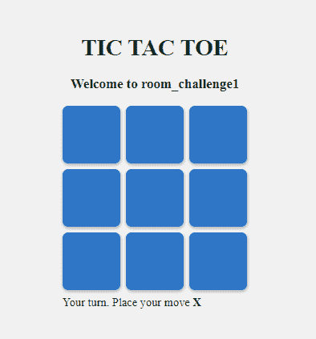

# Django 频道和 WebSockets - LogRocket 博客

> 原文：<https://blog.logrocket.com/django-channels-and-websockets/>

在 Django 于 2005 年首次发布后的十多年里，页面大多是静态的，AJAX 只在有限的用例中使用，事情相对来说并不复杂。在过去的五年中，实时 web 应用程序不断发展，趋向于更多的客户端-服务器和点对点交互。这种类型的通信可以通过 [WebSockets](https://blog.logrocket.com/websockets-tutorial-how-to-go-real-time-with-node-and-react-8e4693fbf843/) 实现，这是一种新的协议，它提供全双工通信，并在客户端和服务器之间保持持久、开放的连接。

Django Channels 以类似于传统 HTTP 视图的方式促进了 Django 中 WebSockets 的支持。它包装了 Django 的原生异步视图支持，让 Django 项目不仅可以处理 HTTP，还可以处理需要长时间运行连接的协议，比如 WebSockets、MQTT、chatbots 等。

在本教程中，我们将向您展示如何使用 Django 通道创建实时应用程序。为了用一个真实的例子来演示，我们将创建一个双人井字游戏，如下图所示。你可以在我的 [GitHub 库](https://github.com/krazygaurav/Django-channels-Tic-Tac-Toe)中访问完整的源代码。



## 配置 Django 项目

按照下面列出的步骤来配置 Django 项目。

首先，安装 Django 和通道。您还必须安装`channels_redis`，以便 channels 知道如何与 Redis 接口。

运行以下命令:

```
pip install django==3.1
pip install channels==3.0
pip install channels_redis==3.2

```

你应该用 pip3 for Linux/mac 而不是 pip，用 python3 代替 python。我在本指南中使用了`django==3.1`和`channels==3.0`、`channels_redis==3.2.0`。

启动 Django 项目:

```
django-admin startproject tic_tac_toe

```

接下来，创建一个名为`game`的应用程序:

```
python manage.py startapp game

```

在您的`settings.py`内的`INSTALLED_APPS`中添加`channels`和`game`:

```
## settings.py
INSTALLED_APPS = [
    'django.contrib.admin',
    'django.contrib.auth',
    'django.contrib.contenttypes',
    'django.contrib.sessions',
    'django.contrib.messages',
    'django.contrib.staticfiles',
    'channels',
    'game'
]

```

运行`migrate`以应用未应用的迁移:

```
python manage.py migrate 
```

另外，在您的`settings.py`中添加`STATICFILES_DIRS`:

```
## settings.py
import os
STATICFILES_DIRS = [
    os.path.join(BASE_DIR, "static"),
]

```

现在是时候为 Django 项目创建必要的文件了。在整个指南中，您可以参考以下目录结构:

```
├── db.sqlite3
├── game
│   ├── consumers.py
│   ├── routing.py
│   ├── templates
│   │   ├── base.html
│   │   ├── game.html
│   │   └── index.html
│   └── views.py
├── manage.py
├── requirements.txt
├── static
│   ├── css
│   │   └── main.css
│   └── js
│       └── game.js
└── tic_tac_toe
    ├── __init__.py
    ├── asgi.py
    ├── settings.py
    ├── urls.py
    └── wsgi.py

```

## 集成 Django 通道库

现在让我们将通道集成到 Django 项目中。

Django >2 没有内置的 ASGI 支持，所以您需要使用 Channel 的后备方案。

如下图所示更新`asgi.py`:

```
## tic_tac_toe/asgi.py
import os

import django
from channels.http import AsgiHandler
from channels.routing import ProtocolTypeRouter

os.environ.setdefault('DJANGO_SETTINGS_MODULE', 'tic_tac_toe.settings')
django.setup()

application = ProtocolTypeRouter({
  "http": AsgiHandler(),
  ## IMPORTANT::Just HTTP for now. (We can add other protocols later.)
})

```

更新`settings.py`,并通过以下更改将 Django 应用程序从 WSGI 更改为 ASGI。这将使通道指向根路由配置。

```
## settings.py
# WSGI_APPLICATION = 'tic_tac_toe.wsgi.application'
# Channels
ASGI_APPLICATION = "tic_tac_toe.asgi.application"

```

接下来，启用[通道层](https://channels.readthedocs.io/en/stable/tutorial/part_2.html#enable-a-channel-layer)，这允许多个消费者实例相互对话。

请注意，您可以将 Redis 作为后备存储。要启用 Redis，您可以使用方法 1(如果您想要 Redis Cloud)或方法 2(对于本地 Redis)。在本指南中，我使用了方法 3 — `In-memory channel layer` —这有助于测试和本地开发。

要启用通道层，在`settings.py`中添加以下`CHANNEL_LAYERS`:

```
## settings.py
CHANNEL_LAYERS = {
    'default': {
        ### Method 1: Via redis lab
        # 'BACKEND': 'channels_redis.core.RedisChannelLayer',
        # 'CONFIG': {
        #     "hosts": [
        #       'redis://h:<password>;@<redis Endpoint>:<port>' 
        #     ],
        # },

        ### Method 2: Via local Redis
        # 'BACKEND': 'channels_redis.core.RedisChannelLayer',
        # 'CONFIG': {
        #      "hosts": [('127.0.0.1', 6379)],
        # },

        ### Method 3: Via In-memory channel layer
        ## Using this method.
        "BACKEND": "channels.layers.InMemoryChannelLayer"
    },
}

```

请确保 channels development server 正常工作。运行以下命令:

```
python manage.py runserver
```

## 设计索引页面

让我们从构建索引页面开始，这里要求用户输入房间代码和字符选择(X 或 O)。

在`game/views.py`中创建基于功能的视图:

```
# game/views.py
from django.shortcuts import render, redirect

def index(request):
    if request.method == "POST":
        room_code = request.POST.get("room_code")
        char_choice = request.POST.get("character_choice")
        return redirect(
            '/play/%s?&choice=%s' 
            %(room_code, char_choice)
        )
    return render(request, "index.html", {})

```

接下来，在`tic_tac_toe/urls.py`中为索引视图创建路线:

```
## urls.py
from django.urls import path
from game.views import index

urlpatterns = [
    ## ... Other URLS
    path('', index),
]

```

现在，在`game/templates/base.html`中创建基础模板(如果已经创建，请忽略)。此模板将被其他模板视图继承。

```
 base.html 

<!DOCTYPE html>
<html lang="en">
<head>
    <meta charset="UTF-8">
    <meta name="viewport" content="width=device-width, initial-scale=1.0">
    <title>Tic Tac Toe</title>
     <link rel='stylesheet' href=''>
</head>
<body>


<script src = ""></script>


</body>
</html>
```

为`game/templates/index.html`中的索引视图创建视图模板:

```
 index.html 



<div class="wrapper">
  <h1>Welcome to Tic Tac Toe Game</h1>
  <form method="POST">
    
    <div class='form-control'>
      <label for="room">Room id</label>
      <input id="room" type="text" name="room_code" required />
    </div>
    <div class='form-control'>
      <label for="character_choice">Your character</label>
      <select for="character_choice" name = "character_choice">
      <option value="X">X</option>
      <option value="O">O</option>
      </select>
    </div>
    <input type="submit" class="button" value="Start Game" />
</div>
</form>


```

启动 Django 开发服务器并导航到 [http://127.0.0.1:8000](http://127.0.0.1:8000) 以检查索引页面是否工作正常:



## 设计游戏页面

既然索引页面已经完成，让我们来构建游戏页面。

从创建`game/views.py`开始:

```
## game/views.py
from django.shortcuts import render, redirect
from django.http import Http404

def game(request, room_code):
    choice = request.GET.get("choice")
    if choice not in ['X', 'O']:
        raise Http404("Choice does not exists")
    context = {
        "char_choice": choice, 
        "room_code": room_code
    }
    return render(request, "game.html", context)

```

添加上面视图的 URL 路由:

```
## urls.py
from django.urls import path
from game.views import game

urlpatterns = [
    ## other url routes
    path('play/<room_code>', game),
]

```

既然后端已经完成，让我们创建游戏板的前端。下面是`game/templates/game.html` Django 模板:

```

 game.html 



<div class="wrapper">
    <div class="head">
        <h1>TIC TAC TOE</h1>
        <h3>Welcome to room_{{room_code}}</h3>
    </div>
    <div id = "game_board" room_code = {{room_code}} char_choice = {{char_choice}}>
        <div class="square" data-index = '0'></div>
        <div class="square" data-index = '1'></div>
        <div class="square" data-index = '2'></div>
        <div class="square" data-index = '3'></div>
        <div class="square" data-index = '4'></div>
        <div class="square" data-index = '5'></div>
        <div class="square" data-index = '6'></div>
        <div class="square" data-index = '7'></div>
        <div class="square" data-index = '8'></div>
    </div>
    <div id = "alert_move">Your turn. Place your move <strong>{{char_choice}}</strong></div>
</div>


```

为了使网格和索引页面看起来更好，添加 CSS，如下所示:

```
/* static/css/main.css */
body {
    /* width: 100%; */
    height: 90vh;
    background: #f1f1f1;
    display: flex;
    justify-content: center;
    align-items: center;
}
#game_board {
    display: grid;
    grid-gap: 0.5em;
    grid-template-columns: repeat(3, 1fr);
    width: 16em;
    height: auto;
    margin: 0.5em 0;
}
.square{
    background: #2f76c7;
    width: 5em;
    height: 5em;
    display: flex;
    justify-content: center;
    align-items: center;
    border-radius: 0.5em;
    font-weight: 500;
    color: white;
    box-shadow: 0.025em 0.125em 0.25em rgba(0, 0, 0, 0.25);
}
.head{
    width: 16em;
    text-align: center; 
}
.wrapper h1, h3 {
    color: #0a2c1a;
}
label {
    font-size: 20px;
    color: #0a2c1a;
}
input, select{
    margin-bottom: 10px;
    width: 100%;
    padding: 15px;
    border: 1px solid #125a33;
    font-size: 14px;
    background-color: #71d19e;
    color: white;
}
.button{
    color: white;
    white-space: nowrap;
    background-color: #31d47d;
    padding: 10px 20px;
    border: 0;
    border-radius: 2px;
    transition: all 150ms ease-out;
}

```

当您运行开发服务器时，您将看到游戏板，如下所示:



## 向 Django 应用程序添加 WebSockets

现在页面已经创建好了，让我们给它添加 WebSockets。

在`game/consumers.py`中输入以下代码:

```
## game/consumers.py
import json
from channels.generic.websocket import AsyncJsonWebsocketConsumer

class TicTacToeConsumer(AsyncJsonWebsocketConsumer):
    async def connect(self):
        self.room_name = self.scope['url_route'\]['kwargs']['room_code']
        self.room_group_name = 'room_%s' % self.room_name

        # Join room group
        await self.channel_layer.group_add(
            self.room_group_name,
            self.channel_name
        )
        await self.accept()

    async def disconnect(self, close_code):
        print("Disconnected")
        # Leave room group
        await self.channel_layer.group_discard(
            self.room_group_name,
            self.channel_name
        )

    async def receive(self, text_data):
        """
        Receive message from WebSocket.
        Get the event and send the appropriate event
        """
        response = json.loads(text_data)
        event = response.get("event", None)
        message = response.get("message", None)
        if event == 'MOVE':
            # Send message to room group
            await self.channel_layer.group_send(self.room_group_name, {
                'type': 'send_message',
                'message': message,
                "event": "MOVE"
            })

        if event == 'START':
            # Send message to room group
            await self.channel_layer.group_send(self.room_group_name, {
                'type': 'send_message',
                'message': message,
                'event': "START"
            })

        if event == 'END':
            # Send message to room group
            await self.channel_layer.group_send(self.room_group_name, {
                'type': 'send_message',
                'message': message,
                'event': "END"
            })

    async def send_message(self, res):
        """ Receive message from room group """
        # Send message to WebSocket
        await self.send(text_data=json.dumps({
            "payload": res,
        }))

```

为游戏应用程序创建一个路由配置，该配置具有到消费者的路由。创建一个新文件`game/routing.py`并粘贴以下代码:

```
## game/routing.py
from django.conf.urls import url
from game.consumers import TicTacToeConsumer

websocket_urlpatterns = [
    url(r'^ws/play/(?P<room_code>\w+)/$', TicTacToeConsumer.as_asgi()),
]

```

下一步是将根路由配置指向`game.routing`模块。更新`tic_tac_toe/asgi.py`如下:

```
## tic_tac_toe/asgi.py
import os

from django.core.asgi import get_asgi_application
from channels.auth import AuthMiddlewareStack
from channels.routing import ProtocolTypeRouter, URLRouter
import game.routing

os.environ.setdefault('DJANGO_SETTINGS_MODULE', 'tic_tac_toe.settings')

# application = get_asgi_application()
application = ProtocolTypeRouter({
    "http": get_asgi_application(),
    "websocket": AuthMiddlewareStack(
        URLRouter(
            game.routing.websocket_urlpatterns
        )
    ),
})

```

让我们通过创建 JavaScript 来构建代码的最后一部分，JavaScript 是与服务器异步对话的客户端。将以下代码放入`static/js/game.js`:

```
// static/js/game.js

var roomCode = document.getElementById("game_board").getAttribute("room_code");
var char_choice = document.getElementById("game_board").getAttribute("char_choice");

var connectionString = 'ws://' + window.location.host + '/ws/play/' + roomCode + '/';
var gameSocket = new WebSocket(connectionString);
// Game board for maintaing the state of the game
var gameBoard = [
    -1, -1, -1,
    -1, -1, -1,
    -1, -1, -1,
];
// Winning indexes.
winIndices = [
    [0, 1, 2],
    [3, 4, 5],
    [6, 7, 8],
    [0, 3, 6],
    [1, 4, 7],
    [2, 5, 8],
    [0, 4, 8],
    [2, 4, 6]
]
let moveCount = 0; //Number of moves done
let myturn = true; // Boolean variable to get the turn of the player.

// Add the click event listener on every block.
let elementArray = document.getElementsByClassName('square');
for (var i = 0; i < elementArray.length; i++){
    elementArray[i].addEventListener("click", event=>{
        const index = event.path[0].getAttribute('data-index');
        if(gameBoard[index] == -1){
            if(!myturn){
                alert("Wait for other to place the move")
            }
            else{
                myturn = false;
                document.getElementById("alert_move").style.display = 'none'; // Hide
                make_move(index, char_choice);
            }
        }
    })
}

// Make a move
function make_move(index, player){
    index = parseInt(index);
    let data = {
        "event": "MOVE",
        "message": {
            "index": index,
            "player": player
        }
    }

    if(gameBoard[index] == -1){
        // if the valid move, update the gameboard
        // state and send the move to the server.
        moveCount++;
        if(player == 'X')
            gameBoard[index] = 1;
        else if(player == 'O')
            gameBoard[index] = 0;
        else{
            alert("Invalid character choice");
            return false;
        }
        gameSocket.send(JSON.stringify(data))
    } 
    // place the move in the game box.
    elementArray[index].innerHTML = player;
    // check for the winner
    const win = checkWinner();
    if(myturn){
        // if player winner, send the END event.
        if(win){
            data = {
                "event": "END",
                "message": `${player} is a winner. Play again?`
            }
            gameSocket.send(JSON.stringify(data))
        }
        else if(!win && moveCount == 9){
            data = {
                "event": "END",
                "message": "It's a draw. Play again?"
            }
            gameSocket.send(JSON.stringify(data))
        }
    }
}

// function to reset the game.
function reset(){
    gameBoard = [
        -1, -1, -1,
        -1, -1, -1,
        -1, -1, -1,
    ]; 
    moveCount = 0;
    myturn = true;
    document.getElementById("alert_move").style.display = 'inline';        
    for (var i = 0; i < elementArray.length; i++){
        elementArray[i].innerHTML = "";
    }
}

// check if their is winning move
const check = (winIndex) => {
    if (
      gameBoard[winIndex[0]] !== -1 &&
      gameBoard[winIndex[0]] === gameBoard[winIndex[1]] &&
      gameBoard[winIndex[0]] === gameBoard[winIndex[2]]
    )   return true;
    return false;
};

// function to check if player is winner.
function checkWinner(){
    let win = false;
    if (moveCount >= 5) {
      winIndices.forEach((w) => {
        if (check(w)) {
          win = true;
          windex = w;
        }
      });
    }
    return win;
}

// Main function which handles the connection
// of websocket.
function connect() {
    gameSocket.onopen = function open() {
        console.log('WebSockets connection created.');
        // on websocket open, send the START event.
        gameSocket.send(JSON.stringify({
            "event": "START",
            "message": ""
        }));
    };

    gameSocket.onclose = function (e) {
        console.log('Socket is closed. Reconnect will be attempted in 1 second.', e.reason);
        setTimeout(function () {
            connect();
        }, 1000);
    };
    // Sending the info about the room
    gameSocket.onmessage = function (e) {
        // On getting the message from the server
        // Do the appropriate steps on each event.
        let data = JSON.parse(e.data);
        data = data["payload"];
        let message = data['message'];
        let event = data["event"];
        switch (event) {
            case "START":
                reset();
                break;
            case "END":
                alert(message);
                reset();
                break;
            case "MOVE":
                if(message["player"] != char_choice){
                    make_move(message["index"], message["player"])
                    myturn = true;
                    document.getElementById("alert_move").style.display = 'inline';       
                }
                break;
            default:
                console.log("No event")
        }
    };

    if (gameSocket.readyState == WebSocket.OPEN) {
        gameSocket.onopen();
    }
}

//call the connect function at the start.
connect();

```

现在我们终于完成了编码，准备好玩我们的井字游戏了！

## 结论

我们在本教程中讨论了很多主题:Django 通道、WebSockets 和一些前端。我们的游戏到目前为止只有最基本的功能。欢迎您使用新的基础知识进行试验，并为其添加更多功能。您可以做的其他练习包括:

*   添加用户验证
*   显示在线用户
*   向数据库添加游戏数据
*   通过添加 Redis 而不是内存通道层使应用程序可伸缩
*   添加人工智能

查看我的 [GitHub 库](https://github.com/krazygaurav/Django-channels-Tic-Tac-Toe)，获取本例中使用的完整源代码。

## 使用 [LogRocket](https://lp.logrocket.com/blg/signup) 消除传统错误报告的干扰

[](https://lp.logrocket.com/blg/signup)

[LogRocket](https://lp.logrocket.com/blg/signup) 是一个数字体验分析解决方案，它可以保护您免受数百个假阳性错误警报的影响，只针对几个真正重要的项目。LogRocket 会告诉您应用程序中实际影响用户的最具影响力的 bug 和 UX 问题。

然后，使用具有深层技术遥测的会话重放来确切地查看用户看到了什么以及是什么导致了问题，就像你在他们身后看一样。

LogRocket 自动聚合客户端错误、JS 异常、前端性能指标和用户交互。然后 LogRocket 使用机器学习来告诉你哪些问题正在影响大多数用户，并提供你需要修复它的上下文。

关注重要的 bug—[今天就试试 LogRocket】。](https://lp.logrocket.com/blg/signup-issue-free)