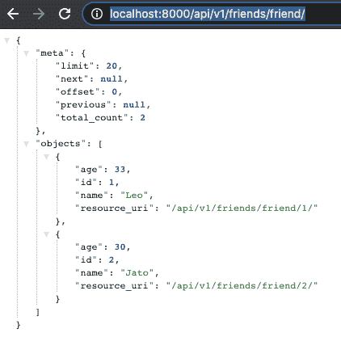
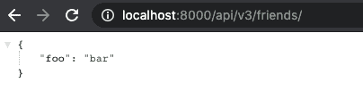

# Django REST 框架替代方案

> 原文：<https://blog.logrocket.com/django-rest-framework-alternatives/>

在本教程中，我们将向您介绍一些用于构建 web APIs 的 Django REST 框架的替代方案。我们将关注三个支持使用 RESTful API 扩展应用程序的库，这些 API 使用 HTTP 请求来访问和使用数据:Django Tastypie、RESTful 和 Django JSON View。

我们将详细介绍以下内容:

## 姜戈是什么？

Django 是一个基于 Python 的免费开源 web 框架，遵循模型-模板-视图架构模式。它减少了与 web 开发相关的麻烦，因此您可以专注于编写应用程序，而不是重新发明轮子。

## 什么是 REST API？

REST API 是系统公开有用函数和数据的一种流行方式。REST 代表表述性状态转移，可以由一个或多个资源组成，这些资源可以在给定的 URL 上访问，并以各种格式返回，如 JSON、images、HTML 等。

RESTful APIs 使用 HTTP 请求来访问数据。该数据可用于`GET`、`PUT`、`POST`和`DELETE`数据类型，是指对资源的读取、更新、创建和删除操作。这些被称为[积垢操作](https://blog.logrocket.com/building-the-simplest-crud-out-there-with-entity-management/)。REST API 的数据格式还可以包括 application、JSON application、XML 等。

## 什么是 Django REST 框架？

Django REST 框架(DFR) 是一个用于构建 Web APIs 的强大而灵活的工具包。它的主要好处是使[序列化](https://blog.logrocket.com/rust-serialization-whats-ready-for-production-today/)更加容易。

Django REST 框架基于 Django 基于类的视图，所以如果你熟悉 Django，这是一个很好的选择。它采用了基于类的视图、表单、模型验证器、QuerySet 等实现。

## 应该使用 Django REST 框架吗？

如果您不太熟悉 Django 原则，那么在您花时间学习一个新的 web 框架之前，您可能想要探索其他选择。在本指南中，我们将回顾 Django REST 框架的最佳替代工具。

为了演示，我构建了一个小型的基本应用程序来存储我朋友的姓名和年龄。我们将把 RESTful API 框架与这个应用程序集成在一起。

您可以从 [GitHub](https://github.com/Timtech4u/django-rest-alts) 中克隆我们的演示 Django 应用程序的代码。代码片段也可以在现有项目中无缝工作。

## Django REST 框架备选方案

三个最流行的 Django REST 框架是 Django Tastypie、Django REST 和`django-jsonview`。我们将详细检查每一个。

### Django Tastypie

Django Tastypie 是 Django 的一个 webservice API 框架，它为创建 REST 风格的接口提供了一个方便、强大且高度可定制的抽象。这是一个完美的解决方案，如果你:

*   需要一个 RESTful 的 API 并且很好地使用 HTTP
*   想要支持深厚的关系
*   不想编写自己的序列化程序来使输出正确
*   想要一个没有什么魔力、非常灵活并且很好地映射到问题领域的 API 框架
*   需要与 JSON 同等对待的 XML 序列化(YAML 也是如此)

要安装 Django Tastypie:

```
$ pip install django-tastypie

```

这里有一个 Django Tastypie 代码示例:

```
# api/tastypie_resources.py
from tastypie.resources import ModelResource
from .models import Friend

class FriendResource(ModelResource):
    class Meta:
        queryset = Friend.objects.all()

# urls.py
from django.urls import path, include

# Tastypie
from tastypie.api import Api
from api.tastypie_resources import FriendResource
v1_api = Api(api_name='friends')
v1_api.register(FriendResource())

urlpatterns = [
    path(r'api/v1/', include(v1_api.urls)),
]

```

访问您的本地主机，查看来自 API 的 JSON 响应:



### 姜戈不安分

Django restful 是一个用于 Python 的轻量级 REST 迷你框架。它与 Django、Flask、Pyramid 和 Tornado 配合得很好，对许多其他 Python web 框架也很有用。不宁有一个小，灵活，快速的代码库，默认输出为 JSON。

django restful 提供了 REST 框架的新观点。当其他框架试图变得非常完整，包括特殊功能或与 ORM 紧密结合时，restful 专注于基础。

要安装 Django 不宁:

```
$ pip install restless

```

下面是 Django Restless 代码示例:

```
# api/restless_resources.py
from restless.dj import DjangoResource
from restless.preparers import FieldsPreparer
from .models import Friend

class FriendResource(DjangoResource):
    preparer = FieldsPreparer(fields={
        'id': 'id',
        'age': 'age',
        'name': 'name',
    })
    # GET /api/v2/friends/
    def list(self):
        return Friend.objects.all()
    # GET /api/v2/friends/<pk>/ 
    def detail(self, pk):
        return Friend.objects.get(id=pk)

# urls.py
from django.urls import path, include

# Restless
from api.restless_resources import FriendResource

urlpatterns = [
    path(r'api/v2/friends/', include(FriendResource.urls())),
]

```

您可以在本地主机上预览 JSON 响应。


### 姜戈-约翰逊景观

`[django-jsonview](https://github.com/jsocol/django-jsonview)`是一个简单的装饰器，它将 Python 对象翻译成 JSON，并确保您的视图总是返回 JSON。

只需要你给你的视图方法添加一个装饰器，它就会返回一个 JSON。

要安装`django-jsonview`:

```
$ pip install django-jsonview

```

下面是一个`django-jsonview`代码的例子:

```
# api/views.py

from jsonview.decorators import json_view

@json_view
def my_view(request):
    return {
        'foo': 'bar',
    }

# urls.py
from django.urls import path, include

# JSON View
from api.views import my_api_view
urlpatterns = [
    path(r'api/v3/friends/', my_api_view)
]

```

您可以在本地主机上预览 API 响应:



## 结论

在本文中，我们探讨了使用 Django 构建 RESTful APIs 的三种解决方案。

查看 Django 文档，了解关于 Django 包的更多信息，这些包用于[构建 API](https://djangopackages.org/grids/g/api/)和[restapi](https://djangopackages.org/grids/g/rest/)。

## 使用 [LogRocket](https://lp.logrocket.com/blg/signup) 消除传统错误报告的干扰

[](https://lp.logrocket.com/blg/signup)

[LogRocket](https://lp.logrocket.com/blg/signup) 是一个数字体验分析解决方案，它可以保护您免受数百个假阳性错误警报的影响，只针对几个真正重要的项目。LogRocket 会告诉您应用程序中实际影响用户的最具影响力的 bug 和 UX 问题。

然后，使用具有深层技术遥测的会话重放来确切地查看用户看到了什么以及是什么导致了问题，就像你在他们身后看一样。

LogRocket 自动聚合客户端错误、JS 异常、前端性能指标和用户交互。然后 LogRocket 使用机器学习来告诉你哪些问题正在影响大多数用户，并提供你需要修复它的上下文。

关注重要的 bug—[今天就试试 LogRocket】。](https://lp.logrocket.com/blg/signup-issue-free)