# 记录你的 Go 申请

> 原文：<https://blog.logrocket.com/dockerizing-go-application/>

## 介绍

在这篇文章中，我们将学习如何对一个 Go 应用程序进行 Dockerize。具体来说，我们将学习如何通过一个名为 Dockerfile 的文件在 Docker 容器中安装 Go。不要担心——我们将继续学习关于 Dockerfiles 的更多内容。

如果你不熟悉的话，Go 是一种开源的、静态类型的、编译的编程语言，可以让你构建简单、可靠、高效的软件。它用于构建 web 应用、云原生应用、CLI 等等——甚至 Docker 都是用 Go 编写的！

我们将创建一个最小的 Go 项目用于演示目的，并展示如何在 Docker 容器中公开本地文件夹以便于开发。这是为了让我们不必每次在 Go 应用程序中进行更改时都重新构建 Docker 容器。

*向前跳转:*

## 将应用归档的优势

Docker 是一个开源项目，允许开发人员将他们的应用程序与所有必要的依赖项、配置、脚本等打包在一起。并将它作为单个实体进行部署。这可以轻松地在称为容器的环境中自动部署应用程序，并允许这些应用程序轻松地在任何主机操作系统上运行。

这种方法的优势在于，我们不需要将应用程序部署在虚拟机中(这带来了一些与可用操作系统相关的瓶颈)，而是部署在 Docker 容器中，这样效率更高，因为它可以使用单个主机(在这种情况下，是一个 Linux 操作系统及其所有底层资源)来服务我们的应用程序。使用这种方法，我们不必关心如何部署应用程序或在哪里部署应用程序，因为我们不再需要考虑目标操作系统。

例如，虚拟机在来宾操作系统中运行应用程序。另一方面，容器为我们提供了一种沙盒方式来打包我们的应用程序，并从它实际运行的环境(即主机)中抽象出来。这使得用 Docker 构建的应用程序可以很容易地部署，而不用考虑目标操作系统。因此，开发人员可以更容易地创建可在任何地方运行的应用程序，并确保它们运行时不会出现问题，因为它们与主机操作系统的其余进程相隔离。

## 先决条件

对于这篇文章，我们需要熟悉的只是命令行和文本编辑器的基本用法，我们应该已经准备好了。以前有使用 Go 开发 web 应用程序的经验会有所帮助，但不是绝对必要的。要开始使用 Go，请查看[文档](https://go.dev/learn/)中的链接。

最后，请[在 DockerHub](https://hub.docker.com/signup) 上创建一个帐户，并根据您选择的操作系统将其安装在您的开发机器上。

## 设置我们的开发环境

要继续，我们需要根据我们的操作系统安装以下软件。

在这篇文章中，我们将使用 macOS。下载 Go 后，点击`.pkg`文件，解压你系统路径下的 Go 包，安装 Go。安装 Go 后，我们可以在终端中运行以下命令来确认版本:


之后，在本地机器上下载并安装 Docker 桌面。安装后 Docker 桌面的图像如下所示。

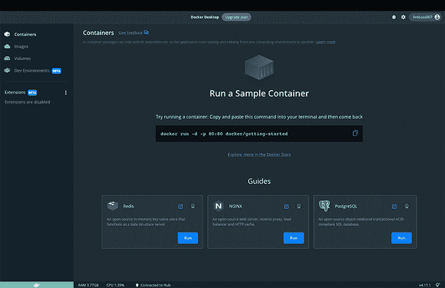

此外，为了确认我们的系统上安装了 Docker，我们可以运行以下命令:

```
docker --version

```

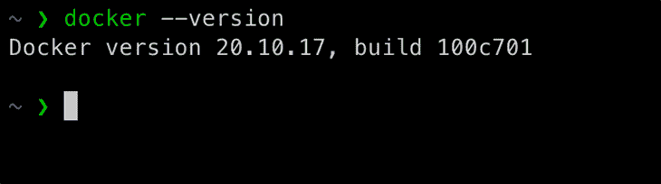

接下来，让我们开始启动一个最小的围棋应用程序，因为在这篇文章中，我们的重点不是学习围棋。首先，在本地机器的任意路径上创建一个新文件夹，并将其命名为`go-demo`。

```
mkdir go-docker-demo

```

导航到目录。

```
cd go-docker-demo

```

运行以下命令启动新的 Go 模块:

```
go mode init go-docker-demo

```

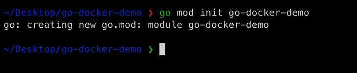

在代码编辑器中打开文件夹。在我们的项目文件夹中，创建一个名为`main.go`的文件，并将下面的代码粘贴到文件中。保存文件，见下文。

```
package main
import "fmt"

func main() {
    fmt.Println("Hello, World!")
}

```

要测试代码是否按预期运行，从终端运行`go run .`或`go run main.go`命令。输出如下所示。

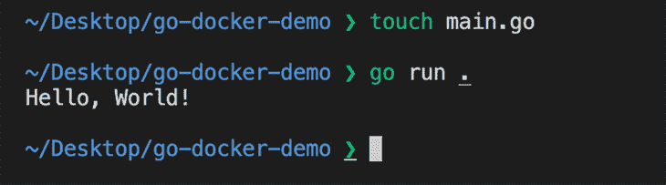

Now that all is working as expected, in the next section we will proceed to learn about creating Dockerfiles. Let’s proceed.

## Dockerfiles 简介

Docker 文件通常包含为程序构建 Docker 映像的必要指令。使用 CLI 上的`docker build`命令，我们可以创建一个连续执行几个命令行指令的自动化构建。

例如，我们可以利用带有`docker build`命令的`-f`标志来指向系统路径中任何地方的 docker 文件。该命令基于 Docker 文件中的指令构建 Docker 映像。

```
docker build -f /path/to/docker/file

```

为了给我们的应用程序创建 Dockerfile，在我们的项目的根目录下创建一个新的`Dockerfile`。

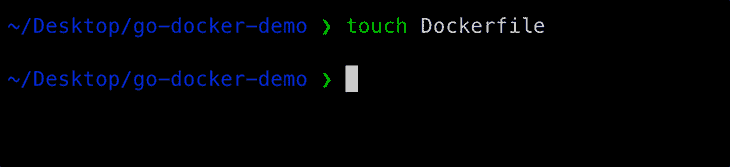

在`Dockerfile`中，继续编写为 Go 应用程序构建 Docker 映像所需的指令。在文件中添加一行，告诉 Docker 我们应该为我们的应用程序使用哪个基本图像。

```
FROM golang:1.16-alpine

```

这一行告诉我们的 Dockerfile 继承并使用`golang:1.16-alpine`图像作为我们自己的应用程序图像的基础图像。这个映像是一个已经托管和分发的官方 Go 映像，包含运行 Go 应用程序所需的所有工具和软件包。这意味着我们不必重新发明轮子并从头创建一个新的基础映像，而是扩展一个先前存在的标准映像来满足我们自己的映像需求。

接下来，我们可以继续为 docker 文件添加下一行。在下一节中，我们将检查每一行代表什么。

```
WORKDIR /app

COPY go.mod ./
RUN go mod download

COPY *.go ./

RUN go build -o /go-docker-demo

EXPOSE 8080

CMD [ "/go-docker-demo" ]

```

首先，`WORKDIR /app`行将在 Docker 映像中创建一个新目录。我们的想法是使用这个目录来存放我们的 Docker 映像，并在这个目录中运行我们的 Docker 命令，这样它就可以作为 Docker 容器中的源代码的新参考点。

接下来的两行，从 3-4，复制`go.mod`文件中的内容并粘贴到 app 目录中，这是我们 Docker 容器中的当前工作目录。正如我们所看到的，我们已经使用了`COPY`命令，它告诉 Docker 我们想要复制的文件的位置以及我们想要将它复制到的目的地。

接下来，我们要安装编译 Go 应用程序所需的模块。这一步发生在我们将上一步中的文件复制到项目文件夹中之后。`RUN`命令执行并将 Go 模块安装到映像内的目录中。

现在我们已经从 DockerHub 中提取了 Docker 映像，并在我们的`go.mod`和`go.sum`文件中安装了模块，下一步是将我们的源代码复制到映像中。正如我们在第 7 行看到的，我们基本上使用一个通配符将所有以`.go`扩展名结尾的文件复制到当前路径或工作目录中。这是 Docker 文件所在的目录，在 Docker 映像中。

下一步是像在本地一样构建我们的应用程序。为此，我们再次使用`RUN`命令。正如我们在第 9 行看到的，我们使用了`go build`命令来构建我们的 Go 应用程序。这将在 Docker 镜像的根目录下创建一个同名的 Go 二进制文件，就像我们在本地机器上运行`go build`时一样。

最后，是时候运行我们的 Docker 映像了。我们需要告诉 Docker 在使用映像启动容器时运行哪个命令。在上面 Dockerfile 文件的第 13 行，我们可以看到在同一个路径中带有二进制文件名称的`CMD`参数。这在 Docker 容器中运行我们的代码。

现在我们已经完成了设置，让我们继续下一步在容器中构建 Docker 映像。

## 为我们的应用程序构建 Docker 图像

Docker 映像包含 Docker 容器的配置，如环境变量、要运行的默认命令和其他元数据。映像还应该包含运行应用程序所需的一切，包括代码或二进制文件、运行时、依赖项以及所需的任何其他文件系统对象。

为了构建一个图像，我们使用`docker build`命令，它从`Dockerfile`创建一个 Docker 图像。进入终端，运行当前目录中的命令:

```
docker build -t go-docker-demo .

```

`-t`标志是帮助我们识别 Docker 形象的标签。请参见下面这个命令的输出。

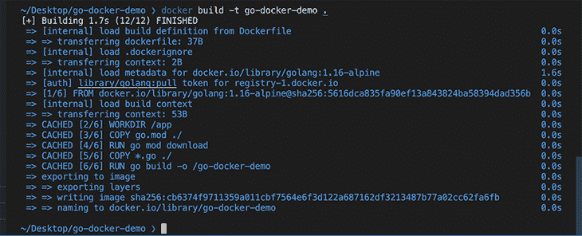

正如我们在上面看到的，我们已经成功地在容器中构建了 Docker 映像。为了进行验证，我们可以通过运行以下命令来查看容器内的图像:

```
docker image ls

```

输出如下所示。

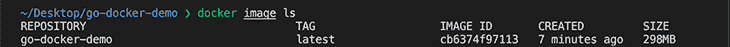

下一步，我们将运行我们的 Docker 映像。

## 在容器中运行我们的 Docker 图像

为了在容器内部运行我们的映像，我们可以使用`docker run`命令。它需要一个参数:图像名称。

让我们启动我们的映像，并确保它运行正常。在您的终端中运行以下命令。

```
docker run go-docker-demo    

```

要验证该命令的输出，以及我们的代码在 Docker 容器中像在本地一样正常运行，请执行以下操作:

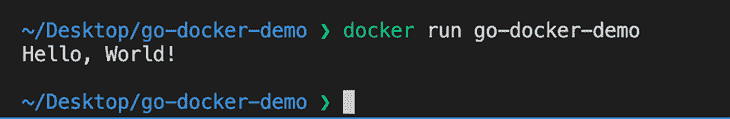

我们可以运行`docker ps`命令来显示我们机器上运行的容器列表。

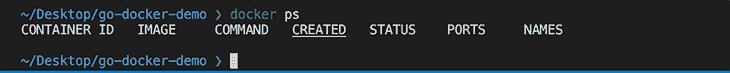

上面的图像表明我们没有看到图像运行——因为我们的应用程序不像一个持续运行的 web 服务器。对于持续运行的应用程序，我们会看到一个包含所有其他细节的持续运行的容器图像。

另一种确认方式是访问 Docker 桌面。导航到下面的屏幕查看日志。

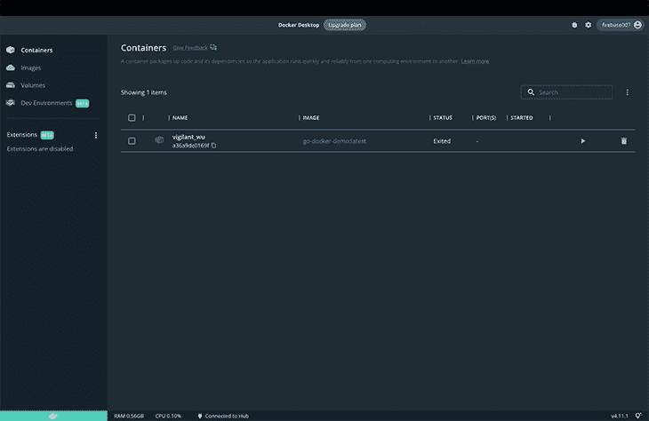

如果我们单击 Docker 映像并检查日志，我们可以看到我们的映像已经启动并正在运行。

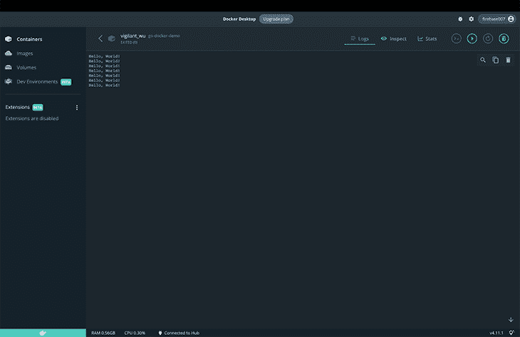

最后，我们可以使用 Docker 桌面应用程序中的 dev environment 选项在本地运行我们的容器作为一个完整的开发环境(尽管它目前处于公开测试阶段，所以可能会有一些细微的错误)。要尝试一下，导航到 Docker 桌面上的**创建开发环境**选项卡。

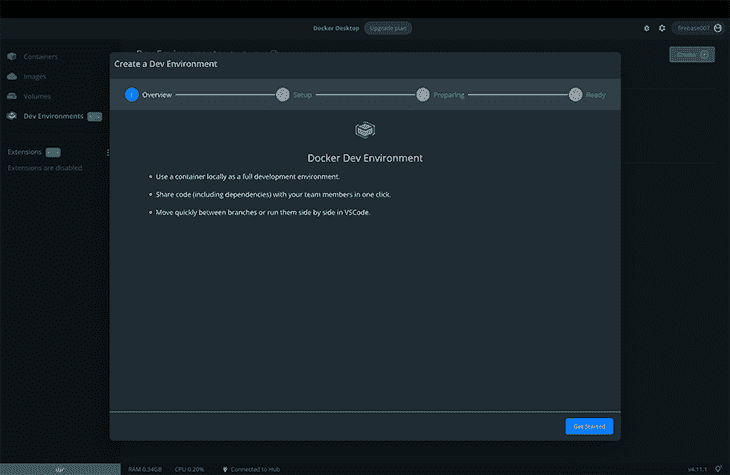

点击 **Get Started** 按钮，创建一个新的开发环境，选择 **Local Directory** 单选按钮。最后，添加本地存储库的路径。

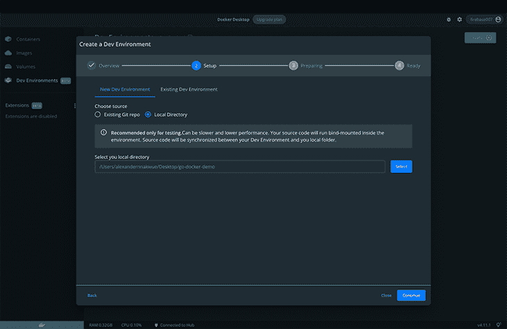

点击**继续**，等待开发环境构建完成。

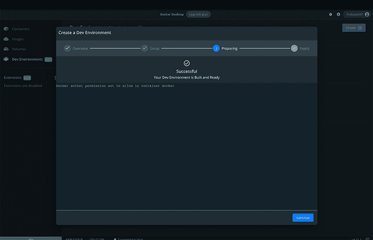

我们可以继续在代码编辑器中打开 Docker 图像。目前，它与 VS 代码集成。

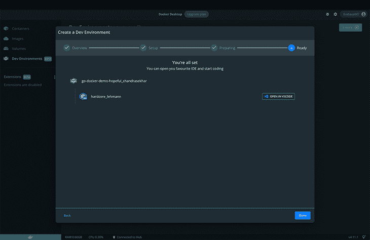

## 结论

在这篇文章中，我们学习了如何使用 DockerHub 中的标准 Go 基础映像对 Go 应用程序进行 Dockerize。我们已经经历了从设置基本的 Go 应用程序、设置 Docker 文件、理解 Docker 文件中的步骤、构建我们的 Docker 映像以及在 Docker 容器中运行我们的映像的所有步骤。

正如我们所看到的，由于 Docker 的重要性，它是一个与大多数代码基础设施设置相关的工具，其中一些我们已经在本文中概述过。Docker 容器的另一个优点是，它们使我们的应用程序更易于移植，因为我们可以更容易地重用和分发它们。它们还让开发人员对资源有更多的控制权，这可以更好地利用计算资源。

## 使用 [LogRocket](https://lp.logrocket.com/blg/signup) 消除传统错误报告的干扰

[](https://lp.logrocket.com/blg/signup)

[LogRocket](https://lp.logrocket.com/blg/signup) 是一个数字体验分析解决方案，它可以保护您免受数百个假阳性错误警报的影响，只针对几个真正重要的项目。LogRocket 会告诉您应用程序中实际影响用户的最具影响力的 bug 和 UX 问题。

然后，使用具有深层技术遥测的会话重放来确切地查看用户看到了什么以及是什么导致了问题，就像你在他们身后看一样。

LogRocket 自动聚合客户端错误、JS 异常、前端性能指标和用户交互。然后 LogRocket 使用机器学习来告诉你哪些问题正在影响大多数用户，并提供你需要修复它的上下文。

关注重要的 bug—[今天就试试 LogRocket】。](https://lp.logrocket.com/blg/signup-issue-free)