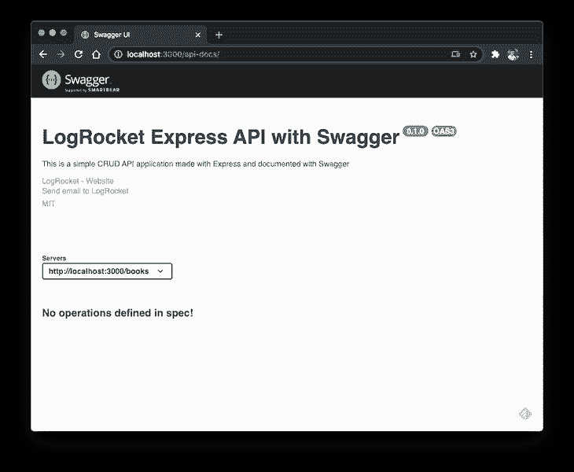
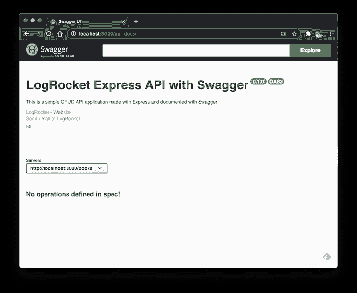
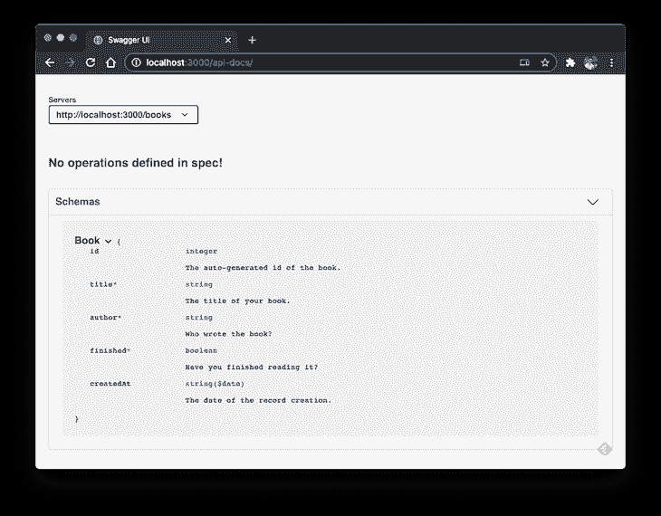
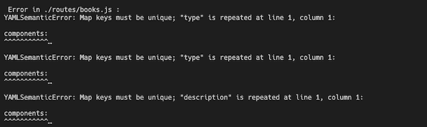
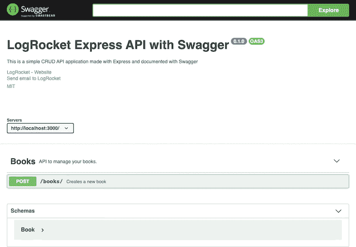
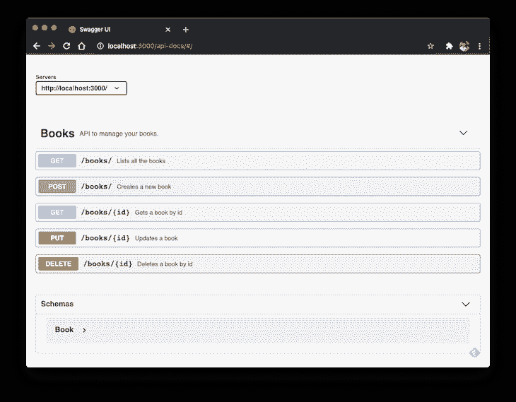
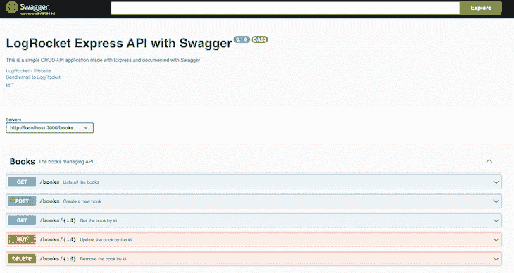
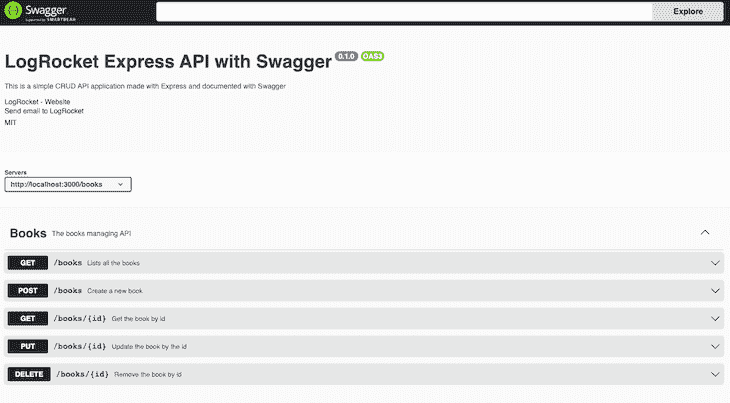

# 用斯瓦格-日志火箭博客记录您的快递应用编程接口

> 原文：<https://blog.logrocket.com/documenting-express-js-api-swagger/>

***编者按:**这篇关于用 Swagger 记录 Express.js API 的文章最后一次更新是在 2022 年 12 月 9 日，添加了关于如何将 Swagger 连接到 Node.js、Swagger 的好处以及如何使用 CSS 定制 Swagger 的章节。此更新还解决了以前版本中存在的代码错误。*

我们都知道记录 API 的重要性。就 Node.js APIs 而言，无论它们是构建在 Express.js 之上还是任何其他框架之上，您都有大量的开源选项。其中包括 apiDoc、docbox 等。

在本教程中，我们将探索如何在 Express.js API 中使用 Swagger。Swagger 是一个开源的工具集，可以让你设计、构建、记录和使用 RESTful web 服务。它被设计成基本上是[不可知的](https://github.com/swagger-api/swagger-codegen#overview)，这意味着你可以将它用于几乎任何你喜欢的语言和框架。

在我们的例子中，我们将使用两个库:swagger-ui-express 和 swagger-jsdoc。第一个模块允许您从一个`swagger.json`文件或一个内联对象提供一个 Swagger UI(基于 swagger-ui 项目自动生成的视图)。

第二个项目是关于在整个代码中使用 JSDoc 注释集成 Swagger。这很有用，尤其是当您有大量的 API 和几十个模型时。

*向前跳转:*

## 使用 Swagger 的好处

在我们开始将 Swagger 集成到 Node.js 应用程序之前，让我们看看为什么 Swagger 对任何应用程序都很重要——它如何在开发过程中提供帮助。

Swagger 的一个重要好处是，它有助于理解 API 如何为应用程序的客户端工作。Swagger 在应用程序的客户端和服务器端同步 API。这样，在前端工作的开发人员可以理解 API 是如何工作的，并将 API 集成到客户端。

使用 Swagger 的另一个好处是它对开发人员和非开发人员都很全面。参与产品开发的每一个人，包括[产品经理](https://blog.logrocket.com/product-management/)，利益相关者，开发者，都可以在 UI 中试用 API，而不需要独立运行服务器。

我们可以随心所欲地定制 API 文档。所以，总的来说，Swagger 的主要优势是它使 API 开发过程更快、更有效。

现在，我们知道了在应用程序中使用 Swagger 的优点，让我们来看看如何在应用程序中设置和配置它。

## Express.js API 应用程序设置

本教程不会涉及任何与 [Express API 构建](https://blog.logrocket.com/build-rest-api-node-express-mysql/)相关的内容。我们已经有了一个[现成的例子](https://github.com/diogosouza/simple-express-crud-api)，您可以在实现之前克隆到您的本地机器上。

这是一个简单的 API，允许你管理内存中的图书列表。您可以根据自己的定制随意增加。

一旦你的应用程序中有了这个，在终端中运行下面的命令:

```
npm install
npm i swagger-ui-express swagger-jsdoc

```

这些将把所需的依赖项下载到您的应用程序中。现在是时候将 Swagger 集成到 Node.js 应用程序中了。

## 如何将 Swagger 连接到 Node.js

要将 Swagger 连接到 Node.js 应用程序，请在`server.js`中导入`swagger-ui-express`和`swagger-jsdoc`:

```
const express = require("express"),
  bodyParser = require("body-parser"),
  swaggerJsdoc = require("swagger-jsdoc"),
  swaggerUi = require("swagger-ui-express");

```

这是两个分别代表我们导入的库的对象。接下来，在应用程序的`listen`函数前添加以下代码:

```
const options = {
  definition: {
    openapi: "3.1.0",
    info: {
      title: "LogRocket Express API with Swagger",
      version: "0.1.0",
      description:
        "This is a simple CRUD API application made with Express and documented with Swagger",
      license: {
        name: "MIT",
        url: "https://spdx.org/licenses/MIT.html",
      },
      contact: {
        name: "LogRocket",
        url: "https://logrocket.com",
        email: "[email protected]",
      },
    },
    servers: [
      {
        url: "http://localhost:3000",
      },
    ],
  },
  apis: ["./routes/*.js"],
};

const specs = swaggerJsdoc(options);
app.use(
  "/api-docs",
  swaggerUi.serve,
  swaggerUi.setup(specs)
);

```

正如您在第一行中看到的，这个配置对象将一个 [`OpenAPI`](https://github.com/OAI/OpenAPI-Specification/releases/tag/3.1.0) 设置为 v3.1.0

Swagger 使用开放 API 规范，这是 RESTful APIs 的一个标准的语言无关接口，允许人类和机器理解 web 服务的功能，而不必访问源代码或检查网络流量。

您可以参考每个版本的所有可用设置的官方文档。在这里，我们只使用了基本信息:API 信息、名称、标题、描述、许可、API 所有者的联系方式等等。

API 的属性是必不可少的，因为它搜索模型和端点定义，所以要正确地通知它。

最后，我们使用`swaggerJsdoc`函数扫描作为参数传入的选项，并返回转换后的 Swagger 规范对象。反过来，这个可以与`swaggerUi`设置过程一起使用。

您现在可以通过`npm start`命令启动应用程序。当访问`[http://localhost:3000/api-docs/](http://localhost:3000/api-docs/)` URL 时，您将看到以下屏幕:



请注意，我们仍然没有在规范中定义任何操作。这是因为我们需要显式地将这些操作映射到路由。否则，Swagger 无法自己找出 API 端点。

或者，您可以在 UI 中添加一个搜索栏，以防 API 有太多操作。为此，将实现更改如下:

```
app.use(
  "/api-docs",
  swaggerUi.serve,
  swaggerUi.setup(specs, { explorer: true })
);

```

现在，搜索栏将会出现:



## 创建 API 模型

像许多重要的框架和 API 架构一样，数据被封装到模型中，变得更容易访问。Swagger 还希望你的 API 有模型，并让你来定义它们。

转到`routes/books.js`，将以下代码放在文件的开头:

```
/**
 * @swagger
 * components:
 *   schemas:
 *     Book:
 *       type: object
 *       required:
 *         - title
 *         - author
 *         - finished
 *       properties:
 *         id:
 *           type: string
 *           description: The auto-generated id of the book
 *         title:
 *           type: string
 *           description: The title of your book
 *         author:
 *           type: string
 *           description: The book author
 *         finished:
 *           type: boolean
 *           description: Whether you have finished reading the book
 *         createdAt:
 *           type: string
 *           format: date
 *           description: The date the book was added
 *       example:
 *         id: d5fE_asz
 *         title: The New Turing Omnibus
 *         author: Alexander K. Dewdney
 *         finished: false
 *         createdAt: 2020-03-10T04:05:06.157Z
 */

```

还记得我们说过的 JSDocs 吗？JSDocs 现在进入场景，并通过`@swagger`注释帮助我们设置其余的 Swagger 规范定义。在这里，您可以定义任意多的模式。在我们的例子中，我们只是定义了域`Books`。

required 属性接收必须在请求中填充的属性列表。这一步对于让人们知道在使用你的 API 时他们必须发送什么是至关重要的。

`properties`属性描述了模型属性的详细信息。每个属性必须有一个名称，后跟其类型、描述(可选)和格式(您也可以验证值)。关于可用数据类型的完整列表，请参考 [Swagger 数据类型](https://swagger.io/docs/specification/data-models/data-types/)。

最后，您可以为这个模式模型提供一个请求数据的例子。那以后会有用的。当您重新启动应用程序并刷新页面时，您会看到下面的屏幕:



好多了，不是吗？

需要注意的是，如果您在模式中遇到了一个`YAMLSemanticError`，请确保检查 YAML 配置中的缩进:



### 将操作整合到路线中

现在，我们已经将 Swagger `schema`整合到路线中。但是，我们仍然没有任何操作。让我们解决这个问题。在前面的 JSDoc 注释之后，添加以下内容:

```
/**
 * @swagger
 * tags:
 *   name: Books
 *   description: The books managing API
 * /books:
 *   post:
 *     summary: Create a new book
 *     tags: [Books]
 *     requestBody:
 *       required: true
 *       content:
 *         application/json:
 *           schema:
 *             $ref: '#/components/schemas/Book'
 *     responses:
 *       200:
 *         description: The created book.
 *         content:
 *           application/json:
 *             schema:
 *               $ref: '#/components/schemas/Book'
 *       500:
 *         description: Some server error
 *
 */

```

让我们分部分来分析，从 Swagger 标签开始。标签允许您在 Swagger 文档中创建一个部分。分配给此标签的所有路线将出现在同一分区下。这是一种组织设置。

在我们的例子中，所有的端点将被映射到同一个标签。接下来，我们设置我们的第一条路线:书的创作。这很简单。首先，定义一个`title`并指定路径将被附加到的`tag`。

然后，我们有请求和响应。在请求中，定义三件事:请求是否是必需的、请求的内容类型以及必须从哪个模式处理请求。

模式可以通过`#components/schemas` Swagger 操作符来引用。对于响应，定义 HTTP 响应代码和每个代码的属性。我们只是担心有一个`HTTP 200`的快乐路径。

继续直接在 Swagger UI 页面中测试新操作:



现在，您可以看到示例值出现的位置。为用户提供样本数据作为他们执行任务的参考会更容易。

下面，您可以找到所有其他操作的代码:

```
/**
 * @swagger
 * tags:
 *   name: Books
 *   description: The books managing API
 * /books:
 *   get:
 *     summary: Lists all the books
 *     tags: [Books]
 *     responses:
 *       200:
 *         description: The list of the books
 *         content:
 *           application/json:
 *             schema:
 *               type: array
 *               items:
 *                 $ref: '#/components/schemas/Book'
 *   post:
 *     summary: Create a new book
 *     tags: [Books]
 *     requestBody:
 *       required: true
 *       content:
 *         application/json:
 *           schema:
 *             $ref: '#/components/schemas/Book'
 *     responses:
 *       200:
 *         description: The created book.
 *         content:
 *           application/json:
 *             schema:
 *               $ref: '#/components/schemas/Book'
 *       500:
 *         description: Some server error
 * /books/{id}:
 *   get:
 *     summary: Get the book by id
 *     tags: [Books]
 *     parameters:
 *       - in: path
 *         name: id
 *         schema:
 *           type: string
 *         required: true
 *         description: The book id
 *     responses:
 *       200:
 *         description: The book response by id
 *         contens:
 *           application/json:
 *             schema:
 *               $ref: '#/components/schemas/Book'
 *       404:
 *         description: The book was not found
 *   put:
 *    summary: Update the book by the id
 *    tags: [Books]
 *    parameters:
 *      - in: path
 *        name: id
 *        schema:
 *          type: string
 *        required: true
 *        description: The book id
 *    requestBody:
 *      required: true
 *      content:
 *        application/json:
 *          schema:
 *            $ref: '#/components/schemas/Book'
 *    responses:
 *      200:
 *        description: The book was updated
 *        content:
 *          application/json:
 *            schema:
 *              $ref: '#/components/schemas/Book'
 *      404:
 *        description: The book was not found
 *      500:
 *        description: Some error happened
 *   delete:
 *     summary: Remove the book by id
 *     tags: [Books]
 *     parameters:
 *       - in: path
 *         name: id
 *         schema:
 *           type: string
 *         required: true
 *         description: The book id
 *
 *     responses:
 *       200:
 *         description: The book was deleted
 *       404:
 *         description: The book was not found
 */

```

理想情况下，这些映射应该放在每个 Express.js 路由函数之上。然而，为了简单起见，我们将它们集中在一个地方。

### 映射端点

现在，我们将操作分为两个主要类别:接收`id`参数的操作和不接收参数的操作。这对于 Swagger 理解如何用正确的路径参数匹配路线是必要的。

每当您的端点中有参数时，不管它们是什么类型，您都必须在`parameters`属性下告知细节。

以下是所有端点都正确映射的结果:



## 用 CSS 进行大摇大摆的定制

您可以通过在 Swagger 集成中实现自定义 CSS 来自定义 Swagger UI。为此，将`customCssUrl`选项添加到`swaggerUi.setup`中:

```
app.use(
  "/api-docs",
  swaggerUi.serve,
  swaggerUi.setup(specs, {
    explorer: true,
    customCssUrl:
      "https://cdn.jsdelivr.net/npm/[email protected]/themes/3.x/theme-newspaper.css",
  })
);

```

这里，我们将自定义 CSS 文件传递到`customCssUrl`选项中。它将改变自定义风格的大摇大摆的用户界面。

这是它在自定义 CSS 文件之前的样子:



现在，看看它在以下情况下会是什么样子:



## 结论

您可以单独测试每个端点，以确保它按照您的[邮递员](https://blog.logrocket.com/how-automate-api-tests-postman/)的要求准确工作。

Swagger 不仅仅能够记录你的 API。快速浏览一下官方文件会让你更好地理解它的威力。记住记录应该是你团队文化的一部分。否则，您的文档不会总是最新的。

你可以在这里找到完整的源代码[。祝你好运！](https://github.com/ganeshmani/swagger-nodejs-tutorial)

## 200 只显示器出现故障，生产中网络请求缓慢

部署基于节点的 web 应用程序或网站是容易的部分。确保您的节点实例继续为您的应用程序提供资源是事情变得更加困难的地方。如果您对确保对后端或第三方服务的请求成功感兴趣，

[try LogRocket](https://lp.logrocket.com/blg/node-signup)

.

[](https://lp.logrocket.com/blg/node-signup)[https://logrocket.com/signup/](https://lp.logrocket.com/blg/node-signup)

LogRocket 就像是网络和移动应用程序的 DVR，记录下用户与你的应用程序交互时发生的一切。您可以汇总并报告有问题的网络请求，以快速了解根本原因，而不是猜测问题发生的原因。

LogRocket 检测您的应用程序以记录基线性能计时，如页面加载时间、到达第一个字节的时间、慢速网络请求，还记录 Redux、NgRx 和 Vuex 操作/状态。

[Start monitoring for free](https://lp.logrocket.com/blg/node-signup)

.