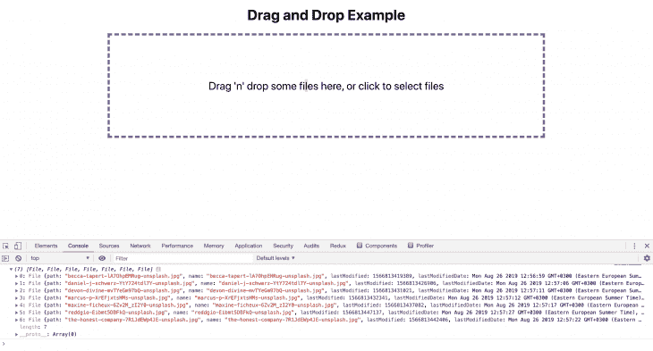
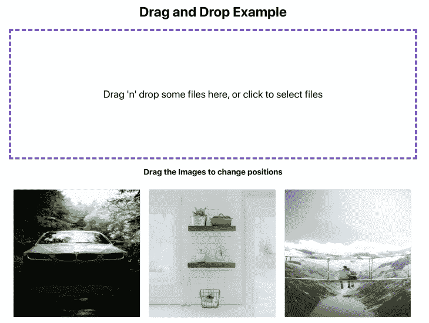

# 如何在 React 中实现拖放操作

> 原文：<https://blog.logrocket.com/drag-and-drop-react-dnd/>

编者按:本教程最后一次更新是在 2022 年 3 月 17 日，以反映 React DnD 的更新。

[拖放 API](https://developer.mozilla.org/en-US/docs/Web/API/HTML_Drag_and_Drop_API) 为 HTML 带来了可拖动的元素，使开发人员能够构建包含丰富 UI 元素的应用程序，这些元素可以从一个地方拖动到另一个地方。拖放 API 是大多数现代应用程序不可或缺的一部分，它在不包含 UX 的情况下提供了丰富的 UI。

React 中最常见的拖放用例包括上传文件、在多个列表之间移动项目以及重新排列图像和资源。在本教程中，我们将重点介绍在 React 中实现拖放的几种不同的工具和用例。作为演示，我们将基于[创建一个简单的应用程序。](https://drag-drop-logrocket.netlify.app/)

你可以通过[访问这个项目的完整代码库](https://github.com/learnwithparam/logrocket-drag-and-drop)和[查看演示](https://drag-drop-logrocket.netlify.com/)来跟随这个教程。我们开始吧！

### 目录

## 如何在 React 中实现拖放

对于我们的示例，我们将构建一个简单的应用程序，使用户能够通过将图像文件放到浏览器中来上传图像文件，以网格的形式显示这些图像的预览，并对图像进行重新排序。

首先，我们将使用 Create React App 引导 React 应用程序:

```
npx create-react-app logrocket-drag-and-drop
cd logrocket-drag-and-drop
yarn start

```

如果您使用的是 npm，只需将`yarn start`替换为`npm start`。

如果你更喜欢视觉教程，看看下面的 react-beautiful-dnd 演练:

 [https://www.youtube.com/embed/Vqa9NMzF3wc?version=3&rel=1&showsearch=0&showinfo=1&iv_load_policy=1&fs=1&hl=en-US&autohide=2&wmode=transparent](https://www.youtube.com/embed/Vqa9NMzF3wc?version=3&rel=1&showsearch=0&showinfo=1&iv_load_policy=1&fs=1&hl=en-US&autohide=2&wmode=transparent)

视频

## 在 React 中使用拖放上传文件

我们不会通过自己创建所有的逻辑和组件来重新发明轮子。相反，我们将使用一些最常用的 React 拖放库，从 [react-dropzone](https://blog.logrocket.com/create-a-drag-and-drop-component-with-react-dropzone/#createthedropzonecomponent) 开始。

在撰写本文时，GitHub 上有近 [8，000 颗星星，react-dropzone 是一个非常强大的库，可以帮助您在 react 中创建自定义组件，并通过](https://github.com/react-dropzone/react-dropzone) [React Hooks](https://blog.logrocket.com/frustrations-with-react-hooks/) 支持进行更新。要安装 react-dropzone，请运行以下命令之一:

```
yarn add react-dropzone
#or
npm install react-dropzone

```

接下来，创建一个名为`Dropzone.js`的新文件，它负责将一个简单的内容区域变成一个 dropzone 区域，您可以在其中放置文件。

### 什么是`react-dropzone`？

`react-dropzone`隐藏文件输入，显示漂亮的自定义 dropzone 区域。当我们放下文件时，`react-dropzone`使用 HTML `onDrag`事件，并根据文件是否被放入 dropzone 区域来从事件中捕获文件。

如果我们点击该区域，`react-dropzone`库使用 React `ref`通过隐藏输入启动文件选择对话框，允许我们选择和上传文件。让我们创建我们的`Dropzone`组件:

```
/* 
  filename: Dropzone.js 
*/

import React from "react";
// Import the useDropzone hooks from react-dropzone
import { useDropzone } from "react-dropzone";

const Dropzone = ({ onDrop, accept }) => {
  // Initializing useDropzone hooks with options
  const { getRootProps, getInputProps, isDragActive } = useDropzone({
    onDrop,
    accept
  });

  /* 
    useDropzone hooks exposes two functions called getRootProps and getInputProps
    and also exposes isDragActive boolean
  */

  return (
    <div className="dropzone-div" {...getRootProps()}>
      <input className="dropzone-input" {...getInputProps()} />
      <div className="text-center">
        {isDragActive ? (
          <p className="dropzone-content">Release to drop the files here</p>
        ) : (
          <p className="dropzone-content">
            Drag 'n' drop some files here, or click to select files
          </p>
        )}
      </div>
    </div>
  );
};

export default Dropzone;

```

组件很简单，但是让我们仔细看看代码。`useDropzone`为我们公开了几个方法和变量来创建自定义的 dropzone 区域。对于我们的项目，我们主要对三个属性感兴趣。

例如，`getRootProps`是基于 dropzone 区域的父元素设置的。这个元素决定了 dropzone 区域的宽度和高度。`getInputProps`是传递给输入元素的道具。它使我们能够支持点击事件和拖动事件来获取文件。

所有与我们传递给`useDropzone`的文件相关的选项都被设置到这个输入元素中。比如想只支持单个文件，可以通过`multiple: false`。它将自动要求`dropzone`只允许一个文件被接受。

如果文件被拖动到 dropzone 区域上方，则设置`isDragActive`,这对于基于该变量进行样式设置非常有用。

下面的例子演示了如何根据`isDragActive`值设置样式/类名:

```
const getClassName = (className, isActive) => {
  if (!isActive) return className;
  return `${className} ${className}-active`;
};

...
<div className={getClassName("dropzone", isDragActive)} {...getRootProps()}>
...

```

在我们的拖放示例中，我们只使用了两个道具，但是，库支持很多道具来根据您的需要定制 dropzone 区域。

为了只接受图像文件，我们使用了 [`accept`道具](https://github.com/react-dropzone/attr-accept)。现在，我们的`App.js`应该看起来像下面的代码:

```
/*
filename: App.js 
*/

import React, { useCallback } from "react";
// Import the dropzone component
import Dropzone from "./Dropzone";

import "./App.css";

function App() {
  // onDrop function  
  const onDrop = useCallback(acceptedFiles => {
    // this callback will be called after files get dropped, we will get the acceptedFiles. If you want, you can even access the rejected files too
    console.log(acceptedFiles);
  }, []);

  // We pass onDrop function and accept prop to the component. It will be used as initial params for useDropzone hook
  return (
    <main className="App">
      <h1 className="text-center">Drag and Drop Example</h1>
      <Dropzone onDrop={onDrop} accept={"image/*"} />
    </main>
  );
}

export default App;

```



我们在主页面中添加了`dropzone`组件。现在，如果你放下文件，它会控制放下的图像文件。

请记住，上面的图像对 dropzone div 应用了一些样式，如填充和边框。你的可能会出现不同，直到你提供一些风格。在`index.css`中添加以下代码应该会给你一个类似的外观:

```
body {
  text-align: center;
}
.dropzone-div {
  text-align: center;
  padding: 20px;
  border: 3px purple dashed;
  width: 60%;
  margin: auto;
}

```

`acceptedFiles`是一个由`File`值组成的数组。您可以读取文件或将其发送到服务器并上传。无论你想做什么流程，都可以在那里完成。甚至当你点击区域并上传时，同样的`onDrop`回调被调用。

属性接受 mime 类型。它支持所有标准的 mime 类型和匹配模式。例如，如果你想只允许 pdf，那么`accept={'application/pdf'}`。如果你既想要图片又想要 pdf，它支持`accept={'application/pdf, image/*'}`。

`onDrop`函数包含在`useCallback`中。截至目前，我们没有进行任何繁重的计算，也没有将文件发送到服务器。我们只是安慰一下`acceptedFiles`。稍后，我们将读取文件并设置在浏览器中显示图像的状态。建议对昂贵的函数使用`useCallback`以避免不必要的重新渲染，然而，在我们的例子中，它是完全可选的。

让我们读取图像文件并将它们添加到`App.js`中的一个状态。另外，一定要安装带有`yarn add cuid`或`npm install cuid`的`cuid`库:

```
/*
filename: App.js
*/
import React, { useCallback, useState } from "react";
// cuid is a simple library to generate unique IDs
import cuid from "cuid";

function App() {
  // Create a state called images using useState hooks and pass the initial value as empty array
  const [images, setImages] = useState([]);

  const onDrop = useCallback(acceptedFiles => {
    // Loop through accepted files
    acceptedFiles.map(file => {
      // Initialize FileReader browser API
      const reader = new FileReader();
      // onload callback gets called after the reader reads the file data
      reader.onload = function(e) {
        // add the image into the state. Since FileReader reading process is asynchronous, its better to get the latest snapshot state (i.e., prevState) and update it. 
        setImages(prevState => [
          ...prevState,
          { id: cuid(), src: e.target.result }
        ]);
      };
      // Read the file as Data URL (since we accept only images)
      reader.readAsDataURL(file);
      return file;
    });
  }, []);

  ...
}

```

我们的`images`状态的数据结构如下:

```
const images = [
  {
    id: 'abcd123',
    src: 'data:image/png;dkjds...',
  },
  {
    id: 'zxy123456',
    src: 'data:image/png;sldklskd...',
  }
]

```

## 显示图像预览

为了在网格布局中显示图像预览，我们将创建另一个名为`ImageList`的组件:

```
import React from "react";

// Rendering individual images
const Image = ({ image }) => {
  return (
    <div className="file-item">
      
    </div>
  );
};

// ImageList Component
const ImageList = ({ images }) => {

  // render each image by calling Image component
  const renderImage = (image, index) => {
    return (
      <Image
        image={image}
        key={`${image.id}-image`}
      />
    );
  };

  // Return the list of files
  return <section className="file-list">{images.map(renderImage)}</section>;
};

export default ImageList;

```

现在，我们可以将这个`ImageList`组件添加到`App.js`来显示图像的预览:

```
function App() {
  ...

  // Pass the images state to the ImageList component and the component will render the images
  return (
    <main className="App">
      <h1 className="text-center">Drag and Drop Example</h1>
      <Dropzone onDrop={onDrop} accept={"image/*"} />
      <ImageList images={images} />
    </main>
  );
}

```

至此，我们已经成功完成了应用程序的一半。我们现在可以拖放来查看图像的预览:



## 通过拖放重新排序图像

接下来，我们将允许用户通过拖放来重新排序图像。但是首先，让我们快速回顾一下用于实现该功能的最流行的库，并根据您的项目需求引导您选择最好的库。

上面的图像已经应用了样式。使用将显示图像的容器上的 flexbox 来水平显示图像。在您的`index.css`中输入以下内容应该会给出大致相同的外观:

```
.file-list {
  display: flex;
  flex-wrap: wrap;
  width: 65%;
  margin: 20px auto;
  padding: 10px;
  border: 3px dotted black;
}
.file-list img {
  height: 300px;
  width: 300px;
  object-fit: cover;
}

```

## React 拖放库

三个最流行的 React 拖放包是:

每个库在 React 开发人员中很受欢迎，并且有活跃的贡献者。让我们快速放大每个库，并分析其优缺点。

## 反应-美丽-dnd

[react-beautiful-dnd 是一个更高层次的抽象](https://blog.logrocket.com/adding-drag-and-drop-functionality-with-react-beautiful-dnd/),专门为列表而构建。它旨在提供一种自然、美观、易用的 React 拖放体验。

### 反应-美丽-dnd 优点

react-beautiful-dnd 非常适合一维布局和需要水平或垂直移动的拖放功能。例如，Trello 布局可以使用 react-beautiful-dnd 开箱即用。

react-beautiful-dnd API 轻而易举。该团队设法创建了一个真正令人愉快的开发人员体验，而没有增加代码库的复杂性

### 反应-美丽-拒绝和反对

react-beautiful-dnd 对网格不起作用，因为你向各个方向移动元素。react-beautiful-dnd 将无法同时计算 x 轴和 y 轴的位置。因此，当拖动网格上的元素时，你的内容会随机移动，直到你放下元素。

* * *

### 更多来自 LogRocket 的精彩文章:

* * *

## 反应网格布局

[React-Grid-Layout](https://github.com/react-grid-layout/react-grid-layout) 是专为 React 打造的网格布局系统。与 Packery 和 Gridster 等类似系统不同，React-Grid-Layout 响应迅速，支持断点布局，断点布局可以由用户提供，也可以自动生成。它不需要 jQuery。

### 反应网格布局优点

React-Grid-Layout 适用于需要拖放的复杂网格布局，如具有完全定制和调整大小的仪表板，即 looker、数据可视化产品等。

对于大规模的应用需求来说，它的复杂性是值得的。

### 反应网格布局缺点

在我看来，React-Grid-Layout 提供了一个没有吸引力的 API，还需要你自己进行大量的计算。布局结构必须通过 React-Grid-Layout 的组件 API 在 UI 中定义，这在您动态创建动态元素时引入了额外的复杂性。

## 反应 DnD

React DnD 是一套 React 工具，旨在帮助你构建高级拖放界面，同时保持组件的解耦。它实现了类似于 Trello 和 Storify 等应用程序的功能，在这些应用程序中，数据在应用程序的各个部分之间传输，组件会改变它们的外观和应用程序状态以响应拖放事件。

### 反应 DnD 专业人士

React DnD 适用于几乎所有的用例，比如网格、一维列表等。此外，React DnD 有一个非常强大的 API，可以在 React 中添加任何自定义拖放功能。

### 反应 DnD 的缺点

对于小例子来说，API 非常容易上手。然而，添加复杂的定制可能非常棘手。学习曲线比 react-beautiful-dnd 更高更复杂。此外，一些黑客需要支持网络和触摸设备

对于我们的用例，我选择使用 React DnD。如果布局只包含一个项目列表，我会选择 react-beautiful-dnd，但是在我们的例子中，我们有一个图像网格。因此，实现拖放的最简单的 API 是 React DnD。

## 探索反应 DnD

在我们深入研究拖放代码之前，我们需要首先了解 React DnD 是如何工作的。反应 DnD 可以使任何元素拖放。为了实现这一点，DnD 有几个假设:

*   反应 DnD 需要所有可丢弃物品的参考
*   React DnD 需要所有可拖动项目的参考

所有可拖放的元素都需要包含在 React DnD 的上下文提供程序中，该提供程序用于初始化和管理内部状态。

我们不需要太担心它如何管理状态；React DnD 包含了漂亮而简单的 API 来公开这些状态，使我们能够计算和更新我们的本地状态。

要安装 React DnD，请运行以下任一命令:

```
yarn add react-dnd react-dnd-html5-backend immutability-helper
//or
npm install react-dnd react-dnd-html5-backend immutability-helper

```

请记住，在您完成所有步骤之前，这个示例不会起作用。查看最终产品[预反应-dnd v14](https://github.com/learnwithparam/logrocket-drag-and-drop) 和[后反应-dnd v14](https://github.com/AlexMercedCoder/logrocket-reactdnd-v14plus) 的报告，以供参考。

首先，我们将把我们的`ImageList`组件封装在 DnD 上下文提供者中:

```
/* 
  filename: App.js 
*/

import { DndProvider } from "react-dnd";
import {HTML5Backend} from "react-dnd-html5-backend";

function App() {
  ...
  return (
    <main className="App">
      ...
      <DndProvider backend={HTML5Backend}>
        <ImageList images={images} moveImage={moveImage}/>
      &lt;/DndProvider>
    </main>
  );
}

```

只需导入`DNDProvider`并用`backend`道具初始化它。正如我前面提到的，这个变量帮助我们选择使用哪个 API 进行拖放。

*   [HTML5 拖放 API](https://blog.logrocket.com/html-5-drag-and-drop-api-a-tutorial/) 仅在网络上受支持，在触摸设备上不受支持
*   触摸拖放 API 在触摸设备上受支持

目前我们使用 HTML5 API 入门。功能完成后，我们将编写一个简单的实用程序来为触摸设备提供基本支持。

现在，我们需要添加可拖动和可放下的项目。在我们的应用程序中，可拖动和可放下的项目是相同的。我们将拖动`Image`组件，并将其放到另一个`Image`组件上，使我们的工作变得简单一些。要实现这一点，请使用下面的代码:

```
import React, { useRef } from "react";
// import useDrag and useDrop hooks from react-dnd
import { useDrag, useDrop } from "react-dnd";

const type = "Image"; // Need to pass which type element can be draggable, its a simple string or Symbol. This is like an Unique ID so that the library know what type of element is dragged or dropped on.

const Image = ({ image, index }) => {
  const ref = useRef(null); // Initialize the reference

  // useDrop hook is responsible for handling whether any item gets hovered or dropped on the element
  const [, drop] = useDrop({
    // Accept will make sure only these element type can be droppable on this element
    accept: type,
    hover(item) {
      ...
    }
  });

  // useDrag will be responsible for making an element draggable. It also expose, isDragging method to add any styles while dragging
  const [{ isDragging }, drag] = useDrag(() => ({
    // what type of item this to determine if a drop target accepts it
    type: type,
    // data of the item to be available to the drop methods
    item: { id: image.id, index },
    // method to collect additional data for drop handling like whether is currently being dragged
    collect: (monitor) => {
      return {
        isDragging: monitor.isDragging(),
      };
    },
  }));

  /* 
    Initialize drag and drop into the element using its reference.
    Here we initialize both drag and drop on the same element (i.e., Image component)
  */
  drag(drop(ref));

  // Add the reference to the element
  return (
    <div
      ref={ref}
      style={{ opacity: isDragging ? 0 : 1 }}
      className="file-item"
    >
      
    </div>
  );
};

const ImageList = ({ images, moveImage }) => {
  const renderImage = (image, index) => {
    return image ? (
      <Image
        image={image}
        index={index}
        key={`${image.id}-image`}
        moveImage={moveImage}
      />
    ): null;
  };
  return <section className="file-list">{images.map(renderImage)}</section>;

export default ImageList;

```

现在，我们的图像已经可以拖动了。但是，如果我们放下它，图像会回到原来的位置，因为`useDrag`和`useDrop`会处理它，直到我们放下它。除非我们改变我们的局部状态，否则它会再次回到原来的位置。

要更新本地状态，我们需要知道被拖动的元素和被悬停的元素，即被拖动的元素悬停在哪个元素上。`useDrag`通过`hover`方法公开这些信息:

```
const [, drop] = useDrop({
    // accept receives a definition of what must be the type of the dragged item to be droppable
    accept: type,
    // This method is called when we hover over an element while dragging
    hover(item) { // item is the dragged element
      if (!ref.current) {
        return;
      }
      const dragIndex = item.index;
      // current element where the dragged element is hovered on
      const hoverIndex = index;
      // If the dragged element is hovered in the same place, then do nothing
      if (dragIndex === hoverIndex) { 
        return;
      }
      // If it is dragged around other elements, then move the image and set the state with position changes
      moveImage(dragIndex, hoverIndex);
      /*
        Update the index for dragged item directly to avoid flickering
        when the image was half dragged into the next
      */
      item.index = hoverIndex;
    }
});

```

每当一个元素被拖动并停留在这个元素上时，就会触发`hover`方法。通过这种方式，当我们开始拖动一个元素时，我们得到了该元素的索引以及我们所悬停的元素。我们将通过这个`dragIndex`和`hoverIndex`来更新我们图像的状态。

此时，您可能想知道为什么我们需要在悬停时更新状态？为什么不一边滴一边更新呢？可以在删除时更新状态。`drag-and-drop`将工作并重新排列位置，但 UX 不会是好的。

例如，如果你拖动一个图像到另一个图像上，我们立即改变它的位置，那么这会给拖动它的用户很好的反馈。否则，他们可能不知道拖动功能是否有效，直到他们将图像放到某个位置。

因此，我们在每次悬停时更新状态。当悬停在另一个图像上时，我们设置状态并改变位置，用户将看到一个漂亮的动画。你可以在我们的演示页面查看。

到目前为止，我们只是将更新状态的代码显示为`moveImage`。让我们来看看实现:

```
/*
  filename: App.js
*/

import update from "immutability-helper";

...

const moveImage = (dragIndex, hoverIndex) => {
    // Get the dragged element
    const draggedImage = images[dragIndex];
    /*
      - copy the dragged image before hovered element (i.e., [hoverIndex, 0, draggedImage])
      - remove the previous reference of dragged element (i.e., [dragIndex, 1])
      - here we are using this update helper method from immutability-helper package
    */
    setImages(
      update(images, {
        $splice: [[dragIndex, 1], [hoverIndex, 0, draggedImage]]
      })
    );
};

// We will pass this function to ImageList and then to Image -> Quite a bit of props drilling, the code can be refactored and place all the state management in ImageList itself to avoid props drilling. It's an exercise for you :)

```

现在，我们的应用程序在支持 HTML5 `onDrag`事件的设备上功能齐全。不幸的是，它在触摸设备上不起作用。

正如我之前说过的，我们可以使用实用函数来支持触摸设备。这不是最好的解决方案，但仍然有效。在触控设备上拖动的体验不会很棒；它只是简单地更新，但你不会觉得你在拖拉。你也可以把它弄干净:

```
import HTML5Backend from "react-dnd-html5-backend";
import TouchBackend from "react-dnd-touch-backend";

// simple way to check whether the device support touch (it doesn't check all fallback, it supports only modern browsers)
const isTouchDevice = () => {
  if ("ontouchstart" in window) {
    return true;
  }
  return false;
};

// Assigning backend based on touch support on the device
const backendForDND = isTouchDevice() ? TouchBackend : HTML5Backend;

...
return (
  ...
  <DndProvider backend={backendForDND}>
    <ImageList images={images} moveImage={moveImage} />
  </DndProvider>
)
...

```

## 对本机拖放做出反应

有关如何在 React Native 中实现拖放的更多信息，请查看下面的视频教程:

[https://www.youtube.com/embed/tsM3N_7bNcE](https://www.youtube.com/embed/tsM3N_7bNcE)

视频

## 结论

我们已经成功地构建了一个小而强大的演示程序，用于拖放文件、上传文件和重新排序这些文件。

我们只是触及了 React 在拖放功能方面的皮毛。我们可以使用拖放库来构建非常详尽的特性。我们讨论了撰写本文时可用的一些最好的库。

我希望它能帮助您更快、更自信地构建下一个拖放功能。请务必在评论中告诉我你用它做了什么。

## 使用 LogRocket 消除传统反应错误报告的噪音

[LogRocket](https://lp.logrocket.com/blg/react-signup-issue-free)

是一款 React analytics 解决方案，可保护您免受数百个误报错误警报的影响，只针对少数真正重要的项目。LogRocket 告诉您 React 应用程序中实际影响用户的最具影响力的 bug 和 UX 问题。

[ ](https://lp.logrocket.com/blg/react-signup-general) [  ](https://lp.logrocket.com/blg/react-signup-general) [LogRocket](https://lp.logrocket.com/blg/react-signup-issue-free)

自动聚合客户端错误、反应错误边界、还原状态、缓慢的组件加载时间、JS 异常、前端性能指标和用户交互。然后，LogRocket 使用机器学习来通知您影响大多数用户的最具影响力的问题，并提供您修复它所需的上下文。

关注重要的 React bug—[今天就试试 LogRocket】。](https://lp.logrocket.com/blg/react-signup-issue-free)