# 用 Draggable 和 DragTarget 在 Flutter 中拖放 UI 元素

> 原文：<https://blog.logrocket.com/drag-and-drop-ui-elements-in-flutter-with-draggable-and-dragtarget/>

自从我们大多数人开始使用计算机以来，拖放操作就一直存在。我们使用 Gmail 应用程序中的拖放功能在收件人和抄送字段之间移动地址。大多数图片托管服务都提供类似的上传图片功能。一些送餐应用程序允许你通过拖放来定制你的订单。诸如此类。

简单来说，当用户选择一个项目，将其拖动到屏幕上的另一个点，然后释放它时，就会发生拖放交互。它的设计是为了模仿我们在现实世界中拿起和移动东西的方式。

在本教程中，我们将演示如何使用`Draggable`、`DragTarget`和`LongPressDraggable`在 Flutter 应用程序中构建拖放交互。我们还将通过一些实际例子向您展示这些小部件如何协同工作，为您的用户产生引人入胜的拖放体验。

我们将详细介绍以下内容:

如果你是视觉学习者，看看这个快速视频教程:

 [https://www.youtube.com/embed/QzA4c4QHZCY?version=3&rel=1&showsearch=0&showinfo=1&iv_load_policy=1&fs=1&hl=en-US&autohide=2&wmode=transparent](https://www.youtube.com/embed/QzA4c4QHZCY?version=3&rel=1&showsearch=0&showinfo=1&iv_load_policy=1&fs=1&hl=en-US&autohide=2&wmode=transparent)

视频

`[Draggable](https://api.flutter.dev/flutter/widgets/Draggable-class.html)`是一个可以拖动或移动的小工具。一旦用户单击并开始拖动`Draggable`小部件，一个新的反馈小部件就会出现，并跟随用户的手指或鼠标指针。当用户抬起手指或鼠标指针时，反馈小部件消失。

让我们来看看如何创建一个`Draggable`小部件。成品看起来会像这样:

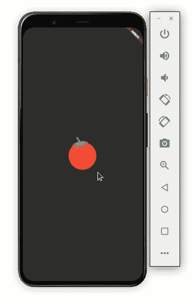

Image source: [https://www.vecteezy.com/](https://www.vecteezy.com/)

下面是让它工作的代码:

```
Scaffold(
    body: Container(
  child: Center(
    child: Column(
      mainAxisAlignment: MainAxisAlignment.center,
      children: [
        Draggable<String>(
          // Data is the value this Draggable stores.
          data: 'red',
          child: Container(
            height: 120.0,
            width: 120.0,
            child: Center(
              child: Image.asset('assets/images/tomato.png'),
            ),
          ),
          feedback: Container(
            height: 120.0,
            width: 120.0,
            child: Center(
              child: Image.asset('assets/images/tomato.png'),
            ),
          ),
        ),
      ],
    ),
  ),
))

```

让我们更深入地研究一下代码。

*   `child`:将您的小部件包装在`Draggable`小部件中，并将其放在子参数中。这里我们有一个带有番茄图像的`Container`
*   `data`:每个`Draggable`应该保存一些数据。这些数据将被`DragTarget`使用(我们将在后面看到)。在上面的代码中，我们给出的字符串数据是`red`
*   你可以在这里写任何你想在用户手指或鼠标指针下显示的小部件。为了获得更好的用户体验，您应该像孩子一样保留相同的小部件。这给用户一种实际拖动项目的感觉。您可以稍微更改此 widget 的大小或形状，以增强拖动体验，如下所示:

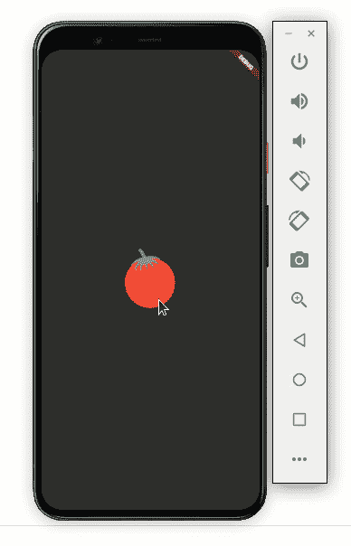

下面是代码如何转化为设计:

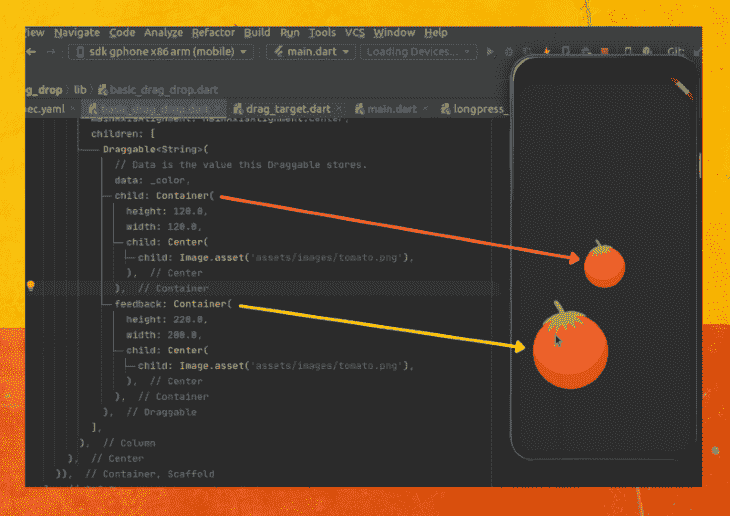

### 拖动时替换图像

此时，我们能够拖动图像。但是如果你注意的话，你会发现当图像被拖动时，实际的图像保持不变。如果我们不改变或删除它，用户可能会感到困惑。

让我们改变一下形象:

```
Draggable<String>(
  // Data is the value this Draggable stores.
  data: _color,
  child: Container(
    height: 120.0,
    width: 120.0,
    child: Center(
      child: Image.asset('assets/images/tomato.png'),
    ),
  ),
  feedback: Container(
    height: 120.0,
    width: 120.0,
    child: Center(
      child: Image.asset('assets/images/tomato.png'),
    ),
  ),
  //New
  childWhenDragging: Container(
    height: 120.0,
    width: 120.0,
    child: Center(
      child: Image.asset('assets/images/tomato_greyed.png'),
    ),
  ),
)

```

向`childWhenDragging`属性添加一个小部件可以解决这个问题。在上面的代码中，我们显示了带有灰色背景的番茄图像。看起来是这样的:

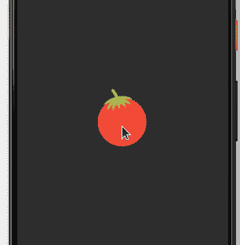

您还可以通过写入空容器来完全删除图像，如下所示:

```
childWhenDragging: Container(),

```

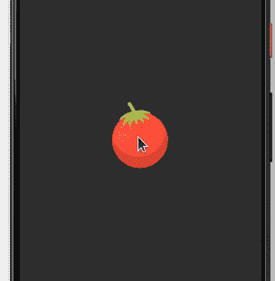

### 向一个方向拖动

您可能想要沿固定方向(垂直或水平)拖动项目。设置轴参数将允许项目在您选择的轴上拖动。

```
axis: Axis.vertical

```

上述代码将产生以下输出:

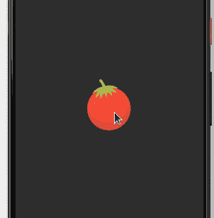

### 监听拖动事件

`Draggable`小部件使您能够监听拖动事件。您可以使用这些事件来触发某些操作，例如移除项目本身或通知用户。

以下是您可以收听的活动。

*   当用户开始移动物品时，你会收到一个回叫
*   `onDragEnd`:当项目被拖放到屏幕上的任何位置时，立即调用这个函数，它给出项目的附加细节，不管它是否被成功地拖放到拖放区。
*   `onDraggableCanceled`:当项目没有成功放下或者用户抬起手指或鼠标指针时调用
*   当物品被成功放入放置区域时，你会得到一个回叫

下面是添加`onDragStarted`的方法:

```
onDragStarted: () {
  showSnackBarGlobal(context, 'Drag started');
},

```

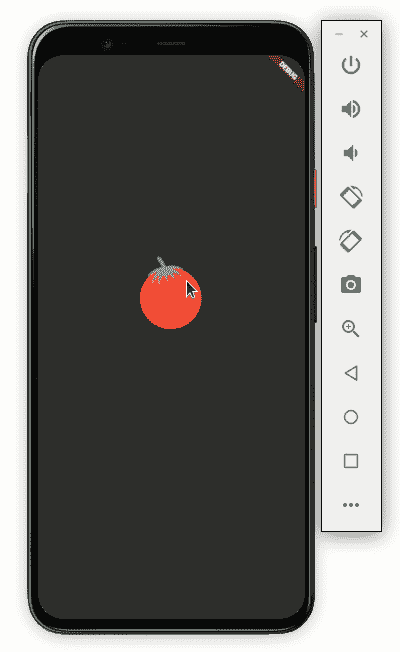

拖动一个项目很酷，但是如果我们不能把它放在某个地方，它就没有任何用处。让我们试着将项目放到`[DragTarget](https://api.flutter.dev/flutter/widgets/DragTarget-class.html)`小部件上。

`DragTarget`接收`Draggable`widget；更具体地说，它获取由`Draggable`小部件携带的数据。`DragTarget`有根据数据决定是否接受`Draggable`小部件的方法。

让我们设计一个类似这样的`Draggable`小部件:

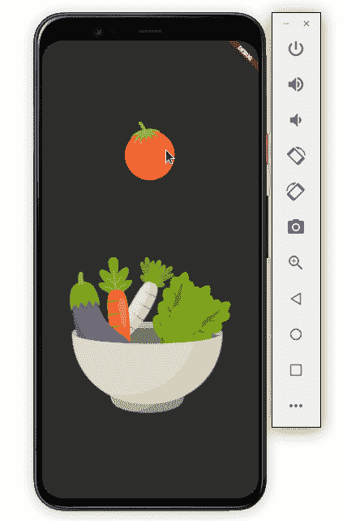

Image source: [https://www.vecteezy.com/](https://www.vecteezy.com/)

你可以这样做:

```
Scaffold(
    body: Container(
  child: Center(
    child: Column(
      mainAxisAlignment: MainAxisAlignment.center,
      children: [
        Draggable<String>(
          ...
         ),

        DragTarget<String>(
          builder: (
            BuildContext context,
            List<dynamic> accepted,
            List<dynamic> rejected,
          ) {
            return Container(
              height: 300,
              width: 300,
              child: Center(
                child: Image.asset(_isDropped
                    ? 'assets/images/bowl_full.png'
                    : 'assets/images/bowl.png'),
              ),
            );
          },
        ),
      ],
    ),
  ),
))

```

只需将您的小部件包装在`DragTarget`中。这里我们展示了一个碗的图像作为番茄图像的拖动目标。

### 删除项目

此时，我们仍然不能在`DragTarget`中删除该项目。因此，让我们看看如何让这个项目下降:

```
DragTarget<String>(
  builder: (
    BuildContext context,
    List<dynamic> accepted,
    List<dynamic> rejected,
  ) {
    ...
  },
  onWillAccept: (data) {
    return data == 'red';
  },
  onAccept: (data) {
    setState(() {
      showSnackBarGlobal(context, 'Dropped successfully!');
      _isDropped = true;
    });
  },
),

```

添加两个名为`onWillAccept`和`onAccept`的方法。

*   每当项目被放到`DragTarget`上时，就会调用`onWillAccept`。我们可以使用这个方法来检索由`Draggable`小部件携带的数据，并决定是否接受该项目。在上面的代码中，我们接受番茄图像，如果它携带该字符串作为`red`
*   `onAccept`是一个回调函数，一旦项目被`DragTarget`接受，我们就会收到这个回调函数。我们正在显示成功消息并更新`_isDropped`变量。`_isDropped`用于改变碗的图像以显示碗内的番茄图像

现在看起来是这样的:

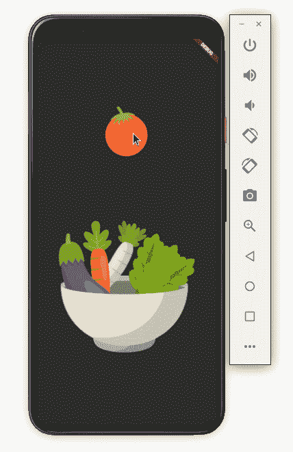

如果您想在项目没有被放入可放置区域时通知用户，只需再添加一个名为`onLeave`的方法:

```
onLeave: (data) {
  showSnackBarGlobal(context, 'Missed');
},

```

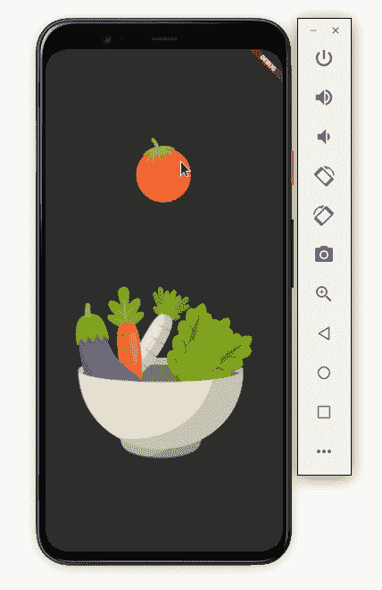

## 用`LongPressDraggable`使 UI 元素可长按

`[LongPressDraggable](https://api.flutter.dev/flutter/widgets/LongPressDraggable-class.html)`是另一个可拖动的小部件。`LongPressDraggable`和`Draggable`的唯一区别是`LongPressDraggable`允许你长按鼠标拖动项目，而`Draggable`可以立即拖动。

当你要拖动的项目在列表中时,`LongPressDraggable`很有用。例如，当你想把一张照片从图库移动到其他地方时，你应该使用`LongPressDraggable`而不是`Draggable`，就像这样:

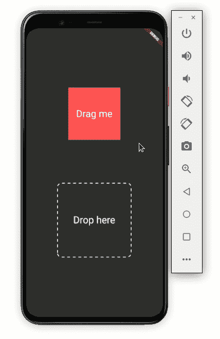

Image source: [https://www.vecteezy.com/](https://www.vecteezy.com/)

正如你在上面的 GIF 中所看到的，红色的方形项目已经准备好被拖动，但是只有当用户长按它的时候。

代码如下:

```
Scaffold(
    body: Container(
  child: Center(
    child: Column(
      mainAxisAlignment: MainAxisAlignment.center,
      children: [
        LongPressDraggable<String>(
          // Data is the value this Draggable stores.
          data: _color,
          child: Container(
            height: 150.0,
            width: 150.0,
            color: Colors.redAccent,
            child: const Center(
              child: Text(
                'Drag me',
                textScaleFactor: 2,
              ),
            ),
          ),
          feedback: Material(
            child: Container(
              height: 170.0,
              width: 170.0,
              decoration: BoxDecoration(
                color: Colors.redAccent,
              ),
              child: const Center(
                child: Text(
                  'Dragging',
                  textScaleFactor: 2,
                ),
              ),
            ),
          ),
          childWhenDragging: Container(
            height: 150.0,
            width: 150.0,
            color: Colors.grey,
            child: const Center(
              child: Text(
                'I was here',
                textScaleFactor: 2,
              ),
            ),
          ),
        ),
        SizedBox(
          height: MediaQuery.of(context).size.height * 0.15,
        ),
        DragTarget<String>(
          builder: (
            BuildContext context,
            List<dynamic> accepted,
            List<dynamic> rejected,
          ) {
            return DottedBorder(
              borderType: BorderType.RRect,
              radius: Radius.circular(12),
              padding: EdgeInsets.all(6),
              color: Colors.white,
              strokeWidth: 2,
              dashPattern: [8],
              child: ClipRRect(
                borderRadius: BorderRadius.all(Radius.circular(12)),
                child: Container(
                  height: 200,
                  width: 200,
                  color: _isDropped ? Colors.redAccent : null,
                  child: Center(
                      child: Text(
                    !_isDropped ? 'Drop here' : 'Dropped',
                    textScaleFactor: 2,
                  )),
                ),
              ),
            );
          },
          onAccept: (data) {
            debugPrint('hi $data');
            setState(() {
              showSnackBarGlobal(context, 'Dropped successfully!');
              _isDropped = true;
            });
          },
          onWillAccept: (data) {
            return data == _color;
          },
          onLeave: (data) {
            showSnackBarGlobal(context, 'Missed');
          },
        ),
      ],
    ),
  ),
))

```

大部分代码与我们之前讨论的相同；把`Draggable`小部件换成`LongPressDraggable`就行了。

## 颤振拖放示例:构建拼图游戏

既然您已经知道如何在 Flutter 中实现拖放交互，那么您应该能够自己构建任何东西。为了测试我们的技能，让我们试着搭建一个非常基本的拼图游戏。

以下是我们将要构建的内容:

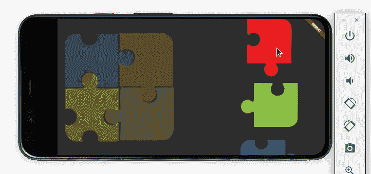

Image source: [https://www.vecteezy.com/](https://www.vecteezy.com/)

首先，强制应用程序仅在横向模式下打开:

```
void main() {
  WidgetsFlutterBinding.ensureInitialized();
  SystemChrome.setPreferredOrientations(
      [DeviceOrientation.landscapeRight, DeviceOrientation.landscapeLeft]).then(
    (_) => runApp(MyApp()),
  );
}

```

接下来，定义保存拼图块状态的变量(不管它们是否放置成功):

```
bool _isBlueDropped = false;
bool _isRedDropped = false;
bool _isYelloDropped = false;
bool _isGreenDropped = false;
String _blue = 'blue';
String _red = 'red';
String _yellow = 'yellow';
String _green = 'green';

```

创建四个`DragTarget`小部件的`Stack`。在`Position`小工具的帮助下排列它，使它看起来像一个 2×2 的拼图:

```
Stack(
  children: [
    Positioned(
      top: 0,
      left: 0,
      child: DragTarget<String>(),
    ),
    Positioned(
      top: 0,
      right: 0,
      child: DragTarget<String>(),
    ),
    Positioned(
      bottom: 0,
      left: 0,
      child: DragTarget<String>(),
    ),
    Positioned(
      bottom: 0,
      right: 0,
      child: DragTarget<String>(),
    ),
  ],
)

```

现在创建一个拼图列表。每个拼图块都是一个`Draggable`部件。

```
SingleChildScrollView(
  child: Column(
    children: [
      Visibility(
        visible: !_isRedDropped,
        child: Draggable<String>(),
      ),
      Visibility(
        visible: !_isGreenDropped,
        child: Draggable<String>(),
      ),
      Visibility(
        visible: !_isBlueDropped,
        child: Draggable<String>(),
      ),
      Visibility(
        visible: !_isYelloDropped,
        child: Draggable<String>(),
      ),
    ],
  ),
),

```

列表中的拼图块一旦被正确放置就被隐藏。使用我们之前定义的变量来管理可见性。

就是这样！完整的源代码可以在 [GitHub](https://github.com/pinkeshdarji/flutter_drag_and_drop) 上获得。

## 结论

在本教程中，我们学习了如何在 Flutter 中构建拖放交互。我们通过实例学习了如何使用各种小部件，如`Draggable`、`DragTarget`和`LongPressDraggable`。最后，我们演示了如何使用本教程中描述的小部件和技能开发一个简单的拼图游戏。

## 使用 [LogRocket](https://lp.logrocket.com/blg/signup) 消除传统错误报告的干扰

[](https://lp.logrocket.com/blg/signup)

[LogRocket](https://lp.logrocket.com/blg/signup) 是一个数字体验分析解决方案，它可以保护您免受数百个假阳性错误警报的影响，只针对几个真正重要的项目。LogRocket 会告诉您应用程序中实际影响用户的最具影响力的 bug 和 UX 问题。

然后，使用具有深层技术遥测的会话重放来确切地查看用户看到了什么以及是什么导致了问题，就像你在他们身后看一样。

LogRocket 自动聚合客户端错误、JS 异常、前端性能指标和用户交互。然后 LogRocket 使用机器学习来告诉你哪些问题正在影响大多数用户，并提供你需要修复它的上下文。

关注重要的 bug—[今天就试试 LogRocket】。](https://lp.logrocket.com/blg/signup-issue-free)