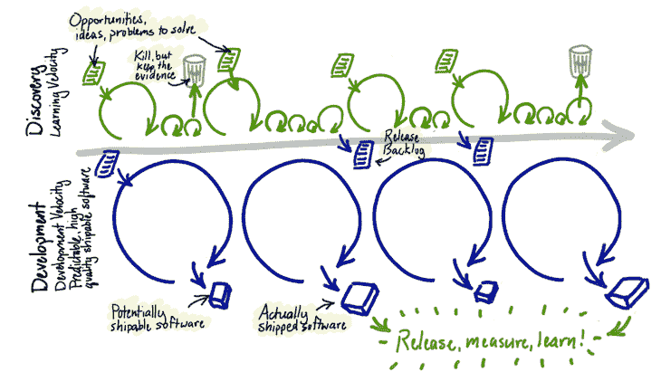
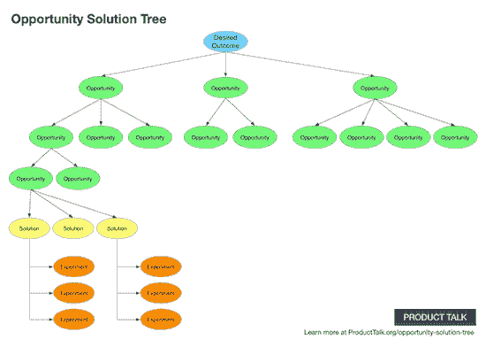

# 双轨敏捷和持续发现:你需要知道什么

> 原文：<https://blog.logrocket.com/product-management/dual-track-agile-continuous-discovery/>

在本指南中，我们将给出双轨敏捷的概述，包括它的起源、原则，以及框架如何在持续发现的背景下发展。

我们还将强调双轨敏捷和持续发现之间的一些关键区别，并推荐一些进一步的阅读材料，如果你想直接从源头上了解这些概念的话。

* * *

## 目录

* * *

## 什么是双轨敏捷？

在敏捷的早期，团队仍然在瀑布般的取票关系中挣扎。设计应该做前期工作，然后将他们的计划交给产品或工程部门。同样，产品经理努力让整个团队参与到他们的计划和优先级工作中。

[双轨敏捷](https://blog.logrocket.com/product-management/6-product-management-frameworks-you-should-know/#dual-track-agile)(也称为双轨 scrum 或双轨开发)的核心是将发现工作(确定构建什么)与交付工作(构建)相结合，并促进产品、工程和设计之间的密切合作。所有这些都是为了最大限度地向企业和客户交付有价值的成果。

Source: [Jeff Patton](https://www.jpattonassociates.com/dual-track-development/)

双轨敏捷实际上只是敏捷。双轨敏捷的标签引起了混乱。

例如，与双轨敏捷相关的最常见的误解是，有两个独立的团队负责发现和交付，或者有不同的人承担不同的责任。这从来都不是我们的本意。

Jeff Patton 从 2017 年到 2019 年的[系列文章](https://www.jpattonassociates.com/dual-track-development/)解决了双轨敏捷神话，并分享了产品团队的实用技巧。

## 持续发现是新的双轨敏捷

如果你对双轨敏捷感兴趣，你需要知道自从这个术语在十多年前第一次被创造出来以来，这个总的想法已经有了很大的发展和改进。事实上，在过去的几年里，[持续发现](https://www.producttalk.org/continuous-discovery/)已经取代了双轨敏捷。

让我们快速看一下双轨敏捷的起源，以及在理想的[数字产品开发](https://blog.logrocket.com/product-management/product-managers-role-each-product-lifecycle-stage/)环境下，它现在是什么样子。

### 双轨敏捷:简史

在[敏捷宣言](https://blog.logrocket.com/product-management/four-agile-manifesto-values-explained/)发表几年后，《可用性研究杂志》发表了一篇名为“[为敏捷的以用户为中心的设计调整可用性调查](https://uxpajournal.org/wp-content/uploads/sites/7/pdf/JUS_Sy_May2007.pdf)”的论文，描述了 UX 和工程在“双轨”或“平行轨道”上的合作

事实上，设计师和开发人员如此紧密地合作在当时是一个新颖的概念，也是对敏捷社区的有益贡献，但这些本质上是独立团队之间的小型瀑布式移交。如今，我们有了更好的工作方式。

几年后，大约在 2012 年的某个时候，在一些演讲和文章中，[杰夫·巴顿](https://www.jpattonassociates.com/dual-track-development/#:~:text=it%20dual%2Dtrack-,Years%20ago,-%2C%20I%20was%20teaching)和[马蒂·卡甘](https://www.svpg.com/dual-track-agile/)，产品管理界受人尊敬的思想领袖，创造了术语双轨 scrum 和双轨敏捷。那年晚些时候，随着持续交付在敏捷和开发世界的兴起，[卡甘开始思考持续发现的想法。](https://www.svpg.com/continuous-discovery/)

然而，故事并没有在 2012 年结束。在 2021 年 5 月发布开创性的书籍 *[持续发现习惯](https://www.amazon.com/Continuous-Discovery-Habits-Discover-Products/dp/1736633309)之前，一位名叫[特蕾莎·托雷斯](https://www.producttalk.org/about/)的设计师转变为产品领导者，与来自各种公司的产品团队合作了八年。这本书有一个由 Marty Cagan 写的前言和一些你需要知道的关于发现和交付的不可分割性的所有内容，以及设计、产品管理和工程之间的重要的三位一体关系。*

### 什么是持续发现？

持续发现旨在帮助产品团队构建正确的东西，并快速测试假设，以减少浪费并降低构建错误东西的风险。

作为一个过程，持续发现首先需要一个“产品三人组”，由来自[设计、产品和工程](https://www.linkedin.com/pulse/take-product-triad-ownership-mapping-bhuvnesh-singh/)的三个人组成。根据需要，应包括其他关键专家。

该小组作为一个团队一起工作，了解当前的体验、目标客户群和业务目标。他们一起工作，采访客户，分析数据，综合发现，同时构建一个活生生的机会空间的可视化分解。机会是目标客户的需求、痛点或愿望。

Source: [Product Talk](https://www.producttalk.org/2021/08/product-discovery/)

即使除了这本书，如果你想了解更多关于持续发现和相关概念的信息，Teresa 和团队在 [Product Talk](https://www.producttalk.org/) 有大量的可用资源。

## 双轨敏捷和持续发现有什么区别？

旧的双轨敏捷和新的持续发现概念之间至少有三个显著的区别。这些差异与客户、发现-交付关系以及设计、产品和工程三位一体的团队有关。

### 客户

首先，强调与客户交流是与传统双轨敏捷最明显的不同。这并不是说双轨敏捷是反客户的——远非如此——但是这个话题的重点总是更多地放在不同功能的关系上，以及个人如何在一套敏捷框架内一起工作，比如 [scrum](https://blog.logrocket.com/product-management/what-are-five-types-of-scrum-meetings/) 。

相比之下，正如 Teresa Torres 所言，[客户访谈](https://www.producttalk.org/customer-interviews/)是洞察机会的主要来源，[推动团队目标为](https://blog.logrocket.com/product-management/what-product-management-metrics-matter-most-to-pms/)的任何指标。她书中的大部分内容涵盖了如何进行客户访谈和自动化这些过程。用户研究也经常主导面试讨论。

### 发现-交付关系

在从双轨敏捷到持续交付的演进中，下一个明显的区别就是我们如何看待这两种类型的工作。

在一篇题为“[双轨开发不是双轨](https://www.jpattonassociates.com/dual-track-development/)”的文章中，Jeff Patton 写道，“有两种工作，没有办法绕过它。”他在文章的后面还说，“发现和发展是双轨显示的，因为它们是两种工作，两种思维。”

相比之下，特蕾莎·托雷斯显然认为发现和交付是交织在一起的。以下是托雷斯在[产品咖啡](https://anchor.fm/product-coffee/episodes/96--Building-Continuous-Discovery-Habits-wTeresa-Torres-e1f0rrf)播客上接受采访的片段:

> “我认为，当你真正擅长持续发现时，发现和交付之间就不再有什么区别了……它只是我们正在做的一件事。我不需要给它贴上标签，也不需要称之为轨道或阶段。这只是我一直在做的事情…在我们早期的假设测试中，我们可能会做原型、调查和数据挖掘，但在我们连续的[发现]轮中，我们可能会做现场生产测试。现场生产测试需要交付……”

在《持续发现习惯》这本书的第 11 章中——我很高兴地说我拥有并珍惜这本书——特里萨写道。。。我们说发现促进交付，交付促进发现。它们不是两个不同的阶段。二者缺一不可。”

### 三人组:设计、产品和工程

尽管与双轨敏捷的老方法并不矛盾，但是持续的发现确实对产品、设计和工程的具体工作模式造成了很大的冲击。这个产品三位一体也被称为三位一体或三位一体。

产品三人组正是致力于一个目标和机会空间的三个人。然而，这是一个包容性的小组，因此可以根据需要添加其他人，这取决于正在探索的机会。加上开发团队的其他成员，你就有了一个标准的 Marty Cagan 产品团队。

为了说明这在持续发现中有多重要，Teresa Torres 说，如果潜在客户没有使用 trios，她的公司甚至不会接受咨询服务。

## 去做持续的发现吧！

在你否定持续发现或双轨敏捷之前，我想给你引用一下在 Rocketship.fm 上采访 Teresa Torres 的另一段话:

> “你有一百万个理由不能这样工作，但事实是，最好的团队就是这样工作的。所以。。。问问你自己，你有多想成为最好的团队之一。如果答案是你真的想成为最好的球队之一，那么你就要开始扫除这些障碍。。。这就是今天产品的制造方式。这是未来继续制造最好产品的方式。”

*精选图片来源:[icon scout](https://iconscout.com/icon/agile-transition-4801792)*

## [LogRocket](https://lp.logrocket.com/blg/pm-signup) 产生产品见解，从而导致有意义的行动

[LogRocket](https://lp.logrocket.com/blg/pm-signup) 确定用户体验中的摩擦点，以便您能够做出明智的产品和设计变更决策，从而实现您的目标。

使用 LogRocket，您可以[了解影响您产品的问题的范围](https://logrocket.com/for/analytics-for-web-applications)，并优先考虑需要做出的更改。LogRocket 简化了工作流程，允许工程和设计团队使用与您相同的[数据进行工作](https://logrocket.com/for/web-analytics-solutions)，消除了对需要做什么的困惑。

让你的团队步调一致——今天就试试 [LogRocket](https://lp.logrocket.com/blg/pm-signup) 。

[Jordan Lamborn Follow](https://blog.logrocket.com/author/jordanlamborn/) Product manager, passionate about understanding customers and helping people with problems that matter to them. Experienced in SQL, experimentation, data analysis, research, no-nonsense SEO. I also invented self-driving vehicles.