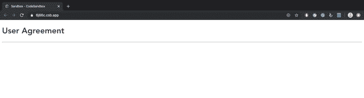
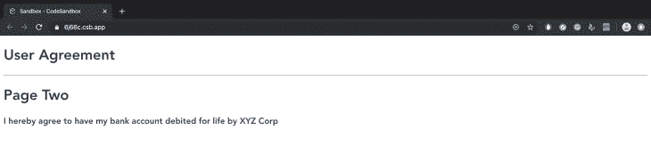

# 使用 Vue 门户的动态组件渲染

> 原文：<https://blog.logrocket.com/dynamic-component-rendering-with-vue-portal/>

在构建前端应用程序时，当试图在不同位置重新呈现组件(如模态、弹出窗口和按钮)时，可能会遇到性能障碍。通过道具传递东西不是大规模项目的选择。Vue 的最新版本旨在为这个问题引入一个解决方案——Vue portal。

Vue portal 允许您在 DOM 树中的不同位置呈现组件。让我们来看看门户如何使组件(如模态和弹出窗口)的呈现更高效。

## Vue 中以前版本的门户网站

[门户网站一直存在于 Vue](https://portal-vue.linusb.org/guide/getting-started.html) 中，只是以工作区和插件的形式存在。`[portal-vue](https://www.npmjs.com/package/portal-vue)`是一个流行的 Vue 插件，它在应用程序中创建一个`portal`元素，并在不同的 DOM 节点中呈现该元素中的任何标记——文本、按钮、弹出窗口或模态。我们将使用`portal-vue`来说明门户是如何运作的。首先，像安装任何其他插件一样将它安装到您的项目中:

```
npm install portal-vue --save
```

现在，为了更清楚地了解我们要构建的内容，让我们来展示一下我们应用程序的文件夹结构:

```
+-- public
|   +-- favicon.ico
|   +-- index.html

+-- src
|   +-- main.js
|   +-- App.vue
|   +-- components
    |   +-- UserAgreement.vue
    |   +-- UserContacts.vue

|   +-- package.json
```

接下来，在您的项目中启用插件:

```
// main.js

import Vue from 'vue'
import PortalVue from 'portal-vue'
import App from 'App.vue'

Vue.use(PortalVue)

new vue ({
  el:  '#app',
  render: h => h(App)
})
```

假设我们有一些数据需要在应用程序的不同地方重用，比如用户协议。为了重用用户协议，我们将其包装在一个`portal`元素中:

```
<!-- ./components/UserAgreement.vue -->

<template>
  <div class="user-agreement">
    <h1>User Agreement</h1>
    <portal to="user-contacts">
      <h3>I hereby agree to have my bank account debited for life by XYZ Corp</h3>
    </portal>
  </div>
</template>
<script>
export default {
  name: "UserAgreement"
};
</script>
```

接下来，让我们将`UserAgreement`组件导入到应用程序的根组件中:

```
<!-- App.vue -->

<template>
  <div id="app">
    <UserAgreement/>
  </div>
</template>
<script>
import UserAgreement from "./components/UserAgreement";

export default {
  name: "App",
  components: {
    UserAgreement
  }
};
</script>
<style>
#app {
  font-family: "Avenir", Helvetica, Arial, sans-serif;
  -webkit-font-smoothing: antialiased;
  -moz-osx-font-smoothing: grayscale;
  color: #2c3e50;
}
</style>
```

并试着展示出来:



单独呈现的上述代码示例不会显示 portal 元素中的内容。原因是尽管在`UserAgreement.vue`中指定了门户的目的地(作为`user-contacts`),但它从未被创建。让我们尝试通过创建第二个组件`UserContacts.vue`来指定门户的目的地:

```
<!-- ./components/UserContacts.vue -->

<template>
  <div class="contacts">
    <h1>Page Two</h1>
    <portal-target name="user-contacts"/>  <!-- specify the destination here -->  
  </div>
</template>
<script>
export default {
  name: "UserContacts"
};
</script>
```

接下来，我们将相应地更新`App.vue`:

```
<!-- App.vue -->

<template>
  <div id="app">
    <UserAgreement/>
    <hr>
    <UserContacts/>
  </div>
</template>
<script>
import UserAgreement from "./components/UserAgreement";
import UserContacts from "./components/UserContacts";
export default {
  name: "App",
  components: {
    UserAgreement,
    UserContacts
  }
};
</script>
<style>
#app {
  font-family: "Avenir", Helvetica, Arial, sans-serif;
  -webkit-font-smoothing: antialiased;
  -moz-osx-font-smoothing: grayscale;
  color: #2c3e50;
}
</style>
```

现在，当我们显示我们的根组件时，我们可以看到由`portal`元素包装的内容:



当`UserAgreement`和`UserContact`呈现在根组件中时，将显示`portal`元素中的文本。这使得重用按钮、模态和弹出通知等元素变得容易，因为您可以在单个组件中拥有多个`portal`元素，然后可以将这些元素发送给需要它们的不同组件。考虑在您的项目中设置一个按钮组件，将按钮封装在不同的门户中，并将它们传送到项目中需要它们的任何地方。

## 门户和 html

请注意，门户的功能不仅限于单个文件组件。在你需要通过一个`.html`文件显示一个组件的情况下，你可以使用`target-el`属性来完成。假设我们需要包含一个按钮，该按钮包含一个询问用户是否要移除某个项目的模态功能。

```
+-- App
|   +-- index.html
|   +-- style.css
|   +-- index.js
```

首先，我们将通过`script`标签包含`vue`和`portal-vue`:

```
<!-- index.html -->

<html>
  <head>
    <script src="https://unpkg.com/[email protected]/dist/vue.js"></script>
    <script src="https://unpkg.com/[email protected]/dist/portal-vue.js"></script>
  </head>
</html>
```

然后，我们将创建显示消息的模式:

```
<!-- index.js -->

Vue.component('RemovePhoneModal', {
  template: `
      <div v-show="open" @click="close">
        <div @click.stop>
          <h1>
           Are you sure you want to remove this phone from your list?
          </h1>
          <div>
              <button type="button" @click="close">
                Cancel
              </button>
              <button type="button">
                Remove
              </button>
            </div>
          </div>
        </div>
      </div>
  `,
  props: ['open'],
  methods: {
    close() {
      this.$emit('close')
    }
  }
})
```

接下来，仍然在`index.js`中，我们将为按钮创建一个组件，该组件将嵌入模态:

```
Vue.component('RemovePhoneButton', {
  template: `
    <button @click="openModal">
      <span>Remove Phone</span>
        <portal target-el="#modals">
          <RemovePhoneModal :open="open" @close="close" />
        </portal>
    </button>
  `,
  data() {
    return {
      open: false,
    }
  },
  methods: {
    openModal() {
      this.open = true
    },
    close() {
      this.open = false
    }
  }
})
```

然后，我们将为我们的应用程序创建一个 Vue 实例:

```
const app = new Vue({
  el: '#app',
})
```

接下来，我们将创建我们的 HTML 模板:

```
<!-- index.html -->

<!DOCTYPE html>
<html lang="en">
<head>
    <meta charset="UTF-8">
    <meta name="viewport" content="width=device-width, initial-scale=1.0">
    <meta http-equiv="X-UA-Compatible" content="ie=edge">
    <title>Phone App</title>
    <link rel="stylesheet" href="style.css">
</head>

<body>
<div id="app">
  <!-- This button will probably be surrounded... -->
    <RemovePhoneButton></RemovePhoneButton>
  <!-- ...by a lot of markup for your site. -->

  <!-- At the very end of your markup to avoid absolute/relative positioning bugs... -->

  <div id='modals'></div>
</div>

<!-- ...Insert the portal above here.-->
  </body>
</html>
```

最后，我们将通过[顺风 CSS](https://tailwindcss.com/) 添加一些过渡。将其 CDN 脚本包含在您的`index.html`文件的`<head>`标签中:

```
<!-- index.html -->

<head>
   <link rel="stylesheet" href="https://unpkg.com/[email protected]/dist/tailwind.min.css">
</head>
```

然后定义您的 CSS 转换，如果您愿意，它可以与我的不同:

```
<!-- style.css -->

.fade-shrink-in-enter-active,
.fade-shrink-in-leave-active {
  transition: all .3s ease;
}

.fade-shrink-in-enter,
.fade-shrink-in-leave-to {
  opacity: 0;
  transform: scale(1.1);
}
```

出于参考目的，您可以在此处查看此演示的笔[。让我们在下面的视频片段中看看这是如何工作的:](https://codepen.io/fullstackmafia/pen/rNamvzG)

 [https://www.youtube.com/embed/cOJWULk6xCU?version=3&rel=1&showsearch=0&showinfo=1&iv_load_policy=1&fs=1&hl=en-US&autohide=2&wmode=transparent](https://www.youtube.com/embed/cOJWULk6xCU?version=3&rel=1&showsearch=0&showinfo=1&iv_load_policy=1&fs=1&hl=en-US&autohide=2&wmode=transparent)

视频

## 门户如何在 Vue 3 中工作

Vue 3 中有许多[重大改进](https://vueschool.io/articles/vuejs-tutorials/exciting-new-features-in-vue-3/),例如:

*   组合 API
*   碎片
*   焦虑
*   多重`v-models`
*   自定义指令 API

门户也不例外，因为在 Vue 的最新版本中，它们将是一个内置的特性。值得注意的是，它们的基本功能将保持不变——唯一的区别是门户将不必安装，因为它们将以`Portal`元素的形式出现。它们只有一个属性，`target`，它将`Portal`元素中的内容呈现给一个 DOM 元素，这个 DOM 元素具有传递给`target`属性的相同查询选择器(`id`或`class`)。

让我们通过实现 Vue 3 中应该出现的门户来尝试重新创建我们之前的一个示例:

```
<!-- index.js -->

Vue.component('RemovePhoneModal', {
  template: `
      <div v-show="open" @click="close">
        <div @click.stop>
          <h1>
           Are you sure you want to remove this phone from your list?
          </h1>
          <div>
              <button type="button" @click="close">
                Cancel
              </button>
              <button type="button">
                Remove
              </button>
            </div>
          </div>
        </div>
      </div>
  `,
  props: ['open'],
  methods: {
    close() {
      this.$emit('close')
    }
  }
})
```

接下来，在我们的`index.html`文件中，我们将让`Portal`元素用一个`id`包装`RemovePhoneModal`，该元素将在不同的 DOM 元素中被引用:

```
<!-- index.html -->

<html>
  <body>
<!-- The portal can be embedded in any Vue component where it's needed -->
    <VueComponent>
      <Portal target="#modal">
        <RemovePhoneModal />
      </Portal>
    </VueComponent>
<!-- A DOM element with the same ID is inserted just before the closing body tag -->
    <div id="modal"></div>
  </body>
<html>
```

## 结论

就像我们在这篇文章中提到的细节一样，Vue 3 肯定会有很多令人兴奋的功能。看看它们如何被用于构建项目，哪些特性将被证明是有用的，以及哪些特性会被生态系统所反对，这将是非常有趣的。就个人而言，我认为 portal 将继续存在，因为它将在使可重用元素易于使用方面大有作为。

## 像用户一样体验您的 Vue 应用

调试 Vue.js 应用程序可能会很困难，尤其是当用户会话期间有几十个(如果不是几百个)突变时。如果您对监视和跟踪生产中所有用户的 Vue 突变感兴趣，

[try LogRocket](https://lp.logrocket.com/blg/vue-signup)

.

[](https://lp.logrocket.com/blg/vue-signup)[https://logrocket.com/signup/](https://lp.logrocket.com/blg/vue-signup)

LogRocket 就像是网络和移动应用程序的 DVR，记录你的 Vue 应用程序中发生的一切，包括网络请求、JavaScript 错误、性能问题等等。您可以汇总并报告问题发生时应用程序的状态，而不是猜测问题发生的原因。

LogRocket Vuex 插件将 Vuex 突变记录到 LogRocket 控制台，为您提供导致错误的环境，以及出现问题时应用程序的状态。

现代化您调试 Vue 应用的方式- [开始免费监控](https://lp.logrocket.com/blg/vue-signup)。