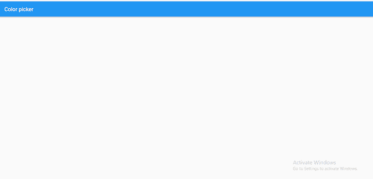
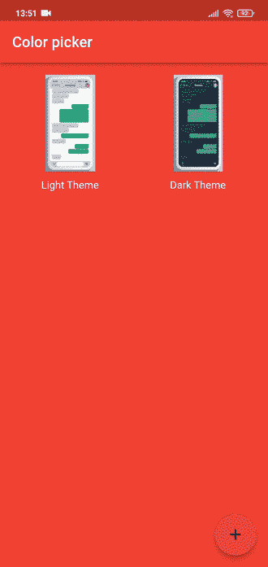

# 如何在 Flutter 中创建动态主题切换器

> 原文：<https://blog.logrocket.com/dynamic-theme-switcher-flutter/>

在过去，没有什么比定制设备(手机)更酷的了，颜色、图标和背景在动态主题下看起来都很棒。信不信由你，这些主题给了移动设备大部分的吸引力。看看下面的两张图片:

区分这两者并不困难——这就是主题的好处。

这篇文章将指导你如何创建一个动态主题切换器，可以在三种颜色之间切换，生成一个动态主题。它还将使用`palette_generator` Flutter 包从图像中识别主色方案。

向前跳:

我们开始吧！

## 先决条件

对于本教程，我们希望读者拥有最新版本的具有空安全性的 Flutter SDK。此外，阅读器必须安装以下依赖项:

*   `flutter_colorpicker` : v1.0.3
*   `material_color_generator` : v1.1.0
*   `palette_generator` : v0.3.3+2
*   `provider` : v6.0.3
*   `shared_preferences` : v2.0.15

## 创建我们的 Flutter 应用程序

我们将首先创建一个新的 Flutter 项目，为此，我们将在终端中粘贴以下命令:

```
Flutter create <foldername>

```

> 注:用计划的项目名称替换`<foldername>`。

上面的命令创建任何新的颤振项目的标准计数器项目。我们不需要那个。相反，我们将用下面的代码替换`main.dart`文件中的代码:

```
import 'package:flutter/material.dart';
void main() {
  runApp(const MyApp(
    title: 'Color picker',
  ));
}
class MyApp extends StatefulWidget {
  const MyApp({Key? key, required this.title}) : super(key: key);
  final String title;
  @override
  State<MyApp> createState() => _MyAppState();
}
class _MyAppState extends State<MyApp> {
  @override
  Widget build(BuildContext context) => MaterialApp(
      title: 'Flutter Demo',
      debugShowCheckedModeBanner: false,
      home: Scaffold(
          appBar: AppBar(
        title: Text(widget.title),
      )));
}

```

上面的代码和默认的`main.dart`颤振代码的区别在于，我们没有使用`stateless widget`，而是使用了`stateful widget`。这是因为该项目旨在影响主题小部件的状态，而我们无法用`stateless widgets`来完成。这是项目在这一阶段的图像:



我们稍后将构建这个组件，但在此之前，我们将创建一个`ChangeNotifier`类，它将处理我们的基本小部件的切换和持久性。

### 使用`ChangeNotifier`恢复之前的状态

我们所说的坚持是什么意思？在这种情况下，持久性意味着当应用程序重新加载或关闭时，当前状态被存储，因此，当重新加载时，应用程序恢复到它保存的前一状态。为此，我们将使用先决条件中提到的`shared_preference`包。

首先，我们将创建一个名为`themes.dart`的新文件，并将下面的代码粘贴到其中:

```
import 'package:flutter/material.dart';
import 'package:shared_preferences/shared_preferences.dart';

class AppTheme extends ChangeNotifier {
  final String key = "theme";
  SharedPreferences? _prefs;
  late bool _darktheme;

  bool get darkTheme => _darktheme;

  AppTheme() {
    _darktheme = true;
    _loadprefs();
  }

  switchthemelight() {
    _darktheme = false;
    _saveprefs();
    notifyListeners();
  }

  switchthemedark() {
    _darktheme = true;
    _saveprefs();
    notifyListeners();
  }

  _initiateprefs() async {
    _prefs ??= await SharedPreferences.getInstance();
  }

  _loadprefs() async {
    await _initiateprefs();
    _darktheme = _prefs?.getBool(key) ?? true;
    notifyListeners();
  }

  _saveprefs() async {
    await _initiateprefs();
    _prefs?.setBool(key, _darktheme);
  }
}

```

从顶部开始，我们创建了一个名为`AppTheme`的类，它是`ChangeNotifier`类的扩展。在该类中，有一个共享首选项的键、一个`SharedPreferences`实例、一个布尔实例和一个布尔实例的 getter。

接下来，我们调用一个初始化器并输入布尔实例，我们将其设置为值`true`。

然后，我们创建了两个函数:`switchthemelight()`和`switchthemedark()`，它们分别将布尔值更改为`false`和`true`。最后，最后三个函数`_initiateprefs()`、`_loadprefs()`和`_saveprefs()`处理`SharedPreferences`实例的初始化、加载和保存属性。

> 注意:`SharedPreferences`只能处理少量数据。

现在我们可以处理这个项目的 UI 部分。

### 颤振项目用户界面

这个 Flutter 项目的用户界面部分将分为两个部分:为不同的主题属性和图像颜色选择个人颜色。

#### 从主题属性中选择颜色选项

我们将首先创建两个字段、一个包含图像的列表和六个类型为`Color`的变量(两个主题各三个):

```
final urlImages = [
  'images/light.jpg',
  'images/dark.jpg',
];
Color lightindigo = Colors.indigo;
Color lightpink = Colors.pink;
Color lightred = Colors.red;
Color darkindigo = Colors.indigo;
Color darkpink = Colors.pink;
Color darkred = Colors.red;

```

接下来，我们将把构建方法包装在一个`ChangeNotifierProvider`中。这样做需要我们使用先决条件中提到的`provider`包。

然后，我们将子部件设置为一个`Consumer`类(也可以通过提供者包获得),并返回`MaterialApp`类:

```
Widget build(BuildContext context) => ChangeNotifierProvider(
    create: (context) => AppTheme(),
    child: Consumer<AppTheme>(builder: (context, state, child) {
      return MaterialApp(
      );
    })
);

```

通过在消费者中包装`MaterialApp`类，我们可以使用在`AppTheme`类中创建的`getters`和`functions`。

从列表上最重要的事情开始，我们想要创建一个主题。因此，在`MaterialApp`类中，我们将创建一个主题小部件，调用一个`if-else`语句，并将条件设置为在`AppTheme`类中创建的 getter `darktheme`。条件语句检查在`AppTheme`类中初始化的`darktheme` getter 的值(在本例中为`true`)。主题小部件应该使用第一个主题，如果`false`，它应该使用第二个主题:

```
title: 'Flutter Demo',
debugShowCheckedModeBanner: false,
theme: state.darkTheme
    ? dark = ThemeData(
        appBarTheme: AppBarTheme(color: darkred),
        colorScheme: const ColorScheme.dark().copyWith(
          secondary: darkpink,
          brightness: Brightness.dark,
        ),
        scaffoldBackgroundColor: colors.isNotEmpty
            ? colors[_currentindex = 1].color
            : darkred,
      )
    : light = ThemeData(
        colorScheme: ColorScheme.fromSwatch(
          primarySwatch: generateMaterialColor(color: lightred),
        ).copyWith(
          secondary: lightpink,
          brightness: Brightness.light,
        ),
        scaffoldBackgroundColor: colors.isNotEmpty
            ? colors[_currentindex].color
            : lightindigo),

```

> 注意:我们对条件语句使用 tenary 操作符，并使用`material_color_generator`包将我们创建的颜色变量赋给`primarySwatch`。

要在 Flutter 中使用图像，我们将转到`pubspec.yaml`文件并取消对资产部分的注释，如下例所示:

```
assets:
  - images/

```

最后，我们将使用之前导入的图像创建一个`Gridview`。这些图像将被包装在一个`GestureDetector`小部件中，并使用一个函数链接到一个`dialog`小部件。

我们将在使用`colorpicker`包的`dialog`小部件中创建三个小部件。这样做将允许用户选择自定义的颜色设计，以取代默认的颤振主题。

以下是最终代码:

```
import 'package:flutter/material.dart';
import 'package:flutter_colorpicker/flutter_colorpicker.dart';
import 'package:palette_generator/palette_generator.dart';
import 'package:provider/provider.dart';
import 'package:theme_switcher/themes.dart';
import 'package:material_color_generator/material_color_generator.dart';
void main() {
  runApp(const MyApp(
    title: 'Color picker (Light Theme)',
  ));
}
class MyApp extends StatefulWidget {
  const MyApp({Key? key, required this.title}) : super(key: key);
  final String title;
  @override
  State<MyApp> createState() => _MyAppState();
}
class _MyAppState extends State<MyApp> {
  late ThemeData light;
  late ThemeData dark;

  final urlImages = [
    'images/light.jpg',
    'images/dark.jpg',
  ];
  Color lightindigo = Colors.indigo;
  Color lightpink = Colors.pink;
  Color lightred = Colors.red;
  Color darkindigo = Colors.indigo;
  Color darkpink = Colors.pink;
  Color darkred = Colors.red;

  @override
  Widget build(BuildContext context) => ChangeNotifierProvider(
      create: (context) => AppTheme(),
      child: Consumer<AppTheme>(builder: (context, state, child) {
        return MaterialApp(
          title: 'Flutter Demo',
          debugShowCheckedModeBanner: false,
          theme: state.darkTheme
              ? dark = ThemeData(
                  appBarTheme: AppBarTheme(color: darkred),
                  colorScheme: const ColorScheme.dark().copyWith(
                    secondary: darkpink,
                    brightness: Brightness.dark,
                  ),
                  scaffoldBackgroundColor: colors.isNotEmpty
                      ? colors[_currentindex = 1].color
                      : darkred,
                )
              : light = ThemeData(
                  colorScheme: ColorScheme.fromSwatch(
                    primarySwatch: generateMaterialColor(color: lightred),
                  ).copyWith(
                    secondary: lightpink,
                    brightness: Brightness.light,
                  ),
                  scaffoldBackgroundColor: colors.isNotEmpty
                      ? colors[_currentindex].color
                      : lightindigo),
          home: Scaffold(
            appBar: AppBar(
              title: state.darkTheme ? Text("Color Picker (Dark Theme)") : Text(widget.title),
            ),
            body: GridView.builder(
              gridDelegate: const SliverGridDelegateWithFixedCrossAxisCount(
                crossAxisCount: 2,
                crossAxisSpacing: 16,
                mainAxisSpacing: 16,
              ),
              padding: const EdgeInsets.only(top: 16, left: 16, right: 16),
              itemBuilder: (BuildContext context, int index) {
                return GestureDetector(
                  onTap: () => index == 0
                      ? customizetheme(context, index, "Light Theme")
                      : customizetheme(context, index, "Dark Theme"),
                  child: Column(
                    children: [
                      Expanded(
                        child: Container(
                          alignment: Alignment.center,
                          decoration: BoxDecoration(
                            image: DecorationImage(
                                image: AssetImage(urlImages[index])),
                          ),
                        ),
                      ),
                      Container(
                        alignment: Alignment.bottomCenter,
                        padding: const EdgeInsets.fromLTRB(0, 10, 0, 0),
                        child: index == 0
                            ? const Text('Light Theme')
                            : const Text('Dark Theme'),
                      )
                    ],
                  ),
                );
              },
              itemCount: urlImages.length,
            ),
            floatingActionButton: FloatingActionButton(
              onPressed: () {},
              child: const Icon(Icons.add), //doesn't do anything
            ),
          ),
        );
      }));
  Widget buildappbarbackgroundColorPicker(index) => MaterialPicker(
        pickerColor: index != 0 ? darkred : lightred,
        onColorChanged: (Color color) => setState(() {
          if (index != 0) {
            darkred = color;
          } else {
            lightred = color;
          }
        }),
      );
  Widget buildbackgroundColorPicker(index) => MaterialPicker(
        pickerColor: index != 0 ? darkindigo : lightindigo,
        onColorChanged: (Color color) => setState(() {
          if (index != 0) {
            darkindigo = color;
          } else {
            lightindigo = color;
          }
        }),
      );
  Widget buildColorPicker(index) => MaterialPicker(
        pickerColor: index != 0 ? darkpink : lightpink,
        onColorChanged: (Color color) => setState(() {
          if (index != 0) {
            darkpink = color;
          } else {
            lightpink = color;
          }
        }),
      );
  void customizetheme(BuildContext context, index, String titlebody) =>
      showDialog(
          context: context,
          builder: (context) =>
              Consumer<AppTheme>(builder: (context, state, child) {
                return AlertDialog(
                  title: Text(titlebody),
                  content: SingleChildScrollView(
                    child: Column(
                      mainAxisSize: MainAxisSize.min,
                      children: [
                        const Text("Primary Swatch: "),
                        buildappbarbackgroundColorPicker(index),
                        const SizedBox(
                          height: 20,
                        ),
                        const Text("Scaffold Background: "),
                        buildbackgroundColorPicker(index),
                        const SizedBox(
                          height: 20,
                        ),
                        const Text("Secondary colorscheme"),
                        buildColorPicker(index),
                      ],
                    ),
                  ),
                  actions: <Widget>[
                    TextButton(
                        onPressed: () {
                          Navigator.of(context).pop();
                        },
                        child: const Text(
                          "Close",
                          style: TextStyle(fontSize: 20),
                        )),
                    TextButton(
                        onPressed: () {
                          if (index != 0) {
                            state.switchthemedark();
                            _currentindex = index;
                          } else {
                            state.switchthemelight();
                            _currentindex = index;
                          }
                          Navigator.of(context).pop();
                        },
                        child: const Text(
                          "Switch Themes",
                          style: TextStyle(fontSize: 20),
                        )),
                  ],
                );
              }));
}

```

### 使用`palette_generator`颤振包

最后，我们希望得到我们选择的图像的主色。为此，我们将在 Flutter 中使用`palette_generator`包。

首先创建两个实例，`PaletteColor colors`和`int _currentindex`。然后，我们将在一个`initState()`函数中初始化它们，在该函数中，我们将调用另一个名为`_updatepalettes()`的函数。

我们将在这个新函数中使用一个`for loop`来迭代我们之前导入的图像列表。我们将调用`PaletteGenerator.fromImageProvider`函数，它将接受参数`size`和`AssetImage`。结果如下:

```
late List<PaletteColor> colors;
late int _currentindex;

@override
void initState() {
  super.initState();
  colors = [];
  _currentindex = 0;
  _updatepalettes();
}
_updatepalettes() async {
  for (String image in urlImages) {
    final PaletteGenerator pg = await PaletteGenerator.fromImageProvider(
        AssetImage(image),
        size: const Size(200, 200));
    colors.add(pg.dominantColor ?? PaletteColor(Colors.blue, 2));
  }
  setState(() {});
}

```

然后将下面的代码添加到任何 clemon 着色的小部件中:

```
colors[_currentindex].color

```

这是我们的最终结果:



## 结论

在本教程中，我们学习了如何在 Flutter 中通过允许用户选择自定义主题来创建动态主题切换器。我们还展示了如何使用`palette_generator`包从图像中选择主色。查看 [colorpicker 包](https://pub.dev/packages/flutter_colorpicker)获取更多资源。

感谢您的阅读，祝您编码愉快！

## 使用 [LogRocket](https://lp.logrocket.com/blg/signup) 消除传统错误报告的干扰

[](https://lp.logrocket.com/blg/signup)

[LogRocket](https://lp.logrocket.com/blg/signup) 是一个数字体验分析解决方案，它可以保护您免受数百个假阳性错误警报的影响，只针对几个真正重要的项目。LogRocket 会告诉您应用程序中实际影响用户的最具影响力的 bug 和 UX 问题。

然后，使用具有深层技术遥测的会话重放来确切地查看用户看到了什么以及是什么导致了问题，就像你在他们身后看一样。

LogRocket 自动聚合客户端错误、JS 异常、前端性能指标和用户交互。然后 LogRocket 使用机器学习来告诉你哪些问题正在影响大多数用户，并提供你需要修复它的上下文。

关注重要的 bug—[今天就试试 LogRocket】。](https://lp.logrocket.com/blg/signup-issue-free)