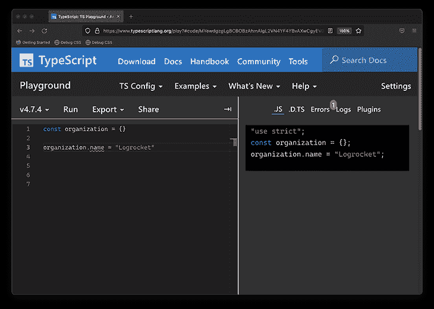
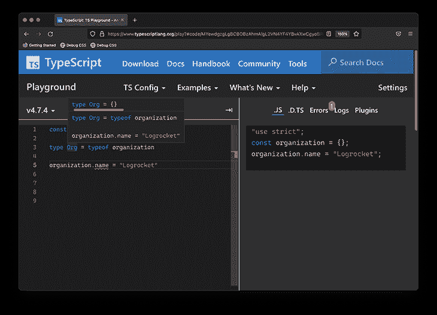
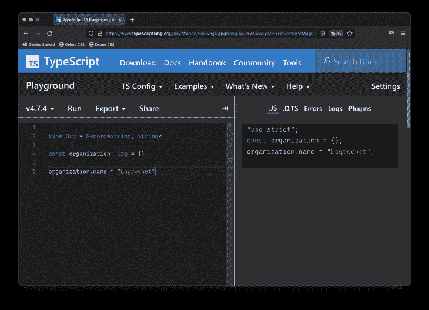
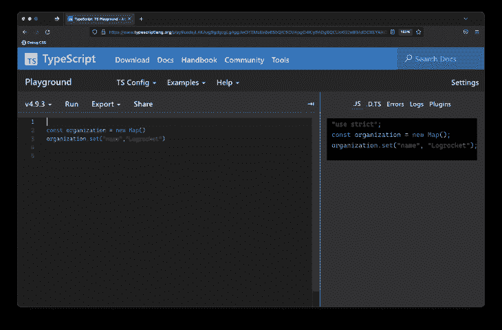
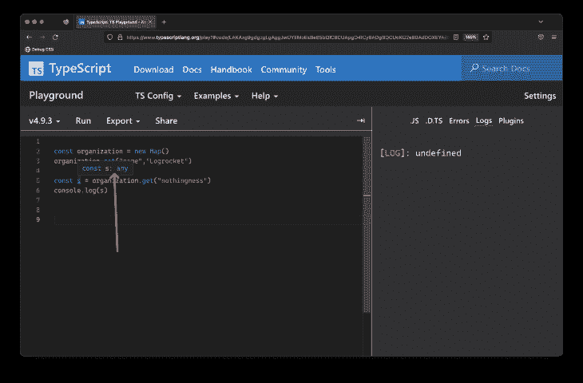
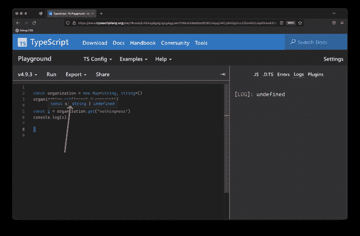

# 如何在 TypeScript 中为对象动态分配属性

> 原文：<https://blog.logrocket.com/dynamically-assign-properties-object-typescript/>

考虑下面的类型脚本代码示例:

```
const organization = {}
organization.name = "Logrocket"                                                                                 

```

这段看似无害的代码在将`name`动态分配给`organization`对象时抛出了一个 TypeScript 错误。



An error is thrown when dynamically assigning a property to an object

在[的 TypeScript Playground](https://www.typescriptlang.org/play#code/MYewdgzgLgBCBOBzAhmAlgL2VN4YF4YBvAXwCgyEV0sdwA6MZAWwFMCYAiAGREXhDAA1qyicKMSVOkzZc+QsVLlK1WukUgA) 中看到这个例子。

困惑的来源是:看起来如此简单的东西怎么会成为打字稿中的一个问题呢？如果你是打字稿初学者，这种困惑也许是合理的。

TL；最重要的是，如果不能在声明时定义变量类型，可以使用`Record`实用程序类型或对象索引签名来解决这个问题。但是在这篇文章中，我们将仔细研究问题本身，并找到一个在大多数情况下都可行的解决方案。

*向前跳转:*

## 理解为对象动态分配属性的问题

一般来说，TypeScript 在声明变量时确定变量的类型，这种确定的类型不会改变，也就是说，它在整个应用程序中保持不变。

这个规则也有例外，比如当考虑类型收缩或者使用`any`类型时，但是这是一个需要记住的一般规则。

在前面的例子中，`organization`对象声明如下:

```
const organization = {}

```

没有给`organization`变量赋值显式类型，因此 TypeScript 根据声明推断出`organization`的类型为`{}`，即文本空对象。

例如，如果您添加一个类型别名，您可以浏览`organization`的类型:

```
type Org = typeof organization

```



Exploring the literal object type

参见[中的打字稿游乐场](https://www.typescriptlang.org/play?#code/MYewdgzgLgBCBOBzAhmAlgL2VN4YF4YBvAXwCgyoBPABwFMYB5JAma+kAMziVU21xgKCFOiw5wAOjDIAtg0IAiADIhE8EMADWdKIooxDR4ydNnzFy1es3bd4xSA)。

当您试图在这个空的对象文字上引用`name`属性时:

```
organization.name = ...

```

TypeScript 大叫。

> 类型“`{}`”上不存在属性“name”

当你理解了这个问题，这个错误看起来是合适的。

让我们解决这个问题。

## 解决问题

这里有许多方法可以解决 TypeScript 错误。让我们考虑这些:

### 解决方案 1:在声明时显式键入对象

这是最容易理解的解决方案。在声明对象时，继续输入它。此外，给它分配所有相关的值。

```
type Org = {
    name: string
}

const organization: Org = {
    name: "Logrocket"
}

```

请看[中的打字稿操场](https://www.typescriptlang.org/play?#code/FAFwngDgpgBA8gJwOYwLwwN7BjmA7AQwFsoAuGAZxAQEs8lgBfYYAYwHs8qZ3kC8aALwIgancohTosufMTIwARABl2SBO1YBrKCEVMgA)。

这消除了任何意外。在创建对象时，您清楚地说明了这个对象的类型，并正确地声明了所有相关的属性。

然而，如果对象属性必须动态添加*，这并不总是可行的，这就是为什么我们都在这里。*

 *### 解决方案 2:使用对象索引签名

有时候，对象的属性确实需要在声明后添加。在这种情况下，您可以使用对象索引签名，如下所示:

```
type Org = {[key: string] : string}
const organization: Org = {}
organization.name = "Logrocket"

```

请看[中的打字稿操场](https://www.typescriptlang.org/play#code/FAFwngDgpgBA8gJwOYwLwwN4G0DWUwBcMAziAgJYB2SAujEaRdQL7DADGA9paTJ8gENK5AF4CQ5bkUQp0GVsH5Iho8ZMoA6SgIC2sdACIAMpyQJO7PCAPAgA)。

在声明`organization`变量时，您可以将它显式地输入到下面的`{[key: string] : string}`中。

为了进一步解释语法，您可能习惯于具有固定属性类型的对象类型:

```
type obj = {
  name: string
}

```

但是，你也可以用`name`来代替“变量类型”。

例如，如果您想在`obj`上定义任何字符串属性:

```
type obj = {
 [key: string]: string
}

```

请注意，语法类似于在标准 JavaScript 中使用 variable object 属性的方式:

```
const variable = "name" 
const obj = {
   [variable]: "Freecodecamp"
}

```

等效的 TypeScript 称为对象索引签名。此外，请注意，您可以使用其他原语键入`key`:

```
// number 
type Org = {[key: number] : string}

// string 
type Org = {[key: string] : string}

//boolean
type Org = {[key: boolean] : string}

```

### 解决方案 3:使用`Record`实用程序类型

[`Record`实用程序类型](https://www.typescriptlang.org/docs/handbook/utility-types.html#recordkeys-type)允许你压缩一个属性为`Keys`属性值为`Type`的对象类型。它有如下签名:`Record<Keys, Type>`。

在我们的例子中，`Keys`代表`string`和`Type`，`string`也是如此。这里的解决方案非常简洁，如下所示:

```
type Org = Record<string, string>

const organization: Org = {}

organization.name = "Logrocket"

```

除了使用类型别名，您还可以内联类型:

```
const organization: Record<string, string> = {}

```



Using the `Record` utility type

参见[中的打字稿游乐场](https://www.typescriptlang.org/play?#code/FAFwngDgpgBA8gJwOYwLwwEpQMYHsEAmAPAM4gICWAdkgDQxmU0B8wweVZM+SAhlRQBevEBVxUAXPGRoYAbwC+bHvyEixVAHRVeAW1joARABlcSBLmwBrKCENA)。

### 解决方案 4:使用`Map`数据类型

现在，`Map`对象是与`object`完全不同的数据结构，但是为了完整起见，如果使用`Map`，就可以消除这个问题。

考虑使用一个`Map`对象重写的起始示例:

```
// before 
const organization = {}
organization.name = "Logrocket"  

// after 
const organization = new Map()
organization.set("name","Logrocket")

```

有了`Map`对象，当你动态分配属性给对象:
时不会有错误

[在 TypeScript playground](https://www.typescriptlang.org/play?#code/LAKAxg9gdgzgLgAggJwOYEMoEsBe65bQIC8CUApgO4ICy6ADgBQCUoKG2eB0AdDOXEYAiKOgC25IQBohAGQipkEMAGsBQ1iFBA) 看到这个。

乍一看，这似乎是一个很好的解决方案，但是需要注意的是您的`Map`对象是弱类型的。您可以访问一个不存在的属性，但不会收到任何警告:

```
const organization = new Map()
organization.set("name","Logrocket")

// Property nothingness does not exist. No TS warnings 
const s = organization.get("nothingness")
console.log(s)

```

[见打字稿操场](https://www.typescriptlang.org/play?#code/LAKAxg9gdgzgLgAggJwOYEMoEsBe65bQIC8CUApgO4ICy6ADgBQCUoKG2eB0AdDOXEYAiKOgC25IQBohAGQipkEMAGsBQ1iFCRYiGCSRpMufISg9UA4VAhwAFliioKMGBu3QYEADbke3hUYYTVBQIA)。

这与标准对象不同。

默认情况下，初始化后的`Map`的键值类型为`any`——即`new () => Map`。因此，`s`变量的返回类型将是`any` :


When using a `Map`, at the very least, I strongly suggest passing some type information upon creation. For example:

```
const organization = new Map<string, string>()
organization.set("name","Logrocket")
const s = organization.get("nothingness")
console.log(s)

```

`s`仍将是未定义的，但你不会对它的代码用法感到惊讶。你现在会收到合适的类型:


If you truly don’t know what the `keys` of the `Map` will be, you can go ahead and represent this at the type level:

```
const organization = new Map<unknown, string>()

```

如果您不确定`keys`或`values`是什么，安全起见，请在类型级别表示它:

```
const organization = new Map<unknown, unknown>()

```

### 解决方案 5:考虑一个可选的`object`属性

此解决方案并不总是可行的，但如果您知道要动态分配的属性的名称，则可以在初始化对象时继续提供此选项，如下所示:

```
const organization : {name?: string} = {}
organization.name = "Logrocket" 

```

[见打字稿操场](https://www.typescriptlang.org/play?#code/LAKAxg9gdgzgLgAggJwOYEMoEsBe65bQIBcCA3lOgLYCmA-KfMllKgL4IC85booKGbHgLQAdJVpcEAIgAyEVMghgA1jTjSECPiCA)。

如果您不喜欢使用可选属性，您可以更明确地输入，如下所示:

```
const organization : {name: string | null} = {
    name: null
}
organization.name = "Logrocket"  

```

[见打字稿操场](https://www.typescriptlang.org/play?#code/LAKAxg9gdgzgLgAggJwOYEMoEsBe65bQIBcCA3lOgLYCmp8yWUqCAPglAK4A23AvggC85UAjEdqdDj26g+oUCgzY8BaADpKtIQgBEAGQipkEMAGsacXWIUggA)。

## 结论

除了原语，您必须处理的最常见的类型可能是对象类型。

在需要动态构建对象的情况下，利用`Record`实用程序类型或使用对象索引签名来定义对象上允许的属性。

如果你想阅读更多关于这个主题的内容，请随意查看我关于栈溢出的七个最常被问到的打字稿问题的备忘单，或者用推特给我发任何问题。干杯！

## [LogRocket](https://lp.logrocket.com/blg/typescript-signup) :全面了解您的网络和移动应用

[](https://lp.logrocket.com/blg/typescript-signup)

LogRocket 是一个前端应用程序监控解决方案，可以让您回放问题，就像问题发生在您自己的浏览器中一样。LogRocket 不需要猜测错误发生的原因，也不需要向用户询问截图和日志转储，而是让您重放会话以快速了解哪里出错了。它可以与任何应用程序完美配合，不管是什么框架，并且有插件可以记录来自 Redux、Vuex 和@ngrx/store 的额外上下文。

除了记录 Redux 操作和状态，LogRocket 还记录控制台日志、JavaScript 错误、堆栈跟踪、带有头+正文的网络请求/响应、浏览器元数据和自定义日志。它还使用 DOM 来记录页面上的 HTML 和 CSS，甚至为最复杂的单页面和移动应用程序重新创建像素级完美视频。

[Try it for free](https://lp.logrocket.com/blg/typescript-signup)

.*