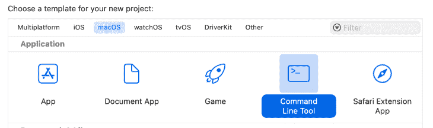
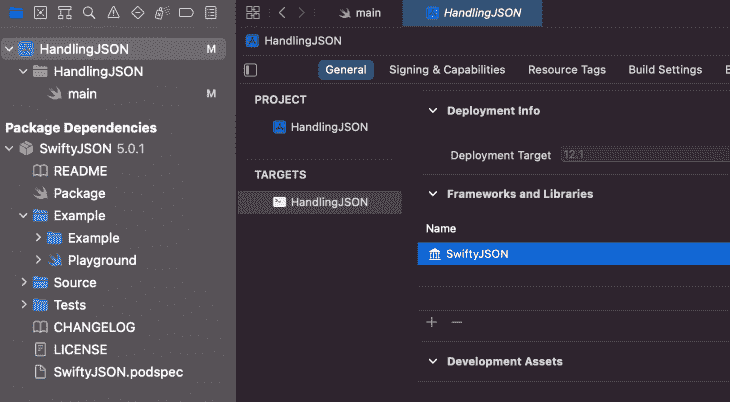

# 使用 SwiftyJSON - LogRocket Blog 轻松处理 Swift 中的 JSON

> 原文：<https://blog.logrocket.com/easily-handle-json-swift-swiftyjson/>

处理数据是前端开发人员的一项常见任务，数据通常是 JSON 格式的。 [SwiftyJSON](https://github.com/SwiftyJSON/SwiftyJSON) 是一个开源的第三方库，对于在 Swift 中轻松处理 JSON 数据非常有用。在撰写本文时，该包在 GitHub 上有 21K+颗星，并且自 2014 年首次发布以来一直保持着。它支持最新版本的 Swift、Xcode 和 iOS。到目前为止，它满足了我的所有需求。

在本文中，我们将回顾如何使用 SwiftyJSON 在 Swift 中轻松处理 JSON 数据。我们将使用一个带有 macOS 命令行界面的演示项目来浏览本教程。

对于本文中使用的例子，我们将使用 Swift v5、Xcode v13.2.1 和 SwiftyJSON v5.0.1。

我们开始吧！

## 创建 macOS CLI

由于用户界面对于这个项目并不重要，我们将创建并使用一个 macOS 命令行工具。要为 macOS 创建 CLI，请打开 Xcode 并点击**创建新的 Xcode 项目**。接下来，在 macOS 下，选择**命令行工具**，然后点击**下一个**，按照剩下的说明操作。



## 设置演示项目

我喜欢神奇宝贝，所以我决定把它作为这个项目的主题。在这个项目中，我们将使用 RESTful Pokemon API 。我们将通过获取这个 JSON 来请求角色小火龙的数据:【https://pokeapi.co/api/v2/pokemon/charmander[。](https://pokeapi.co/api/v2/pokemon/charmander)

本文将关注 JSON 的处理，所以我们将跳过请求 JSON 数据的过程。

对于这个演示，我使用了 macOS [URLSession](https://developer.apple.com/documentation/foundation/urlsession) 来处理 HTTP 请求，但是您也可以使用 [Alamofire](https://github.com/Alamofire/Alamofire) 或 [Moya](https://github.com/Moya/moya.github.io) 。此外，您可以随时访问我的 [GitHub](https://github.com/iremkaraoglu/iOS-HandlingJSON-withSwiftyJSON) [资源库](https://github.com/iremkaraoglu/iOS-HandlingJSON-withSwiftyJSON)中的代码。获得数据后，我们将请求小火龙的一些属性(例如，名字、能力和类型)，然后我们将在终端输出中显示它们。

终端输出将如下所示:


让我们开始吧。


Photo by [Akin Cakiner](https://unsplash.com/@akin?utm_source=unsplash&utm_medium=referral&utm_content=creditCopyText) on [Unsplash.](https://unsplash.com/s/photos/charmander?utm_source=unsplash&utm_medium=referral&utm_content=creditCopyText)

## 将 SwiftyJSON 添加到演示项目中

要使用第三方库，我们需要在我们的项目中导入这个包。因此，我们的第一步是将 SwiftyJSON 包添加到我们的项目中；我们将使用 [Swift 包管理器](https://github.com/apple/swift-package-manager)。

下面是我们的路径:Xcode > ( Xcode 项目名)> Targets > (Xcode 项目名)。

在 General 选项卡中，在 Frameworks and Libraries 下拉菜单下，我们点击 **+** 并选择**添加包依赖**。然后，我们输入包 Git 的 URL:【https://github.com/SwiftyJSON/SwiftyJSON.git】的。

成功添加包后，我们将看到 SwiftyJSON 列在 Framework 下，以及项目导航器中的 Package Dependencies 下:



## 使用 SwiftyJSON 解析 Swift 中的 JSON

现在，我们准备写一些代码。首先，我们将使用 JSON 数据中的一个片段:

```
"name": "charmander",
"order": 5,
"past_types": [],
...

```

我们将创建一个 JSON 对象，它包含数据的`name`属性。然后，我们将创建一个函数来获取`name`属性，以便我们可以访问它:

```
func getName(data: Data) {
    if let json = try? JSON(data: data) {
        let name = json["name"].string ?? "N/A"
        print("Name: \(name)")
    }
}

```

当我们调用`getName`函数时，我们得到以下输出:

姓名:**查曼德**

现在，让我们使用来自小火龙 HTTP 请求的嵌套 JSON:

```
"abilities": [
    {
      "ability": {
        "name": "blaze",
        "url": "<https://pokeapi.co/api/v2/ability/66/>"
      },
      "is_hidden": false,
      "slot": 1
    },
    {
      "ability": {
        "name": "solar-power",
        "url": "<https://pokeapi.co/api/v2/ability/94/>"
      },
      "is_hidden": true,
      "slot": 3
    }
  ], 
{...}

```

我们将创建一个函数来从小火龙数据中获取`abilities`属性。以前，我们创建了一个 JSON 对象，但是现在我们有了一个对象数组。我们需要遍历`abilities`数组并获得每个`ability`的`name`属性。

```
func getAbilities(data: Data) {
    if let json = try? JSON(data: data) {
        for (_, abilities) in json["abilities"] {
            let ability = abilities\["ability"\]["name"].string ?? "N/A"
            print("Ability: \(ability)")
        }
    }
}

```

当我们调用`getAbilities`函数时，我们得到以下输出:

能力:**火焰**

能力:**太阳能**

类似于`abilities`，我们也有`types`属性。然后，在对象内部，我们有一个具有`name`属性的`type`对象。我们可以在下面的 JSON 代码片段中看到这两个属性:

```
"types": [
    {
      "slot": 1,
      "type": {
        "name": "fire",
        "url": "https://pokeapi.co/api/v2/type/10/"
      }
    }
  ]

```

现在，我们将遍历`types`数组并获取每个`type`的`name`属性。

```
func getType(data: Data) {
    if let json = try? JSON(data: data) {
        for (_, types) in json["types"] {
            let type = types\["type"\]["name"].string ?? "N/A"
            print("Type: \(type)")
        }
    }
}

```

当我们调用`getType`函数时，我们得到以下输出:

类型:**火**

## 解决 Swift 中的类型问题

在 Swift 中，我们必须使用显式类型。这样做的好处是我们不太可能犯错误。缺点是不太灵活。

例如，当我们获取 JSON 数据时，我们通过声明它们的数据类型来创建属性。如果服务器端的数据类型发生变化，我们将无法解析 JSON 数据，应用程序将会崩溃。幸运的是，SwiftyJSON 帮助我们解决了这个问题。

让我们看一个例子。

在下面的代码片段中，我们指定数据类型为`string`。我们也可以指定它必须是一个整数；这里的要点是代码表明它必须是我们指定的类型。

```
let ability = abilities\["ability"\]["name"].string!

```

在这个例子中，只要数据类型实际上是一个`string`，一切都很好。但是如果数据类型改变了，这个值就变为零，应用程序就会崩溃。

现在，让我们看一下同一个例子，但是这次我们将使用一个`nil`-合并操作符来适应数据类型中任何可能的变化:

```
let ability = abilities\["ability"\]["name"].string ?? "N/A"

```

在上面的代码片段中，我们检查数据类型是否是一个`string`。如果不是`string`，则返回值“不适用”。应用程序不会崩溃。当然，你不限于“不适用”，你可以使用任何你喜欢的称呼。

## 结论

在本文中，我们回顾了如何使用 SwiftyJSON 在 Swift 中处理 JSON，并讨论了如何处理类型问题。我们使用一个带有 macOS 命令行界面的演示来浏览文章示例。

我希望你喜欢这篇文章。请访问 [GitHub](https://github.com/iremkaraoglu/iOS-HandlingJSON-withSwiftyJSON) 查看我为本文制作的示例项目。请随时通过[【电子邮件保护】](/cdn-cgi/l/email-protection)或下面的评论区联系我。感谢您的宝贵反馈。保重！✨

## 使用 [LogRocket](https://lp.logrocket.com/blg/signup) 消除传统错误报告的干扰

[](https://lp.logrocket.com/blg/signup)

[LogRocket](https://lp.logrocket.com/blg/signup) 是一个数字体验分析解决方案，它可以保护您免受数百个假阳性错误警报的影响，只针对几个真正重要的项目。LogRocket 会告诉您应用程序中实际影响用户的最具影响力的 bug 和 UX 问题。

然后，使用具有深层技术遥测的会话重放来确切地查看用户看到了什么以及是什么导致了问题，就像你在他们身后看一样。

LogRocket 自动聚合客户端错误、JS 异常、前端性能指标和用户交互。然后 LogRocket 使用机器学习来告诉你哪些问题正在影响大多数用户，并提供你需要修复它的上下文。

关注重要的 bug—[今天就试试 LogRocket】。](https://lp.logrocket.com/blg/signup-issue-free)