# Docusaurus 的简单文档

> 原文：<https://blog.logrocket.com/easy-documentation-with-docusaurus/>

文档是软件开发生命周期不可或缺的一部分。没有文档，一个项目就不能发挥它的最大潜力。但是编写和维护文档是一项单调乏味的工作。这就是多库龙的用武之地。

简单地说，Docusaurus 帮助你创建和维护静态文档网站。它使用 MDX 生成一个静态 React.js 网站，并支持博客、版本控制和定制页面。MDX 是一个 markdown 变体，使您能够在 markdown 内部使用 JSX。默认情况下，Docsaurus 也支持深色和浅色主题。

在本教程中，我们将演示如何充分利用 Docusaurus v2。


## 脚手架项目网站

要安装和使用 Docusaurus，您需要 Node.js 和 npm。

是搭建 Docusaurus 网站最简单的方法。您可以在任何目录下执行`init`命令。

```
npx @docusaurus/[email protected] init my-website classic

```

这个命令将使用`classic`模板在当前目录中创建一个名为`my-website`的站点。Docusaurus 提供了各种模板。

通过在项目目录中运行`npm start`来启动项目。您现在可以看到项目正在`[http://localhost:3000](http://localhost:3000)`上运行。

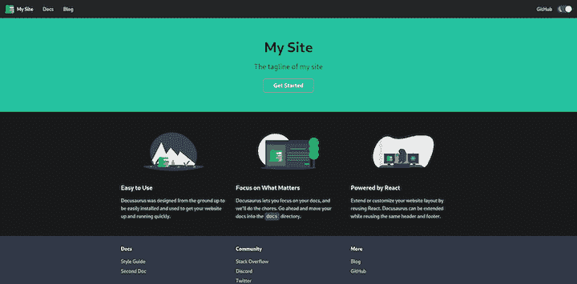

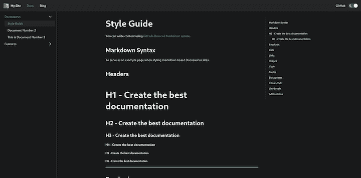

### 项目结构

```
├── babel.config.js
├── blog
│   ├── 2019-05-28-hola.md
│   ├── 2019-05-29-hello-world.md
│   └── 2019-05-30-welcome.md
├── docs
│   ├── doc1.md
│   ├── doc2.md
│   ├── doc3.md
│   └── mdx.md
├── docusaurus.config.js
├── package.json
├── README.md
├── sidebars.js
├── src
│   ├── css
│   │   └── custom.css
│   └── pages
│       ├── index.js
│       └── styles.module.css
├── static
│   └── img
│       ├── favicon.ico
│       ├── logo.svg
│       ├── undraw_docusaurus_mountain.svg
│       ├── undraw_docusaurus_react.svg
│       └── undraw_docusaurus_tree.svg
└── yarn.lock

```

所有与 Docusaurus 插件预置和主题相关的设置都位于`docusaurus.config.js`中。`sidebars.js`包含边栏的所有条目。

### 剧本

scaffold 项目在`package.json`文件中已经有一些脚本。这些脚本用于管理 Docusaurus 项目。我们将使用其中的两个脚本:

1.  `npm start`在`localhost:3000`启动开发服务器。它检测到对项目的更改并重新加载
2.  `npm run build`为项目创建优化的生产版本。它创建了一个`build`文件夹来保存编译后的项目

## 定制您的网站

Docusaurus 是高度可定制的。在`docusaurus.config.js`中可以定制`navbar`、`footer`、`title`等组件。

### `title`和`favicon`

通过改变`docusaurus.config.js`中相应的按键，可以自定义`title`、`tagline`和`favicon`组件。

```
  title: 'Imdb Scrapper', // title of website
  tagline: 'Scrap Imdb Like a Pro', // used in meta data
  url: 'http://localhost:3000/', // url where websited is hosted
  baseUrl: '/', // path where website is available
  favicon: 'img/favicon.ico', // path to favicon with respect to static dir
  organizationName: 'anshulrgoyal', // github user name 
  projectName: 'imdb-scrapper',// project name i.e repo name of project

```

`organiztionName`和`projectName`是可选的。

现在您可以通过使用`npm start`命令启动项目来测试变更。

转到`[http://localhost:3000](http://localhost:3000)`查看变化。

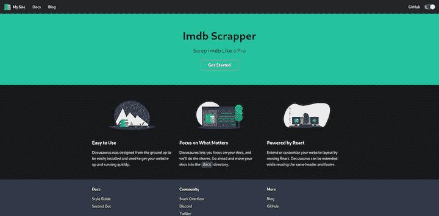

### 主页

`src/pages/index.js`是网站的主页。它导出一个在`navbar`和`footer`之间渲染的 React 组件。

您可以在`index.js`中创建您的组件。`preset-classic`还包括一个由 Docusaurus 团队构建的 CSS 框架，名为 [Infima](https://facebookincubator.github.io/infima/) 。

```
import React from "react";
import clsx from "clsx";
import Layout from "@theme/Layout"; // it is a sudo import, theme will be injected at build time
import Link from "@docusaurus/Link"; // docusaurus exports react-router
import useDocusaurusContext from "@docusaurus/useDocusaurusContext"; // get metadata about page
import useBaseUrl from "@docusaurus/useBaseUrl"; // gives link after concating website url and path
import styles from "./styles.module.css";
const features = [
  {
    title: <>Updated Regularly</>,
    imageUrl: "img/updated.svg", // path to image with respect to staic dir
    description: (
      <>
        Scrapping links and scripts are updated on daily bases. Scripts are well
        tested and robust.
      </>
    ),
  },
  {
    title: <>Lighting Fast</>,
    imageUrl: "img/fast.svg", // path to image with respect to staic dir
    description: (
      <>Lighting fast, built with speed in mind support caching by default.</>
    ),
  },
  {
    title: <>Automated scripts</>,
    imageUrl: "img/automated.svg", // path to image with respect to staic dir
    description: (
      <>
        No manual work required just pass imdbId and get movies
        and tvs shows scrapped.
      </>
    ),
  },
];
// Feature component
function Feature({ imageUrl, title, description }) {
  const imgUrl = useBaseUrl(imageUrl);
  return (
    <div className={clsx("col col--4", styles.feature)}>
      {imgUrl && (
        <div className="text--center">
          
        </div>
      )}
      <h3>{title}</h3>
      <p>{description}</p>
    </div>
  );
}
function Home() {
  const context = useDocusaurusContext();
  const { siteConfig = {} } = context;
  return (
    <Layout
      title={`Hello from ${siteConfig.title}`}
      description="Description will go into a meta tag in <head />"
    >
      <header className={clsx("hero hero--primary", styles.heroBanner)}>
        <div className="container">
          <h1 className="hero__title">{siteConfig.title}</h1>
          <p className="hero__subtitle">{siteConfig.tagline}</p>
          <div className={styles.buttons}>
            <Link
              className={clsx(
                "button button--outline button--secondary button--lg",
                styles.getStarted
              )}
              to={useBaseUrl("docs/")}
            >
              Get Started
            </Link>
          </div>
        </div>
      </header>
      <main>
        {features && features.length > 0 && (
          <section className={styles.features}>
            <div className="container">
              <div className="row">
                {features.map((props, idx) => (
                  <Feature key={idx} {...props} />
                ))}
              </div>
            </div>
          </section>
        )}
      </main>
    </Layout>
  );
}
export default Home;

```

### `navbar`

`navbar`是`preset-classic`的一部分，不是`@docusaurus/core`。

主题的配置作为`docusaurus.config.js`中的`themeConfig`对象传递。`themeConfig`中的`navbar`键保存导航条的配置。

#### 添加徽标

```
themeConfig: {
    navbar: {
      title: "Imdb Scrapper", // title
      logo: {
        alt: "My Site Logo",
        src: "img/logo.svg", // path with respect to static dir
      },
   }
}

```

可以通过提供`src`和`alt`来添加 logo。如果没有提供徽标，则不会显示。

#### 添加链接

Docusaurus 通过提供路径来支持到同一域中其他页面的超链接，或者通过提供 URL 来支持到另一个域的超链接。

```
navbar: {
      title: "Imdb Scrapper",
      links: [
        {
          to: "docs/", // path to page
          activeBasePath: "docs", // active it url matches regex
          label: "Docs",
          position: "left",
        },
        { to: "blog", label: "Blog", position: "right" },
        {
          href: "https://github.com/anshulrgoyal/imdb-scrapper", // to other domain
          label: "GitHub",
          position: "right",
        },
      ],

```

如果将`to`传递给`links`，将使用`react-router`。如果`href`通过，则使用锚标签。

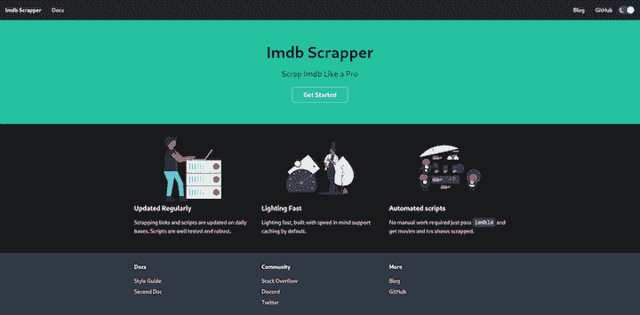

### 色彩设计

Infima 支持 CSS 变量来定制颜色方案。

编辑`src/css/custom.css`改变配色方案。

```
:root {
--ifm-color-primary: #f50057;
--ifm-color-primary-dark: #dd004e;
--ifm-color-primary-darker: #d0004a;
--ifm-color-primary-darkest: #ab003d;
--ifm-color-primary-light: #ff0f64;
--ifm-color-primary-lighter: #ff1b6c;
--ifm-color-primary-lightest: #ff4084;
}

```

这将改变 Infima 默认值的配色方案，以匹配 SVG 图像。

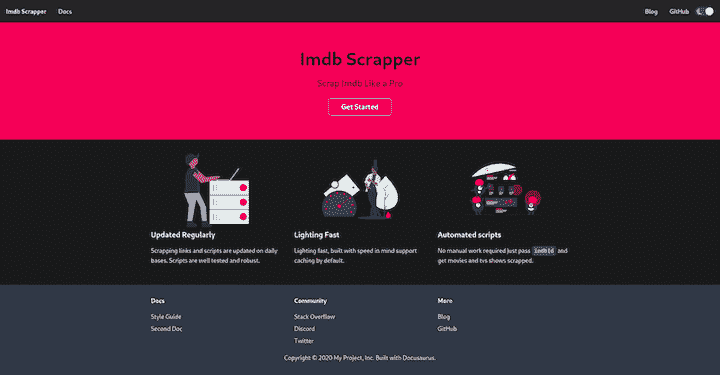

与`navbar`类似，可以使用`themeConfig`中的`footer`定制`footer`组件，T3 在`docusaurus.config.js`中。

#### 添加徽标

要添加徽标，只需在`logo`对象中提供图像的路径。

```
footer: {
  logo: {
    alt: 'Some logo',
    src: 'img/oss_logo.png', // with respect to static dir
    href: 'url',
  },
},

```

#### 添加版权文本

您可以将版权文本添加到页脚对象上的`copyright`键。

```
footer: {
      copyright: `Copyright © ${new Date().getFullYear()} Anshul Goyal, Inc. Built with Docusaurus.`,
    },

```

#### 添加链接

通过在`links`中提供 URL 向页脚添加链接。

```
footer:{
  links:[
        {
          title: "Docs", //heading for links
          items: [
            {
              label: "Style Guide",
              to: "docs/",
            },
            {
              label: "Second Doc",
              to: "docs/doc2/",
            },
          ],
        },
        {
          title: "Community", // heading for links
          items: [
            {
              label: "Stack Overflow",
              href: "https://stackoverflow.com/questions/tagged/imdb-scrapper",
            },
          ],
        },
        {
          title: "More",
          items: [
            {
              label: "Blog",
              to: "blog",
            },
            {
              label: "GitHub",
              href: "https://github.com/anshulrgoyal/imdb-scrapper",
            },
          ],
        },
      ],
}

```


## 证明文件

所有文档都被添加到`docs`文件夹中。您可以在`docusaurus.config.js`文件中更改它。

在`docs`文件夹中创建`api.md`文件。Docusaurus 将自动呈现它，并为`.md`文件创建一个目录。

```
---
id: api
title: API
---
# My doc

```

`id`用于在 Docusaurus 中引用该文档，而`/docs/{id}`是访问文档的路径。`title`是文档的页面标题，`sidebar_label`是侧边栏中的标签。

现在是时候将我们的`api`添加到侧边栏了。编辑`sidebars.js`创建一个新条目。

```
module.exports = {
  sidebar: {
    "Imdb Scrapper": ["api"],
  },
};

```

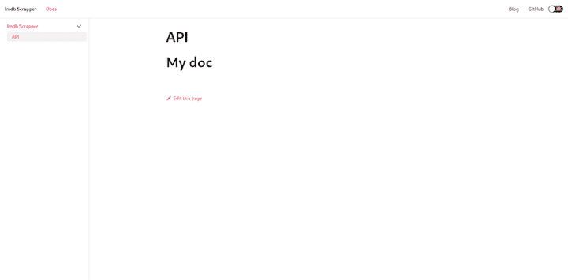

```
docs/
└── api.md

```

侧边栏是递归创建的，也就是说，它可以有任何级别的嵌套。

要查看示例，请在`IMDB Scrapper`类别中创建另一个名为`Examples`的类别，其中包含许多项目。

```
docs/
├── api.md
└── examples
    ├── actors.md
    ├── award.md
    ├── image.md
    ├── scraping.md
    ├── search.md
    ├── trending.md
    └── tv.md

```

您还可以创建嵌套文档。例如，`actors.md`将把`/docs/examples/actors`作为 URL 路径，而要引用的`id`将是`examples/actors`。

```
module.exports = {
  sidebar: {
    "Imdb Scrapper": ["api",{
      Examples:[ // nested sidebar with example as sub catogery
        "examples/actor", // items
        "examples/award",
        "examples/image",
        "examples/tv",
        "examples/trending",
        "examples/scraping",
        "examples/search"
      ]
    }],
  },
};

```

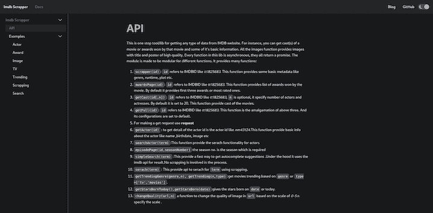

如果你试图访问`/docs/`，你会得到一个 404。为了解决这个问题，我们需要更新`preset-classic`的设置，以使用`/docs/api`作为我们的主文档或文档的入口点。

```
 presets: [
    [
      "@docusaurus/preset-classic",
      {
        docs: {
          // It is recommended to set document id as docs home page (`docs/` path).
          homePageId: "api", // documents entry point
          sidebarPath: require.resolve("./sidebars.js")
        },
        blog: {
          showReadingTime: true,
        },
        theme: {
          customCss: require.resolve("./src/css/custom.css"),
        },
      },
    ],
  ],

```

## 版本控制

Docusaurus 支持版本控制。在开发过程中，每个版本都有很多变化。如果你的产品支持不同的版本，维护每个版本的文档是很困难的。

让我们在`package.json`中添加一个用于版本控制的脚本。

```
    "version": "docusaurus doc:version"

```

现在我们可以使用`npm run version <version>`命令来创建命令。

```
.
├── babel.config.js
├── blog
│   ├── 2019-05-28-hola.md
│   ├── 2019-05-29-hello-world.md
│   └── 2019-05-30-welcome.md
├── docs
│   ├── api.md
│   └── examples
│       ├── actors.md
│       ├── award.md
│       ├── image.md
│       ├── scraping.md
│       ├── search.md
│       ├── trending.md
│       └── tv.md
├── docusaurus.config.js
├── package.json
├── README.md
├── sidebars.js
├── src
│   ├── css
│   │   └── custom.css
│   └── pages
│       ├── index.js
│       └── styles.module.css
├── static
│   └── img
│       ├── automated.svg
│       ├── fast.svg
│       └── updated.svg
├── versioned_docs
│   └── version-1.1.0
│       ├── api.md
│       └── examples
│           ├── actors.md
│           ├── award.md
│           ├── image.md
│           ├── scraping.md
│           ├── search.md
│           ├── trending.md
│           └── tv.md
├── versioned_sidebars
│   └── version-1.1.0-sidebars.json
└── versions.json

```

这将复制从`docs/`到`versioned_docs`的所有文件。`sidebars.js`被复制到`versioned_sidebars`。

现在有三个版本:

1.  `next`—`/doc`文件夹中的所有文档。这个版本可作为`docs/next/{id}`
2.  `latest (1.1.0)`—`versioned_docs/version-1.1.0`文件夹中的所有文档都被版本化`latest`。该版本可用作`docs/{id}`
3.  `old` —任何其他文件夹中的所有文档都将被版本化`old`。这个版本可作为`/docs/{version}/{id}`

保存文档的所有版本。

```
[
  "1.1.0"
]

```

Docusaurus 为每个版本创建文档快照并保存它。

现在，在导航栏中添加每个版本的链接，以便于访问。在`docusaurus.config.js`中导入`versions.json`。

```
const versions = require("./versions.json");

```

您可以提供`items`来将链接转换为下拉列表。

```
items: [
        {
          to: "docs/",
          activeBasePath: "docs",
          label: "Docs",
          position: "left",
          items: [ // adding items will create a dropdown
            {
              label: versions[0],
              to: "docs/",
              activeBaseRegex: `docs/(?!${versions.join("|")}|next)`,
            },
            ...versions.slice(1).map((version) => ({
              label: version,
              to: `docs/${version}/`,
            })),
            {
              label: "Master/Unreleased",
              to: "docs/next/",
              activeBaseRegex: `docs/next/(?!support|team|resources)`,
            },
          ],
        },
]

```

Docusaurus 有一个很好的特性，可以通知用户该文档属于一个旧版本。

创建一个新版本的`1.1.1`来看看它的运行。

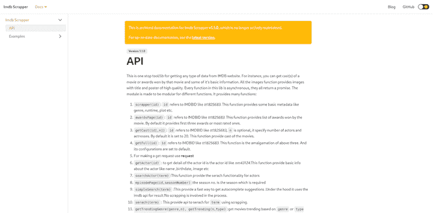

Docusaurus 会自动添加一个横幅，通知用户文档是旧的。新版本会自动添加到导航栏中。

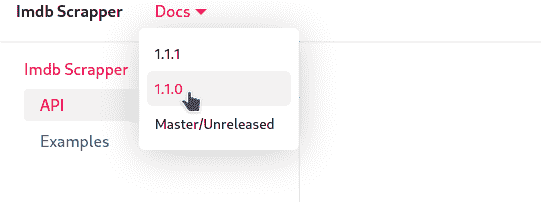

如果你检查`versioned_docs`，你可以在那里看到两个版本。

```
.
├── babel.config.js
├── blog
│   ├── 2019-05-28-hola.md
│   ├── 2019-05-29-hello-world.md
│   └── 2019-05-30-welcome.md
├── docs // next or upcoming version
│   ├── api.md
│   └── examples
│       ├── actors.md
│       ├── award.md
│       ├── image.md
│       ├── scraping.md
│       ├── search.md
│       ├── trending.md
│       └── tv.md
├── docusaurus.config.js
├── package.json
├── README.md
├── sidebars.js // next or upcoming version
├── src
│   ├── css
│   │   └── custom.css
│   └── pages
│       ├── index.js
│       └── styles.module.css
├── static
│   └── img
│       ├── automated.svg
│       ├── fast.svg
│       └── updated.svg
├── versioned_docs
│   ├── version-1.1.0 // old version
│   │   ├── api.md
│   │   └── examples
│   │       ├── actors.md
│   │       ├── award.md
│   │       ├── image.md
│   │       ├── scraping.md
│   │       ├── search.md
│   │       ├── trending.md
│   │       └── tv.md
│   └── version-1.1.1 // latest version
│       ├── api.md
│       └── examples
│           ├── actors.md
│           ├── award.md
│           ├── image.md
│           ├── scraping.md
│           ├── search.md
│           ├── trending.md
│           └── tv.md
├── versioned_sidebars
│   ├── version-1.1.0-sidebars.json // old version
│   └── version-1.1.1-sidebars.json // latest version
└── versions.json

```

## 自定义页面

Docusaurus 使您能够通过在`src/pages`中创建文件来构建定制页面。如果一个文件导出一个 React 组件，它将被呈现在导航栏和页脚之间。如果你创建了一个新页面`src/pages/team`，它将在`/team`可用。

```
// file: ./src/pages/team.js
import React, { useEffect } from "react";
import Layout from "@theme/Layout";
import clsx from "clsx";
import styles from "./styles.module.css";
const TITLE = "Team";
const DESCRIPTION = "Awesome people working";

function Team() {
  return (
    <Layout title={TITLE} description={DESCRIPTION}>
      <main className="container margin-vert--lg">
        <div className="text--center margin-bottom--xl">
          <h1>{TITLE}</h1>
          <p>{DESCRIPTION}</p>
        </div>
        <div className="row">
          <div className="col col--4 margin-bottom--lg">
            <div className={clsx("card", styles.showcaseUser)}>
              <div className="card__image">
                
              </div>
              <div className="card__body">
                <div className="avatar">
                  <div className="avatar__intro margin-left--none">
                    <h4 className="avatar__name">Anshul Goyal</h4>
                    <small className="avatar__subtitle">Coder for Fun :)</small>
                  </div>
                </div>
              </div>
            </div>
          </div>
        </div>
      </main>
    </Layout>
  );
}
export default Team;

```

如果勾选`/team`，可以看到团队页面。

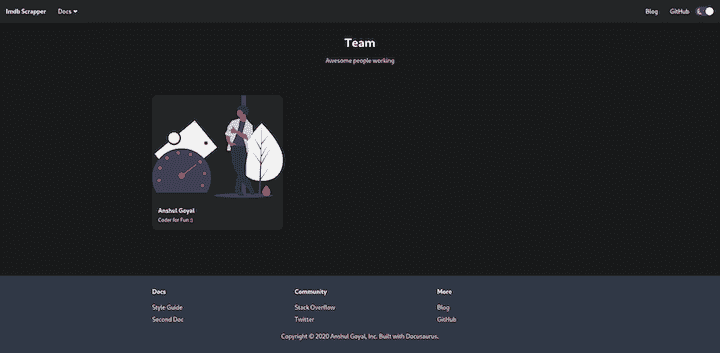

在导航栏中添加到`/team`的链接。

```
 {
          to: "team",
          label: "Team",
          position: "right",
          activeBaseRegex:`team`
        },

```

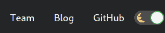

## 博客

最后，Docusaurus 使您能够创建和管理博客。

通过在`blog`文件夹中添加 markdown 文件来创建博客。文件名应该遵循这个模式:`{date}-{name}.md`。

```
// file: ./blog/2020-07-06-my-blog

---
id: intro
title: Introducing Docusaurus // title for blog
author: Anshul Goyal // author name
tags: [docusaurus,tutorial] // tags for blog
---
# My blog

```

`<!--truncate-->`标记博客的摘要。`---`和`<!--truncate-->`之间的内容包含在摘要中。

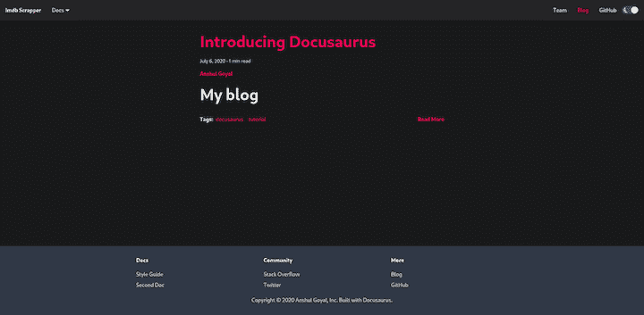

## 部署

部署 Docusaurus 网站很简单。只需运行`npm run build`并服务于`build`目录。

为了演示，让我们将 Docusaurus 部署到 Netlify。只需将您的 repo 连接到 Netlify 并更新设置。

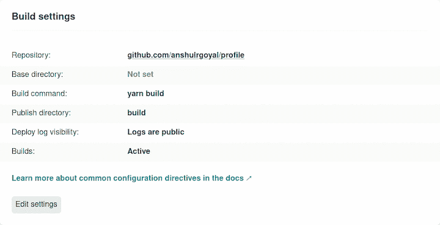

## 结论

现在您已经了解了 Docusaurus 的基础知识，并且拥有了创建一个优秀的文档网站所需的所有工具。我们介绍了如何创建基本文档、管理不同版本、构建定制页面、定制默认网站以及创建博客。

Docusaurus 是高度可定制的，支持广泛的集成。该工具还支持无数的主题、搜索功能和图像优化工具。

快乐记录！

## 您是否添加了新的 JS 库来提高性能或构建新特性？如果他们反其道而行之呢？

毫无疑问，前端变得越来越复杂。当您向应用程序添加新的 JavaScript 库和其他依赖项时，您将需要更多的可见性，以确保您的用户不会遇到未知的问题。

LogRocket 是一个前端应用程序监控解决方案，可以让您回放 JavaScript 错误，就像它们发生在您自己的浏览器中一样，这样您就可以更有效地对错误做出反应。

[](https://lp.logrocket.com/blg/javascript-signup)[https://logrocket.com/signup/](https://lp.logrocket.com/blg/javascript-signup)

[LogRocket](https://lp.logrocket.com/blg/javascript-signup) 可以与任何应用程序完美配合，不管是什么框架，并且有插件可以记录来自 Redux、Vuex 和@ngrx/store 的额外上下文。您可以汇总并报告问题发生时应用程序的状态，而不是猜测问题发生的原因。LogRocket 还可以监控应用的性能，报告客户端 CPU 负载、客户端内存使用等指标。

自信地构建— [开始免费监控](https://lp.logrocket.com/blg/javascript-signup)。