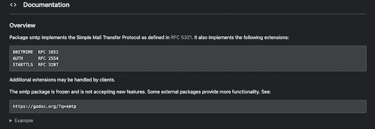
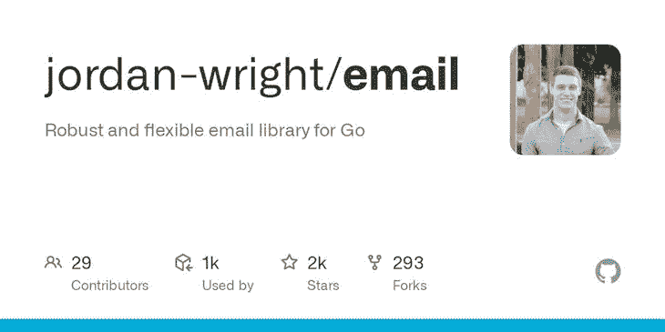

# 在 Go 中发送电子邮件的简单方法

> 原文：<https://blog.logrocket.com/easy-way-send-email-go/>

大大改善用户体验的一个功能是发送电子邮件的能力；您可以[使用电子邮件进行身份验证](https://blog.logrocket.com/jwt-authentication-go/)，发送通知等等。

与大多数服务器端语言一样，您可以在 Go 的标准库中找到构建常见类型的应用程序所需的大多数包。Go 的生态系统也有丰富的第三方包，让开发变得轻而易举。

[`smtp`包是 Go 标准库的`net`](https://pkg.go.dev/net/smtp) 包的一部分。按照 [RFC 5321](https://rfc-editor.org/rfc/rfc5321.html) 规范的规定，`net`包提供了与网络交互的功能，`smtp`包提供了与简单邮件传输协议交互的功能。

在本文中，我们将介绍使用`smtp`包以及名为`[jordan-wright/email](https://github.com/jordan-wright/email)`的第三方包在 Go 中发送电子邮件。我们开始吧！

*向前跳转*

## 用`smtp`包发送电子邮件



这个`smtp`包内置在 Go 标准库中，所以我们不需要安装任何新的东西就可以开始用它发送电子邮件。

让我们从将以下包导入到您的 Go 文件开始:

```
import (
        "crypto/tls"

        "fmt"

        "log"

        "net/smtp"
)

```

我们将使用 [`tls`](https://pkg.go.dev/crypto/tls) 包对电子邮件进行身份验证，使用 [`fmt`](https://pkg.go.dev/fmt) 包打印到控制台，使用`[log](https://pkg.go.dev/log)`包进行日志记录，使用`smtp`包实际发送电子邮件。

接下来，我们将声明保存电子邮件内容的变量。您需要您的电子邮件地址、电子邮件密码、收件人的电子邮件地址、主机地址和端口，最后是电子邮件主题和正文的内容:

```
       emailApPassword := "your app emailApPassword"

        yourMail := "your email"

        recipient := "any email whatsoever"

        hostAddress := "smtp.mail.yahoo.com"

        hostPort := "465"

        mailSubject := "Hey, I'm Just Checking On You."

        mailBody := "Hope you're doing okay! How are you doing today. "

        fullServerAddress := hostAddress + ":" + hostPort

```

声明变量后，我们将创建一个`map`变量来组合所有数据:

```
headerMap := make(map[string]string)

        headerMap["From"] = yourMail

        headerMap["To"] = recipient

        headerMap["Subject"] = mailSubject

        mailMessage := ""

        for k, v := range headerMap {

                mailMessage += fmt.Sprintf("%s: %s\\r", k, v)

        }

        mailMessage += "\\r" + mailBody

```

`headerMap`变量是包含电子邮件数据的映射，包括电子邮件的三个主要字段:`from`、`to`、`subject`和`body`。`for-loop`遍历地图并用`mailBody`变量形成消息的内容。

一旦你创建了电子邮件，下一步就是认证。您可以使用`smtp`包中的 [`PlainAuth`](https://pkg.go.dev/net/smtp#example-PlainAuth) 方法，使用您的电子邮件地址、密码和主机地址来验证电子邮件。

您还需要用`tls`包设置`tls`配置，并为电子邮件拨一个连接。之后，在认证客户端实例之前，您将为电子邮件设置一个客户端实例:

```
authenticate := smtp.PlainAuth("", yourMail, emailApPassword, hostAddress)

        tlsConfigurations := &tls.Config{

                InsecureSkipVerify: true,

                ServerName: hostAddress,
        }

        conn, err := tls.Dial("tcp", fullServerAddress, tlsConfigurations)

        if err != nil {

                log.Panic(err)

        }

newClient, err := smtp.NewClient(conn, hostAddress)

        if err != nil {

                log.Panic(err)

        }

        // Auth

        if err = newClient.Auth(authenticate); err != nil {

                log.Panic(err)

        }

        // To && From

        if err = newClient.Mail(yourMail); err != nil {

                log.Panic(err)

        }

        if err = newClient.Rcpt(headerMap["To"]); err != nil {

                log.Panic(err)

        }

```

`authenticate`变量是认证实例，`tlsConfigurations`变量保存电子邮件的配置。您已经用接受服务器地址和配置的`tls`包的`Dial`方法创建了一个连接。`newClient`变量是电子邮件客户端实例，您将使用它向客户端发送电子邮件。

最后，为了发送电子邮件，我们将把消息写入与客户机实例的连接。首先用客户机实例的`Data`方法创建一个`writer`实例。

如果这样做不会导致错误，那么使用 writer 实例的`Write`方法将电子邮件写入客户端，然后使用`Close`方法关闭连接。最后，用客户端实例的`Quit`方法关闭客户端连接:

```
       // Data

        writer, err := newClient.Data()

        if err != nil {

                log.Panic(err)

        }

        _, err = writer.Write([]byte(mailMessage))

        if err != nil {

                log.Panic(err)

        }

        err = writer.Close()

        if err != nil {

                log.Panic(err)

        }

        err = newClient.Quit()

        if err != nil {

                        fmt.Println("THERE WAS AN ERROR")

        }

        fmt.Println("Successful, the mail was sent!")

}

```

至此，您已经成功发送了一封包含`smtp`包的电子邮件！

## 用`email`包发送电子邮件



[`email`包](https://github.com/jordan-wright/email)是一个基于 Go 的、灵活的、健壮的电子邮件库，比`smtp`包更容易使用。`email`套装还提供以下附加功能:

在工作目录的终端中运行以下命令，将`email`包添加到项目的依赖项中:

```
go get github.com/jordan-wright/email

```

安装完`email`包后，在 Go 文件中导入以下包，开始发送电子邮件:

```
import (
        "fmt"
        "github.com/jordan-wright/email"
        "net/smtp"
)

```

您将使用`smtp`包验证电子邮件，使用`fmt`包打印到控制台。接下来，我们将为电子邮件的内容声明变量。您需要声明变量来保存您的密码、电子邮件、主机地址和主机端口:

```
       emailApPassword := "your app emailApPassword"

        yourMail := "your email"

        hostAddress := "smtp.mail.yahoo.com"

        hostPort := "465"

```

您可以使用`email`包的`NewEmail`方法创建一个`email` struct 实例，如下所示:

```
       emailInstance := email.NewEmail()

```

在为`email`实例声明一个变量后，用以下值填充它的必填字段:

```
       emailInstance.From = "your mail here"
        emailInstance.To = []string{"list of recipients"}
        emailInstance.Bcc = []string{"list of bcc"}
        emailInstance.Cc = []string{"list of cc"}
        emailInstance.Subject = "The Email subject"
        emailInstance.Text = []byte("Body of your email")

```

现在，您可以用您的`email`实例的`Send`方法发送您的电子邮件。`Send`方法接收来自`smtp`包的主机地址、连接端口和 auth 实例:

```
        err := emailInstance.Send(fmt.Sprintf("%s:%s", hostAddress, hostPort), smtp.PlainAuth("", yourMail, emailApPassword, hostAddress))
        if err != nil {
                fmt.Println("There was an error sending the mail")
        }

```

如果电子邮件没有成功发送，`Send`方法会返回一个错误，您可以根据自己的用例来处理这个错误。

## Go `smtp`或`email`:应该用哪个？

下表比较了两种包的主要优点:

| 公制的 | `smtp` | `email` |
| --- | --- | --- |
| 易用性 | 比较容易使用 | 非常容易使用 |
| 装置 | 不需要 | 必需的，但是安装很简单 |
| 流行 | 由 [6k Go 软件包](https://pkg.go.dev/net/smtp)导入 | 撰写本文时 GitHub 上有 22k 的星星 |
| 支持 | Go 团队提供全面、持续的支持 | 由 GitHub 上的开源开发者维护 |

如果保持您的应用程序构建紧凑是至关重要的，或者您想要构建自己的定制电子邮件工具，那么`smtp`包是您的最佳选择。但是，如果你想在你的应用程序中尽可能快捷方便地发送电子邮件，那么`email`包可能更适合你。

## 结论

在本文中，我们学习了如何在 Go 中使用内置的`smtp`包以及第三方的`email`包发送电子邮件。发送电子邮件是与你的应用程序用户保持联系的一个很好的方式，知道如何以编程方式发送电子邮件总是一项有用的技能。我希望你喜欢这篇文章。编码快乐！

## 使用 [LogRocket](https://lp.logrocket.com/blg/signup) 消除传统错误报告的干扰

[](https://lp.logrocket.com/blg/signup)

[LogRocket](https://lp.logrocket.com/blg/signup) 是一个数字体验分析解决方案，它可以保护您免受数百个假阳性错误警报的影响，只针对几个真正重要的项目。LogRocket 会告诉您应用程序中实际影响用户的最具影响力的 bug 和 UX 问题。

然后，使用具有深层技术遥测的会话重放来确切地查看用户看到了什么以及是什么导致了问题，就像你在他们身后看一样。

LogRocket 自动聚合客户端错误、JS 异常、前端性能指标和用户交互。然后 LogRocket 使用机器学习来告诉你哪些问题正在影响大多数用户，并提供你需要修复它的上下文。

关注重要的 bug—[今天就试试 LogRocket】。](https://lp.logrocket.com/blg/signup-issue-free)