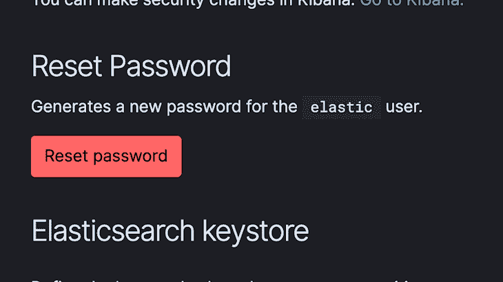
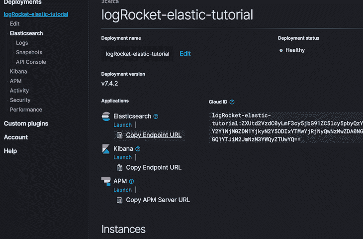
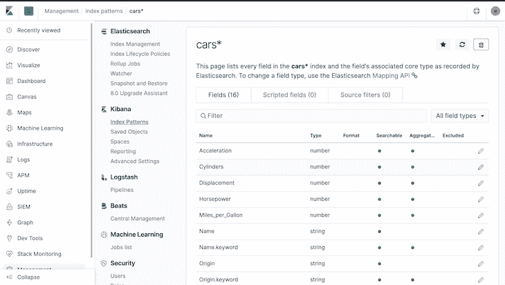
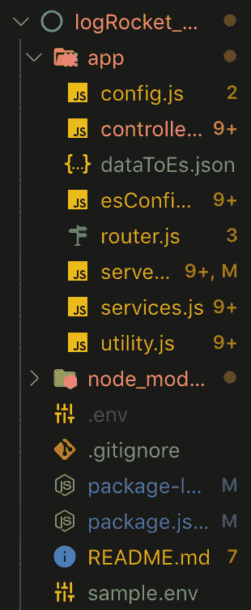

# 在 Node.js 中了解 Elasticsearch 查询 body builder

> 原文：<https://blog.logrocket.com/elasticsearch-query-body-builder-node-js/>

## 介绍

Elasticsearch 查询主体构建器是一个查询 DSL(特定领域语言)或客户端，它在原始 Elasticsearch 查询上提供了一个 API 层。它使全文搜索数据查询和复杂的数据聚合在语法上更容易、更方便、更清晰。

在本教程中，我们将了解如何使用构建器语法编写查询比原始的 Elasticsearch 查询更具优势。这是因为原始查询可能很快变得繁琐、无结构、不太习惯，甚至容易出错。

我们将通过利用查询构建器库 [elastic-builder](https://elastic-builder.js.org/) 来实现这一点。根据 [its 文档](https://elastic-builder.js.org/docs/)，它是一个为复杂的搜索查询和聚合快速构建请求体的工具。此外，它符合本地 Elasticsearch 查询的 API 规范标准，没有任何性能瓶颈。

本质上，这意味着我们可以使用构建器语法编写查询，匹配本地 Elasticsearch 提供的等价查询。不要担心，随着本教程的深入，我们将学习并理解构建器语法。

首先，让我们检查一个普通汽车查询的简单示例，以了解为什么使用 ES query builder 会使查询 Elasticsearch 数据更容易，以及它如何有助于更快的开发生命周期。

```
{
  "query": {
    "bool": {
      "must": {
        "match": {
          "Origin": "USA"
        }
      },
      "filter": {
        "range": {
          "Cylinders": {
            "gte": 4,
            "lte": 6
          }
        }
      },
      "must_not": {
        "range": {
          "Horsepower": {
            "gte": 75
          }
        }
      },
      "should": {
        "term": {
          "Name": "ford"
        }
      }
    }
  }
}
```

看着上面的内容，我们正在运行一个对原产地为美国的汽车的查询，同时执行一个过滤器，其中引擎的汽缸可以大于或等于 4 或小于或等于 6。此外，我们正在运行一个范围查询，其中汽车的马力不得大于或等于 75。最后，车的名字应该是福特。

现在，编写这类查询的问题是:

*   它们过于冗长
*   它们很容易出现语法错误，这可能是糟糕的字段嵌套的结果
*   随着时间的推移，它们可能很难维护，甚至很少增加变化。例如，知道在哪里添加另一个筛选器或查询字段可能会变得令人困惑
*   开发团队的新成员可能很难发现它们
*   为更复杂的查询编写它们并不有趣

现在考虑使用构建器语法的上述查询的等效查询，如下所示:

```
esb.requestBodySearch()
     .query(
        esb.boolQuery()
            .must(esb.matchQuery('Origin', 'USA'))
            .filter(esb.rangeQuery('Cylinders').gte(4).lte(6))
            .should(esb.termQuery('Name', 'ford'))
            .mustNot(esb.rangeQuery('Horsepower').gte(75))
    )
```

上面的查询与我们之前查看的原始 es 查询做了完全相同的事情，正如我们所看到的，这更加直观和有目的。

这里，我们使用了来自 elastic-builder 的`requestBodySearch` API。这个 API 帮助我们构建和形成查询，以一种平稳、流畅、习惯的方式口头表达和解释我们的意图。它们的可读性也很强，我们可以根据具体情况决定添加更多的字段，以获得完全不同的查询结果。

## 先决条件

为了更容易地跟随本教程，我建议浏览一下关于开始使用 Elasticsearch 和 Node.js 的本[介绍性教程](https://blog.logrocket.com/write-your-own-search-engine-using-node-js-and-elastic/)。请注意，只有在您之前缺乏使用 Elasticsearch 的经验或者想要复习一下的情况下，才需要这样做。否则，你应该能够轻松地跟随这个教程。

首先，确保您的机器上安装了 Node.js 和 npm。另外，我建议你[下载 Elasticsearch 二进制文件](https://www.elastic.co/downloads/elasticsearch)并安装它们，以防万一你打算在本地运行它。然而，出于本教程的目的，我们将使用弹性云设置弹性搜索，你可以使用 [14 天免费试用](https://www.elastic.co/cloud/)。

在你完成整个设置后(比如选择一个云提供商和你选择的地区，因为它是一个托管服务)，你应该得到一个用户名(很可能是`elastic`)、`password`、`host`和`port`。请注意，稍后我们将需要这些凭证或密码来连接到我们的 ES 集群。

虽然用户界面非常直观，但是为了直观地了解这些参数的位置，这里有一些截图指出了应该在哪里查看。



Elastic user and password fields.



Elasticsearch URL endpoint.

第一张截图显示了 Elasticsearch `user`以及我们可以在哪里找到我们的`password`或生成新密码。第二个截图显示了一个链接，在这里我们可以很容易地复制`elasticsearch endpoint url`。完成这个设置后，我们应该可以开始工作了，除了我们打算探索栈中的其他 Elasticsearch 服务，如 Kibana。



The Kibana UI, which provides a sort of dashboard visualization and allows monitoring and viewing metrics on your data and the entire Elastic stack.

你可以查看关于 Kibana 和整个 Elastic stack 的更多信息。接下来，让我们对将要构建的内容有一个清晰的背景。

## 引导我们的应用程序

在本教程中，我们将构建几个 API 端点来演示如何对存储在 Elasticsearch 集群中的数据执行全文搜索查询。当然，我们将使用构建器语法来构建我们的查询，并将它们与原始的 es 查询进行比较。

我们可以继续为我们的项目创建一个新文件夹，并随意命名。像往常一样，在我们开始一个新的 Node.js 项目之前，我们在项目目录中运行`npm init`。这将为我们创建一个新的`package.json`文件。

然后，我们可以继续安装我们的应用程序依赖项。这个项目需要的依赖项是节点的官方 Elasticsearch 客户端、elastic-builder 库、Express、body-parser 和 dotenv 包。

要安装它们，我们可以在终端/命令提示符下运行以下命令:

NPM install @ elastic/elastic search body-parser dotenv elastic-builder express–保存

安装完成后，我们的`package.json`文件应该是这样的:

```
{
  "name": "logrocket_elasticsearch_tutorial",
  "version": "1.0.0",
  "description": "LogRocket ElasticSearch Tutorial with ES Builder",
  "main": "index.js",
  "scripts": {
    "start": "node ./app/server.js"
  },
  "author": "Alexander Nnakwue",
  "license": "ISC",
  "dependencies": {
    "@elastic/elasticsearch": "^7.4.0",
    "body-parser": "^1.19.0",
    "dotenv": "^8.2.0",
    "elastic-builder": "^2.4.0",
    "express": "^4.17.1"
  }
}
```

现在我们将继续创建我们需要的所有必要的文件和文件夹。注意，`start`脚本基于我们的`server.js`文件的相对路径。首先，确保您在项目目录中，然后运行`mkdir app`创建一个名为`app`的新文件夹。

创建完`app`文件夹后，我们可以导航到其中并创建所有必要的文件，如下面的截图所示。此外，我们可以继续在项目的根目录中创建所有其他文件，如图所示。



下一步是我们创建一个到 Elasticsearch 集群的连接。为此，我们需要创建一个`.env`文件来存储我们所有的环境变量或秘密。`sample.env`文件完全反映了我们的`.env`中应该包含的内容。该文件的内容如下:

```
ELASTICSEARCH_USERNAME=username
ELASTICSEARCH_PASSWORD=password
ELASTICSEARCH_HOST=host
ELASTICSEARCH_PORT=port
APP_PORT= 3004
ELASTICSEARCH_INDEX=index
ELASTICSEARCH_TYPE=type
```

我们可以继续复制这些参数，在我们项目的根目录下创建一个`.env`文件，并填写真正的凭证。之后，我们应该可以创建我们的`config.js`文件，它应该提供对我们新创建的`.env`文件中定义或添加的变量的访问。

`config.js`文件应该包含以下 JSON:

```
const result = require('dotenv').config();
module.exports= {
es_host: process.env.ELASTICSEARCH_HOST,
es_pass: process.env.ELASTICSEARCH_PASSWORD,
es_port: process.env.ELASTICSEARCH_PORT,
es_user:process.env.ELASTICSEARCH_USERNAME,
es_index:process.env.ELASTICSEARCH_INDEX,
es_type:process.env.ELASTICSEARCH_TYPE,
app_port: process.env.APP_PORT
};

if (result.error) {
  console.log(result.error, "[Error Parsing env variables!]");
  throw result.error;
};
// console.log(result.parsed, '[Parsed env variables!]');
```

正如我们所见，我们正在访问包含在`.env`文件中的变量，并用不同的变量名存储它们。还要注意的是，我们已经添加了`app_port`、`es_index`、`es_type`以及我们的 Elasticsearch 连接所需的其他变量。

现在，让我们用这些参数连接到我们的 Elasticsearch 集群。为此，我们可以将以下内容复制到`esConfig.js`文件中:

```
'use strict'

const { Client } = require('@elastic/elasticsearch');
const config = require('./config');
const client = new Client({ node: `https://${config.es_user}:${config.es_pass}@${config.es_host}:${config.es_port}`});

module.exports.esClient= client;
```

这里我们添加了一个对官方 Elasticsearch Node.js 客户端库的引用，然后我们使用之前创建的`config.js`文件中包含的内容来实例化一个到我们集群的新 ES 客户端连接。

* * *

### 更多来自 LogRocket 的精彩文章:

* * *

## 将数据写入我们的 ES 集群

既然我们的集群已经设置好了，我们可以继续创建一个新文件，其中包含我们打算写入 Elasticsearch 索引的 JSON 数据。我们可以继续创建新文件`dataToEs.json`，如果我们之前没有这样做的话。文件的内容可以归功于 GitHub 上的[这个来源。它基本上包含了基于 JSON 的数据集，我们将根据连接到集群所需的给定参数将其写入 ES 索引。](https://vega.github.io/vega-datasets/data/cars.json)

完成以上工作后，我们可以创建一个`utility.js`文件，其中包含创建 ES 索引所需的函数；根据可用字段及其各自的数据类型为数据集创建新的映射；最后，将 JSON 数据写入我们在集群上创建的索引。

注意，Elasticsearch 在默认情况下是无模式的，但是我们可以预先定义自己的模式来帮助定义数据的标准结构和格式。这当然有其自身的优势，比如数据一致性等等。现在让我们了解一下`utility.js`文件中发生了什么:

```
const fs = require('fs');
const esconfig = require('./esConfig');
const client = esconfig.esClient;
const data = JSON.parse(fs.readFileSync(__dirname + '/dataToEs.json'));
const config = require('./config');

const index= config.es_index;
const type = config.es_type;

  async function writeCarDataToEs(index, data){
    for (let i = 0; i < data.length; i++ ) {
      await client.create({
        refresh: true,
        index: index,
        id: i,
        body: data[i]
      }, function(error, response) {
        if (error) {
          console.error("Failed to import data", error);
          return;
        }
        else {
          console.log("Successfully imported data", data[i]);
        }
      });
    }
};
async function createCarMapping (index, type) {
  const carSchema = {
      "Acceleration": {
        "type": "long"
      },
      "Cylinders": {
        "type": "long"
      },
      "Displacement": {
        "type": "long"
      },
      "Horsepower": {
        "type": "long"
      },
      "Miles_per_Gallon": {
        "type": "long"
      },
      "Name": {
        "type": "text",
        "fields": {
          "keyword": {
            "type": "keyword",
            "ignore_above": 256
          }
        }
      },
      "Origin": {
        "type": "text",
        "fields": {
          "keyword": {
            "type": "keyword",
            "ignore_above": 256
          }
        }
      },
      "Weight_in_lbs": {
        "type": "long"
      },
      "Year": {
        "type": "date"
    }
  }
  return client.indices.putMapping({index, type, body:{properties:carSchema}});
}
module.exports = {
async resetIndex(){
 if (client.indices.exists({ index })) {
      client.indices.delete({ index });
   }
 client.indices.create({ index });
 createCarMapping(client, index, type);
 writeCarDataToEs(index, data);
}
};
```

在上面的文件中，我们首先动态读取包含在我们之前谈到的`dataToEs.json`文件中的 JSON 数据。如图所示，我们使用了 Node.js 的本地文件系统包。

我们还利用`__dirname`来访问当前模块的目录名，并将数据集的相对文件路径附加到它上面。此外，我们正在导入对我们的 ES 客户端连接的引用。第一个函数`writeCarDataToEs`遍历整个 JSON 数据集，并将其写入我们的 Elasticsearch 索引。

注意这里有一个警告，对于非常大的数据集，我们应该用 ES `bulk` API 代替`create` API。然而，对于我们当前的用例，这应该很好。要了解如何使用 ES `bulk` API，可以查看 [this GitHub repo](https://github.com/elastic/elasticsearch-js/blob/master/docs/examples/bulk.asciidoc) 中提供的官方示例。

之后，我们现在可以为我们的数据创建映射，它代表了预期的数据类型和格式。我们通过在传递索引、类型和 JSON 主体的同时调用`putMapping` API 来实现。

最后，我们创建函数`resetIndex`，它检查我们试图创建的索引是否已经存在，如果存在，就为我们删除它。否则，我们使用从 env 变量传递的名称创建一个新的索引，为 JSON 数据集创建映射，并调用`writeDataToEs()`函数，然后该函数根据已经指定的映射将数据写入索引。

现在我们可以继续创建我们的`server.js`文件，它基本上是一个简单的 Express 服务器。

```
const express = require('express');
const bodyParser = require('body-parser')
require("dotenv").config();
require("./utility").resetIndex();
const app = express();
const esconfig = require('./esConfig');
const client = esconfig.esClient;
const router  = require("./router");

app.use(bodyParser.urlencoded({ extended: false }));
app.use(bodyParser.json());
app.use("/",router);

app.set('port', process.env.APP_PORT || 3000);

client.ping({}, function(error) {
  if (error) {
      console.log('ES Cluster is down', error);
  } else {
      console.log('ES Cluster is up!');
  }
});

app.listen(app.get('port'), ()=>{
  console.log(`Express server listening on port, ${app.get('port')}`);
} );
```

这里，我们从`utility.js`文件导入`resetIndex()`函数，这将使它在我们启动应用程序时自动运行。我们可以决定将该导入注释掉，因为后续的应用程序重启不需要它，因为我们应该已经在 ES 集群中创建和设置了索引、映射和数据。

## 编写弹性生成器查询

现在我们可以开始为我们的数据编写查询了。让我们首先编写一个多匹配查询，它匹配汽车的名称和来源，同时它的重量大于或等于一个特定的数字(`rangeQuery`)。我们可以查看 [`service.js`文件](https://github.com/firebase007/Elastic_search_query_builder_tutorial/blob/master/app/services.js)来理解这个查询是如何工作的:

```
async fetchMatchMultipleQuery(origin, name,weight){
  const requestBody = esb.requestBodySearch()
      .query(
        esb.boolQuery()
          .must([
            esb.matchQuery(
              'Origin', origin,
            ),
            (
              esb.matchQuery(
                'Name', name,
              )
            ),
          ])
        .filter(esb.rangeQuery('Weight_in_lbs').gte(weight))
      )
      return client.search({index: index, body: requestBody.toJSON()});
}
```

看看上面的函数，我们想要达到的目的就很清楚了。这个查询是一个布尔值，它必须匹配来自特定来源和特定名称的汽车。此外，我们使用范围查询过滤汽车，其中重量必须大于或等于我们指定的特定重量。

作为题外话，让我们看看上面的等价原始查询:

```
{
  "bool": {
    "must": [
      {
        "match": {
          "Origin": "https://elastic-builder.js.org"
        }
      },
      {
        "match": {
          "Name": "name"
        }
      }
    ],
    "filter": {
      "range": {
        "Weight_in_lbs": {
          "gte": "weight"
        }
      }
    }
  }
}
```

正如我们所见，由于查询的深层嵌套性质，这很容易出错，这一点我们在前面已经指出。现在我们有了一个可视化的提示，让我们来理解实际调用这个 API 的流程。

首先，检查一下 [`services.js`文件](https://github.com/firebase007/Elastic_search_query_builder_tutorial/blob/master/app/services.js)。这个文件处理与使用构建器语法构建查询相关的所有事情，然后调用我们的 es 客户端来实际执行这些调用。同样，在文件内部，我们填充了与上面相同的函数。

[`controller.js`文件](https://github.com/firebase007/Elastic_search_query_builder_tutorial/blob/master/app/controller.js)负责根据 [`routes.js`文件](https://github.com/firebase007/Elastic_search_query_builder_tutorial/blob/master/app/router.js)中指定的应用程序路由来路由我们的请求。当请求被路由时，`controller.js`文件中的函数调用`services.js`文件中的函数。

让我们用一个简单的例子来说明这个问题。对于上面定义的前一个查询，`controller`文件中相应的调用如下所示:

```
async fetchMatchMultipleQuery(req,res) {
    const origin = req.query.Origin;
    const name = req.query.Name;
    const weight = req.query.Weight_in_lbs;
    try {
      const result = await Services.fetchMatchMultipleQuery(origin, name, weight);
      const data = result.body.hits.hits.map((car)=>{
        return {
          id: car._id,
          data: car._source
        }
      })
      res.json({status_code: 200, success: true, data: data, messsage: "fetch match query for multiple requests successful!" });
    } catch (err) {
      res.json({status_code: 500, success: false, data: [], message: err});
    }
  }
```

随后，该呼叫的路由包含在`routes.js`文件中:

```
routes.route("/search-by-multiple").get(controller.fetchMatchMultipleQuery);
```

## 测试我们的实现

我们现在可以继续测试我们的实现了。首先，让我们通过运行`npm start`来启动我们的服务器。然后我们可以访问这个 URL，用提供的过滤器运行我们的查询:`name`、`origin`和`weight_in_lbs`。

`[http://localhost:3000/search-by-multiple?Name=ford&Origin=USA&Weight_in_lbs=3000](http://localhost:3000/search-by-multiple?Name=ford&Origin=USA&Weight_in_lbs=3000)`

注意，上面的请求是一个`GET`请求，URL 后面的参数是为我们提供所需的过滤结果所需的查询参数。API 调用的结果如下所示:

```
{
  "status_code": 200,
  "success": true,
  "data": [
    {
      "id": "221",
      "data": {
        "Name": "ford f108",
        "Miles_per_Gallon": 13,
        "Cylinders": 8,
        "Displacement": 302,
        "Horsepower": 130,
        "Weight_in_lbs": 3870,
        "Acceleration": 15,
        "Year": "1976-01-01",
        "Origin": "USA"
      }
    },
    {
      "id": "99",
      "data": {
        "Name": "ford ltd",
        "Miles_per_Gallon": 13,
        "Cylinders": 8,
        "Displacement": 351,
        "Horsepower": 158,
        "Weight_in_lbs": 4363,
        "Acceleration": 13,
        "Year": "1973-01-01",
        "Origin": "USA"
      }
    },
{
      "id": "235",
      "data": {
        "Name": "ford granada",
        "Miles_per_Gallon": 18.5,
        "Cylinders": 6,
        "Displacement": 250,
        "Horsepower": 98,
        "Weight_in_lbs": 3525,
        "Acceleration": 19,
        "Year": "1977-01-01",
        "Origin": "USA"
      }
    },
    {
      "id": "31",
      "data": {
        "Name": "ford f250",
        "Miles_per_Gallon": 10,
        "Cylinders": 8,
        "Displacement": 360,
        "Horsepower": 215,
        "Weight_in_lbs": 4615,
        "Acceleration": 14,
        "Year": "1970-01-01",
        "Origin": "USA"
      }
    },
    "messsage": "fetch match query for multiple requests successful!"
}
```

注意，为了简洁起见，上面的查询结果被截断了。当我们在本地运行这个查询时，您应该会得到完整的结果。别担心，POSTMAN [上收藏的链接在这里](https://www.getpostman.com/collections/3bd8ddb0131882594446)。您可以复制它，导入到您的邮递员，并进行测试。

下面显示了`services.js`文件的完整代码，它包含了对集群中数据的所有查询:

```
const esconfig = require('./esConfig');
const client = esconfig.esClient;
const config = require('./config');
const index = config.es_index;
const esb = require('elastic-builder'); //the builder

module.exports = {
  async search(){
    const requestBody = esb.requestBodySearch()
    .query(esb.matchAllQuery())
    .size(10)
    .from(1);
    return client.search({index: index, body: requestBody.toJSON()});
  },

  async filterCarsByYearMade(param) {
    const requestBody = esb.requestBodySearch()
                            .query(
                              esb.boolQuery()
                              .must(esb.matchAllQuery())
                              .filter(esb.rangeQuery('Year').gte(param).lte(param))
                            )
                            .from(1)
                            .size(5);
    return client.search({index: index, body: requestBody.toJSON()});
  },

async filterCarsByName(param) {
  const requestBody = esb.requestBodySearch()
  .query(
      esb.termQuery('Name', param))
      .sort(esb.sort('Year', 'asc')
  )
  .from(1)
  .size(10);
  return client.search({index: index, body: requestBody.toJSON()});
},
async fetchCarByName(param) {
  const requestBody = esb.requestBodySearch()
    .query(
      esb.boolQuery()
        .must(esb.matchPhraseQuery('Name', param))
    );
  return client.search({index: index, body: requestBody.toJSON()});
},
async fetchMatchMultipleQuery(origin, name,weight){
  const requestBody = esb.requestBodySearch()
      .query(
        esb.boolQuery()
          .must([
            esb.matchQuery(
              'Origin', origin,
            ),
            (
              esb.matchQuery(
                'Name', name,
              )
            ),
          ])
        .filter(esb.rangeQuery('Weight_in_lbs').gte(weight))
      )
      return client.search({index: index, body: requestBody.toJSON()});
},
async aggregateQuery(origin,cylinder,name,horsePower) {
const requestBody = esb.requestBodySearch()
.query(
    esb.boolQuery()
        .must(esb.matchQuery('Origin', origin))
        .filter(esb.rangeQuery('Cylinders').gte(cylinder))
        .should(esb.termQuery('Name', name))
        .mustNot(esb.rangeQuery('Horsepower').gte(horsePower))
        // .agg(esb.avgAggregation('avg_miles', 'Miles_per_Gallon'))
)
return client.search({index: index, body: requestBody.toJSON()});
},
};
```

正如我们在上面的文件中看到的，这些查询可读性很强，很容易理解。我们使用了构建器库提供的`matchQuery`、`rangeQuery`、`termQuery`、`matchPhraseQuery`、`boolQuery`和`matchAllQuery`查询。对于其他可用的查询以及如何使用它们，我们可以查看 elastic-builder 文档的查询部分。

`sort`命令，顾名思义，按照升序或降序对查询进行排序。`from`和`size`参数通过对返回的结果进行分页来帮助控制数据的输出。

另外，`controller.js`文件的代码如下所示:

```
const Services = require('./services');

module.exports = {
  async search(req, res) {
    try {
      const result = await Services.search();
      const data = result.body.hits.hits.map((car)=>{
        return {
          id: car._id,
          data: car._source
        }
      })
      res.json({ status_code: 200, success: true, data: data, message: "Cars data successfully fetched!" });
    } catch (err) {
      res.json({ status_code: 500, success: false, data: [], message: err});
    }
  },

  async  filterCarsByYearMade(req, res) {
    let {year} = req.query;
    try {
      const result = await Services.filterCarsByYearMade(year);
      const data = result.body.hits.hits.map((car)=>{
        return {
          id: car._id,
          data: car._source
        }
      })
      res.json({ status_code: 200, success: true, data: data, message: "Filter Cars by year made data fetched successfully" });
    } catch (err) {
      res.json({ status_code: 500, success: false, data: [],  message: err});
    }
  },

  async filterCarsByName(req,res) {
    let param = req.query.Name;
    try {
      const result = await Services.filterCarsByName(param);
      const data = result.body.hits.hits.map((car)=>{
        return {
          id: car._id,
          data: car._source
        }
      })
      res.json({status_code: 200, success: true, data:data , message: "Filter cars by name data fetched successfully!" });
    } catch (err) {
      res.json({ status_code: 500, success: false, data: [], message: err});
    }
  },

  async filterCarByName(req,res) {
    const param = req.query.Name;
    try {
      const result = await Services.fetchCarByName(param);
      const data = result.body.hits.hits.map((car)=>{
        return {
          id: car._id,
          data: car._source
        }
      })
      res.json({ status_code: 200, success: true, data: data , message: "Filter a car by name query data fetched successfully!"});
    } catch (err) {
      res.json({ status_code: 500, success: false, data: [], message: err});
    }
  },

  async fetchMatchMultipleQuery(req,res) {
    const origin = req.query.Origin;
    const name = req.query.Name;
    const weight = req.query.Weight_in_lbs;
    try {
      const result = await Services.fetchMatchMultipleQuery(origin, name, weight);
      const data = result.body.hits.hits.map((car)=>{
        return {
          id: car._id,
          data: car._source
        }
      })
      res.json({status_code: 200, success: true, data: data, messsage: "fetch match query for multiple requests successful!" });
    } catch (err) {
      res.json({status_code: 500, success: false, data: [], message: err});
    }
  },

  async aggregateQuery(req,res) {
    const origin = req.query.Origin;
    const cylinder = req.query.Cylinder;
    const name = req.query.Name;
    const horsePower = req.query.Horsepower;
    try {
    const result = await Services.aggregateQuery(origin, cylinder, name, horsePower);
      const data = result.body.hits.hits.map((car)=>{
        return {
          id: car._id,
          data: car._source
        }
      })
      res.json({ status_code: 200, success: true, data: data, message: "Data successfully fetched!" });
    } catch (err) {
      res.json({ status_code: 500, success: false, data: [], message: err});
    }
  },

}
```

上面的文件包含了调用我们的`services.js`文件并帮助路由请求的代码。正如我们所看到的，对于上面的每个查询，我们对返回的数据进行映射，并单独输出`id`和`_source`字段。

包含在`routes.js`文件中的所有查询的路径如下所示:

```
const express    = require("express");
const controller = require("./controller");
const routes     = express.Router();

routes.route("/search-all").get(controller.search);
routes.route("/search-by-year").get(controller.filterCarsByYearMade);
routes.route("/search-by-name").get(controller.filterCarsByName);
routes.route("/search-by-name-single").get(controller.filterCarByName);
routes.route("/search-by-multiple").get(controller.fetchMatchMultipleQuery);
routes.route("/seach-avg-query").get(controller.aggregateQuery);

module.exports = routes;
```

该文件有助于调用和路由`controller.js`文件中提供的所有函数。注意，这个项目的全部代码可以在 GitHub 上找到。

## 结论

如果我们打算为高度搜索密集型应用程序执行数据聚合、度量、复杂过滤器和全文搜索功能，那么 Elasticsearch 是必要的。这里的好处是，我们已经能够更进一步，在使用 Node.js 和 Elasticsearch 编写自己的搜索引擎的基础上，通过使用构建器语法扩展我们的查询，为我们的数据集编写更高级的查询和过滤器。

尽管有其他构建器库，但 elastic-builder 非常可靠、稳定，并且具有清晰、易读、易懂的语法。

如果您对这篇文章有任何问题、反馈或评论，请不要犹豫，在下面的评论区回复，或者通过 [Twitter](https://twitter.com/alex_nnakwue) 联系我。感谢您抽出时间阅读！

## 200 只显示器出现故障，生产中网络请求缓慢

部署基于节点的 web 应用程序或网站是容易的部分。确保您的节点实例继续为您的应用程序提供资源是事情变得更加困难的地方。如果您对确保对后端或第三方服务的请求成功感兴趣，

[try LogRocket](https://lp.logrocket.com/blg/node-signup)

.

[](https://lp.logrocket.com/blg/node-signup)[https://logrocket.com/signup/](https://lp.logrocket.com/blg/node-signup)

LogRocket 就像是网络和移动应用程序的 DVR，记录下用户与你的应用程序交互时发生的一切。您可以汇总并报告有问题的网络请求，以快速了解根本原因，而不是猜测问题发生的原因。

LogRocket 检测您的应用程序以记录基线性能计时，如页面加载时间、到达第一个字节的时间、慢速网络请求，还记录 Redux、NgRx 和 Vuex 操作/状态。

[Start monitoring for free](https://lp.logrocket.com/blg/node-signup)

.