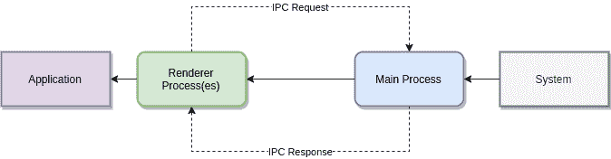
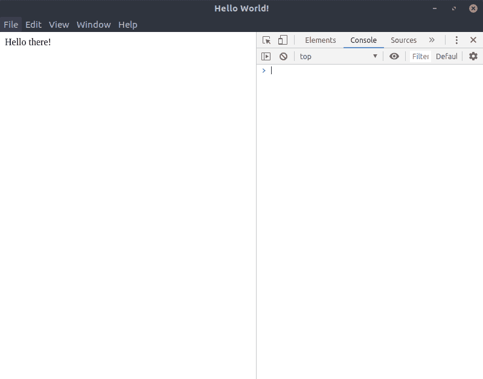
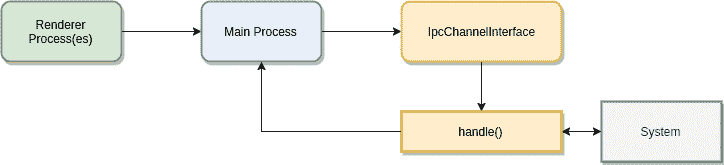
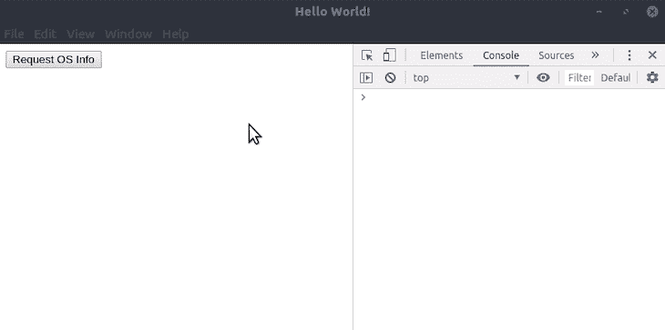

# 带有类型脚本的电子 IPC 响应/请求架构

> 原文：<https://blog.logrocket.com/electron-ipc-response-request-architecture-with-typescript/>

电子的工作方式非常简单。有两个不同的层——**主进程**和**呈现器进程**。主流程永远只有一个，就是你电子申请的切入点。可以有任意数量的呈现器进程，负责呈现您的应用程序。

这些层之间的通信通常通过 IPC(进程间通信)来完成。这听起来可能很复杂，但这只是异步请求-响应模式的一个好听的名字。



渲染器和主进程之间的通信在幕后发生的事情基本上只是事件调度。例如，假设您的应用程序应该显示关于运行它的系统的信息。这可以通过一个简单的命令`uname -a`来完成，它显示了您的内核版本。但是你的应用程序本身不能执行命令，所以它需要主进程。在电子应用程序中，您的应用程序可以访问渲染器进程( [ipcRenderer](https://electronjs.org/docs/api/ipc-renderer) )。接下来会发生这样的事情:

1.  您的应用程序将利用`ipcRenderer`向主进程发出一个事件。这些事件被称为电子内的*通道*
2.  如果主进程注册了一个合适的事件监听器(监听刚刚被调度的事件),它就能够为这个事件运行合适的代码
3.  在一切都完成之后，主进程可以为结果发出另一个事件(在我们的例子中，是内核版本)
4.  现在整个工作流以相反的方式发生，渲染器进程需要为在主进程中调度的事件实现一个监听器
5.  当渲染器进程接收到包含我们想要的信息的适当事件时，UI 现在可以显示该信息

最终，整个过程可以被视为一个简单的请求-响应模式，有点像 HTTP——只是异步的。我们将通过某个通道请求某个东西，并在某个通道上接收对该请求的响应。

由于有了 TypeScript，我们可以将整个逻辑抽象成一个完全分离并正确封装的应用程序，在这个应用程序中，我们将整个类专用于主进程中的单个通道，并利用承诺来实现更简单的异步请求。同样，这听起来比实际情况复杂得多！

## 用 TypeScript 引导电子应用程序

我们需要做的第一件事是用 TypeScript 引导我们的电子应用程序。我们的`package.json`只是:

```
{
  "name": "electron-ts",
  "version": "1.0.0",
  "description": "Yet another Electron application",
  "scripts": {
    "build": "tsc",
    "watch": "tsc -w",
    "start": "npm run build && electron ./dist/electron/main.js",
    "test": "echo \"Error: no test specified\" && exit 1"
  },
  "author": "Kevin Hirczy <https://nehalist.io>",
  "license": "MIT",
  "devDependencies": {
    "electron": "^7.1.5",
    "typescript": "^3.7.3"
  }
}
```

接下来我们要添加的是我们的 Typescript 配置，`tsconfig.json`:

```
{
  "compilerOptions": {
    "target": "es5",
    "noImplicitAny": true,
    "sourceMap": true,
    "moduleResolution": "node",
    "outDir": "dist",
    "baseUrl": "."
  },
  "include": [
    "src/**/*"
  ]
}
```

我们的源文件将存在于`src`目录中，所有的东西都将被构建到`dist`目录中。我们将把`src`目录分成两个独立的目录，一个用于电子，一个用于我们的应用程序。整个目录结构将如下所示:

```
src/
  app/
  electron/
  shared/
index.html
package.json
tsconfig.json
```

我们的`index.html`将是通过电子方式加载的文件，非常简单(就目前而言):

```
<!DOCTYPE html>
<html>
<head>
  <meta charset="UTF-8">
  <title>Hello World!</title>
  <meta http-equiv="Content-Security-Policy" content="script-src 'self' 'unsafe-inline';"/>
</head>
<body>
  Hello there!
</body>
</html>
```

我们要实现的第一个文件是 electronic 的主文件。这个文件将实现一个`Main`类，它负责初始化我们的电子应用程序:

```
// src/electron/main.ts

import {app, BrowserWindow, ipcMain} from 'electron';

class Main {
  private mainWindow: BrowserWindow;

  public init() {
    app.on('ready', this.createWindow);
    app.on('window-all-closed', this.onWindowAllClosed);
    app.on('activate', this.onActivate);
  }

  private onWindowAllClosed() {
    if (process.platform !== 'darwin') {
      app.quit();
    }
  }

  private onActivate() {
    if (!this.mainWindow) {
      this.createWindow();
    }
  }

  private createWindow() {
    this.mainWindow = new BrowserWindow({
      height: 600,
      width: 800,
      title: `Yet another Electron Application`,
      webPreferences: {
        nodeIntegration: true // makes it possible to use `require` within our index.html
      }
    });

    this.mainWindow.webContents.openDevTools();
    this.mainWindow.loadFile('../../index.html');
  }
}

// Here we go!
(new Main()).init();
```

运行`npm start`现在应该启动您的电子应用程序并显示您的`index.html`:



接下来我们要实现的是如何处理我们的 IPC 通道。

## 通道处理

在 [SoC](https://en.wikipedia.org/wiki/Separation_of_concerns) 之后，我们将为每个通道实现一个类。这些类将负责接收请求。在上面的例子中，我们有一个负责收集系统数据的`SystemInfoChannel`。如果你想使用某些工具，比如说用 vagger 控制虚拟机，你可以有一个`VagrantChannel`，等等。

每个通道都将有一个名称和一个处理传入请求的方法，因此我们为此创建了一个接口:

```
// src/electron/IPC/IpcChannelInterface.ts

import {IpcMainEvent} from 'electron';

export interface IpcChannelInterface {
  getName(): string;

  handle(event: IpcMainEvent, request: any): void;
}
```

有一件事很突出，`any`。类型提示`any`在很多情况下是一个设计缺陷——我们不会容忍设计缺陷。所以让我们花点时间来思考一下`request`到底是什么类型。

请求是从我们的渲染器进程发送的。发送请求时，有两件事可能需要了解:

1.  我们需要知道我们的通道可能接受一些参数
2.  我们需要知道使用哪个通道进行响应

它们都是可选的——但是我们现在可以创建一个发送请求的接口。该接口将在电子和我们的应用程序之间**共享**:

```
export interface IpcRequest {
  responseChannel?: string;

  params?: string[];
}
```

现在我们可以回到我们的`IpcChannelInterface`并为我们的`request`添加一个合适的类型:

```
handle(event: IpcMainEvent, request: IpcRequest): void;
```

接下来我们需要注意的是如何将通道添加到我们的主流程中。最简单的方法是向我们的`Main`类的`init`方法添加一个通道数组。这些渠道将由我们的`ipcMain`流程注册:

```
public init(ipcChannels: IpcChannelInterface[]) {
  app.on('ready', this.createWindow);
  app.on('window-all-closed', this.onWindowAllClosed);
  app.on('activate', this.onActivate);

  this.registerIpcChannels(ipcChannels);
}
```

而`registerIpcChannels`方法只有一行:

```
private registerIpcChannels(ipcChannels: IpcChannelInterface[]) {
  ipcChannels.forEach(channel => ipcMain.on(channel.getName(), (event, request) => channel.handle(event, request)));
}
```

这里发生的事情是，传递给我们的`init`方法的通道将被注册到我们的主进程，并由它们的响应通道类来处理。为了更容易理解，让我们从上面的例子中为我们的系统信息快速实现一个类:

```
// src/electron/IPC/SystemInfoChannel.ts
import {IpcChannelInterface} from "./IpcChannelInterface";
import {IpcMainEvent} from 'electron';
import {IpcRequest} from "../../shared/IpcRequest";
import {execSync} from "child_process";

export class SystemInfoChannel implements IpcChannelInterface {
  getName(): string {
    return 'system-info';
  }

  handle(event: IpcMainEvent, request: IpcRequest): void {
    if (!request.responseChannel) {
      request.responseChannel = `${this.getName()}_response`;
    }
    event.sender.send(request.responseChannel, { kernel: execSync('uname -a').toString() });
  }
}
```

通过将这个类的一个实例添加到对我们的`Main`类的`init`调用中，我们现在已经注册了我们的第一个通道处理程序:

```
(new Main()).init([
  new SystemInfoChannel()
]);
```

现在，每次在`system-info`通道上发生请求时，`SystemInfoChannel`都会通过用内核版本响应(在`responseChannel`上)来处理它。

这是我们目前所做的可视化工作:



到目前为止看起来不错，但是我们仍然错过了我们的应用程序实际做事情的部分——比如发送收集我们的内核版本的请求。

## 从我们的应用程序发送请求

为了利用我们干净的主进程的 IPC 架构，我们需要在我们的应用程序中实现一些逻辑。为了简单起见，我们的用户界面将简单地包含一个按钮，用于向主进程发送请求，主进程将返回我们的内核版本。

我们所有与 IPC 相关的逻辑都将放在一个简单的服务中——`IpcService`类:

```
// src/app/IpcService.ts

export class IpcService {
}
```

使用这个类时，我们需要做的第一件事是确保我们可以访问`ipcRenderer`。

如果你想知道为什么我们需要这样做，那是因为如果有人直接打开`index.html`文件，就没有`ipcRenderer`可用。

让我们添加一个正确初始化我们的`ipcRenderer`的方法:

```
private ipcRenderer?: IpcRenderer;

private initializeIpcRenderer() {
  if (!window || !window.process || !window.require) {
    throw new Error(`Unable to require renderer process`);
  }
  this.ipcRenderer = window.require('electron').ipcRenderer;
}
```

当我们试图从我们的主流程请求某些东西时，这个方法将被调用——这是我们需要实现的下一个方法:

```
public send<T>(channel: string, request: IpcRequest = {}): Promise<T> {
  // If the ipcRenderer is not available try to initialize it
  if (!this.ipcRenderer) {
    this.initializeIpcRenderer();
  }
  // If there's no responseChannel let's auto-generate it
  if (!request.responseChannel) {
    request.responseChannel = `${channel}_response_${new Date().getTime()}`
  }

  const ipcRenderer = this.ipcRenderer;
  ipcRenderer.send(channel, request);

  // This method returns a promise which will be resolved when the response has arrived.
  return new Promise(resolve => {
    ipcRenderer.once(request.responseChannel, (event, response) => resolve(response));
  });
}
```

使用泛型使我们有可能获得关于我们将从请求中得到什么的信息——否则，它将是未知的，我们将不得不成为一个转换方面的向导，以获得关于我们真正处理的类型的适当信息。不要误解我的意思。成为一名巫师是很棒的——但是没有类型信息就不是了。

当响应到达时，解析来自我们的`send`方法的承诺使得利用`async/await`语法成为可能。通过在我们的`ipcRenderer`上使用`once`而不是`on`，我们确保不会在这个特定的频道上监听额外的事件。

我们的整个`IpcService`现在应该是这样的:

```
// src/app/IpcService.ts
import {IpcRenderer} from 'electron';
import {IpcRequest} from "../shared/IpcRequest";

export class IpcService {
  private ipcRenderer?: IpcRenderer;

  public send<T>(channel: string, request: IpcRequest): Promise<T> {
    // If the ipcRenderer is not available try to initialize it
    if (!this.ipcRenderer) {
      this.initializeIpcRenderer();
    }
    // If there's no responseChannel let's auto-generate it
    if (!request.responseChannel) {
      request.responseChannel = `${channel}_response_${new Date().getTime()}`
    }

    const ipcRenderer = this.ipcRenderer;
    ipcRenderer.send(channel, request);

    // This method returns a promise which will be resolved when the response has arrived.
    return new Promise(resolve => {
      ipcRenderer.once(request.responseChannel, (event, response) => resolve(response));
    });
  }

  private initializeIpcRenderer() {
    if (!window || !window.process || !window.require) {
      throw new Error(`Unable to require renderer process`);
    }
    this.ipcRenderer = window.require('electron').ipcRenderer;
  }
}
```

## 把所有东西放在一起

现在，我们已经在主流程中创建了一个用于处理传入请求的架构，并实现了一个用于发送此类服务的服务，现在我们已经准备好将所有东西放在一起了！

我们想做的第一件事是扩展我们的`index.html`,以包含一个请求我们信息的按钮和一个显示信息的位置:

```
<!DOCTYPE html>
<html>
<head>
  <meta charset="UTF-8">
  <title>Hello World!</title>
  <meta http-equiv="Content-Security-Policy" content="script-src 'self' 'unsafe-inline';"/>
</head>
<body>
<button id="request-os-info">Request OS Info</button>
<div id="os-info"></div>
<script>
  require('./dist/app/app.js');
</script>
</body>
</html>
```

所需的`app.js`还不存在，所以让我们创建它。请记住，引用的路径是构建的文件——但是我们将实现 TypeScript 文件(位于`src/app/`)！

```
// src/app/app.ts

import {IpcService} from "./IpcService";

const ipc = new IpcService();

document.getElementById('request-os-info').addEventListener('click', async () => {
  const t = await ipc.send<{ kernel: string }>('system-info');
  document.getElementById('os-info').innerHTML = t.kernel;
});
```

瞧，我们完成了！起初可能看起来不起眼，但是现在通过点击按钮，请求从我们的渲染器进程发送到我们的主进程，主进程将请求委托给负责的通道类，并最终用我们的内核版本进行响应。



当然，像错误处理这样的事情需要在这里完成——但是这个概念为电子应用程序提供了一个非常干净和易于遵循的通信策略。

这种方法的完整源代码可以在 GitHub 上找到。

## 使用 [LogRocket](https://lp.logrocket.com/blg/signup) 消除传统错误报告的干扰

[](https://lp.logrocket.com/blg/signup)

[LogRocket](https://lp.logrocket.com/blg/signup) 是一个数字体验分析解决方案，它可以保护您免受数百个假阳性错误警报的影响，只针对几个真正重要的项目。LogRocket 会告诉您应用程序中实际影响用户的最具影响力的 bug 和 UX 问题。

然后，使用具有深层技术遥测的会话重放来确切地查看用户看到了什么以及是什么导致了问题，就像你在他们身后看一样。

LogRocket 自动聚合客户端错误、JS 异常、前端性能指标和用户交互。然后 LogRocket 使用机器学习来告诉你哪些问题正在影响大多数用户，并提供你需要修复它的上下文。

关注重要的 bug—[今天就试试 LogRocket】。](https://lp.logrocket.com/blg/signup-issue-free)