# 使用 React Native、react-navigation 和 Firebase - LogRocket 博客设置电子邮件身份验证

> 原文：<https://blog.logrocket.com/email-authentication-react-native-react-navigation-firebase/>

***编者按:*** *本帖于 2021 年 10 月更新，以反映 react-navigation 和 react-native-firebase 的当前版本。*

管理移动应用中的用户认证流是要实现的最重要的特性之一。在本教程中，我们将讨论使用带有 React Native 和最新版本的 react-navigation ( [版本 6](https://reactnavigation.org/) )和 [react-native-firebase](https://rnfirebase.io/) 库的电子邮件登录提供者来实现认证流的策略之一。对于后端服务，我们将使用 [Firebase SDK](https://console.firebase.google.com/) 。

为了跟进，确保您可以访问 Firebase 项目及其控制台(免费层项目也可以——我也将使用免费层)。

## 在 React Native with Firebase 中实现身份验证的要求

对于本教程，请确保您的开发环境包括以下必需的包:

*   安装在本地机器上的 10.x.x 以上的 Node.js
*   [watchman](https://facebook.github.io/watchman/) 文件监视器，已安装
*   react-native-cli 通过 npm 安装或通过 npm 访问
*   [仅适用于 iOS 的 cocoapods](https://cocoapods.org/)
*   用于测试的 iOS 模拟器或 Android 模拟器
*   务必注意，下面的教程将使用 [react-native 版本 0.62.x](https://reactnative.dev/) 。请确保您使用的 React Native 版本高于 0.60.x

对于为 React Native 设置开发环境的完整演练，您可以在这里浏览官方文档。

## 创建 React 本机应用程序

首先创建一个新的 React 原生应用程序。打开终端窗口并执行以下命令。我将使用 npm 来访问最新的 React 本机 CLI 版本。创建项目目录后，请确保在目录内导航:

```
npx react-native init rnEmailAuthFirebase
# navigate to project directory
cd rnEmailAuthFirebase
```

现在让我们安装构建这个演示应用程序所需的所有依赖项。返回终端窗口运行以下命令。正在安装的以下库与在 React 本机应用程序中配置 Firebase SDK 以及使用 react-navigation 设置导航流相关。

为了安装依赖项，我将使用`yarn`，但是您也可以使用`npm`:

```
# for navigation
yarn add @react-navigation/native @react-navigation/stack react-native-reanimated react-native-gesture-handler react-native-screens react-native-safe-area-context @react-native-community/masked-view
yarn add @react-navigation/[email protected] @react-navigation/[email protected] [email protected] [email protected] [email protected] @react-native-masked-view/[email protected]
```

如果你在 Mac 上开发 iOS，你需要安装 pods(通过 Cocoapods)来完成链接。运行下面的命令:

```
npx pod-install ios

```

依赖关系`react-native-screens`需要对 Android 平台进行额外的配置。打开文件`android/app/src/main/java//MainActivity.java`并在顶部添加以下内容:

```
import android.os.Bundle;
```

在同一文件中，在`MainActivity`类中添加以下代码片段:

```
@Override
protected void onCreate(Bundle savedInstanceState) {
  super.onCreate(null);
}

```

react-native-gesture-handler 包需要额外的配置。打开 React Native app 根目录下的`App.js`文件，导入文件顶部的包。

```
// language: javascript
import 'react-native-gesture-handler';
```

集成和启用 React 导航库的步骤现在已经完成。

如果您使用过 react-native-firebase 版本 5 或更低版本，您可能会注意到它是一个 monorepo，用于从一个模块管理所有 firebase 依赖项。

这个库的最新版本希望您只安装那些基于您想要使用的 Firebase 特性的依赖项。例如，在当前应用中，要支持电子邮件身份验证功能，您需要安装身份验证和核心应用包:

```
yarn add @react-native-firebase/app @react-native-firebase/auth
```

安装完依赖项后，请确保遵循 react-navigation 的[官方文档](https://reactnavigation.org/docs/getting-started)中提供的说明来配置其本机二进制文件，以便在 iOS 和 Android 平台上都能工作。

iOS 用户，安装完这些依赖项后安装 pods:

```
npx pod-install ios

```

## 从控制台创建新的 Firebase 项目

要访问每个移动操作系统平台的 Firebase 凭证，并将其配置为使用 Firebase SDK，请创建一个新的 Firebase 项目。或者，如果您已经可以从 [Firebase 控制台](https://console.firebase.google.com/)访问，则使用一个，在这种情况下，您可以跳过这一步。

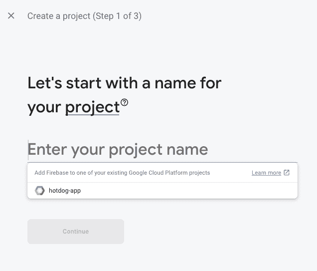

要创建一个新的 Firebase 项目，点击**添加项目**按钮，然后输入 Firebase 项目的名称。


在下一个屏幕上，您可以保留默认设置，并按下 **Create project** 按钮来初始化一个新的 Firebase 项目。


加载完成后，按下按钮，Firebase 项目的主仪表板屏幕将欢迎您。点击**创建项目**，您将被重定向到仪表板屏幕。就是这样。您已经成功创建了一个新的 Firebase 项目！

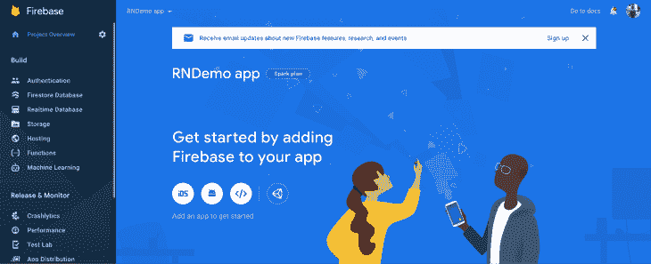

## 将 Firebase 添加到 React 本机项目中

现在确保**电子邮件登录方法**已启用。从 **Firebase 控制台，**从侧边菜单导航到**认证**部分:

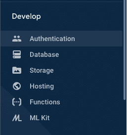

进入第二页签**登录方式**，启用**电子邮件登录提供商**:

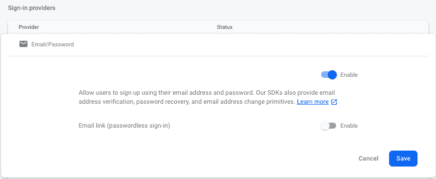

## 将 Firebase 凭据添加到您的 iOS 应用程序

Firebase 提供了一个名为`GoogleService-Info.plist`的文件，其中包含所有的 API 密钥以及 iOS 设备验证正确的 Firebase 项目的其他凭证。

要获得这些凭证，请在浏览器窗口中返回到 [Firebase 控制台](https://console.firebase.google.com/)。在 Firebase 项目的仪表板屏幕上，从侧面菜单打开**项目设置**:

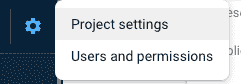

转到您的**应用部分**，点击图标 **iOS** 选择平台:

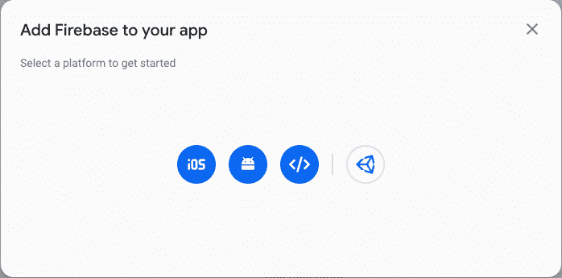

进入申请详情，点击**注册 app** ，下载`GoogleService-Info.plist`。

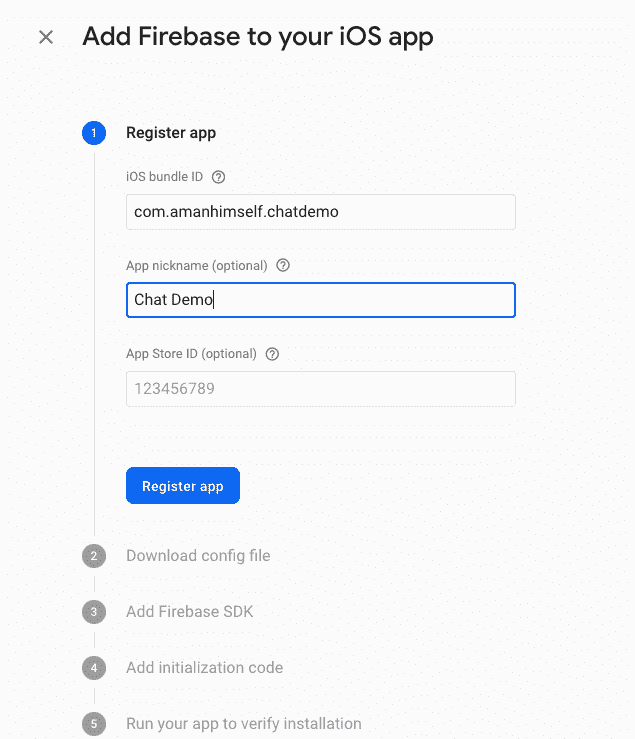

打开 Xcode，然后打开文件`/ios/rnEmailAuthFirebase.xcodeproj`文件。右击项目名称和**添加文件**选项，然后选择要添加到这个项目的文件:

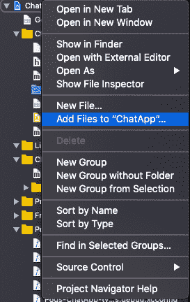

然后打开`ios/ChatApp/AppDelegate.m`并添加以下标题:

```
#import <Firebase.h>
```

在同一个文件的`didFinishLaunchingWithOptions`方法中，添加以下 configure 方法:

```
- (BOOL)application:(UIApplication *)application didFinishLaunchingWithOptions:(NSDictionary *)launchOptions {
    if ([FIRApp defaultApp] == nil) {
      [FIRApp configure];
    }
```

最后，返回终端窗口安装 pod:

```
cd ios/ && pod install
# after pods are installed
cd ..
```

确保您构建了 iOS 应用程序:

```
npx react-native run-ios
```

要为您的 Android 应用程序集成 Firebase 配置，您需要生成、下载和添加`google-services.json`。

在 Firebase 仪表盘屏幕上，点击**项目概述>设置**，在**常规**选项卡中，转到**您的应用**部分。点击**添加应用**按钮，然后点击模态中带有 **Android 图标**的按钮。

输入你的应用程序的详细信息。然后点击**报名** **app** 。下图中的 Android 包名称必须与您的本地项目包名称相匹配，该名称可以在您的项目中的`/android/app/src/main/AndroidManifest.xml file`内的`manifest`标记中找到。

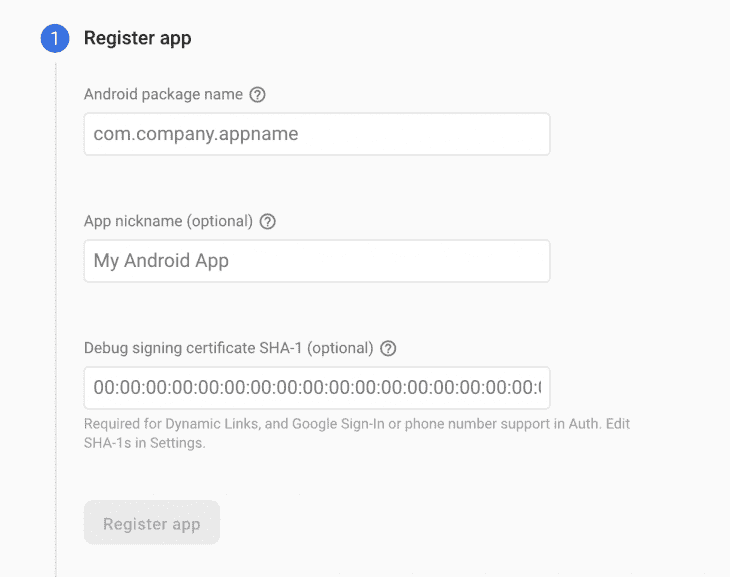

下载`google-services.json`文件。将它放在 React 本地项目中的文件位置:`/android/app/google-services.json.`

接下来，启用 google 服务插件。这需要修改 Android 目录中的两个文件。将`google-services plugin`作为依赖项添加到您的`/android/build.gradle file`中:

```
buildscript {
  dependencies {
    // ... other dependencies
    // Add the line below 
    classpath 'com.google.gms:google-services:4.3.8'
  }
}

```

然后，通过将以下内容添加到您的`/android/app/build.gradle`文件来执行插件:

```
apply plugin: 'com.android.application'
apply plugin: 'com.google.gms.google-services' // <- Add this line

```

接下来，要重建 Android 应用程序，请执行以下命令:

```
npx react-native run-android
```

就是这样。在 React 本机应用程序中设置 Firebase SDK 和凭证的配置已经完成。

## 创建可重用的表单组件

在本节中，让我们创建一些可重用的表单组件，如`FormInput`和`FormButton`。这些 UI 组件将用于两个屏幕:登录和注册。React Native 中可重用组件的优势在于，您不必为不同的屏幕组件集再次编写类似的公共代码。

创建一个新目录`src/components`，并在其中创建三个新文件:

*   `FormButton.js`
*   `FormInput.js`
*   `Loading.js`

打开`FormButton.js`。该组件将在屏幕组件 UI 中显示一个按钮。首先导入以下语句:

```
import React from 'react';
import { StyleSheet, TouchableOpacity, Text } from 'react-native';
import { windowHeight, windowWidth } from '../utils/Dimensions';
```

`[Dimensions](https://reactnative.dev/docs/dimensions)`从 React Native core API 提供了一种获取屏幕宽度和高度的方法。不要给文本输入字段固定的宽度和高度，让这个 API 根据窗口的尺寸为我们计算它。在本节的最后，您将创建这些助手，`windowHeight`和`windowWidth`。

接下来，导出默认函数`FormButton`，它将有一些道具:

```
export default function FormButton({ buttonTitle, ...rest }) {
  return (
    <TouchableOpacity style={styles.buttonContainer} {...rest}>
      <Text style={styles.buttonText}>{buttonTitle}</Text>
    </TouchableOpacity>
  );
}
```

属性必须是作为参数传递的最后一个属性，否则，你将得到一个错误。传递这个道具的目的是让组件拥有其他道具值。最后，为这个可重用组件定义相应的样式:

```
const styles = StyleSheet.create({
  buttonContainer: {
    marginTop: 10,
    width: windowWidth / 2,
    height: windowHeight / 15,
    backgroundColor: '#6646ee',
    padding: 10,
    alignItems: 'center',
    justifyContent: 'center',
    borderRadius: 8
  },
  buttonText: {
    fontSize: 28,
    color: '#ffffff'
  }
});
```

然后打开第二个可重用组件`FormInput.js`。它将类似于您刚刚创建的前一个 UI 组件。

该组件将提供一个文本输入字段，供屏幕组件使用，并供用户输入凭证:

```
import React from 'react';
import { StyleSheet, TextInput } from 'react-native';
import { windowHeight, windowWidth } from '../utils/Dimensions';
export default function FormInput({ labelValue, placeholderText, ...rest }) {
  return (
    <TextInput
      value={labelValue}
      style={styles.input}
      numberOfLines={1}
      placeholder={placeholderText}
      placeholderTextColor='#666'
      {...rest}
    />
  );
}
const styles = StyleSheet.create({
  input: {
    padding: 10,
    marginTop: 5,
    marginBottom: 10,
    width: windowWidth / 1.5,
    height: windowHeight / 15,
    fontSize: 16,
    borderRadius: 8,
    borderWidth: 1
  }
});
```

最后，打开`Loading.js`文件。该组件将负责显示一个装载微调器:

```
import React from 'react';
import { View, ActivityIndicator, StyleSheet } from 'react-native';
export default function Loading() {
  return (
    <View style={styles.loadingContainer}>
      <ActivityIndicator size='large' color='#6646ee' />
    </View>
  );
}
const styles = StyleSheet.create({
  loadingContainer: {
    flex: 1,
    alignItems: 'center',
    justifyContent: 'center'
  }
});
```

现在，在`src/`目录中创建另一个名为`utils/`的目录。在这个新目录中，创建并打开名为`Dimensions.js`的文件和下面的代码片段:

```
import { Dimensions } from 'react-native';
export const windowWidth = Dimensions.get('window').width;
export const windowHeight = Dimensions.get('window').height;
```

## 在 React Native 中创建登录屏幕

让我们将所有的屏幕组件一起存储在一个名为`src/screens/`的新目录中，并创建一个最重要的屏幕组件文件`LoginScreen.js`。

当用户没有通过验证或授权进入应用程序时，这个屏幕组件将成为初始路径。它将要求用户输入应用程序的凭据，并查看主屏幕或任何其他屏幕，这些屏幕仅允许用户在获得授权时进行交互。

* * *

### 更多来自 LogRocket 的精彩文章:

* * *

登录屏幕将有四个主要的 UI 元素:

*   用于用户凭证的两个文本输入字段，`email`和`password`
*   两个按钮—一个登录按钮和一个导航到注册屏幕的按钮

首先导入以下语句:

```
import React, { useState } from 'react';
import { View, Text, StyleSheet, TouchableOpacity } from 'react-native';
import FormButton from '../components/FormButton';
import FormInput from '../components/FormInput';
```

在`LoginScreen`功能组件中定义状态变量`email`和`password`。它们将与`FormInput`组件一起使用，以获取用户凭证的值。默认情况下，它们的值是一个空字符串:

```
export default function LoginScreen({ navigation }) {
  const [email, setEmail] = useState('');
  const [password, setPassword] = useState('');
  return (
    <View style={styles.container}>
      <Text style={styles.text}>Welcome to Firebase app</Text>
      <FormInput
        value={email}
        placeholderText='Email'
        onChangeText={userEmail => setEmail(userEmail)}
        autoCapitalize='none'
        keyboardType='email-address'
        autoCorrect={false}
      />
      <FormInput
        value={password}
        placeholderText='Password'
        onChangeText={userPassword => setPassword(userPassword)}
        secureTextEntry={true}
      />
      <FormButton buttonTitle='Login' onPress={() => alert('login button')} />
      <TouchableOpacity
        style={styles.navButton}
        onPress={() => navigation.navigate('Signup')}
      >
        <Text style={styles.navButtonText}>New user? Join here</Text>
      </TouchableOpacity>
    </View>
  );
}
```

此处使用`navigation`道具参考来导航注册屏幕。这个 prop 参考提供了一组函数，可以作为每个屏幕组件的动作进行调度，它是由 react-navigation 库提供的。`navigation.navigate()`接受从当前屏幕导航到的屏幕值。

道具现在不会发出动作，原因有二。原因一，你还没有创建一个注册屏幕，原因二，有一个导航栈设置。你很快就会这么做。最后，这里是`LoginScreen`组件的相应样式:

```
const styles = StyleSheet.create({
  container: {
    backgroundColor: '#f5f5f5',
    flex: 1,
    justifyContent: 'center',
    alignItems: 'center'
  },
  text: {
    fontSize: 24,
    marginBottom: 10
  },
  navButton: {
    marginTop: 15
  },
  navButtonText: {
    fontSize: 20,
    color: '#6646ee'
  }
});
```

## 创建注册屏幕

在`src/screens/`目录下创建一个名为`SignupScreen.js`的新文件。这个屏幕将与您在上一节中创建的屏幕非常相似。

以下是完整的代码片段:

```
import React, { useState } from 'react';
import { View, Text, StyleSheet } from 'react-native';
import FormButton from '../components/FormButton';
import FormInput from '../components/FormInput';
export default function SignupScreen() {
  const [email, setEmail] = useState('');
  const [password, setPassword] = useState('');
  return (
    <View style={styles.container}>
      <Text style={styles.text}>Create an account</Text>
      <FormInput
        value={email}
        placeholderText='Email'
        onChangeText={userEmail => setEmail(userEmail)}
        autoCapitalize='none'
        keyboardType='email-address'
        autoCorrect={false}
      />
      <FormInput
        value={password}
        placeholderText='Password'
        onChangeText={userPassword => setPassword(userPassword)}
        secureTextEntry={true}
      />
      <FormButton buttonTitle='Signup' onPress={() => alert('sign button')} />
    </View>
  );
}
const styles = StyleSheet.create({
  container: {
    backgroundColor: '#f5f5f5',
    flex: 1,
    justifyContent: 'center',
    alignItems: 'center'
  },
  text: {
    fontSize: 24,
    marginBottom: 10
  }
});
```

## 创建您的第一个堆栈导航器

在当前的应用程序中，让我们创建另一个名为`HomeScreen`的屏幕组件。这个组件没什么用。当您集成 Firebase 后端服务时，它将有一个注销按钮并显示用户的详细信息。

用下面的代码片段在 screens 目录中创建一个名为`HomeScreen.js`的新文件:

```
import React from 'react';
import { View, Text, StyleSheet } from 'react-native';
import FormButton from '../components/FormButton';
export default function HomeScreen() {
  return (
    <View style={styles.container}>
      <Text style={styles.text}>Home Screen</Text>
      <FormButton buttonTitle='Logout' />
    </View>
  );
}
const styles = StyleSheet.create({
  container: {
    flex: 1,
    justifyContent: 'center',
    alignItems: 'center',
    backgroundColor: '#f5f5f1'
  },
  text: {
    fontSize: 20,
    color: '#333333'
  }
});
```

这个屏幕将有自己的堆栈导航器。堆栈导航器提供 React 本机应用程序在不同屏幕之间切换，类似于 web 浏览器中的导航工作方式。当处于导航状态时，它推动或弹出一个屏幕。

创建一个新目录`src/navigation`,用于存储当前演示应用程序的所有导航相关配置文件。在内部，首先用下面的代码片段创建一个名为`HomeStack.js`的新文件:

```
import React from 'react';
import { createStackNavigator } from '@react-navigation/stack';
import HomeScreen from '../screens/HomeScreen';
const Stack = createStackNavigator();
export default function HomeStack() {
  return (
    <Stack.Navigator>
      <Stack.Screen name='Home' component={HomeScreen} />
    </Stack.Navigator>
  );
}
```

导航器是以声明方式定义的，react-navigation 库遵循基于组件的方法。这与使用 react 的 web 开发中的 react-router 库非常相似(如果你熟悉的话)。

`createStackNavigator`是用于实现堆栈导航模式的函数。在上面的代码片段中，`Stack`是这个函数的一个实例。这个函数返回两个 React 组件，`Screen`和`Navigator`，帮助我们配置每个组件屏幕，如下所示。

## 添加一个 auth 堆栈以反应本机

在当前的应用程序中会有两个堆栈导航器。您在上一节中看到的第一个导航器。第二个航海家将被称为`AuthStack`。

在`navigation/`目录中，创建一个名为`AuthStack.js`的新文件。这个文件也将有一个堆栈导航器，代码片段如下:

```
import React from 'react';
import { createStackNavigator } from '@react-navigation/stack';
import SignupScreen from '../screens/SignupScreen';
import LoginScreen from '../screens/LoginScreen';
const Stack = createStackNavigator();
export default function AuthStack() {
  return (
    <Stack.Navigator initialRouteName='Login'>
      <Stack.Screen
        name='Login'
        component={LoginScreen}
        options={{ header: () => null }}
      />
      <Stack.Screen name='Signup' component={SignupScreen} />
    </Stack.Navigator>
  );
}
```

在上面的代码片段中，`Stack.Navigator`获取那些对每个屏幕路径通用的属性值。例如，堆栈导航器在其中的每个屏幕上添加一个标题。对于当前堆栈，您不需要在`Login`屏幕上显示标题，它被设置为`null`。

`initialRouteName`是导航器第一次加载时呈现的路线名称。

## 使用身份验证提供程序检查用户的登录状态

让我们创建一个身份验证提供者来检查用户是否登录，如果他们登录了，就自动对他们进行身份验证。

在`src/navigation/`中创建一个名为`AuthProvider.js`的新文件。首先导入以下语句:

```
import React, { createContext, useState } from 'react';
import auth from '@react-native-firebase/auth';
```

创建一个`AuthContext`。导出它，因为它将提供用户的状态和其他帮助器功能，这些功能是在不同的应用程序屏幕中执行身份验证操作所必需的:

```
export const AuthContext = createContext({});
```

Reactjs 中的[上下文 API](https://reactjs.org/docs/context.html#reactcreatecontext) 共享 React 组件树的全局数据。当您创建一个上下文时(就像我们上面所做的那样)，需要传递一个默认值。然后，当组件没有匹配的`Provider`时，使用该值。

`Provider`允许 React 组件订阅上下文变化。要创建一个 auth provider，需要导出一个名为`AuthProvider`的函数。

这个提供者将允许屏幕组件访问应用程序中当前用户的状态。在该功能组件中定义一个名为`user`的状态变量，如下所示:

```
export const AuthProvider = ({ children }) => {
  const [user, setUser] = useState(null);
  return (
    <AuthContext.Provider
      value={{
        user,
        setUser,
        login: async (email, password) => {
          try {
            await auth().signInWithEmailAndPassword(email, password);
          } catch (e) {
            console.log(e);
          }
        },
        register: async (email, password) => {
          try {
            await auth().createUserWithEmailAndPassword(email, password);
          } catch (e) {
            console.log(e);
          }
        },
        logout: async () => {
          try {
            await auth().signOut();
          } catch (e) {
            console.error(e);
          }
        }
      }}
    >
      {children}
    </AuthContext.Provider>
  );
};

```

在上面的代码片段中，在对象`value`内部，定义了一些函数。这些函数是助手方法，将在屏幕组件中用于不同的操作。

每个功能都使用 Firebase 方法与实时 Firebase 后端服务进行交互。登录和注册功能都需要用户的`email`和`password`来验证/保存凭证。注销方法调用一个简单的`signOut()`方法。

所有这些 Firebase 方法都可以从`@react-native-firebase/auth`包中获得。请注意，所有这些函数都是异步动作，因此需要使用`async await`语法帮助或基于承诺的语法。

## 包装提供商中的所有路由器

在本节中，您将在`Routes`周围包装 auth provider，以便在屏幕组件中使用 helper 函数以及当前`user`的值。

创建一个名为`src/navigation/index.js` file 的新文件，并添加以下代码片段:

```
import React from 'react';
import { AuthProvider } from './AuthProvider';
import Routes from './Routes';
export default function Providers() {
  return (
    <AuthProvider>
      <Routes />
    </AuthProvider>
  );
}
```

此外，确保使用`Providers`作为当前演示应用程序的入口点。修改`App.js`文件，如下所示:

```
import React from 'react';
import Providers from './src/navigation';
export default function App() {
  return <Providers />;
}
```

## 验证用户在初始路线上的登录状态

拼图的最后一块将是在`src/navigation/`目录中的一个`Routes.js`文件。创建此文件，并从导入以下语句开始:

```
import React, { useContext, useState, useEffect } from 'react';
import { NavigationContainer } from '@react-navigation/native';
import auth from '@react-native-firebase/auth';
import AuthStack from './AuthStack';
import HomeStack from './HomeStack';
import { AuthContext } from './AuthProvider';
import Loading from '../components/Loading';

```

用两个状态变量`initializing`和`loading`定义`Routes`函数，检查用户的状态是否登录。从授权上下文中，添加`user`和`setUser`。然后定义一个处理用户状态更改的助手方法。

使用`useEffect` Hook，您可以订阅这个状态改变函数，并确保在组件卸载时取消订阅:

```
export default function Routes() {
  const { user, setUser } = useContext(AuthContext);
  const [loading, setLoading] = useState(true);
  const [initializing, setInitializing] = useState(true);
  // Handle user state changes
  function onAuthStateChanged(user) {
    setUser(user);
    if (initializing) setInitializing(false);
    setLoading(false);
  }
  useEffect(() => {
    const subscriber = auth().onAuthStateChanged(onAuthStateChanged);
    return subscriber; // unsubscribe on unmount
  }, []);
  if (loading) {
    return <Loading />;
  }
  return (
    <NavigationContainer>
      {user ? <HomeStack /> : <AuthStack />}
    </NavigationContainer>
  );
}
```

## 使用`AuthContext`完成应用程序

现在一切都配置好了，你所要做的就是使用`AuthContext`中的助手方法。首先修改`Login.js`文件:

```
// import useContext from React
import React, { useState, useContext } from 'react';
// after other import statements, add below
import { AuthContext } from '../navigation/AuthProvider';
// inside functional component LoginScreen, fetch the helper method
export default function LoginScreen({navigation}) {
  // ...
  const { login } = useContext(AuthContext);
  // make sure the FormButton's onPress method uses the helper method
  return (
    {/* rest of the code remains same */}
    <FormButton buttonTitle='Login' onPress={() => login(email, password)} />
  )
}
```

要运行该应用程序，您必须从终端窗口使用特定于平台的命令来构建它，如下所示:

```
# for iOS
npx react-native run-ios
# for android
npx react-native run-android
```

您将在登录屏幕的模拟器中获得以下输出:

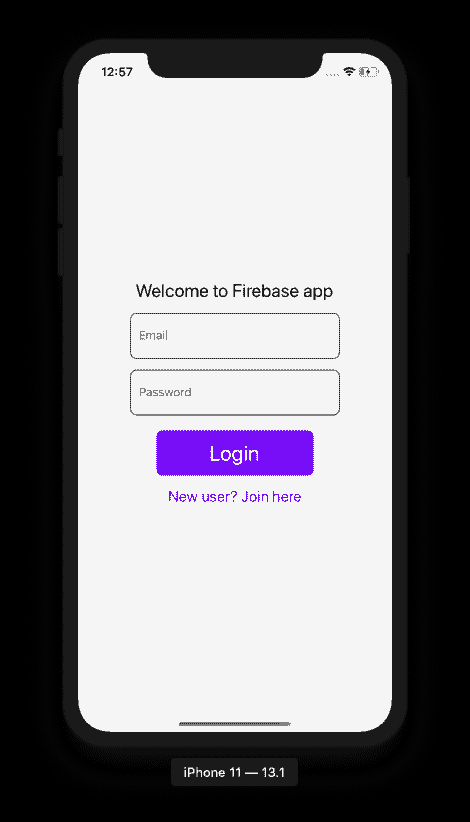

类似地，`SignupScreen.js`必须修改如下:

```
// import useContext from React
import React, { useState, useContext } from 'react';
// after other import statements, add below
import { AuthContext } from '../navigation/AuthProvider';
// inside functional component SignupScreen, fetch the helper method
export default function SignupScreen({navigation}) {
  // ...
  const { register } = useContext(AuthContext);
  // make sure the FormButton's onPress method uses the helper method
  return (
    {/* rest of the code remains same */}
    <FormButton
        buttonTitle='Signup'
        onPress={() => register(email, password)}
      />
  )
}
```

您将在注册屏幕的模拟器中获得以下输出:

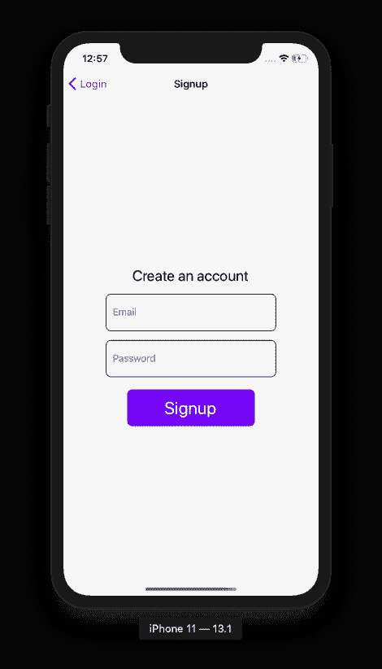

最后，像这样修改`HomeScreen.js`文件:

```
import React, { useContext } from 'react';
import { View, Text, StyleSheet } from 'react-native';
import FormButton from '../components/FormButton';
import { AuthContext } from '../navigation/AuthProvider';
export default function HomeScreen() {
  const { user, logout } = useContext(AuthContext);
  return (
    <View style={styles.container}>
      <Text style={styles.text}>Welcome user {user.uid}</Text>
      <FormButton buttonTitle='Logout' onPress={() => logout()} />
    </View>
  );
}
// styles remain same
```

这是该应用程序的完整演示。创建新的用户帐户:


To verify the user account is being stored in the Firebase, check out its console. You are going to find the `uid` of the user to be the same:

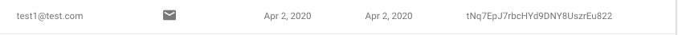

## 结论

恭喜你！您已经完成了本教程。以下是我们在这篇文章中提到的内容:

*   安装和配置 react-navigation 版本 6
*   使用组件/声明性方法构建堆栈导航器
*   编写自定义导航器以在两个堆栈导航器之间切换
*   安装和配置 Firebase 项目及其 SDK
*   使用反应原生燃烧基
*   使用电子邮件创建实时用户认证应用程序

Firebase SDK 与最新的 react-native 版本的集成使它变得很容易，因为该库已被分为不同的模块以用于不同的目的。现在，作为一名开发人员，你只需要安装那些与你想要使用的 Firebase 服务直接对应的模块。

你可以在 [this GitHub repo](https://github.com/amandeepmittal/react-native-examples/tree/master/rnEmailAuthFirebase) 找到本演示中使用的完整代码。

## [LogRocket](https://lp.logrocket.com/blg/react-native-signup) :即时重现 React 原生应用中的问题。

[](https://lp.logrocket.com/blg/react-native-signup)

[LogRocket](https://lp.logrocket.com/blg/react-native-signup) 是一款 React 原生监控解决方案，可帮助您即时重现问题、确定 bug 的优先级并了解 React 原生应用的性能。

LogRocket 还可以向你展示用户是如何与你的应用程序互动的，从而帮助你提高转化率和产品使用率。LogRocket 的产品分析功能揭示了用户不完成特定流程或不采用新功能的原因。

开始主动监控您的 React 原生应用— [免费试用 LogRocket】。](https://lp.logrocket.com/blg/react-native-signup)