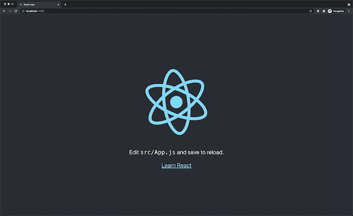
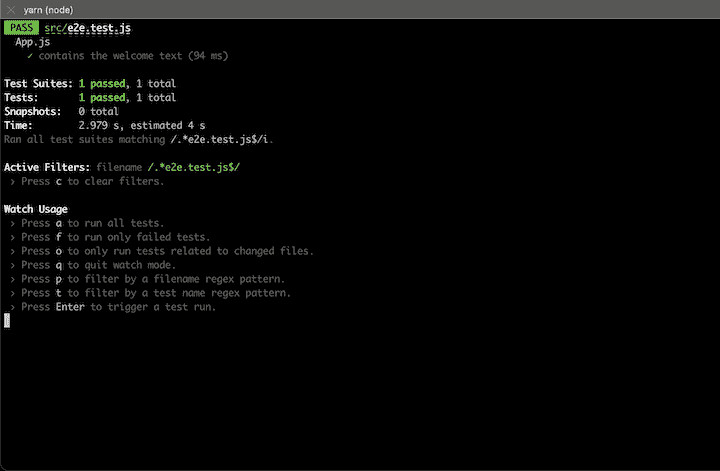
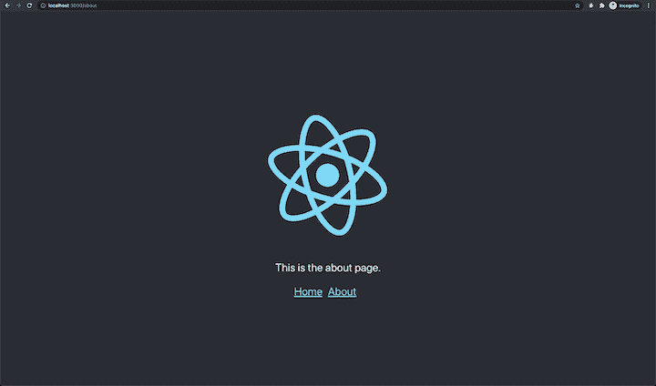
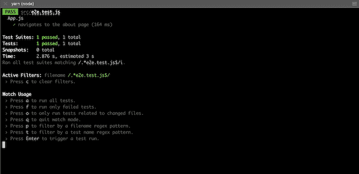
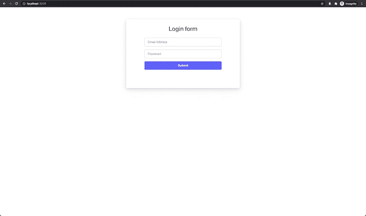
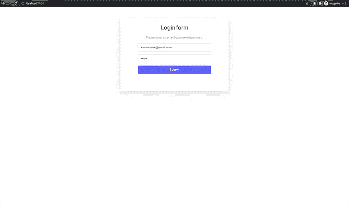
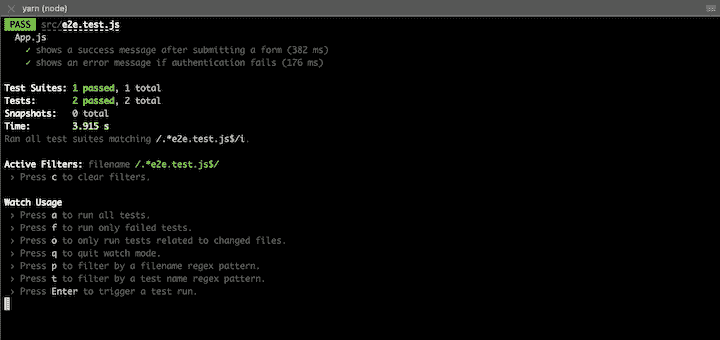

# 用 Jest 和 puppeter-log rocket 博客对端到端测试做出反应

> 原文：<https://blog.logrocket.com/end-to-end-testing-react-jest-puppeteer/>

***编者按**:本教程于 2022 年 9 月 20 日最后一次更新并验证准确性。*

测试是确保您的应用程序按预期工作的关键因素。在 React 应用程序中，有三种常见的测试方法:

1.  单元测试:检查[单个代码单元，主要是函数，是否按预期工作](https://blog.logrocket.com/unit-testing-react-cypress/)
2.  集成测试:将应用程序的单个单元或功能作为一个组进行组合和测试
3.  端到端测试(E2E):从用户的角度确认所有的功能都能正常工作

端到端测试模拟实际的用户操作，旨在测试真实用户可能会如何使用应用程序。在 React 中，E2E 测试有助于确保您编写的代码是功能性的，并且您的应用程序按预期运行，允许您在应用程序上线之前捕捉代码中的 bug。

虽然有许多测试框架可用于 React ，但在本教程中，我们将使用两个流行的测试工具 [Jest](https://jestjs.io) 和[puppet er](https://pptr.dev)在 React 中执行端到端测试。作为 E2E 测试的一个例子，我们将验证我们的网页是否按预期显示文本并处理页面导航和表单提交。我们开始吧！

## 什么是玩笑？

Jest 是由脸书创建的一个[测试工具，用于测试 React 应用。它还被用来测试 Babel、JavaScript、Node.js、Angular 和 Vue 应用，它也可以与 NestJS](https://blog.logrocket.com/jest-testing-top-features/) 和 [GraphQL](https://blog.logrocket.com/writing-end-to-end-tests-for-graphql-servers-using-jest/) 一起使用[。](https://blog.logrocket.com/unit-testing-nestjs-applications-with-jest/)

Jest 在设计时考虑到了简单性，它提供了一个强大而优雅的 API 来构建独立的测试、快照比较、模拟、测试覆盖等等。

## 什么是木偶师？

Puppeteer 是一个 Node.js 库，它提供了一个高级 API 来控制[无头 Chrome](https://developers.google.com/web/updates/2017/04/headless-chrome) 或通过 [DevTools 协议](https://chromedevtools.github.io/devtools-protocol/)的 Chrome。

使用 Puppeteer，您可以抓取网站、生成页面截图和 pdf、自动提交表单、测试 UI、使用 DOM API 访问网页和附加信息、自动执行性能分析、充当 SPA 的爬虫以及生成预渲染内容。

在本教程中，我们将使用木偶师从用户的角度进行测试。

## 反应端到端测试示例

为了展示 E2E 测试在 React 中是如何工作的，我们将为一个功能性的 React 应用程序编写测试，并看看当测试通过和失败时会发生什么。首先，我们将使用 Create React App 创建一个新的 React App:

```
npx create-react-app react-puppeteer

```

一旦创建并安装了项目目录，导航到新创建的目录并在您的终端中运行下面的命令，以在您的代码库中安装 Puppeteer:

```
yarn add puppeteer

```

用`yarn start`命令启动 React 应用程序，开发服务器应该在`localhost:3000`可用。您应该会看到一个类似于下图的欢迎页面:



### 测试包含文本的页面

对于我们的第一个端到端测试，我们将确保页面上显示正确的文本。在我们的示例中，我们希望验证文本`Edit src/App.js and save to reload.`是否出现在主页上。

创建一个名为`e2e.test.js`的新文件，并用下面的代码编辑它:

```
import puppeteer from "puppeteer";

describe("App.js", () => {
  let browser;
  let page;

  beforeAll(async () => {
    browser = await puppeteer.launch();
    page = await browser.newPage();
  });

  it("contains the welcome text", async () => {
    await page.goto("http://localhost:5000");
    await page.waitForSelector(".App-welcome-text");
    const text = await page.$eval(".App-welcome-text", (e) => e.textContent);
    expect(text).toContain("Edit src/App.js and save to reload.");
  });

  afterAll(() => browser.close());
});

```

在测试文件中的任何测试运行之前调用的`beforeAll`函数中，创建了一个新的木偶师实例，并将其分配给`browser`变量。反过来，一个新的页面实例被创建并分配给`page`变量。

测试页面是否有文本或特定元素的一个好方法是测试该元素的选择器是否出现在页面上。在测试块中，我们告诉 Puppeteer 首先导航到`localhost:5000`，这是一个服务器，我们将很快使用`[goto](https://pptr.dev/#?product=Puppeteer&version=v8.0.0&show=api-pagegotourl-options)`方法进行设置。然后，使用`[waitForSelector](https://pptr.dev/#?product=Puppeteer&version=v8.0.0&show=api-pagewaitforselectorselector-options)`方法，木偶师用`.App-welcome-text`选择器等待一个元素。

然后，我们使用带有选择器的元素的内容来断言页面是否加载了正确的文本。Puppeteer 允许您使用选择器定位页面上的元素，选择器可以是 CSS `class`或`id`，然后针对不同的情况进行测试。

为了运行端到端测试，我们将使用 [`react-scripts`，它内部安装了 Jest】。修改`package.json`文件，并将下面的代码添加到`scripts`对象中:](https://blog.logrocket.com/everything-you-need-know-about-react-scripts/)

```
"test": "react-scripts test --testPathIgnorePatterns=.*e2e.test.js",
"test:e2e": "react-scripts test --testPathPattern=.*e2e.test.js$", 

```

这将确保`yarn test`运行除端到端测试之外的所有测试，即单元测试，而`yarn test:e2e`只运行端到端测试。`--testPathPattern`意味着 Jest 将只运行模式为`e2e.test.js`的文件。

在运行测试之前，我们需要为生产构建 React 应用程序，并在一个简单的本地服务器上设置它。运行以下命令:

```
yarn build
yarn global add serve
serve -s build

```

`yarn build`命令为生产构建应用程序，并将构建的文件存储在名为`build`的文件夹中。为了建立一个本地服务器来托管构建的文件，我们将安装 [`serve`](https://github.com/vercel/serve) ，一个静态文件服务器和目录列表服务器。`serve -s build`命令启动服务器，然后您应该在`localhost:5000`启动并运行 React 应用程序。

现在，在另一个终端窗口或标签中运行`yarn test:e2e`命令。测试应该开始运行并通过，就像下面的截图一样:



### 测试页面导航

因为 Puppeteer 允许您在页面上模拟用户交互，所以我们可以测试验证页面是否导航到下一个正确的页面。

这个 [GitHub 分支](https://github.com/yomete/react-puppeteer-2021/tree/route-navigation)包含了我们之前创建的 Create React App 的修改版本。我已经安装了 React Router，并在`/about` route 中添加了一个新页面，只显示文本`This is the about page`。

克隆分支并使用`yarn start`启动 React 应用程序:



我们将编写一个测试来验证点击主页上的`about`页面链接会加载`about`页面。创建一个名为`e2e.test.js`的新文件，用下面的代码编辑它:

```
import puppeteer from "puppeteer";

describe("App.js", () => {
  let browser;
  let page;

  beforeAll(async () => {
    browser = await puppeteer.launch();
    page = await browser.newPage();
  });

  it("navigates to the about page", async () => {
    await page.goto("http://localhost:5000");
    await page.waitForSelector(".App-welcome-text");
    await page.click("#about-page-link");
    await page.waitForSelector(".App-welcome-text");
    const text = await page.$eval(".App-welcome-text", (e) => e.textContent);
    expect(text).toContain("This is the about page.");
  });
  afterAll(() => browser.close());
});

```

与我们之前编写的测试一样，`beforeAll`函数用于创建新的木偶师实例和新页面。然后，我们导航到`localhost:5000`并等待页面加载。

在`App.js`文件中，`about`页面链接的 ID 为`about-page-link`，这是我们用来模拟点击链接的选择器。我们可以通过使用木偶师的`[.click()](https://pptr.dev/#?product=Puppeteer&version=v10.0.0&show=api-pageclickselector-options)`方法做到这一点。该方法触发浏览器中的导航事件，即在浏览器的历史中后退或前进。

下面的命令构建应用程序并启动一个简单的静态服务器，以便 React 应用程序在`localhost:5000`可用:

```
yarn build && serve -s build

```

现在，在另一个终端窗口或选项卡中运行`yarn test:e2e`命令，测试应该成功通过:



测试页面导航的一个常见用例是，您需要确保用户从登录页面登录后被重定向到仪表板页面。

### 测试表单提交

Puppeteer 还支持在 web 应用程序中模拟表单提交。使用像`[.type](https://pptr.dev/#?product=Puppeteer&version=v10.0.0&show=api-pagetypeselector-text-options)`和 [`.click`](https://pptr.dev/#?product=Puppeteer&version=v10.0.0&show=api-pageclickselector-options) 这样的方法，您可以模拟用户输入他们的详细信息并点击提交按钮。

在这个例子中，我们将测试一个有两个输入字段`Email Address`和`Password`以及一个`Submit`按钮的登录表单。我们将测试验证当电子邮件或密码信息正确时会发生什么，以及当输入错误的身份验证信息时会发生什么。

让我们从克隆这个分支的[开始，这个分支包含预构建的登录表单和处理正确和错误认证细节的逻辑。](https://github.com/yomete/react-puppeteer-2021/tree/form-submission)

用`yarn start`启动 dev 服务器，您应该会看到类似下面的页面。这里的表单已经被硬编码为只接受电子邮件地址的`[[email protected]](/cdn-cgi/l/email-protection)`和密码的`password`。如果细节正确，则显示文本`You are now signed in.`:



电子邮件地址和密码的任何其他组合都将触发类似于下面截图中的错误文本。注意在代码库中，错误文本有一个类:



要编写我们的测试，创建一个名为`e2e.test.js`的新文件，并用下面的代码编辑它:

```
import puppeteer from "puppeteer";

describe("App.js", () => {
  let browser;
  let page;

  beforeAll(async () => {
    browser = await puppeteer.launch();
    page = await browser.newPage();
  });

  it("shows a success message after submitting a form", async () => {
    await page.goto("http://localhost:5000");
    await page.waitForSelector(".form-header");

    await page.click(".form-input__email");
    await page.type(".form-input__email", "[email protected]");

    await page.click(".form-input__password");
    await page.type(".form-input__password", "password");

    await page.click(".form-submit-button");

    await page.waitForSelector(".form-success-message");

    const text = await page.$eval(
      ".form-success-message",
      (e) => e.textContent
    );
    expect(text).toContain("You are now signed in.");
  });

  it("shows an error message if authentication fails", async () => {
    await page.goto("http://localhost:5000");
    await page.waitForSelector(".form-header");

    await page.click(".form-input__email");
    await page.type(".form-input__email", "[email protected]");

    await page.click(".form-input__password");
    await page.type(".form-input__password", "password123");

    await page.click(".form-submit-button");

    await page.waitForSelector(".form-error-text");

    const text = await page.$eval(".form-error-text", (e) => e.textContent);
    expect(text).toContain("Please enter a correct username/password.");
  });

  afterAll(() => browser.close());
});

```

在第一个测试中，我们测试了使用 Puppeteer 填充表单成功登录后的成功消息。输入字段是有目标的，并使用它们的 CSS 类填充正确的细节。

我们使用`.click`和`.type`方法来实现。当用户点击提交按钮时，我们期望看到一个 CSS 类`form-success-message`的文本，因为表单中填写了正确的登录信息。我们还希望它包含正确的文本。

第二个测试类似于第一个测试，但是，它是在验证失败时测试错误消息。测试给出了不正确的登录细节，我们期望它找到一个 CSS 类为`form-error-text`的错误消息。

同样，使用下面的命令构建应用程序并启动静态服务器，以便 React 应用程序在`localhost:5000`可用:

```
yarn build && serve -s build

```

然后，在另一个终端窗口或选项卡中运行`yarn test:e2e`命令，测试应该成功通过:



## 使用木偶师调试选项

Puppeteer 提供了一些额外的调试选项，我们可以用它们来进行 React e2e 测试。让我们回顾一下其中的一些选项，并了解如何将它们添加到现有的测试中。

### 无头模式

默认情况下，木偶师以无头模式加载 Chromium 浏览器。无头浏览器是一种没有可视 UI 外壳的浏览器，它仍然提供普通浏览器的全部功能。对于自动化测试和服务器环境来说，它是一个很好的工具。

要查看测试运行时浏览器显示的内容，请使用`headless: false`启动浏览器的完整版本:

```
  beforeAll(async () => {
    browser = await puppeteer.launch({ headless: false });
    page = await browser.newPage();
  });

```

现在，当测试运行时，将会启动一个 Chromium 浏览器。

### 慢速模式

启用无头模式后，有时很难跟上实际浏览器上发生的事情。例如，表单提交发生得非常快，因为它们几乎是即时填写的，而不是由人填写的。

* * *

### 更多来自 LogRocket 的精彩文章:

* * *

为了查看测试中实际发生的情况，木偶师有`slowMo`选项，它将木偶师的操作减慢指定的毫秒数:

```
  beforeAll(async () => {
    browser = await puppeteer.launch({ 
      headless: false, 
      slowMo: 250, // slow down by 250ms 
    });
    page = await browser.newPage();
  });

```

### 使用`page.emulate`模拟设备

`[page.emulate()](https://pptr.dev/#?product=Puppeteer&version=v10.0.0&show=api-pageemulateoptions)`方法使您能够模拟某些设备指标及其用户代理。您可以修改设备的宽度、高度和用户代理等属性:

```
beforeAll(async () => {
    browser = await puppeteer.launch({ headless: false });
    page = await browser.newPage();

    page.emulate({
      viewport: {
        width: 500,
        height: 900,
      },
      userAgent: 'Mozilla/5.0 (Macintosh; Intel Mac OS X 11_4) AppleWebKit/537.36 (KHTML, like Gecko) Chrome/91.0.4472.114 Safari/537.36',
      deviceScaleFactor: 1,
      isMobile: false.
      hasTouch: false,
      isLandscape: false
    });
});

```

为了使仿真更容易，Puppeteer 还提供了一个设备描述符列表，您可以通过 [`puppeteer.devices`](https://pptr.dev/#?product=Puppeteer&version=v10.0.0&show=api-puppeteerdevices) 数组获得。要模拟 iPhone 6，而不像上面那样显式指定宽度、高度或用户代理，您可以像这样编写测试:

```
const iPhone = puppeteer.devices['iPhone 6'];

beforeAll(async () => {
  browser = await puppeteer.launch({ 
    headless: false, 
    slowMo: 250, // slow down by 250ms 
  });
  page = await browser.newPage();

  await page.emulate(iPhone);
});

```

## 使用 Jest 木偶师

Jest puppeter 提供了使用 puppeter 运行单元测试所需的所有配置。因此，您可以用更少的设置以更简化的方式编写 Puppeteer 测试。

让我们快速设置 Jest Puppeteer，看看它与我们之前测试中使用的方法有何不同。继续克隆 [GitHub 分支](https://github.com/yomete/react-puppeteer-2021/tree/using-jest-puppeteer)或者按照下面的说明操作。

用`yarn add -D jest-puppeteer`命令安装 Jest Puppeteer，创建一个`jest.config.js`文件，最后用下面的代码编辑它:

```
module.exports = {
  preset: "jest-puppeteer",
  testRegex: "./*\\e2e\\.test\\.js$",
};

```

在上面的代码块中，Jest 的预置被配置为`jest-puppeteer`，还有一个正则表达式，用于查找文件名模式。只有匹配正则表达式的测试文件才会运行。

接下来，创建另一个文件`jest-puppeteer.config.js`，并用下面的代码编辑它:

```
module.exports = {
  server: {
    command: "yarn start",
    port: 3000,
    launchTimeout: 10000,
    debug: true,
  },
};

```

使用 Jest Puppeteer 的一个主要优点是，在运行测试之前，不必首先构建用于生产的站点，然后在静态服务器中提供服务。相反，您可以在已经运行的本地开发服务器旁边运行测试命令。您需要做的就是指定命令和端口。

接下来，修改`package.json`文件中的`yarn:test:e2e`命令，使其由 Jest 控制，并从`jest.config.js`文件中获取其配置:

```
"test:e2e": "jest -c jest.config.js",

```

设置完成后，让我们修改现有的表单提交测试。打开`e2e.test.js`文件，用下面的代码编辑它:

```
describe("App.js", () => {
  it("shows a success message after submitting a form", async () => {
    await page.goto("http://localhost:3000");
    await page.waitForSelector(".form-header");

    await expect(page).toFillForm('.form', {
      emailAddress: '[email protected]',
      password: 'password',
    })
    await expect(page).toClick('button', { text: 'Submit' })
    await expect(page).toMatch('You are now signed in.')
  });

  it("shows an error message if authentication fails", async () => {
    await page.goto("http://localhost:3000");
    await page.waitForSelector(".form-header");

    await expect(page).toFillForm('.form', {
      emailAddress: '[email protected]',
      password: 'password123',
    })

    await expect(page).toClick('button', { text: 'Submit' })
    await expect(page).toMatch('Please enter a correct username/password.')
  });
});

```

如上所述，Jest Puppeteer 使编写测试更加容易，这意味着我们不必创建一个 puppet er 实例或为每个测试套件创建一个新页面。

Jest 木偶师也改变了表单的填充方式。只要您有一个用于要填充的表单的选择器，并且它的输入字段有一个`name`属性，Jest Puppeteer 就允许您断言表单将被填充。

Jest Puppeteer 通过使用按钮本身的内容简化了按钮将被点击的断言。在上面的测试套件中，我们用它来断言带有文本`Submit`的按钮将被点击。

最后，Jest Puppeteer 使得断言一个文本在一个页面上变得更加简单，不需要任何选择器。

由于上面的测试期望输入字段`email`和`password`有一个`name`属性，让我们添加它们各自的名称。用下面的代码编辑`App.js`中的`form`:

```
<input
  type="email"
  required
  placeholder="Email Address"
  className="form-input form-input__email"
  onChange={(e) => {
    setEmail(e.target.value);
  }}
  name="emailAddress"
/>

<input
  type="password"
  required
  placeholder="Password"
  className="form-input form-input__password"
  onChange={(e) => {
    setPassword(e.target.value);
  }}
  name="password"
/>

```

在运行测试之前需要注意的一点是 Jest Puppeteer 公开了三个新的全局变量，`browser`、`page`和`context`。使用这些全局变量很有可能会在您的编辑器中触发一些 ESLint 错误，但是您可以通过将下面的代码块添加到`.eslintrc.js`文件中来避免它们:

```
module.exports = {
  env: {
    jest: true,
  },
  globals: {
    page: true,
    browser: true,
    context: true,
    jestPuppeteer: true,
  },
};

```

现在，用`yarn test:e2e`命令运行测试，您应该得到类似于下面的输出，所有测试都通过了:


## 结论

在本教程中，我们演示了如何使用 Jest 作为测试套件，使用木偶师模拟输入、点击等，为 React 应用编写 e2e 测试。

当谈到测试 React 应用程序时，结合 Jest 和 Puppeteer 不会出错。在撰写本文时，Puppeteer 仍在积极开发中，所以请务必查看 API 参考资料以了解更多特性。

本教程的完整代码可以在 GitHub 上找到。我希望你喜欢这篇文章，如果你有任何问题，一定要留下评论。编码快乐！

## 使用 LogRocket 消除传统反应错误报告的噪音

[LogRocket](https://lp.logrocket.com/blg/react-signup-issue-free)

是一款 React analytics 解决方案，可保护您免受数百个误报错误警报的影响，只针对少数真正重要的项目。LogRocket 告诉您 React 应用程序中实际影响用户的最具影响力的 bug 和 UX 问题。

[ ](https://lp.logrocket.com/blg/react-signup-general) [  ](https://lp.logrocket.com/blg/react-signup-general) [LogRocket](https://lp.logrocket.com/blg/react-signup-issue-free)

自动聚合客户端错误、反应错误边界、还原状态、缓慢的组件加载时间、JS 异常、前端性能指标和用户交互。然后，LogRocket 使用机器学习来通知您影响大多数用户的最具影响力的问题，并提供您修复它所需的上下文。

关注重要的 React bug—[今天就试试 LogRocket】。](https://lp.logrocket.com/blg/react-signup-issue-free)