# 使用 Flutter BoxShadow - LogRocket 博客增强您的移动应用

> 原文：<https://blog.logrocket.com/enhance-mobile-apps-with-flutter-boxshadow/>

谷歌的[材料设计](https://material.io/)指南已经成为许多现代网站和应用的标志性外观。材料设计支持模拟现实世界物体的体验，因此光线和阴影是遵循这些准则的任何应用程序开发过程的重要方面。

一个物体可以反射光线，或者，如果它遮住了光源，它可以投下阴影。阴影可以指示深度、移动方向和曲面边缘。

为应用程序中的元素添加阴影可以帮助用户识别元素，交流交互性，并帮助元素突出，更容易定位。

在本教程中，我们将演示如何使用`[BoxShadow](https://api.flutter.dev/flutter/painting/BoxShadow-class.html)`类将阴影应用于 Flutter 应用程序。我们还将看看几个特殊的用例:只在盒子的一边应用阴影和应用内部阴影。

## 应用颤振`BoxShadow`类

Flutter `BoxShadow`类用于创建和样式化一个盒子投射的阴影。该框可以是图像或消息周围的框架，也可以是按钮或模式。必须在一个`BoxDecoration`小部件中实现`BoxShadow`类。

阴影意味着它相对于其他表面的高度以及光线照射到表面的方向。阴影也呈现出盒子的形状。`BoxShadow`需要几个属性，包括:

*   `[color](#adding-color)`:给阴影添加颜色；默认为黑色
*   `[spreadRadius](#adding-spreadradius)`；确定`BoxShadow`小部件应该使盒子膨胀到多大的跨度
*   `[blurRadius](#adding-blurradius)`:给阴影增加模糊
*   `[blurStyle](#adding-blurstyle)`:定义用于模糊的样式；默认为`BlurStyle.normal`
*   `[offset](#adding-offset)`:创建`x`和`y`偏移

现在，让我们来看看如何实现这些属性来为演示应用程序中的元素投下阴影。

对于本教程，我们将在下面的应用程序中添加一个`BoxShadow`。这个应用程序由一个居中的`Container`部件和一个`Icon`部件组成。

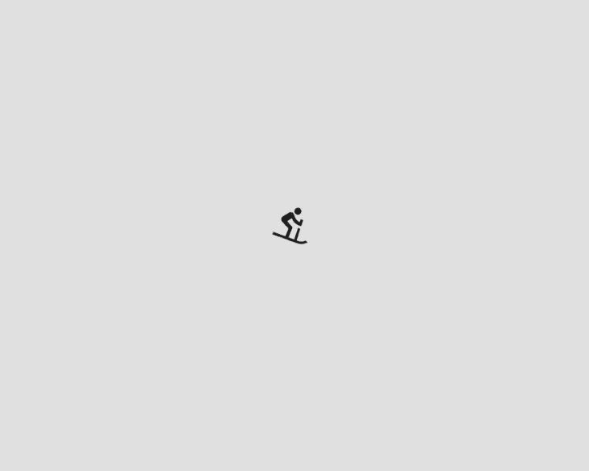

Default box without any shadow.

`BoxDecoration`小部件有一个`boxShadow`属性，它需要一个`BoxShadow`列表。

```
...
Scaffold(
  backgroundColor: Colors.grey.shade300,
  body: Center(
    child: Container(
      height: 100,
      width: 150,
      child: const Icon(Icons.downhill_skiing),
      decoration: BoxDecoration(
        color: Colors.grey.shade300,
        boxShadow: [],
      ),
    ),
  ),
)

```

### 添加颜色

首先让我们在列表中添加一个`BoxShadow`:

```
 BoxDecoration(
  color: Colors.grey.shade300, // this is the container's color
  boxShadow: [
    BoxShadow(), // no shadow color set, defaults to black
  ]
)

```

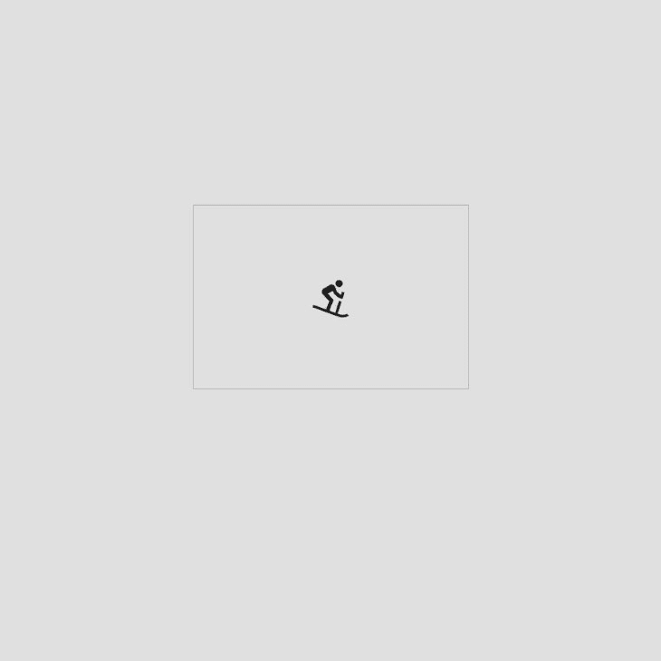

Box with default box shadow color.

在`Container`下面增加了`BoxShadow`。为了说明这一点，我们给我们的`Container`一个透明的颜色。在此示例中，阴影以默认颜色(黑色)绘制在我们的盒子形状中，如下所示:

```
 BoxDecoration(
  color: Colors.transparent,
  boxShadow: [
    BoxShadow(), // no shadow color set, defaults to black
  ]
)

```


Transparent box with default shadow color.

为了给阴影添加颜色，我们将使用`color`属性。我们将在应用程序中添加灰色阴影。

```
color: Colors.grey.shade600

```

### 添加扩散半径

默认的`spreadRadius`是零。正值增加阴影的大小，负值减小阴影的大小。

我们给我们的`Container`一个 1 的`spreadRadius`，如下所示:

```
boxShadow: [
  BoxShadow(
    color: Colors.grey.shade600,
    spreadRadius: 1,
  )
]

```

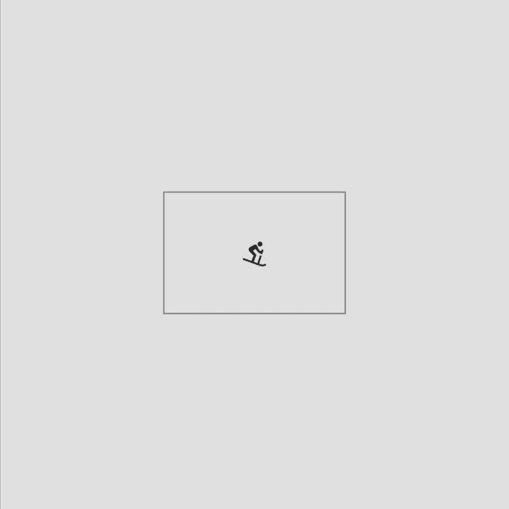

Box with a spread radius of one.

### 添加模糊半径

默认的`blurRadius`是零，这会产生一个清晰的阴影。它只接受正值。半径值越高，阴影就越模糊，阴影就越向外扩散。

我们会给我们的`Container`一个 15 的`blurRadius`。

```
boxShadow: [
  BoxShadow(
    color: Colors.grey.shade600,
    spreadRadius: 1,
    blurRadius: 15
  )
]

```

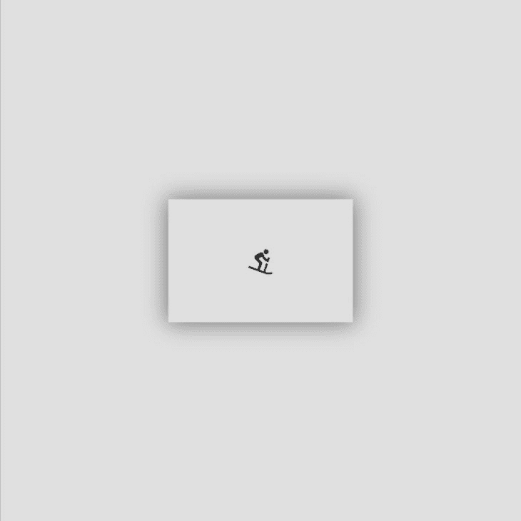

Box with blur radius of 15.

### 添加模糊样式

为了改变模糊的样式，我们更新了`blurStyle`属性。该属性接受一个基于所选值绘制阴影的`BlurStyle`枚举。

可用的样式包括:

*   `BlurStyle.normal`:画一个模糊的东西，看起来内部和外部都很模糊；这是默认的`BlurStyle`

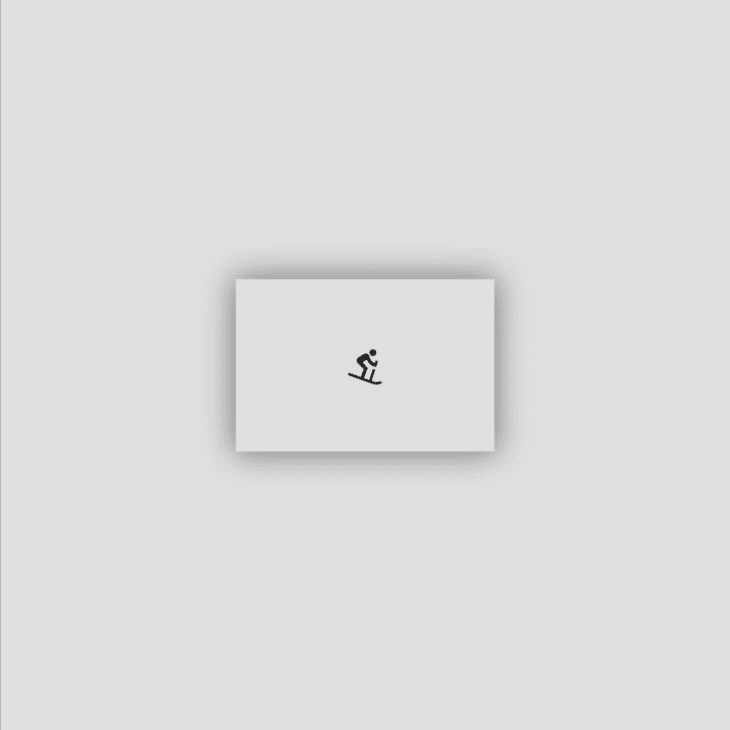

Box with normal blur style.

在本教程中，我们将使用默认的模糊样式`BlurStyle.normal`。

### 添加偏移

为了添加偏移量，我们使用了接受`x`和`y`值的`Offset`类:`Offset(dx, dy)`。它接受负值和正值。默认偏移量是`Offset.zero`。

要水平偏移阴影，需改变`dx`值。正偏移量将阴影移动到框的右侧，而负偏移量将阴影移动到框的左侧。

要垂直偏移阴影，需改变`dy`值。负偏移将阴影移动到框的上方，而正偏移将阴影移动到框的下方。

如果`dx`和`dy`偏移值都设置为零，则阴影在框后居中。

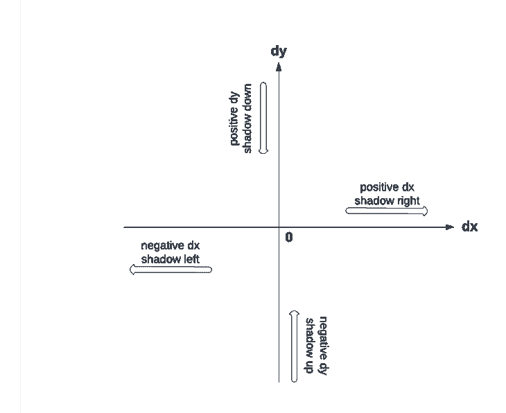

Offset illustration.

我们将给我们的容器一个 0 的`dx`偏移量和一个 15 的`dy`偏移量。这将使我们的影子下移。

```
boxShadow: [
  BoxShadow(
    color: Colors.grey.shade600,
    spreadRadius: 1,
    blurRadius: 15,
    offset: const Offset(0, 15)
  )
]

```

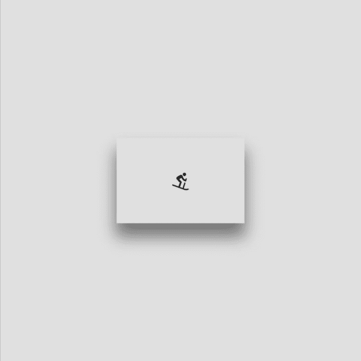

Box with a vertical offset of 15.

要缩放阴影，我们可以使用`scale`方法。此方法返回一个新的方框阴影，其偏移量、模糊半径和扩展半径按给定的因子缩放。

```
boxShadow: [
  BoxShadow(
    color: Colors.grey.shade600,
    spreadRadius: 1,
    blurRadius: 15,
    offset: const Offset(0, 15),
  ).scale(4)
]

```

现在我们已经了解了如何使用各种`BoxShadow`属性，我们可以增强我们的 Flutter 应用程序元素的样式。

## 将`BoxShadow`应用到容器的一侧

`BoxDecoration`的`boxShadow`属性接受一个阴影列表。此列表可用于将阴影移动到所需的框边。

要将阴影仅应用于盒子的一侧，我们需要移动或隐藏所有剩余侧的阴影。这可以通过添加具有不同偏移的阴影列表来实现。

我们可以使用以下步骤在`Container`的底部添加一个方框阴影:

**第一步**:隐藏顶部阴影

为了隐藏顶部阴影，我们需要将`dy`偏移值设置为大于模糊半径的正数。这将向下移动阴影，将其隐藏在`Container`后面。

```
boxShadow: [
  BoxShadow(
    color: Colors.grey.shade600,
    spreadRadius: 1,
    blurRadius: 5,
    offset: const Offset(0, 5),
  )
]

```

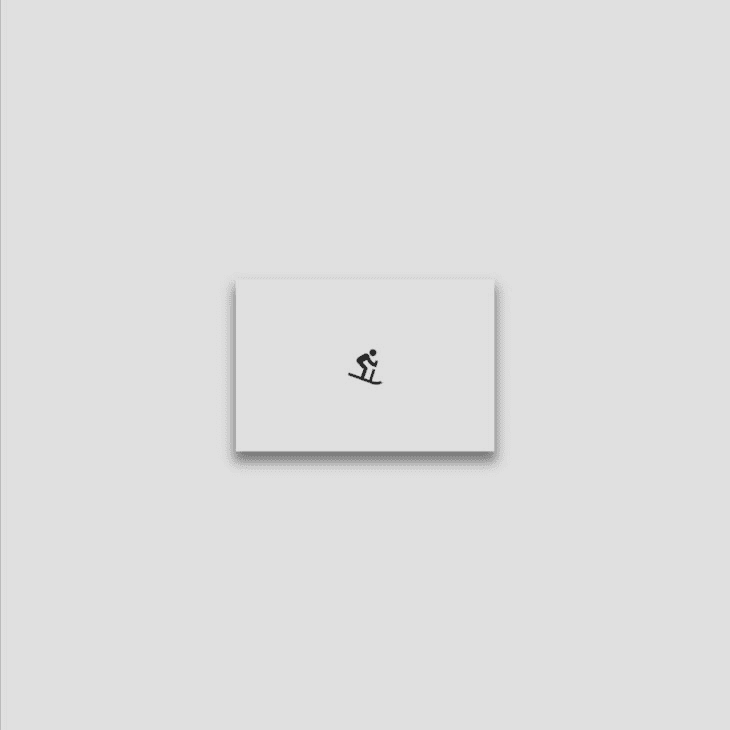

Box with top shadow hidden.

**第二步**:隐藏左侧阴影

如果我们添加一个新的`BoxShadow`到我们的列表中，我们可以使用它的偏移量来隐藏左边的阴影。这个新的阴影需要和我们的`Container`一样的颜色。

此外，我们需要将`dx`值设置为负值，大于或等于第一个阴影的模糊半径。这会将新阴影向左移动，隐藏初始的左阴影。

```
boxShadow: [
  BoxShadow(
    color: Colors.grey.shade600,
    spreadRadius: 1,
    blurRadius: 5,
    offset: const Offset(0, 5),
  ),
  BoxShadow(
    color: Colors.grey.shade300,
    offset: const Offset(-5,0),
  )
]

```

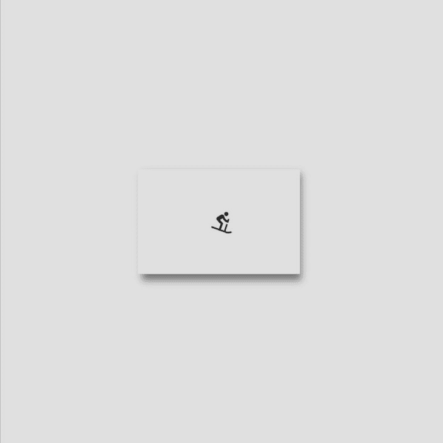

Box with top and left shadow hidden.

**第三步**:隐藏右边阴影

如果我们添加一个新的`BoxShadow`到我们的列表中，我们可以使用它的偏移量来隐藏右边的阴影。就像步骤 2 的过程一样，这个新的阴影需要和我们的`Container`有相同的颜色。

我们需要将`dx`值设置为大于或等于第一个阴影模糊半径的正值。这会将新阴影向右移动，隐藏初始的右侧阴影。

```
boxShadow: [
  BoxShadow(
    color: Colors.grey.shade600,
    spreadRadius: 1,
    blurRadius: 5,
    offset: const Offset(0, 5),
  ),
  BoxShadow(
    color: Colors.grey.shade300,
    offset: const Offset(-5,0),
  ),
  BoxShadow(
    color: Colors.grey.shade300,
    offset: const Offset(5,0),
  )
] 

```

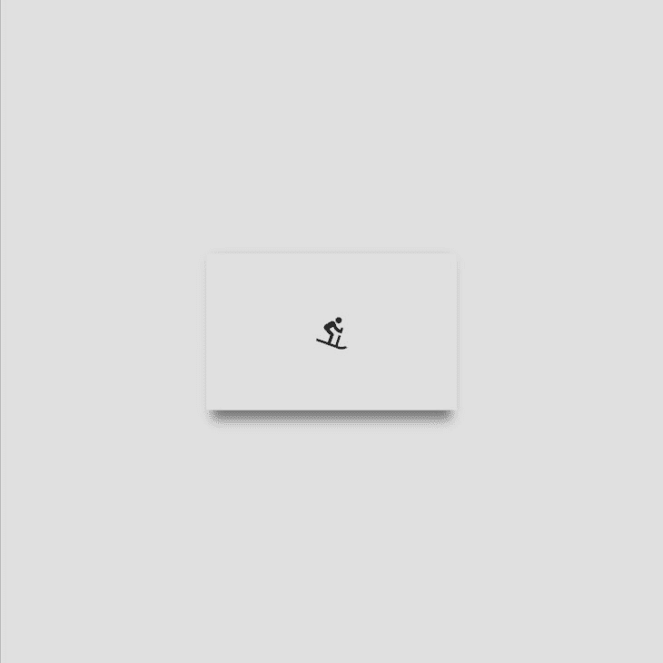

Box with bottom shadow only.

通过这三个步骤，我们已经成功地在视觉上展示了`Container`底部的阴影。

## 为内部阴影效果应用`BoxShadow`

我们可以通过调整阴影和添加线性渐变来给`Container`应用内部阴影。

这是一个两步过程。

**第一步**:添加两种不同颜色的阴影

对于本例，我们将添加两个阴影，一个白色和一个灰色，并使它们彼此相反地偏移:

```
boxShadow: [
  BoxShadow(
    color: Colors.grey.shade600,
    spreadRadius: 1,
    blurRadius: 15,
    offset: const Offset(5, 5),
  ),
  const BoxShadow(
    color: Colors.white,
    offset: Offset(-5,-5),
    blurRadius: 15,
    spreadRadius: 1
  ) ,
],

```

**第二步:**添加线性渐变

我们将使用`BoxDecoration`的`gradient`属性创建一个线性渐变:

```
BoxDecoration(
...
  boxShadow: [
    BoxShadow(
      color: Colors.grey.shade600,
      spreadRadius: 1,
      blurRadius: 15,
      offset: const Offset(5, 5),
    ),
    const BoxShadow(
      color: Colors.white,
      offset: Offset(-5,-5),
      blurRadius: 15,
      spreadRadius: 1
    ) ,
  ],
  gradient: LinearGradient(
    begin: Alignment.topLeft,
    end: Alignment.bottomRight,
    colors: [
      Colors.grey.shade200,
      Colors.grey.shade300,
      Colors.grey.shade400,
      Colors.grey.shade500,
    ],
  ),
)

```

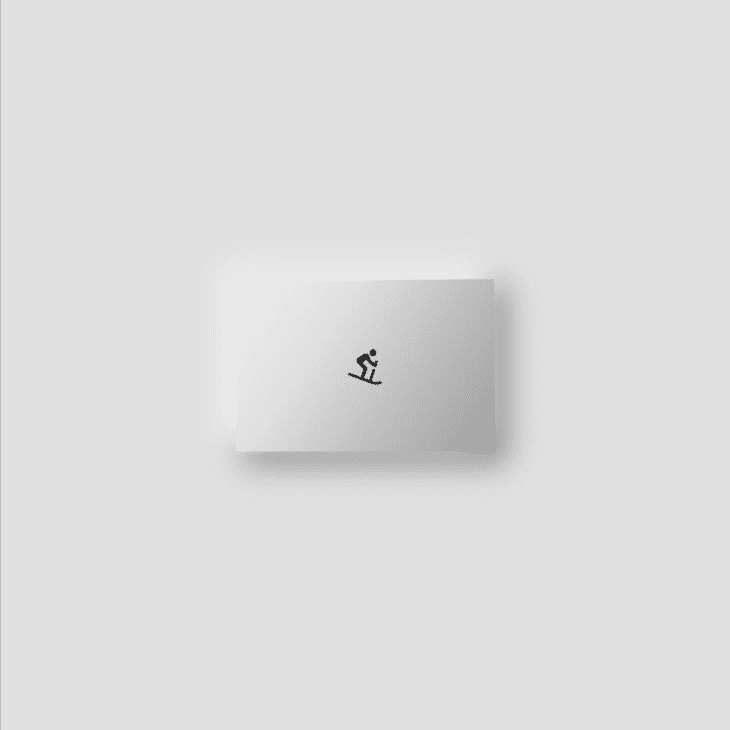

Rectangular box with inner shadow effect.

当形状改变时，阴影呈现`Container`的形状。

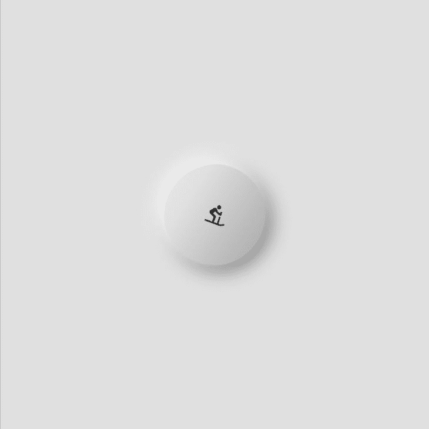

Circular box with inner shadow effect.

## 结论

在本教程中，我们介绍了如何在 Flutter 应用程序中对容器应用框阴影。我们展示了如何调整阴影的颜色、扩散半径、模糊半径、模糊样式和偏移。我们还演示了如何仅在容器的一侧添加阴影，以及如何创建内部阴影效果。

本文中的所有代码都可以在 [GitHub](https://github.com/Ivy-Walobwa/flutter_box_shadow) 上获得。我希望你喜欢这个教程！

## 使用 [LogRocket](https://lp.logrocket.com/blg/signup) 消除传统错误报告的干扰

[](https://lp.logrocket.com/blg/signup)

[LogRocket](https://lp.logrocket.com/blg/signup) 是一个数字体验分析解决方案，它可以保护您免受数百个假阳性错误警报的影响，只针对几个真正重要的项目。LogRocket 会告诉您应用程序中实际影响用户的最具影响力的 bug 和 UX 问题。

然后，使用具有深层技术遥测的会话重放来确切地查看用户看到了什么以及是什么导致了问题，就像你在他们身后看一样。

LogRocket 自动聚合客户端错误、JS 异常、前端性能指标和用户交互。然后 LogRocket 使用机器学习来告诉你哪些问题正在影响大多数用户，并提供你需要修复它的上下文。

关注重要的 bug—[今天就试试 LogRocket】。](https://lp.logrocket.com/blg/signup-issue-free)