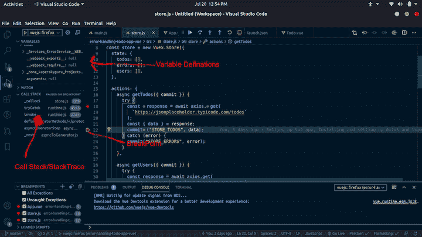

# Vue.js - LogRocket 博客中的错误处理、调试和跟踪

> 原文：<https://blog.logrocket.com/error-handling-debugging-and-tracing-in-vue-js/>

在软件开发中，事情并不像用户看到的那样顺利。总有一些错误和 bug 是开发人员必须在幕后处理的。正如您可能想象的那样，调试和错误跟踪可能非常耗时，而您使用的工具可以极大地提高工作效率。

如果你正在使用 Vue.js，你肯定会遇到各种类型的错误，并且通常有不止一种方法来处理它们。在本教程中，我们将回顾一些最佳实践，并演示如何在 Vue.js 中有效地处理错误、设置调试器和跟踪错误。

我们将使用 [Vue CLI](https://cli.vuejs.org/) 来设置我们的演示项目，这是一个显示来自[占位符 API 的项目列表的待办事项应用程序。](https://jsonplaceholder.typicode.com/)

这个项目的完整代码可以在 GitHub 上找到。

## 什么是错误处理？

错误处理是指在不对用户体验产生负面影响的情况下跟踪、处理和解决应用程序错误的过程。它旨在实现三个目标:

1.  当出现未处理的异常时，防止应用程序在生产中意外中断
2.  发现记录错误时发生了什么
3.  改善用户体验(例如，通过在发现并修复错误时显示消息)

## 什么是调试？

调试是识别和消除错误并解决软件中的 bug 的过程。它包括分析问题，找出问题的根源，确定原因，并尽可能高效地制定解决方案。

## 在 Vue.js 中调试

Vue.js 提供了一个调试器，可以帮助您处理错误并快速解决应用程序中的 bug。VueJs 调试器与 VSCode 以及 Chrome 和 Firefox 都很好地集成在一起。

首先，下载并安装用于 [Chrome](https://marketplace.visualstudio.com/items?itemName=msjsdiag.debugger-for-chrome) 或 [Firefox](https://marketplace.visualstudio.com/items?itemName=firefox-devtools.vscode-firefox-debug) 的 Vue 调试器扩展。你可以在 [Vue.js 文档](https://vuejs.org/v2/cookbook/debugging-in-vscode.html)中阅读更多关于如何配置它的信息。

安装调试器后，转到 VSCode 活动栏并单击调试图标。你会看到一个齿轮/设置图标。单击它并选择您喜欢的浏览器。

接下来，打开`launch.json`文件，并根据您选择的浏览器粘贴相应的配置。

设置完成后，跟踪错误就像在应用程序中设置几个断点并运行刚刚安装的调试器一样简单。

## 什么是追踪？

跟踪是在堆栈跟踪中搜索错误来源并确定原因的过程。

正如您可能已经猜到的，Vue Debugger 也使跟踪变得更加容易。

### 设置断点

在实现有效的跟踪之前，您需要学习如何设置断点。

双击 VSCode 中的行号添加断点。然后，运行`npm run serve`为您的项目服务。转到编辑器中的 debug 视图，选择您喜欢的浏览器配置。按 5 或单击绿色的播放按钮。此时，您的断点应该在代码执行时命中。

如果查看 debug 视图，您可以发现一些用于调试应用程序的有用数据。



## 处理 Vue.js 中的错误

在 Vue.js 应用程序中处理错误可能很复杂。最好的方法是把它分成几个步骤。

在我开发的任何应用程序中，我总是制定一个处理错误的计划，通常是通过创建一个通用的`ErrorService`类，并根据错误的类型包含处理和处理错误的函数。

### 错误类型

在 Vue.js 应用程序中，您可能会遇到四种主要类型的错误:

1.  **语法** **错误**发生在你使用错误语法的时候
2.  **运行时** **错误**是执行过程中非法操作造成的
3.  逻辑 **错误**很难识别，因为它们是由程序逻辑中的错误造成的
4.  使用 API 时，HTTP 错误很常见

现在，让我们放大一些具体的错误处理和调试活动的例子，您可以使用 Vue 调试器执行这些活动。

## 在 Vue.js 中创建一个错误服务

`ErrorService`类将处理你所有的错误，并决定如何处理它们。

```
import Swal from "sweetalert2";
import "sweetalert2/dist/sweetalert2.min.css";

export default class ErrorService {
  constructor() {
    // this.initHandler();
  }

  static onError(error) {
    const response = error.response;
    if (response && response.status >= 400 && response.status < 405) {
      // You can handle this differently
      ErrorService.sentryLogEngine(error);
      return false;
    }
    // Send Error to Log Engine e.g LogRocket
    ErrorService.logRocketLogEngine(error);
  }

  static onWarn(error) {
    // Send Error to Log Engine e.g LogRocket
    this.logRocketLogEngine(error);
  }

  static onInfo(error) {
    // You can handle this differently
    this.sentryLogEngine(error);
  }

  static onDebug(error) {
    const response = error.response;
    if (response && response.status >= 400 && response.status < 405) {
      // You can handle this differently
      this.sentryLogEngine(error);
      return false;
    }
    // Send Error to Log Engine e.g LogRocket
    this.logRocketLogEngine(error);
  }

  static initHandler() {
    const scope = this;
    window.onerror = (message, url, lineNo, columnNo, error) => {
      console.log(error, "test");
      if (error) {
        scope.onError(error);
        console.log(message, url, lineNo, columnNo, error);
      }
    };
  }

  static displayErrorAlert(message) {
    Swal.fire({
      title: "Error!",
      text: message,
      icon: "error",
    });
  }

  static logRocketLogEngine(error) {
    // Implement LogRocket Engine here
    console.log(error, "LogRocket");
  }

  static sentryLogEngine(error) {
    // Implement Sentry Engine here
    console.log(error, "Sentry");
  }
}

```

## 捕捉所有可能的 Vue 错误

js 提供了一个错误处理器来捕捉所有可能的 Vue 错误。您可以在`main.js`文件中这样做。

```
import Vue from "vue";
import App from "./App.vue";
import { ErrorService } from "./Services/ErrorService";
import store from "./store";

Vue.config.productionTip = false;

// Handle all Vue errors
Vue.config.errorHandler = (error) => ErrorService.onError(error);

new Vue({
  store,
  render: (h) => h(App),
}).$mount("#app");

```

## `ErrorService`在 Vuex 中

在 Vuex 中使用`ErrorService`类是处理来自 Axios 的 HTTP 错误的好方法。您还可以将错误存储在 Vuex 状态中，这样它们就可以优雅地显示给用户。

```
import Vue from "vue";
import Vuex from "vuex";
import { ErrorService } from "./Services/ErrorService";
import axios from "axios";

Vue.use(Vuex);

const store = new Vuex.Store({
  state: {
    todos: [],
    errors: [],
    users: [],
  },

  actions: {
    async getTodos({ commit }) {
      try {
        const response = await axios.get(
          `https://jsonplaceholder.typicode.com/todos`
        );
        const { data } = response;
        commit("STORE_TODOS", data);
      } catch (error) {
        // Handling HTTPs Errors
        commit("STORE_ERRORS", error);
      }
    },

    async getUsers({ commit }) {
      try {
        const response = await axios.get(
          `https://jsonplaceholder.typicode.com/users`
        );
        const { data } = response;
        commit("STORE_USERS", data);
      } catch (error) {
        // Handling HTTPs Errors
        commit("STORE_ERRORS", error);
      }
    },
  },

  mutations: {
    STORE_TODOS: (state, data) => {
      state.todos = data;
    },

    STORE_ERRORS: (state, error) => {
      // Call Error Service here
      ErrorService.onError(error);
      ErrorService.initHandler();

      // Store error to state(optional)
      if (error.response) {
        state.errors = error.response;
      }
    },

    STORE_USERS: (state, data) => {
      state.users = data;
    },
  },

  getters: {
    getTodo: (state) => (id) => {
      return state.todos.find((todo) => todo.id == id);
    },
    getUser: (state) => (id) => {
      return state.users.find((user) => user.id == id);
    },
  },

  // strict: true
});

export default store;

```

## 显示组件中的错误

由于错误保存在 Vuex 状态，这使我们能够利用 Vue 的反应能力，我们可以在错误组件上显示它们，如下所示:

```
<script>
import { mapGetters } from "vuex";
import ErrorService from "../Services/ErrorService";

export default {
  name: "HelloWorld",
  props: {
    todo: Object,
  },
  computed: {
    ...mapGetters(["getUser"]),
  },

  methods: {
    getUserName(id) {
      const user = this.getUser(id);
      if (user) return user.username;
    },

    // Handling Errors in component
    methodThrowsException() {
      try {
        // Do unexpected job
      } catch (error) {
        ErrorService.onError(error);
      }
    },
  },
};
</script>

```

## 在 Vue.js 中显示插件错误

您可以用不同的方式向用户显示这些错误。我们将使用 [vue-sweetalert2](https://www.npmjs.com/package/vue-sweetalert2) 插件来显示我们的错误。

```
<script>
import { mapGetters } from "vuex";
import ErrorService from "../Services/ErrorService";

export default {
  name: "HelloWorld",
  props: {
    todo: Object,
  },
  computed: {
    ...mapGetters(["getUser"]),
  },

  methods: {
    getUserName(id) {
      const user = this.getUser(id);
      if (user) return user.username;
    },

    // Display Error with SweetAlert (when Name is Click)
    displayAlert() {
      ErrorService.displayErrorAlert("Testing message");
    },
  },
};
</script>

```

## 结论

高效处理应用程序中的错误和解决 bug 的能力至关重要。如果你想最大限度地提高工作效率，选择正确的工具和方法来调试你的 Vue.js 应用程序会有很大的不同。

希望本演练能让您对 VueJS 中的错误管理、调试和跟踪有一个坚实的基础理解。

## 像用户一样体验您的 Vue 应用

调试 Vue.js 应用程序可能会很困难，尤其是当用户会话期间有几十个(如果不是几百个)突变时。如果您对监视和跟踪生产中所有用户的 Vue 突变感兴趣，

[try LogRocket](https://lp.logrocket.com/blg/vue-signup)

.

[](https://lp.logrocket.com/blg/vue-signup)[https://logrocket.com/signup/](https://lp.logrocket.com/blg/vue-signup)

LogRocket 就像是网络和移动应用程序的 DVR，记录你的 Vue 应用程序中发生的一切，包括网络请求、JavaScript 错误、性能问题等等。您可以汇总并报告问题发生时应用程序的状态，而不是猜测问题发生的原因。

LogRocket Vuex 插件将 Vuex 突变记录到 LogRocket 控制台，为您提供导致错误的环境，以及出现问题时应用程序的状态。

现代化您调试 Vue 应用的方式- [开始免费监控](https://lp.logrocket.com/blg/vue-signup)。