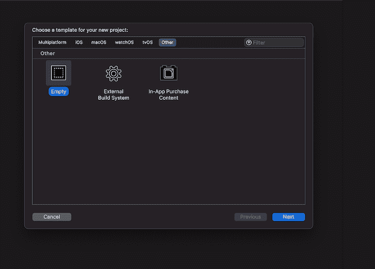
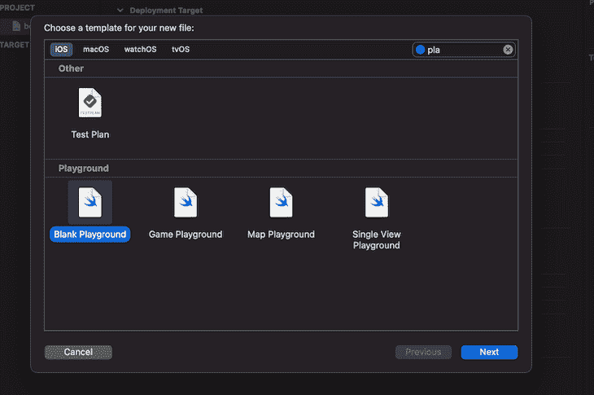
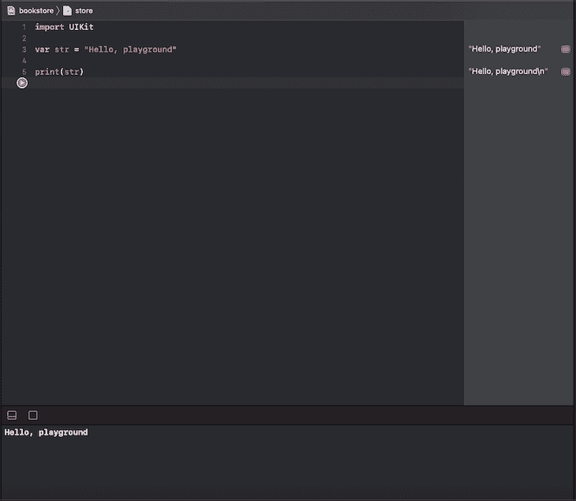
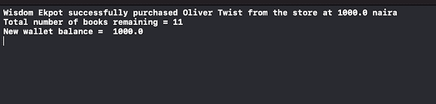
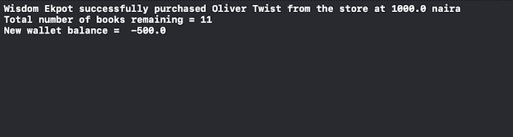
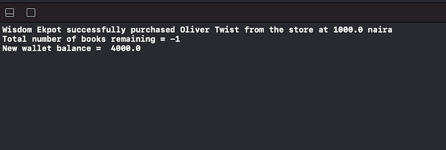
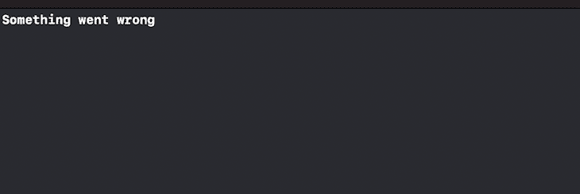

# Swift 中的错误处理

> 原文：<https://blog.logrocket.com/error-handling-in-swift/>

错误处理对于每个应用的成功至关重要，确保最终用户可以轻松浏览应用并正确使用功能。

在本教程中，我们将学习如何在使用 Swift 构建的简单书店应用程序中检测和解决错误，Swift 是由 Apple 和开源社区开发的通用编程语言。

## 先决条件

要开始本教程，请确保您具备以下条件:

## 设置项目

要开始构建我们的书店应用程序，让我们通过打开 Xcode 应用程序并在**其他**选项卡中选择**空**来创建一个空白的 Xcode 游乐场。



接下来，在新创建的目录中创建一个新的 playground 文件，并将其命名为。



文件中应该有默认代码；将其修改为下面的代码，并单击**播放**按钮以确保代码正在运行:

```
import UIKit

var str = "Hello, playground"

print(str)

```

运行这个应用程序会在控制台上打印出`Hello, playground`。



所有这些完成后，我们准备开始建设。

## 使用 Swift 构建应用程序

因为我们正在构建一个简单的书店应用程序，所以我们必须创建两个类:一个用于购买书籍的用户，另一个用于购买的商品。

`User`类包含用户的姓名和可用余额，而`Item`类包含图书名称、图书价格和书店中剩余图书的数量:

```
class User {
    var name: String
    var walletBalance: Double

    init(name: String, walletBalance: Double) {
        self.name = name
        self.walletBalance = walletBalance
    }
}

class Item {
    var bookName: String
    var price: Double
    var qtyLeft: Int

    init(bookName: String, price: Double, qtyLeft: Int){
        self.bookName = bookName
        self.price = price
        self.qtyLeft = qtyLeft
    }
}

```

在我们的例子中，一个用户有一个特定的钱包余额来从商店购买一本书。为了确保这可以在我们的应用程序中完成，我们必须创建一个默认用户和预订:

```
let user1 = User(name: "Wisdom Ekpot", walletBalance: 2000)
let storeItem = Item(bookName: "Oliver Twist", price: 1000, qtyLeft: 12)

```

接下来，让我们创建一个允许用户从书店购买一本书的函数:

```
func purchaseBookFromStore (user: User, book: Item){
    user.walletBalance -= book.price
    book.qtyLeft -= 1

    print("\(user.name) successfully purchased \(book.bookName) from the store at \(book.price) naira")
    print("Total number of books remaining = \(book.qtyLeft)")
    print("New wallet balance =  \(user.walletBalance)")
}

```

该函数将`User`类和`Item`类作为参数。然后，该功能从用户的钱包余额中扣除图书价格，并减少可购买的`Oliver Twist`图书的数量。

减少这两个数量后，该函数打印出剩余的图书数量和用户的钱包余额。要运行程序，我们必须调用函数名，并将`User`和`Item`类作为参数传递:

```
purchaseBookFromStore(user: user1, book: Item)

```

点击**播放**按钮运行应用程序。一旦程序完成编译，控制台上将显示以下内容:



## Swift 应用中的错误测试案例

这种应用中可能会出现两个我们没有考虑到的主要问题:

1.  用户钱包余额买不起店里的一本书怎么办？
2.  如果商店中的图书数量少于用户想要购买的数量怎么办？

让我们分别用这些测试用例来测试我们当前的代码。

### 价格误差

如果我们用`let user1 = User(name: "Wisdom Ekpot", walletBalance: 500)`将用户的钱包余额设置为 500 美元，然后用`let storeItem = Item(bookName: "Oliver Twist", price: 1000, qtyLeft: 12)`尝试购买 1000 美元的`Oliver` `Twist`书籍副本，控制台上会显示以下内容:



用户新的钱包余额现在是`-500.0`，这是一个错误。当用户的钱包余额小于图书价格时，我们必须打印一条错误消息，而不是从用户的钱包中扣除图书总价格。

### 数量误差

我们在购物应用中可能遇到的另一个测试案例是，商店中的图书数量少于用户所需的图书数量。

如果我们用`let storeItem = Item(bookName: "Oliver Twist", price: 1000, qtyLeft: 0)`将商店中`Oliver Twist`本书的数量设置为 0，然后调用`purchaseBookFromStore`函数购买`1`本书，控制台打印如下:



我们可以看到，现在店里的图书总数是`-1`。同样，在这里打印一条错误消息会让用户知道书店中的图书数量少于所需数量。

处理 Swift 应用程序中的错误

为了修复这些错误情况，我们写一个条件来检查用户是否买得起这本书，以及可用的书的数量是否小于用户所需的数量。如果用户买不起书或者书的数量不够，我们可以抛出一个错误。

在`purchaseBookFromStore`功能块中，在执行任何操作之前添加该条件:

```
if user.walletBalance < book.price || book.qtyLeft <= 0 {
        throw NSError()
}

```

此时，如果满足条件，就会抛出一个错误，并且条件下的代码不会执行。

我们还必须确保这个函数有抛出错误的能力。为此，我们必须用以下代码修改我们的`purchaseBookFromStore`函数:

```
func purchaseBookFromStore (user: User, book: Item) throws {

    if user.walletBalance < book.price || book.qtyLeft <= 0 {
        throw NSError()
    }
    user.walletBalance -= book.price
    book.qtyLeft -= 1

    print("\(user.name) successfully purchased \(book.bookName) from the store at \(book.price) naira")
    print("Total number of books remaining = \(book.qtyLeft)")
    print("New wallet balance =  \(user.walletBalance)")
}

```

注意花括号前的`throws`关键字；这修改了我们调用函数的方式，并表明它会抛出一个错误。

接下来，我们必须在 do-catch 块中包装我们的`purchaseBookFromStore`函数。如果该函数返回一个错误，`catch`块捕获该错误并在控制台上打印出来:

```
do{
    try purchaseBookFromStore(user: user1, book: storeItem)
}catch {
    print("something went wrong")
}

```

如果我们再次运行我们的应用程序，我们会在控制台上看到以下内容。记住使用我们前面提到的任何错误测试用例来获得控制台上的错误消息。



### 抛出定义的错误

对于我们应用程序的当前状态，函数不会抛出适当的错误来告诉我们哪里出错了。为此，我们必须使用一个符合内置 Swift 错误类的 [Swift 枚举来定义我们想要抛出的自定义错误。](https://blog.logrocket.com/swift-enums-an-overview-with-examples/)

Swift 枚举特别适合对一组相关的错误条件进行建模，因为它对相关的值进行分组，并使我们能够在代码中以类型安全的方式处理这些值:

```
enum PurchaseError: Error {
    case InsufficentWalletBalance
    case InsufficentBookQty
}

```

定义了这个枚举后，我们必须将`purchaseBookFromStore`函数中的条件分解成两个独立的条件，如下所示:

```
  if user.walletBalance < book.price{

    }

    if  book.qtyLeft <= 0 {

    }

```

现在，如果用户的钱包余额不足，我们的情况如下:

```
 if user.walletBalance < book.price{
        throw PurchaseError.InsufficentWalletBalance
    }

```

如果与用户想要购买的书籍数量相比，商店中的书籍数量较少，我们的情况如下:

```
 if  book.qtyLeft <= 0 {
        throw PurchaseError.InsufficentBookQty
  }

```

最后，我们现在可以像这样捕捉个别错误:

```
do{
    try purchaseBookFromStore(user: user1, book: storeItem)
}catch PurchaseError.InsufficentWalletBalance {
    print("You don't have sufficent funds to carry out this transaction")
}catch PurchaseError.InsufficentBookQty{
    print("Insufficent item quantity")
}catch{
    print("Something went wrong")
}

```

当抛出未定义的错误时，最后一个 catch 块充当默认 catch 块。

## 结论

处理错误和显示自定义错误对于任何成功的应用程序都是必不可少的。通过定义错误并利用 Swift 中的 do-catch 功能，我们可以了解错误发生的原因并更快地解决问题。你可以在 GitHub 上获得这个项目的[完整源代码。](https://github.com/Wisdom132/swift-error)

## 使用 [LogRocket](https://lp.logrocket.com/blg/signup) 消除传统错误报告的干扰

[](https://lp.logrocket.com/blg/signup)

[LogRocket](https://lp.logrocket.com/blg/signup) 是一个数字体验分析解决方案，它可以保护您免受数百个假阳性错误警报的影响，只针对几个真正重要的项目。LogRocket 会告诉您应用程序中实际影响用户的最具影响力的 bug 和 UX 问题。

然后，使用具有深层技术遥测的会话重放来确切地查看用户看到了什么以及是什么导致了问题，就像你在他们身后看一样。

LogRocket 自动聚合客户端错误、JS 异常、前端性能指标和用户交互。然后 LogRocket 使用机器学习来告诉你哪些问题正在影响大多数用户，并提供你需要修复它的上下文。

关注重要的 bug—[今天就试试 LogRocket】。](https://lp.logrocket.com/blg/signup-issue-free)