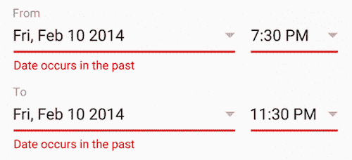
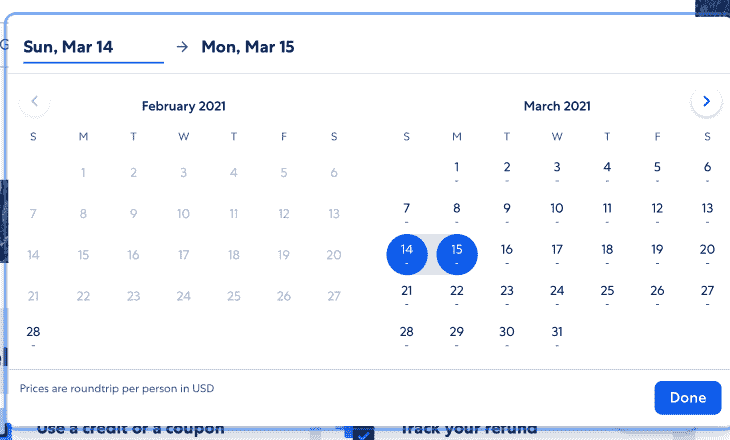
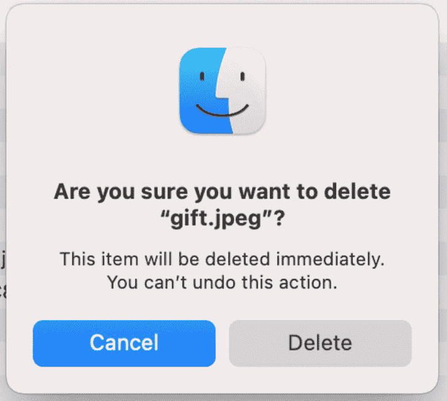
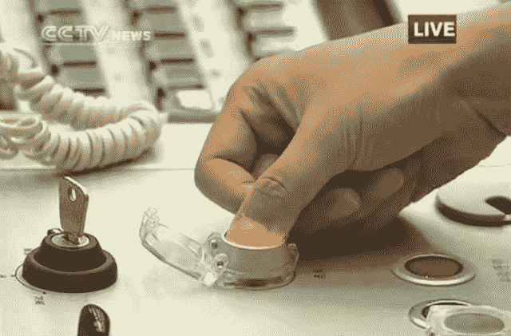
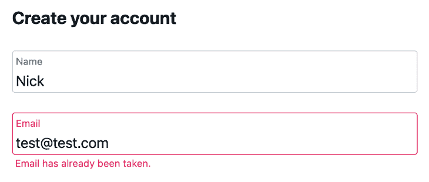
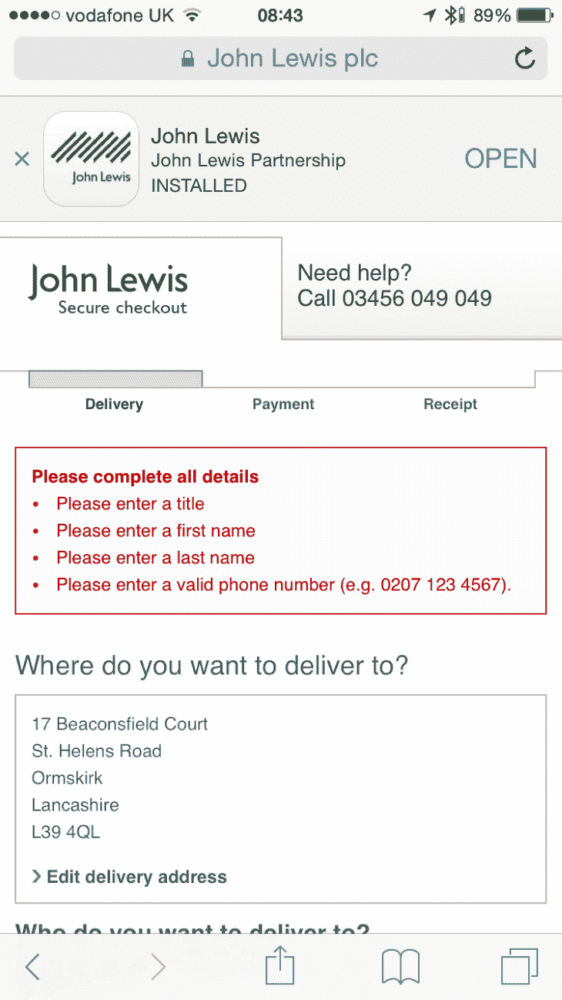
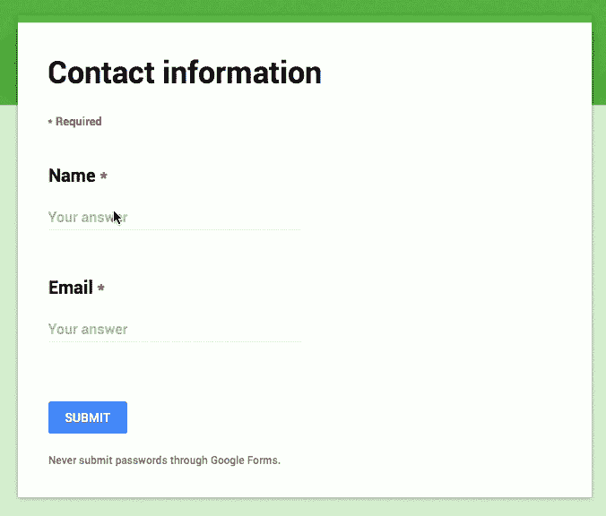
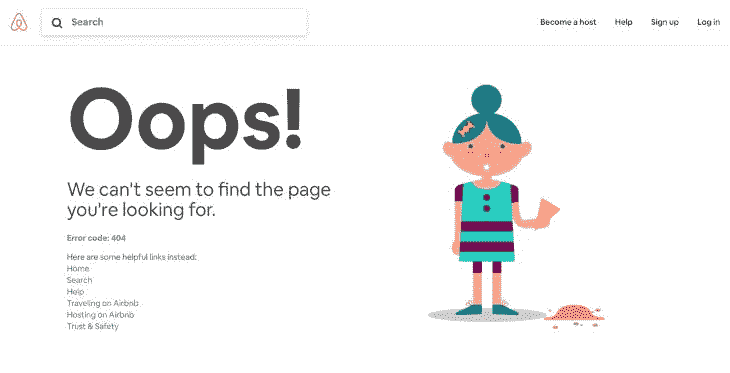

# web 开发中的错误预防

> 原文：<https://blog.logrocket.com/error-prevention-in-web-development/>

犯错是人之常情。我们都会犯错误，当涉及到数字设计时，用户在与你的产品交互时可能会遇到错误。但是系统如何处理这些情况会对用户的体验产生巨大的影响。

在这篇文章中，我们将回顾一些实用的技巧，帮助你设计网站的错误状态。

## 如何最大限度地减少开发过程中的错误

每一个错误，不管其根本原因是什么，都会成为你的访问者的摩擦点。这阻碍了他们朝着目标前进。访问者必须停下来，投入时间和精力来解决他们面临的问题。有经验的设计师知道，防止错误总是比纠正错误好。这就是为什么最好的错误消息是永远不会出现的。

### 预见可能的错误

分析用户如何与你的网站互动，并找出他们可能面临的错误。建议从高级分析开始——分析用户流，以确定用户可能面临麻烦的领域。

通常，当用户进行不兼容的操作(如提供无效的数据输入)或由于技术问题(各种网络问题)时，就会出现错误。例如，通常很难在第一次尝试时正确无误地填写长表格。您应该将这些情况考虑在内，以尽量减少出错的机会。

收集真实用户行为的信息(用户如何与你的产品互动)也很重要。使用亲自观察和分析的方法:

*   亲自观察。进行[情境调查](https://www.nngroup.com/articles/contextual-inquiry/)并观察用户如何在他们的自然环境中与你的产品互动。
*   使用分析来确定用户面临摩擦的领域。例如，如果您想要优化 web 体验，您可能想要跟踪任务的平均时间(用户在您的任务上花费的总持续时间)并将其与预期时间进行比较。

### 写清楚说明

清晰度是数字设计的重中之重。你提供给用户的说明应该帮助他们理解在每个给定的时间里他们需要做什么。说明在第一次体验时尤其重要，因为当用户只知道如何使用一个产品时，他们可能会面临很多问题。

写说明书时，你应该避免使用行话。去掉技术术语，用用户的词汇表达一切。并且总是和你的用户一起测试你的指令。对你的目标受众进行一系列的可用性测试，以确保用户明白在每种给定的情况下他们需要做什么。

### 支持撤销/重做操作

雅各布·尼尔森[称](https://www.nngroup.com/articles/ten-usability-heuristics/)撤销/重做操作为“紧急出口”这个特性允许用户离开一个不想要的状态，而不会对他们的数据产生任何影响，并给用户一个探索的自由。用户在知道自己安全的情况下，更愿意去探索。对于常见操作，始终支持键盘快捷键 Ctrl + Z 和 Ctrl + Y。

## 带示例的错误预防技术

这里有一些技巧可以帮助你避免错误的情况。

### 将约束引入输入

通过利用约束，有可能从一开始就防止用户犯错误。不允许用户键入或选择无效的内容。例如，当您设计机票预订表单时，您不应该允许用户选择过去的日期，因为这没有多大意义。

When you design a date picker, it doesn’t make much sense to allow users to select dates from the past.

使用允许用户只选择今天或未来日期的日期选择器。这个约束将使用户选择一个合适的日期范围。

[Expedia](https://www.expedia.com) doesn’t allow users to select dates from the past.

### 提供良好的默认设置

好的默认值可以最小化交互成本(提供数据所需的用户努力)。例如，可以根据用户的地理位置数据预先选择一些字段，而不是让用户提供关于她/他的地址的信息。

Skyscanner uses the user’s location to autofill the ‘From’ field.

### 给潜在的危险操作增加额外的摩擦

对于任何不可逆的操作，显示一个确认对话框总是一个好主意，比如“您确定要这样做吗？”这种额外的摩擦会让用户停下来想想他们在做什么。它还防止用户意外触发某些操作。

When users see this dialog, they might stop and think, “Is it really what I want to do?”

旁注:你可能会认为设计应该总是支持撤销操作。这是事实，但有时由于业务逻辑限制或操作的性质，无法引入撤销功能。

You can notice that the extra layer of glass protects the rocket ‘Launch’ button from accidental presses. Image credit [telstarlogistics](https://telstarlogistics.typepad.com/telstarlogistics/2010/10/how-to-launch-a-chinese-rocket-to-the-moon.html).

## web 开发中的错误恢复技术

当错误出现时，设计良好的错误处理可以防止用户感到无知。当事情出错时，你可以使用以下技巧:

### 编写有用的错误消息

如何让用户容易地从表单错误中恢复？答案是编写适当的错误消息。

不要写:

*   模糊的错误。我们经常看到类似“哎呀，出问题了”这样的错误。这种错误不包含任何有价值的信息(用户不清楚下一步该做什么)
*   原始误差。原始错误是包含应用程序内部错误代码的错误，如“WGeneralError521 操作无法完成”它们是由开发人员为开发人员编写的，对普通用户帮助不大
*   死胡同错误。死端错误是简单说明问题的错误。一个典型的死胡同错误可能会说，“您的文件无法保存”，而没有告诉用户发生了什么问题(是网络问题吗？是文件本身有问题吗？).用户不应该猜测发生了什么。理想情况下，表单应该陈述一个问题，并分享一些解决问题的技巧

让您的错误消息易于理解并有所帮助:

*   告诉用户哪里出错了，可能的原因是什么
*   解释用户需要做什么来修复错误(当错误不明显时)

The system informs the user that this email is already in use. Image credit: Twitter.

### 对内嵌指令使用动态表单验证

假设您正在填写一个长表单，当您点击**提交**时，您会在表单的顶部看到一长串错误消息。不酷，对吧？

It’s frustrating when you complete a long form and once you’ve pressed submit, you receive multiple error messages at the top of the form that you need to match with your input. Image credit: John Lewis.

用户输入应该在用户提供后立即进行验证。一种叫做内联验证的技术可以帮助你做到这一点。用户不需要点击**提交**按钮来查看错误。

在他的文章“[表单内联验证—设计体验](https://medium.com/wdstack/inline-validation-in-forms-designing-the-experience-123fb34088ce#.fl86493cl)”中，Mihael Konjevi 比较了各种内联验证策略的优缺点，并提出了一个他称之为“早奖励，晚惩罚”的验证策略。

遵循这种方法的应用程序会通知用户操作环境中的错误输入(就在用户停止输入并转到下一个输入部分之后)。

接近度是数据验证的另一个重要元素。将错误消息放在字段旁边，以帮助用户理解状态。

Google Forms informs users that the email isn’t valid when the user finishes typing it. Image credit: [Medium](https://medium.com/wdstack/inline-validation-in-forms-designing-the-experience-123fb34088ce#.fl86493cl).

### 添加一点幽默

精心设计的错误处理可以将失败的时刻转化为喜悦的时刻。幽默是生活的调味品，通过将漂亮的视觉效果与有趣的副本配对，很容易使错误状态人性化。

Airbnb 404 page with a nice injection of humor.

同时，你需要记住幽默是有语境的。一个在一种情况下很有趣的笑话在另一种情况下可能很糟糕。想象一下这样一种情况，当你为一个非常重要的文档努力工作了几个小时，最后决定保存它。当你点击保存按钮时，系统“奖励”你一条错误信息“啊哦，我们无法保存它。不好意思！”这样的信息是完全不合适的。

This is a message that writers see when [Medium](https://medium.com/) can’t save the data.

## 结论

最好的错误消息是永远不会出现的消息。然而，当我们为容易出错的情况设计时，我们的目标是防止用户有压力，并使与产品的交互尽可能愉快。

## 使用 [LogRocket](https://lp.logrocket.com/blg/signup) 消除传统错误报告的干扰

[LogRocket](https://lp.logrocket.com/blg/signup) 是一个数字体验分析解决方案，它可以保护您免受数百个假阳性错误警报的影响，只针对几个真正重要的项目。LogRocket 会告诉您应用程序中实际影响用户的最具影响力的 bug 和 UX 问题。

然后，使用具有深层技术遥测的会话重放来确切地查看用户看到了什么以及是什么导致了问题，就像你在他们身后看一样。

LogRocket 自动聚合客户端错误、JS 异常、前端性能指标和用户交互。然后 LogRocket 使用机器学习来告诉你哪些问题正在影响大多数用户，并提供你需要修复它的上下文。

关注重要的 bug—[今天就试试 LogRocket】。](https://lp.logrocket.com/blg/signup-issue-free)