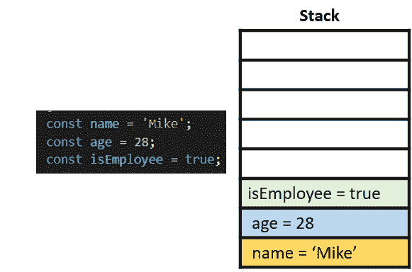
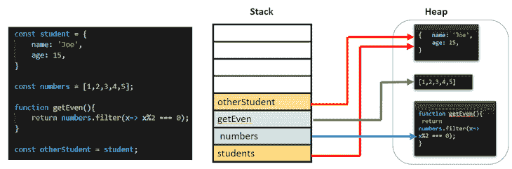
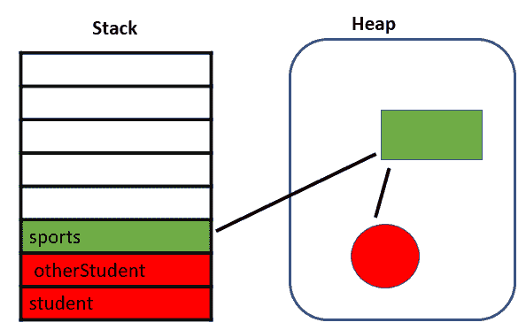
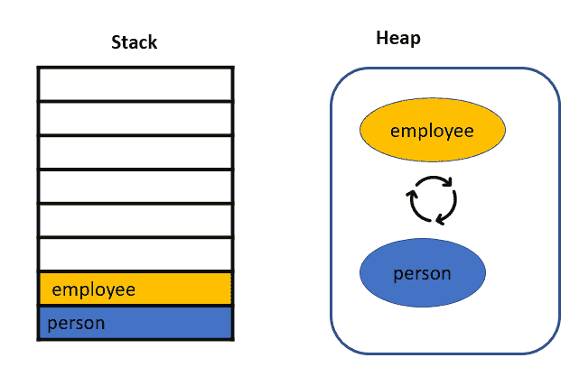
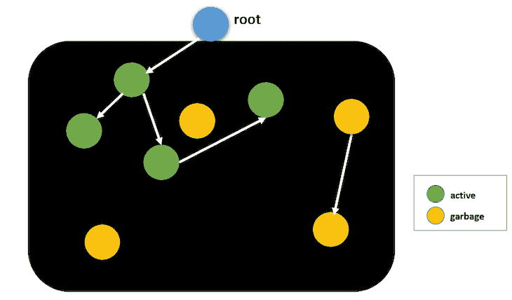
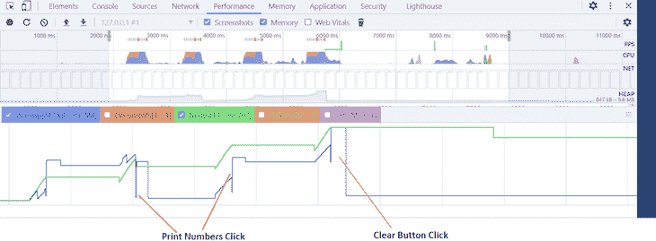
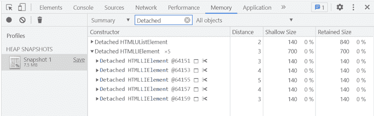

# 如何避免 JavaScript 中的内存泄漏

> 原文：<https://blog.logrocket.com/escape-memory-leaks-javascript/>

如果您的 JavaScript 应用程序经常出现崩溃、高延迟和低性能，一个潜在的原因可能是内存泄漏。由于 JavaScript 引擎对自动内存分配的误解，内存管理经常被开发人员忽视，导致内存泄漏，最终导致性能下降。

在本文中，我们将探索内存管理、内存泄漏的类型，以及使用 Chrome DevTools 在 JavaScript 中寻找内存泄漏。我们开始吧！

## 什么是内存泄漏？

简而言之，内存泄漏是 JavaScript 引擎无法回收的已分配内存。当您在应用程序中创建对象和变量时，JavaScript 引擎会分配内存，当您不再需要这些对象时，它会智能地清除内存。内存泄漏是由逻辑中的缺陷引起的，它们为应用程序的低性能让路。

在进入不同类型的内存泄漏之前，让我们对 JavaScript 中的[内存管理和垃圾收集有一个清晰的了解。](https://blog.logrocket.com/javascript-garbage-collection-browser-vs-server/)

## 内存生命周期

在任何编程语言中，内存生命周期都由三个步骤组成:

1.  **内存分配**:操作系统在程序执行过程中根据需要分配内存给程序
2.  **使用内存**:你的程序使用先前分配的内存。您的程序可以在内存上执行`read`和`write`操作
3.  **释放内存**:一旦你的任务完成，分配的内存被释放，成为空闲。在像 JavaScript 这样的高级语言中，内存释放是由垃圾收集器处理的

如果您理解 JavaScript 中内存分配和释放是如何发生的，那么解决应用程序中的内存泄漏就非常容易了。

## 存储器分配

JavaScript 为内存分配提供了两个存储选项。一个是栈，一个是堆。所有的原始类型，如`number`、`Boolean`或`undefined`都将被存储在堆栈中。堆是对象、数组和函数等引用类型的地方。

### 堆

堆栈遵循 LIFO 方法来分配内存。所有像`number`、`Boolean`、`undefined`这样的原语类型都可以存储在栈下:



### 许多

对象、数组和函数等引用类型存储在堆中。引用类型的大小不能在编译时确定，所以内存是根据对象的使用来分配的。对象的引用存储在堆栈中，而实际对象存储在堆中:



在上图中，`otherStudent`变量是通过复制 student 变量创建的。在这个场景中，`otherStudent`是在堆栈上创建的，但是它指向堆上的 student 引用。

我们已经看到，内存周期中内存分配的主要挑战是何时释放已分配的内存，并使其可用于其他资源。在这种情况下，垃圾收集可以解决问题。

## 垃圾收集工

应用程序中内存泄漏的主要原因是不需要的引用。垃圾收集器找到程序不再使用的内存，并将其释放回操作系统以供进一步分配。

要知道什么是不需要的引用，首先，我们需要了解垃圾收集是如何确定一块内存是不可达的。垃圾收集使用两种主要算法来查找不需要的引用和不可达的代码，引用计数和标记-清除。

### 引用计数

引用计数算法查找没有引用的对象。如果一个对象没有指向它的引用，它就可以被释放。

下面的例子让我们更好地理解这一点。有三个变量，`student`，`otherStudent`，它是学生的副本，`sports`，它从`student`对象中获取运动的数组:

```
let student = {
    name: 'Joe',
    age: 15,
    sports: ['soccer', 'chess']
}
let otherStudent = student;
const sports = student.sports;
student = null;
otherStudent = null;

```



在上面的代码片段中，我们将`student`和`otherStudent`变量赋值为空，告诉我们这些对象没有对它的引用。堆中为它们分配的内存(红色部分)可以很容易地释放，因为它没有引用。

另一方面，我们在堆中有另一个内存块，它不能被释放，因为它有`sports`对象引用。

当两个对象引用自己时，引用计数算法会出现问题。简单来说，如果存在循环引用，该算法将无法确定自由对象。

在下面的例子中，`person`被分配给`employee`，`employee`被分配给`person`，所以这些对象是相互引用的:

```
let person = {
    name: 'Joe'
};
let employee = {
    id: 123
};
person.employee = employee;
employee.person = person;
person = null;
employee = null;

```



在创建这些对象`null`之后，它们将失去栈上的引用，但是这些对象仍然留在堆上，因为它们有循环引用。引用算法无法释放这些对象，因为它们有引用。循环参考问题可以使用标记-扫描算法来解决。

### 标记-扫描算法

标记-清除算法将不必要的对象定义为不可到达的对象。如果该对象不可达，则算法认为该对象是不必要的:



标记和清除算法遵循两个步骤。首先，在 JavaScript 中，根是全局对象。垃圾收集器定期从根开始，并找到从根引用的所有对象。它将标记所有可到达的对象`active`。然后，垃圾收集为所有未标记为`active`的对象释放内存，将内存返回给操作系统。

## 内存泄漏的类型

我们可以通过理解 JavaScript 中如何创建不需要的引用来防止内存泄漏。下列情况会导致不必要的引用。

### 未声明的或意外的全局变量

JavaScript 允许的方式之一是它处理未声明变量的方式。对未声明变量的引用会在全局对象中创建一个新变量。如果创建一个没有任何引用的变量，它的根将是全局对象。

* * *

### 更多来自 LogRocket 的精彩文章:

* * *

正如我们在标记-清除算法中看到的，直接指向根的引用总是`active`，垃圾收集器无法清除它们，从而导致内存泄漏:

```
function foo(){
    this.message = 'I am accidental variable';
}
foo();

```

作为一种解决方案，尝试在使用后取消这些变量，或者添加`use strict`来启用更严格的 JavaScript 模式，以防止意外的全局变量。

### 关闭

闭包是一个函数的组合，它被捆绑在一起，或者用对其周围状态(词法环境)的引用来封装。简单地说，闭包是一个可以访问外部函数范围的内部函数。

函数范围内的变量在函数退出调用栈后被清除，而闭包在执行后保持外部范围内的变量被引用。外部作用域变量驻留在内存中，即使它们未被使用，因此这是内存泄漏的一个常见原因:

```
function outer(){
    const largeArray = []; // unused array
    return function inner(num){
        largeArray.push(num);
    }
}
const appendNumbers = outer(); // get the inner function
// call the inner function repeatedly
for (let i=0; i< 100000000; i++){
    appendNumbers(i);
}

```

在上面的例子中，`largeArray`永远不会被返回，垃圾收集器也无法到达，通过重复调用内部函数显著增加了它的大小，导致内存泄漏。

闭包是不可避免的，所以要确保外部作用域中的变量不是被使用就是被返回。

### 遗忘的计时器

`setTimeout`和`setInterval`是 JavaScript 中可用的两个计时事件。当给定时间过去后，`setTimeout`功能执行，而`setInterval`在给定时间间隔内重复执行。这些计时器是内存泄漏的最常见原因。

如果我们在代码中设置了循环计时器，计时器回调中对对象的引用将保持活动状态，直到计时器停止:

```
function generateRandomNumbers(){
    const numbers = []; // huge increasing array
    return function(){
        numbers.push(Math.random());
    }
}
setInterval((generateRandomNumbers(), 2000));

```

在上面的示例中，`generateRandomNumbers`返回一个函数，该函数将随机数追加到外部作用域数字数组中。通过在这个函数上使用`setInterval`,它周期性地调用指定的时间间隔，并产生一个巨大的 numbers 数组。

为了解决这个问题，最佳实践要求在`setTimeout`或`setInterval`调用中提供引用。然后，进行显式调用来清除计时器。对于上述示例，解决方案如下:

```
const timer = setInterval(generateRandomNumbers(), 2000); // save the timer
    // on any event like button click or mouse over etc
    clearInterval(timer); // stop the timer
```

### 超出 DOM 引用

超出 DOM 引用指示已经从 DOM 中移除但在内存中仍然可用的节点。垃圾收集器无法释放这些 DOM 对象，因为它们被称为对象图内存。让我们通过下面的例子来理解这一点:

```
let parent = document.getElementById("#parent");
let child = document.getElementById("#child");
parent.addEventListener("click", function(){
    child.remove(); // removed from the DOM but not from the object memory
});

```

在上面的代码中，我们在单击父元素时从 DOM 中移除了子元素，但是子变量仍然保存内存，因为事件侦听器总是`active`，并且它保存子引用。因此，垃圾收集器无法释放子对象，并将继续消耗内存。

一旦不再需要事件侦听器，就应该通过创建事件侦听器的引用并将其传递给`removeEventListener`方法来注销它们:

```
function removeChild(){
    child.remove();
}
parent.addEventListener("click", removeChild);
// after completing required action
parent.removeEventListener("click", removeChild);

```

调试内存问题确实是一项艰巨的工作，但我们可以使用 Chrome DevTools 识别内存图和一些内存泄漏。作为开发人员，我们将关注我们日常生活中的两个重要方面:

1.  使用性能分析器可视化内存消耗
2.  识别分离的 DOM 节点。

### 使用性能分析器可视化内存消耗

让我们以下面的代码片段为例。有两个按钮，`Print Numbers`和`Clear`。点击**打印数字**按钮，从`1`到`10,000`的数字通过创建段落节点和将一些巨大的字符串压入全局变量而被附加到 DOM 中。

**清除**按钮将清除全局变量并覆盖文档体，但不会删除点击**打印**时创建的节点:

```
<!DOCTYPE html>
<html lang="en">
<head>
    <title>Memory leaks</title>
</head>
<body>
<button id="print">Print Numbers</button>
<button id="clear">Clear</button>
</body>
</html>
<script>
    var longArray = [];

    function print() {
      for (var i = 0; i < 10000; i++) {
          let paragraph = document.createElement("p");
          paragraph.innerHTML = i;
         document.body.appendChild(paragraph);
      }
      longArray.push(new Array(1000000).join("y"));
    }

    document.getElementById("print").addEventListener("click", print);
    document.getElementById("clear").addEventListener("click", () => {
      window.longArray = null;
      document.body.innerHTML = "Cleared";
    });
</script>

```

通过分析下面的截图，这是上面代码片段的性能时间线，我们可以看到，每点击一次 **Print** 按钮，JavaScript 堆就会变成蓝色。这些峰值是自然的，因为 JavaScript 正在创建 DOM 节点并将字符追加到全局数组中。

每次点击**打印**按钮，JavaScript 堆逐渐增加，在点击**清除**按钮后，JavaScript 堆变得正常。在实际场景中，如果您观察到内存持续增加，并且内存消耗没有减少，那么您可以认为存在内存泄漏。

另一方面，我们可以观察到节点数量的持续增加，如绿色图表所示，因为我们没有删除它们:



### 识别分离的 DOM 节点

正如我们前面所讨论的，当一个节点从 DOM 树中移除时，它被称为分离的，但是一些 JavaScript 代码仍然引用它。

让我们用下面的代码片段来检查分离的 DOM 节点。通过点击一个按钮，我们可以将列表元素添加到它的父元素中，并将父元素赋给一个全局变量。简单地说，全局变量保存 DOM 引用:

```
var detachedElement;
function createList(){
    let ul = document.createElement("ul");
    for(let i=0; i<5; i++){
        ul.appendChild(document.createElement("li"));
    }
    detachedElement = ul;
}
document.getElementById("createList").addEventListener("click", createList);

```

我们可以使用堆快照来检测分离的 DOM 节点。导航到 **Chrome DevTools** → **内存** → **堆快照** → **拍快照**:


点击按钮后，拍摄快照。您可以通过在摘要部分过滤`Detached`来找到分离的 DOM 节点，如下所示:



我们使用 Chrome DevTools 探索了 DOM 节点。您可以尝试使用这种方法来识别其他内存泄漏。

## 结论

在本教程中，我们学习了内存泄漏，防止内存泄漏，以及使用 Chrome DevTools 寻找内存泄漏。

内存泄漏通常是由您的逻辑缺陷引起的。避免所有可能的泄漏可以显著提高应用程序的性能并节省内存。我希望你喜欢这个教程，并快乐编码！

## 通过理解上下文，更容易地调试 JavaScript 错误

调试代码总是一项单调乏味的任务。但是你越了解自己的错误，就越容易改正。

LogRocket 让你以新的独特的方式理解这些错误。我们的前端监控解决方案跟踪用户与您的 JavaScript 前端的互动，让您能够准确找出导致错误的用户行为。

[](https://lp.logrocket.com/blg/javascript-signup)

LogRocket 记录控制台日志、页面加载时间、堆栈跟踪、慢速网络请求/响应(带有标题+正文)、浏览器元数据和自定义日志。理解您的 JavaScript 代码的影响从来没有这么简单过！

[Try it for free](https://lp.logrocket.com/blg/javascript-signup)

.