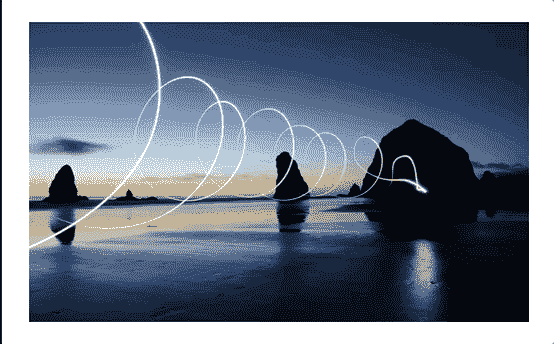
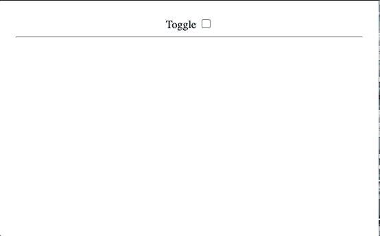
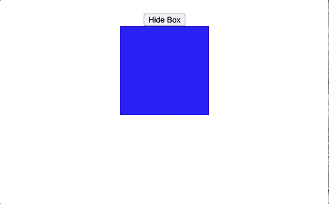
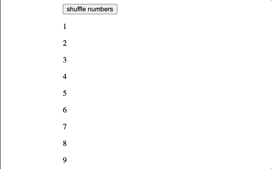
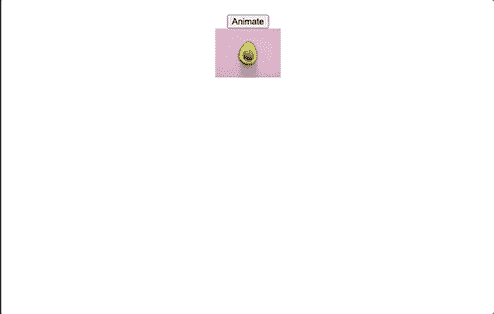
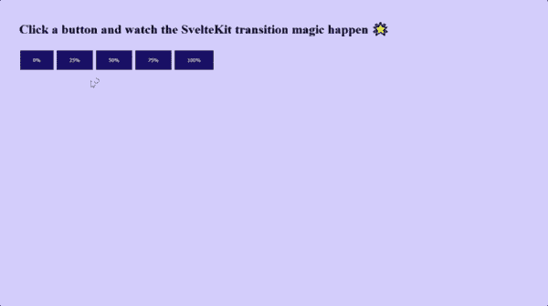

# 苗条日志博客中的基本过渡和动画

> 原文：<https://blog.logrocket.com/essential-transitions-and-animations-in-svelte/>

## 介绍

使用苗条的动画的一个很棒的事情是你不需要下载额外的包。动画和过渡内置于苗条。这意味着您可以在不增加应用程序大小的情况下，为其添加强大且令人愉快的交互。这也大大提高了应用程序的速度和性能。

在这篇文章中，我将解释如何在苗条的过渡和动画工作。我还提供了一些应用我们在实践中获得的知识的演示。

## 入门指南

我们首先用下面的代码安装`sveltejs`包:

```
npx degit sveltejs/template my-svelte-project

```

## 苗条的转变

Svelte 提供了七种过渡功能:`fade`、`blur`、`fly`、`slide`、`scale`、`draw`和`crossfade`。要使用这些函数，您必须从`svelte/transition`模块中导入它们。

下面是我们将向图像轮播过渡的演示:



让我们看看如何将过渡添加到图像轮播中。将下面的代码片段添加到您的`App.svelte`文件中:

```
<script>
  import { fade, blur, fly, slide, scale } from "svelte/transition";
  import { quintOut } from "svelte/easing";

  let books = [
    //array of links to books
  ];

  setInterval(() => {
   //logic goes here
  }, 1000);
</script>
<section style="display:flex;justify-content:center">
  {#each books as book, i}
    {#if activeIndex === i}
      
    {/if}
  {/each}
</section>

```

在上面的代码片段中，我们导入了将要使用的转换函数。我们还导入了`quintOut`缓动函数。Svelte 提供了几个现成的缓解功能。

为了增加苗条的过渡，我们使用了`transition`指令。我们将`transition`指令传递给`img`元素。

转换函数可以接受参数。我们通过传入一个配置对象来定义转换的`delay`、`duration`和`easing`。

## 入和出过渡

当在 Svelte 中处理转换时，我们可以为元素的`in`和`out`转换定义单独的转换函数。下面的 gif 是我们将要制作的`in`和`out`过渡的演示:



让我们在另一个演示中实现`in`和`out`过渡。将下面的代码复制到您的`App.svelte`文件中:

```
<script>
  import { fade, scale } from "svelte/transition";
  let show = false;
</script>

<label>
  Toggle
  <input type="checkbox" bind:checked={show} />
</label>
<hr />
{#if show}
  <h1 in:scale out:fade>My name is Nefe James</h1>
{/if}

```

我们为`in`和`out`切换出`transition`指令。和`transition`指令一样，参数也可以传入`in`和`out`。

## 自定义过渡

您可能想要定义自定义过渡，并且您可以在 Svelte 中完成。在引擎盖下，每个转换都是一个获得一个节点和一个参数的函数。

下面的 gif 显示了我们将创建的自定义过渡:



让我们看看如何创建苗条的自定义过渡。将下面的代码复制到您的`App.svelte`文件中:

```
<script>
  import { elasticInOut } from "svelte/easing";
  let isActive = true;
  const customTransition = () => {
    return {
      css: (t) => {
        return `
        transform: scale(${t});
        `;
      },
      easing: elasticInOut,
      duration: 2000,
    };
  };
</script>

<main>
  <button on:click={() => (isActive = !isActive)}>
    {#if isActive} Hide Box {:else} Show Box{/if}
  </button>
  {#if isActive}
    <div class="box" transition:customTransition />
  {/if}
</main>

```

我们定义了一个名为`customTransition`的函数。这个函数返回一个 css 属性，`easing`和`duration`。css 属性是一个以`t`为参数的函数。

`t`表示从 0 到 1 可用的过渡帧。我们使用`t`的值来设置对象的比例。然后我们把`customTransition`传给盒子。

## 苗条的动画

Svelte 提供了一个可以从`svelte/animate`模块访问的`flip`动画功能。当你想要添加动画到一个重新排序的项目列表中时，使用`animate`指令。下面的 gif 显示了翻转动画在制作项目列表动画时是如何工作的:



让我们来看看如何制作翻转动画。将下面的代码复制到您的`App.svelte`文件中，以便跟进:

```
<script>
  import { flip } from "svelte/animate";

  let numbers = [1, 2, 3, 4, 5, 6, 7, 8, 9];

  const shuffle = () => {
    numbers = numbers.sort(() => 0.5 - Math.random());
  };
</script>
<main>
  <button on:click={shuffle}>shuffle numbers</button>
  <div>
    {#each numbers as number (number)}
      <p animate:flip>{number}</p>
    {/each}
  </div>
</main>

```

在上面的代码片段中，我们将一组数字从 1-9 进行混排。为了制作洗牌的动画，我们从从`svelte/animate`导入`flip`开始。

我们通过`animate`指令将`flip`传递给`p`标签。每当点击按钮时，Svelte 跟踪并动画显示数字位置的变化。

## 控制元素在苗条中运动

`svelte/motion`模块导出两个函数，`tweened`和`spring`，用于创建可写存储，其值在`set`和`update`之后随时间变化，而不是立即变化。

下面的演示展示了`tweened`动画的实际效果:



让我们建立一个演示来看看运动是如何工作的。为了跟进，将下面的代码复制到您的`App.svelte`文件中:

```
<script>
  import { tweened } from "svelte/motion";
  import { quartInOut } from "svelte/easing";
  let src = "./pear.jpg";
  const width = tweened(100, {
    duration: 2000,
    easing: quartInOut
  });
  function handleClick() {
    width.set(150);
  }
</script>

<button on:click={handleClick}>Animate</button>
<br />


```

我们从`svelte/motion`导入`tweened`运动函数，从`svelte/easing`导入`quartInOut`缓动函数。

`Tweened`允许我们在动画序列中生成中间帧，以给出平滑运动的外观。`Tweened`接受初始值作为第一个参数，接受配置对象作为第二个参数。我们为`tweened`运动定义了`duration`和`easing`。

我们将图像的初始`width`设置为 100 像素。在`handleClick`函数中，我们将`width`更新为 150 像素。

然后，我们使用 Svelte 的`on`指令将`handleClick`传递给按钮。

现在我们知道了`tweened`动作是如何工作的，那么`spring`动作呢？

下面的演示展示了`spring`动画应用于元素时的样子:


将下面的代码复制到您的`App.svelte`文件中:

```
<script>
  import { spring } from "svelte/motion";
  let src = "./heart.jpg";
  const width = spring(100, {
    stiffness: 0.01,
    damping: 0.1
  });
  const zoomIn = setInterval(() => {
    width.set(200);
  }, 300);
  const zoomOut = setInterval(() => {
    width.set(100);
  }, 600);
</script>


```

`Spring`的工作方式与`tweened`相似，尽管它的配置对象接受`stiffness`和`damping`属性。我们使用`setInterval`函数在不同的时间间隔改变图像的宽度，而不是在点击按钮时运行这个动画。这给我们一个跳动的心脏的外观。

## SvelteKit 中的过渡和动画

过渡和动画在 SvelteKit 中的工作方式与在 Svelte 中相同。让我们在 SvelteKit 中设置一个动画。

下面的演示展示了`tweened`在苗条套装中的过渡效果。请注意，在实现或外观上没有区别:



将下面的代码复制到您的`App.svelte`文件中，以便跟进:

```
<script>
  import { tweened } from "svelte/motion";
 import { cubicOut } from "svelte/easing";
 const progress = tweened(0, {
   duration: 4000,
   easing: cubicOut,
 });
</script>

  <h1>Click a button and watch the SvelteKit transition magic happen 🌟</h1>

<progress value={$progress} />
<div class="buttons">
  <button on:click={() => progress.set(0)}> 0% </button>
  <button on:click={() => progress.set(0.25)}> 25% </button>
  <button on:click={() => progress.set(0.5)}> 50% </button>
  <button on:click={() => progress.set(0.75)}> 75% </button>    
  <button on:click={() => progress.set(1)}> 100% </button>
</div>

```

就像我们在 Svelte 中做的那样，我们从`svelte/motion`导入`tweened`以及一个缓动函数。我们定义了一个`progress`变量，并将进度条的值设置为该变量。

每当单击任何按钮时，进度条的值都会更新，我们会看到从一个值到另一个值的漂亮转换。

## 结论

添加微妙的动画和过渡效果是让访问者关注你的内容的好方法。如果做得正确，动画会让你的网站或应用程序更引人注目，并且有助于提高用户参与度。

苗条的过渡和动画是可怕的。Svelte 团队在将内置动画、过渡、运动和季节打包到库中方面做得非常好。

## 使用 [LogRocket](https://lp.logrocket.com/blg/signup) 消除传统错误报告的干扰

[](https://lp.logrocket.com/blg/signup)

[LogRocket](https://lp.logrocket.com/blg/signup) 是一个数字体验分析解决方案，它可以保护您免受数百个假阳性错误警报的影响，只针对几个真正重要的项目。LogRocket 会告诉您应用程序中实际影响用户的最具影响力的 bug 和 UX 问题。

然后，使用具有深层技术遥测的会话重放来确切地查看用户看到了什么以及是什么导致了问题，就像你在他们身后看一样。

LogRocket 自动聚合客户端错误、JS 异常、前端性能指标和用户交互。然后 LogRocket 使用机器学习来告诉你哪些问题正在影响大多数用户，并提供你需要修复它的上下文。

关注重要的 bug—[今天就试试 LogRocket】。](https://lp.logrocket.com/blg/signup-issue-free)