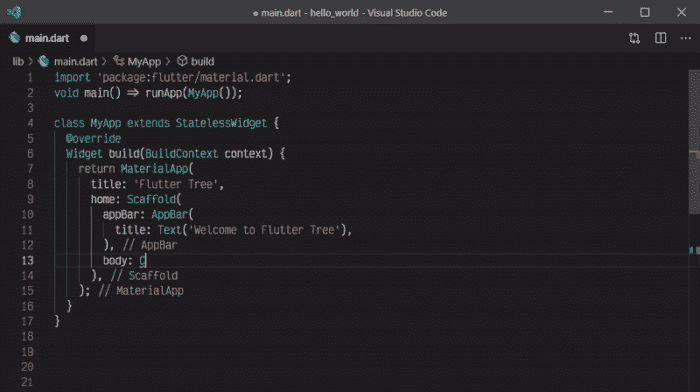
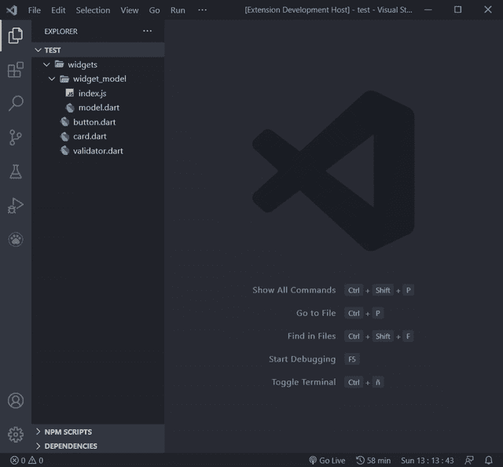
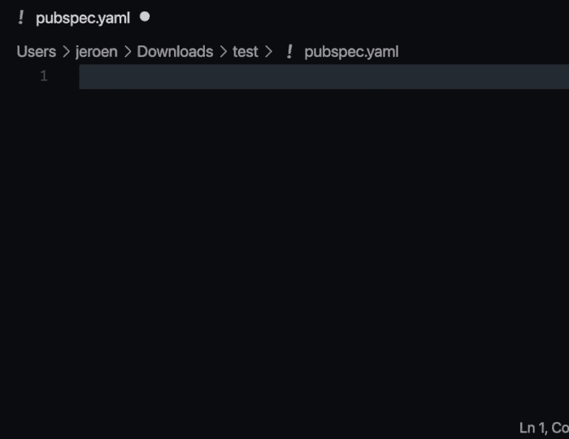
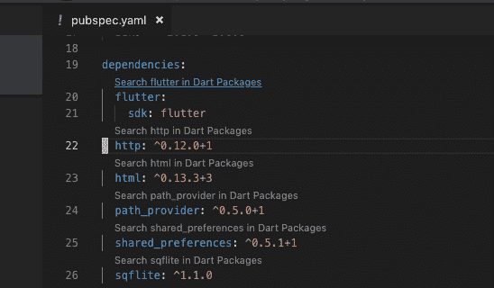
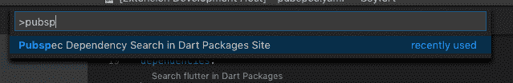
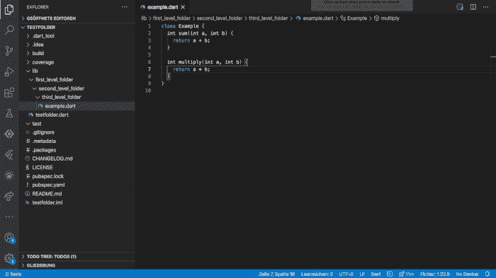
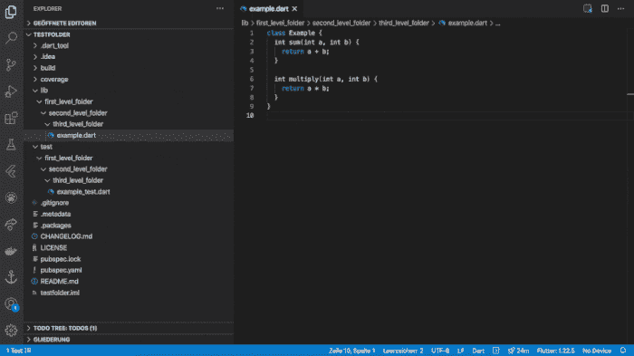
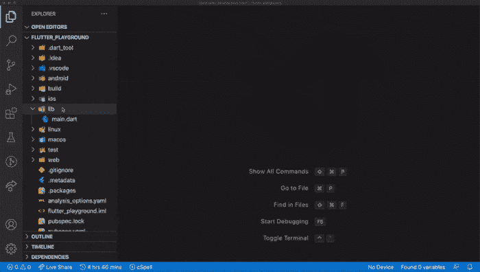
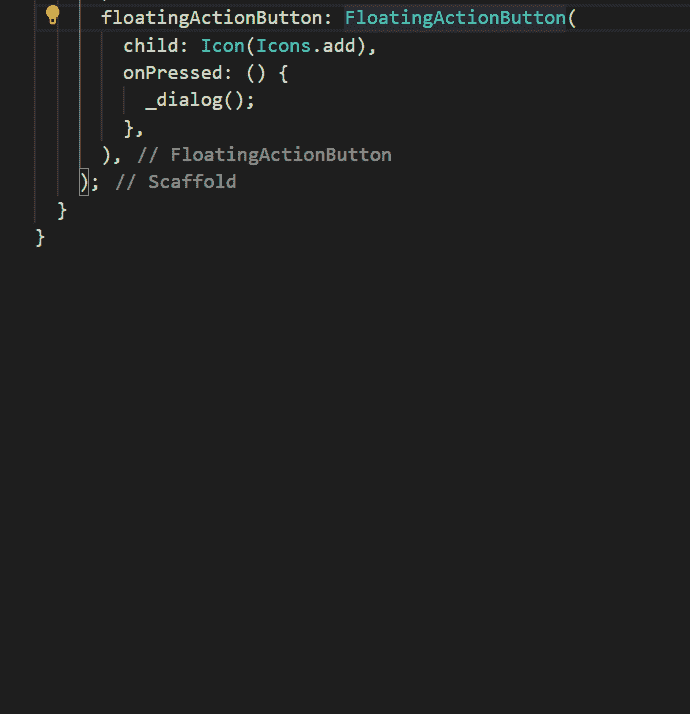
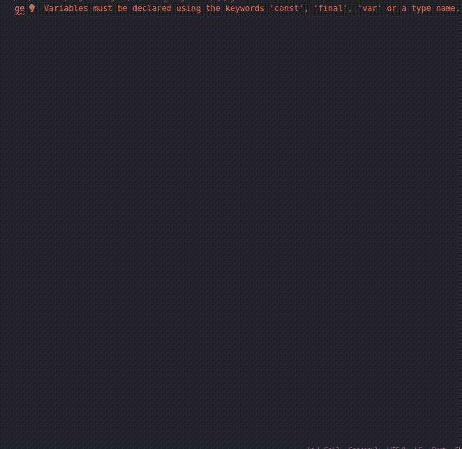

# Flutter - LogRocket 博客的基本 VS 代码扩展

> 原文：<https://blog.logrocket.com/essential-vs-code-extensions-for-flutter/>

[Aachman Garg Follow](https://blog.logrocket.com/author/aachmangarg/) I'm a student and Flutter developer. Other than that, my skills and interests revolve around graphic design, PowerPoint, technical writing, and music production.

# 颤振的基本 VS 代码扩展

## 

2021 年 6 月 2 日 2 分钟阅读 704

## 介绍

Flutter 足够灵活，允许我们使用任何文本编辑器或 IDE 编写应用程序。然而，使用由 Flutter 团队提供插件支持的 ide 是一种更好的开发体验。代码完成、语法突出显示、小部件编辑辅助以及运行和调试支持等功能使应用程序开发过程更加高效和轻松。

在本文中，我将带您浏览一些有用的 VS 代码扩展，以增强您的 Flutter 开发工作流。以下是我们将涉及的扩展类型:

*   必需品；要素
*   代码片段
*   Pubspec 助手
*   测试
*   体系结构

## 必需品；要素

### 飞镖和飘动

[Dart](https://marketplace.visualstudio.com/items?itemName=Dart-Code.dart-code) 和 [Flutter](https://marketplace.visualstudio.com/items?itemName=Dart-Code.flutter) 扩展支持 VS 代码中的 Dart 编程语言。我们得到了有效编辑、重构和运行 Flutter 和 Angular web 应用程序的工具。

这些扩展由 Flutter 团队自己开发和维护，提供了许多特性，如热重新加载和重启、代码完成和一些调试选项。

这些特性极大地影响了开发体验。因此，对于任何使用 Flutter 开发应用程序的人来说，它们都是必不可少的选择。

## 代码片段

### 可怕的颤动片段

在 Dart 团队正式发布之后，是最受欢迎的扩展之一。它提供了许多用速记写代码的片段。例子有用于 Material App 的`mateapp`，用于有状态小部件的`statefulW`，用于 InitState 的`initS`。

### 颤动树

[Flutter Tree](https://marketplace.visualstudio.com/items?itemName=marcelovelasquez.flutter-tree) 提供了一种非常简洁的方式来编写窗口小部件树。

它看起来是这样的:

```
Container(
  child: Column(
    children: [
      Child1(
        child: Child2,
      ),
      Child3(),
    ],
  ),
),

// Can be replaced by the following:

Container>Column[Child1>Child2,Child3]

```

一旦你按下回车键，整个部件树代码就完美地展开了:



### 镖桶文件生成器

[飞镖桶文件生成器](https://marketplace.visualstudio.com/items?itemName=miquelddg.dart-barrel-file-generator)顾名思义:它为包含飞镖文件的文件夹生成桶文件。桶文件是这样一个文件，我们在其中编写`export`语句来导出库或文件夹中的其他文件。这使得导入包更加容易，因为我们只需要导入一个文件，而不是多个。

这个简单的扩展为任何特定的文件夹生成桶文件。只需右键单击所需的文件夹，并选择两个选项之一来生成文件:



## Pubspec 助手

### Pubspec 辅助

[Pubspec Assist](https://marketplace.visualstudio.com/items?itemName=jeroen-meijer.pubspec-assist) 绝对是最有用的扩展之一。它让我们用一个简单的命令安装和更新任意数量的软件包。

即使不确定包的确切名称，我们也可以轻松地搜索包，因为 Pubspec Assist 足够智能，可以找到正确的包:



### Pubspec 相关性搜索

[Pubspec 依赖搜索](https://marketplace.visualstudio.com/items?itemName=everettjf.pubspec-dependency-search)覆盖了与之前扩展完全不同的用例。它帮助我们搜索软件包，只需单击软件包名称或使用命令:





在第一幅图中，我们被带到了 pub.dev 中相关包的页面。在第二幅图中，显示了搜索结果页面。

## 测试

### 更好的颤振试验

如果你拖延编写测试，这是给你的。对于任何文件， [Better Flutter Tests](https://marketplace.visualstudio.com/items?itemName=andreasblech.better-tests) 都会生成一个带有样板文件的相应测试文件。如果项目文件的名称或文件夹结构发生更改，测试文件也会发生相应的更改。这使一切保持同步，完整性得到维护。

你可以从下面的 gif 图片中看到这一点:





## 体系结构

### 集团

块架构的唯一缺点是它带来的样板文件。谢天谢地，我们已经用[阻塞了](https://marketplace.visualstudio.com/items?itemName=FelixAngelov.bloc)来生成从文件到模板代码的一切。它还支持 Cubit 包，并提供各种代码片段:



### Flutter 提供程序片段

[Flutter Provider Snippets](https://marketplace.visualstudio.com/items?itemName=Zaraclaj.flutter-provider-snippets) 是一个代码片段的集合，帮助我们编写在提供者架构中常用的类和方法。例子包括`consumer`、`selector`和`proxyProvider`。

### flutter_mobx

[Flutter_mobx](https://marketplace.visualstudio.com/items?itemName=Flutterando.flutter-mobx) 提供代码片段和工具，有助于代码重构。这也使得运行代码生成器更加直观。




### GetX 片段

GetX Snippets 功能强大，就像软件包本身一样。这个集合提供了从生成模型到页面，再到 ListView 或表单之类的复杂小部件的各种代码片段。如果你使用 GetX 库，这个扩展可以大大加快你的工作流程。




## 结论

本文涵盖了最有用的 VS 代码扩展，对于任何 Flutter 开发人员来说都是必备的。我相信这些会让你更有效率，让你的开发时间物有所值。

## 使用 [LogRocket](https://lp.logrocket.com/blg/signup) 消除传统错误报告的干扰

[](https://lp.logrocket.com/blg/signup)

[LogRocket](https://lp.logrocket.com/blg/signup) 是一个数字体验分析解决方案，它可以保护您免受数百个假阳性错误警报的影响，只针对几个真正重要的项目。LogRocket 会告诉您应用程序中实际影响用户的最具影响力的 bug 和 UX 问题。

然后，使用具有深层技术遥测的会话重放来确切地查看用户看到了什么以及是什么导致了问题，就像你在他们身后看一样。

LogRocket 自动聚合客户端错误、JS 异常、前端性能指标和用户交互。然后 LogRocket 使用机器学习来告诉你哪些问题正在影响大多数用户，并提供你需要修复它的上下文。

关注重要的 bug—[今天就试试 LogRocket】。](https://lp.logrocket.com/blg/signup-issue-free)