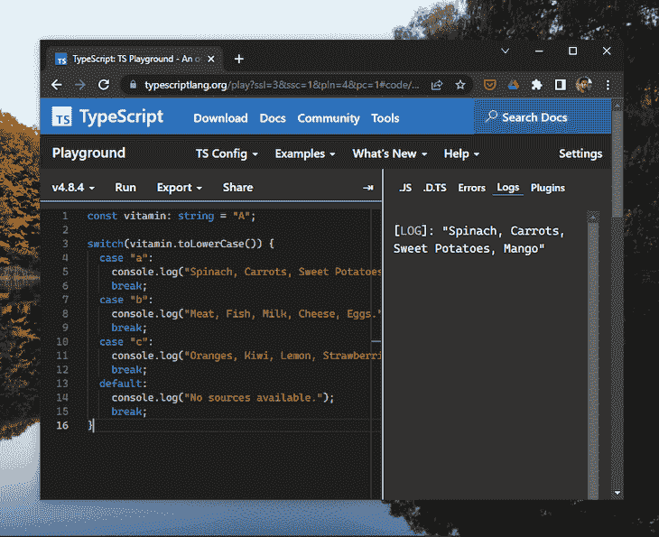
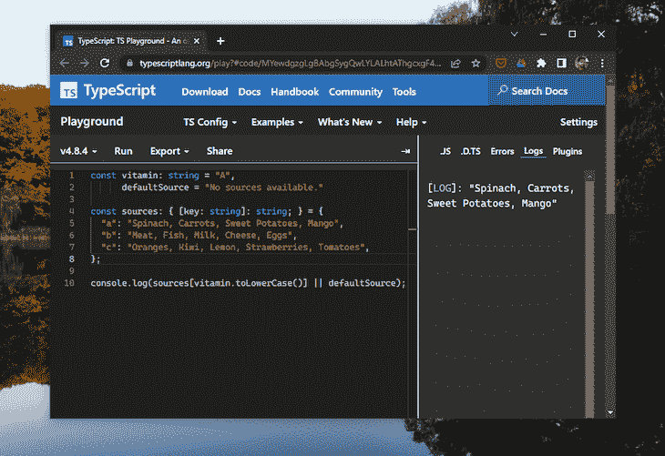
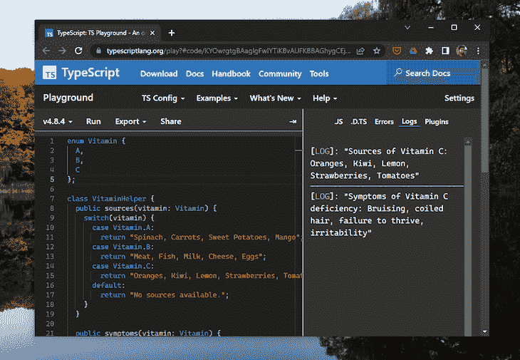
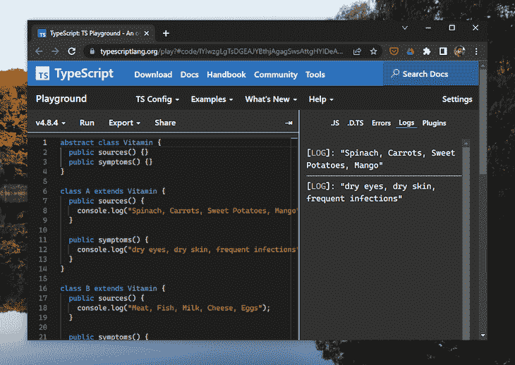

# 评估 TypeScript 开关情况的替代方案

> 原文：<https://blog.logrocket.com/evaluating-alternatives-typescript-switch-case/>

Switch case 语句因其缺点正引起编程社区的关注。一些开发人员声称 switch 外壳的冗长和笨重是完全放弃使用它们的原因。然而，switch case 语句有那么糟糕吗？

本文将讨论 [TypeScript 的](https://blog.logrocket.com/tag/typescript/) switch 用例的优缺点，涵盖一些备选方案，并查看哪些备选方案最适合各种用例。

*向前跳转:*

## 什么是 switch case 语句？

开关盒块是一种控制结构，它根据给定条件提供的输出执行不同的动作。在 [JavaScript](https://blog.logrocket.com/tag/vanilla-javascript/) 中，switch case 块的 switch 关键字需要一个条件来求值。相比之下，块中的其他语句代表该条件的可能结果或情况及其相关操作。

找到匹配项后，将执行与该匹配项相关联的语句。如果没有找到匹配项，则执行 default 语句，并且控制离开 switch case 块。

因为 TypeScript 是 JavaScript 的超集，所以除了一些类型引入之外，大多数过程将保持不变。

下面的示例解释了 TypeScript 中 switch case 的用法:

```
 const vitamin: string = "A";

switch(vitamin.toLowerCase()) {
  case "a":
    console.log("Spinach, Carrots, Sweet Potatoes, Mango");
    break;
  case "b":
    console.log("Meat, Fish, Milk, Cheese, Eggs.");
    break;
  case "c":
    console.log("Oranges, Kiwi, Lemon, Strawberries, Tomatoes");
    break;
  default:
    console.log("No sources available.");
    break;
}

```



参见 [TypeScript Playground](https://www.typescriptlang.org/play?#code/MYewdgzgLgBAbgSygQwLYLALhtAThgcxgF4YAiAQTIG4AoWiAdyWAAsAKRFdMAOihAAZEIwCmuAMLIIo9gEo5MAN60YMYNNHlkZTKrXrwEEABtRvEyALsyAZQAOGZGwA0MKblwgoEN7bGisAAK3sgCor4wALLIYAQgZHJ0BjAARriiyADWyeqa5Km6+mqgkKbmltZkUZlQbgBiCBCsblEIJlluEqyiEaJuAKIEBBC8iblq6Zk5+hoy5MBFKaXGZhZWNgDyuLEEEW4A0gjMboKiqOB+UDuMqeL4+zAAKiCoYSAR48VpGdm5ACaiABmyAAriYoHplkZyusqgA5EA4ECg3DACIwZBwZDtZCpNZfFJTP60AC+QA) 中的这个例子。

在上面的代码中，我们给变量`Vitamin`添加了一个`string`类型，它代表了 TypeScript 的[类型安全](https://blog.logrocket.com/building-type-safe-dictionary-typescript/)特性。

## TypeScript 开关大小写优点

Switch case 块替代了冗长的嵌套的`if-else`语句。尽管有替代方案，但开关箱仍有一些优点:

*   优雅:打字开关比`if-else` 块更优雅，更容易阅读
*   性能:切换案例比`if-else`性能更好，执行速度更快
*   小规模可维护性:开关盒比冗长的`if-else` 模块提供更好的可维护性

尽管 switch case 语句的性能优于`if-else`块，但在高级场景中看起来并不令人印象深刻。考虑到现代软件开发过程，开关案例有明显的缺点。

## TypeScript 开关大小写组合

虽然开关用例的实用性没有问题，但开发人员真正的痛苦是误用它们，这很可能是因为开关用例的潜在问题而发生的:

### 冗长

现在的开发人员倾向于避免冗长的代码。请看下面的代码块，这是一个关于切换情况如何导致更详细代码的示例:

```
const day: number = 1;
switch (day) {
  case 1: console.log("Monday");
    break;
  case 2: console.log("Tuesday");
    break;
  case 3: console.log("Wednesday");
    break;
  case 4: console.log("Thursday");
    break;
  case 5: console.log("Friday");
    break;
  case 6: console.log("Saturday");
    break;
  case 7: console.log("Sunday");
    break;
  default: console.log("Invalid Input !!!!");
}

```

在上面的代码中，`case`和`break`的重复使用使得代码庞大而冗长。

### 易出错的

switch case 子句中缺少`break`关键字会导致令人沮丧的错误。尽管这些错误在小项目中可能看起来不严重，但在具有巨大代码库的项目中可能会导致严重的错误。

switch case 块容易出错的特性使得它们在大型项目中用处不大，最终对开发人员的吸引力也不大。

### 大规模可维护性差

尽管在较小的项目中，switch 用例比`if-else`语句具有更好的可维护性，但是它们的庞大和容易出错的行为损害了它们的可维护性。众所周知，随着项目的增长，Switch case 语句会降低代码的可维护性。

如今，开发人员更喜欢使用替代方案来切换用例，以保持他们的代码更具可读性和可维护性。

## 使用对象查找表作为 TypeScript 的切换大小写的替代

在 JavaScript 和 TypeScript 中， [object](https://blog.logrocket.com/dynamically-assign-properties-object-typescript/) lookup 是避免切换情况的最常见方法。这种技术使用一个像表一样的对象文字，带有可能的情况及其相关动作，并使用它:

```
const vitamin: string = "A",
      defaultSource = "No sources available."

const sources: { [key: string]: string; } = {
  "a": "Spinach, Carrots, Sweet Potatoes, Mango",
  "b": "Meat, Fish, Milk, Cheese, Eggs", 
  "c": "Oranges, Kiwi, Lemon, Strawberries, Tomatoes",
};

console.log(sources[vitamin.toLowerCase()] || defaultSource);

```



参见 [TypeScript Playground](https://www.typescriptlang.org/play?#code/FAYw9gdgzgLgBANwJYwIYFskQFx1gJywHM4BeOAIgEEKAaYORpgEwFMAzVAVwBsYBlMF3whWZSgDkweISNZQ4qBKiQ9UAIx6sAdBWChIsGcNFRcAbzgBtANasAnrgLEAuk5iEIRANxwAvuLmDJSoFLgU-AAOWKggABa0cADCqPj4YDBQifwA7qys8AAKGagwYPKJALKoXmB0wRTqYZSVrKWJAGJIUAlwlao2iUlx+VCsiQCiRERQdHANIM0UAPL4NUQVcADSSDlIiQAyrOiQ2R6oOeqsaUibACpg6KXls-R+3vrg0GBa2jxgRAAFFBZKYrMg0JgINoygcwHl8CkxoCAJQuOAAHwxcDYnF4AlBrBR3iAA) 中的这个例子。

与使用开关盒块相比，这看起来更整洁、更容易。

对象查找技术最重要的一点是，与 switch case 块不同，它们不需要为每个 case 添加一个`break`。这可以防止您遗漏`breaks`并导致错误，这在处理大型代码库时很有帮助。

对象查找表不太冗长，易于阅读和扫描。尽管这种替代开关的方法有好处，但它也有时间和内存的权衡。

当没有很多案例要评估时，对象查找方法可能没有切换案例快。由于对象是一种数据结构，访问键比简单地检查值并返回它们需要更多的工作，就像我们在 switch 案例中所做的那样。

JavaScript 对象缓存在内存中，一旦对象范围不再存在，垃圾收集器就会立即清除该对象。更多的对象键占用更多的内存，增加了空间的复杂性。

在最终确定大对象表在项目中的用途之前，测试它们的性能总是一个好主意。

## 检查多态性和继承的好处

尽管 switch 外壳没有内存限制，但是它们很难维护。随着项目的增长，增加更多的案例和遗漏一个`break`会导致大问题，包括违反坚实软件设计的[开闭](https://en.wikipedia.org/wiki/Open%E2%80%93closed_principle)原则。

为了理解开关案例是如何违反开闭原则的，让我们看一下这个例子:

```
enum Vitamin {
  A,
  B,
  C
};

class VitaminHelper {
  public sources(vitamin: Vitamin) {
    switch(vitamin) {
      case Vitamin.A: 
        return "Spinach, Carrots, Sweet Potatoes, Mango";
      case Vitamin.B: 
        return "Meat, Fish, Milk, Cheese, Eggs";
      case Vitamin.C: 
        return "Oranges, Kiwi, Lemon, Strawberries, Tomatoes";
      default:
        return "No sources available.";
    }
  }  

  public symptoms(vitamin: Vitamin) {
    switch(vitamin) {
      case Vitamin.A: 
        return "Dry eyes, dry skin, frequent infections";
      case Vitamin.B: 
        return "Anaemia, fatigue, or poor balance, memory loss";
      case Vitamin.C: 
        return "Bruising, coiled hair, failure to thrive, irritability";
      default:
        return "No deficiency symptoms available.";
    }
  }
}

```



参见 [TypeScript Playground](https://www.typescriptlang.org/play?#code/KYOwrgtgBAaglgFwIYTiKBvAUFKBBAGhygCEjcBhLAXwG4ssBjAGyQGc3ZEU0AJYZgAdgAJ0zFBYAEbM4jKGwD2YEY2BsAFADduqEAC4uyPQEpxuXGwDuiRgAttutGewWLjdsCM8QAOjyGxG64IsAIKugARADKgmhI9gRQFEgiIooIbEnRVsBhUAAKGUgIiupJALJIIADmipH0wVAebF7wxmi+JIFNIWERUJEVwCVJAGJwbHaVcMwA1kkUdnmtSQCiNTVsDUHunt56vhQ9vaHhIlEA8iLVNeVQANJwNkkAMsAQiiDZCDdWUqIRHB7gAVRQQEplbaNYIAE2AADMkGBmAh9Ls3GcBpEAHKKBTKVTqKBILRIWZIGTAXw7NzUYjUXDECTSWTyNgATwgglKEE0Og6BgOznMFmstgcAp8LgxzX27R8-hOTSxF0GABERByoMAOfdYVqFHM0EkEaEAI5gUAIKBoBHARgIOBfaGylptJx+bpQWV9c5RPAgJAfOBIU0lOA1K1JRRiQSKWNQKRIVggNRJCAfWPa5iKDi04Lu4V+Y4+3pQVVREgiMCTNA1JKMRSzYCwqB2ckicOzFReUpQBB2IFaYBJOBpbhSWaIDkFtzwpEotG+iv9NW4-ELuTAtPaznc3mcUnk1hUmkw3D0y80BjMfJaOxQAC8UBAwCsxf4QlEGhM9CbIBKHevi5jUGgAAbRISaicIoCLFskhgACQYA+vhKCoMEaAqhwUCY1DgX+TAuoowGgRB0Rcjy4KwfBOFoMkUBbowO6MByyGoXY6FUYe2Gekc+GEfQQA) 中的这个例子。

为了简单起见，我在示例中避免使用`break`关键字，而是使用了`return`。

上面的代码显示了使用`VitaminHelper`类中的 [`enum`](https://blog.logrocket.com/extend-enums-typescript/) 有两种方法来处理维生素来源和缺乏症状。

两种方式都使用`Vitamin`来执行开关情况，以确定情况并采取适当的行动。如果我们给`enum`增加几个`vitamin`值，我们必须修改这两种方法。

在大型项目中实现 switch case 语句的相似模式增加了不良的可维护性，并使实体容易被修改——违反了软件设计的开闭原则。

在上面的例子中，如果我们用一个对象表替换 switch case，那么每当添加一个新的对象键时，每个方法仍然需要更新。它不会解决可维护性问题。

### 面向对象的更好的可维护性

TypeScript 支持 OOP 编程范式，这有助于在不使用切换用例或对象查找表的情况下创建更健壮和可维护的代码。让我们检查 OOP 中的多态性和继承，作为 TypeScript 中 switch case 块的替代。

继承允许我们从现有的基类中派生出一个类。通过多态，我们可以改变基类现有成员的行为。让我们使用这些概念来修复我们当前代码糟糕的可维护性。

首先，我们需要删除限定了作用域的枚举，并编写一个`abstract`类，其中包含我们将在后续类中继承的两个方法:

```
abstract class Vitamin {
  public sources() { /* Default sources */ }
  public symptoms() { /* Default symptoms */ }
}

```

遵循多态性和继承概念，我们可以编写不同的类来扩展我们的基类并覆盖它的默认方法:

```
class A extends Vitamin {
  public sources() {
    return "Spinach, Carrots, Sweet Potatoes, Mango";
  }
  public symptoms() {
    return "Dry eyes, dry skin, frequent infections";
  }
}
class B extends Vitamin {
  public sources() {
    return "Meat, Fish, Milk, Cheese, Eggs";
  }
  public symptoms() {
    return "Anaemia, fatigue, or poor balance, memory loss";
  }
}
class C extends Vitamin {
  public sources() {
    return "Oranges, Kiwi, Lemon, Strawberries, Tomatoes";
  }
  public symptoms() {
    return "Bruising, coiled hair, failure to thrive, irritability";
  }
}

```

现在，每当引入一个新的`Vitamin`时，我们可以重复上面的过程，并编写一个新的`Vitamin`关联来扩展我们的基类。

```
class D extends Vitamin {
  public sources() {
    return "Sunlight, Salmon, sardines, red meat, egg yolks";
  }
  public symptoms() {
    return "Fatigue, bone pain or achiness, hair loss";
  }
}

```



参见[打字稿操场](https://www.typescriptlang.org/play?#code/IYIwzgLgTsDGEAJYBthjAgagSwsAttgHYIDeAUAggA4CuIy2sCYA9rVLAKZgAUAlGQC+lGvUbMwAT3zUIrfH0GkRI8ijQYAggi4APCFyIATDDjyESFKnQZMW7TjwFlRVWKyJtkXAHTJWAHNeACIAZWpiOAALABoEAGFgKChWCDB4sIB3Li5EAAU04HkeeIBZYCJA1hD+AG5RNRtxe2lZeUUXayokT28-AOCQ4ygpXSlShBGxsABrYniAMyguAEdaI0RiRa54bD7ahqpVcnVUdAQAIV0DI1MsXAJiV2a7SUduJReejy9WH38QVCZS4xXiADFsGA4ggythkLN4glorkwFx4gBRQKBMCHRqnV4SFgyOQKL7ddx9f4DIEhSrALiEYBLYrYQIbeKsKA0VhchAgYCoIjceL4RlcsYBdB447kNQaC4JG6GExmR6Wb62IlsDifLpuXp-AGDUIAeRgVUmAGlsFlsPEADLioiZaDALIgLgpbCTAAqCmKrB4MoQTTEb2J7TJ+p6hv6gKGICgtChxEC8Q88K4xgQ0WA2CgLPhHC4CHkZeiUGwADd0QgC1W8CB4bgpCGTuo+ohq9EEABeBBELhZBBaAQNcg93w6pxKSfRackjpKIA)中的这个例子。

在上面的例子中，TypeScript 中 OOP 的继承属性允许我们在不同的子类中重复基类的行为。类 `A` 、 `B` 、 `C` 是`Vitamin`的子类，继承其所有属性。

多态帮助我们改变了基类的形式和行为。这在重写或重新定义每个子类中的`sources()`和`symptoms()`方法时得到了证明。

不像 switch case 语句，它需要我们不断地修改现有的类，多态避免了这一点，更易于维护和理解。

我们现在可以定义一个子类，它扩展基类`Vitamin`并在需要引入新的`Vitamin`值时覆盖它的行为。

## 结论

我们学习了 TypeScript 的 switch case 语句，它们可能引起的麻烦，以及它们的一些替代方案。Switch case 语句对小型业余项目没有害处，但是随着项目的增长，使用替代方法来避免 switch case 会更容易。

如果内存不是问题，对象查找技术是切换情况的一个很好的替代方法。对于有增长潜力的项目，最好使用多态和继承来明确指定不同的情况，并保持可维护性。

我希望你喜欢读这篇文章。请在评论中告诉我你的想法。

## [LogRocket](https://lp.logrocket.com/blg/typescript-signup) :全面了解您的网络和移动应用

[](https://lp.logrocket.com/blg/typescript-signup)

LogRocket 是一个前端应用程序监控解决方案，可以让您回放问题，就像问题发生在您自己的浏览器中一样。LogRocket 不需要猜测错误发生的原因，也不需要向用户询问截图和日志转储，而是让您重放会话以快速了解哪里出错了。它可以与任何应用程序完美配合，不管是什么框架，并且有插件可以记录来自 Redux、Vuex 和@ngrx/store 的额外上下文。

除了记录 Redux 操作和状态，LogRocket 还记录控制台日志、JavaScript 错误、堆栈跟踪、带有头+正文的网络请求/响应、浏览器元数据和自定义日志。它还使用 DOM 来记录页面上的 HTML 和 CSS，甚至为最复杂的单页面和移动应用程序重新创建像素级完美视频。

[Try it for free](https://lp.logrocket.com/blg/typescript-signup)

.